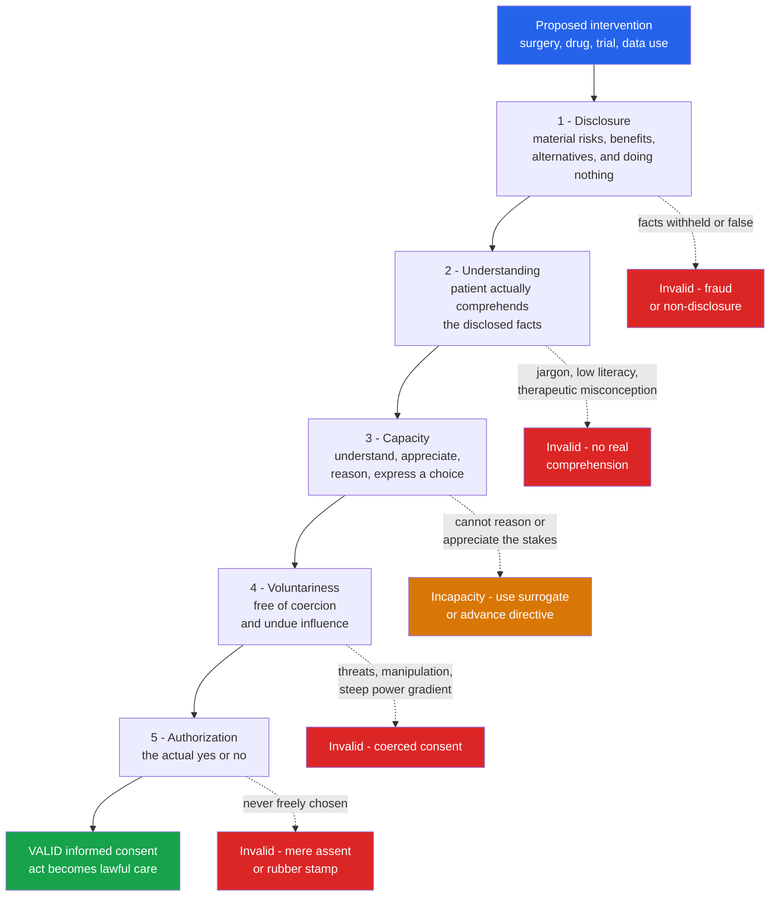

# 🩺 Informed Consent and Autonomy

> [!abstract] TL;DR
> **Informed consent** is the process by which a person with **decision-making capacity**, after **adequate disclosure** and genuine **understanding**, **voluntarily authorizes** an intervention on their own body or data. Its moral engine is **respect for autonomy** — the Kantian idea that persons are ends-in-themselves, not objects to be worked on for their supposed good. Valid consent has five elements — **disclosure, understanding, voluntariness, capacity, authorization** — and a failure of any one voids it. It is a *process*, not a signature; capacity is **decision-specific** and judged on a **sliding scale** (riskier choices demand a higher threshold); and where capacity is absent, ethics falls back to **advance directives**, **substituted judgment**, and **best-interests** standards. Born from the atrocities that produced the **Nuremberg Code**, informed consent remains contested at its edges: therapeutic misconception, health literacy, framing and nudging, data and biobank consent, and the charge that a purely individualist autonomy misreads how real people decide.

## Intuition — analogy first

**A surgeon's scalpel cuts identically whether the patient said yes or not. What changes everything is invisible.** The very same incision — same depth, same blade, same hand — is a **criminal assault** in one case and **healing care** in the other. The only difference between battery and medicine is a piece of moral "magic" that happens entirely in the patient's mind and words beforehand: *authorization*. Consent is the spell that transforms an act of cutting into an act of caring.

This is why consent is not paperwork. A signature is just the *receipt*; the transformation is the free, informed, competent **"yes."** If the patient didn't understand, was pressured, lacked the capacity to decide, or was never told the risks, the magic never happened — no matter how neat the signature. The scalpel is then back to being a weapon, and the "care" back to being an assault. Everything in this note is really an account of what has to be true for that transformation to genuinely occur.

---

## How It Works — The Five Elements of Valid Consent

Consent is valid only when **all five** components are present. Think of them as a chain: the intervention becomes lawful, respectful care only if every link holds. Break any one — a withheld risk, a jargon-filled form, a coercive threat, an impaired mind, a rubber-stamp signature — and what remains is not consent but its counterfeit.



The ordering is not accidental. **Capacity** is assessed early because it is the gatekeeper: a person who cannot understand or reason cannot be *informed* in any meaningful sense, so the process shifts to a surrogate. **Voluntariness** and **authorization** come last because they presuppose the rest — a "yes" is only worth something once the person is capable, informed, and free.

---

## Key Concepts

### Secondary — the plain idea

At its simplest, informed consent is the rule that **nothing may be done to your body without your permission**, and that permission only counts if you actually knew what you were agreeing to. It rests on a moral bedrock most people already accept: *you are the boss of your own body.* This is **autonomy** — from the Greek *autos* (self) and *nomos* (rule): self-rule.

Two everyday truths follow. First, an adult of sound mind may **refuse** even life-saving treatment (a Jehovah's Witness declining a blood transfusion), because respecting autonomy means respecting choices we think are mistaken. Second, consent is only real if it is *free* and *informed* — a "yes" extracted by a lie, a threat, or from someone too confused to understand is not consent at all. The signature on the form is evidence of consent, not consent itself.

### Undergraduate — the moral basis, the elements, and the standards

**The moral basis: respect for autonomy.** Modern medical ethics treats autonomy as one of the four *prima facie* principles (see [[Principles_of_Biomedical_Ethics]]) and consent as its clinical expression. Two philosophical roots dominate. **Kant's** Formula of Humanity (see [[Deontology_and_Kantian_Ethics]]) demands that we treat persons *always as ends, never merely as means* — to operate on someone without their authorization is to use their body as a mere instrument of your judgment about their good. **Mill's** liberty principle adds that over their own body and mind, the individual is sovereign; society may not coerce a competent adult "for their own good" (anti-paternalism; see [[Liberty_and_Rights]]).

**The five elements.** Faden and Beauchamp's canonical analysis decomposes valid consent into:

| Element | What it requires | How it fails |
|---|---|---|
| **Disclosure** | Tell the patient the *material* information: diagnosis, nature of the intervention, risks, benefits, **alternatives**, and the consequences of **doing nothing** | Withholding material risks; deception; burying facts in fine print |
| **Understanding** | The patient must actually *comprehend*, not merely receive, the information | Jargon, low health literacy, cognitive overload, therapeutic misconception |
| **Voluntariness** | The choice must be free of **coercion** (threats) and **undue influence** (manipulation, exploiting a power gradient) | Pressure from clinicians, family, or the desperation of illness |
| **Capacity** | The patient must be *able* to make this decision (see below) | Impaired reasoning, unconsciousness, severe cognitive impairment |
| **Authorization** | The actual, active *granting* of permission for this specific intervention | A blanket signature; passive acquiescence; a "yes" that was never a real choice |

**Standards of disclosure — how much must be told?** Law and ethics have converged on the patient's perspective, but three standards exist:
- **Professional / reasonable-physician standard:** disclose what a competent doctor customarily would. Criticized as letting the profession set the bar and enabling paternalism.
- **Reasonable-patient standard:** disclose what a *reasonable patient* would find **material** to the decision (*Canterbury v. Spence*, 1972; UK's *Montgomery v. Lanarkshire*, 2015). Now dominant.
- **Subjective standard:** disclose what *this particular* patient would want to know. The most autonomy-respecting but hardest to operationalize and to prove in court.

**Decision-making capacity.** Capacity is a *functional, decision-specific, and time-specific* judgment — not a global label. A person may lack capacity to manage finances yet retain capacity to choose a meal, or lose capacity during delirium and regain it after. Grisso and Appelbaum's influential model requires **four abilities**:
1. **Understand** the relevant information;
2. **Appreciate** how it applies to one's own situation (not just abstractly);
3. **Reason** with the information — weigh options against personal values;
4. **Express a choice**.

Crucially, capacity is judged on a **sliding scale (risk-related standard)**: the graver the consequences of a decision, the higher the capacity threshold demanded. Consenting to an aspirin needs little; refusing a life-saving amputation needs a demonstrably robust capacity. (The Python demo below models exactly this tradeoff.) *Competence* is the parallel **legal** determination; *capacity* is the clinical judgment feeding into it.

**When consent is not required, or is given by proxy.** Autonomy cannot be exercised by someone who lacks capacity, so ethics supplies substitutes:
- **Emergency exception:** in a life-threatening emergency with no time and no known refusal, consent is *presumed* (implied consent) — the reasonable-person assumption that most would want rescue.
- **Advance directives:** a *prior* competent expression of will (a living will, a durable power of attorney for healthcare) projects autonomy forward into a future of incapacity.
- **Surrogate / proxy decision-makers** apply, in order of preference: (1) **substituted judgment** — decide as *this patient* would have, using their known values; and only if those are unknown, (2) the **best-interests** standard — decide for their objective welfare.
- **Minors and assent:** children cannot legally consent, but ethics still seeks their **assent** (age-appropriate agreement) alongside parental **permission**, respecting the developing person. "Mature minor" doctrines grant capable adolescents growing decisional authority.

**Historical roots.** Informed consent is a post-atrocity invention. The **Nuremberg Code** (1947) — a response to Nazi medical experiments — opens with "the voluntary consent of the human subject is *absolutely essential*." The **Tuskegee** syphilis study and other abuses drove the U.S. **Belmont Report** (1979), which enshrined *respect for persons*, *beneficence*, and *justice*, and made informed consent the operational core of research ethics (see [[Research_Ethics_and_Human_Subjects]]).

### Graduate — the hard cases and the critiques

**Therapeutic misconception.** In clinical trials, participants systematically confuse *research* (designed to produce generalizable knowledge, with randomization, placebos, and fixed protocols) with *personalized treatment* aimed at their benefit. This misunderstanding corrupts the "understanding" element even when disclosure is technically complete — a central problem for research consent.

**Framing, nudging, and the manipulability of choice.** The same statistics presented as "90 out of 100 survive" versus "10 out of 100 die" reliably flip patient decisions, even though the facts are identical (Tversky & Kahneman's framing effect; see [[Prospect_Theory_and_Loss_Aversion]]). This is not a curable defect but a structural feature of human cognition: there is *no neutral framing*. Every disclosure is a frame, so clinicians unavoidably influence choices. **Libertarian paternalism** / **nudging** (see [[Nudges_and_Choice_Architecture]]) proposes to steer choices toward welfare while preserving formal freedom — but the line between a legitimate *nudge* and an autonomy-violating *manipulation* (or "sludge") is exactly where informed-consent ethics now lives.

**Relational and cultural autonomy.** The standard model imagines an atomistic, rational individual deciding in isolation. Feminist and cross-cultural critiques argue autonomy is *relational*: real people decide through and with families, communities, and clinicians. In many cultures, routing a diagnosis through the family, or deferring to a physician, is itself an authentic exercise of the patient's values, not a failure of autonomy. **Care ethics** (see [[Virtue_Ethics]]) reframes consent as an ongoing, trust-laden *relationship* rather than a one-off transactional authorization. And autonomy is **not the only value** — beneficence, non-maleficence, and justice can legitimately compete with it; whether "respect for choices" is culture-bound connects to debates in [[Metaethics]] about relativism.

**Paternalism and the limits of autonomy.** *Soft* (weak) paternalism — intervening only when a choice is *non-autonomous* (uninformed, incapacitated, coerced) — is broadly accepted. *Hard* (strong) paternalism — overriding a fully autonomous choice for the person's own good — is what liberalism forbids. The genuinely hard questions sit at the boundary: anorexia and refusal of feeding, addiction, or a capacitated refusal of dialysis.

**Consent for data and biobanking.** Autonomy over the body extends to autonomy over information about the body (see [[Privacy_and_Data_Protection]]). Genomic and biobank research broke the classical model: you cannot specifically disclose *future, unknown* studies. Responses include **broad consent** (agree to a governed range of future research), **dynamic consent** (an ongoing digital relationship letting participants update preferences), and **meta-consent**. Data-protection law (GDPR) demands consent be *freely given, specific, informed, and unambiguous* and **revocable** — a legal echo of the five elements.

**The AI-mediated / digital consent problem.** The "I agree" click has become the degenerate limit case of consent: mile-long terms nobody reads, take-it-or-leave-it bundling, and **consent fatigue**. AI systems that recommend, triage, or personalize disclosures raise the further worry that the entity *shaping* the choice architecture is optimizing for engagement or throughput, not the patient's understanding — automating the very framing effects that make truly informed consent hard.

---

## Python Demo

We model the **framing effect** that makes "informed" consent so fragile, using Tversky and Kahneman's **prospect-theory value function**. The *same* survival odds are described two ways — as **lives saved** (gain frame) or **deaths** (loss frame). Because the value function is concave over gains but convex and steeper over losses, a patient becomes **risk-averse** when outcomes are framed as gains and **risk-seeking** when framed as losses. We sweep the success probability of a risky treatment and find the band where a *rational* patient's choice flips **on wording alone**.

```python
import numpy as np
import matplotlib.pyplot as plt

# Kahneman-Tversky prospect-theory value function parameters
alpha = 0.88   # concave curvature over gains  -> risk aversion for gains
beta  = 0.88   # convex curvature over losses  -> risk seeking for losses
lam   = 2.25   # loss aversion: losses loom ~2.25x larger than equal gains

def value(x):
    """Prospect-theory value: concave over gains, convex and steeper over losses."""
    x = np.asarray(x, dtype=float)
    return np.where(x >= 0, x ** alpha, -lam * (-x) ** beta)

# The 'Asian disease' choice, medicalized: 600 patients, identical facts, two framings.
#   Sure option : 200 live for certain   ==   400 die for certain
#   Gamble      : probability p ALL 600 live, else ALL 600 die
p = np.linspace(0.0, 1.0, 501)

# GAIN frame: reference = 'everyone dies'; outcomes counted as LIVES SAVED (gains)
v_sure_gain   = value(200)
v_gamble_gain = p * value(600) + (1 - p) * value(0)
pref_gain     = v_gamble_gain - v_sure_gain          # > 0  => choose the risky treatment

# LOSS frame: reference = 'everyone lives'; outcomes counted as DEATHS (losses)
v_sure_loss   = value(-400)
v_gamble_loss = p * value(0) + (1 - p) * value(-600)
pref_loss     = v_gamble_loss - v_sure_loss          # > 0  => choose the risky treatment

# Indifference probabilities: where each frame flips from 'refuse' to 'accept'
p_star_gain = p[np.argmin(np.abs(pref_gain))]
p_star_loss = p[np.argmin(np.abs(pref_loss))]
lo, hi = sorted([float(p_star_gain), float(p_star_loss)])

fig, ax = plt.subplots(figsize=(9, 5.5))
ax.axhline(0, color="black", lw=0.8)
ax.plot(p, pref_gain, color="#2563eb", lw=2, label='"90 of 100 survive"  - gain framing')
ax.plot(p, pref_loss, color="#dc2626", lw=2, label='"10 of 100 die"  - loss framing')

# Shade the band where the two frames DISAGREE about the choice
ax.axvspan(lo, hi, color="#f59e0b", alpha=0.25, label="Choice flips on WORDING alone")
ax.axvline(1/3, color="gray", ls="--", lw=1)

ymin, ymax = ax.get_ylim()
ax.text(1/3 + 0.01, ymax * 0.85, "classic 1/3 gamble", color="gray")
ax.text(0.72, ymax * 0.45, "prefers RISKY treatment", ha="center")
ax.text(0.12, ymin * 0.45, "prefers SAFE / sure option", ha="center")
ax.set_xlabel("Probability the risky treatment fully succeeds  (p)")
ax.set_ylabel("Prospect-theory preference\n(value of gamble - value of sure option)")
ax.set_title("Same statistics, opposite consent: framing effects in 'informed' choice")
ax.legend(loc="lower right", fontsize=9)
fig.tight_layout()
plt.savefig("framing_consent.png", dpi=120)
plt.show()

# ---- Report ----
at_third = np.argmin(np.abs(p - 1/3))
print(f"Gain-frame indifference p* = {p_star_gain:.3f}  (below this, the patient REFUSES the gamble)")
print(f"Loss-frame indifference p* = {p_star_loss:.3f}")
print(f"For p in [{lo:.3f}, {hi:.3f}] the SAME patient consents or refuses purely on wording.")
print(f"At the classic p = 1/3:  gain frame -> "
      f"{'ACCEPT gamble' if pref_gain[at_third] > 0 else 'REFUSE (choose sure)'};  "
      f"loss frame -> {'ACCEPT gamble' if pref_loss[at_third] > 0 else 'REFUSE (choose sure)'}")
```

Running it reproduces Tversky and Kahneman's classic reversal: at the standard one-third gamble the **gain frame** yields refusal (risk-averse, "take the sure lives saved") while the **loss frame** yields acceptance (risk-seeking, "gamble to avoid the certain deaths") — identical facts, opposite consent. The shaded band marks the region where the decision is dictated entirely by the clinician's phrasing. The uncomfortable moral: since no framing is neutral, *every* disclosure nudges, and "informed" consent can never be fully insulated from the way it is delivered.

> A companion model of the **sliding-scale capacity threshold** — plotting the required capacity level as a rising function of a decision's risk/benefit ratio — makes the same point from the capacity side: as the stakes of a refusal climb, so must the demanded threshold of understanding and reasoning, which is why a high-risk refusal triggers a more searching capacity assessment than a low-risk one.

---

## Real-World Applications

- **Surgical and procedural consent** — the pre-operative consent conversation and form documenting risks, benefits, and alternatives; the legal backstop is battery (touching without consent) and negligence (inadequate disclosure) in [[Tort_Law]].
- **Clinical trials and IRBs / ethics committees** — every human-subjects study requires an IRB-approved informed-consent document; the [[Research_Ethics_and_Human_Subjects]] apparatus (Belmont, the Common Rule, Declaration of Helsinki) is built around it.
- **End-of-life decisions** — advance directives, living wills, healthcare proxies, DNR orders, and surrogate substituted-judgment calls (see [[End_of_Life_Ethics]]).
- **Psychiatric and capacity assessment** — structured tools such as the **MacArthur Competence Assessment Tool (MacCAT-T)** operationalize the four abilities for bedside capacity evaluations.
- **Refusal of treatment** — Jehovah's Witnesses declining transfusions; capacitated refusal of dialysis or ventilation — the clearest test that autonomy includes the right to choose badly.
- **Data, genomics, and biobanks** — broad and dynamic consent models for UK Biobank-style research; GDPR-compliant, revocable consent for health data (see [[Privacy_and_Data_Protection]]).
- **Consumer genetic testing and digital health** — the "I agree" consent flows of direct-to-consumer platforms, where consent fatigue and bundled terms strain the ideal of genuine authorization.

---

## Common Pitfalls

- **Treating consent as an event, not a process** — the "signature myth." A form captured once cannot cover a changing clinical course; consent must be revisited as facts, risks, and the patient's understanding evolve.
- **Confusing capacity with agreeing to the recommended choice** — a patient who *refuses* is too often declared "incapacitated," while a compliant patient's capacity goes unexamined. Capacity is about the *ability to decide*, not the *content* of the decision.
- **Ignoring health literacy** — consent forms routinely sit at a reading level far above the average patient's, so "disclosure" occurs without "understanding." Teach-back (asking the patient to restate the plan) is the corrective.
- **Therapeutic misconception in research** — assuming trial participants grasp that randomization and protocols are not personalized care. Requires explicit, repeated clarification.
- **Blurring persuasion, undue influence, and coercion** — rational persuasion is legitimate; exploiting fear, dependence, or a steep power gradient is not. The distinction is often drawn too generously in the clinician's favor.
- **Blanket / broad consent used as a blank check** — especially for data and tissue, over-broad consent can hollow out the "specific" and "informed" requirements; governance and revocability must fill the gap.
- **Assuming global incompetence from one incapacity** — capacity is decision-specific; a person confused about a complex operation may still validly choose their meals or refuse an unwanted visitor.
- **Imposing individualist autonomy cross-culturally** — insisting a patient hear a diagnosis alone can itself violate the values by which that patient actually exercises autonomy.

---

## Related Concepts

- [[Principles_of_Biomedical_Ethics]] — informed consent is the clinical operationalization of the **autonomy** principle, balanced against beneficence, non-maleficence, and justice.
- [[Research_Ethics_and_Human_Subjects]] — the Nuremberg-to-Belmont lineage that made voluntary informed consent the cornerstone of research ethics.
- [[End_of_Life_Ethics]] — advance directives, surrogates, substituted judgment, and refusal of life-sustaining treatment are consent projected into incapacity.
- [[Ethical_Frameworks_in_Practice]] — how deontological, consequentialist, and care-based frames each ground (or qualify) the duty to obtain consent.
- [[Deontology_and_Kantian_Ethics]] — the Formula of Humanity ("treat persons as ends, never merely as means") is the deepest justification for requiring authorization.
- [[Liberty_and_Rights]] — Mill's harm principle and the liberal case against paternalism that underwrites the right to refuse.
- [[Metaethics]] — whether "respect for autonomy" is a universal or culture-relative value bears on cross-cultural consent.
- [[Virtue_Ethics]] — care ethics reframes consent as a trust relationship rather than a one-off transaction.
- [[Prospect_Theory_and_Loss_Aversion]] — the value function behind the framing effect modeled in the Python demo.
- [[Nudges_and_Choice_Architecture]] — the fine line between a legitimate nudge and an autonomy-violating manipulation of consent.
- [[Privacy_and_Data_Protection]] — consent for health data and biobanks; the legal requirement that consent be specific, informed, and revocable.
- [[Tort_Law]] — battery (unconsented touching) and negligence (inadequate disclosure) are the legal enforcement of the consent duty.

---

## Review Questions

**Recall (Secondary).**
1. State the five elements of valid informed consent and give one concrete way each element can fail. Why is a signature on a consent form *not* the same thing as consent?

**Application (Undergraduate).**
2. A 70-year-old patient with early dementia refuses a low-risk cataract operation but agrees to a high-risk cardiac procedure. Using the **decision-specific** nature of capacity and the **sliding-scale** standard, explain how a clinician should assess capacity *separately* for each decision, and why refusing the low-risk procedure does not by itself indicate incapacity.

**Synthesis (Graduate).**
3. The Python demo shows that identical survival statistics produce opposite choices under gain versus loss framing, and that *no* framing is neutral. Does this undermine the very possibility of "informed" consent? Argue for a position, drawing on the distinction between legitimate **nudging** and impermissible **manipulation**, and on **relational** critiques of the atomistic-autonomy model. When, if ever, is a clinician's framing an autonomy *violation* rather than an unavoidable feature of communication?

---

## Sources

- Beauchamp, T. L. & Childress, J. F. (2019). *Principles of Biomedical Ethics* (8th ed.). Oxford University Press. — the standard account of autonomy and consent.
- Faden, R. R. & Beauchamp, T. L. (1986). *A History and Theory of Informed Consent*. Oxford University Press. — the canonical five-element analysis and its history.
- Appelbaum, P. S. (2007). "Assessment of Patients' Competence to Consent to Treatment." *New England Journal of Medicine*, 357(18), 1834-1840. — the four-abilities model and the MacCAT-T.
- The National Commission (1979). *The Belmont Report: Ethical Principles and Guidelines for the Protection of Human Subjects of Research*. — respect for persons and the research-consent standard.
- Tversky, A. & Kahneman, D. (1981). "The Framing of Decisions and the Psychology of Choice." *Science*, 211(4481), 453-458. — the framing effect modeled in the demo.

---

#ethics #informed-consent #autonomy #bioethics #decision-capacity
