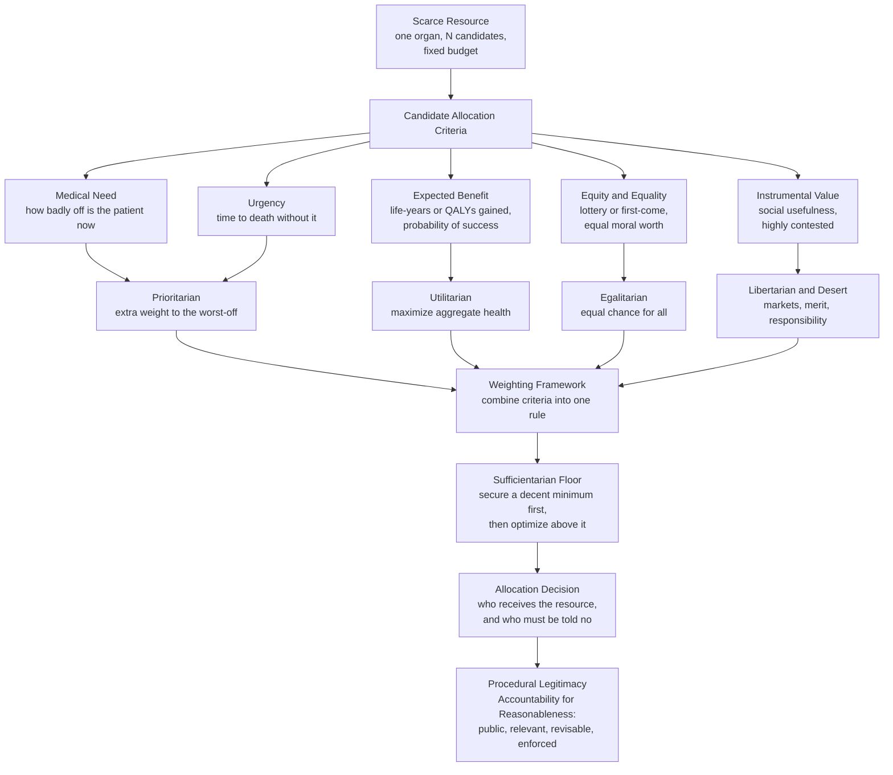

# ⚕️ Justice in Health and Resource Allocation

> [!abstract] TL;DR
> Medical resources — organs, ICU beds, ventilators, vaccines, and the money to buy any of them — are **inescapably scarce**, so someone must decide who gets them. *Justice in health* asks how to make those choices fairly. The major theories give different answers: **utilitarians** maximize aggregate health (usually counted in QALYs), **egalitarians** demand equal access or an equal chance (a lottery), **prioritarians** give extra moral weight to the worst-off (sickest first), **sufficientarians** guarantee everyone a decent minimum, and **libertarians** trust markets and desert. Norman Daniels extends **Rawls** to health by arguing that healthcare's special moral importance is that it protects the *normal opportunity range*. The deep, unavoidable structure of the field is an **efficiency–equity tradeoff**: the rule that saves the most life-years is rarely the rule that treats everyone as equals, and no single rule escapes the tension.

---

## Intuition

**Analogy:** One donor heart arrives tonight. Five patients on the transplant floor will die without it: a 9-year-old with a congenital defect, a 34-year-old nurse and mother of two, a 55-year-old with well-controlled diabetes, a 68-year-old retired teacher, and a 41-year-old with a second failing transplant and a history of missed appointments. The heart cannot be split, sold to all, or grown on demand. *Every* possible choice lets four people die. There is no option that wrongs no one — only options that wrong different people for different reasons. This is the tragic arithmetic of scarce medical resources: fairness here is not about avoiding loss, but about **choosing whose loss is just**.

Notice how each instinct you feel encodes a whole theory. "Save the child, she has her whole life ahead" is the **fair innings** intuition. "Give it to whoever will live longest with it" is **utilitarian**. "Draw lots — they all deserve an equal shot" is **egalitarian**. "The sickest, most urgent case first" is **prioritarian**. "The one who followed the rules and kept her appointments" smuggles in **desert**. The work of health justice is to make these buried intuitions explicit, test them against each other, and build allocation rules that a society could defend to the very people they will one day condemn.

---

## How It Works

### The two levels of allocation

Health justice operates at two scales that are often confused:

1. **Micro-allocation (bedside rationing).** *This* organ, *this* ventilator, *these* doses — assigned to specific identified patients, usually under time pressure. The paradigm cases are organ transplantation, ICU/ventilator triage in a pandemic, and vaccine rollout. The central questions are *which criteria* count (need, benefit, urgency, equality, social value) and *who decides* (bedside physician, triage committee, algorithm).
2. **Macro-allocation (priority-setting).** How much of a society's budget goes to health versus education, defence, or leaving money in citizens' pockets; and *within* the health budget, which treatments a public system will fund. The paradigm cases are the UK's **NICE** deciding whether a drug clears its **cost-per-QALY threshold**, and the **Oregon Health Plan's** prioritized list. Macro-allocation is where the **QALY** and **DALY** live — metrics that let a system compare a hip replacement against a cancer drug on a common scale.

### The theories of justice, applied to health

| Theory | Currency of justice | Allocation rule it favours | Signature objection |
|--------|--------------------|-----------------------------|---------------------|
| **Utilitarian** | Aggregate health (QALYs / life-years) | Maximize total benefit — treat those who gain the most | Ignores distribution; can abandon the sickest and the disabled |
| **Egalitarian** | Equal access / equal chance | Equal opportunity for health; lottery or first-come when indivisible | May "waste" the resource on those who benefit least |
| **Prioritarian** | Weighted benefit favouring the worst-off | Sickest / most urgent first | Worst-off may benefit *least* per unit spent |
| **Sufficientarian** | A decent minimum (a floor) | Guarantee everyone "enough" before optimizing above it | Where is the threshold, and why there? |
| **Libertarian** | Liberty, property, desert | Markets, willingness/ability to pay, personal responsibility | Turns a life-and-death need into ability to pay |

The dominant *liberal* synthesis is **Norman Daniels's "just health"**, which extends **Rawls**: healthcare matters morally not for its own sake but because disease and disability shrink the range of life-plans open to a person. Protecting the **normal opportunity range** is therefore an application of Rawls's principle of **fair equality of opportunity** — which is why Daniels argues a just society owes its members a fair share of the "normal functioning" that opportunity presupposes, and why the **social determinants of health** (income, education, control) fall inside the theory of justice, not outside it.

### Allocation criteria and the frameworks that weight them



The diagram's last box matters as much as the criteria. When reasonable people disagree about the *right* substantive theory, Daniels and Sabin argue justice shifts to **procedure**: a decision is legitimate if its reasons are **public**, **relevant** to fair-minded people, open to **revision**, and **enforced** — their framework of *accountability for reasonableness*. Fair process is the fallback when no theory commands consensus.

---

## Key Concepts

### Secondary (intuitive, no jargon)
- **Scarcity is the whole problem.** If there were enough hearts, beds, and money for everyone, there would be no ethics of allocation — just medicine. Because there is not, choosing *who* is unavoidable, and choosing badly is still choosing.
- **Triage.** Sorting patients by who needs help most urgently and who can be helped, invented on battlefields and now standard in every emergency room and pandemic.
- **Fairness versus efficiency.** The choice that helps the *most* people is not always the choice that treats people as *equals* — a five-year-old and an eighty-year-old are equals in dignity but not in life-years remaining.
- **The right to health.** Many hold that access to a basic level of healthcare is a human right, not a luxury bought at market prices — a claim libertarians dispute.

### Undergraduate (the frameworks and metrics)
- **QALY (Quality-Adjusted Life-Year).** One year in perfect health = 1 QALY; a year in a state valued at 0.6 = 0.6 QALY. Lets a system compare unlike treatments on a common scale and compute **cost per QALY**. **NICE** uses a soft threshold near £20,000–£30,000 per QALY to decide what the NHS funds.
- **DALY (Disability-Adjusted Life-Year).** A measure of *loss* — years of life lost plus years lived with disability — used by the WHO's **Global Burden of Disease** to rank the world's health problems. Lower DALYs averted per dollar means lower priority.
- **Daniels's just health / Rawlsian extension.** Healthcare protects the **normal opportunity range**; a fair share of health is an application of **fair equality of opportunity**, pulling the social determinants of health inside the theory of justice.
- **Micro vs macro allocation.** Bedside rationing of a specific resource versus system-wide priority-setting of budgets and covered services.
- **Crisis standards of care.** The legally and ethically sanctioned shift, in a mass-casualty event, from "do everything for this patient" to "do the most good for the population" — the trigger for pandemic ventilator-triage protocols.

### Graduate (the live controversies)
- **The QALY disability-discrimination objection.** Because a disabled person may start below 1.0 on the quality scale, a QALY-maximizing rule systematically values extending their life *less* — a form of "double jeopardy" (already disadvantaged, then deprioritized). This objection is why the US **Affordable Care Act §1182** prohibits using cost-per-QALY thresholds to deny Medicare coverage, and why disability advocates challenged COVID triage protocols.
- **Aggregation and the fair innings vs. completed lives debate.** Should we count *life-years* (favouring the young, who have more) or should everyone get an equal *number of chances at a full life*? Alan Williams's **"fair innings"** argument holds that dying young is a graver injustice than dying old; critics reply this is ageism dressed as equity.
- **Prioritarianism vs. egalitarianism, formally.** Egalitarianism values *equality itself* and is vulnerable to Parfit's **leveling-down objection** (equalizing by making the well-off worse off improves nothing). Prioritarianism sidesteps this by valuing *benefits to the worst-off more*, without valuing equality per se.
- **Ex ante vs. ex post equity, and weighted lotteries.** Do we equalize each person's *chance* of getting the resource beforehand, or the *outcome* afterward? John Broome and others defend **weighted lotteries** as honouring both the claims of the many and the equal standing of each.
- **Value of a Statistical Life (VSL) and allocation under uncertainty.** Macro decisions (a screening programme, a safety rule) trade money against *statistical*, not identified, lives — exposing the **"rule of rescue"** bias toward the identifiable victim in front of us over the anonymous many.
- **Global health justice and the 10/90 gap.** Historically, roughly 90% of health research funding addressed problems causing 10% of the global disease burden. Combined with **TRIPS** patent rules restricting access to medicines, this makes health injustice a defining feature of the *international* order, not just the clinic.

---

## Python Demo

This simulation builds a synthetic patient population competing for a limited number of scarce interventions (think ICU beds or organs), then applies four allocation rules and plots the outcomes. It makes the efficiency–equity tradeoff *visible*: the utilitarian rule saves the most life-years but skews toward the young and less-sick; the prioritarian rule serves the sickest at the cost of aggregate benefit; the lottery is impartial but efficient at nothing; fair innings protects the young by construction.

```python
# Allocation of a scarce medical resource under four theories of justice.
# For each rule we allocate K interventions among N patients and measure:
#   (1) expected LIVES saved, (2) expected LIFE-YEARS saved,
#   (3) the AGE and (4) the SEVERITY profile of who actually gets served.
import numpy as np
import matplotlib.pyplot as plt

rng = np.random.default_rng(7)
N = 2000                      # patients competing
K = 400                       # scarce interventions available (20 percent)

# ---- Synthetic patient population -------------------------------------------
age = rng.integers(1, 90, N)                          # 1..89 years old
remaining_years = np.maximum(1, 85 - age)             # potential years if saved
# Severity = probability of dying WITHOUT the intervention (Beta gives a spread)
untreated_death_prob = rng.beta(2.0, 2.0, N)          # in [0,1]
# Treatment efficacy = fraction of that death risk the intervention removes
efficacy = rng.uniform(0.30, 0.90, N)

# Expected LIVES saved by treating patient i = risk removed
lives_saved_if_treated = untreated_death_prob * efficacy
# Expected LIFE-YEARS saved = lives saved times years they'd then live
life_years_if_treated = lives_saved_if_treated * remaining_years

# ---- Four allocation rules: each returns the indices of the K served --------
def utilitarian():        # maximize aggregate life-years / QALYs
    return np.argsort(-life_years_if_treated)[:K]

def egalitarian_lottery():  # equal chance for everyone
    return rng.permutation(N)[:K]

def prioritarian():       # sickest first (highest death risk without treatment)
    return np.argsort(-untreated_death_prob)[:K]

def fair_innings():       # youngest first (protect those denied a full life)
    return np.argsort(age)[:K]

rules = {
    "Utilitarian\n(max life-years)": utilitarian(),
    "Egalitarian\n(lottery)":        egalitarian_lottery(),
    "Prioritarian\n(sickest first)": prioritarian(),
    "Fair innings\n(youngest first)": fair_innings(),
}

# ---- Score each rule --------------------------------------------------------
lives  = {r: lives_saved_if_treated[idx].sum() for r, idx in rules.items()}
years  = {r: life_years_if_treated[idx].sum()  for r, idx in rules.items()}

# ---- Plot -------------------------------------------------------------------
fig, ax = plt.subplots(2, 2, figsize=(12, 9))
labels = list(rules.keys())
colors = ["#d97706", "#2563eb", "#dc2626", "#059669"]

# (1) Expected lives saved
ax[0, 0].bar(labels, [lives[r] for r in labels], color=colors)
ax[0, 0].set_title("Expected lives saved")
ax[0, 0].set_ylabel("lives")

# (2) Expected life-years saved -> utilitarian should win here
ax[0, 1].bar(labels, [years[r] for r in labels], color=colors)
ax[0, 1].set_title("Expected life-years saved (efficiency)")
ax[0, 1].set_ylabel("life-years")

# (3) Age of the served -> exposes who each rule favours
ax[1, 0].boxplot([age[rules[r]] for r in labels], labels=labels, showmeans=True)
ax[1, 0].set_title("Age distribution of patients served")
ax[1, 0].set_ylabel("age (years)")

# (4) Severity of the served -> prioritarian should skew highest
ax[1, 1].boxplot([untreated_death_prob[rules[r]] for r in labels],
                 labels=labels, showmeans=True)
ax[1, 1].set_title("Severity (death risk without treatment) of served")
ax[1, 1].set_ylabel("untreated death probability")

for a in ax.flat:
    a.tick_params(axis="x", labelsize=8)
plt.tight_layout()
plt.savefig("health_allocation_rules.png", dpi=120)
plt.show()

# ---- Text summary -----------------------------------------------------------
print(f"{'Rule':<26}{'Lives':>8}{'Life-yrs':>10}{'MeanAge':>9}{'MeanSev':>9}")
for r in labels:
    idx = rules[r]
    print(f"{r.replace(chr(10),' '):<26}"
          f"{lives[r]:>8.1f}{years[r]:>10.0f}"
          f"{age[idx].mean():>9.1f}{untreated_death_prob[idx].mean():>9.2f}")
```

**What you see when you run it.** The *utilitarian* rule wins the life-years panel decisively but serves a strikingly *young* and *less-sick* population — it quietly abandons the elderly and the most severe cases because they yield fewer years per bed. The *prioritarian* rule tops the severity panel (it really does take the sickest) yet saves fewer life-years. The *lottery* is a flat, impartial middle — average on every axis, optimizing nothing but treating everyone as an equal. *Fair innings* clamps the age distribution to the young. No rule dominates all four panels: that is the efficiency–equity tradeoff made numeric, and it is exactly why real allocation systems (organ scoring, ventilator triage) blend several criteria rather than committing to one theory.

---

## Real-World Applications

> **Example — US organ allocation (UNOS / OPTN).** Deceased-donor organs are allocated by explicit, published algorithms that *blend* the theories the demo isolates. Livers use the **MELD** score (sickest-first prioritarianism); kidneys use the **KDPI/EPTS** system that matches high-quality kidneys to recipients with longer expected post-transplant survival (a utilitarian benefit-maximizing move), tempered by waiting-time (egalitarian). **Kidney paired exchange** — swapping incompatible donor–recipient pairs into compatible chains — is a live application of [[Matching_Markets]] and won Alvin Roth a share of the 2012 Nobel.

- **NICE and the cost-per-QALY threshold (UK).** The National Institute for Health and Care Excellence decides which drugs the NHS funds by comparing **incremental cost-effectiveness ratios** against a threshold near £20,000–£30,000/QALY — the textbook case of *macro*-allocation and the most consequential real use of the QALY.
- **COVID-19 crisis standards of care.** When ventilators ran short, US states and hospitals invoked triage protocols (often SOFA-score based) to allocate them. Disability-rights groups filed civil-rights complaints against protocols that excluded patients by disability or long-term prognosis — the QALY discrimination objection litigated in real time.
- **Pandemic vaccine rollout.** The WHO's fair-allocation framework and the US ACIP's phased rollout had to weigh maximizing lives saved (vaccinate the elderly first) against equity and instrumental value (vaccinate frontline workers first) — utilitarian and prioritarian reasoning openly in tension.
- **The Oregon Health Plan.** The 1990s attempt to expand Medicaid coverage by publicly *ranking* condition–treatment pairs by cost-effectiveness — the boldest real experiment in transparent macro-rationing, and a case study in its political backlash.
- **Global health and the 10/90 gap.** WHO-CHOICE uses DALYs averted per dollar to guide where global health spending does the most good, foregrounding the vast international inequality that connects this topic to global justice.

---

## Common Pitfalls

- **Mistaking QALY-maximization for justice.** Maximizing aggregate QALYs is *one* theory (utilitarianism), not a neutral technical procedure. Presenting it as "just the efficient answer" hides a contested value choice and can be indefensible when it abandons the worst-off.
- **The disability / double-jeopardy trap.** Any rule keyed to *quality* of life-years or to *prognosis* silently deprioritizes disabled and chronically ill patients — penalizing them a second time for a disadvantage they already bear. Watch for it in triage scores and cost-effectiveness cutoffs.
- **Smuggling in "social value."** Criteria like "usefulness to society" feel intuitive but encode class, race, and ableist bias, and violate the equal moral worth of persons. Most modern frameworks restrict social value to narrow, instrumental, emergency-specific roles (vaccinating the vaccinators) and nothing broader.
- **The rule of rescue.** We spend lavishly on the identifiable dying patient in front of us and neglect the statistically larger, anonymous benefit of prevention. Emotionally powerful, it systematically distorts macro-allocation away from where lives are cheapest to save.
- **Confusing ex ante and ex post fairness.** "Everyone had an equal chance" (ex ante) and "the outcome treats people equally" (ex post) are different justice claims; a lottery satisfies the first and can badly fail the second. Be explicit about which you are defending.
- **Treating the bedside as the only lever.** Fighting over who gets the last ventilator ignores that *most* health injustice is upstream — in the social determinants and the size of the budget. Perfecting micro-allocation cannot fix a macro-allocation that starved the system of beds.
- **False precision.** QALY and DALY numbers carry decimal points but rest on contestable valuations of disability states. Do not let the arithmetic launder the value judgements it contains.

---

## Related Concepts

- [[Justice_and_Rawls]] — Daniels's "just health" *is* Rawls extended to health: healthcare protects the normal opportunity range, so fair equality of opportunity grounds a right to care.
- [[Consequentialism_and_Utilitarianism]] — the utilitarian/QALY-maximizing framework that dominates health economics and that every equity theory reacts against.
- [[Liberty_and_Rights]] — home of the libertarian objection (markets and property over need) and of the competing claim to a *right to health*.
- [[Equality_Marxism_and_Anarchism]] — egalitarian theories of distribution, the philosophical backdrop to equal-access and lottery rules.
- [[Applied_Ethics]] — the parent field; health-resource allocation is one of its hardest, most concrete problem areas.
- [[Health_Inequality_and_Medical_Sociology]] — the empirical social-gradient and social-determinants evidence that macro-allocation and Daniels's theory must answer to.
- [[Global_Inequality_and_Development]] — the international dimension: the 10/90 gap, access to medicines, and health as a marker of global injustice.
- [[Scarcity_and_Opportunity_Cost]] — the economic root of the entire problem; every treatment funded is another foregone, which is what a cost-per-QALY threshold operationalizes.
- [[Utility_Theory]] — the utility-measurement machinery beneath the QALY's quality weights and their well-known limits.
- [[Consumer_and_Producer_Surplus]] — the welfare-economics toolkit that cost-effectiveness analysis borrows and that health-justice critiques push back on.
- [[Matching_Markets]] — the mechanism-design solution behind kidney paired exchange and modern organ-allocation algorithms.

---

## Review Questions

**Tier 1 — Foundational (explain to a peer)**
1. Distinguish *micro*-allocation from *macro*-allocation, and give one real example of each. Why does the same concept of justice have to answer questions at both scales?
2. Define a QALY. How does a cost-per-QALY threshold turn "how much should we spend on health?" into a concrete yes/no funding decision?

**Tier 2 — Applied (reason through a case)**
3. A hospital has one ventilator and two patients: a 25-year-old with an 80% chance of full recovery and a 70-year-old with a 40% chance. A pure utilitarian, a prioritarian, and an egalitarian each pick differently. State each choice *and* its justification, then say which patient the "fair innings" argument favours and why.
4. Disability advocates argue that QALY-based triage protocols discriminate. Reconstruct the "double jeopardy" objection precisely, and explain how a defender of QALYs might respond. Which side do you find stronger, and on what grounds?

**Tier 3 — Advanced (research-level)**
5. Prioritarianism and egalitarianism often recommend the same allocation, yet they are distinct theories. Using Parfit's *leveling-down objection*, explain the difference and why a health-policy designer might prefer prioritarianism.
6. Daniels argues the *social determinants of health* fall inside the theory of justice, not outside it. Defend or attack this claim, and draw out its implication: is a society that perfects its bedside triage but tolerates a steep social gradient acting justly?
7. When no theory of justice commands consensus, Daniels and Sabin retreat to *accountability for reasonableness* — legitimacy through fair procedure. Is fair process a genuine solution to substantive disagreement about allocation, or does it merely postpone it? Argue with reference to a real priority-setting body such as NICE.

---

## Sources

- Daniels, N. (2008). *Just Health: Meeting Health Needs Fairly.* Cambridge University Press. See also the [Stanford Encyclopedia of Philosophy — Justice and Access to Health Care](https://plato.stanford.edu/entries/justice-healthcareaccess/).
- Persad, G., Wertheimer, A., & Emanuel, E. J. (2009). "Principles for allocation of scarce medical interventions." *The Lancet*, 373(9661), 423–431. [DOI](https://doi.org/10.1016/S0140-6736%2809%2960137-9).
- Emanuel, E. J., et al. (2020). "Fair Allocation of Scarce Medical Resources in the Time of Covid-19." *New England Journal of Medicine*, 382, 2049–2055. [NEJM](https://www.nejm.org/doi/full/10.1056/NEJMsb2005114).
- Williams, A. (1997). "Intergenerational equity: an exploration of the 'fair innings' argument." *Health Economics*, 6(2), 117–132. [DOI](https://doi.org/10.1002/%28SICI%291099-1050%28199703%296%3A2%3C117%3A%3AAID-HEC256%3E3.0.CO%3B2-B).
- Beauchamp, T. L., & Childress, J. F. (2019). *Principles of Biomedical Ethics* (8th ed.), Ch. 7 "Justice." Oxford University Press.

---

#ethics #health-justice #resource-allocation #rationing #qaly
