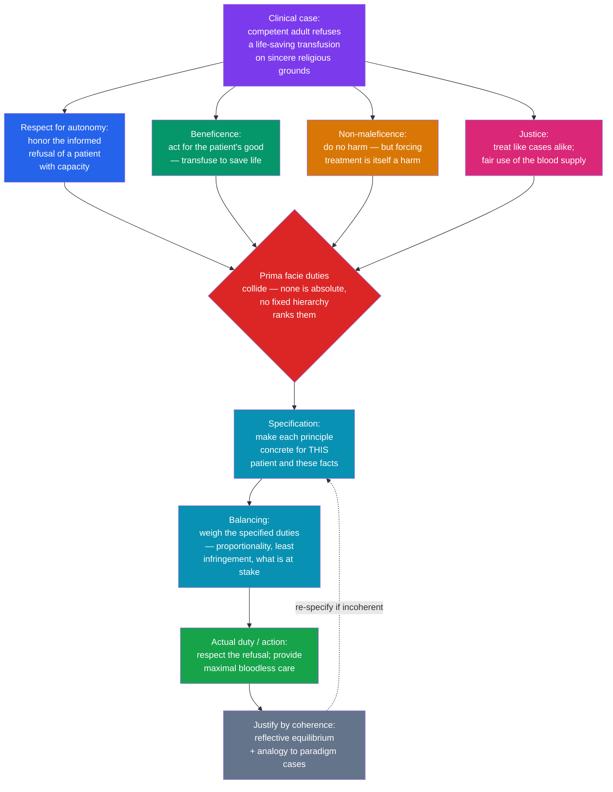

# ⚕️ Principles of Biomedical Ethics

> [!abstract] TL;DR
> **Principlism** — Tom Beauchamp and James Childress's *Principles of Biomedical Ethics* (1979) — is the dominant working framework of clinical and research ethics. It offers four **mid-level, *prima facie* principles** that morally serious people share whatever their deeper theory: **respect for autonomy** (honor the informed choices of a competent patient), **beneficence** (act for the patient's good), **non-maleficence** (*primum non nocere*, "first, do no harm"), and **justice** (distribute benefits, risks, and resources fairly). None is absolute and there is **no fixed hierarchy**; when they collide, the clinician resolves the case by **specification** (making a principle concrete for these facts) and **balancing** (weighing the specified duties). Principlism *structures* moral judgment for a pluralistic clinic — it does **not** mechanize it.

---

## Intuition

**Analogy:** Picture a clinician standing at the bedside holding a **compass with four points**. Every hard decision pulls on all four at once. One needle points to the **patient's own wishes** — respect what *they* choose for their body. One points to **doing them good** — heal, relieve, save. One points to **avoiding harm** — do not make things worse. One points to **fairness** — this bed, this blood, this ICU hour belongs to a community, not one person alone.

On an easy day the four needles point the same way and you simply walk forward. On a hard day they pull in *opposite* directions: a competent patient refuses the very treatment that would save her life, so "respect her choice" and "do her good" point apart. The compass does not tell you which needle wins — there is no north stamped on it. What it does is guarantee you **never forget a direction**: you cannot quietly drop "fairness" or "her wishes" because they are inconvenient. Principlism is that four-point compass: a shared checklist of what must be weighed, not a machine that spits out the route.

---

## How It Works

### Core Mechanics

1. **Four *prima facie* principles.** Each principle is **binding other things being equal** but can be **overridden** when it conflicts with another (the term is W. D. Ross's, 1930). None is absolute; there is no lexical ranking where autonomy always beats beneficence.
2. **A common-morality foundation.** Beauchamp (a utilitarian) and Childress (a deontologist) deliberately built a *theory-neutral* framework. The principles are drawn from **common morality** — the norms shared by all committed moral agents — so a committee of a Kantian, a utilitarian, and a virtue ethicist can reason together without first agreeing on a grand theory. This is the **"mid-level principles"** strategy: abstract enough to be shared, concrete enough to guide.
3. **Specification.** Bare principles are too vague to apply. *Specification* narrows a principle to the case: "respect autonomy" becomes "obtain informed, voluntary consent from a patient with decision-making capacity before transfusing." Multiple valid specifications can compete.
4. **Balancing.** When specified duties still conflict, the clinician **weighs** them for *this* case — considering how much is at stake, whether a less intrusive option exists, and whether the infringement is proportionate. The output is the **actual (all-things-considered) duty**.
5. **Justification by coherence.** There is no formula that ranks the outcome. Justification comes from **reflective equilibrium** — adjusting principles, specifications, and considered case judgments until they cohere, supported by **casuistry** (reasoning by analogy from settled paradigm cases).

### Flow / Architecture



---

## Key Concepts

### Secondary (the four points, plainly)

- **Respect for autonomy** — a competent, informed patient has the right to make decisions about their own body, including the right to **refuse** treatment. Its clinical engine is **informed consent** (disclosure + understanding + voluntariness + capacity).
- **Beneficence** — actively promote the patient's welfare: cure, relieve suffering, prevent harm.
- **Non-maleficence** — *primum non nocere*, "first, do no harm." Do not inflict needless injury; weigh the risks of every intervention.
- **Justice** — treat like cases alike and share benefits, burdens, and scarce resources fairly (who gets the ICU bed, the organ, the vaccine).

> The four are sometimes taught as the **"Georgetown mantra"** because Beauchamp and Childress worked at Georgetown's Kennedy Institute of Ethics.

### Undergraduate (the machinery that makes it work)

- **Prima facie vs actual duties (W. D. Ross, 1930).** A *prima facie* duty holds unless outweighed by a stronger one; the **actual duty** is what you ought to do all-things-considered. Because the four principles are only prima facie, "I violated autonomy" is not automatically wrong — the question is whether the infringement was *justified* by a weightier duty and was the least intrusive option.
- **Specification and balancing.** Two complementary moves: *specification* fixes a principle's content for the case; *balancing* assigns comparative weight when specified duties still conflict. There is **no fixed priority rule** — this is principlism's defining feature and the target of its critics.
- **Paternalism vs autonomy — hard vs soft.** *Soft paternalism* overrides a choice that is **not** genuinely autonomous (the patient lacks capacity, is misinformed, or coerced) — widely accepted. *Hard paternalism* overrides a **fully competent, informed, voluntary** choice for the patient's own good — generally rejected in contemporary bioethics. The refusal case turns on which one is in play.
- **Capacity / competence and surrogates.** *Capacity* is **decision-specific and functional**: can the patient **understand** the information, **appreciate** how it applies to them, **reason** with it, and **communicate** a stable choice? A diagnosis, or a mere refusal of recommended care, does **not** by itself prove incapacity. When capacity is absent, a **surrogate** decides using (1) the **substituted-judgment** standard — what *this* patient would have chosen (advance directives, prior statements) — or, if unknown, (2) the **best-interests** standard.
- **Confidentiality and its limits.** Privacy is a specification of respect for persons, but it is *prima facie*: it yields to a **duty to warn** identifiable third parties of serious threats (*Tarasoff*), to **mandatory reporting** (certain infections, abuse), and to public-health necessity.
- **The four-quadrant method (Jonsen, Siegler & Winslade).** A practical worksheet that maps each case onto four boxes: **Medical Indications** (beneficence/non-maleficence), **Patient Preferences** (autonomy), **Quality of Life** (all three), and **Contextual Features** (justice — family, cost, law, culture). It turns the abstract principles into a repeatable consult procedure.
- **Casuistry.** Bottom-up, case-driven reasoning by analogy to agreed **paradigm cases**, the method by which ethics committees often converge in practice even when members disagree in theory.

### Graduate (foundations, extensions, and critiques)

- **Why principlism arose.** Post-Nuremberg and post-Tuskegee, a **pluralistic** clinic and research enterprise needed a *shared moral language* that did not presuppose one true ethical theory. The **Belmont Report** (1979) codified a parallel triad for research (respect for persons, beneficence, justice); Beauchamp and Childress generalized it. The wager: agreement at the **middle level** is achievable even where agreement at the **theoretical level** is not.
- **The doctrine of double effect (DDE).** Permits an action with a **foreseen but unintended** harmful side effect when: (1) the act is not itself wrong; (2) the bad effect is **not intended**, only foreseen; (3) the bad effect is **not the means** to the good; and (4) there is **proportionality**. Paradigm case: escalating opioids or **palliative sedation** to relieve intractable suffering, accepting that it *may* hasten death — permissible because relief, not death, is intended and death is not the means of relief.
- **Critiques of principlism.**
  - **"A checklist without a theory" (Clouser & Gert, 1990).** The four "principles" are really *headings for concerns*, not action-guides; lacking a unifying theory, they give **no procedure** for adjudicating conflicts and can be invoked to rationalize almost any conclusion.
  - **Conflict without resolution.** With no hierarchy, balancing risks **indeterminacy** — two competent clinicians can weigh the same principles to opposite verdicts and neither is demonstrably wrong.
  - **Cultural bias toward autonomy.** Especially in US practice, the framework is charged with **over-weighting individual autonomy** at the expense of family, community, and beneficence-centered traditions where decisions are relational. This connects directly to **metaethical relativism**: is autonomy's priority an *objective* moral truth or a *culturally local* value? (See [[Metaethics]].)
- **The authors' reply.** Beauchamp and Childress answer that **common morality** supplies real constraint, **specification** supplies content, and **reflective equilibrium** supplies justification — the framework was never meant to be an algorithm, only a shared and disciplined starting point. Raanan Gillon's influential gloss adds "**four principles *plus attention to scope***" (whose autonomy, justice among whom).

---

## Python Demo

```python
"""
Principlism as STRUCTURED judgment, not a formula.

Case: a competent adult (a Jehovah's Witness) with acute blood loss refuses a
life-saving transfusion on sincere religious grounds.

We score three clinical options against Beauchamp & Childress's four principles,
then apply two DIFFERENT balancing profiles (weight vectors). The recommended
option FLIPS when the weights change -- illustrating that principlism structures
the deliberation but does NOT mechanize the verdict. The scores are ethical
judgments (0-10), not measurements; reasonable clinicians would assign them
differently, and that is the point.
"""
import numpy as np
import matplotlib.pyplot as plt

principles = ["Autonomy", "Beneficence", "Non-maleficence", "Justice"]
options = ["Honor refusal\n(no transfusion)",
           "Transfuse\nagainst refusal",
           "Bloodless mgmt\n+ shared decision"]

# rows = options, cols = principles (0 = poorly served, 10 = well served)
scores = np.array([
    [10, 2, 6, 7],   # Honor refusal: maximal autonomy, low life-saving beneficence
    [ 1, 9, 3, 5],   # Transfuse anyway: violates autonomy, saves the life
    [ 8, 5, 7, 7],   # Bloodless compromise: balanced across all four
], dtype=float)

# Two "specification & balancing" profiles: how much weight each PRIMA FACIE
# principle carries in THIS case. Each vector sums to 1.
w_autonomy = np.array([0.50, 0.15, 0.20, 0.15])  # capacity intact, choice voluntary
w_rescue   = np.array([0.10, 0.55, 0.20, 0.15])  # emergency / life-preservation frame

totals_A = scores @ w_autonomy
totals_R = scores @ w_rescue

def winner(t):
    return options[int(np.argmax(t))].replace("\n", " ")

print("Autonomy-priority balancing -> recommends:", winner(totals_A))
print("   weighted totals:", np.round(totals_A, 2))
print("Rescue-priority   balancing -> recommends:", winner(totals_R))
print("   weighted totals:", np.round(totals_R, 2))
# The recommendation flips from 'Honor refusal' to 'Transfuse against refusal'
# purely by re-weighting -- no new facts. Principlism did not decide; we did.

# ---------------- visualize ----------------
fig = plt.figure(figsize=(13, 5.5))
colors = ["#2563eb", "#dc2626", "#059669"]

# (1) radar: each option's profile across the four principles
ax1 = fig.add_subplot(1, 2, 1, projection="polar")
angles = np.linspace(0, 2 * np.pi, len(principles), endpoint=False)
angles = np.concatenate([angles, angles[:1]])
for i, opt in enumerate(options):
    vals = np.concatenate([scores[i], scores[i][:1]])
    ax1.plot(angles, vals, color=colors[i], lw=2, label=opt.replace("\n", " "))
    ax1.fill(angles, vals, color=colors[i], alpha=0.10)
ax1.set_xticks(angles[:-1])
ax1.set_xticklabels(principles)
ax1.set_ylim(0, 10)
ax1.set_title("Each option scored on the four principles", pad=18)
ax1.legend(loc="upper right", bbox_to_anchor=(1.32, 1.16), fontsize=8)

# (2) bars: weighted totals under the two balancing profiles
ax2 = fig.add_subplot(1, 2, 2)
x, bw = np.arange(len(options)), 0.38
ax2.bar(x - bw / 2, totals_A, bw, label="Autonomy-priority", color="#2563eb")
ax2.bar(x + bw / 2, totals_R, bw, label="Rescue-priority", color="#d97706")
ax2.set_xticks(x)
ax2.set_xticklabels(options, fontsize=8)
ax2.set_ylabel("Weighted score")
ax2.set_title("Same scores, different weights -> different recommendation")
ax2.legend()
# star the winner under each profile
ax2.scatter(np.argmax(totals_A) - bw / 2, totals_A.max() + 0.25,
            marker="*", s=200, color="#2563eb", zorder=3)
ax2.scatter(np.argmax(totals_R) + bw / 2, totals_R.max() + 0.25,
            marker="*", s=200, color="#d97706", zorder=3)

plt.tight_layout()
plt.savefig("principlism_balancing.png", dpi=120, bbox_inches="tight")
plt.show()
```

Running it prints a **flip**: the autonomy-priority balancing recommends *honoring the refusal*, while the rescue-priority balancing recommends *transfusing* — from the **same** principle scores. The weights, not the framework, chose. (Note too that "bloodless management + shared decision" scores strongly under *both* profiles: good ethics often means **re-specifying the options** so the sharpest conflict dissolves.)

---

## Real-World Applications

> **Example — informed consent and IRBs.** Every surgical consent form and every Institutional Review Board is a *specification of respect for autonomy*: disclosure of risks, alternatives, and the right to refuse or withdraw. The Belmont Report's three principles are the direct research-ethics ancestor of the four.

> **Example — end-of-life care and double effect.** DNR orders and withdrawal of life-sustaining treatment are grounded in autonomy and non-maleficence; **palliative sedation** that may hasten death is defended by the **doctrine of double effect** (relief intended, death foreseen but not the means).

> **Example — ICU triage and the COVID-19 pandemic.** Ventilator- and vaccine-allocation protocols are applied **justice**: scoring systems (e.g., SOFA-based priority) try to treat like cases alike and maximize lives saved while resisting bias — a live, contested balancing of justice against beneficence.

> **Example — organ transplantation.** UNOS allocation policies operationalize distributive justice (medical urgency, waiting time, compatibility) against beneficence (best graft outcome).

> **Example — clinical ethics consultation.** Hospital ethics committees routinely run the **four-quadrant (Jonsen) worksheet** to structure a bedside dilemma before recommending.

---

## Common Pitfalls

- **Treating the four principles as an algorithm.** The compass names the directions; it does not compute the route. Expecting a mechanical verdict misunderstands specification and balancing.
- **Assuming a fixed hierarchy (usually "autonomy always wins").** There is **no** built-in ranking. In a genuine emergency with uncertain capacity, beneficence may justifiably outweigh a shaky refusal.
- **Confusing a diagnosis or a "bad" choice with incapacity.** Capacity is functional and decision-specific; refusing recommended care is a *right*, not evidence of incompetence. Sliding from "unwise" to "incapable" is a classic route to unjustified hard paternalism.
- **Reducing informed consent to a signature.** Consent is a **process** — understanding and voluntariness — not a form. A signed page with no comprehension respects nothing.
- **Laundering intentions through double effect.** DDE fails if the harm is the **means** to the good, if the harm is actually **intended**, or if it is **disproportionate**. It is not a blanket permit for risky comfort care.
- **Over-weighting autonomy and ignoring justice or culture.** Individualist framing can erase family-centered decision-making and the community stake in scarce resources — the cultural-bias critique in action.
- **Presenting withdrawing and withholding as automatically different.** Ethically and legally they are generally treated as equivalent; a felt asymmetry ("stopping feels like killing") is a psychological pull, not a principled rule.

---

## Related Concepts

- [[Applied_Ethics]] — the parent field; principlism is bioethics' flagship framework and its clearest example of casuistry plus reflective equilibrium in action.
- [[Deontology_and_Kantian_Ethics]] — respect for autonomy has Kantian roots (persons as ends-in-themselves, never mere means); Childress supplied the framework's deontological voice.
- [[Consequentialism_and_Utilitarianism]] — beneficence and non-maleficence are the outcome-weighing principles; Beauchamp supplied the framework's utilitarian voice.
- [[Virtue_Ethics]] — the "good clinician" needs practical wisdom to specify and balance; character-based ethics is a standard supplement to the checklist critique.
- [[Metaethics]] — grounds the cultural-relativism critique: is the priority given to autonomy an objective moral truth or a locally variable value?
- [[What_Is_Ethics]] — situates normative and applied ethics, the levels principlism deliberately bridges with "mid-level" principles.

> Planned sibling notes in this vault (to be linked once created): **Informed_Consent_and_Autonomy**, **End_of_Life_Ethics**, **Justice_in_Health_and_Resource_Allocation**, **Ethical_Frameworks_in_Practice**, **Moral_Reasoning_and_Case_Analysis**.

---

## Review Questions

**Secondary.** Name the four principles of biomedical ethics and give a one-line definition of each. What does *primum non nocere* mean, and which principle expresses it?

**Undergraduate.** A fully competent, well-informed adult refuses a treatment that would clearly save her life. Distinguish **hard** from **soft paternalism**, and use the idea of *prima facie* versus *actual* duties to explain under what conditions — if any — a clinician may override the refusal. Where does **capacity assessment** enter the argument?

**Graduate.** State Clouser and Gert's **"checklist without a theory"** critique and the separate charge that principlism is **culturally biased toward autonomy**. How do Beauchamp and Childress answer using **common morality**, **specification**, and **reflective equilibrium**? Connect the cultural critique to metaethical **relativism**: does the reply require that autonomy's weight be an objective moral fact, and if not, what does it require instead?

---

## Sources

- Beauchamp, T. L. & Childress, J. F. (2019). *Principles of Biomedical Ethics* (8th ed.; 1st ed. 1979). Oxford University Press.
- Ross, W. D. (1930). *The Right and the Good*. Oxford: Clarendon Press. (Origin of *prima facie* duties.)
- Clouser, K. D. & Gert, B. (1990). "A Critique of Principlism." *Journal of Medicine and Philosophy*, 15(2), 219–236.
- Gillon, R. (1994). "Medical ethics: four principles plus attention to scope." *BMJ*, 309(6948), 184–188.
- Jonsen, A. R., Siegler, M. & Winslade, W. J. (2015). *Clinical Ethics* (8th ed.). McGraw-Hill. (The four-quadrant method.)
- National Commission for the Protection of Human Subjects (1979). *The Belmont Report*.

---

#ethics #bioethics #medical-ethics #principlism #autonomy
