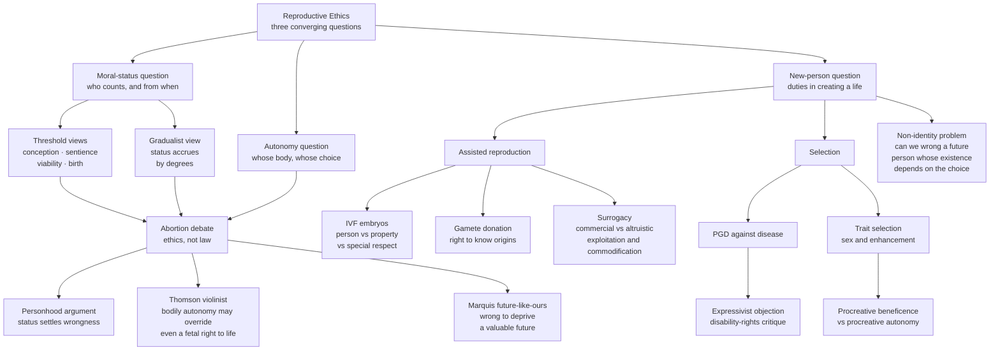

# 👶 Reproductive Ethics

> [!abstract] TL;DR
> Reproductive ethics is the branch of bioethics where three of moral philosophy's hardest questions collide at once: **who counts morally, and from when** (the moral-status question), **whose body and whose choice governs** (the autonomy question), and **what we owe to a person we are in the act of creating** (the new-person question). It runs from the *beginning-of-life* debate over abortion — argued through landmark cases like Thomson's violinist, Marquis's "future like ours," and Warren's personhood criteria — through the status of IVF embryos, gamete donation, and surrogacy, to prenatal selection, the disability-rights "expressivist objection," procreative beneficence versus procreative autonomy, and the deep puzzle of the non-identity problem. This note treats these as *ethical* questions and deliberately presents the strongest arguments on multiple sides without advocating for any.

---

## Intuition

**Analogy — the confluence of three rivers.** Picture a town built exactly where three great rivers merge into one. Most ethical questions sit calmly on a single river: *how should I treat this person who already exists?* or *what do I owe my community?* Reproduction is different — it is the **confluence town**, the one place where three separate rivers of moral philosophy pour into the same channel and churn together:

1. The **moral-status river** — *does the entity before us count, and how much?* A frozen embryo, a first-trimester fetus, a viable third-trimester fetus, a newborn: somewhere along the way full moral status arrives, but reasonable people place the source of that river in wildly different spots.
2. The **autonomy river** — *whose body and whose life-plan is at stake?* No other moral situation asks one person to lend the interior of their own body, continuously, for nine months.
3. The **new-person river** — *we are not merely acting on an existing being; we are deciding whether, and which, new person comes into the world at all.*

Because all three currents run together, you cannot resolve reproductive ethics by settling just one. That is why an argument that seems decisive on one river — "the fetus is a person, so abortion is wrong" — can be met by a counter-current from another river — "even a person has no automatic right to use *your* body." Everything downstream in this note is an attempt to navigate that confluence.

---

## How It Works

### Core mechanics

The whole field is organised by *which question you are standing on*.

**1. The moral-status question is the crux.** A developing human is continuous — there is no biological instant where a fundamentally different kind of thing appears — yet our moral practices are not continuous: we mourn a newborn's death very differently from a failed implantation. So the central task is to say **when full moral status is acquired**, and the candidates are:

- **Conception / fertilisation** — a genetically complete, individuated human organism exists; the *substance view* holds that a being's moral status flows from the kind of thing it is, which is fixed at conception.
- **Sentience** — moral status tracks the capacity to feel, especially to suffer; on this view status begins somewhere around the onset of fetal pain-capacity (debated, roughly mid-to-late second trimester).
- **Viability** — the point at which the fetus could survive outside the womb; a legally influential line, though critics note it tracks *medical technology*, not the fetus's intrinsic nature.
- **Birth** — a bright, public, uncontroversial line; critics note that a fetus the day before birth and a newborn the day after differ little intrinsically.

Cutting across these candidates is the deeper meta-question: **threshold vs gradualist**. A **threshold view** says status switches on at some point (before it, little or no status; after it, full status). A **gradualist view** says status *accrues by degrees* as morally relevant capacities develop, so the strength of the reason not to end a life grows across gestation rather than flipping on. (The [[Moral_Status_and_the_Moral_Circle]] note develops this axis in general form.)

**2. The abortion debate, as ethics not politics.** This note is about the *ethics* of abortion, which is distinct from its *law and policy* (constitutional privacy, viability lines, state interest — see [[Rights_and_Civil_Liberties]] for the legal machinery). Philosophically, four moves dominate:

- **The personhood / moral-status argument (both directions).** If the fetus has full moral status from conception, early abortion looks like the wrongful killing of an innocent person. If full status arrives later, early abortion need not be. On this framing, *the abortion question reduces to the moral-status question.*
- **Warren's personhood criteria (against fetal personhood).** Mary Anne Warren argued that "person" in the morally loaded sense requires traits like consciousness, reasoning, self-motivated activity, capacity to communicate, and self-awareness; an early fetus has none, so it is not yet a person in the sense that grounds a full right to life.
- **Thomson's violinist (autonomy may override even granting personhood).** Judith Jarvis Thomson's move is to **concede** the fetus is a person and argue abortion can *still* be permissible. Imagine you wake up surgically connected to a famous violinist who will die unless he uses your kidneys for nine months. He is unquestionably a person with a right to life — yet you are not morally obliged to stay plugged in. The right to life, Thomson argues, is not a right to *use another person's body*. This relocates the debate from *status* to *bodily autonomy* and the duties we do or do not have to sustain others.
- **Marquis's "future like ours" (against, without needing personhood).** Don Marquis argues that what makes killing a normal adult wrong is that it deprives them of *a future of value* — experiences, projects, relationships they would have had. A fetus has exactly such a "future like ours," so abortion is *prima facie* seriously wrong for the very same reason ordinary killing is — bypassing the personhood dispute entirely. Critics reply with contraception parallels and the non-identity worries below.

**3. Assisted reproductive technology (ART).** Creating life in the clinic raises its own status and justice questions:

- **IVF and surplus embryos.** IVF typically produces more embryos than are transferred, forcing a decision about the rest: transfer, freeze, donate, discard, or use in research. This exposes the embryo's status directly. Three positions recur: the embryo is a **person** (owed protection from conception), mere **property/tissue** (disposable at the owners' discretion), or the influential **intermediate "special respect" view** — the embryo is not a full person but is not nothing either, warranting more respect than tissue and less than a child.
- **Gamete donation and the right to know origins.** Donor-conceived people increasingly assert an **identity interest** in knowing their genetic parentage, which can conflict with historical promises of **donor anonymity** and donors' privacy. Several jurisdictions have ended anonymity in response.
- **Surrogacy.** A gestational carrier bears a child for intending parents. **Altruistic** surrogacy (no payment beyond expenses) is widely, though not universally, accepted; **commercial** surrogacy attracts two influential objections: the **exploitation** worry (economically vulnerable women, often across borders, bearing risk for the affluent — connecting to [[Future_Generations_and_Intergenerational_Justice]] and global-justice concerns about cross-border reproductive markets) and the **commodification** worry (that treating gestation and children as market goods wrongs the meaning of parenthood and bodily labour). Defenders answer with **procreative liberty** and the autonomy of consenting adults.

**4. Prenatal testing and selection.** Screening technologies (see [[Genetic_Counseling_and_Prenatal_Testing]]) turn reproduction into a series of choices:

- **Selecting against disease vs selecting for traits.** Preimplantation genetic diagnosis (PGD/PGT-M) lets prospective parents avoid transferring embryos carrying serious disease alleles. The move from *avoiding disease* to *selecting positive traits* (and further to direct editing, see [[Genetic_Engineering_and_Enhancement_Ethics]]) is a much-contested line rather than a bright boundary.
- **The disability-rights critique / expressivist objection.** Adrienne Asch, Marsha Saxton and others argue that selecting against disability sends a message — that lives with disability are less worth living — which wrongs disabled people who already exist, and often rests on overestimates of how much disability reduces wellbeing. Replies distinguish *rejecting a trait* from *rejecting people with the trait*, and note parents may act on wellbeing, not devaluation.
- **Sex selection and the enhancement line.** Non-medical sex selection raises concerns about entrenching gender bias and skewing population ratios; it is often treated as the first clear step onto the enhancement gradient.
- **Procreative beneficence vs procreative autonomy.** Julian Savulescu's **procreative beneficence** holds that parents have *moral reason* to select, among the possible children they could have, the one expected to have the best life. **Procreative autonomy/liberty** (John Robertson and others) instead centres the parents' right to make reproductive choices free of external dictate — including the choice *not* to optimise.

**5. The non-identity problem.** Derek Parfit's puzzle sits underneath much of selection ethics. If which child is born *depends on* the choice (a different embryo, a different time of conception, different gametes), then a choice that results in a child with a hard-but-worth-living life has not made *that* child worse off — because any other choice would have produced a *different* person, not a better-off version of the same one. So how can we *wrong a future person* whose very existence is conditional on the act we are evaluating? This challenges person-affecting intuitions and pushes some toward impersonal principles (see [[Future_Generations_and_Intergenerational_Justice]]).

**6. Reproductive justice.** Beyond the "choice" frame, the reproductive-justice tradition reframes the field around three linked entitlements — the right to *have* a child, the right *not* to have a child, and the right to *parent existing children in safe and dignified conditions* — foregrounding **access, resources, and structural inequality** rather than permission alone.

### The terrain



---

## Key Concepts

### Secondary (foundational vocabulary)

- **Moral status** — whether, and how much, a being matters morally *for its own sake*.
- **Personhood** — the morally loaded sense of "person" (a bearer of a strong right to life), distinct from mere biological membership in the species.
- **The four candidate thresholds** — conception, sentience, viability, birth.
- **Ethics vs law** — whether abortion is *morally* permissible is a separate question from whether it *should be legal*; this note addresses the first.
- **ART vocabulary** — IVF (in-vitro fertilisation), PGD (preimplantation genetic diagnosis), gamete donation, surrogacy.

### Undergraduate (the landmark arguments)

- **Warren's criteria** — consciousness, reasoning, self-motivated activity, communication, self-awareness as marks of personhood.
- **Thomson's violinist** — even granting fetal personhood, the right to life is not a right to use another's body; relocates the debate to bodily autonomy and Good-Samaritan duties.
- **Marquis's FLO argument** — killing is wrong because it deprives a "future like ours," which the fetus has, making abortion *prima facie* seriously wrong without invoking personhood.
- **The intermediate "special respect" view of embryos** — neither full person nor mere tissue.
- **Commodification and exploitation critiques** of commercial surrogacy; the **procreative-liberty** reply.
- **The expressivist objection** — selection against a trait may express a devaluing message about people who have it.

### Graduate (metaethics and hard puzzles)

- **Gradualism vs threshold metaethics** — whether moral status is a step function or a continuous quantity, and what grounds either.
- **The potentiality problem** — does being a *potential* person confer the moral status of an *actual* person, and if so why does the mere potential suffice?
- **The non-identity problem (Parfit)** — the difficulty of grounding wrongs to future people whose identity depends on the very choice under evaluation; person-affecting vs impersonal principles.
- **Procreative beneficence (Savulescu) vs procreative autonomy (Robertson)** — a duty to select for wellbeing vs a liberty right over reproduction.
- **Reproductive justice** — a structural, access-centred reframing beyond the individual-choice model.
- **Feminist analyses** of pregnancy as a unique bodily relation that standard rights frameworks model poorly.

---

## Python Demo

The single hardest lever in the abortion debate is the *shape of the moral-status curve* across gestation. The code below plots several **competing philosophical positions** as candidate functions and shows why thinkers who accept different curves reach different conclusions at the same gestational age. It **does not assert which curve is correct** — each is one theory. (Note that Thomson's autonomy argument is deliberately *orthogonal* to this axis: it can grant a fully raised curve and still argue for permissibility, so it is not plotted here.)

```python
# Reproductive Ethics — modeling COMPETING philosophical positions on how the
# moral status of a developing human might change across gestation.
#
# This does NOT claim any curve is correct. Each curve encodes one ethical
# theory of WHEN moral status is acquired. Overlaying them shows why people who
# accept different theories reach different conclusions about abortion at a
# given gestational age. numpy + matplotlib only.

import numpy as np
import matplotlib.pyplot as plt

weeks = np.linspace(0, 40, 400)   # gestational age: conception (0) to birth (40)

# --- Candidate moral-status functions (each = one philosophical position) ---

# 1. Full status from conception (substance / threshold-at-fertilisation view).
conception = np.ones_like(weeks)

# 2. Status begins at viability (~24 weeks) — a threshold view.
viability = np.where(weeks >= 24, 1.0, 0.0)

# 3. Status begins at birth (~40 weeks) — a threshold view.
birth = np.where(weeks >= 40, 1.0, 0.0)

# 4. Gradualist / developmental: a smooth sigmoid rising around the debated
#    onset of fetal sentience (~20-26 weeks). Status accrues; it is not toggled.
def sigmoid(x, center, steepness):
    return 1.0 / (1.0 + np.exp(-steepness * (x - center)))

gradualist = sigmoid(weeks, center=23.0, steepness=0.35)

# --- Left: the competing status curves themselves ---
fig, (ax1, ax2) = plt.subplots(1, 2, figsize=(13, 5))

ax1.plot(weeks, conception, lw=2, label="Threshold at conception")
ax1.plot(weeks, viability,  lw=2, label="Threshold at viability ~24w")
ax1.plot(weeks, birth,      lw=2, label="Threshold at birth ~40w")
ax1.plot(weeks, gradualist, lw=2, label="Gradualist sentience sigmoid")
ax1.axvline(24, color="grey", ls=":", alpha=0.6)
ax1.set_title("Competing models of moral status across gestation")
ax1.set_xlabel("Gestational age (weeks)")
ax1.set_ylabel("Assigned moral status  (0 = none, 1 = full)")
ax1.set_ylim(-0.05, 1.1)
ax1.legend(fontsize=8)

# --- Right: the SAME curves read as 'weight of the reason against abortion' ---
# Illustration only: on each theory, the strength of the reason NOT to end the
# pregnancy at week t is proportional to the moral status assigned at week t.
for curve, name in [(conception, "conception view"),
                    (viability, "viability view"),
                    (birth, "birth view"),
                    (gradualist, "gradualist view")]:
    ax2.plot(weeks, curve, lw=2, label=name)
ax2.fill_between(weeks, gradualist, alpha=0.12)
ax2.set_title("Same axis read as 'weight of the reason against abortion'")
ax2.set_xlabel("Gestational age (weeks)")
ax2.set_ylabel("Relative moral weight against abortion")
ax2.set_ylim(-0.05, 1.1)
ax2.legend(fontsize=8)

plt.tight_layout()
plt.show()

# Console summary: what each theory says at four gestational ages.
print("week | conception | viability | birth | gradualist")
for t in [6, 12, 24, 36]:
    i = int(np.argmin(np.abs(weeks - t)))
    print(f"{t:4d} | {conception[i]:.2f}       | {viability[i]:.2f}      "
          f"| {birth[i]:.2f}  | {gradualist[i]:.2f}")

# Reading the output:
#  - conception view: full weight at every week -> early and late abortion alike
#  - viability view : near-zero weight before ~24w, full weight after
#  - birth view     : near-zero weight throughout gestation
#  - gradualist     : weight climbs smoothly -> early abortion far less weighty
#                     than late, matching many people's graded intuitions
```

The takeaway is structural, not partisan: **once you fix the moral-status curve, many conclusions about the ethics of abortion follow almost mechanically** — which is exactly why the philosophical action concentrates on *defending a curve* rather than on abortion per se, and why Thomson's autonomy move is powerful precisely because it tries to sidestep the whole graph.

---

## Real-World Applications

- **IVF embryo disposition policies.** Clinics require couples to pre-decide the fate of surplus frozen embryos; disputes when couples separate (a former partner wanting to use, donate, or destroy embryos) are live ethical and legal cases turning on the embryo's status and on reproductive autonomy in both the positive and negative direction.
- **PGT-M for serious disease.** Preimplantation testing is used to avoid transferring embryos carrying alleles for conditions such as Huntington's disease, cystic fibrosis, or Tay-Sachs — the paradigm "selecting against disease" case, and the anchor for the expressivist debate.
- **Saviour siblings.** Selecting an embryo that is an HLA tissue match for a sick existing child, so cord blood or tissue can treat the sibling — a vivid test of instrumentalisation worries versus family benefit.
- **The end of donor anonymity.** Several jurisdictions now grant donor-conceived people access to donor identity at adulthood, operationalising the "right to know one's origins" against earlier anonymity regimes; consumer DNA testing has made anonymity effectively unenforceable regardless.
- **Cross-border commercial surrogacy.** International surrogacy markets concentrate the exploitation, commodification, and global-justice concerns, and have driven a patchwork of national bans and regulations.
- **Prenatal screening and selective termination.** Wide uptake of non-invasive prenatal testing for conditions such as trisomy 21 has made population-level selection patterns a central case for the disability-rights critique.
- **Mitochondrial replacement ("three-parent IVF").** Preventing transmission of mitochondrial disease via donor mitochondria raises germline-modification and identity questions bridging to [[Genetic_Engineering_and_Enhancement_Ethics]].

---

## Common Pitfalls

- **Collapsing ethics into politics/law.** Treating "should it be legal?" and "is it morally permissible?" as the same question. They can come apart in both directions, and this note is about the moral question; the legal machinery lives in [[Rights_and_Civil_Liberties]].
- **Assuming the personhood question settles abortion.** Thomson's whole point is that granting fetal personhood may *not* settle it, because a right to life is not a right to use another's body. Skipping the autonomy river is the most common freshman error.
- **Treating "potential person" as identical to "person."** Potentiality may matter morally, but it does not obviously confer the *same* status as actuality — an acorn is not an oak. This needs an argument, not an assumption.
- **Non-identity confusion.** Claiming a selection choice "harmed a specific future child" when a *different* choice would have produced a *different* child, not a better-off version of the same one. The person you picture being harmed may be the very person your choice brought into existence.
- **Sliding from disease-avoidance to enhancement without marking the line.** Screening out a lethal disease allele and selecting for eye colour or intelligence raise different considerations; conflating them (in either direction) short-circuits the argument.
- **Reading the expressivist objection as settled — either way.** Neither "selection obviously devalues disabled people" nor "selection obviously has nothing to say to them" is a conclusion you can assume; the *rejecting-a-trait vs rejecting-people* distinction is contested and must be argued.
- **Mistaking "choice" for the whole field.** A pure permission/choice frame ignores access and structural conditions that the reproductive-justice tradition insists are part of the ethics, not a separate policy afterthought.

---

## Related Concepts

- [[Moral_Status_and_the_Moral_Circle]] — the crux this whole note pivots on: when a developing human enters the moral circle, and threshold vs gradualist accounts of status.
- [[Principles_of_Biomedical_Ethics]] — the autonomy / beneficence / non-maleficence / justice framework that clinical reproductive decisions are argued through.
- [[Genetic_Engineering_and_Enhancement_Ethics]] — where selection against disease shades into selecting for traits and direct germline editing.
- [[Future_Generations_and_Intergenerational_Justice]] — home of the non-identity problem and of duties to people who do not yet exist.
- [[Rights_and_Civil_Liberties]] — the legal counterpart (bodily autonomy, privacy, the state's interest) that this note deliberately holds apart from the ethics.
- [[Genetic_Counseling_and_Prenatal_Testing]] — the clinical machinery (NIPT, PGD, carrier screening) that turns reproductive ethics into concrete decisions.

---

## Review Questions

**Secondary**
1. Name the four candidate thresholds for when a developing human might acquire full moral status, and explain the difference between a *threshold* view and a *gradualist* view.
2. Why is the *ethics* of abortion a different question from the *law* of abortion? Give one way they could come apart.

**Undergraduate**
3. Reconstruct Thomson's violinist thought experiment. What is it designed to show, and why is it significant that it *grants* the fetus is a person? State one strong objection to it.
4. Marquis and Warren reach opposite conclusions about abortion by very different routes. Explain each argument and identify precisely where they disagree — is it about the fetus's status, or about what makes killing wrong?

**Graduate**
5. Apply the non-identity problem to a case of embryo selection: if choosing embryo A rather than embryo B results in a child with a hard-but-worth-living life, in what sense (if any) has anyone been *wronged*? What must a person-affecting view add to explain the intuition that something has gone wrong?
6. "Procreative beneficence" and the "expressivist objection" can both be granted some force. Construct the strongest case that they are *compatible*, then the strongest case that they are in genuine tension. Which do you find more persuasive, and why?

---

## Sources

- Judith Jarvis Thomson, "A Defense of Abortion," *Philosophy & Public Affairs* 1(1), 1971 — the violinist and the bodily-autonomy argument.
- Don Marquis, "Why Abortion Is Immoral," *The Journal of Philosophy* 86(4), 1989 — the "future like ours" argument.
- Mary Anne Warren, "On the Moral and Legal Status of Abortion," *The Monist* 57(1), 1973 — the personhood-criteria argument.
- Julian Savulescu, "Procreative Beneficence: Why We Should Select the Best Children," *Bioethics* 15(5-6), 2001; and Derek Parfit, *Reasons and Persons*, Oxford University Press, 1984 (the non-identity problem).
- Elizabeth Harman, ["The Ethics of Abortion,"](https://plato.stanford.edu/entries/abortion/) *Stanford Encyclopedia of Philosophy*; and ["Parenthood and Procreation,"](https://plato.stanford.edu/entries/parenthood/) *Stanford Encyclopedia of Philosophy*.

---

#ethics #reproductive-ethics #bioethics #moral-status #assisted-reproduction
