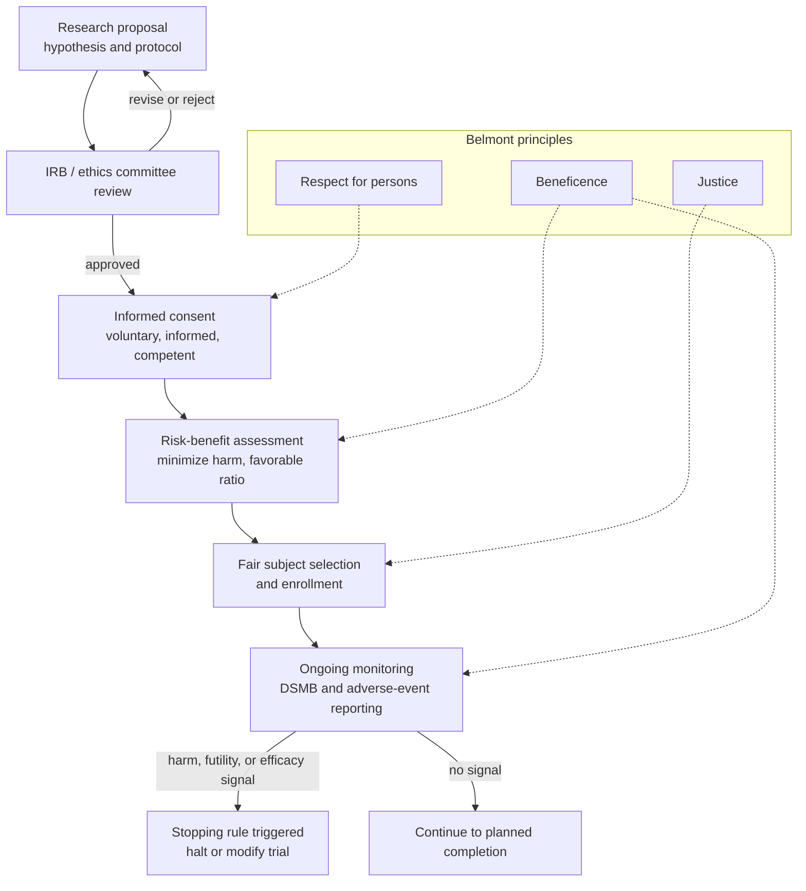

# ⚖️ Research Ethics and Human Subjects

> [!abstract] TL;DR
> **Research ethics** is the body of principles and institutions that governs experiments on human beings so that the pursuit of generalizable knowledge never runs over the people who make it possible. Its foundational texts — the **Nuremberg Code (1947)**, the **Declaration of Helsinki (1964+)**, and the **Belmont Report (1979)** — were each written *after* a scandal, and Belmont's three principles (**respect for persons**, **beneficence**, **justice**) map cleanly onto three operational duties: **informed consent**, **favorable risk-benefit assessment**, and **fair subject selection**. In practice these are enforced by an **IRB / ethics committee** that reviews protocols before enrollment, and policed during a trial by **clinical equipoise**, **stopping rules**, and **data safety monitoring**. The hardest problems are not the obvious atrocities but the quiet ones: the *therapeutic misconception*, the exploitation of vulnerable and poor populations, publication bias, and the reuse of "anonymous" data.

---

## Intuition

**Analogy — the rules written in blood.** A modern building code is not an abstract exercise in prudence. Almost every clause is a fossil of a specific disaster: fire exits that open outward exist because 146 workers died at the Triangle Shirtwaist factory behind doors that opened inward; sprinkler mandates trace to hotel fires; seismic codes are dated by the earthquakes that preceded them. Nobody sat down and *deduced* the code from first principles — society learned it the expensive way, and froze each lesson into law so the next generation would not have to relearn it in the same currency.

Research ethics is exactly this kind of code, written in the same ink. Informed consent is the fire exit installed after Nuremberg. The requirement to treat, not merely observe, is the sprinkler installed after Tuskegee. The rule that you cannot experiment on children in an institution for your convenience is the railing installed after Willowbrook. Read this way, the whole apparatus stops looking like bureaucracy and starts looking like a memorial: **regulation follows scandal**, and the paperwork you resent is someone else's grave marker.

---

## How It Works

### Regulation follows scandal: the historical spine

The field's core documents are best learned as a chain of catastrophe and response:

1. **Nazi medical experiments → the Nuremberg Code (1947).** At the Doctors' Trial, physicians were convicted of lethal experiments on concentration-camp prisoners. The judges articulated ten principles, the first and absolute one being that *"the voluntary consent of the human subject is essential."* Consent was born as a shield against the state and the scientist alike.
2. **The Tuskegee syphilis study (1932–1972) → the Belmont Report (1979).** The US Public Health Service tracked 399 Black men with untreated syphilis for 40 years, actively withholding penicillin even after it became the standard cure, to observe the disease's natural course. Public exposure in 1972 triggered the National Research Act and the commission that produced Belmont.
3. **Willowbrook (1956–1971).** Children with intellectual disabilities were deliberately infected with hepatitis to study the disease and test gamma globulin; "consent" was entangled with admission to an overcrowded institution — a textbook case of coercion dressed as choice.
4. **The Guatemala experiments (1946–1948).** US researchers deliberately infected prisoners, soldiers, and psychiatric patients with syphilis and gonorrhea without any consent — uncovered only in 2010, a reminder that the archive of abuse is still being read.

The pattern is not incidental. Each safeguard exists because someone was harmed in precisely the way it now forbids.

### The three Belmont principles and their operational duties

The **Belmont Report** is the conceptual keystone. It distills ethics into three principles, each with a concrete procedural counterpart. This is the same **respect / beneficence / justice** structure elaborated in the four-principles framework of biomedical ethics, and it leans directly on Kantian ideas about treating persons as ends (see [[Deontology_and_Kantian_Ethics]]) and on distributive fairness (see [[Justice_and_Rawls]]).

| Belmont principle | What it means | Operational duty |
|---|---|---|
| **Respect for persons** | Treat individuals as autonomous agents; protect those with diminished autonomy | **Informed consent** — voluntary, informed, and by a competent person |
| **Beneficence** | Do no harm; maximize benefit and minimize risk | **Risk-benefit assessment** — favorable ratio, harm minimization, monitoring |
| **Justice** | Distribute the burdens and benefits of research fairly | **Fair subject selection** — no exploiting the vulnerable for others' gain |

### Informed consent and its special problems

Consent in *research* is harder than consent in *care*, because the researcher's goal (generalizable knowledge) is not the same as the subject's goal (getting better).

- **The therapeutic misconception** — subjects systematically believe that trial procedures are individualized treatment chosen for *their* benefit, when in fact they are dictated by a protocol and randomization. Even well-drafted forms rarely dislodge this belief.
- **Vulnerable populations** — prisoners (captive, susceptible to coercion), children and the cognitively impaired (cannot consent for themselves), and the *desperately ill* (whose hope corrodes voluntariness). Each requires additional safeguards, surrogate consent, or heightened justification.
- **Consent as process, not signature** — a signed form documents consent but does not constitute it. Comprehension, voluntariness, and the freedom to withdraw are the substance.

### Clinical equipoise: the engine of the RCT

The randomized controlled trial (RCT) poses a sharp ethical puzzle: how can it be right to assign a patient's treatment by coin flip? The answer is **clinical equipoise** (Benjamin Freedman, 1987): randomization is justified *only* while the expert community is genuinely uncertain which arm is better. The moment accumulating evidence resolves that uncertainty, equipoise dissolves and continued randomization to the inferior arm becomes unethical. This is why trials are not "set and forget": a **Data Safety Monitoring Board (DSMB)** performs interim analyses, and pre-specified **stopping rules** halt the trial early for efficacy, for harm, or for futility. The statistics of this monitoring connect directly to sequential hypothesis testing (see [[Statistical_Inference_and_Hypothesis_Testing]]).

### The governance pipeline



---

## Key Concepts

**Secondary (explain to a curious beginner)**
- **Human subject** — a living person about whom a researcher obtains data through intervention or interaction, or whose identifiable private information is used.
- **Informed consent** — the person understands the study, its risks, and their right to say no or quit at any time, and agrees freely.
- **IRB (Institutional Review Board)** — the independent committee that must approve a study *before* it can enroll anyone.
- **Why the rules exist** — historical abuses (Nuremberg, Tuskegee) showed that scientific curiosity, left unchecked, harms people.

**Undergraduate (requires some background)**
- **The three foundational documents** — Nuremberg Code (consent), Declaration of Helsinki (a living clinician's charter, revised repeatedly), Belmont Report (the three-principle framework underlying US regulation, the *Common Rule*, 45 CFR 46).
- **Belmont mapping** — respect → consent; beneficence → risk-benefit; justice → fair selection.
- **Clinical equipoise** — genuine collective uncertainty is the ethical license for randomization.
- **Therapeutic misconception** — the confusion of research participation with personalized treatment.
- **Vulnerable populations** — categories requiring extra protection because autonomy or voluntariness is compromised.

**Graduate (system-level and contested)**
- **The IRB critique** — does mission creep and box-ticking bureaucracy protect subjects or merely protect institutions from liability, while chilling low-risk social-science and quality-improvement research?
- **The global double standard** — the 1990s short-course AZT placebo trials for perinatal HIV in Africa: is a placebo control ethical when an effective (if unaffordable-locally) treatment exists elsewhere? Helsinki's evolving stance on placebos.
- **Justice and exploitation** — offshoring trials to poor populations who bear the risk but cannot afford the resulting drug; the *reasonable availability* and *fair benefit* debates.
- **Research integrity** — fabrication, falsification, plagiarism (FFP); conflicts of interest; publication bias and the reproducibility crisis as *ethical* not merely technical failures (see [[Scientific_Reasoning_and_Method]]).
- **Data ethics and secondary use** — biobanking, broad vs specific consent, re-identification risk, and consent for AI/big-data research (see [[Privacy_and_Data_Protection]]).
- **Emerging frontiers** — gain-of-function and dual-use research of concern; large-scale behavioral experiments on platform users; challenge trials.

---

## Python Demo

This models the ethics of the RCT directly. One arm is genuinely better, but investigators do not know that at the start — that is **clinical equipoise**. A Bayesian monitor tracks the posterior probability that the treatment beats control; once it crosses a **stopping boundary**, equipoise has dissolved and further randomization to the inferior arm is hard to justify. The second plot shows the core tradeoff: **demanding more statistical certainty exposes more patients to the worse arm** — the argument for sequential and adaptive designs over rigidly waiting for a fixed sample size.

```python
"""
Equipoise and the ethics of sequential trial design.
A two-arm RCT where the treatment is genuinely better (unknown to investigators).
Pure numpy + matplotlib.
"""

import numpy as np
import matplotlib.pyplot as plt

# --- Normal CDF via a pure-numpy erf approximation (Abramowitz & Stegun 7.1.26)
def erf(x):
    x = np.asarray(x, dtype=float)
    sign = np.sign(x)
    ax = np.abs(x)
    t = 1.0 / (1.0 + 0.3275911 * ax)
    a1, a2, a3, a4, a5 = (0.254829592, -0.284496736, 1.421413741,
                          -1.453152027, 1.061405429)
    poly = ((((a5 * t + a4) * t + a3) * t + a2) * t + a1) * t
    return sign * (1.0 - poly * np.exp(-ax * ax))

def normal_cdf(z):
    return 0.5 * (1.0 + erf(z / np.sqrt(2.0)))

# --- Posterior P(treatment rate > control rate).
# Beta(1,1) prior; after s successes in n patients -> Beta(1+s, 1+n-s).
# The difference of the two arm-rates is approximated as normal.
def prob_treatment_superior(s_t, n_t, s_c, n_c):
    a_t, b_t = 1.0 + s_t, 1.0 + n_t - s_t
    a_c, b_c = 1.0 + s_c, 1.0 + n_c - s_c
    mean = lambda a, b: a / (a + b)
    var = lambda a, b: a * b / ((a + b) ** 2 * (a + b + 1.0))
    mu = mean(a_t, b_t) - mean(a_c, b_c)
    sd = np.sqrt(var(a_t, b_t) + var(a_c, b_c))
    return normal_cdf(mu / sd)

# --- One 1:1 randomized trial, stopping when the posterior crosses the boundary.
def run_trial(rng, p_treat, p_control, boundary, n_max):
    out_t = rng.random(n_max) < p_treat
    out_c = rng.random(n_max) < p_control
    s_t = s_c = 0
    traj = np.empty(n_max)
    for k in range(1, n_max + 1):
        s_t += out_t[k - 1]
        s_c += out_c[k - 1]
        traj[k - 1] = prob_treatment_superior(s_t, k, s_c, k)
        if traj[k - 1] >= boundary:
            return k, traj[:k]
    return n_max, traj

P_TREAT, P_CONTROL = 0.60, 0.40   # treatment is genuinely better
N_MAX, BOUNDARY_DEMO = 250, 0.975

fig, (ax1, ax2) = plt.subplots(1, 2, figsize=(13, 5))

# --- Plot 1: evidence accumulates and crosses the stopping boundary
rng = np.random.default_rng(1)
for _ in range(6):
    k_stop, traj = run_trial(rng, P_TREAT, P_CONTROL, BOUNDARY_DEMO, N_MAX)
    ax1.plot(np.arange(1, len(traj) + 1), traj, alpha=0.8)
    ax1.plot(k_stop, traj[-1], "ko", ms=5)
ax1.axhline(BOUNDARY_DEMO, color="crimson", ls="--", lw=1.5,
            label=f"stopping boundary = {BOUNDARY_DEMO}")
ax1.axhline(0.5, color="gray", ls=":", lw=1, label="equipoise (P = 0.5)")
ax1.set_xlabel("patients enrolled per arm")
ax1.set_ylabel("P(treatment superior | data)")
ax1.set_title("Equipoise dissolves as data accumulate")
ax1.set_ylim(0.3, 1.02)
ax1.legend(loc="lower right", fontsize=9)

# --- Plot 2: the ethical tradeoff (certainty vs patients on the worse arm)
boundaries = np.array([0.80, 0.90, 0.95, 0.975, 0.99, 0.995, 0.999])
n_trials = 400
harm = np.zeros_like(boundaries)
reached = np.zeros_like(boundaries)
rng2 = np.random.default_rng(42)
for j, b in enumerate(boundaries):
    stops = np.empty(n_trials)
    hits = np.empty(n_trials)
    for t in range(n_trials):
        k_stop, traj = run_trial(rng2, P_TREAT, P_CONTROL, b, N_MAX)
        stops[t] = k_stop            # control-arm patients = patients per arm
        hits[t] = traj[-1] >= b       # did we reach the certainty target?
    harm[j] = stops.mean()
    reached[j] = hits.mean()

ax2.plot(boundaries, harm, "o-", color="darkorange",
         label="patients on inferior arm")
ax2.set_xlabel("required statistical certainty (stopping boundary)")
ax2.set_ylabel("expected control-arm patients at stop", color="darkorange")
ax2.tick_params(axis="y", labelcolor="darkorange")
ax2.set_title("The tradeoff: certainty is paid for in patient harm")
ax3 = ax2.twinx()
ax3.plot(boundaries, reached, "s--", color="steelblue",
         label="trials reaching target")
ax3.set_ylabel("fraction of trials reaching target", color="steelblue")
ax3.tick_params(axis="y", labelcolor="steelblue")
ax3.set_ylim(0, 1.05)

fig.tight_layout()
plt.show()
```

**What to notice.** In the left panel every trajectory drifts upward and crosses the boundary at a different point — that crossing is the ethical moment equipoise ends. In the right panel the harm curve climbs steeply as you demand more certainty: insisting on `0.999` instead of `0.95` buys a marginal increase in confidence at the cost of many more patients randomized to the arm we already suspect is worse. That gap is exactly why adaptive designs, response-adaptive randomization, and pre-specified stopping rules exist.

---

## Real-World Applications

- **University and hospital IRBs (the Common Rule, 45 CFR 46).** Every federally funded US study on human subjects must pass IRB review; the EU mirrors this with research ethics committees and the Clinical Trials Regulation.
- **COVID-19 vaccine trials.** The Pfizer and Moderna Phase 3 RCTs used DSMBs and pre-specified interim efficacy boundaries; hitting them justified early success declarations. The parallel debate over **human challenge trials** (deliberately infecting healthy volunteers) is a live risk-benefit and consent problem.
- **The AZT short-course trials (1990s).** Placebo-controlled perinatal HIV trials in sub-Saharan Africa became the defining case of the **global double standard** — is a placebo ethical where the proven treatment is locally unavailable?
- **The Facebook "emotional contagion" study (2014).** Manipulating 689,000 users' news feeds without informed consent exposed the gap between platform A/B testing and human-subjects rules, and the weakness of "you agreed to the terms of service" as consent.
- **UK Biobank and large biobanks.** Operate on **broad consent** for unspecified future research, stress-testing the limits of specific informed consent and the ethics of secondary data use.
- **The H5N1 gain-of-function moratorium.** A pause on making pathogens more transmissible — the leading example of **dual-use research of concern**, where the risk is not to subjects but to everyone.

---

## Common Pitfalls

- **The therapeutic misconception** — Subjects (and sometimes clinicians) treat randomized protocol care as individualized therapy. Mitigation: explicit, repeated framing that this is research, not tailored treatment.
- **Consent as a signature, not a process** — A signed 20-page form measures legal cover, not comprehension. Voluntariness and understanding are the real requirements; teach-back and simplified forms help.
- **Undue inducement and coercion in the vulnerable** — Large payments to the poor, or "study or lose your spot" pressure in institutions (Willowbrook), corrupt free choice. Payment should compensate, not lure past one's better judgment.
- **Ignoring equipoise** — Running a placebo arm when an effective treatment already exists inflicts avoidable harm; the ethical control is usually best available care, not nothing.
- **IRB box-ticking and mission creep** — Treating review as a liability-shield ritual, or over-regulating minimal-risk survey research, discredits the system and diverts scrutiny from genuinely risky studies.
- **Integrity failures dressed as method** — Publication bias, p-hacking, HARKing, and undisclosed conflicts of interest are ethical breaches: they harm future patients through corrupted evidence (see [[Scientific_Reasoning_and_Method]] and [[Cognitive_Biases_and_Heuristics]]).
- **"It's public data, so it's exempt"** — Scraped social-media and big-data research can re-identify people and violate contextual norms even without direct interaction (see [[Privacy_and_Data_Protection]]).

---

## Related Concepts

- [[Scientific_Reasoning_and_Method]] — Research integrity, reproducibility, and publication bias are where the ethics of research and the philosophy of scientific method meet.
- [[Statistical_Inference_and_Hypothesis_Testing]] — The machinery behind interim analyses, stopping rules, and the meaning of "statistical certainty" in a monitored trial.
- [[Bayesian_Reasoning]] — Underlies adaptive trial designs and the posterior-probability monitoring used in the demo.
- [[Decision_Making_Under_Uncertainty]] — The equipoise-versus-harm tradeoff is a formal decision problem under evolving evidence.
- [[Privacy_and_Data_Protection]] — Governs biobanking, secondary use of data, and consent for AI/big-data research on human subjects.
- [[Justice_and_Rawls]] — The theory of distributive justice behind fair subject selection and the critique of exploiting poor populations.
- [[Deontology_and_Kantian_Ethics]] — "Respect for persons" and the duty never to use a subject merely as a means trace to Kantian ethics.
- [[Consequentialism_and_Utilitarianism]] — The risk-benefit calculus of beneficence borrows a consequentialist logic that autonomy-based consent then constrains.
- [[Applied_Ethics]] — Research ethics is a canonical branch of applied ethics, where abstract principles meet institutional procedure.
- [[Cognitive_Biases_and_Heuristics]] — Explains the therapeutic misconception and the biases that produce publication bias and p-hacking.

---

## Review Questions

**Secondary**
1. The Nuremberg Code and the Belmont Report were each written after specific abuses. Name one abuse behind each, and state the single safeguard it most directly produced.

**Undergraduate**
2. A researcher wants to run a placebo-controlled trial of a new painkiller. An effective, approved painkiller already exists for the condition. Using clinical equipoise and the beneficence principle, explain why the placebo arm is ethically problematic and what control arm would be defensible instead.

**Graduate**
3. A pharmaceutical company runs a trial in a low-income country because recruitment is cheaper and faster, but the resulting drug will be priced beyond that population's reach. Evaluate this under Belmont's justice principle and the "fair benefit" versus "reasonable availability" frameworks. Then use the demo's certainty-versus-harm tradeoff to argue whether a stricter or looser stopping rule is more defensible when the trial population will not benefit from the product.

---

## Sources

- The National Commission, *The Belmont Report: Ethical Principles and Guidelines for the Protection of Human Subjects of Research* (1979) — [HHS OHRP](https://www.hhs.gov/ohrp/regulations-and-policy/belmont-report/index.html)
- *The Nuremberg Code* (1947) — [NIH History of Medicine](https://history.nih.gov/display/history/Nuremberg+Code)
- World Medical Association, *Declaration of Helsinki: Ethical Principles for Medical Research Involving Human Subjects* — [WMA](https://www.wma.net/policies-post/wma-declaration-of-helsinki/)
- Benjamin Freedman, "Equipoise and the Ethics of Clinical Research," *New England Journal of Medicine* 317 (1987): 141–145 — [NEJM](https://www.nejm.org/doi/full/10.1056/NEJM198707163170304)
- Ezekiel J. Emanuel, David Wendler, Christine Grady, "What Makes Clinical Research Ethical?" *JAMA* 283, no. 20 (2000): 2701–2711 — [JAMA](https://jamanetwork.com/journals/jama/fullarticle/192740)

---

#ethics #research-ethics #human-subjects #clinical-trials #irb
