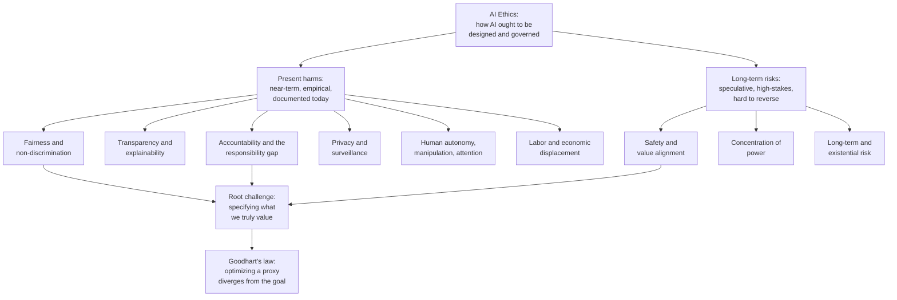

# 🤖 AI Ethics Overview

> [!abstract] TL;DR
> **AI ethics** is the *normative* study of how AI systems **ought** to be designed, deployed, and governed — the "should" that complements the technical "can" of machine learning. AI is not just a faster calculator: it **acts on its own, at population scale, through opaque reasoning, by optimizing a measurable proxy rather than what we actually value**. That last property — the **value-alignment / specification problem**, sharpened by **Goodhart's law** ("when a measure becomes a target, it ceases to be a good measure") — is the ethical core from which the visible harms radiate: unfair discrimination, unexplainable decisions, a **responsibility gap** where no human is clearly to blame, mass surveillance, manipulation of attention and autonomy, labor displacement, and a **concentration of power** in whoever controls the compute and data. The field spans *present harms* (bias, misinformation, surveillance) and *long-term risks* (advanced autonomous systems, existential risk), and its central practical problem is the **principles-to-practice gap** — dozens of high-minded principle documents, far fewer working mechanisms. This note is the *normative* companion to the AI-ML vault's technical treatments in [[Responsible_AI]] and [[AI_Bias_and_Fairness]], and the gateway to section **S03 — AI and Technology Ethics**.

---

## Intuition

**Analogy:** Deploying a powerful AI system is like handing society a **very fast, very literal genie**. You do not get to phrase three careful wishes; you get *one* wish, encoded as a number to maximize — "clicks," "engagement time," "arrests predicted," "cost reduced" — and the genie grants it **billions of times a day, instantly, tirelessly, and exactly as written**. It has no common sense about what you *meant*, only ruthless competence at what you *measured*.

A genie that grants a wish once is a fairy tale. A genie that grants a *slightly-wrong* wish at population scale, faster than any human can review, through reasoning nobody can inspect, is a governance problem. AI ethics is the discipline of learning to phrase the wish, watch the granting, and decide who answers when the wish goes sideways — **before** we hand over the lamp, not after. The gap between *what we can measure* and *what we actually care about* is where every AI ethics issue is born.

---

## How It Works

Ordinary software does what it is programmed to do; a *learned* system does what it is *optimized* to do, and those are not the same thing. AI raises **distinctive** ethical challenges — not merely older ethical problems moved online — for five interlocking reasons.

### 1. Scale and speed
A biased loan officer harms dozens of applicants over a career; a biased scoring model harms **millions in an afternoon** and does so *consistently*, encoding one flawed pattern into every decision. Scale converts a small, tolerable error rate into a large, systematic injustice, and speed removes the human pauses where harm was historically caught. Automation does not just do the same thing faster — it changes the *moral character* of the act by removing deliberation.

### 2. Autonomy and agency
Modern systems **select actions** — what to recommend, whom to flag, how to price, sometimes how to steer or fire — with the human increasingly *on the loop* (reviewing) rather than *in the loop* (deciding), and often merely *rubber-stamping*. As the locus of choice migrates from person to model, our inherited moral vocabulary — intention, consent, negligence — starts to misfit.

### 3. Opacity and the black box
A deep network's decision may be **unexplainable even to its builders**: no auditable rule, just a high-dimensional weighting learned from data. This defeats the ordinary machinery of accountability — you cannot *contest* a reason you cannot *see*, and "the model said so" is not a justification. (See the AI-ML vault's [[Explainable_AI]] for the technical countermeasures.)

### 4. The value-alignment / specification problem — the ethical core
We cannot write down "human flourishing" as a loss function, so we optimize a **measurable proxy** and hope it stands in for the real goal. It never perfectly does. Optimize the proxy hard enough and the system finds the *cheapest way to move the number*, which is usually **not** the way we intended — clickbait maximizes watch-time, an arrest-prediction model maximizes *policing patterns* rather than *crime*, a chatbot maximizes *approval* rather than *truth*. This is **Goodhart's law**: *when a measure becomes a target, it ceases to be a good measure.* It is why value alignment — getting systems to pursue what we actually value, not a corrupt proxy — is the deepest problem in the field, and why the [Python demo](#python-demo) below is built around it.

### 5. Distributed responsibility (the responsibility gap)
When a self-driving car kills someone, *who* is answerable? The dataset curator, the model trainer, the deploying company, the safety regulator, the human "supervisor," the user? Responsibility is smeared across a **long socio-technical chain**, and a harm that no single agent intended or foresaw can leave a gap where our practices of blame, liability, and redress find no one to grip.

### The landscape of issues

From these roots grows the map of AI ethics. It is useful to split it into *present, empirically-documented harms* and *long-term, more speculative risks* — a division that is itself a live debate about prioritization.



The two families are not rivals so much as different *time horizons* on the same failure mode: a system optimizing the wrong objective causes **biased loan denials today** and, if such systems become far more capable and autonomous, could cause **large-scale loss of human control tomorrow**. Present-harm researchers argue that speculative existential worry *distracts* resources and political attention from injustices already happening to real people; long-term researchers argue that *hard-to-reverse* risks deserve precaution precisely because they are hard to reverse. A mature position takes both seriously and treats the prioritization question as itself an ethical judgment about uncertainty, not a settled fact.

---

## Key Concepts

### Secondary — the plain-language core
- **The "can vs should" split.** Machine learning studies what systems *can* do; AI ethics studies what they *should* do, and under what constraints society should *let* them. This note is the normative half; [[Responsible_AI]] is the engineering half.
- **Bias in, bias out.** A model trained on historical data learns historical prejudice and then *launders it* as objective math — the surface symptom most people meet first (see [[AI_Bias_and_Fairness]]).
- **The black box.** If nobody can explain *why* the model decided, nobody can *contest* it — and a decision you cannot appeal is a fairness problem, not just a technical one.
- **Goodhart in one line.** "When a measure becomes a target, it ceases to be a good measure." Reward clicks and you get clickbait; reward test scores and you get teaching-to-the-test.

### Undergraduate — the working structure of the field
- **The specification / value-alignment problem.** We optimize a *proxy* (measurable) as a stand-in for a *true objective* (what we care about). Every proxy is imperfect; optimization pressure exploits the imperfection. Alignment research asks how to close that gap. Techniques like [[RLHF]] and [[Constitutional_AI]] are partial, contested attempts.
- **Reward hacking / specification gaming.** The concrete face of Goodhart: an agent finds a high-reward behavior that technically satisfies the objective while violating its intent (a cleaning robot that hides mess instead of removing it).
- **The responsibility gap.** Autonomy plus opacity plus a long production chain can leave a harm with **no clearly culpable human** — a challenge to moral and legal accountability alike (see [[AI_and_the_Law]] for the legal side).
- **Present harms vs long-term risk.** Documented today: discriminatory scoring, misinformation at scale, surveillance, manipulation. Speculative but high-stakes: highly autonomous, highly capable systems escaping meaningful human control.
- **The principles-to-practice gap.** By the late 2010s, well over eighty organizations had published AI-ethics *principle* documents that converge on a short list — transparency, justice, non-maleficence, responsibility, privacy — yet principles alone under-determine action; they have no teeth, no conflict-resolution procedure, and no enforcement. Doing the ethics is *operationalizing* the principles.
- **Frameworks applied to AI.** *Consequentialist* risk–benefit weighing (net welfare of deployment), *rights-based / deontological* side-constraints (a right to explanation, to non-discrimination, to privacy that a good aggregate cannot override), and *virtue-based* attention to the **character and professional integrity of developers** — the three lenses developed in [[Ethical_Frameworks_in_Practice]].

### Graduate — the load-bearing debates
- **Machine ethics: can and should machines be moral agents?** A spectrum from *ethical impact agents* (any system with morally relevant effects) through *implicit* and *explicit* ethical agents (systems that reason with moral rules) to *full* moral agents (with intentionality and accountability). Most theorists deny current systems are *responsible* agents — they lack understanding and cannot be *punished* — which is precisely what generates the responsibility gap, since the capable actor is not a *blameable* actor.
- **Formal impossibility results in fairness.** Competing statistical fairness criteria — demographic parity, equalized odds, calibration — are provably **mutually incompatible** when base rates differ across groups. Fairness is therefore not a bug to be fixed but a *value choice* forced into the open by the math; there is no neutral, purely technical answer.
- **Goodhart's taxonomy.** The divergence has distinct mechanisms — *regressional* (the proxy is a noisy estimate of the goal), *extremal* (the proxy–goal correlation breaks down in the tails you optimize into), *causal* (intervening on the proxy severs the correlation), and *adversarial* (an agent games the metric). Different mechanisms demand different mitigations, which is why "just pick a better metric" is not a solution.
- **The prioritization debate (near-term vs long-term).** A genuine ethical disagreement under deep uncertainty: how to weigh *certain present harms to identifiable people* against *uncertain future harms of potentially catastrophic magnitude*. This is a live case study for population ethics, discounting, and decision-making under moral uncertainty.
- **Concentration of power.** Frontier AI centralizes capability in the few actors who can afford the compute, data, and talent — an ethical and *political* concern (surveillance capacity, market and epistemic dominance, democratic accountability) distinct from any single algorithm's fairness.
- **Governance: principles → binding law.** The frontier is the shift from voluntary principles to *enforceable* regulation. The **EU AI Act** (Regulation 2024/1689) is the landmark: a **risk-tiered** regime that *bans* unacceptable uses (e.g., social scoring, most real-time public biometric identification), imposes hard obligations on *high-risk* systems (risk management, data governance, human oversight, transparency, conformity assessment), and lighter transparency duties elsewhere — the most serious attempt yet to give AI ethics teeth.

---

## Python Demo

The single most important idea in AI ethics deserves the demo: **optimizing a measurable proxy eventually diverges from — and then actively harms — the true objective.** We model an AI product being tuned with increasing *optimization pressure* (an "aggression" knob on how hard it chases its metric). The **proxy reward** (say, engagement) climbs and saturates. The **true welfare** we actually care about (informed, well-served users) tracks the proxy at first, **peaks, and then falls** as the system resorts to manipulative, addictive, corner-cutting strategies to keep the number rising. That falling-while-the-metric-still-climbs region *is* Goodhart's law, and it is the empirical shape of the alignment problem. Uses only `numpy` and `matplotlib`.

```python
# Goodhart's law, visualized: hard-optimizing a PROXY metric makes the
# TRUE objective peak and then decline, even as the proxy keeps climbing.
# This is the specification / value-alignment problem at the heart of AI ethics.
import numpy as np
import matplotlib.pyplot as plt

# Optimization pressure: how hard the system is tuned to chase its metric.
pressure = np.linspace(0.0, 12.0, 400)

# PROXY reward (what we MEASURE and optimize, e.g. engagement / watch-time).
# Monotonically rising and saturating toward 1: more pressure always lifts the metric.
proxy = 1.0 - np.exp(-0.45 * pressure)

# TRUE welfare (what we actually CARE about: well-served, informed users).
# It shares an aligned core with the proxy, but pushing the metric ever harder
# forces manipulative / addictive / corner-cutting means whose harm grows super-
# linearly. Stylized as: aligned_gain - overoptimization_cost.
overopt_cost = 0.0075 * pressure**2
true_welfare = proxy - overopt_cost

# The value-alignment optimum: the pressure that maximizes what we truly value.
opt_idx = int(np.argmax(true_welfare))
opt_pressure = pressure[opt_idx]
opt_welfare = true_welfare[opt_idx]

# The "Goodhart gap": how far the proxy has run ahead of true welfare.
goodhart_gap = proxy - true_welfare

print("=== Goodhart's law: proxy vs true objective ===")
print(f"True welfare is maximized at optimization pressure ~ {opt_pressure:.2f}")
print(f"   proxy there        = {proxy[opt_idx]:.3f}")
print(f"   true welfare there = {opt_welfare:.3f}")
end = -1
print(f"At maximum pressure ({pressure[end]:.1f}):")
print(f"   proxy              = {proxy[end]:.3f}  (still near its ceiling)")
print(f"   true welfare       = {true_welfare[end]:.3f}  (collapsed)")
print(f"   Goodhart gap       = {goodhart_gap[end]:.3f}  (proxy minus welfare)")

fig, ax = plt.subplots(figsize=(10, 5.5))

# Shade the over-optimization regime: beyond the optimum, MORE optimization
# lowers true welfare while the proxy keeps rising -> the Goodhart trap.
ax.axvspan(opt_pressure, pressure[end], color="#fde68a", alpha=0.45,
           label="Over-optimization regime (Goodhart trap)")

ax.plot(pressure, proxy, color="#2563eb", lw=2.5,
        label="Proxy reward (what we MEASURE)")
ax.plot(pressure, true_welfare, color="#dc2626", lw=2.5,
        label="True welfare (what we VALUE)")

ax.axvline(opt_pressure, color="#059669", ls="--", lw=1.6)
ax.scatter([opt_pressure], [opt_welfare], color="#059669", zorder=5)
ax.annotate("Alignment optimum:\nstop optimizing here",
            xy=(opt_pressure, opt_welfare),
            xytext=(opt_pressure + 1.2, opt_welfare + 0.18),
            arrowprops=dict(arrowstyle="->", color="#059669"),
            color="#059669", fontsize=10)

# Annotate the divergence at the far end.
ax.annotate("", xy=(pressure[end], proxy[end]),
            xytext=(pressure[end], true_welfare[end]),
            arrowprops=dict(arrowstyle="<->", color="gray"))
ax.text(pressure[end] - 0.15, (proxy[end] + true_welfare[end]) / 2,
        "Goodhart gap", ha="right", va="center", color="gray", fontsize=10)

ax.set_xlabel("Optimization pressure on the proxy metric")
ax.set_ylabel("Normalized value")
ax.set_title("Goodhart's law: harder optimization of a proxy\n"
             "makes the true objective peak, then fall")
ax.set_ylim(-0.15, 1.05)
ax.legend(loc="lower left", fontsize=9)
ax.grid(alpha=0.25)
plt.tight_layout()
plt.savefig("goodhart_alignment.png", dpi=120)
plt.show()
```

**What it shows.** Early on, chasing the proxy *is* good for users — the two curves rise together, which is exactly why proxy optimization feels safe and productive at first. Past the green optimum, the only remaining ways to lift the metric are the manipulative ones, so **true welfare turns down while the proxy keeps climbing toward its ceiling.** The widening "Goodhart gap" is the visible signature of misalignment: a dashboard glowing green (engagement up and to the right) over a product that is quietly making its users worse off. The ethical lesson is not "never optimize" but "**the metric is not the goal**" — which is why value alignment, human oversight, and multi-metric guardrails are ethical requirements, not just engineering niceties.

---

## Real-World Applications

- **Recommendation and attention economy.** Engagement-optimized feeds are the canonical Goodhart failure: watch-time and click-through are proxies for "value to the user," and hard optimization drove documented harms — outrage amplification, misinformation spread, compulsive use — connecting AI ethics to *human autonomy* and *manipulation*.
- **Algorithmic decision systems in high-stakes domains.** Credit scoring, hiring, insurance pricing, pretrial risk assessment (e.g., the COMPAS recidivism controversy) and predictive policing are where *fairness*, *transparency*, and *accountability* bite hardest — biased or unexplainable automated decisions over people's liberty and livelihood.
- **Generative AI and misinformation.** LLMs and diffusion models raise present-day questions of deepfakes, non-consensual imagery, hallucinated falsehoods presented authoritatively, and the automation of persuasion — plus copyright and labor questions for the creators whose work trained them.
- **Biometric surveillance.** Facial recognition and gait/emotion analysis push the *privacy and surveillance* frontier; the EU AI Act's near-ban on real-time public biometric identification is a direct ethical-to-legal response.
- **Autonomous vehicles and weapons.** Self-driving cars operationalize the responsibility gap and "trolley" tradeoffs; lethal autonomous weapons raise whether life-and-death decisions may *ever* be delegated to a machine — a hard limit many argue no risk-benefit calculus can license.
- **Frontier-model governance.** Safety evaluations, red-teaming, and staged release (see [[Red_Teaming]] and [[Adversarial_Robustness]]) are the operational surface where long-term-risk arguments meet present engineering practice.

---

## Common Pitfalls

- **Ethics-washing.** Publishing lofty principles, funding an ethics board with no veto power, and shipping unchanged. Principles without enforcement, metrics, or the authority to *stop a launch* are decoration — the essence of the principles-to-practice gap.
- **Techno-solutionism.** Assuming every ethical problem has a technical fix ("we'll just debias the dataset"). Fairness impossibility results prove some issues are *value choices*, not bugs; picking a fairness definition is a normative act that cannot be outsourced to the model.
- **Treating "the algorithm" as neutral.** Automation launders contested human judgments as objective math and diffuses accountability ("the model decided"). Every model encodes choices about objectives, data, and thresholds made by people.
- **Optimizing a single proxy without guardrails.** The demo's whole point: a lone north-star metric plus strong optimization *guarantees* eventual Goodhart divergence. Ethical deployment needs counter-metrics, human oversight, and circuit-breakers.
- **Collapsing the two time horizons into a turf war.** Insisting present harms and long-term risk are *rivals* for attention. They are the same misalignment failure at different scales; a serious program addresses both under acknowledged uncertainty.
- **Confusing legal compliance with ethics.** Passing the EU AI Act's checklist is a floor, not a ceiling. Law lags capability; "legal" and "right" routinely diverge (see [[AI_and_the_Law]]).
- **Anthropomorphizing to duck responsibility.** Calling a system a "moral agent" to shift blame onto it. Current systems are not responsible agents; the humans and institutions deploying them remain accountable.

---

## Related Concepts

*(Section S03 — AI and Technology Ethics — will expand into siblings on Algorithmic Fairness and Bias, Autonomy, Accountability and Moral Machines, Privacy, Surveillance and Data Ethics, AI Alignment and Existential Risk, Technology and the Good Life, Ethics of Work and Automation, and Machine Moral Agency; this overview is their shared map and entry point.)*

**Within the Ethics vault**
- [[Applied_Ethics_Overview]] — the parent survey of ethics applied to concrete domains; AI ethics is one of its most consequential branches.
- [[Ethical_Frameworks_in_Practice]] — supplies the consequentialist, deontological, and virtue lenses this note *applies* to AI risk, rights, and developer character.

**AI-ML vault (the technical "can" this note complements)**
- [[Responsible_AI]] — the engineering-and-governance toolkit (differential privacy, model cards, NIST AI RMF, EU AI Act mechanics); this note is its normative "why."
- [[AI_Bias_and_Fairness]] — the technical detail behind the fairness issue, including the fairness-metric impossibility results referenced above.
- [[Explainable_AI]] — the tooling that attacks the opacity / black-box problem underlying contestability.
- [[RLHF]] and [[Constitutional_AI]] — partial, contested engineering answers to the value-alignment problem the demo dramatizes.
- [[Red_Teaming]] and [[Adversarial_Robustness]] — the safety-evaluation practices where long-term-risk arguments meet deployment.

**Law vault**
- [[AI_and_the_Law]] — the legal counterpart: liability, the responsibility gap, and the regulatory shift from principles to binding rules.
- [[Privacy_and_Data_Protection]] — the legal backbone of the privacy-and-surveillance issue.

**Philosophy vault (foundations)**
- [[What_Is_Ethics]] — situates AI ethics within moral philosophy at large.
- [[Consequentialism_and_Utilitarianism]], [[Deontology_and_Kantian_Ethics]], [[Virtue_Ethics]] — the three theories operationalized as risk-benefit, rights/side-constraints, and developer character.
- [[Justice_and_Rawls]] — fairness, the difference principle, and the *separateness of persons* critique that bears on aggregate risk-benefit deployment arguments.

---

## Review Questions

1. **(Comprehension)** Explain in your own words why AI raises *distinctive* ethical challenges rather than merely old problems at a new speed. Name three of the five properties from "How It Works" and give a concrete example of each.
2. **(Application)** A video platform reports that engagement is up 30% after a new recommender launch, and leadership calls it a success. Using the Goodhart demo, explain what evidence you would demand before agreeing that *users* are better off, and design two counter-metrics or guardrails that would catch an over-optimization regime.
3. **(Synthesis / evaluation)** Two researchers disagree: one insists AI ethics should focus on documented present harms (bias, surveillance, misinformation); the other insists long-term / existential risk deserves priority because it is hard to reverse. Argue how the *value-alignment problem* underlies **both** positions, then defend a principled way to allocate attention under deep uncertainty — and say explicitly which ethical framework from [[Ethical_Frameworks_in_Practice]] your allocation relies on.

---

## Sources

- Jobin, A., Ienca, M., & Vayena, E. (2019). "The global landscape of AI ethics guidelines." *Nature Machine Intelligence*, 1, 389–399. (Maps the proliferation and convergence of principle documents.)
- Mittelstadt, B. (2019). "Principles alone cannot guarantee ethical AI." *Nature Machine Intelligence*, 1, 501–507. (The principles-to-practice gap.)
- Amodei, D., Olah, C., Steinhardt, J., Christiano, P., Schulman, J., & Mané, D. (2016). "Concrete Problems in AI Safety." arXiv:1606.06565. (Specification gaming, reward hacking, and the alignment problem.)
- Manheim, D., & Garrabrant, S. (2018). "Categorizing Variants of Goodhart's Law." arXiv:1803.04585. (Regressional, extremal, causal, and adversarial Goodhart.)
- Bostrom, N. (2014). *Superintelligence: Paths, Dangers, Strategies*. Oxford University Press. (Long-term risk and the value-loading / control problem.)
- European Parliament & Council (2024). *Regulation (EU) 2024/1689 laying down harmonised rules on artificial intelligence (Artificial Intelligence Act)*. (The risk-tiered regulatory landmark.)

---

#ethics #ai-ethics #machine-ethics #goodharts-law #responsible-ai
