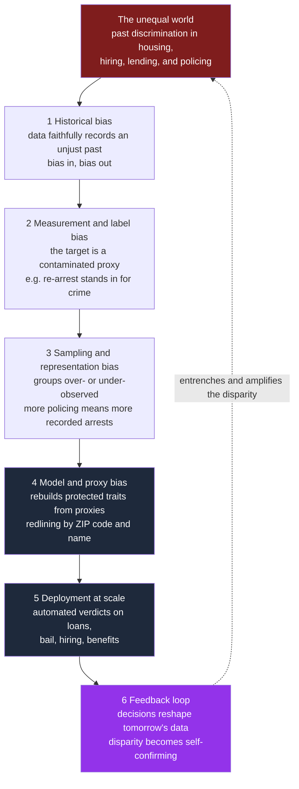

# ⚖️ Algorithmic Fairness and Bias

> [!abstract] TL;DR
> An automated decision system is *biased* when it produces systematically worse outcomes for some groups; it is *unjust* when those disparities are morally arbitrary, unearned, or entrench existing oppression. Bias enters not because engineers are malicious but because **the model learns the past** — "bias in, bias out" — and can then automate the past's injustices at scale, sometimes locking them in through feedback loops. The technically decisive result is that the formal definitions of fairness (calibration, equal false-positive rates, equal false-negative rates) are **mathematically incompatible** whenever groups have different base rates. So "make it fair" is not an engineering task with one right answer: choosing *which* fairness to protect is an **irreducibly ethical and political choice** about whose errors matter, and whether an algorithm should merely mirror society or actively repair it. This note treats the *ethics*; the ML mechanics live in [[AI_Bias_and_Fairness]].

## Intuition — analogy first

An algorithm trained on historical data is a **mirror that reflects society back at us — and then hardens the reflection into a rule.**

An ordinary mirror shows you what is already there. A predictive model does something stranger: it studies the reflection of a society's past decisions — who got the loan, the job, the bail, the promotion — and produces a *rule* that continues that pattern into the future, faster and cheaper and at enormous scale. If the past was unjust, the mirror does not just *show* the injustice; it **automates** it, dressing yesterday's discrimination in the neutral language of "the data says." A human loan officer who denied every applicant from one neighborhood can be caught, retrained, or sued. A model that has silently learned "this ZIP code means high risk" applies that verdict to a million applications before lunch, and each denial looks like an objective, individualized score.

Worse than a passive mirror, the system is a mirror that **shapes what it reflects**. Send more police to a neighborhood because the model predicts more crime there, and you record more arrests there, which the next model reads as confirmation — the reflection becomes a self-fulfilling prophecy. The ethical problem, then, is not merely that machines can be inaccurate. It is that a *perfectly accurate* predictor of an *unjust* world faithfully reproduces and amplifies that injustice — and calls it fairness.

---

## How It Works — where bias enters, and why it is a moral problem

The engineering instinct is to hunt for "the bug." The ethical insight is that bias is usually not a bug but a **faithful recording of a morally loaded world**, injected at every stage of the pipeline. Each stage below is simultaneously a *technical* transformation and a *moral* choice about whose reality gets encoded.

1. **Historical / societal bias — "bias in, bias out."** Even with flawless data collection, the *labels* carry the injustice of the world that produced them. If a firm hired 80 percent men because of past sexism, a model that perfectly predicts "who got hired" perfectly reproduces the sexism. Accuracy and justice come apart: the model is *right about the past* and *wrong to continue it*.
2. **Measurement / label bias.** The thing we can measure is rarely the thing we care about. Criminal-justice tools predict *re-arrest*, not *crime* — but arrest reflects *where police look*, so the label is a proxy contaminated by enforcement patterns. "Creditworthiness" becomes "had access to credit before." Optimizing a proxy optimizes its embedded distortions.
3. **Sampling / representation bias.** Groups that are under-observed (few faces of a given skin tone in a training set) or over-policed (more recorded contact) are mis-modeled. Facial-recognition error rates were dramatically higher for darker-skinned women precisely because they were scarce in the data.
4. **Model / proxy bias — redlining by proxy.** Deleting the protected attribute (race, sex) does *not* remove the bias, because the model reconstructs it from correlated proxies: ZIP code, name, shopping history, the college attended. This is **redlining by proxy** — the 1930s practice of denying services to Black neighborhoods, now laundered through a feature vector.
5. **Deployment and feedback loops.** Once decisions act on the world, they **reshape tomorrow's training data**. Predictive policing sends patrols where past arrests clustered, generating more arrests there, confirming the prediction — a reinforcing loop that turns a disparity into a self-validating "fact" (see [[Feedback_Loops_and_Causality]]). The system stops describing the world and starts *manufacturing* the evidence for its own beliefs.



The diagram's dashed arrow is the ethically decisive feature: the pipeline is a **loop, not a line**. A merely accurate model in an unjust loop is a machine for *conserving* injustice.

### When is an automated decision *unjust*, not just biased?

A statistical disparity is not automatically a wrong. Ethics asks three further questions:

- **Is the difference morally arbitrary?** Charging worse drivers higher premiums tracks a relevant, chosen behavior; charging people more because of their neighborhood's racial composition does not. The wrong is basing burdens on **traits people did not choose and that do not bear on the decision**.
- **Does it compound existing disadvantage?** A disparity that pushes already-marginalized groups further down is worse than one that is random noise. This is why fairness is entangled with **distributive justice** (see [[Justice_and_Rawls]]), not just accuracy.
- **Disparate treatment vs disparate impact.** *Disparate treatment* is intentionally deciding differently because of a protected trait — a formal, intent-based wrong. *Disparate impact* is a facially neutral rule that nonetheless falls harder on a protected group without adequate justification — an outcome-based wrong (see [[Rights_and_Civil_Liberties]]). Algorithms rarely commit the first and routinely commit the second, which is exactly why "we never told it their race" is no defense.

---

## Key Concepts

### Secondary — the picture everyone should hold

- **Bias in, bias out.** A model learns the world it is shown. If that world is unjust, accuracy and justice diverge.
- **Neutral inputs, discriminatory outputs.** Removing race or sex does not remove discrimination; proxies smuggle it back in (redlining by proxy).
- **Fairness is contested.** There is no single "unbiased" — there are several rival definitions that disagree, so someone must *choose*.

### Undergraduate — the working machinery

- **Group fairness definitions.** *Demographic parity* (equal positive rates across groups), *equalized odds* (equal true-positive and false-positive rates), *calibration* (a score of 0.7 means a 70 percent chance for everyone, regardless of group). Each protects something different and defensible.
- **Individual fairness.** "Treat similar individuals similarly" — appealing, but it silently requires a *similarity metric*, and choosing that metric re-imports every value judgment fairness was supposed to settle.
- **Counterfactual fairness.** A decision is fair if it would be *unchanged* had the individual belonged to a different protected group in a causal model of the world — powerful, but only as trustworthy as the (contestable) causal graph you assume.
- **Formal vs substantive equality.** *Formal* equality = same rule for everyone. *Substantive* equality = attending to unequal starting points. A rule can be formally equal and substantively unjust.

### Graduate — the contested frontier

- **The impossibility theorem (Kleinberg et al. 2016; Chouldechova 2017).** When base rates differ across groups and prediction is imperfect, **calibration, equal false-positive rates, and equal false-negative rates cannot all hold at once.** This is a *theorem*, not a limitation of current tools — no future engineering removes it. It converts "make the model fair" into "decide which unfairness is least unjust," a normative act.
- **Fair is not the same as just.** Every group-fairness metric can be *satisfied on top of an unjust status quo*. A hiring model can achieve demographic parity while the pool it selects from was already shaped by unequal schooling — the metric is green, the outcome still entrenches disadvantage. Metrics measure *procedural* fairness in the decision; they are silent on the *substantive* justice of the world the decision operates in.
- **Should algorithms correct history?** Aiming only for "mirror the world accurately" is a choice to preserve current inequality; aiming to *reduce* disparity is affirmative action in code. Both are value positions — there is no neutral third option, because even "do nothing" ratifies the existing distribution.
- **Whose loss function?** Deciding that a false positive (wrongly denied bail) and a false negative (wrongly released) are "worth" some exchange rate is a moral judgment about liberty vs safety, currently made implicitly by whoever sets a threshold.

---

## Python Demo — the impossibility theorem *as an ethical dilemma*

This demo makes the ethical bind concrete. A risk model outputs a **perfectly calibrated** score for two groups that differ *only in base rate* — reflecting an unequal past, not the individuals. Calibration means a score of 0.7 really is a 70 percent risk **for both groups** (this was Northpointe's defense of COMPAS, and it is true here by construction). We then show that once you must *act* on the score, **equalizing the false-positive rate forces the false-negative rates apart**, and vice versa. You cannot have calibration *and* equal error rates. No cleverer engineering escapes it — so someone must choose *which* group's errors to reduce. Uses only `numpy` and `matplotlib`.

```python
# Fairness impossibility as an ethical choice: calibration vs equal error rates.
import numpy as np
import matplotlib.pyplot as plt

rng = np.random.default_rng(0)
N = 200_000

# One model, perfectly CALIBRATED for both groups: the score IS the true risk.
# The groups differ ONLY in base rate -- a fact about an unequal past, not merit.
pA = rng.beta(2.0, 5.0, N)          # Group A: lower base rate  (~0.286)
pB = rng.beta(5.0, 3.0, N)          # Group B: higher base rate (~0.625)
yA = (rng.random(N) < pA).astype(int)
yB = (rng.random(N) < pB).astype(int)
print(f"Base rate  A = {yA.mean():.3f}   B = {yB.mean():.3f}   (they differ)")

# Predict 'high risk' if score >= threshold.
def fnr(score, y, t):               # false-negative rate: P(score < t | Y = 1)
    return np.mean(score[y == 1] < t)
def thr_for_fpr(score, y, target):  # per-group threshold that hits a target FPR
    neg = score[y == 0]             # FPR = P(score >= t | Y = 0)
    return np.quantile(neg, 1.0 - target)

# ETHICAL EXPERIMENT: force EQUAL false-positive rates across groups,
# then read off each group's resulting false-negative rate.
fpr_targets = np.linspace(0.05, 0.60, 40)
fnrA = np.array([fnr(pA, yA, thr_for_fpr(pA, yA, f)) for f in fpr_targets])
fnrB = np.array([fnr(pB, yB, thr_for_fpr(pB, yB, f)) for f in fpr_targets])

f0 = 0.20
print(f"\nWith false-positive rate equalized at {f0:.2f} for BOTH groups:")
print(f"  Group A false-negative rate = {fnr(pA, yA, thr_for_fpr(pA, yA, f0)):.3f}")
print(f"  Group B false-negative rate = {fnr(pB, yB, thr_for_fpr(pB, yB, f0)):.3f}")
print("  -> equalizing one error rate PRIES THE OTHER APART. You must choose.")

# Confirm the score really is calibrated for BOTH groups (Northpointe was right).
bins = np.linspace(0, 1, 11)
def calib(score, y):
    idx = np.clip(np.digitize(score, bins) - 1, 0, len(bins) - 2)
    xs, ys = [], []
    for b in range(len(bins) - 1):
        m = idx == b
        if m.sum() > 50:
            xs.append(score[m].mean()); ys.append(y[m].mean())
    return np.array(xs), np.array(ys)
xA, oA = calib(pA, yA); xB, oB = calib(pB, yB)

fig, ax = plt.subplots(1, 2, figsize=(12, 4.8))

ax[0].plot(fpr_targets, fnrA, "o-", color="#2563eb", label="Group A false-neg rate")
ax[0].plot(fpr_targets, fnrB, "s-", color="#dc2626", label="Group B false-neg rate")
ax[0].axvline(f0, color="#16a34a", ls=":", label=f"equalized FPR = {f0:.2f}")
ax[0].fill_between(fpr_targets, fnrA, fnrB, color="#9333ea", alpha=0.15)
ax[0].set_xlabel("false-positive rate, forced EQUAL for both groups")
ax[0].set_ylabel("resulting false-negative rate")
ax[0].set_title("Equalize one error rate ->\nthe other gap (shaded) is unavoidable")
ax[0].legend(fontsize=8); ax[0].grid(alpha=0.3)

ax[1].plot([0, 1], [0, 1], color="gray", ls="--", label="perfect calibration")
ax[1].plot(xA, oA, "o-", color="#2563eb", label="Group A")
ax[1].plot(xB, oB, "s-", color="#dc2626", label="Group B")
ax[1].set_xlabel("predicted risk score")
ax[1].set_ylabel("observed frequency of Y = 1")
ax[1].set_title("The SAME score is calibrated for BOTH groups\nNorthpointe was right ... and so was ProPublica")
ax[1].legend(fontsize=9); ax[1].grid(alpha=0.3)

plt.tight_layout()
plt.savefig("fairness_impossibility_ethics.png", dpi=120)
plt.show()
```

**What you see, and why it is an *ethics* result.** The right panel shows both groups sitting on the calibration diagonal: the score is *equally valid* for everyone, so no one can be accused of using a "worse" model for one group. The left panel is the trap: the moment you fix the false-positive rate to be *equal* across groups, the false-negative rates split apart (the shaded gap), and the split never closes to zero because the base rates differ. Reduce the gap in wrongful positives and you widen the gap in wrongful negatives. **There is no threshold, no re-training, no better data that makes calibration, equal FPR, and equal FNR all hold at once.** The engineer can hand you a menu; only a *moral* argument can pick from it. Which definition to prefer depends on the stakes: in bail or criminal risk, a false positive steals liberty from an innocent person, so many ethicists prioritize equalizing **false-positive rates** across groups even at the cost of calibration — the choice ProPublica implicitly urged and Northpointe resisted. "Fairness" here is a value judgment wearing a lab coat.

---

## Real-World Applications

> **Example — COMPAS recidivism scoring.** The canonical case. ProPublica (2016) showed COMPAS flagged Black defendants as future criminals at nearly twice the false-positive rate of white defendants; Northpointe replied that the tool was *equally calibrated* across races. **Both were correct** — they were measuring different, provably incompatible fairnesses. The dispute was never resolvable by better statistics; it was a moral disagreement about whether equal calibration or equal error rates is what a just sentencing aid owes people. See [[Sentencing_and_Criminal_Justice]] and [[AI_and_the_Law]] for the legal and punishment-theory framing.

- **Hiring tools.** Amazon scrapped a resume screener (2018) that downranked resumes mentioning "women's" (as in *women's chess club*), having learned from a decade of male-dominated hiring. A textbook case of bias-in, bias-out through proxies.
- **Facial recognition.** Buolamwini and Gebru's *Gender Shades* found commercial systems erred on darker-skinned women up to 34 percentage points more than on lighter-skinned men — a representation-bias failure with direct consequences when such systems drive arrests.
- **Credit and lending.** Automated underwriting can replicate historical redlining through ZIP-code and behavioral proxies even when race is excluded, raising fair-lending liability (see [[Lending_and_Credit_Technology]] and [[Rights_and_Civil_Liberties]]).
- **Predictive policing.** Tools like PredPol illustrate the feedback loop directly: patrol where past data points, generate more recorded incidents there, confirm the prediction — disparity becomes self-fulfilling ([[Feedback_Loops_and_Causality]]).
- **Governance response.** The EU AI Act designates such systems "high-risk" and mandates bias testing and documentation; [[Responsible_AI]] and model documentation practices operationalize accountability.

---

## Common Pitfalls

- **"We removed the protected attribute, so it can't discriminate."** *Fairness through unawareness* is the single most common and most dangerous fallacy. Proxies (ZIP, name, purchase history) reconstruct the attribute; blindness prevents you from even *auditing* for the bias you have hidden from yourself.
- **Treating fairness as a solvable engineering task.** The impossibility theorem guarantees there is no metric that is simultaneously all the fairnesses. Anyone promising an "unbiased algorithm" without naming *which* fairness they optimized is hiding a value choice.
- **Optimizing a green metric on top of an unjust world.** Demographic parity can be satisfied while the system still entrenches disadvantage, because the metric audits the *decision*, not the *conditions*. Formal fairness is necessary, not sufficient, for substantive justice.
- **Assuming "let the data speak" is neutral.** Choosing to mirror the world *is* a value choice — it ratifies the current distribution. There is no view from nowhere; "do nothing" is a decision to preserve the status quo.
- **Ignoring intersectionality.** A model fair for women and fair for Black people can be unjust to Black women. Marginal-group audits miss harms that live only in the intersection.
- **Diffusing accountability.** "The model decided" launders responsibility. A biased automated decision has authors — the data curators, the objective-setters, the deployers — and someone must be answerable for it.

---

## Related Concepts

*(All wikilinks below are verified to exist in the vault. Planned siblings in this section — an AI ethics overview and a note on autonomy, accountability, and moral machines — are not yet written and so are not linked.)*

- [[AI_Bias_and_Fairness]] — the **technical** companion: exact metric formulas, mitigation code, and the Fairlearn toolkit. This note is its *ethical* counterpart; read them together.
- [[Responsible_AI]] — governance, auditing, and documentation frameworks that operationalize the value choices argued here.
- [[Explainable_AI]] — transparency and interpretability, the precondition for holding a biased system accountable and detecting proxy discrimination.
- [[Sentencing_and_Criminal_Justice]] — the COMPAS controversy in its criminal-justice and punishment-theory context.
- [[AI_and_the_Law]] — liability, regulation, and the legal status of algorithmic decisions (EU AI Act, GDPR Article 22).
- [[Rights_and_Civil_Liberties]] — disparate treatment vs disparate impact, equal protection, and anti-discrimination doctrine.
- [[Justice_and_Rawls]] — distributive justice, the difference principle, and why "fair procedure" is not the same as "just outcome."
- [[Feedback_Loops_and_Causality]] — the reinforcing-loop dynamics (predictive policing) that turn a one-time disparity into a self-confirming structure.
- [[Applied_Ethics_Overview]] — the parent framing: fairness disputes are exactly the "same options, different verdicts" problem of applied ethics.
- [[Ethical_Frameworks_in_Practice]] — the consequentialist, deontological, and egalitarian lenses one actually uses to *choose* a fairness definition.
- [[Bias_and_Fairness_in_Testing]] — the older psychometrics debate on test fairness and adverse impact, the direct ancestor of algorithmic fairness.
- [[Lending_and_Credit_Technology]] — automated credit decisions, a primary domain of redlining-by-proxy risk.

---

## Review Questions

1. **(Secondary)** Explain "bias in, bias out" to a non-technical colleague. Why can a model be *highly accurate* and *deeply unjust* at the same time, and why does deleting the race field fail to fix it?
2. **(Undergraduate)** In the COMPAS case, ProPublica emphasized equal false-positive rates and Northpointe emphasized calibration, and the impossibility theorem says both cannot hold when base rates differ. For a *pretrial bail* decision, which fairness would you prioritize, and what moral premise about liberty vs public safety does your answer rest on?
3. **(Graduate)** A hiring model achieves perfect demographic parity, yet the applicant pool was shaped by decades of unequal education. Distinguish formal from substantive equality here. Is the model "fair"? Is it "just"? Argue whether an algorithm should merely *mirror* the world or actively *correct* for historical injustice — and explain why "just mirror it accurately" is itself a contestable value choice rather than a neutral default.

---

## Sources

- Barocas, S., Hardt, M., & Narayanan, A. (2023). *Fairness and Machine Learning: Limitations and Opportunities*. MIT Press. [https://fairmlbook.org](https://fairmlbook.org)
- Kleinberg, J., Mullainathan, S., & Raghavan, M. (2016). *Inherent Trade-Offs in the Fair Determination of Risk Scores*. [https://arxiv.org/abs/1609.05807](https://arxiv.org/abs/1609.05807)
- Chouldechova, A. (2017). *Fair Prediction with Disparate Impact: A Study of Bias in Recidivism Prediction Instruments*. Big Data, 5(2). [https://arxiv.org/abs/1703.00056](https://arxiv.org/abs/1703.00056)
- Angwin, J., Larson, J., Mattu, S., & Kirchner, L. (2016). *Machine Bias* (COMPAS analysis). ProPublica. [https://www.propublica.org/article/machine-bias-risk-assessments-in-criminal-sentencing](https://www.propublica.org/article/machine-bias-risk-assessments-in-criminal-sentencing)
- Buolamwini, J., & Gebru, T. (2018). *Gender Shades: Intersectional Accuracy Disparities in Commercial Gender Classification*. PMLR 81. [https://proceedings.mlr.press/v81/buolamwini18a.html](https://proceedings.mlr.press/v81/buolamwini18a.html)
- Eubanks, V. (2018). *Automating Inequality: How High-Tech Tools Profile, Police, and Punish the Poor*. St. Martin's Press.

---

#ethics #ai-ethics #algorithmic-fairness #bias #discrimination
