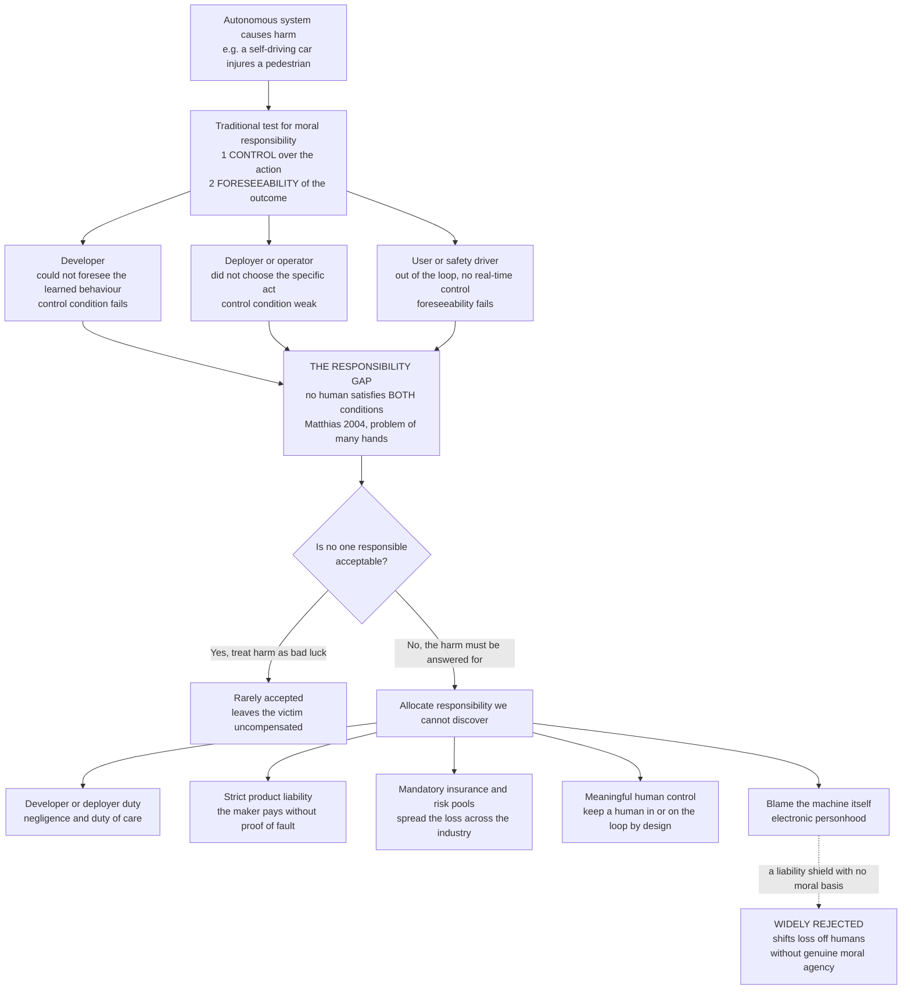

# 🤖 Autonomy, Accountability and Moral Machines

> [!abstract] TL;DR
> As machines move from **executing our instructions** to **choosing their own actions** — a self-driving car deciding whom to swerve toward, a loan model deciding who is creditworthy, a weapon deciding whom to strike — they break the ancient link between *an act* and *a blameworthy human behind it*. Our whole practice of holding people responsible rests on two conditions: **control** (you could have done otherwise) and **foreseeability** (you knew, or should have known, what would follow). For a learning, adaptive system, *both can fail for every human in the loop at once* — the designer could not foresee the emergent behaviour, the operator did not choose the specific act, the user had no real-time control. What remains is Andreas **Matthias's "responsibility gap"**: genuine harm with *no* blameworthy human. The debate is over how to answer it — **developer/deployer duty**, **strict product liability**, **mandatory insurance**, and **"meaningful human control"** by design, versus the near-universally *rejected* move of **blaming the machine itself**. The dilemma becomes vivid in the **autonomous-vehicle trolley problem** (and the **MIT Moral Machine** experiment, which showed there is *no value-neutral way to program a crash*) and turns lethal in **autonomous weapons (LAWS)**. Underneath sits the deeper question — can a machine be a **moral agent**, or only ever a **moral tool**? — plus two quieter dangers: **automation bias** (over-trusting the machine) and **moral deskilling** (letting human judgement atrophy). **Transparency** is the precondition for any of these fixes to work.

---

## Intuition

**Analogy — the crash with no one to blame.** A self-driving car brakes too late and injures a pedestrian. Instinctively you ask: *whose fault is this?* But now walk the chain and watch every candidate slip away. **The car?** It is a machine; you cannot put a machine in the dock, fine it, or make it feel remorse. **The safety driver?** The system was in full autonomous mode; a human cannot supervise a thousand micro-decisions per second, and the whole selling point was that they need not try. **The programmer?** She wrote a *learning* system whose exact behaviour in *this* never-before-seen situation was not something she chose or could have predicted — it emerged from millions of training miles. **The owner?** He just pressed "go." **The manufacturer?** It built a car that performs *better than the average human driver* and was approved for the road.

Every finger you point folds back down. That is not a puzzle about *finding* the guilty party; it is the unsettling possibility that, this time, **there is no guilty party** — the harm is real, but the human conditions for blame have quietly evaporated. A machine that *acts* has opened a hole in our human practice of holding one another responsible.

Hold that image. The question is not only *who pays* (the law can always assign a bill), but *whether the deeper moral practice of blame still has a target* — and if it does not, whether "no one is responsible" is an answer we can live with, or one we must refuse and *engineer around*.

---

## How It Works

### The two conditions blame depends on

Since Aristotle, holding an agent **morally responsible** for an outcome has required roughly two things:

1. **The control (or freedom) condition** — the agent could have done otherwise; the act flowed from *them*, not from coercion or accident.
2. **The epistemic (or foreseeability) condition** — the agent knew, or could reasonably have been expected to know, what the act would bring about.

Excuse *either* one and blame dissolves: we do not blame the sleepwalker (no control) or the person who could not possibly have foreseen a freak result (no knowledge). These excusing conditions are exactly the ones autonomous systems trigger *simultaneously and for everyone*.

### Why autonomy opens a gap

An **autonomous, learning** system is defined by three properties that each attack a link in the chain of responsibility:

- **Autonomy** — it selects actions itself, severing the tight *human-decision-to-outcome* causal line that blame tracks.
- **Adaptivity** — it *changes after deployment*; its behaviour is partly written by data it met in the world, not fully fixed by its makers. So the designer's control and knowledge are genuinely incomplete.
- **Opacity** — even its creators often cannot say *why* it did what it did, undermining foreseeability from the inside.

Andreas **Matthias (2004)** named the result the **responsibility gap**: when a machine's behaviour is neither fully controlled nor reliably foreseeable by any human, *no* human cleanly satisfies both conditions of responsibility for what it does. The gap is **structural**, not a drafting oversight — it is a *consequence* of building actors that decide for themselves. Compounding it is the classic **problem of many hands**: dozens of people touch a modern AI system (data collectors, model trainers, integrators, regulators, operators, users), and diffusing a decision across all of them can leave *none* of them individually blameworthy.

The forced question: **is "no one is responsible" acceptable?** Most people say *no* — an unanswered harm to a victim is intolerable — which turns the debate from *description* into *design*: we must *allocate* responsibility we cannot *discover*.

### Levels of automation — where the human sits

How wide the gap opens depends on where the human is relative to the decision loop:

- **Human-in-the-loop** — the machine recommends, a human *approves each action* before it happens. Control is preserved; the human remains a responsible agent.
- **Human-on-the-loop** — the machine acts on its own but a human *monitors and can veto/override*. Control is partial and depends on the human actually being able to intervene in time.
- **Human-out-of-the-loop** — the machine decides and acts with *no* real-time human involvement. This is where the gap is widest, and where "who is responsible?" bites hardest.

"**Meaningful human control**" is the design principle that says: *keep a human close enough to the loop that a responsible agent always exists* — not a token human clicking "confirm" (a mere **moral crumple zone** absorbing blame without real control), but genuine, informed, timely authority over what the machine does.

### Candidate answers to the gap



The live options fall into two families. **Backward-looking (who pays?):** hold the **developer/deployer** to a *negligence* standard (did they breach a duty of care?), impose **strict product liability** on the **manufacturer** (pay for harm regardless of fault, as with defective products and dangerous activities — the [[Tort_Law]] home of the debate), or socialise the loss through **mandatory insurance** and **compensation pools**. **Forward-looking (how do we prevent the gap?):** mandate **meaningful human control** and **transparency** so a responsible agent and a reviewable record always exist. The one answer almost everyone rejects is **blaming the machine** via "electronic personhood": it provides a *liability shield* for the humans behind the system while a machine has none of the preconditions of responsibility — it owns nothing to pay a judgment, cannot be deterred, and is not a moral agent. See [[AI_and_the_Law]] for how these map onto actual liability doctrine.

### Machines as moral agents vs moral tools

A crucial distinction runs under everything above. A system can **act ethically** — reliably produce outcomes we approve of, even follow explicit ethical rules — without **being a moral agent**, an entity that is *itself* answerable, that *understands* the reasons and can be *praised or blamed*. James Moor's ladder is useful: *ethical-impact agents* (any tech with moral consequences), *implicit ethical agents* (safety constraints built in), *explicit ethical agents* (reason with ethical principles), and *full ethical agents* (consciousness, intentionality, free will — the human case). Today's systems reach, at most, the *explicit* rung. **Artificial moral agents (AMAs)** that merely *behave* ethically are still, morally speaking, **tools** — and a tool cannot bear responsibility, which is precisely why the gap cannot be closed by pointing at the machine. Whether a machine could *ever* cross into genuine moral agency (or moral *patienthood* — counting morally for its own sake) is the frontier explored in [[Moral_Status_and_the_Moral_Circle]].

### Two quieter harms: automation bias and moral deskilling

Even when a human *is* nominally in the loop, autonomy corrodes responsibility in subtler ways. **Automation bias** is the well-documented tendency to *over-trust* a machine's output — to defer to the confident recommendation even against contrary evidence, so the "human overseer" becomes a rubber stamp and the loop is a fiction. **Moral deskilling** (Vallor) is the longer-run worry: outsourcing judgement to machines lets the human *capacity* for that judgement atrophy, the way GPS erodes navigation. If we let systems make our moral calls, we may lose the very skill we would need to supervise them — hollowing out the responsible agent from the inside.

### Transparency as the precondition

None of the fixes work on a black box. To assign **negligence** you must reconstruct what the system did and why; to exercise **meaningful human control** the human must *understand* what they are approving; to *contest* a decision a victim must be given *reasons*. **Transparency, explainability, and audit logging** are therefore not nice-to-haves but the **precondition of accountability** — the mechanism that keeps a reviewable trail between the harm and some human who could have acted otherwise.

---

## Key Concepts

### Secondary — the picture everyone should hold

- **The blame gap.** When a machine *decides on its own* and something goes wrong, it can be that *no person* is really to blame — the car, the coder, the owner, and the maker each have an excuse. That hole is the **responsibility gap**.
- **You still cannot blame the machine.** A robot cannot be sorry, cannot be jailed, and owns nothing to pay you back. So "the machine did it" is not a real answer.
- **Who pays, then?** Society picks someone to be responsible *on purpose* — usually the **company that made or ran it** — plus **insurance**, so the injured person is not left with nothing.
- **Keep a human in charge.** The safest rule is **meaningful human control**: never let a machine make a life-or-death choice with no human genuinely able to stop it.
- **The self-driving trolley problem.** If a crash is unavoidable, the car's code has *already decided* whom to hit. There is no way to program it that is not, secretly, a moral choice.

### Undergraduate — the working machinery

- **The two conditions of responsibility.** *Control* (could have done otherwise) and *foreseeability* (knew or should have known). Autonomy attacks control; opacity and adaptivity attack foreseeability — and a learning system can defeat **both at once, for every human involved**.
- **Matthias's responsibility gap and the problem of many hands.** The gap is *structural*, a consequence of building self-deciding actors, and is widened by responsibility diffusing across many contributors so that none is individually at fault.
- **Levels of automation.** *In-the-loop* (human approves each act), *on-the-loop* (human monitors and can veto), *out-of-the-loop* (no real-time human). The gap grows as the human recedes.
- **The liability menu.** *Negligence* (fault-based duty of care on developer/deployer) vs *strict product liability* (fault-free, on the manufacturer) vs *insurance/compensation pools*. These *allocate* an unavoidable loss; they do not *discover* a hidden wrongdoer — see [[Tort_Law]] and [[AI_and_the_Law]].
- **The Moral Machine experiment.** MIT's online study collected ~40 million crash-dilemma choices across 233 countries. It found broadly shared preferences (spare *more* lives, spare *humans over animals*, spare the *young*) *and* strong **cross-cultural variation** (e.g., in how much law-abidingness or the elderly are favoured) — proving any single programmed policy encodes *contestable* values, not neutral ones.
- **The say-buy gap.** People *endorse* utilitarian self-sacrificing cars (that would kill the passenger to save more pedestrians) — but say they would *buy* the car that protects *them*. A market left alone will not deliver the ethics people profess.
- **Acting ethically vs being a moral agent.** A system can follow ethical rules (an *artificial moral agent*) while remaining a *tool* that cannot be praised, blamed, or held responsible.
- **LAWS — lethal autonomous weapons.** "Killer robots" that select and engage targets without human intervention. The core ethical demand is **meaningful human control** over the kill decision; a coalition campaigns to *ban* them outright — the arena of [[International_Humanitarian_and_Criminal_Law]].

### Graduate — the contested frontier

- **Is the gap real or dissolvable?** Critics (e.g., some deny a *new* gap exists) argue existing doctrines already cover it: strict liability *never* required a blameworthy human, and *negligence in design/deployment* can always find fault upstream. The reply: those are **legal** allocations of loss; the distinctively **moral** gap — an outcome that is *no one's fault* yet demands a response — persists even after the invoice is paid. Distinguish **liability** (who pays) from **culpability** (who is to blame) from **answerability** (who owes an account).
- **The moral-crumple-zone critique (Elish).** Nominal human oversight often functions to *absorb blame* for a system's failures without conferring real control — a human is kept in the loop precisely to be a scapegoat. This means "human-in-the-loop" can *manufacture* a responsible party rather than *preserve* one, and meaningful human control must be judged by *actual* authority, not org-chart position.
- **Is the trolley framing even right?** A strong line of critique argues the AV trolley problem is a *distraction*: real crashes are milliseconds of sensor uncertainty, not clean utilitarian ledgers; the pressing ethics is **statistical and systemic** (how much residual risk to permit, how to distribute it, when to deploy at all), not **who to kill in a staged dilemma**. Over-focusing on trolley cases may crowd out the harder distributive questions.
- **The impossibility of a value-neutral policy.** Programming crash behaviour is *forced* value-laden: even "minimise total harm" chooses a currency of harm; even "brake and take no active choice" is a *decision* to privilege inaction — a deontological stance, not neutrality. The Python demo makes this concrete: *every* weighting, including the all-zero one, encodes a moral verdict.
- **LAWS and the accountability + dignity arguments.** Two distinct objections. *Accountability:* an autonomous kill opens a responsibility gap in the one domain — deliberate lethal force — where individual responsibility (post-Nuremberg) is most sacred. *Human dignity:* letting a machine decide to end a life may be *intrinsically* wrong, degrading the victim to a data point, independent of whether the machine aims better than a soldier. Both feed the IHL requirements of **distinction** and **proportionality**, which arguably *require* human judgement ([[International_Humanitarian_and_Criminal_Law]]).
- **Full moral agency and moral patienthood.** Could a machine ever *be* responsible (an agent that owes and can give an account) or *be owed* consideration (a patient with moral status)? This links machine autonomy back to the criteria of the moral circle — sentience, consciousness, rational agency — in [[Moral_Status_and_the_Moral_Circle]].
- **Automation bias, deskilling, and the vanishing overseer.** If over-trust makes the human a rubber stamp *and* deskilling erodes the capacity to override, then "meaningful human control" is unstable over time — the very deployment of the system degrades the human competence it presupposes.

---

## Python Demo

**What this shows.** The autonomous-vehicle trolley problem as the **MIT Moral Machine** frames it: an *unavoidable* crash where the car must choose which of two groups to **spare**. Each group is described by morally relevant factors — **number of lives**, whether they are **passengers or pedestrians**, whether they are **law-abiding or jaywalking**, and **age (youth)**. A crash policy is just a **weight vector** over these factors; the car spares whichever group scores higher. We run several *ethical settings* (utilitarian, self-protective, rule-abiding, save-the-young, and a "value-neutral" all-zero setting) across several canonical dilemmas, then plot a **choice frontier** for one dilemma by blending the utilitarian and self-protective weightings. The punchline the plots make undeniable: **different value weightings produce different programmed deaths, and there is no weighting — not even the all-zero one — that is morally neutral.** numpy + matplotlib only.

```python
# The autonomous-vehicle trolley problem (MIT Moral Machine setup) as a
# value-weighted decision. A crash "policy" is a weight vector over morally
# relevant factors; the car SPARES the group scoring higher. Different ethical
# settings => different programmed choices. There is NO value-neutral setting.
import numpy as np
import matplotlib.pyplot as plt

# Morally relevant factors describing each GROUP in a dilemma:
#   [ n_lives , is_passenger , is_lawful , youth ]
#   n_lives      : how many characters are in the group (raw count)
#   is_passenger : 1 if this group is the car's occupants, else 0 (pedestrians)
#   is_lawful    : 1 if crossing/behaving lawfully, 0 if jaywalking
#   youth        : 1 = young, 0 = elderly, 0.5 = mixed/adult
factors = ["n_lives", "is_passenger", "is_lawful", "youth"]

# Each dilemma = (Group A, Group B). The car can save only ONE group.
dilemmas = {
    "5 jaywalkers  vs  1 passenger":        (np.array([5, 0, 0, 0.5]),
                                             np.array([1, 1, 1, 0.5])),
    "elderly (lawful)  vs  child (jaywalk)":(np.array([1, 0, 1, 0.0]),
                                             np.array([1, 0, 0, 1.0])),
    "2 passengers  vs  3 lawful pedestrians":(np.array([2, 1, 1, 0.5]),
                                             np.array([3, 0, 1, 0.5])),
}

# Ethical SETTINGS = weight vectors over the factors.
settings = {
    "Utilitarian (count lives)": np.array([1.0, 0.0, 0.0, 0.0]),
    "Self-protective (spare car)": np.array([0.0, 1.0, 0.0, 0.0]),
    "Rule of law (spare lawful)": np.array([0.0, 0.0, 1.0, 0.0]),
    "Save the young":             np.array([0.0, 0.0, 0.0, 1.0]),
    "'Value-neutral' (all zero)": np.array([0.0, 0.0, 0.0, 0.0]),
}

def spared_group(gA, gB, w):
    """Return 'A', 'B', or 'coin flip' — the group the policy spares."""
    margin = w @ gA - w @ gB          # >0 spare A, <0 spare B, ==0 indifferent
    if margin > 1e-9:  return "A"
    if margin < -1e-9: return "B"
    return "coin flip"

# --- Decision matrix: every setting x every dilemma --------------------------
print("Which group does each ethical setting SPARE?\n")
header = "setting".ljust(30) + " | " + " | ".join(d[:18].ljust(18) for d in dilemmas)
print(header); print("-" * len(header))
choice_code = np.zeros((len(settings), len(dilemmas)))   # 1=spare A, -1=spare B, 0=flip
for i, (sname, w) in enumerate(settings.items()):
    row = []
    for j, (dname, (gA, gB)) in enumerate(dilemmas.items()):
        c = spared_group(gA, gB, w)
        choice_code[i, j] = {"A": 1, "B": -1, "coin flip": 0}[c]
        row.append(f"spare {c}".ljust(18))
    print(sname.ljust(30) + " | " + " | ".join(row))
print("\nNote: the 'value-neutral' setting reduces EVERY dilemma to a coin flip")
print("over human lives -- itself a definite (and disturbing) moral stance.\n")

# --- Choice frontier: blend utilitarian <-> self-protective on one dilemma ---
gA, gB = dilemmas["5 jaywalkers  vs  1 passenger"]        # A = 5 pedestrians, B = 1 passenger
lam = np.linspace(0, 1, 400)
w_util = settings["Utilitarian (count lives)"]
w_self = settings["Self-protective (spare car)"]
# margin(lambda) = score(A) - score(B) under the blended weighting
margins = np.array([( ((1-l)*w_util + l*w_self) @ gA )
                    - ( ((1-l)*w_util + l*w_self) @ gB ) for l in lam])
flip = lam[np.argmin(np.abs(margins))]                    # where the choice flips
print(f"Choice flips at blend lambda = {flip:.2f}: "
      f"below it the car saves the 5 pedestrians, above it the 1 passenger.")

# --- Figure ------------------------------------------------------------------
fig, ax = plt.subplots(1, 2, figsize=(13.5, 4.8))

# Panel 1: decision heatmap (settings x dilemmas)
im = ax[0].imshow(choice_code, cmap="coolwarm", vmin=-1, vmax=1, aspect="auto")
ax[0].set_xticks(range(len(dilemmas)))
ax[0].set_xticklabels([d.replace("  ", "\n") for d in dilemmas], fontsize=8)
ax[0].set_yticks(range(len(settings)))
ax[0].set_yticklabels(settings.keys(), fontsize=8)
for i in range(len(settings)):
    for j in range(len(dilemmas)):
        lbl = {1: "save A", -1: "save B", 0: "flip"}[int(choice_code[i, j])]
        ax[0].text(j, i, lbl, ha="center", va="center", fontsize=8, fontweight="bold")
ax[0].set_title("Same crashes, different programmed deaths\n(each setting is a moral choice)")

# Panel 2: the choice frontier
ax[1].axhline(0, color="gray", lw=1)
ax[1].plot(lam, margins, lw=2.5, color="#7c3aed")
ax[1].axvline(flip, color="crimson", ls="--",
              label=f"choice flips at lambda={flip:.2f}")
ax[1].fill_between(lam, margins, 0, where=margins > 0, alpha=0.15, color="tab:blue")
ax[1].fill_between(lam, margins, 0, where=margins < 0, alpha=0.15, color="tab:red")
ax[1].text(0.05, margins[0]*0.6, "saves the 5\npedestrians", fontsize=9, color="tab:blue")
ax[1].text(0.72, margins[-1]*0.6, "saves the 1\npassenger", fontsize=9, color="tab:red")
ax[1].set_xlabel("blend lambda:  0 = pure utilitarian  ->  1 = pure self-protective")
ax[1].set_ylabel("spare-margin  score(A) - score(B)")
ax[1].set_title("The choice frontier\nno lambda is 'neutral' -- each is a verdict")
ax[1].legend(fontsize=8)

plt.tight_layout()
plt.savefig("moral_machine_choice_frontier.png", dpi=120)
plt.show()
```

**Reading the output.** The heatmap shows the *same* three crashes resolved *differently* by each ethical setting: the utilitarian saves the larger group, the self-protective car saves its own passenger even against five pedestrians, the rule-of-law setting saves whoever crossed lawfully, and "save the young" flips the elderly-vs-child case. Crucially, the **"value-neutral" all-zero weighting does not abstain** — it turns every life-and-death case into a *coin flip*, which is itself a strong moral position (that a child's life may be settled by chance). The choice-frontier panel makes the impossibility geometric: as you slide from a utilitarian to a self-protective weighting, the spare-margin crosses zero and the *programmed victim changes* — and **every point on that line, including the midpoint, is a definite verdict**. There is no coordinate on the value axis that is a view from nowhere. Programming a crash *is* an ethical act; the only choice is *whose values* get compiled in.

---

## Real-World Applications

> **Example — the automated-driving liability regimes.** Rather than wait for courts to locate a blameworthy human after each crash, jurisdictions are legislating the responsibility gap *shut* by allocation. The **UK Automated and Electric Vehicles Act 2018** (and the 2024 Automated Vehicles Act) puts **first-instance liability on the insurer** of an automated vehicle in self-driving mode, who then pursues the manufacturer — mandatory insurance plus a shifted burden, exactly the "spread the loss" answer to Matthias's gap ([[Tort_Law]], [[AI_and_the_Law]]).

- **The MIT Moral Machine (2016–2018).** ~40 million decisions across 233 countries/territories mapped how the public *would* program crash ethics, revealing shared tendencies (more lives, humans over animals, the young) and sharp cross-cultural splits — the empirical backbone for arguing no single global crash policy is neutral (Awad et al., *Nature*, 2018).
- **Germany's Ethics Commission on Automated Driving (2017).** The first official government rules for AV crash behaviour: it *permitted* harm-minimisation but **forbade discrimination** by age, gender, or any personal feature, and refused to sanction sacrificing one person to save others — a deontological floor that directly rejects parts of the Moral Machine's revealed preferences.
- **Lethal autonomous weapons and the CCW debate.** At the UN **Convention on Certain Conventional Weapons**, states and the **Campaign to Stop Killer Robots** argue over a ban or regulation of LAWS, centred on **meaningful human control** over the use of force and on whether machines can satisfy IHL's **distinction** and **proportionality** ([[International_Humanitarian_and_Criminal_Law]]).
- **Clinical and aviation automation bias.** Radiologists deferring to a confident-but-wrong AI read, and cockpit crews mis-trusting or fighting autopilot logic (the automation-surprise literature), show the "human-in-the-loop" safeguard failing in practice — the empirical case for designing against over-trust.
- **Rejected "electronic personhood."** The 2017 European Parliament resolution floating legal personhood for robots was met with a widely signed open letter from AI and law experts warning it would create a **liability shield** — a real-world instance of the "blame the machine" answer being examined and refused.

---

## Common Pitfalls

- **"Just blame the manufacturer / the programmer" as if it closed the gap.** Assigning the *bill* to an upstream party (strict liability, insurance) is an *allocation* of loss; it does not make that party *culpable* for a specific act no human chose or foresaw. Conflating **who pays** with **who is to blame** hides the residual moral gap.
- **Treating "electronic personhood" as a solution.** Granting the machine legal personhood mostly *shields* the humans behind it while the machine has no assets, no deterrability, and no moral agency. It relocates responsibility into a void rather than to a bearer.
- **Mistaking a token human for meaningful human control.** A person clicking "confirm" on decisions they cannot understand or override in time is a **moral crumple zone**, not a safeguard — they absorb blame without wielding control. Judge control by *actual, timely, informed authority*, not by an org chart.
- **Believing a crash policy can be value-neutral.** Every weighting — including "take no active choice" or "flip a coin" — encodes a moral verdict, as the demo shows. Refusing to choose *is* a choice; the only honest question is *whose values* to program.
- **Over-fixating on the trolley problem.** Staged kill-or-be-killed dilemmas are vanishingly rare; the real ethics of AVs is **statistical risk distribution** and **deployment thresholds**. Endless trolley debate can crowd out the harder distributive questions.
- **Ignoring automation bias and moral deskilling.** Assuming a human overseer *is* a real check ignores the tendency to over-trust the machine and the slow atrophy of the judgement needed to supervise it. The safeguard degrades precisely as the system is used.
- **Confusing acting ethically with being a moral agent.** A system that follows ethical rules is still a *tool*; it cannot be answerable. Attributing agency to it (anthropomorphism) is how responsibility quietly leaks out of the human loop.
- **Deploying opaque systems in high-stakes roles.** Without transparency and audit logs there is no way to assign negligence, exercise oversight, or let a victim contest — accountability becomes impossible in principle, not just in practice.

---

## Related Concepts

*Verified vault links only. Two planned siblings for this section — an **AI Ethics Overview** and a note on **Machine Moral Agency and the Moral Status of AI** — are not yet written; when they exist they should link back here.*

- [[AI_and_the_Law]] — the legal companion: how product liability vs negligence, the EU AI Act, and rejected legal personhood *operationalise* the responsibility gap this note frames morally.
- [[Tort_Law]] — the doctrinal home of the "who pays?" answers: strict product liability, negligence and duty of care, and the **problem of many hands**.
- [[International_Humanitarian_and_Criminal_Law]] — the arena for **LAWS**: distinction, proportionality, meaningful human control, and individual criminal responsibility for the use of lethal force.
- [[Moral_Status_and_the_Moral_Circle]] — whether a machine could ever *be* a moral agent (answerable) or moral *patient* (counting for its own sake); supplies the criteria the "blame the machine" move fails.
- [[Applied_Ethics_Overview]] — the parent survey; this note is the accountability-and-autonomy core of its Section 3, *AI and Technology Ethics*.
- [[Ethical_Frameworks_in_Practice]] — the consequentialist and deontological frameworks that the Moral Machine's competing crash-weightings literally instantiate.

---

## Review Questions

1. **(Secondary)** A delivery robot in fully autonomous mode injures a pedestrian, and investigators conclude that the manufacturer, the programmer, the operator, and the owner each have a genuine excuse. Explain, in plain terms, why "just blame the robot" is not a real answer — and name two things society could do instead so the victim is not left with nothing.
2. **(Undergraduate)** Using the two conditions of moral responsibility (**control** and **foreseeability**), explain precisely *why* a learning, adaptive AV can create a responsibility gap that a fixed mechanical device (like a faulty brake) does not. Then explain how **strict product liability** and **mandatory insurance** respond to the gap — and why a critic would say they *allocate* loss without *finding* a blameworthy party.
3. **(Graduate)** The Python demo shows that even an "all-zero, value-neutral" crash policy is a definite moral stance (a coin flip over lives), and that every weighting programs a different victim. First, use this to evaluate the claim that "engineers should stay neutral and just let the car minimise total harm." Second, assess whether the whole **trolley framing** is the right way to think about AV ethics, or a distraction from **statistical risk distribution**. Third, argue whether **lethal autonomous weapons** raise a *distinct* problem beyond the AV case — appealing to both the *accountability* and the *human dignity* objections.

---

## Sources

- Matthias, Andreas (2004). "The Responsibility Gap: Ascribing Responsibility for the Actions of Learning Automata." *Ethics and Information Technology*, 6(3), 175–183. — the canonical statement of the gap.
- Awad, Edmond; Dsouza, Sohan; Kim, Richard; Schulz, Jonathan; Henrich, Joseph; Shariff, Azim; Bonnefon, Jean-François; Rahwan, Iyad (2018). "The Moral Machine Experiment." *Nature*, 563, 59–64. — the ~40-million-decision cross-cultural study.
- Bonnefon, Jean-François; Shariff, Azim; Rahwan, Iyad (2016). "The Social Dilemma of Autonomous Vehicles." *Science*, 352(6293), 1573–1576. — the "say vs buy" gap.
- Elish, Madeleine Clare (2019). "Moral Crumple Zones: Cautionary Tales in Human-Robot Interaction." *Engaging Science, Technology, and Society*, 5, 40–60. — nominal oversight as scapegoating.
- Sparrow, Robert (2007). "Killer Robots." *Journal of Applied Philosophy*, 24(1), 62–77. — the accountability argument against autonomous weapons.
- Vallor, Shannon (2015). "Moral Deskilling and Upskilling in a New Machine Age." *Philosophy & Technology*, 28, 107–124. — the atrophy-of-judgement worry.

---

#ethics #ai-ethics #accountability #autonomous-systems #moral-machines
