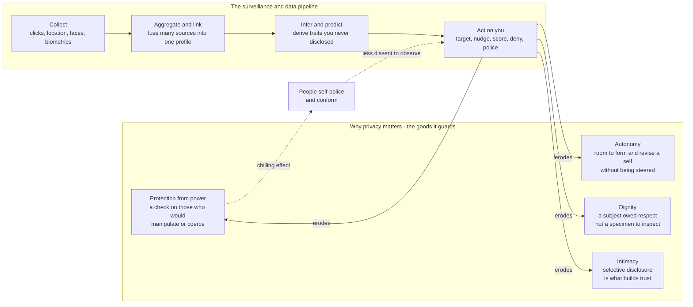

# 🕵️ Privacy, Surveillance and Data Ethics

> [!abstract] TL;DR
> This is the **moral** case that [[Privacy_and_Data_Protection|the law]] only partly encodes: *why* privacy matters and *when* its erosion is wrong, independent of whether any statute forbids it. Privacy is not secrecy or "having something to hide" — it is a precondition for **autonomy** (room to form and revise a self without being steered), **dignity** (being treated as a subject, not a specimen), **intimacy** (selective disclosure is what builds trust and relationships), and **protection from power** (limits on those who would manipulate or control you). Nissenbaum reframes it as **contextual integrity** — privacy is *appropriate information flow*, not zero flow. Surveillance is wrong not mainly because it "reveals secrets" but because it produces **chilling effects**: watched people police themselves, dissent collapses, and a society loses the diversity of thought it needs — a *collective* harm that survives even if no individual is ever "exposed." **Surveillance capitalism** (Zuboff) industrialises this by making behavioural prediction and modification the business model, while state surveillance revives the old **security-versus-liberty** tradeoff at planetary scale.

---

## Intuition

**Analogy — the panopticon.** In Jeremy Bentham's model prison, a single guard tower sits at the centre of a ring of backlit cells. Each prisoner can be seen from the tower, but the tower's windows are shuttered, so no prisoner can ever tell *whether they are being watched right now*. Bentham's genius (and horror) was the realisation that **you do not need to actually watch anyone**. Once inmates internalise the *possibility* of the gaze, they discipline themselves. Power stops being a person doing something to you and becomes a permanent condition you carry in your own head. The philosopher Michel Foucault turned this into a diagnosis of modern life: societies increasingly govern not by punishing bad acts after the fact, but by arranging visibility so that people quietly govern themselves in advance.

Now upgrade the prison. In the modern version the tower is **invisible** — the cameras are in your pocket, the guards are ad-tech pipelines and government agencies you will never meet, and there is no ring of cells because the observation is ambient. Worse, the classical panopticon *forgot*: the guard saw you and moved on. The digital panopticon **never forgets** — every glance is logged, aggregated with a thousand others, and re-read years later by systems that infer things you never said. That combination — *maybe always watched* plus *the record is forever* plus *the watcher is faceless and far more powerful than you* — is what makes surveillance an **ethical** problem and not merely a legal or technical one.

---

## How It Works

### Why privacy has moral weight

The naive objection — *"if you have nothing to hide, you have nothing to fear"* — assumes privacy is only about concealing wrongdoing. Ethicists reject this because privacy protects goods that have nothing to do with guilt:

1. **Autonomy and self-determination.** To become a person you must be able to *try on* beliefs, make mistakes, change your mind, and explore ideas that are unpopular or half-formed. A self under constant observation is a self under constant audition — it optimises for the watcher's approval rather than its own reasons. Privacy is the backstage without which there is no authentic front stage.
2. **Dignity.** Being reduced to a permanent data-double that others read, score, and act on treats a person as an *object of inspection* rather than an agent owed respect. This is a broadly Kantian harm: even a *pleasant*, *accurate*, never-leaked profile can wrong you, because it converts a subject into a specimen.
3. **Intimacy and relationships.** Friendship, love, and trust are *built by graduated disclosure* — I tell you what I tell no one else, and that asymmetry is the relationship. If everything is visible to everyone (or to a platform), the very currency of intimacy is debased. Privacy is not the enemy of connection; it is its precondition.
4. **Protection from power.** Information is leverage. Whoever knows more about you can predict, manipulate, exclude, price-discriminate against, or coerce you. Privacy is a **check on asymmetric power** — which is exactly why authoritarian states and extractive firms want to abolish it.

**Intrinsic vs instrumental.** Some philosophers hold privacy is *instrumentally* valuable (it protects the four goods above); others argue it is at least partly *intrinsic* (a violation wrongs you even when no downstream harm follows — the drone that films you asleep wrongs you even if the footage is deleted unseen). Either way, "no concrete harm occurred" is not a complete defence.

**Contextual integrity (Nissenbaum).** The sharpest modern theory says privacy is not secrecy but **appropriate information flow**. Every social context — the clinic, the confessional, the family, the ballot box — carries **norms** about what information flows to whom and for what purpose. A violation occurs when data jumps its context: your pharmacy record flowing to your employer, your search history to your insurer, your face from a protest to a police database. This explains why *"you already made it public once"* fails as a defence — appropriateness attaches to the *flow*, not to a one-time act of disclosure.

### How surveillance does its damage

The harm of surveillance is not only the moment of exposure. It is structural:

- **Chilling effects.** Knowing you *might* be watched, you pre-emptively self-censor — you don't attend the protest, join the union, search the sensitive medical question, or voice the minority view. The panopticon works precisely *without* anyone being punished. This is why chilling effects are a harm to **speech, association, and thought itself**, and why it is a harm to *society*, not just to the watched individual: a democracy needs live dissent and experimentation, and surveillance quietly drains it (modelled in the demo below).
- **Power asymmetry.** Surveillance is almost never symmetric. The watcher (a state, a platform) sees you in high resolution while remaining opaque to you. That imbalance is the wrong — it is not "sharing," it is one party accumulating leverage over another.
- **Function creep.** Data gathered for one benign purpose (a transit card, a COVID contact-tracing app, a face unlock) is quietly repurposed for another (policing, immigration enforcement, advertising). Because data is cheap to keep and copy, *every* dataset is a latent surveillance system waiting for a new use — which is why "we only use it for X" is a promise about the present, not the future.

### The surveillance-capitalism turn

Zuboff's diagnosis: the dominant business model of the consumer internet is to capture **behavioural surplus** — the exhaust data of your clicks, dwell time, location, and expression — and refine it into **prediction products** sold in markets for future behaviour (advertising, and increasingly beyond). The endpoint is not just *predicting* what you will do but **nudging** it, so the product improves. Privacy erosion here is not an accident or a rogue actor; it is *the point* of the market structure. That is why individual "just opt out" remedies are so weak against it.



---

## Key Concepts

### Secondary — the picture everyone should hold

- **Privacy is not secrecy.** It is control over the *flow* of information about you, and the space to be an unfinished, private self. "Nothing to hide" misunderstands what privacy is *for*.
- **The panopticon.** The mere *possibility* of being watched changes behaviour. Surveillance disciplines without ever needing to punish.
- **Chilling effect.** Watched people self-censor — skipping the protest, the search, the honest opinion. The loss of dissent is a harm to *everyone*, not just the watched.
- **Data is forever.** Unlike a human observer, digital records never forget and are re-read by future systems for purposes you never agreed to (function creep).

### Undergraduate — the working machinery

- **Contextual integrity (Nissenbaum).** Privacy as appropriate information flow governed by context-specific norms; a violation is data jumping its proper channel, not any disclosure at all.
- **Intrinsic vs instrumental value of privacy.** Whether a violation wrongs you *only* through downstream harm, or in itself — and why "no harm occurred" is not a full defence either way.
- **The four grounds.** Autonomy, dignity, intimacy, and protection from power — the goods that make privacy matter morally, mapped to Kantian, relational, and power-based ethical traditions.
- **Surveillance capitalism (Zuboff).** Behavioural surplus → prediction products → behaviour modification; privacy erosion as a *business model*, not a bug.
- **The security–liberty tradeoff.** State mass surveillance justified by safety, and why the tradeoff is rarely the clean dial it is presented as.

### Graduate — the contested frontier

- **Group privacy and inference.** You can be profiled from *other people's* data (your social graph, people demographically like you), so individual consent cannot protect you — a structural limit that consent-based ethics and law both struggle with.
- **The failure of anonymisation.** Re-identification via quasi-identifiers and linkage attacks means "we anonymised it" is usually false; the ethical weight this puts on **differential privacy** as one of the only rigorous defences.
- **The limits of consent at scale.** Notice-and-choice collapses under consent fatigue, take-it-or-leave-it terms, and the impossibility of understanding downstream inference — pushing ethicists toward *structural* remedies (fiduciary duties, privacy-by-design, bans) over individual permission.
- **Data as labour vs data as dignity vs data as property.** Rival framings: should you be *paid* for your data (labour/property), or is treating dignity-grade information as a tradable commodity itself the wrong (the "markets have moral limits" objection)?
- **Biometric and affect recognition.** Faces, gait, and *emotion* inference raise a distinct harm — they read the body you cannot change and claim to read the mind you did not open, often on pseudoscientific footing.
- **AI amplification.** Facial recognition, cross-dataset aggregation, and predictive policing turn latent records into active, real-time, scaled surveillance — the quantitative jump that becomes a qualitative change (see [[Technology_AI_and_Politics]]).

---

## Python Demo

The individual-privacy harm (a leaked file) is easy to see. The *societal* harm is not: surveillance can quietly **collapse the diversity of what people are willing to say**, even when no one is ever punished. This demo models that. Each agent privately holds an opinion on a spectrum, but decides whether to *voice it truthfully* or *retreat to the safe, majority line*, weighing personal conviction against two costs: the **surveillance risk** of being flagged for a deviant view, and **social conformity pressure** toward the perceived public climate. Crucially, the perceived climate is computed from what people *express* — so as some self-censor, the visible consensus narrows, raising the pressure on the rest: a **preference-falsification / conformity cascade** (Kuran). We sweep surveillance from 0 to 1 and watch expressed-opinion diversity collapse *far below* the true, privately-held diversity. Uses only numpy and matplotlib.

```python
# The chilling effect as a conformity cascade.
# Agents privately hold diverse opinions but may self-censor to a "safe" majority
# line under surveillance risk + social pressure. We show that rising surveillance
# collapses the DIVERSITY OF EXPRESSED opinion far below privately-held diversity --
# a societal cost beyond any individual privacy breach. numpy + matplotlib only.
import numpy as np
import matplotlib.pyplot as plt

rng = np.random.default_rng(7)

N = 4000
# Private opinions on a spectrum: -1 (strong dissent) .. +1 (strong mainstream),
# skewed toward the mainstream so there is a genuine minority to silence.
private = np.clip(rng.normal(0.15, 0.55, N), -1, 1)
# Conviction: how much intrinsic value each agent gets from speaking authentically.
conviction = rng.uniform(0.1, 1.0, N)
SAFE = 0.6          # the sanctioned "majority line" that self-censors retreat to
SANCTION = 2.0      # penalty weight for a deviant view IF surveillance catches it
CONFORM  = 0.4      # baseline social-conformity pressure toward the visible climate

def equilibrium(p_surv, iters=80):
    """Iterate expression to a fixed point at surveillance probability p_surv."""
    expressed = private.copy()                      # everyone starts honest
    for _ in range(iters):
        climate = expressed.mean()                  # perceived public opinion
        # Cost of voicing your TRUE view = surveillance risk + nonconformity pressure.
        cost = (p_surv * SANCTION * np.abs(private - SAFE)
                + CONFORM * np.abs(private - climate))
        speak_true = conviction >= cost             # speak only if conviction wins
        # Those who self-censor voice the safe majority line instead of their truth.
        expressed = np.where(speak_true, private, SAFE)
    return expressed, speak_true

surv = np.linspace(0.0, 1.0, 41)
expr_div, frac_true = [], []
for p in surv:
    e, s = equilibrium(p)
    expr_div.append(e.std())        # spread of PUBLICLY VOICED opinion
    frac_true.append(s.mean())      # fraction still speaking honestly
expr_div  = np.array(expr_div)
frac_true = np.array(frac_true)
true_div  = private.std()           # the diversity people ACTUALLY hold (constant)

# --- Plot ---------------------------------------------------------------------
fig, (ax1, ax2) = plt.subplots(1, 2, figsize=(12, 4.6))

ax1.axhline(true_div, color="#2ca02c", ls="--", lw=2,
            label="privately-held diversity (hidden truth)")
ax1.plot(surv, expr_div, "o-", color="#1f77b4", ms=4,
         label="expressed diversity (what society sees)")
ax1.fill_between(surv, expr_div, true_div, color="#d62728", alpha=0.15,
                 label="preference falsification gap")
ax1.set_xlabel("perceived surveillance probability")
ax1.set_ylabel("std. dev. of opinion")
ax1.set_title("Surveillance collapses expressed diversity")
ax1.legend(fontsize=8, loc="lower left")
ax1.grid(True, ls=":", alpha=0.5)

# Snapshot histograms: low vs high surveillance -> the visible spectrum narrows.
for p, c in [(0.0, "#2ca02c"), (0.3, "#ff7f0e"), (0.8, "#d62728")]:
    e, _ = equilibrium(p)
    ax2.hist(e, bins=40, density=True, histtype="step", lw=2,
             color=c, label=f"surveillance = {p}")
ax2.axvline(SAFE, color="k", ls="--", lw=1, label="safe majority line")
ax2.set_xlabel("expressed opinion  (-1 dissent .. +1 mainstream)")
ax2.set_ylabel("density")
ax2.set_title("The visible spectrum of opinion narrows")
ax2.legend(fontsize=8)

plt.tight_layout()
plt.savefig("chilling_effect_cascade.png", dpi=120)
plt.show()

print(f"privately-held diversity (constant): {true_div:.3f}")
for p in (0.0, 0.3, 0.6, 1.0):
    e, s = equilibrium(p)
    print(f"surveillance={p:.1f} -> expressed diversity={e.std():.3f}, "
          f"speaking honestly={s.mean()*100:5.1f}%")
```

**What you see.** As surveillance rises, the **expressed** diversity (blue) falls steeply below the constant **privately-held** diversity (green dashed) — the shaded red band is the *hidden* opinion, the gap between what people think and what they dare say. In the histograms the whole visible spectrum contracts toward the single "safe" line: minority views don't get argued down, they simply *vanish from view*. The cascade is the key point — because each round's perceived climate is built from an already-narrowed set of expressed views, self-censorship is **self-reinforcing**, and the collapse is steeper than the direct surveillance penalty alone would predict. No one was arrested, yet the society lost its dissent. That loss — invisible in any single privacy breach — is the deeper ethical cost of surveillance.

---

## Real-World Applications

> **Example:** After the 2013 **Snowden** disclosures revealed NSA/GCHQ bulk collection, measurable **chilling effects** followed — studies documented drops in traffic to Wikipedia articles on terrorism-adjacent topics and self-reported reluctance to search or speak online. This is the panopticon and the demo's cascade in the wild: the harm was not that any specific person was prosecuted, but that a whole population quietly narrowed what it was willing to look up and say.

- **Surveillance capitalism in ad-tech.** Real-time bidding and behavioural advertising (Google, Meta) are the industrial form of behavioural-surplus extraction — profiles built to *predict and shape* attention and purchases, monetising exactly the intimacy and autonomy privacy is meant to guard. The legal machinery that tries to constrain this lives in [[Privacy_and_Data_Protection]]; the *reason it is wrong* lives here.
- **State mass surveillance and social credit.** China's social-credit experiments and pervasive CCTV-plus-facial-recognition show the security-and-order justification taken to its endpoint — conformity engineered by ambient observation. See [[Authoritarianism_and_Hybrid_Regimes]] and [[Technology_AI_and_Politics]].
- **Predictive policing.** Systems like PredPol allocate patrols from historical crime data, importing and amplifying its bias while cloaking a moral choice (whom to watch) as a technical forecast — a direct clash between security and the civil liberties in [[Rights_and_Civil_Liberties]].
- **Facial recognition and re-identification.** Clearview AI scraped billions of public photos into a searchable face database — a textbook contextual-integrity violation (images shared in one context weaponised in another) and proof that "publicly available" is not the same as "fair game."
- **Group privacy and inference.** Cambridge Analytica profiled and targeted people from *friends'* data and Likes — you were surveilled through others, defeating any individual opt-out and exposing the limits of consent at scale.

---

## Common Pitfalls

- **"Nothing to hide, nothing to fear."** Conflates privacy with concealing wrongdoing. Privacy protects autonomy, dignity, intimacy, and power balance for the innocent; the burden is not on you to justify *keeping* private life private.
- **Privacy = secrecy.** Treating any disclosure as forfeiting all future protection ignores **contextual integrity** — sharing a diagnosis with a doctor does not license your insurer to read it. Appropriateness attaches to the *flow*.
- **Reducing the harm to the individual.** Focusing only on *your* leaked data misses the **collective** harm — chilling effects and lost dissent damage a democracy even if no single person is ever exposed (the demo's whole point).
- **Consent as a cure-all.** At scale, notice-and-choice is defeated by consent fatigue, take-it-or-leave-it terms, unpredictable downstream inference, and **group privacy** (you cannot consent away what others reveal about you). Consent is necessary, rarely sufficient.
- **"We anonymised it."** Re-identification via quasi-identifiers and linkage attacks routinely reverses naive anonymisation; only rigorous methods like **differential privacy** offer a real guarantee, and even then at a measurable accuracy cost.
- **Treating surveillance capitalism as a few bad actors.** The extraction is the *business model*, so moralising about individual companies while leaving the market structure intact fixes nothing — a structural/regulatory response is required.
- **Assuming the security tradeoff is a clean dial.** "More surveillance = more safety" is rarely linear; mass collection often adds little security while imposing large, diffuse liberty costs that are hard to see and easy to discount.

---

## Related Concepts

*(All links verified to exist in the vault.)*

- [[Privacy_and_Data_Protection]] — the **legal** treatment (GDPR, contextual integrity in law, differential privacy, Schrems); this note is its *normative* complement — *why* privacy matters, which the law only partly encodes.
- [[Rights_and_Civil_Liberties]] — the constitutional right against state intrusion and the security-versus-liberty balance that state surveillance stresses.
- [[Applied_Ethics_Overview]] — the parent survey; this note is the "privacy and surveillance" cell of its S3 (AI and technology ethics) domain.
- [[Ethical_Frameworks_in_Practice]] — the deontological (dignity), consequentialist (chilling-effect harm), and virtue lenses that ground the four reasons privacy matters.
- [[Social_Influence_and_Conformity]] — the psychology of the chilling effect: how perceived observation and social sanction drive self-censorship and conformity.
- [[Cascades_and_Systemic_Risk]] — the network dynamics behind the demo: how self-censorship becomes a self-reinforcing preference-falsification cascade.
- [[Technology_AI_and_Politics]] — AI-amplified state surveillance, social-credit systems, and predictive policing as political power.
- [[Authoritarianism_and_Hybrid_Regimes]] — surveillance as a core instrument of control and the manufacture of consent.
- [[Media_Propaganda_and_Political_Communication]] — attention markets and behavioural targeting as the manipulation side of surveillance capitalism.
- [[Digital_Society_and_Online_Communities]] — the datafication of everyday social life that makes ambient surveillance possible.

---

## Review Questions

1. **(Secondary)** Explain to a skeptic who says "I have nothing to hide" why privacy still matters *to them*. Use at least two of the four grounds (autonomy, dignity, intimacy, protection from power) and the panopticon idea, without relying on the claim that they are doing anything wrong.
2. **(Undergraduate)** A city deploys facial recognition on public streets, arguing that "you have no expectation of privacy in public" and "we only use it to find wanted suspects." Using **contextual integrity** and **function creep**, explain why both justifications are weaker than they sound, and identify the *collective* harm that a purely individual analysis would miss.
3. **(Graduate)** Surveillance capitalism is often defended as a fair trade ("free services in exchange for data") remedied by better consent. Drawing on **group privacy**, the **limits of consent at scale**, the **failure of anonymisation**, and the "markets have moral limits" objection to *data as property*, argue whether individual consent can ever make the model ethical — and if not, what a *structural* response (privacy-by-design, differential privacy, fiduciary duties, or bans) would have to change.

---

## Sources

- Nissenbaum, H. (2010). *Privacy in Context: Technology, Policy, and the Integrity of Social Life*. Stanford University Press. ([overview of contextual integrity](https://www.sup.org/books/title/?id=8862))
- Zuboff, S. (2019). *The Age of Surveillance Capitalism*. PublicAffairs. ([publisher page](https://www.hachettebookgroup.com/titles/shoshana-zuboff/the-age-of-surveillance-capitalism/9781610395694/))
- Solove, D. J. (2007). ["'I've Got Nothing to Hide' and Other Misunderstandings of Privacy," *San Diego Law Review* 44](https://papers.ssrn.com/sol3/papers.cfm?abstract_id=998565).
- Richards, N. M. (2013). ["The Dangers of Surveillance," *Harvard Law Review* 126](https://harvardlawreview.org/print/vol-126/the-dangers-of-surveillance/).
- Kuran, T. (1995). *Private Truths, Public Lies: The Social Consequences of Preference Falsification*. Harvard University Press. ([publisher page](https://www.hup.harvard.edu/catalog.php?isbn=9780674707580))
- Foucault, M. (1975). *Discipline and Punish: The Birth of the Prison* (panopticism). ([overview](https://plato.stanford.edu/entries/foucault/))

---

#ethics #privacy #surveillance #data-ethics #surveillance-capitalism
