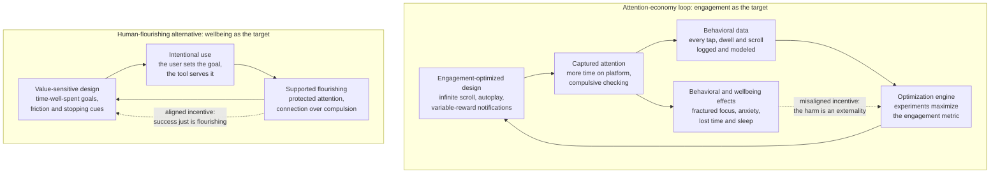

# 📱 Technology and the Good Life

> [!abstract] TL;DR
> Technologies are **not neutral tools** waiting for us to decide how to use them — they carry **affordances** and **politics** that quietly reshape how we perceive, act, and live, and so the central ethical question is whether our technology *serves* human flourishing or *reshapes us to serve it*. The sharpest live case is the **attention economy**: platforms whose business model is selling human attention are engineered — via variable-reward mechanics, infinite scroll, and behavioral data — to maximize **engagement**, a proxy that is systematically **misaligned** with user wellbeing. Because platforms compete for a **finite** pool of attention, the escalation of engagement design is a **collective-action trap** — a race to the bottom whose Nash equilibrium is high engagement and low wellbeing. A **virtue-ethics** and **capability** lens reframes the goal: design not for time spent but for the cultivation of a good life, protecting attention as a **moral resource**.

## Intuition — analogy first

Imagine two ways to build a road through a valley. The first is a **twelve-lane highway**: it makes driving fast and cheap, so shops, homes, and offices reorganize themselves around the off-ramps, walking becomes dangerous, and within a generation the *only* sane way to get a carton of milk is to drive. Nobody voted for a car-dependent life; the *road's shape* voted for them. The second is a **network of walkable streets** with the highway underneath for when you truly need speed: the same valley, the same people, but the built environment now *affords* a different daily life.

A road is not a neutral pipe that carries whatever traffic you pour in — its **affordances** (what it makes easy, cheap, and default) silently select a way of living. Digital technologies are the roads of the mind. An **infinite scroll** is a highway with no exit ramp; a **notification badge** is a billboard engineered to yank your eyes. Before we ask "are people *using* this well?" we have to ask what the artifact makes *easy* and *default* — because most people, most of the time, live along the path of least resistance the design lays down. The ethics of technology and the good life is the study of which roads we are pouring.

---

## How It Works

**1. Artifacts are not neutral — they have affordances and politics.** The naive "neutrality thesis" says a technology is a mere instrument: a hammer builds or kills depending only on the user, so ethics attaches to *use*, never to the *tool*. The philosophy-of-technology tradition rejects this. Langdon Winner's **"artifacts have politics"** argues that designs *embody* and *enforce* social arrangements — his notorious example is highway overpasses built too low for buses, physically excluding those who ride them. Don Norman's **affordances** and Peter-Paul Verbeek's **technological mediation** make the mechanism precise: artifacts do not determine behavior, but they *invite* some actions and *resist* others, *shaping perception and choice* before any deliberation occurs. A "like" button does not force you to seek approval, but it builds approval-seeking into the grammar of the interface.

**2. Determinism vs social construction — a two-way street.** **Technological determinism** says technology autonomously drives social change (the tool makes us). **Social construction of technology (SCOT)** says social forces decide which designs get built and adopted (we make the tool). The defensible synthesis is *mutual shaping*, best modeled as a **feedback loop**: we design artifacts within a business model, the artifacts reshape our habits and desires, and those reshaped habits become the "user demand" that justifies the next design. This is a **systems** problem, not a morality-of-individuals problem — see [[Feedback_Loops_and_Causality]] and [[Leverage_Points_and_Mental_Models]].

**3. The attention economy and its misaligned metric.** When a service is free, the user's *attention* is the product sold to advertisers, and the raw material is *behavioral data*. The platform's revenue is a monotone function of **engagement** — time on site, sessions, scroll depth, returns per day — so engagement becomes the optimization target. Here the **Goodhart problem** bites: *when a measure becomes a target, it ceases to be a good measure.* Engagement was once a rough proxy for "this is valuable to users"; once it is *optimized*, the system discovers that **outrage, novelty, intermittent reward, and compulsion** drive engagement far more reliably than value does, and the proxy detaches from the wellbeing it once tracked. (This is the same misalignment that recurs in AI systems trained on a proxy reward and in surveillance-driven data extraction.)

**4. Persuasive design and the exploitation of psychological vulnerabilities.** Engagement is manufactured by borrowing the most powerful findings of behavioral psychology. **Variable-ratio reinforcement** — the schedule that makes slot machines the most addictive object in a casino — is built into the *pull-to-refresh* gesture: an unpredictable reward on an unpredictable pull (see [[Reinforcement_Schedules]] and [[Operant_Conditioning]]). **Infinite scroll** removes natural stopping cues; **autoplay** removes the decision to continue; **social approval metrics** hijack our evolved sensitivity to status. Our brains, tuned by evolution for scarce social information, meet an engineered environment of infinite supply — a textbook **evolutionary mismatch**.

**5. Persuasion, manipulation, and dark patterns.** Not all influence is illegitimate — teachers, doctors, and public-health campaigns persuade. The ethically loaded line is **manipulation**: influence that works by *bypassing or subverting a person's rational agency* rather than engaging it (Susser, Roessler & Nissenbaum). A **nudge** that makes the healthy default easy while preserving choice can be legitimate; a **dark pattern** — a fake countdown timer, a "roach motel" that is easy to enter and hard to leave, confirm-shaming ("No, I don't want to save money") — is engineered to defeat the choice it pretends to offer. The test is not *whether* behavior changed but *whether it changed by respecting or by circumventing the person's autonomy*.

**6. The race to the bottom — a collective-action trap.** No single designer needs to be malicious. Because attention is **finite**, platforms are locked in a *contest*: any platform that unilaterally becomes calmer loses attention share to a more aggressive rival, so the **best response** to competitors' escalation is to escalate. The **Nash equilibrium** is maximal engagement design and minimal wellbeing — even though *every* platform and *every* user might prefer a calmer world. This is a tragedy of the commons for human attention, and its welfare cost is a **price of anarchy** (the Python demo below makes it quantitative; see [[Nash_Equilibrium]], [[Price_of_Anarchy]], and [[Cooperation_and_Evolutionary_Game_Theory]]).

**7. Designing for flourishing.** The alternative is to change the *objective function*. **Value-sensitive design** builds human values in from the start; the **capability approach** (Sen, Nussbaum) asks whether a technology expands what people are actually able to *be and do*, not merely what they consume; the **time-well-spent / humane technology** movement replaces "maximize engagement" with "help users flourish on their own terms." A **virtue-ethics** frame ties it together: the deepest question is not *how much time* a technology takes but *what kind of person* it cultivates — does it build patience, deep attention, and courage, or erode them into distraction and reactivity (see [[Virtue_Ethics]] and [[Ethical_Frameworks_in_Practice]])?



---

## Key Concepts

### Secondary — the core ideas
- **Non-neutrality of technology.** A tool is not a blank instrument; its design makes some actions easy and default and others hard, quietly steering how we live.
- **Affordances.** What an artifact *invites* you to do. An infinite feed affords endless scrolling; a book affords stopping at the end of a chapter.
- **The attention economy.** When a product is free, your attention is what is being sold, and the design is tuned to capture as much of it as possible.
- **Digital minimalism.** Deliberately choosing a small set of technologies that genuinely serve your values and stripping out the rest, rather than accepting every default.
- **Dark patterns.** Interface tricks designed to get you to do something you would not choose on reflection, such as hidden unsubscribe buttons or fake urgency timers.

### Undergraduate — the working distinctions
- **Determinism vs social construction.** Does technology drive society (determinism) or does society choose its technologies (SCOT)? The realistic answer is *mutual shaping* through feedback.
- **Persuasive / captology design.** The applied science of shaping behavior through interfaces: variable rewards, streaks, social proof, loss aversion, and the removal of stopping cues.
- **Goodhart's law and the engagement metric.** "When a measure becomes a target, it ceases to be a good measure." Engagement, once optimized, detaches from the user value it once proxied.
- **Persuasion vs manipulation.** Persuasion engages your reasoning; manipulation *bypasses* it (exploiting biases, emotions, or hidden defaults). Autonomy is the dividing line.
- **Nudging and its ethics.** Choice architecture that steers while preserving freedom. Legitimacy turns on transparency, reversibility, and whether it serves the *chooser's* ends or the *designer's*.
- **Filter bubbles, outrage amplification, and polarization.** Recommendation systems optimizing engagement tend to surface emotionally activating and confirming content, narrowing information diets and rewarding outrage — a public-sphere harm, not just a private one.
- **Attention as a moral resource.** Your finite attention is the substrate of thought, relationship, and agency; spending it is a moral act, and letting it be captured is a moral loss.

### Graduate — theory and the systems view
- **"Do Artifacts Have Politics?" (Winner).** Designs can *embody* and *enforce* power relations; the moral load can sit in the artifact's architecture, not only in its use.
- **Technological mediation / postphenomenology (Verbeek, Ihde).** Technologies co-constitute perception and action; they are not between us and the world but *shape the very relationship*. Ethics must therefore include the *designing* of mediations, not just their use.
- **Theories of online manipulation (Susser, Roessler & Nissenbaum).** Manipulation is influence that works by targeting and exploiting *decision-making vulnerabilities* covertly; the harm is to **autonomy** even when the outcome looks benign.
- **The capability approach (Sen, Nussbaum) as a flourishing metric.** Evaluate technology by whether it expands real, valuable capabilities — attention, affiliation, practical reason, play — rather than by consumption or engagement. A rigorous alternative to hedonic or preference metrics (contrast the metrics debated in [[Ethical_Frameworks_in_Practice]]).
- **The attention economy as a collective-action problem.** Finite attention plus engagement-maximizing competition yields a **Nash equilibrium** of over-engagement; the wellbeing loss is a **price of anarchy** that no individual firm or user can escape unilaterally — the intervention has to be structural (regulation, business-model change, coordinated norms).
- **Virtue, character, and the formation of the self.** Beyond harms and rights, ask what habits a technology *cultivates*. If deep attention, patience, and courage are virtues, a system that trains distraction and reactivity is a *character* harm — the classically Aristotelian objection updated for screens.
- **Everyday transhumanism.** The enhancement debate is not only about gene editing or neural implants; smartphones are already **cognitive prostheses** that offload memory and attention. The ethical questions of authenticity, autonomy, and what we owe future selves apply at the level of the device in your pocket, not just the lab (a bridge to neuroethics and enhancement ethics).

---

## Python Demo

We model the attention economy as a **race to the bottom**. Several platforms compete for a **finite** pool of user attention by choosing an *engagement-optimization* level. Grabbing a bigger slice of the fixed pie is each platform's private incentive, so each platform's **best response** is to be *more* engaging than its rivals — driving an iterated best-response dynamic to a **Nash equilibrium** of high engagement. User **wellbeing**, an **externality** no platform pays for, collapses along the way. A coordinator who *internalized* wellbeing would set engagement near zero; the gap between that social optimum and the competitive equilibrium is the **price of anarchy**. (numpy + matplotlib only.)

```python
# The attention economy as a collective-action trap.
# Platforms compete for a FIXED pool of attention -> each raises engagement to
# grab share -> best-response dynamics converge to a high-engagement Nash while
# user wellbeing (an externality) collapses. Connects Game Theory + Systems Thinking.
import numpy as np
import matplotlib.pyplot as plt

# ---- Model primitives ------------------------------------------------------
N      = 4       # platforms fighting over the SAME finite attention pie
R      = 1.0     # total monetizable attention (the pie never grows: it is finite)
gamma  = 1.5     # how sharply attention-share responds to engagement design
c      = 0.30    # a platform's PRIVATE cost of aggression (churn, moderation, brand)
lr     = 0.6     # damping on best-response updates (smooths the trajectory)
e_grid = np.linspace(0.001, 1.0, 400)   # candidate engagement levels, 0..1

def shares(e):
    """Proportional contest over a FIXED pie: more aggressive design wins a
    bigger slice, but the slices always sum to 1 -- the pie does not grow."""
    w = e ** gamma
    return w / w.sum()

def platform_profit(ei, others):
    """One platform's profit: its captured attention share minus a private,
    convex cost of being aggressive. Wellbeing is NOT in this payoff."""
    e = np.concatenate(([ei], others))
    return R * shares(e)[0] - c * ei ** 2

def best_response(others):
    """The engagement level that maximizes THIS platform's own profit."""
    profits = np.array([platform_profit(ei, others) for ei in e_grid])
    return e_grid[np.argmax(profits)]

def wellbeing(mean_e):
    """The EXTERNALITY: user wellbeing falls as mean engagement-aggression
    rises (lost time, fractured attention, anxiety). No platform pays for it."""
    return np.exp(-3.0 * mean_e)          # ~1.0 when calm  ->  ~0 when exploitative

# ---- Best-response dynamics: the race to the bottom -----------------------
e = np.full(N, 0.05)                       # everyone starts humane / calm
traj_e, traj_W = [], []
for _ in range(30):
    traj_e.append(e.mean()); traj_W.append(wellbeing(e.mean()))
    br = np.array([best_response(np.delete(e, i)) for i in range(N)])
    e  = (1 - lr) * e + lr * br             # each platform re-optimizes vs the rest
traj_e, traj_W = np.array(traj_e), np.array(traj_W)
nash_e = e.mean()

# ---- Social optimum: a coordinator who COUNTS wellbeing --------------------
# Total welfare = platform profits (which net to R - c*N*level, since the pie
# is fixed) PLUS user wellbeing. Escalation only redistributes a fixed pie while
# destroying wellbeing -> the coordinator drives engagement to ~0.
def total_welfare(level):
    e_sym   = np.full(N, level)
    profits = R * shares(e_sym) - c * e_sym ** 2
    return profits.sum() + N * wellbeing(level)
opt_e = e_grid[np.argmax([total_welfare(l) for l in e_grid])]

print(f"Competitive Nash : mean engagement = {nash_e:.2f}, wellbeing = {wellbeing(nash_e):.2f}")
print(f"Social optimum   : mean engagement = {opt_e:.2f}, wellbeing = {wellbeing(opt_e):.2f}")

# ---- Plots -----------------------------------------------------------------
fig, (ax1, ax2) = plt.subplots(1, 2, figsize=(12, 4.6))

ax1.plot(traj_e, "o-", color="#dc2626", label="mean engagement (Nash dynamics)")
ax1.plot(traj_W, "s-", color="#2563eb", label="user wellbeing")
ax1.axhline(opt_e, ls="--", color="#16a34a", label="socially optimal engagement")
ax1.set_xlabel("best-response round (competition over time)")
ax1.set_ylabel("level in [0, 1]")
ax1.set_title("Race to the bottom: engagement climbs, wellbeing falls")
ax1.legend(fontsize=8, loc="center right")

E = np.linspace(0.001, 1.0, 200)
ax2.plot(E, wellbeing(E), color="#2563eb")
ax2.scatter([opt_e],  [wellbeing(opt_e)],  color="#16a34a", zorder=5,
            label=f"social optimum (E={opt_e:.2f})")
ax2.scatter([nash_e], [wellbeing(nash_e)], color="#dc2626", zorder=5,
            label=f"competitive Nash (E={nash_e:.2f})")
ax2.annotate("race to the bottom",
             xy=(nash_e, wellbeing(nash_e)), xytext=(opt_e, wellbeing(opt_e)),
             arrowprops=dict(arrowstyle="->", color="black"), fontsize=9)
ax2.set_xlabel("mean engagement-optimization E")
ax2.set_ylabel("user wellbeing W(E)")
ax2.set_title("The collective-action trap")
ax2.legend(fontsize=8)

plt.tight_layout()
plt.savefig("attention_race_to_bottom.png", dpi=120)
plt.show()
```

**What it shows.** Every platform starts calm, but because attention is a **fixed pie**, unilateral restraint just hands share to a more aggressive rival — so best-response dynamics push engagement *upward* round after round to a **Nash equilibrium** of high engagement, while user wellbeing (the blue curve) collapses toward zero. The green line is the **social optimum**: since escalation only *redistributes* a fixed pie while *destroying* wellbeing, a coordinator who counted wellbeing would set engagement near zero. The gap between the red Nash point and the green optimum is a **price of anarchy** — a collective-action trap in which each rational move makes everyone, platforms and users alike, worse off. This is the [[Nash_Equilibrium]] logic of the [[Cooperation_and_Evolutionary_Game_Theory]] "tragedy of the commons," applied to human attention, and it is why the fix must be **structural** (regulation, business-model change, coordinated norms), not merely "have more willpower."

---

## Real-World Applications

- **Infinite feeds and autoplay (TikTok, YouTube, Instagram, X).** The infinite scroll, autoplaying next video, and pull-to-refresh are direct implementations of variable-reward and removed-stopping-cue design — the mechanics modeled above.
- **Recommendation engines and outrage amplification.** Engagement-optimized ranking systematically over-surfaces emotionally activating, divisive, and confirming content, feeding polarization and misinformation in the public sphere (see [[Democratic_Backsliding_and_Polarization]] and [[Technology_AI_and_Politics]]).
- **Adolescent mental health.** Internal research disclosed by whistleblower Frances Haugen and a growing (if contested) literature link heavy social-media use to anxiety, comparison, and sleep disruption in teens — the clearest wellbeing case, and a genuine causation-vs-correlation debate.
- **Countermeasures built into platforms.** Apple **Screen Time**, Android **Digital Wellbeing**, "take a break" prompts, and grayscale modes are attempts (often half-hearted, because they fight the business model) to hand stopping cues back to users.
- **The humane-technology movement.** The Center for Humane Technology's **"Time Well Spent"** reframing, and books such as *Digital Minimalism* and *Stand Out of Our Light*, push design objectives from engagement toward flourishing.
- **Regulation of dark patterns.** The EU **Digital Services Act** and consumer-protection actions increasingly ban manipulative interface patterns (fake urgency, confirm-shaming, obstructed cancellation) — treating manipulation, not just fraud, as a harm.
- **Nudging for good.** Duolingo streaks, step-count rings, and savings-app round-ups show the *same* persuasive mechanics aimed at the *user's* goals — the live test case for the persuasion-vs-manipulation line.

---

## Common Pitfalls

- **The neutrality thesis ("it's just a tool").** Absolving design by locating all responsibility in the user ignores affordances and defaults; the shape of the tool is itself an ethical choice.
- **Naive technological determinism.** Treating harms as an inevitable property of "technology" absolves the specific *business model* and *design decisions* that produced them, and makes the problem seem unfixable. Mutual-shaping and systems thinking are the corrective.
- **Moral panic without evidence (and its mirror, dismissive complacency).** The teen-mental-health debate demands nuance: real effect sizes are contested, confounds abound, and both breathless catastrophism and "every generation panics about new media" are lazy. Hold the empirical question open.
- **Conflating all persuasion with manipulation.** Not every nudge is a dark pattern; a design that makes a healthy default easy while preserving transparent, reversible choice can respect autonomy. The line is *bypassing reason vs engaging it*, not *changing behavior vs not*.
- **Techno-solutionism.** Fixing an attention problem *caused* by apps with *more* apps (a screen-time app to police your screen time) often treats a structural, collective-action problem as a personal-productivity bug.
- **Individualizing a structural trap.** "Just put your phone down" blames users for the predictable output of a race-to-the-bottom equilibrium engineered by billion-dollar optimization systems. Willpower is not a match for a system built to defeat it; the leverage point is the incentive, not the individual.
- **Optimizing a proxy and forgetting Goodhart.** Any single "wellbeing metric" a platform adopts will, once optimized, drift from the flourishing it was meant to protect — the very failure mode that produced the engagement trap. Flourishing resists reduction to one number.

---

## Related Concepts

- [[Ethical_Frameworks_in_Practice]] — the virtue, consequentialist, deontological, and contractualist lenses this note applies to technology; flourishing is the virtue-ethics goal, autonomy the deontological constraint.
- [[Virtue_Ethics]] — the character-formation lens: the deepest question is not time spent but which virtues (patience, deep attention, courage) a technology cultivates or erodes.
- [[Applied_Ethics_Overview]] — situates technology ethics within the broader map of ethics applied to concrete domains.
- [[Behavioral_Economics_Psychology]] — the biases and heuristics (loss aversion, present bias, social proof) that persuasive design exploits and that nudging engages.
- [[Reinforcement_Schedules]] — variable-ratio reinforcement, the slot-machine schedule built into pull-to-refresh and notification mechanics.
- [[Operant_Conditioning]] — the behaviorist substrate of engagement design: rewarding and shaping compulsive use.
- [[Evolutionary_Mismatch]] — why brains tuned for scarce social information are hijacked by an engineered environment of infinite supply.
- [[Attitudes_and_Persuasion]] — the social-psychology of legitimate persuasion, the baseline against which manipulation is defined.
- [[Attention_and_Focus_in_Learning]] — attention as the scarce input to learning and thought; what the attention economy competes for and degrades.
- [[Attention_and_Cognitive_Load]] — how fractured, interrupted attention raises cognitive load and undermines deep work.
- [[Attention_and_Executive_Function]] — the neural basis of the top-down attentional control that persuasive design is engineered to override.
- [[Happiness_and_Wellbeing]] — the psychology of what actually constitutes flourishing, the outcome a good technology should serve.
- [[Nash_Equilibrium]] — the equilibrium concept behind the engagement race to the bottom.
- [[Price_of_Anarchy]] — quantifies the welfare loss of the competitive equilibrium versus the social optimum in the attention contest.
- [[Cooperation_and_Evolutionary_Game_Theory]] — the tragedy-of-the-commons / collective-action structure of finite-attention competition.
- [[Feedback_Loops_and_Causality]] — the design-to-habit-to-demand loop that makes technology and society mutually shaping.
- [[Leverage_Points_and_Mental_Models]] — where to intervene: incentives and business models, not individual willpower, are the high-leverage points.
- [[Digital_Society_and_Online_Communities]] — the sociology of life reorganized around online platforms and the attention economy.
- [[Media_Culture_and_Cultural_Industries]] — the political economy of media whose logic the attention economy intensifies.
- [[Democratic_Backsliding_and_Polarization]] — how engagement-optimized amplification of outrage stresses public discourse and democracy.
- [[Technology_AI_and_Politics]] — the governance and political dimensions of platform power and recommender systems.

---

## Review Questions

1. **(Comprehension)** Explain the difference between the "neutrality thesis" and Winner's claim that "artifacts have politics," using one example of a design whose *shape* — not its use — encodes a value or a power relation. Why does this distinction matter for who bears moral responsibility when a technology causes harm?
2. **(Application)** A social app proposes two features: (a) a streak counter that resets to zero if you miss a day, and (b) a weekly summary that suggests a personal usage limit and lets you set it in one tap. Using the persuasion-vs-manipulation criterion (does the influence engage or bypass rational agency?), classify each feature, and identify one condition under which the streak counter could tip from a legitimate nudge into a dark pattern.
3. **(Synthesis / evaluation)** The Python demo shows a Nash equilibrium of high engagement and low wellbeing that no single platform or user can escape unilaterally. Given that this is a collective-action trap with a large *price of anarchy*, evaluate three candidate interventions — (i) urging users to practice digital minimalism, (ii) requiring platforms to publish and optimize a wellbeing metric, and (iii) regulating specific design patterns (banning infinite scroll for minors, mandating stopping cues). For each, name the leverage point it targets and one way it could fail (include the Goodhart risk for option ii).

---

## Sources

- Winner, L. (1980). "Do Artifacts Have Politics?" *Daedalus*, 109(1), 121–136. (The non-neutrality thesis.)
- Williams, J. (2018). *Stand Out of Our Light: Freedom and Resistance in the Attention Economy*. Cambridge University Press. (Attention as a moral resource; misaligned metrics.)
- Susser, D., Roessler, B., & Nissenbaum, H. (2019). "Online Manipulation: Hidden Influences in a Digital World." *Georgetown Law Technology Review*, 4(1), 1–45. (Manipulation vs persuasion and autonomy.)
- Newport, C. (2019). *Digital Minimalism: Choosing a Focused Life in a Noisy World*. Portfolio. (Digital minimalism and intentional technology use.)
- Verbeek, P.-P. (2011). *Moralizing Technology: Understanding and Designing the Morality of Things*. University of Chicago Press. (Technological mediation and design ethics.)
- Nussbaum, M. C. (2011). *Creating Capabilities: The Human Development Approach*. Harvard University Press. (The capability approach as a flourishing metric.)
- Zuboff, S. (2019). *The Age of Surveillance Capitalism*. PublicAffairs. (Behavioral-data business model behind the attention economy.)

---

#ethics #technology-ethics #attention-economy #digital-wellbeing #philosophy-of-technology
