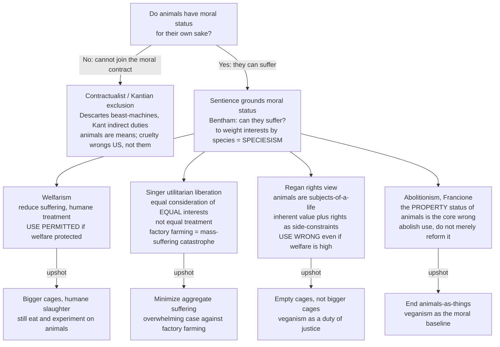

# 🐄 Animal Ethics and Rights

> [!abstract] TL;DR
> **Animal ethics** asks what we owe to non-human animals and *why*. The historical default treated animals as **property and means** — Descartes's "beast-machines" with no inner life, Kant's view that we have only *indirect* duties regarding them. The modern challenge, launched by Bentham's line "the question is not *Can they reason?* nor *Can they talk?* but *Can they suffer?*", grounds moral status in **sentience** — the capacity to suffer — and charges the old default with **speciesism**: discounting a being's interests *merely* because of its species, argued to be structurally like racism and sexism. From that starting point four rival positions diverge: **welfarism** (reduce suffering and treat humanely, but use is permitted), **Singer's utilitarian liberation** (give *equal consideration to equal interests* — not equal treatment — which makes factory farming a moral catastrophe), **Regan's rights view** (animals are *subjects-of-a-life* with inherent value and rights, so use is wrong regardless of how humane it is), and **Francione's abolitionism** (the *property status* of animals is itself the core wrong). Against all of these stands the **contractualist / Kantian exclusion**, which denies animals direct standing because they cannot participate in the moral contract. The practical stakes — factory farming, experimentation, wild-animal suffering, and the climate case against meat — are among the largest in all of applied ethics.

## Intuition

**Analogy first — the surgeon's knife and the whimper.** Imagine you walk past a workshop and, through the window, see someone slowly crushing a dog's paw in a vice while it howls and struggles. You do not need a philosophy degree, a theory of rationality, or proof that the dog can *talk*, do arithmetic, or reflect on its own mortality to know that something is going badly *wrong* — and wrong *for the dog's sake*, not merely because the neighbours are upset. What makes you flinch is the one thing that is unmistakably present: **the creature can suffer, and its suffering matters.**

That flinch is the whole of animal ethics compressed into a reflex. In 1789 Jeremy Bentham put it in the line that reframed the entire field: *"The question is not, Can they reason? nor, Can they talk? but, Can they suffer?"* Every capacity philosophers once used to fence animals *out* of moral concern — reason, language, autonomy, a sense of the future — is beside the point if the ground of moral status is the capacity to be **hurt**. Sentience, not species, draws the line. The rest of the field is the long argument over exactly *what follows* once you take that flinch seriously.

---

## How It Works

### The historical baseline: animals as property and means

For most of Western thought, animals sat *outside* the moral circle. Aristotle placed them below humans on a natural hierarchy existing *for* human use. **Descartes** radicalized this: animals are **beast-machines** (*bêtes-machines*) — biological automata whose cries are mere clockwork, with no genuine inner experience to wrong. **Kant** softened the metaphysics but kept the exclusion: because animals are not rational, self-legislating agents, we have no *direct* duties **to** them, only **indirect** duties *regarding* them — we should not be cruel to a dog because cruelty coarsens our character and makes us more likely to mistreat humans, not because the dog is wronged. In each case the animal is a **means, a resource, or property** — something you can *damage* but, strictly, cannot *wrong*. (See [[Moral_Status_and_the_Moral_Circle]] for the agent-versus-patient distinction that this whole debate turns on.)

### The modern turn: sentience as the ground of moral status

The reversal runs through **Bentham** to **Peter Singer**. If what makes suffering *matter* is simply that it is suffering — that there is a subject for whom things can go badly — then the morally relevant fact is **sentience**, and the possession of reason or language is a *red herring*. This is where the concept of **speciesism** enters (coined by **Richard Ryder**, 1970, popularized by Singer): giving *less weight* to a being's interests **merely** because it belongs to another species is an unjustified prejudice, structurally parallel to racism and sexism, which weight interests by race or sex.

The sharpest weapon for this view is the **argument from marginal cases**: whatever cognitive capacity you cite to exclude animals (rationality, autonomy, language) is *also* absent in some humans — infants, the severely cognitively impaired, patients in advanced dementia — whom we would never treat as mere resources. So either those humans lack moral status (unacceptable), or the capacity is *not* what grounds status after all. Consistency then forces sentient animals inside the circle.

### The four positions that diverge from sentience — plus the exclusion

Accepting that animals have *some* moral status does **not** settle what we owe them. The live debate is among four positive positions and one that resists the whole move:

1. **Animal welfarism.** Animals matter and their suffering counts, so we must treat them *humanely* and minimize pain — but **using** them for food, research, or labour is permissible *if* welfare is protected. This is the position embedded in most law: bigger cages, humane slaughter, the 3Rs. Its slogan is *bigger cages*.
2. **Singer's utilitarian liberation.** The **principle of equal consideration of interests** demands that a like interest count equally *whoever* has it — but this means equal *consideration*, **not** equal *treatment* (a pig has no interest in voting; it has a vital interest in not being confined and killed). Aggregating the suffering of tens of billions of factory-farmed animals against the *trivial* human interest in taste makes industrial animal agriculture a **moral catastrophe**. Because Singer is a consequentialist, the wrong is the *suffering*, not *use* as such — painless killing of a replaceable animal is, for him, a harder case ([[Consequentialism_and_Utilitarianism]]).
3. **Regan's rights view.** Tom Regan argues that many animals are **subjects-of-a-life** — beings with beliefs, desires, memory, a sense of the future, and a welfare that matters *to them*. Such beings have **inherent value**, equal and non-gradable, and therefore **rights** that function as *side-constraints*. On this view, use is wrong **regardless of welfare**: the goal is not bigger cages but *empty* cages. Rights, unlike utility, cannot be traded away for aggregate benefit.
4. **Abolitionism (Francione).** Gary Francione locates the core wrong not in suffering or in use *per se* but in the **property status** of animals: as long as animals are legally *things* that can be owned, every "welfare" protection is structurally overridden whenever it conflicts with owner interest. The only coherent response is to **abolish** the property status and the institution of use — with **veganism** as the moral baseline, not welfare reform (which he argues merely makes exploitation more palatable).
5. **Contractualist / Kantian exclusion.** Contractualists (a strict reading of Rawls; Peter Carruthers) ground morality in agreements among **rational agents** who can reciprocate. Animals cannot contract, so they fall *outside* direct moral concern, gaining at most derivative protection through the sentiments of the humans who care about them. Critics (Rowlands, Korsgaard, Nussbaum) reply that this excludes marginal-case humans too, and that agency-based accounts confuse *moral agents* (who have duties) with *moral patients* (who can be wronged).



---

## Key Concepts

### Secondary (the core idea, plainly)

- **Sentience is the ticket in.** If a creature can *suffer*, its suffering matters *to it*, and that gives it a claim on us. You cannot wrong a rock; you *can* wrong a pig.
- **The old view: animals as machines/property.** Descartes thought animals were unfeeling machines; the law long treated them as *things* you own. Modern ethics challenges this.
- **Speciesism.** Ignoring an animal's suffering *just because* it is not human is a prejudice — the same *kind* of mistake as racism or sexism, which ignore suffering because of race or sex.
- **Welfare vs rights, in one line.** *Welfare* asks for **bigger cages** (treat them well while we use them); *rights/abolition* asks for **empty cages** (stop using them at all).
- **The everyday upshot.** The strongest reason many people cite for vegetarianism or veganism is simply that they do not want to pay others to make animals suffer when they do not have to.

### Undergraduate (the criteria and the debate)

- **Bentham and equal consideration of *interests*.** Singer's foundational move: like interests count equally regardless of who has them. This is **equal consideration**, *not* equal treatment — a mouse's interest in avoiding pain counts as much as a human's *comparable* pain, even though the mouse has no interest in an education or a vote.
- **The argument from marginal cases.** No capacity reliably includes *all* humans while excluding *all* animals. Cite rationality and you exclude infants; cite language and you exclude the severely impaired. So capacity-based exclusion of animals is either inconsistent or a disguised speciesism.
- **Singer's catastrophe argument.** Roughly 80 billion land animals (and far more aquatic ones) are raised and killed each year, most under intensive confinement. Weighed against the *minor* human interest in taste and cheapness, the aggregate suffering makes factory farming, for a utilitarian, one of the largest sources of preventable suffering on Earth.
- **Regan's subjects-of-a-life and inherent value.** A being with beliefs, desires, memory, and a welfare of its own is not a *receptacle* for value but a bearer of it — and inherent value grounds **rights** that cannot be overridden by aggregate benefit. This is why Regan rejects even "humane" use.
- **Francione's property critique.** Welfare law fails *by design*: because animals are property, their interests are always weighed against — and lose to — the economic interests of their owners. Reform therefore entrenches, rather than ends, exploitation. Abolition and veganism are the only consistent responses.
- **The 3Rs.** In animal experimentation, the governing welfarist framework is **Replacement** (use non-animal methods where possible), **Reduction** (use fewer animals), and **Refinement** (minimize each animal's suffering) — Russell and Burch, 1959.
- **The Kantian/contractualist reply.** Only rational agents who can reciprocate obligations are owed direct duties; our duties *regarding* animals are indirect. The standard objection is that this cannot explain why torturing a stray for fun is wrong *to the animal*, and that it wrongly demotes marginal-case humans.

### Graduate (structure, tensions, and hard cases)

- **Rights versus aggregation.** The Singer/Regan split is the animal-ethics instance of the deepest fault line in normative ethics. Utilitarianism *aggregates* and therefore permits trade-offs (in principle, sacrificing an animal for a large enough benefit); a **rights** view installs *side-constraints* that forbid such trades. Regan's *lifeboat case* (throw the dog overboard before any human) shows he still lets *degree* of harm break ties — inviting the charge that inherent value is doing less work than advertised.
- **The replaceability argument.** Singer's own hedonistic/total utilitarianism faces the **replaceability** problem: if a killed animal is painlessly replaced by an equally happy one, total welfare is unchanged, so painless killing of non-self-conscious animals may not be wrong. He distinguishes *self-conscious* beings (with future-directed preferences that death frustrates) from merely sentient ones — a move critics find both essential and unstable, and the mirror image of the "logic of the larder" argument that farming *creates* happy lives.
- **Moral individualism and its critics.** James Rachels and Jeff McMahan push the marginal-cases logic to **moral individualism**: an individual's moral status is fixed by *its own* actual capacities, not its species membership — so a cognitively comparable human and animal have comparable status. **Species-norm** replies (status attaches to belonging to a *kind* whose normal members are persons) are attacked as begging the question; **Korsgaard's** Kantian-constructivist route instead argues we owe animals duties because *we* value our own animal nature and must, on pain of inconsistency, value theirs.
- **Wild-animal suffering.** If suffering is what matters, the vast, ongoing suffering of *wild* animals (predation, starvation, disease, r-selection producing astronomical infant mortality) is a moral problem in its own right — Yew-Kwang Ng, Oscar Horta, Brian Tomasik. This collides head-on with **holistic environmental ethics**: Callicott's Leopoldian *land ethic* values ecosystems and populations, and would let individuals suffer and die for ecological "integrity," which Regan condemned as **"environmental fascism."** The individualist/holist clash is the central fault line between animal ethics and [[Ethical_Frameworks_in_Practice|environmental ethics]].
- **Sentience under uncertainty and the cognitive continuum.** Attributing sentience to fish, cephalopods, decapods, or insects is *inference to the best explanation* from behaviour, physiology, and evolutionary continuity ([[Comparative_and_Animal_Cognition]], [[Natural_Selection_and_Adaptation]]). This motivates a **precautionary** weighting: under uncertainty about whether a being can suffer, the *expected* moral cost of being wrong may warrant caution — the logic behind recent legal recognition of cephalopod and decapod sentience.
- **Welfarism vs abolition as strategy, not just theory.** Even granting Singer's or Regan's conclusion, the *practical* dispute is fierce: do welfare reforms (cage-free eggs, gestation-crate bans) *reduce* suffering now, or do they *entrench* exploitation by making it look acceptable (Francione's "new welfarist" critique)? **Alternative proteins** — plant-based, precision-fermentation, and cultivated ("cultured") meat — reframe the debate as a *technological* path to abolition that sidesteps the reform-versus-abolition impasse.
- **The contractualist rescue attempts.** Mark Rowlands extends Rawls's *veil of ignorance* to cover the possibility of being born non-human; Scanlonian "trustee" models let rational agents represent non-rational patients. Whether these genuinely ground *direct* duties or merely simulate them remains contested.

---

## Python Demo

```python
# MODELING A PHILOSOPHICAL ARGUMENT (numpy + matplotlib only)
# ----------------------------------------------------------------------
# This is NOT an empirical measurement. It is a way to make Singer's
# "equal consideration of interests" argument QUANTITATIVELY visible.
#
# The utilitarian question about animal agriculture, schematically:
#     Is the HUMAN BENEFIT of eating animals outweighed by the
#     AGGREGATE ANIMAL SUFFERING it causes?
#
# The catch that Singer stresses: the answer is not fixed by the facts
# alone. It depends on the MORAL WEIGHT w you assign to animal interests:
#     w = 0.0  -> pure speciesism: animal interests count for NOTHING
#     w = 1.0  -> full equal consideration: a like interest counts equally
#
# We model, per year:
#     total human benefit  B_tot = N * b        (constant in w)
#     total moral cost     C_tot = N * S * w     (rises with w)
# where N = number of animals affected, b = per-animal human benefit,
# S = per-animal suffering of a factory-farmed life. Both b and S are in
# a shared, normalized "welfare unit" so they can be compared.
#
# The verdict FLIPS from "permitted" to "net moral loss" when C_tot > B_tot,
# i.e. at the threshold  w* = b / S  (note: N cancels -- the scale is
# astronomical either way; what decides the verdict is the ratio of a
# TRIVIAL per-animal human benefit to a SERIOUS per-animal suffering).

import numpy as np
import matplotlib.pyplot as plt

# --- schematic parameters (reasoned, not measured) ------------------
N = 8.0e10          # ~80 billion land animals raised/killed per year
b = 2.0             # per-animal human benefit (taste, some nutrition)   [welfare units]
S = 20.0            # per-animal suffering of a factory-farmed life       [welfare units]
#   -> b << S encodes the ethical claim: a fleeting human pleasure vs a
#      sustained animal harm an order of magnitude larger.

w = np.linspace(0.0, 1.0, 400)          # moral weight on animal interests
B_tot = N * b                            # total human benefit (flat line)
C_tot = N * S * w                        # total moral cost (rises with w)
w_star = b / S                           # verdict-flip threshold

print(f"Total human benefit           : {B_tot:.3e} welfare units/yr")
print(f"Total animal cost at w=1.0     : {N*S:.3e} welfare units/yr")
print(f"Verdict-flip weight  w* = b/S  : {w_star:.3f}")
print(f"--> giving animal interests even {w_star*100:.0f} percent of equal weight")
print(f"    makes factory farming a NET MORAL LOSS in this model.")

SCALE = 1e11        # plot in units of 100 billion welfare units
fig, (ax1, ax2) = plt.subplots(1, 2, figsize=(15, 6))

# --- Plot 1: cost vs benefit as a function of moral weight ----------
ax1.plot(w, C_tot / SCALE, color="#dc2626", lw=2.5,
         label="Total animal suffering  (cost) = N x S x w")
ax1.axhline(B_tot / SCALE, color="#2563eb", lw=2.5, ls="--",
            label="Total human benefit  (constant) = N x b")
ax1.axvline(w_star, color="#111827", lw=1.5, ls=":")
ax1.scatter([w_star], [B_tot / SCALE], color="#111827", zorder=5, s=70)
ax1.annotate(f"verdict flips\nw* = {w_star:.2f}", (w_star, B_tot / SCALE),
             textcoords="offset points", xytext=(45, 10), fontsize=10,
             arrowprops=dict(arrowstyle="->"))
ax1.fill_between(w, B_tot / SCALE, C_tot / SCALE, where=(C_tot > B_tot),
                 color="#dc2626", alpha=0.12)
ax1.text(0.62, 12, "NET MORAL LOSS\n(cost > benefit)",
         color="#dc2626", fontsize=10, ha="center")
ax1.text(0.05, 2.6, "permitted\n(benefit > cost)",
         color="#2563eb", fontsize=10)
ax1.set_xlabel("moral weight on animal interests, w  (0 = speciesism, 1 = equal)")
ax1.set_ylabel("welfare units per year  (x 1e11)")
ax1.set_title("Singer's calculus: the verdict depends on w\n"
              "even a small weight flips it, because S >> b")
ax1.legend(loc="upper left", fontsize=9)
ax1.grid(alpha=0.3)

# --- Plot 2: how the flip line moves with the suffering estimate ----
# Sweep BOTH w and the per-animal suffering S; shade the verdict region.
S_grid = np.linspace(1.0, 40.0, 300)
W, SS = np.meshgrid(w, S_grid)
net = N * b - N * SS * W                  # net moral value (benefit - cost)

cs = ax2.contourf(W, SS, np.sign(net), levels=[-1.5, 0, 1.5],
                  colors=["#fca5a5", "#93c5fd"], alpha=0.6)
ax2.contour(W, SS, net, levels=[0], colors="#111827", linewidths=2)
ax2.axhline(S, color="#111827", ls=":", lw=1)
ax2.text(0.5, 33, "NET MORAL LOSS", color="#7f1d1d", fontsize=11,
         ha="center", weight="bold")
ax2.text(0.12, 4, "permitted", color="#1e3a8a", fontsize=11, weight="bold")
ax2.set_xlabel("moral weight on animal interests, w")
ax2.set_ylabel("per-animal suffering estimate, S  (welfare units)")
ax2.set_title("Flip line  w* = b / S\n"
              "black curve = where the verdict changes sign")

plt.tight_layout()
plt.savefig("animal_ethics_calculus.png", dpi=120)
plt.show()

# Expected console output (illustrative):
#   Total human benefit           : 1.600e+11 welfare units/yr
#   Total animal cost at w=1.0     : 1.600e+12 welfare units/yr
#   Verdict-flip weight  w* = b/S  : 0.100
#   --> giving animal interests even 10 percent of equal weight
#       makes factory farming a NET MORAL LOSS in this model.
```

The demo makes Singer's point sharp: because the *number* of animals is enormous and each factory-farmed life involves suffering an order of magnitude larger than the fleeting human benefit it yields, the utilitarian verdict flips against animal agriculture at a **tiny** moral weight (here `w* = 0.10`). You do not need to grant animals *equal* status to condemn factory farming — you only need to deny them *zero* status. The model also lays bare where a defender of the practice *must* stand: either at `w ≈ 0` (open speciesism, which the marginal-cases argument attacks) or by insisting per-animal suffering `S` is far smaller than assumed (a claim the science of animal sentience increasingly resists).

---

## Real-World Applications

- **Factory farming / industrial animal agriculture — the dominant case.** Roughly 80 billion land animals (and hundreds of billions to trillions of aquatic animals) are raised and killed yearly, most in intensive confinement — battery cages, gestation crates, rapid-growth broilers. This is the empirical center of gravity for every position above. Welfarist reforms (California's **Proposition 12**, EU cage bans, cage-free commitments) versus abolitionist critique play out directly here.
- **Animal experimentation and the 3Rs.** Biomedical and toxicological testing is governed by **Replacement, Reduction, Refinement** (Russell & Burch, 1959), codified in **EU Directive 2010/63** and comparable regimes. Bans and moratoria on invasive **great-ape** research reflect a status judgment tracking cognitive continuity.
- **Legal recognition of sentience.** The EU's **Lisbon Treaty (2009)** recognizes animals as "sentient beings"; the UK's **Animal Welfare (Sentience) Act 2022** extended recognition to **cephalopods and decapod crustaceans** on precautionary, evidence-based grounds. The **Nonhuman Rights Project** has litigated *habeas corpus* petitions for chimpanzees and for **Happy the elephant** (New York, 2022) — testing whether an animal can be a legal *person* rather than a *thing*, the exact Francione property question.
- **Alternative proteins as a technological path.** Plant-based meat, **precision fermentation**, and **cultivated (cell-cultured) meat** are framed by some ethicists as an abolitionist strategy that dissolves the reform-versus-abolition impasse by removing the animal from the supply chain.
- **The environmental case around meat.** Animal agriculture is a major driver of greenhouse-gas emissions, land use, and biodiversity loss, adding a *climate-justice* argument to the *animal-suffering* argument for reducing meat consumption (see [[Climate_Politics_and_Environmental_Governance]]). Note the *tension*: environmental holism can conflict with individual-animal welfare.
- **Zoos, hunting, and companion animals.** Conservation-justified captivity and "sustainable" or invasive-species hunting pit population/ecosystem goods against individual welfare, while pet-keeping raises Francione-style questions about the ethics of owning sentient beings even when they are loved.
- **Wild-animal welfare.** An emerging research program treats predation, starvation, and disease among wild animals as a moral problem, probing whether (and when) intervention could be justified — the most theoretically radical downstream application of a suffering-based ethic.

---

## Common Pitfalls

- **Confusing equal *consideration* with equal *treatment*.** Singer's principle does *not* say a cow should vote or go to school; it says a cow's *comparable* interest (in not suffering) deserves *comparable* weight. Critics who mock "animal equality" as demanding identical rights attack a straw man.
- **Merging the welfare and rights positions.** "Bigger cages" (welfarism) and "empty cages" (Regan/Francione) are *incompatible* upshots. Treating "animal rights" as a synonym for "treat animals nicely" erases the entire abolitionist claim that humane *use* is still a wrong.
- **Assuming utilitarianism entails animal *rights*.** It does not. Singer permits, in principle, painless killing and trade-offs (the **replaceability** problem); it is *Regan's rights view*, not utilitarianism, that forbids use as such. Don't attribute rights-based conclusions to a consequentialist premise.
- **The "plants feel too" / naming-to-defuse move.** Extending the sentience criterion to plants (or to "everything") to make it seem absurd ignores that the line is drawn on *evidence* of a nervous system and nociception — a defeasible empirical claim, not an arbitrary stipulation.
- **Speciesism smuggled in through "human = person."** Quietly swapping the *biological* category *human* for the *moral* category *person* to keep animals out re-imports the very arbitrariness the marginal-cases argument targets — unless the capacity is defended *independently* of the verdict it delivers.
- **The appeal to nature about wild suffering.** "Predation is natural, so it is fine" conflates *is* with *ought*. Whether suffering matters cannot depend on whether it was caused by a farmer or a lion; that a harm is natural does not make it good.
- **The all-or-nothing strategy trap.** "Welfare reform is imperfect, so it is worthless" and "abolition is unrealistic, so ignore it" are mirror-image **nirvana fallacies**. The real question is which strategy reduces suffering fastest — an empirical dispute, not a purity contest.
- **Ignoring the individualist/holist clash.** Caring about *ecosystems* (environmental holism) is not the same as caring about individual *animals*, and the two can prescribe opposite actions (culling for "ecological health"). Collapsing them produces Regan's "environmental fascism" worry.

---

## Related Concepts

- [[Moral_Status_and_the_Moral_Circle]] — The parent question: *who counts morally, and on what ground?* Animal ethics is the leading test case of the sentience criterion and the expanding circle.
- [[Consequentialism_and_Utilitarianism]] — Supplies Singer's whole apparatus: equal consideration of interests, aggregation of suffering, and the replaceability problem that a rights view avoids.
- [[Ethical_Frameworks_in_Practice]] — Welfarism, Singer's utilitarianism, Regan's rights view, abolitionism, and contractualism are exactly the normative "lenses" this note runs on a single case; it also anchors the individualist-versus-holist environmental clash.
- [[Comparative_and_Animal_Cognition]] — The empirical study of animal minds (Morgan's Canon, subjects-of-a-life capacities, sentience gradients) that any status claim must lean on; grounds the precautionary weighting under uncertainty.
- [[Natural_Selection_and_Adaptation]] — Evolutionary continuity is a core premise: minds and the capacity to suffer are graded products of common descent, undercutting a sharp human/animal moral boundary.
- [[Climate_Politics_and_Environmental_Governance]] — Connects the animal-suffering case against meat to the environmental and climate case, and surfaces where the two rationales converge and conflict.

---

## Review Questions

**Secondary**
1. Bentham wrote that the key question about animals is not "Can they reason?" but "Can they suffer?" In your own words, explain what changes about our obligations if *sentience* — rather than intelligence or language — is the ground of moral status. Give one everyday example.

**Undergraduate**
2. Distinguish **welfarism**, **Singer's utilitarian liberation**, **Regan's rights view**, and **Francione's abolitionism** by the *practical upshot* each gives for factory farming ("bigger cages" vs "empty cages"). Then reconstruct the **argument from marginal cases** and explain why it makes it hard to exclude animals *by appeal to rationality* without also excluding some humans.

**Graduate**
3. Singer (a utilitarian) and Regan (a rights theorist) reach similar verdicts about factory farming by *opposite* routes. Show how the **replaceability argument** exposes a gap in Singer's account that Regan's *side-constraint* rights are designed to close — and then explain why Regan's own **lifeboat case** invites the charge that "inherent value" is doing less work than he claims.
4. Wild-animal suffering pits a *suffering-based* animal ethic against *holistic* environmental ethics (Callicott's land ethic), generating Regan's "environmental fascism" objection. Under genuine uncertainty about the sentience of some taxa and the ecological consequences of intervention, construct the strongest **precautionary** position you can — and state precisely which premise a defender of non-intervention must reject.

---

## Sources

- Singer, P. (1975/2009). *Animal Liberation*. HarperCollins. (Equal consideration of interests; speciesism; the case against factory farming and experimentation.)
- Regan, T. (1983). *The Case for Animal Rights*. University of California Press. (Subjects-of-a-life; inherent value; the rights view.)
- Francione, G. L. (2000). *Introduction to Animal Rights: Your Child or the Dog?* Temple University Press. (The property-status critique and abolitionism.)
- Korsgaard, C. M. (2018). *Fellow Creatures: Our Obligations to the Other Animals*. Oxford University Press. (A Kantian-constructivist alternative to both utilitarian and rights views.)
- Gruen, L. "The Moral Status of Animals." *Stanford Encyclopedia of Philosophy* (2021 rev.). https://plato.stanford.edu/entries/moral-animal/

---

#ethics #animal-ethics #animal-rights #speciesism #sentience
