# 🌍 Climate Ethics

> [!abstract] TL;DR
> **Climate ethics** asks what we *owe* to one another — across space, generations, and species — in the face of human-caused climate change. It is not one question but a knot of them: **who is responsible** for the emissions already banked in the atmosphere and who should pay to cut them (polluter-pays, ability-to-pay, beneficiary-pays, common-but-differentiated responsibilities); **who bears the harm** (the injustice that the people least responsible — the global poor and the unborn — suffer the worst); **what we owe the future** (the fierce, ethically loaded fight over the *social discount rate*, Stern vs Nordhaus, and whether "pure time preference" is ever defensible); and **whether an individual has any duty at all** when a single person's emissions seem to change nothing. Stephen Gardiner calls the whole tangle a **"perfect moral storm"** — three storms (global, intergenerational, theoretical) that converge to make climate the *hardest* problem ethics has faced, and one uniquely prone to *moral corruption*: motivated reasoning that lets each generation pass the buck.

## Intuition

**Analogy first — the perfect storm.** In the film *The Perfect Storm*, three ordinary weather systems collide over the North Atlantic to produce one catastrophe far worse than any of them alone. Stephen Gardiner borrows the image: climate change is a *perfect moral storm* in which **three separate features of the problem line up to defeat ordinary moral motivation and reasoning.**

- **The global storm.** The people who *cause* the harm and the people who *suffer* it are separated in **space**. A commuter in a rich country and a farmer in a drought-struck one are linked only through a diffuse atmosphere and no shared government. Each nation is tempted to free-ride on others' cuts — a planetary [[Public_Goods|tragedy of the commons]].
- **The intergenerational storm.** Cause and effect are separated in **time**. The generation that emits reaps the benefit *now*; much of the harm lands on people not yet born, who cannot bargain, protest, or retaliate. Every generation faces the same tempting deal: **enjoy the benefits, pass the costs forward.** This is the deepest storm, and it is *iterated* — the buck can be passed again and again.
- **The theoretical storm.** Our inherited moral and political theories — built for harms between contemporaries who can consent and reciprocate — are **weakest exactly where climate is strongest**: on future people, on collective and cumulative harms, on the value of nature. Where the concepts are thin, self-serving distortion has room to grow.

The three storms do more than add up. They *interact* to produce a distinctive danger Gardiner calls **moral corruption** — because the victims are distant, silent, or unborn, and because the theory is murky, we are unusually good at **fooling ourselves**: inventing reasons to delay, exaggerating uncertainty, hiding behind complexity. The storm's worst effect is not that it makes us act badly, but that it makes us *feel virtuous while doing so*.

---

## How It Works

Climate ethics decomposes into four load-bearing questions. Keep them separate — most bad arguments smuggle one into another.

### 1. Who is responsible? — allocating the burden of mitigation and adaptation

Cutting emissions (mitigation) and coping with unavoidable change (adaptation) both cost money. **Who should pay?** Four principles compete, and real climate agreements blend them.

1. **Polluter-pays / contribution principle.** Whoever caused the problem should fix it, in proportion to their **historical, cumulative emissions**. Since carbon dioxide persists for centuries, the *stock* in the atmosphere is overwhelmingly the legacy of early industrializers. The hard objection: is it fair to charge people today for their ancestors' emissions, especially those made in *ignorance* of the harm before roughly 1990?
2. **Ability-to-pay principle.** Set aside history; those with the **greatest capacity** should shoulder the most, regardless of who caused it — the same logic as progressive taxation. It sidesteps the "excusable ignorance" objection but severs the intuitive tie between wrongdoing and liability.
3. **Beneficiary-pays principle.** Those who **benefited** from past emissions (through the wealth industrialization built) owe a duty even if they did not personally emit — you may keep the ill-gotten gains only if you disgorge some of them.
4. **Common but differentiated responsibilities** (CBDR). The framework principle of the UN climate regime: *all* states share the duty, but developed nations — richer, and historically responsible — must **lead and do more**. It is the diplomatic settlement of the developed/developing equity split, and it is codified in [[International_Environmental_Law|international environmental law]].

### 2. Who bears the harm? — climate justice

The signature injustice of climate change: **those least responsible are hit hardest.** Low-emitting regions (Sub-Saharan Africa, small island states, South Asia) and **future generations** — who emitted *nothing* — face the sharpest losses, while high emitters are richer and better insulated. Philosophers slice the injustice three ways:

- **Distributive justice** — how the *benefits and burdens* of a warming world (and of the policy response) are shared. A carbon tax that protects the future but raises fuel prices on today's poor raises a distributive question *within* the just response, echoing [[Justice_and_Rawls|Rawls's]] concern for the worst-off.
- **Corrective justice** — righting a *wrong already done*: the basis for **loss and damage** payments and calls for **climate reparations** from historically high-emitting nations to those bearing unavoidable harm.
- **Procedural justice** — who gets a *voice*. The most affected — the poor, the young, the unborn, and non-human nature — are precisely those least represented in the rooms where climate policy is decided.

### 3. What do we owe the future? — intergenerational ethics and discounting

Do the interests of a person born in 2150 count for **less** than those of a person alive today, simply because they arrive later? Economics answers with the **social discount rate** `r`, which converts far-future damages into a present value: a harm of `D` in year `T` is "worth" only `D / (1 + r)^T` to us now. Under compounding, the choice of `r` **dominates everything** over a century.

The famous **Stern vs Nordhaus** dispute is, at bottom, an *ethical* disagreement wearing an economist's coat. The **Ramsey rule** decomposes the rate:

`r = δ + η·g`

where `δ` is **pure time preference** — how much less a future person's welfare counts *merely for being later* — `η` is inequality aversion, and `g` is consumption growth. Nicholas Stern (2006) argued on **ethical** grounds that `δ` should be near **zero** (a birth date is no reason to matter less), yielding a low rate near **1.4%** and an urgent, spend-now conclusion. William Nordhaus prefers a rate calibrated to observed markets, near **4.5%**, implying much more modest near-term spending. The crux: **`δ` is a moral parameter, not a market fact.** No amount of data can tell you how much a future person's suffering *ought* to weigh. (The Python demo below makes the century-scale stakes of this one number vivid.)

### 4. Does an individual have any duty? — the problem of collective harm

If your lifetime emissions are a vanishing fraction of the global total, and the climate would be *indistinguishable* whether or not you take that flight, is it *wrong* to take it? Walter Sinnott-Armstrong pressed this **inconsequentialism** worry: standard harm-based ethics seems to let the individual off the hook because no *identifiable* harm traces to any *single* act. Replies: appeal to **collective duties** we each hold a share in; to **fairness** (do not free-ride on others' restraint); to a **duty of political engagement** far more consequential than personal footprint; and to **virtue** (a decent person does not treat a shared atmosphere as a private dump). Most theorists converge on a *layered* set of individual duties — **reduce, offset, and above all organize** — even while agreeing the heaviest lifting is structural, not personal.

```mermaid
flowchart TD
    CE["Climate Ethics<br/>a perfect moral storm"]

    CE --> R["WHO IS RESPONSIBLE<br/>allocating the burden to mitigate"]
    CE --> B["WHO BEARS THE HARM<br/>climate justice"]
    CE --> F["WHAT WE OWE THE FUTURE<br/>intergenerational ethics"]
    CE --> I["THE INDIVIDUAL vs THE COLLECTIVE<br/>duties of one person"]

    R --> R1["Polluter pays<br/>historical cumulative emissions"]
    R --> R2["Ability to pay<br/>the wealthy bear more"]
    R --> R3["Beneficiary pays<br/>those who gained from emitting"]
    R --> R4["Common but differentiated<br/>responsibilities"]

    B --> B1["Distributive justice<br/>least responsible suffer most"]
    B --> B2["Corrective justice<br/>loss and damage, reparations"]
    B --> B3["Procedural justice<br/>a voice for the vulnerable"]

    F --> F1["Pure time preference<br/>should future welfare count equally"]
    F --> F2["Social discount rate<br/>Stern low vs Nordhaus high"]
    F --> F3["Non-identity problem<br/>whom exactly do we harm"]

    I --> I1["Collective harm<br/>one emission seems negligible"]
    I --> I2["Duties to reduce, offset,<br/>and be politically active"]

    style CE fill:#0891b2,color:#fff
    style R fill:#1e293b,color:#fff
    style B fill:#1e293b,color:#fff
    style F fill:#1e293b,color:#fff
    style I fill:#1e293b,color:#fff
```



---

## Key Concepts

### Secondary — the picture everyone should hold

- **The perfect moral storm.** Those who cause climate change, those who suffer it, and those who could fix it are pulled apart in *space* and *time*, so ordinary moral motivation — which works best between neighbours who can reciprocate — misfires.
- **Polluter pays.** The intuitive core: whoever made the mess should clean it up. The rich, high-emitting world caused most of the accumulated warming.
- **The central injustice.** The people who did *least* to cause climate change — the global poor and future generations — will suffer the *most*. That mismatch is what "climate justice" is about.
- **Discounting in one line.** Deciding how much a harm 100 years from now is worth *today* is not just math; it is a moral choice about whether future people matter as much as we do.

### Undergraduate — the working machinery

- **Mitigation vs adaptation vs loss-and-damage.** Three distinct duties: *prevent* future warming, *cope* with the warming already locked in, and *compensate* for harm that could not be prevented. Each has a different fairness logic.
- **The four burden-sharing principles.** Polluter-pays (history), ability-to-pay (capacity), beneficiary-pays (gains), and CBDR (the political synthesis). Know how each answers the "excusable ignorance" objection.
- **Three faces of climate justice.** *Distributive* (share of burdens and benefits), *corrective* (righting a wrong, hence reparations), *procedural* (voice and representation).
- **The Ramsey rule and pure time preference.** `r = δ + η·g`. The Stern/Nordhaus gap is mostly a fight over `δ` — an *ethical* number about the moral weight of future people, illegitimately settled (Stern argues) by reading it off financial markets.
- **The collective-harm problem.** Why individual climate duties are philosophically slippery: no single emission makes a detectable difference, yet the aggregate is catastrophic. Sinnott-Armstrong's puzzle and the "reduce / offset / organize" reply.

### Graduate — the contested frontier

- **Moral corruption.** Gardiner's sharpest claim: the storm's real threat is *epistemic and motivational*. Distance and theoretical murk create ideal cover for **self-deception** — we buy hollow reassurance, over-weight uncertainty, and mistake procrastination for prudence, all while feeling responsible.
- **The non-identity problem** (Parfit). Different climate policies change *who is born* (different people meet, marry, conceive). So a person harmed by a high-emissions world would **not have existed** under a clean-energy world — and thus, on a *person-affecting* view, may not be *worse off than they would otherwise have been*. This threatens to dissolve the very idea that we *harm* future individuals, forcing a move to *impersonal* value or *rights*-based framings.
- **Discounting as ethics, formally.** *Prescriptive* (Stern: choose `δ` on moral principle) vs *descriptive* (Nordhaus: infer `δ` from market rates) approaches. Deeper puzzles: **hyperbolic** vs exponential discounting, **declining** long-run discount rates (Weitzman, the UK Green Book), and whether discounting the *utility* of future people can ever be distinguished from discounting *them*.
- **Fat tails and the precautionary structure.** Weitzman's **Dismal Theorem**: when the probability distribution of catastrophic warming has a **fat tail** — a small but non-trivial chance of ruinous outcomes — standard expected-cost-benefit analysis can *break down* because expected damages fail to converge. This shifts the ethical weight from best-guess estimates to **insurance against catastrophe** and underwrites a **precautionary** stance.
- **Geoengineering ethics.** Solar radiation management is cheap, fast, and terrifying. Two moral-hazard-shaped worries: it may **weaken the incentive to cut emissions** ("the mitigation obstacle"), and a *unilateral* deployment by one state affects *everyone's* sky — a governance and consent problem with no precedent (see [[Geoengineering_and_Climate_Intervention]]). The **termination shock** risk makes it a commitment future generations cannot easily exit.
- **Ideal vs non-ideal theory.** Much climate ethics assumes compliant, well-motivated agents. But the real politics features *non-compliance*, *entrenched interests*, and *broken promises* — so a live question is what justice *demands of the willing* when others defect.

---

## Python Demo

The single most consequential number in climate policy is the **social discount rate**. This demo makes its ethical stakes concrete: it takes one *fixed* future harm and shows how wildly its present value — and therefore how much we are willing to spend *today* to prevent it — swings with the rate. It then decomposes the rate with the **Ramsey rule** to isolate **pure time preference** `δ`, the parameter that is a *moral judgment about the worth of future people* rather than an economic measurement. Uses only numpy and matplotlib.

```python
# The ethics of discounting: how much is a far-future harm worth to us NOW?
# A discount rate r turns a damage D in year T into a present value
# PV = D / (1 + r)**T.  The choice of r is partly an ETHICAL judgment
# about the moral weight of future people, not a purely technical one.
import numpy as np
import matplotlib.pyplot as plt

D = 100.0      # a fixed climate damage, in trillions of USD, felt in year T
T = 100        # roughly one century into the future

r  = np.linspace(0.001, 0.07, 400)     # candidate discount rates, 0.1%..7%
PV = D / (1.0 + r) ** T                 # present value of that damage

# Two famous positions in the Stern vs Nordhaus debate
r_stern, r_nord = 0.014, 0.045          # ~1.4% vs ~4.5%
pv_stern = D / (1.0 + r_stern) ** T
pv_nord  = D / (1.0 + r_nord)  ** T

print(f"Fixed future damage: ${D:.0f}T felt in {T} years\n")
print(f"  Stern    r={r_stern:5.1%}: present value = ${pv_stern:5.1f}T "
      f"-> justifies spending up to ~${pv_stern:.0f}T today to prevent it")
print(f"  Nordhaus r={r_nord:5.1%}: present value = ${pv_nord:5.1f}T "
      f"-> justifies spending only ~${pv_nord:.1f}T today")
print(f"  The low rate treats the harm as {pv_stern/pv_nord:.0f}x more urgent.\n")

# Ramsey rule:  r = delta + eta * g
#   delta = PURE TIME PREFERENCE  -> the ethical dial: how much less a
#           future person's welfare counts JUST for arriving later.
#   eta   = elasticity of marginal utility (inequality aversion)
#   g     = per-capita consumption growth
# Stern set delta ~0.1% on ETHICAL grounds; Nordhaus calibrates ~1.5%
# to observed market behaviour.
eta, g   = 1.0, 0.013
delta    = np.linspace(0.0, 0.03, 400)      # pure time preference, 0%..3%
PV_delta = D / (1.0 + (delta + eta * g)) ** T

fig, (ax1, ax2) = plt.subplots(1, 2, figsize=(14, 5.5))

# Panel 1 -- present value vs the discount rate
ax1.plot(r * 100, PV, color="#1e40af", lw=2.5)
ax1.scatter([r_stern * 100, r_nord * 100], [pv_stern, pv_nord],
            color="#dc2626", zorder=5, s=70)
ax1.annotate(f"Stern ~1.4%\n${pv_stern:.0f}T today", (r_stern * 100, pv_stern),
             textcoords="offset points", xytext=(30, 8), fontsize=9,
             arrowprops=dict(arrowstyle="->", color="#dc2626"))
ax1.annotate(f"Nordhaus ~4.5%\n${pv_nord:.1f}T today", (r_nord * 100, pv_nord),
             textcoords="offset points", xytext=(35, 45), fontsize=9,
             arrowprops=dict(arrowstyle="->", color="#dc2626"))
ax1.set_xlabel("Social discount rate r  [percent per year]")
ax1.set_ylabel(f"Present value of a ${D:.0f}T harm {T} yrs away  [USD trillions]")
ax1.set_title("A small change in the discount rate\nswamps the value of the far future")
ax1.grid(alpha=0.3)

# Panel 2 -- present value vs PURE TIME PREFERENCE (the ethical dial)
ax2.plot(delta * 100, PV_delta, color="#7c3aed", lw=2.5)
ax2.axvline(0.1, color="#16a34a", ls="--", lw=1.5)
ax2.axvline(1.5, color="#b45309", ls="--", lw=1.5)
ax2.text(0.15, PV_delta.min() + 6, "Stern\ndelta=0.1%", color="#16a34a", fontsize=8)
ax2.text(1.60, PV_delta.min() + 6, "Nordhaus\ndelta=1.5%", color="#b45309", fontsize=8)
ax2.set_xlabel("Pure time preference delta  [percent per year]\n(an ETHICAL parameter)")
ax2.set_ylabel("Present value of the same harm  [USD trillions]")
ax2.set_title(f"Ramsey rule  r = delta + eta*g\n(eta={eta}, g={g:.1%} held fixed)")
ax2.grid(alpha=0.3)

plt.tight_layout()
plt.savefig("climate_discounting_ethics.png", dpi=120)
plt.show()
```

**What you see.** A $100T harm a century out is worth about **$25T today at Stern's 1.4%** but only about **$1.2T at Nordhaus's 4.5%** — a roughly **20-fold** difference produced by a *3-percentage-point* dial. Panel 2 isolates the ethical core: holding growth and inequality-aversion fixed, sliding **pure time preference** `δ` from Stern's near-zero to Nordhaus's ~1.5% collapses the present value of the future harm. The lesson is not that one economist is right, but that **the case for urgent climate action rests on a moral premise** — the equal standing of future people — that is being decided by the choice of a single number.

---

## Real-World Applications

> **Example:** The **US federal "Social Cost of Carbon"** is climate ethics rendered as a spreadsheet cell. Every major US regulation is cost-benefit tested against a dollar value for the damage of one extra tonne of CO2 — and that value is essentially *set by the discount rate*. The Obama administration used ~3% and landed near $42/tonne; the first Trump administration switched to a higher 7% rate and a US-only (not global) damage scope, cutting the figure to roughly $1–7/tonne; the Biden EPA, using lower discount rates and updated damages, raised it toward ~$190/tonne. **Same physics, radically different policy — because of an ethical parameter dressed as an accounting choice.**

- **The UNFCCC and Paris Agreement.** *Common but differentiated responsibilities* is written into the treaty text; the developed/developing split, climate finance pledges (the $100bn/year goal), and the 2022 COP27 **Loss and Damage Fund** are burden-sharing and corrective-justice principles turned into diplomacy.
- **Carbon pricing design.** Whether to use a **carbon tax** or **cap-and-trade** is partly a fairness question — how the burden falls on low-income households, whether revenue is rebated (a "carbon dividend"), and who holds the property right to emit. This connects directly to Pigouvian [[Externalities_and_Pigouvian_Tax|externality]] theory and the [[Coase_Theorem|Coase theorem]].
- **Climate litigation.** *Urgenda v. Netherlands* (2019) and *Neubauer v. Germany* (2021) had courts rule that governments owe enforceable duties to **future generations** and the young — intergenerational ethics becoming binding law.
- **Geoengineering governance.** Debates over research into stratospheric aerosol injection (and the 2021 cancellation of Harvard's SCoPEx test) turn on **moral hazard** and the absence of any legitimate body to consent on behalf of the whole planet.

---

## Common Pitfalls

- **Collapsing the four questions into one.** *Who caused it*, *who suffers*, *what we owe the future*, and *what the individual must do* are **distinct** and have different answers. Arguing "individuals can't do anything, so no one is obligated" illicitly folds the individual-duty question onto the collective one.
- **Treating the discount rate as a technical detail.** The rate is where the ethics *hides*. Adopting a market rate is not "staying neutral" — it is a substantive moral choice to weigh future people by financial behaviour. Naming `δ` explicitly is the first honest move.
- **Mistaking uncertainty for a reason to wait.** Given **fat tails**, greater uncertainty can *strengthen* the case for action (insurance against catastrophe), not weaken it. "We're not sure, so let's do nothing" often inverts the rational response — and is a textbook symptom of Gardiner's **moral corruption**.
- **The non-identity trap.** Assuming we straightforwardly *harm* specific future individuals ignores that our policies change *which* individuals exist. Serious intergenerational arguments must engage Parfit's puzzle, usually by shifting to impersonal or rights-based grounds.
- **Individual offsetting as a conscience-laundering escape.** Treating carbon offsets as a clean licence to emit overstates offset reliability and, worse, substitutes a private transaction for the **political engagement** that theorists agree is the individual's most consequential duty.
- **Conflating "legal" with "just."** That an emission was legal, or made before the science was settled, answers a *compliance* question, not the *corrective-justice* question of who now owes what to those harmed.

---

## Related Concepts

*(All links verified to exist in the vault. Planned sibling notes for this section — Environmental_Ethics, Future_Generations_and_Intergenerational_Justice, Global_Justice_and_Human_Rights — are not yet written and are intentionally not linked.)*

- [[Applied_Ethics_Overview]] — the section entry point; climate ethics is its flagship "global scale" case where theory runs out and moral corruption creeps in.
- [[Justice_and_Rawls]] — the theory of distributive justice, the *veil of ignorance*, and concern for the worst-off that underwrites the climate-justice and burden-sharing arguments here.
- [[Consequentialism_and_Utilitarianism]] — the welfare-aggregating framework behind cost-benefit analysis, the social cost of carbon, and the discounting debate.
- [[Deontology_and_Kantian_Ethics]] — the rights-and-duties framing that survives the non-identity problem and grounds duties to the future independent of outcome calculations.
- [[Anthropogenic_Climate_Change]] — the physical science of the harm this note moralizes: why CO2's long atmospheric lifetime makes the problem cumulative and intergenerational.
- [[Geoengineering_and_Climate_Intervention]] — the technology behind the moral-hazard and planetary-consent problems discussed under geoengineering ethics.
- [[International_Environmental_Law]] — where common-but-differentiated responsibilities, the UNFCCC/Paris regime, and loss-and-damage duties become binding rules.
- [[Human_Rights_Law]] — the rights-based route to climate obligations used in *Urgenda* and *Neubauer* litigation.
- [[Externalities_and_Pigouvian_Tax]] — the market-failure diagnosis and the carbon-tax remedy whose *fairness* climate ethics interrogates.
- [[Coase_Theorem]] — the property-rights view of pollution that frames who holds the right to emit, central to cap-and-trade design.
- [[Public_Goods]] — a stable climate as a global public good, explaining the free-rider structure of the "global storm."
- [[Time_Value_of_Money]] — the finance mechanics of discounting that the social-discount-rate debate ethically contests.
- [[Justice_in_Health_and_Resource_Allocation]] — the sibling bioethics note on distributing scarce goods fairly; the same distributive-justice logic applied to a different domain.

---

## Review Questions

**Secondary**
1. Explain, in your own words, why Stephen Gardiner calls climate change a "perfect moral storm." Name the three storms and give one everyday example of how each makes it *tempting* to do nothing.

**Undergraduate**
2. A wealthy nation argues: "Most of our historical emissions were made before anyone knew they were harmful, so we shouldn't be charged for them." Which burden-sharing principle does this objection target, and how would a defender of *ability-to-pay* or *beneficiary-pays* answer it *without* relying on historical fault?

**Graduate**
3. In the Python demo, moving the discount rate from 4.5% to 1.4% makes a fixed future harm worth about 20x more today. (a) Using the Ramsey rule `r = δ + η·g`, explain why Stern and Nordhaus disagree, and why Stern insists `δ` is an *ethical* rather than empirical parameter. (b) Now suppose Parfit's **non-identity problem** is sound: if our emissions choices change *who* is born, in what sense are we even *harming* future individuals — and does that undercut the discounting debate, or merely relocate its moral weight to impersonal value?

---

## Sources

- Gardiner, S. M. (2011). *A Perfect Moral Storm: The Ethical Tragedy of Climate Change*. Oxford University Press.
- Stern, N. (2007). *The Economics of Climate Change: The Stern Review*. Cambridge University Press. (Ch. 2, the discounting debate.)
- Nordhaus, W. D. (2007). "A Review of the Stern Review on the Economics of Climate Change." *Journal of Economic Literature*, 45(3), 686–702.
- Sinnott-Armstrong, W. (2005). "It's Not My Fault: Global Warming and Individual Moral Obligations." In *Perspectives on Climate Change* (Advances in the Economics of Environmental Resources, Vol. 5).
- Broome, J. (2012). *Climate Matters: Ethics in a Warming World*. W. W. Norton.
- Caney, S. (2010). "Climate Change and the Duties of the Advantaged." *Critical Review of International Social and Political Philosophy*, 13(1), 203–228.

---

#ethics #climate-ethics #climate-justice #discounting #intergenerational
