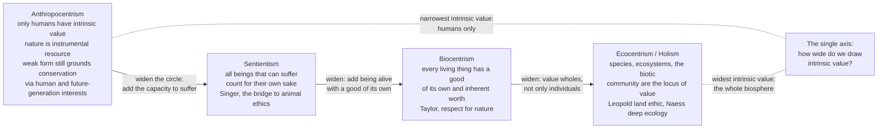

# 🌲 Environmental Ethics

> [!abstract] TL;DR
> **Environmental ethics** asks whether the non-human natural world — animals, plants, rivers, species, whole ecosystems — matters morally *only because humans use it* (**instrumental value**) or *in itself* (**intrinsic value**). That single axis generates a spectrum of positions that draw the circle of moral concern ever wider: **anthropocentrism** (only humans count; nature is a resource — though "weak" anthropocentrism still grounds strong conservation through human and *future-generation* interests), **sentientism** (all beings that can suffer count — the bridge to animal ethics), **biocentrism** (every living thing has *a good of its own* and inherent worth — Taylor's "respect for nature"), and **ecocentrism / holism** (species, ecosystems, and the *biotic community* are the locus of value — Leopold's **land ethic** and Naess's **deep ecology**). Where you land is not academic: it changes what counts as the "rational" harvest, the acceptable extinction, the fair climate policy. It is the environmental application of [[Moral_Status_and_the_Moral_Circle|the moral circle]].

## Intuition

**Analogy first — the last person on Earth.** Imagine you are the last human being alive; everyone else is gone and you are dying, with no descendants and no one to come. Beside you stands the last great redwood forest on the planet. With your final act you could set it ablaze — no human will ever see it, use it, sell it, or hike through it again. Have you done anything *wrong*?

If your gut says **"yes, that would be a desecration,"** then you already believe the forest has value that does *not* depend on any human using it — you are reaching for **intrinsic value**. If your gut says **"no, harm requires someone to be harmed, and no human is left,"** then you hold that nature's worth is entirely **instrumental** — good only as a means to human ends. That thought experiment (Richard Sylvan's "last man") is the whole of environmental ethics compressed into one image: the discipline is the fight over **how wide to draw the circle of things that can be wronged** — humans only, or sentient animals, or all living things, or the living community as a whole. Everything technical below is just an attempt to defend one answer to that question against the others.

---

## How It Works

### The central axis: instrumental vs intrinsic value

The organizing question is a single one: **why does nature matter?**

- **Instrumental value** — nature is valuable *as a means* to something else: timber, food, clean air, recreation, scientific data, spiritual solace. A wetland is worth preserving because it filters water and buffers floods *for people*. On this view nature's worth is entirely *derivative* of the human (or animal) interests it serves.
- **Intrinsic (or inherent) value** — nature is valuable *in itself*, as an end, independent of its usefulness to anyone. The forest would be worth something even in a universe with no one to enjoy it. The whole debate turns on **which entities**, if any, possess this non-derivative worth.

Crucially, instrumental value can still justify *powerful* conservation. You do not have to think a rainforest has a soul to fight for it — you can note that it stabilizes climate, harbors undiscovered medicines, and belongs to people not yet born. This is **"weak" or "enlightened" anthropocentrism** (Bryan Norton's *convergence hypothesis*: sound anthropocentric and ecocentric reasoning often *converge* on the same policies). The philosophical dispute is over the *grounds*; the practical dispute is over the *cases where they diverge* — where protecting an ecosystem costs humans and yields them nothing.

### The spectrum of positions — drawn by how wide intrinsic value reaches

Each position is defined by **who it lets inside the circle of intrinsic worth**:

1. **Anthropocentrism** — *only humans* have intrinsic value; everything else is instrumental. Strong anthropocentrism treats nature as pure resource. Weak / enlightened anthropocentrism (Norton, Passmore) grounds robust duties of stewardship through human wellbeing, aesthetic and spiritual goods, and — decisively — obligations to **future generations**, who will inherit whatever biosphere we leave.
2. **Sentientism** — the circle widens to *all beings that can suffer*. Bentham's "Can they *suffer*?" and Peter Singer's principle of equal consideration of interests pull sentient animals inside. This is the **bridge to animal ethics**: it is individualistic (it values *sentient individuals*, not species or ecosystems) and it excludes plants, rivers, and non-sentient nature.
3. **Biocentrism** — the circle widens again to *all living things*. Paul Taylor's *Respect for Nature* argues every organism is a "teleological center of a life" with a **good of its own** — a way its life can go well or badly *for it* — and therefore inherent worth, sentient or not. Albert Schweitzer's "reverence for life" is the older, intuitive cousin. Biocentrism is still **individualist**: it values each living thing, not the collective.
4. **Ecocentrism / holism** — the circle expands to *wholes*: species, populations, the land, the **biotic community** itself. Aldo Leopold's **land ethic**: *"A thing is right when it tends to preserve the integrity, stability, and beauty of the biotic community. It is wrong when it tends otherwise."* Arne Naess's **deep ecology** adds *biocentric egalitarianism* (all life has equal inherent worth) and *Self-realization* (identifying one's self with the wider ecological whole). Holism can value a *species* over the individuals composing it — which is exactly where its critics attack.



### Critiques, tensions, and other lenses

- **The naturalistic fallacy — "natural = good."** Deriving what we *ought* to protect straight from what *is* natural is a classic is/ought slip (see [[Metaethics_and_Moral_Disagreement]]). Wildfires, parasitism, and extinction are all "natural"; naturalness alone settles no moral question.
- **Holism vs individualism — the "environmental fascism" charge.** If the *community* is the locus of value, then culling individuals — even humans, in the reductio — could be "right" whenever it serves ecosystem integrity. Tom Regan branded this **environmental fascism**: holism can license sacrificing the individual to the whole. Ecocentrists (J. Baird Callicott) reply that the land ethic *adds* an outer moral obligation without cancelling our inner obligations to persons.
- **The demandingness problem.** A wide circle of equal worth seems to make ordinary life — eating, building, farming — morally fraught. Deep ecology's biocentric equality is often accused of being either impossibly demanding or quietly qualified in practice.
- **Ecofeminism** (Karen Warren, Val Plumwood) — the *domination of nature* and the *domination of women* share a "logic of domination": a dualistic, hierarchical frame that codes reason/man/culture as superior to emotion/woman/nature. Fix the frame, not just the emissions.
- **Social ecology** (Murray Bookchin) — ecological crisis is rooted in *social* hierarchy and capitalism, not in an abstract "humanity"; the cure is political and structural, not a change of individual attitude.
- **Environmental pragmatism** (Norton, Light) — stop fighting about metaphysics; converge on policy. Whether a marsh has intrinsic value matters less than getting people to protect it, and multiple value systems often agree on what to do.
- **Religious and Indigenous ethics** — many traditions (Jain *ahimsa*, Buddhist interdependence, Franciscan stewardship, and countless Indigenous relational ontologies of *kinship* with land) supply intrinsic-value frameworks far older than academic environmental ethics, and increasingly inform law such as legal personhood for rivers.

### Why is extinction bad, and how do we aggregate?

Ecocentrism gives the sharpest answer to *why species extinction is a distinctive wrong*: a species is a unique, irreplaceable, multi-billion-year lineage — losing it destroys a locus of value that no individual can carry. (Compare the ecology of it in [[Biodiversity_and_Conservation]].) But holism also raises the hardest technical problem in the field: **how do you aggregate human welfare against ecological value on a common scale?** Cost-benefit analysis prices nature in dollars (instrumental); precaution and rights-of-nature approaches refuse the trade and set ecological floors. That clash — pricing vs precaution — is exactly what plays out in **climate ethics** and **sustainability** policy.

---

## Key Concepts

### Secondary (the core idea, plainly)

- **Instrumental vs intrinsic value.** Something has *instrumental* value if it is useful *for* something else; it has *intrinsic* value if it matters *in itself*. Money is purely instrumental; the question of environmental ethics is whether a forest is more like money or more like a person.
- **The circle keeps widening.** Anthropocentrism = only humans count. Add animals that feel = sentientism. Add all living things = biocentrism. Add whole ecosystems = ecocentrism. Each step lets more of nature be *wronged*, not just *damaged*.
- **Leopold's rule of thumb.** "A thing is right when it tends to preserve the integrity, stability, and beauty of the biotic community." A one-sentence ethic for the land.
- **Weak anthropocentrism still saves forests.** You do not have to believe a swamp has a soul to protect it — clean water, future children, and beauty are reasons enough.

### Undergraduate (the positions and their arguments)

- **The last-man argument** (Richard Sylvan/Routley, 1973). If it would be wrong for the last human to destroy the last forest, then value cannot be *only* human-instrumental — nature must have some worth of its own. This is the founding argument *for* a distinct environmental ethic.
- **Taylor's biocentrism.** Every organism is a "teleological center of a life" with a good of its own; recognizing this commits us to an attitude of **respect for nature** and duties of non-maleficence, non-interference, fidelity, and restitution toward all living things.
- **Naess's deep ecology vs "shallow" environmentalism.** *Shallow* ecology fights pollution and resource depletion *for the health of affluent humans*; *deep* ecology asks the deeper questions and asserts **biocentric egalitarianism** plus **Self-realization** — the maturing of a narrow ego into an ecological Self that identifies with the living whole.
- **The convergence hypothesis** (Norton). Anthropocentric and non-anthropocentric reasoning, done well, tend to *converge* on the same conservation policies — so the metaphysical dispute may matter less in practice than it seems.
- **The individualism/holism split.** Sentientism and biocentrism value *individuals*; ecocentrism values *wholes*. This is why an ecocentrist may *support* culling an overpopulated deer herd to protect the ecosystem while an animal-rights theorist calls that murder.

### Graduate (structure, grounding, and hard cases)

- **The grounding problem for intrinsic value.** *What kind of property is "intrinsic value," and how could a non-sentient thing possess it?* Objectivists (Rolston III) hold that value is discovered *in* nature — a "projective" nature that generates value; subjectivists (Callicott, via Hume) hold that value is *conferred* by valuers but can still be non-instrumental in its object. The metaethics here connects directly to realism vs anti-realism in [[Metaethics_and_Moral_Disagreement]].
- **Callicott's defense of holism against the fascism charge.** Drawing on Hume and Darwin, Callicott argues our moral sentiments extend in *nested communities* (family, society, biotic community); the land ethic is an *accretion* of an outer obligation that does not annihilate the inner ones — so it does not license sacrificing persons to ecosystems.
- **Rolston's "systemic value."** Holmes Rolston III distinguishes the value *of* organisms, the value *of* species as historical lineages, and the **systemic value** of ecosystems as the *value-generating matrix* itself — the "womb" that produces all the rest, and therefore the deepest locus of worth.
- **Aggregation and incommensurability.** If human welfare and ecological integrity are *incommensurable* (no shared cardinal scale), then cost-benefit analysis commits a category error by monetizing existence value. Contingent-valuation surveys try to price non-use value; critics argue willingness-to-pay for "the existence of blue whales" mismeasures a value that is not a preference at all.
- **The demandingness and the "misanthropy" worries.** Strong biocentric egalitarianism appears either self-refuting (humans must eat *something*) or covertly ranked. Sophisticated versions build in a **priority-to-basic-interests** principle (a human's vital need outranks a plant's) while denying that *trivial* human wants outrank a being's vital good — recovering intuitive verdicts without collapsing back into anthropocentrism.
- **Policy translation: pricing vs precaution.** Cost-benefit + discounting (an anthropocentric, instrumental technology) vs the **precautionary principle** and **rights of nature** (which install non-negotiable ecological floors). How steeply you discount the future encodes an implicit stance on the standing of **future generations** — the hinge between environmental ethics and climate ethics.

---

## Python Demo

```python
# Environmental ethics, made quantitative: the SAME biology, TWO value systems.
# We model a renewable resource (a forest's living biomass, or a fish stock) that
# grows logistically, and we ask "what is the OPTIMAL harvest?" under:
#   (A) ANTHROPOCENTRISM  - nature is a resource; only harvest value counts.
#   (B) ECOCENTRISM       - the living community also has INTRINSIC worth, plus
#                           NON-USE / EXISTENCE value for an intact ecosystem.
# The ethical framework - not the biology - decides what "rational" means, and
# therefore decides the ecosystem's fate.  numpy + matplotlib only.

import numpy as np
import matplotlib.pyplot as plt

# ---- Logistic resource: growth rate r, carrying capacity K, price per unit p --
r, K, p = 0.40, 1000.0, 1.0

# Sustainable harvest-rate grid (u < r leaves a positive equilibrium stock).
u    = np.linspace(0.001, r * 0.999, 500)
X_eq = K * (1.0 - u / r)          # equilibrium standing stock at harvest rate u
Y    = u * X_eq                   # sustainable yield (harvest taken per year)

# ---- Value system A: ANTHROPOCENTRIC (nature = resource for us) ---------------
# Only the economic value of the harvest counts.  Optimum = maximum sustainable
# yield (MSY), which already sacrifices HALF the pristine ecosystem.
V_anthro = p * Y

# ---- Value system B: ECOCENTRIC (the biotic community has value in itself) ----
# Same use-value, PLUS Taylor-style inherent worth per unit living stock, PLUS a
# concave non-use / existence value that rewards keeping the system intact.
w_intrinsic = 0.10                        # inherent worth per unit living stock
w_existence = 100.0                       # existence value of an intact system
intrinsic   = w_intrinsic * X_eq
existence   = w_existence * np.sqrt(X_eq / K)   # concave: diminishing returns
V_eco = p * Y + intrinsic + existence

# Optimal harvest rate under each value system.
uA, XA = u[np.argmax(V_anthro)], None
uB     = u[np.argmax(V_eco)]
XA     = K * (1 - uA / r)
XB     = K * (1 - uB / r)

# ---- Simulate the ecosystem's FATE under three management rules ---------------
def simulate(u_rate, X0=K, T=80):
    X = np.empty(T + 1); X[0] = X0
    for t in range(T):
        growth  = r * X[t] * (1 - X[t] / K)
        harvest = u_rate * X[t]
        X[t + 1] = max(X[t] + growth - harvest, 0.0)
    return X

t_yrs       = np.arange(81)
traj_eco    = simulate(uB)        # ecocentric: harvest conservatively
traj_anthro = simulate(uA)        # anthropocentric MSY: harvest at max yield
traj_myopic = simulate(0.45)      # unmanaged / discount-driven liquidation (u > r)

# ---- Plots -------------------------------------------------------------------
fig, (ax1, ax2) = plt.subplots(1, 2, figsize=(15, 6))

ax1.plot(u, V_anthro / V_anthro.max(), color="#b45309", lw=2.5,
         label="Anthropocentric value (harvest only)")
ax1.plot(u, V_eco / V_eco.max(), color="#15803d", lw=2.5,
         label="Ecocentric value (harvest + intrinsic + existence)")
ax1.axvline(uA, color="#b45309", ls="--", alpha=0.8)
ax1.axvline(uB, color="#15803d", ls="--", alpha=0.8)
ax1.annotate(f"anthropocentric optimum\nu={uA:.2f}  ->  stock {XA:.0f} (K/2)",
             (uA + 0.005, 0.30), color="#b45309", fontsize=9)
ax1.annotate(f"ecocentric optimum\nu={uB:.2f}  ->  stock {XB:.0f}",
             (uB + 0.005, 0.72), color="#15803d", fontsize=9)
ax1.set_xlabel("harvest rate u  (fraction of stock taken per year)")
ax1.set_ylabel("value  (each curve normalized to its own maximum)")
ax1.set_title("The ethical framework moves the 'rational' harvest")
ax1.legend(loc="lower center", fontsize=8)
ax1.grid(alpha=0.3)

ax2.plot(t_yrs, traj_eco,    color="#15803d", lw=2.5,
         label=f"Ecocentric (u={uB:.2f})  ->  stays intact")
ax2.plot(t_yrs, traj_anthro, color="#b45309", lw=2.5,
         label=f"Anthropocentric MSY (u={uA:.2f})  ->  half depleted")
ax2.plot(t_yrs, traj_myopic, color="#b91c1c", lw=2.5,
         label="Myopic / open-access (u=0.45)  ->  collapse")
ax2.axhline(K, color="gray", ls=":", alpha=0.6)
ax2.set_xlabel("years")
ax2.set_ylabel("standing stock (living biomass)")
ax2.set_title("Same resource, three fates - set by the value system")
ax2.legend(loc="center right", fontsize=8)
ax2.grid(alpha=0.3)

plt.tight_layout()
plt.savefig("environmental_ethics.png", dpi=120)
plt.show()

# ---- Report the numbers ------------------------------------------------------
print(f"Anthropocentric optimum: harvest u={uA:.3f}  ->  stock {XA:.0f} "
      f"({100 * XA / K:.0f}% of pristine)")
print(f"Ecocentric      optimum: harvest u={uB:.3f}  ->  stock {XB:.0f} "
      f"({100 * XB / K:.0f}% of pristine)")
print("Identical biology; the ETHICS changes what counts as the optimal decision.")

# Expected output (illustrative):
#   Anthropocentric optimum: harvest u=0.200  ->  stock 500 (50% of pristine)
#   Ecocentric      optimum: harvest u=0.120  ->  stock 700 (70% of pristine)
```

The demo makes the field's core claim concrete: **the "optimal" decision is not read off the biology — it is fixed by the value function you plug in.** The anthropocentric manager, valuing only the harvest, rationally drives the stock to *half* its pristine level (maximum sustainable yield sacrifices the other half without a qualm). The ecocentric manager, weighting the community's intrinsic and existence value, rationally harvests *less* and keeps the ecosystem largely intact. And the third line — the myopic, high-discount, open-access exploiter who values the future at nearly zero — liquidates the resource to collapse, the quantitative face of both the tragedy of the commons and the failure to count **future generations**.

---

## Real-World Applications

- **Rights of nature in law.** Ecocentric intrinsic value has crossed from seminar to statute: **Ecuador's 2008 constitution** grants rights to *Pachamama* (Nature); **New Zealand** granted the **Whanganui River** legal personhood (2017), rooted in Māori relational ontology; Colombian, Indian, and Bolivian courts have followed. Ecosystems and rivers are being pulled inside the circle of things that can be *wronged*.
- **Endangered Species Act trade-offs.** Halting a dam or a logging operation to save a non-charismatic species (the snail darter, the northern spotted owl) is unintelligible on strict anthropocentrism but obvious on ecocentrism — and it is precisely where the value systems *diverge* in policy.
- **Fisheries and forestry management.** The maximum-sustainable-yield logic in the demo is real regulatory practice; ecosystem-based management and marine protected areas encode a shift toward valuing the *system*, not just the catch — the applied face of [[Ecological_Resilience_and_Ecosystems|ecological resilience]].
- **Climate policy and the discount rate.** The fiercest technical dispute in climate economics — how steeply to discount future damages (the Stern vs Nordhaus debate) — is an *ethics* dispute in disguise: it prices the standing of future generations and the non-human world. This is the doorway to **climate ethics** and **sustainability** (see [[Sustainability_and_Planetary_Boundaries]]).
- **Wilderness and de-extinction.** Whether to keep areas roadless "for their own sake," and whether to resurrect extinct species, both hinge on whether wildness and species-lineages carry intrinsic, non-substitutable value.
- **Wildlife management vs animal rights.** Culling invasive predators to protect native ecosystems pits *holist* ecocentrism against *individualist* animal ethics — the same fault line, live in every conservation agency.

---

## Common Pitfalls

- **Collapsing "damage" into "wrong."** Anthropocentrism can only say clearing a forest is *bad for humans*. If you sense it can be *wrong even when no human loses out* (the last-man intuition), you have already left strict anthropocentrism — do not smuggle intrinsic value in while claiming to be a pure instrumentalist.
- **The "natural = good" slide (naturalistic fallacy).** Predation, disease, and extinction are all natural; "it's natural" never by itself shows "it's right." Environmental *value* has to be argued, not read off the label "natural" (see [[Metaethics_and_Moral_Disagreement]]).
- **Conflating sentientism with ecocentrism.** Animal ethics values *sentient individuals*; ecocentrism values *wholes* — and they can flatly contradict each other (culling to protect an ecosystem). Treating "caring about nature" as one undifferentiated stance hides the field's central tension.
- **The environmental-fascism reductio, taken as a knockdown.** Holism's willingness to subordinate individuals to the community is a real worry — but Callicott's nested-communities reply blocks the reductio. Citing "environmental fascism" as if it ended the debate ignores the standard response.
- **Pricing existence value as if it were a preference.** Contingent-valuation dollar figures for "the existence of a species" can badly mismeasure a value its holders explicitly refuse to trade. Treating all value as willingness-to-pay bakes anthropocentric instrumentalism into the very measuring instrument.
- **Assuming convergence always holds.** Norton's convergence is a *tendency*, not a law. The hard cases — where protecting an ecosystem genuinely costs humans and returns them nothing — are exactly where the choice of framework does real work, and where "it doesn't matter which theory" is false.

---

## Related Concepts

- [[Moral_Status_and_the_Moral_Circle]] — Environmental ethics *is* the moral circle applied to nature: each position (anthro, sentientist, biocentric, ecocentric) is a different answer to "who has moral status and on what ground?"
- [[Applied_Ethics_Overview]] — Situates environmental ethics as one section of the broader applied-ethics map alongside bioethics, animal ethics, and AI ethics.
- [[Metaethics_and_Moral_Disagreement]] — Supplies the machinery for the "grounding problem" (is intrinsic value discovered or conferred?) and diagnoses the naturalistic "natural = good" fallacy.
- [[Biodiversity_and_Conservation]] — The ecology behind "why is extinction bad?": what species and biodiversity actually are, and what their loss destroys.
- [[Ecosystems_and_Energy_Flow]] — The systems view of the "biotic community" that Leopold's land ethic takes as the locus of value.
- [[Population_Ecology]] — Carrying capacity and logistic harvest dynamics — the biology underlying the demo's anthropocentric-vs-ecocentric harvest model.
- [[Sustainability_and_Planetary_Boundaries]] — Where environmental ethics becomes policy: safe operating spaces, overshoot, and the intergenerational stakes of the discount rate.
- [[Ecological_Resilience_and_Ecosystems]] — "Integrity and stability" in Leopold's rule, made rigorous: resilience, tipping points, and why ecosystem-based management matters.

> **Forthcoming siblings (not yet in the vault):** this note is written to link to **Animal Ethics and Rights** (the sentientist bridge), **Climate Ethics** (pricing vs precaution, the discount rate), and **Future Generations and Intergenerational Justice** (the standing of those not yet born) once those notes exist.

---

## Review Questions

**Secondary**
1. Explain the difference between *instrumental* and *intrinsic* value using an example from nature. Then say what the "last person on Earth burning the last forest" thought experiment is meant to show.

**Undergraduate**
2. Arrange anthropocentrism, sentientism, biocentrism, and ecocentrism on a single axis and state what each one lets *inside* the circle of intrinsic value. Why can an ecocentrist support culling a deer herd that a defender of animal rights would condemn as killing — even though both claim to "care about nature"?

**Graduate**
3. Tom Regan charged ecocentric holism with "environmental fascism" for being willing to sacrifice individuals to the biotic community. Reconstruct the charge, present Callicott's nested-communities reply, and assess whether the reply fully rescues holism — or merely relocates the problem. Connect your answer to the aggregation problem: can human welfare and ecosystem integrity be placed on a common scale at all?

---

## Sources

- Leopold, A. (1949). *A Sand County Almanac* — "The Land Ethic." Oxford University Press.
- Taylor, P. W. (1986). *Respect for Nature: A Theory of Environmental Ethics*. Princeton University Press.
- Naess, A. (1973). "The Shallow and the Deep, Long-Range Ecology Movement: A Summary." *Inquiry* 16, 95–100.
- Rolston III, H. (1988). *Environmental Ethics: Duties to and Values in the Natural World*. Temple University Press.
- Brennan, A. & Lo, Y-S. "Environmental Ethics." *Stanford Encyclopedia of Philosophy*. https://plato.stanford.edu/entries/ethics-environmental/

---

#ethics #environmental-ethics #intrinsic-value #ecocentrism #land-ethic
