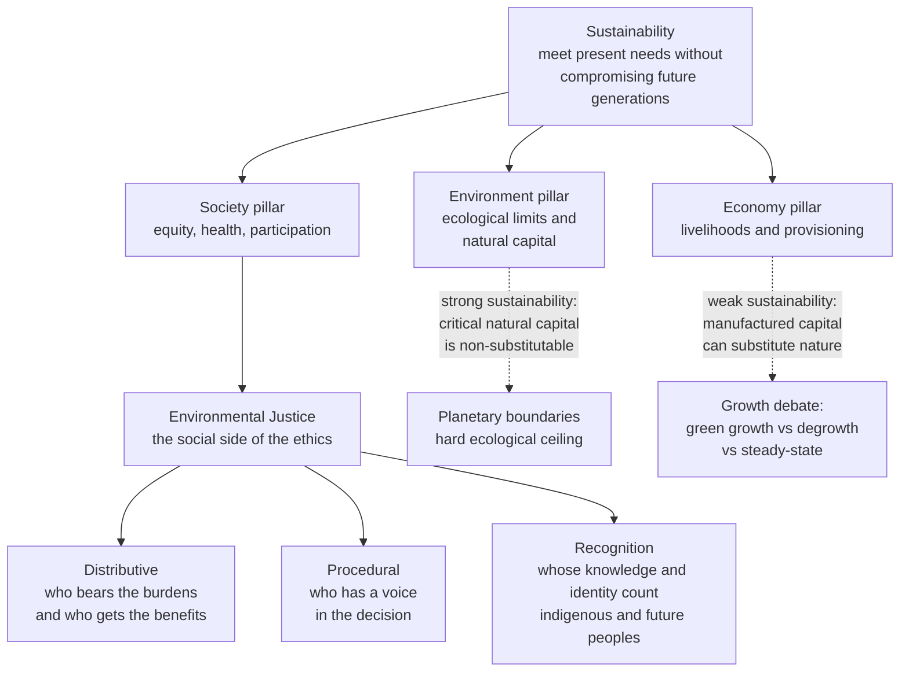

# 🌱 Environmental Justice and Sustainability

> [!abstract] TL;DR
> Where value theory in environmental ethics asks *what* in nature has moral worth, **environmental justice** asks *who wins and who loses* — because pollution, waste, and ecological risk are never distributed by lottery. They pile up on the poor, the marginalized, and the politically voiceless, at home ("sacrifice zones," Warren County, Flint) and globally (rich nations exporting harm and consuming beyond their share). Justice here has **three faces**: *distributive* (who bears the burdens), *procedural* (who has a voice), and *recognition* (whose knowledge and identity count — including indigenous peoples and the unborn). **Sustainability** is the temporal extension of this justice: the Brundtland demand to meet present needs "without compromising the ability of future generations to meet their own." The deepest fault line is **strong vs weak sustainability** — whether some natural capital is *non-substitutable* (you cannot rebuild a stable climate or a species with money and machines) — which in turn drives the **growth debate**: green growth and decoupling versus degrowth versus a steady-state economy.

## Intuition

**Analogy:** *The pollution does not fall evenly.* Imagine a city drawn on a map, and then imagine dropping the factory smokestack, the incinerator, the diesel-truck depot, the chemical plant, and the landfill onto that map. They almost never land in the leafy suburb with the good lawyers and the zoning board seats. They land — again and again, decade after decade — next to the neighborhood with the cheapest land, the least political clout, and the fewest people who can afford to move or to sue. The wind carries the smell one way, not the other, and it is rarely toward the mansions.

Now stretch the same map across **time** and across the **globe**. The people downwind are also the *future* people (who inherit the depleted soil and the carbon we emit today but cannot vote in our elections) and the *distant* people (the low-income nation that receives our electronic waste and grows our export crops on land it can no longer use to feed itself). Environmental justice is simply the refusal to treat "downwind, downstream, downhill, and down-the-timeline" as morally invisible. Sustainability is the same insight aimed forward: do not spend the planet's principal and hand the next generation only the bill.

---

## How It Works

Environmental justice and sustainability are **two axes of fairness laid over the same ecological reality**. Environmental justice is fairness *across social space* (who, alive today, bears the harm). Sustainability is fairness *across time* (whether the harm is being pushed onto people not yet born). Both are the **social side** of environmental ethics — they take the value questions (Does a river have worth? Do animals count?) as given and ask the distributive question that value theory alone cannot answer: *given that environmental goods and bads exist, how should they be shared, and who decides?*

### Environmental justice: the empirical reality first

The field did not begin with philosophy; it began with a map and a protest. In **1982, Warren County, North Carolina** — a poor, majority-Black county — was chosen to host a toxic PCB landfill. Residents lay down in front of the trucks. The demographics were not a coincidence: a landmark **1987 study by the United Church of Christ** ("Toxic Wastes and Race") found that *race* was the single strongest predictor of where hazardous-waste facilities were sited in the United States — a stronger predictor than income. That gave the phenomenon its two names: **environmental racism** and **environmental classism**. The mechanism is a feedback loop of "the path of least resistance": facilities are sited where land is cheap and opposition is weak; the pollution depresses land values and drives out those who can leave; the community grows poorer and less able to resist the *next* facility. Communities that absorb this concentrated ruin so the wider economy can run cleanly are called **sacrifice zones** — Louisiana's "Cancer Alley," coal-country hollows, refinery-fenceline neighborhoods. **Flint, Michigan (2014)** is the canonical case of *procedural* injustice: an unelected emergency manager switched the water source of a poor, majority-Black city to save money, ignored residents' complaints for months, and poisoned the population with lead — the harm was not just the contamination but the *silencing*.

The pattern scales up to the **globe**. High-income nations consume far beyond their per-capita share of the biosphere while exporting the harms: shipping e-waste and toxic recycling to Ghana and Southeast Asia, outsourcing carbon-intensive manufacturing, and appropriating land and water through export agriculture — a dynamic economists call **ecologically unequal exchange**. The nations least responsible for climate change are, by geography and poverty, the most exposed to its damage — a global mismatch between who caused the harm and who suffers it. (This global dimension is the bridge to *global justice* and *climate ethics*, which extend the same fairness question across borders and into deep time.)

### The three faces of environmental justice

Modern theory (David Schlosberg is the key synthesizer) argues that fairness in outcomes is necessary but not sufficient. Justice has three inseparable dimensions:

1. **Distributive justice — who bears the burdens and gets the benefits.** The classic question: are pollution, risk, and clean-up costs, and conversely parks, clean air, and green infrastructure, distributed fairly? This is the dimension you can *measure* (and the one modeled in the Python demo below).
2. **Procedural justice — who has a voice.** Even a fair outcome is unjust if it was imposed. Do affected communities get information, standing, consultation, and real power in siting and permitting decisions? Flint failed here even before the lead arrived.
3. **Recognition justice — whose knowledge and identity count.** Underneath the other two: some groups are not even *seen* as full participants. Indigenous peoples' relationship to land, local and traditional ecological knowledge, and the interests of future generations are treated as not-quite-real. Misrecognition is the root injustice that makes the maldistribution and the exclusion possible.

### Sustainability: fairness pushed into the future

The **Brundtland Report (1987), "Our Common Future,"** gave the durable definition: *development that meets the needs of the present without compromising the ability of future generations to meet their own needs.* This is intergenerational distributive justice — the future people are the ultimate "downwind" community. The dominant operational picture is the **three-pillar model**: sustainability sits at the intersection of **Environment**, **Society**, and **Economy** (often drawn as three overlapping circles or "people, planet, profit").

The critique of the three pillars is decisive for the graduate reader: drawing them as **three equal, overlapping circles implies they are substitutable and co-equal** — that you can trade a little environment for more economy. Ecological economists redraw it as **nested dependency**: the economy is a wholly-owned subsidiary of society, which is a wholly-owned subsidiary of the biosphere. There is no economy on a dead planet. This nesting is exactly the argument for **strong sustainability**.

### Strong vs weak sustainability — the load-bearing distinction

The core disagreement is about **substitutability of capital**:

- **Weak sustainability** (mainstream / neoclassical, associated with the Hartwick rule): what matters is the *total* stock of capital passed to the future. **Natural capital** (forests, fisheries, a stable climate, biodiversity) and **manufactured / human capital** (factories, technology, knowledge) are broadly *interchangeable*. Deplete a fishery but invest the proceeds in education or robotics, and the next generation is no worse off. Sustainability just means keeping total capital non-declining.
- **Strong sustainability** (ecological economics, Herman Daly): some **natural capital is critical and non-substitutable**. No amount of money, machinery, or cleverness rebuilds a stable climate, a viable ozone layer, or an extinct species. These are the **planetary boundaries** — hard ceilings, not soft trade-offs (see [[Sustainability_and_Planetary_Boundaries]]). Sustainability therefore requires keeping *each* critical natural stock above its threshold, not just balancing a ledger.

This distinction cashes out directly into the **growth debate**:

- **Green growth / decoupling** believes GDP can keep rising while environmental impact falls, through efficiency and clean technology. The crucial fork is **relative vs absolute decoupling** — impact per dollar falling is easy; *total* impact falling while the economy grows is the hard, rarely-achieved claim. The skeptic's weapon is the **Jevons paradox**: efficiency gains that lower the cost of a resource tend to *increase* total consumption of it.
- **Degrowth** argues that infinite material growth on a finite planet is impossible, and that rich economies must *deliberately and equitably scale down* throughput while maintaining wellbeing — reframing prosperity away from consumption.
- **Steady-state economics** (Daly) seeks a stable, non-growing economy operating safely within ecological limits — neither expanding nor collapsing.

Finally, the **just transition** ties justice and sustainability together in the present tense: decarbonization *itself* creates winners and losers. If coal miners and refinery towns simply lose their livelihoods so the rest of us get clean air, the green transition reproduces exactly the injustice it should cure. A just transition demands retraining, investment, and voice for the workers and communities carrying the cost of change.

### Diagram: the two axes of fairness over the same reality



---

## Key Concepts

### Secondary (explain it to a curious teenager)
- **Environmental justice** = pollution and environmental risk should be shared fairly, and everyone affected should get a say. The reality is that they are *not* shared fairly.
- **Environmental racism / classism** = dirty facilities (landfills, factories, incinerators) end up next to poor and minority communities far more often than next to rich ones.
- **Sacrifice zone** = a place so polluted that people's health is quietly traded away for the wider economy.
- **Sustainability** = don't use up the planet's resources so fast that future people are left with nothing — "leave the campsite as good as you found it."
- **Three pillars** = balancing the environment, society, and the economy.

### Undergraduate (needs some background)
- **Warren County (1982)** and the **UCC 1987 "Toxic Wastes and Race"** study — the origin of the movement and the finding that *race* predicted toxic-facility siting.
- **Flint water crisis (2014)** — a textbook failure of *procedural* justice: residents were ignored and silenced.
- **Three faces of justice**: distributive (who bears burdens), procedural (who has voice), recognition (whose identity and knowledge count).
- **Brundtland definition (1987)** of sustainable development; **intergenerational justice** as the temporal axis of fairness.
- **Three-pillar model** (environment / society / economy) and its main critique: the pillars are *not* co-equal and substitutable — the economy is nested inside society inside the biosphere.
- **Ecological footprint** — measuring humanity's demand against the biosphere's regenerative capacity; the basis for "consuming beyond our share."
- **Just transition** — fairness to workers and communities as economies decarbonize.

### Graduate (system-level and contested)
- **Strong vs weak sustainability** and the **substitutability of natural vs manufactured capital**; the **Hartwick rule** (invest resource rents to keep total capital constant) as the weak-sustainability policy; **critical natural capital** and thresholds as the strong-sustainability constraint.
- **Decoupling debate**: *relative* vs *absolute* decoupling of GDP from impact; the **Jevons paradox** (rebound effects) as the standing objection to green growth.
- **Degrowth** and **steady-state economics** (Herman Daly) vs **green growth**; the ethics of *limits* and of consumption.
- **Capabilities-based environmental justice** (Schlosberg, drawing on Sen and Nussbaum): justice is about protecting the functionings that a healthy environment underwrites, not merely distributing "goods."
- **Recognition justice and indigenous environmental ethics**: traditional ecological knowledge, land-based epistemologies, and stewardship as a distinct ethic (not just a claim on resources) — the deep root beneath distribution and procedure.
- **Global environmental injustice / ecologically unequal exchange**: the structural transfer of environmental burdens from rich to poor nations; ties to *global justice* and *climate ethics*.
- **The non-identity problem and discounting** in intergenerational ethics: how we value future people's interests, and why a positive social discount rate is ethically loaded.

---

## Python Demo

We make the *distributive* face of environmental justice measurable. We simulate a population with incomes and pollution-exposure levels (exposure rises as income falls, mimicking the siting pattern), then quantify the disproportionality with a **Concentration Index** and a **concentration curve** — the standard health-economics tools for "is this bad concentrated on the disadvantaged?"

```python
# Environmental-burden inequality: how pollution exposure concentrates on the poor.
# We measure disproportionality with a Concentration Index (CI) and a concentration curve.
import numpy as np
import matplotlib.pyplot as plt

rng = np.random.default_rng(42)
N = 20000

# 1. Give each person an income (log-normal: many poor, few rich).
income = rng.lognormal(mean=10.5, sigma=0.6, size=N)

# 2. Pollution exposure falls as income rises (facilities sited near cheap land),
#    plus noise. Use a declining function of each person's income rank.
income_rank = income.argsort().argsort() / (N - 1)        # fractional rank in [0, 1]
base_exposure = 90.0 - 60.0 * income_rank                 # poorest ~90, richest ~30 ug/m3
exposure = np.clip(base_exposure + rng.normal(0, 8, N), 1, None)

# 3. Concentration Index via the covariance formula:
#      CI = 2 * cov(exposure, income_rank) / mean(exposure)
#    CI < 0  =>  the "bad" concentrates among the poor  =>  environmental injustice.
mu = exposure.mean()
CI = 2.0 * np.cov(exposure, income_rank, bias=True)[0, 1] / mu

# 4. Pearson correlation between exposure and raw income (expect negative).
corr = np.corrcoef(exposure, income)[0, 1]

# 5. Concentration curve: rank population poorest -> richest, accumulate exposure share.
order = np.argsort(income)
cum_pop = np.arange(1, N + 1) / N
cum_exp = np.cumsum(exposure[order]) / exposure.sum()

# 6. Mean exposure by income decile for a readable bar chart.
deciles = np.floor(income_rank * 10).clip(0, 9).astype(int)
decile_mean = np.array([exposure[deciles == d].mean() for d in range(10)])

print(f"Concentration Index          : {CI:+.3f}  (negative = burden on the poor)")
print(f"Corr(exposure, income)       : {corr:+.3f}")
print(f"Poorest-decile mean exposure : {decile_mean[0]:.1f} ug/m3")
print(f"Richest-decile mean exposure : {decile_mean[-1]:.1f} ug/m3")
print(f"Ratio poorest / richest      : {decile_mean[0] / decile_mean[-1]:.2f}x")

fig, ax = plt.subplots(1, 2, figsize=(12, 5))

ax[0].bar(range(1, 11), decile_mean, color="firebrick", edgecolor="black")
ax[0].set_xlabel("Income decile  (1 = poorest, 10 = richest)")
ax[0].set_ylabel("Mean pollution exposure (ug/m3)")
ax[0].set_title("The burden falls on the poorest")

ax[1].plot([0, 1], [0, 1], "k--", label="Line of equality")
ax[1].plot(cum_pop, cum_exp, color="firebrick", lw=2,
           label=f"Concentration curve  CI={CI:+.3f}")
ax[1].fill_between(cum_pop, cum_pop, cum_exp, alpha=0.2, color="firebrick")
ax[1].set_xlabel("Cumulative share of population  (poorest to richest)")
ax[1].set_ylabel("Cumulative share of pollution exposure")
ax[1].set_title("Curve above the diagonal =\nthe poor bear a disproportionate share")
ax[1].legend()

plt.tight_layout()
plt.savefig("environmental_burden_inequality.png", dpi=120)
print("Saved environmental_burden_inequality.png")
```

**What you see.** The Concentration Index comes out around `-0.15` to `-0.20` (negative because the "bad" concentrates on the poor), the exposure-income correlation is negative, and the poorest decile breathes roughly **2x** the richest decile's pollution. The concentration curve bows *above* the line of equality — the geometric signature that the disadvantaged carry more than their population share of the burden. Flip the sign convention and the same machinery measures how the *benefits* (parks, tree canopy, clean water) concentrate on the rich. This is exactly the number epidemiologists and EPA analysts compute to turn "environmental racism" from a slogan into evidence.

---

## Real-World Applications

- **Regulatory screening tools.** The US EPA's **EJScreen** and California's **CalEnviroScreen** overlay pollution data on demographic data to flag "disadvantaged communities" — an operational, mapped version of the concentration analysis above, used to target enforcement and funding (e.g., the US **Justice40** initiative directing 40 percent of climate investment benefits to those communities).
- **Facility siting and permitting law.** Environmental-justice analysis is now required in many permitting processes; procedural-justice principles underlie community consultation mandates and the international **Aarhus Convention** (access to information, participation, and justice in environmental matters).
- **Corporate ESG and sustainability reporting.** The three-pillar / "triple bottom line" framing structures how firms report; the strong-vs-weak debate surfaces in whether "net zero" via *offsets* (substituting emissions elsewhere) counts as genuine sustainability.
- **Climate negotiation.** "Common but differentiated responsibilities," **loss and damage** funds, and per-capita emission-equity arguments are global environmental justice made into treaty text.
- **Just-transition policy.** Coal-region retraining funds, worker guarantees in Green New Deal proposals, and phase-out timelines negotiated with affected unions.
- **Indigenous stewardship and co-management.** Recognition justice in practice: treaty-based land management, "Land Back" movements, and integrating traditional ecological knowledge into conservation.

---

## Common Pitfalls

- **Reducing justice to distribution alone.** Fixing *where* the landfill goes without fixing *who decides* leaves procedural and recognition injustice intact. A "fair" outcome imposed on a silenced community is still unjust.
- **Treating the three pillars as co-equal and substitutable.** The overlapping-circles picture invites trading environment for growth. Strong sustainability insists the economy is *nested inside* the biosphere — some limits are not negotiable line items.
- **Confusing relative with absolute decoupling.** "Emissions per dollar are falling" is not "emissions are falling." Green-growth optimism routinely equivocates between the two, and the **Jevons paradox** erases efficiency gains through increased consumption.
- **Individualizing a structural problem.** Framing sustainability as personal footprint (recycle, fly less) can shift responsibility from the systems and firms that shape the choice architecture onto individuals — the "carbon footprint" concept was itself popularized by an oil company.
- **Exporting the harm and calling it clean.** A nation or city can look green precisely because it has *offshored* its dirty production and dumped its waste elsewhere — ecologically unequal exchange hidden behind local statistics.
- **NIMBY dressed as justice.** Wealthy communities can invoke "environmental" objections to block infrastructure, pushing burdens onto poorer neighborhoods with weaker organization — the opposite of environmental justice.
- **Discounting future people to near-zero.** A high social discount rate can make catastrophic future harm look trivially cheap today; the discount rate is an ethical choice masquerading as an economic parameter.

---

## Related Concepts

- [[Sustainability_and_Planetary_Boundaries]] — the systems-thinking backbone: the biophysical limits that ground *strong* sustainability and the "hard ceiling" in the diagram.
- [[Ecological_Resilience_and_Ecosystems]] — why some natural capital is non-substitutable: ecosystems have thresholds and can flip to degraded regimes that money cannot restore.
- [[Race_Ethnicity_and_Racism]] — the sociology of the "race predicts siting" finding; environmental racism as a structural form of racial inequality.
- [[Global_Inequality_and_Development]] — the global axis: ecologically unequal exchange and rich-nation overconsumption exporting harm to the poor.
- [[Externalities_and_Pigouvian_Tax]] — the economic mechanism behind pollution injustice: uncompensated negative externalities dumped on those with the least power to refuse them.
- [[Justice_in_Health_and_Resource_Allocation]] — the same distributive-justice toolkit (who gets the burden, who gets the benefit) applied in bioethics; a close methodological sibling.

> [!note] Forthcoming siblings
> This is the social/justice half of environmental ethics. Its companions — an **Environmental Ethics** value-theory note, a **Climate Ethics** note, a **Future Generations / Intergenerational Justice** note, and a **Global Justice and Human Rights** note — belong in this section and neighboring folders. When those exist, link them here and back.

---

## Review Questions

1. **(Conceptual)** Distinguish the *distributive*, *procedural*, and *recognition* faces of environmental justice. Use the Flint water crisis to show why an analysis that only measures distributive outcomes would miss the core injustice.
2. **(Scenario)** A national government can hit its emissions target either by (a) building solar farms and shutting a coal region with no support package, or (b) a slower phase-out with retraining, income guarantees, and community ownership stakes. Both reach net zero. Which is more defensible on environmental-justice grounds, and which specific principles (procedural, recognition, just transition) decide it?
3. **(Trade-off)** A policymaker claims that depleting a fishery is fine because the profits are invested in universities and clean-tech R&D, leaving future generations "richer overall." State which sustainability position this assumes, give the strongest strong-sustainability rebuttal (name the concept of critical natural capital), and explain how the Jevons paradox complicates the "efficiency will save us" reply.

---

## Sources

- Schlosberg, D. (2007). *Defining Environmental Justice: Theories, Movements, and Nature.* Oxford University Press.
- World Commission on Environment and Development (1987). *Our Common Future* ("The Brundtland Report"). Oxford University Press.
- United Church of Christ Commission for Racial Justice (1987). *Toxic Wastes and Race in the United States.*
- Daly, H. E. (1996). *Beyond Growth: The Economics of Sustainable Development.* Beacon Press.
- Hickel, J. & Kallis, G. (2020). "Is Green Growth Possible?" *New Political Economy*, 25(4), 469-486.
- US EPA, [EJScreen: Environmental Justice Screening and Mapping Tool](https://www.epa.gov/ejscreen).

---

#ethics #environmental-justice #sustainability #environmental-racism #degrowth
