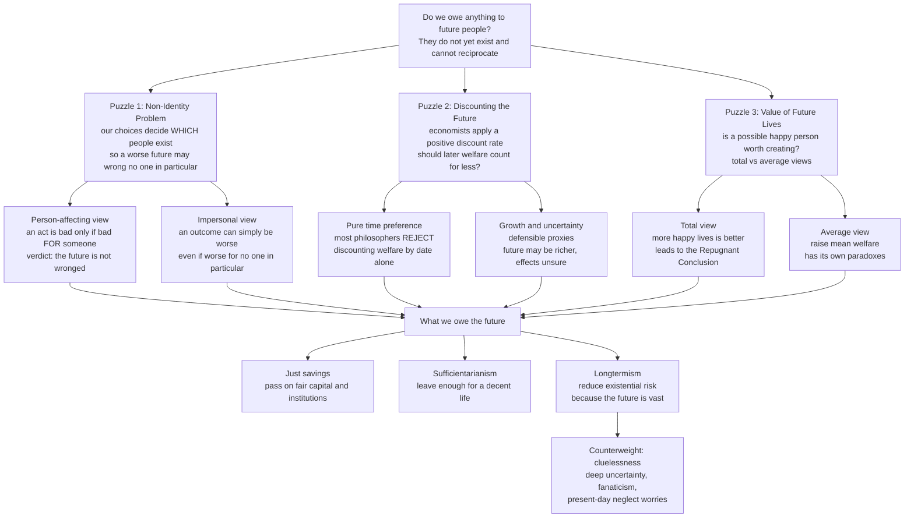

# 🌳 Future Generations and Intergenerational Justice

> [!abstract] TL;DR
> **Intergenerational justice** asks what, if anything, we owe to people who do not yet exist and can never reciprocate. The question is deceptively hard because of three deep puzzles: **the non-identity problem** (our present choices determine *which* people will be born, so a policy that leaves the future worse off may harm no *particular* person, since different people would exist under a better policy — Parfit); **pure time discounting** (economists routinely discount future welfare, but most philosophers deny that a person's interests count for less *merely because* they are later); and the **value of future lives** rooted in population ethics (is it good to bring happy people into existence — total vs average views, and Parfit's Repugnant Conclusion). Answers range from a **Rawlsian just-savings principle** and **sufficientarian** "leave enough" duties to **longtermism** (MacAskill, Ord), which argues that because the future is potentially vast, positively shaping it — above all by reducing **existential risk** — is a top moral priority. Longtermism's expected-value argument is powerful but faces the counterweight of **cluelessness**: our deep uncertainty about long-run effects, and the specter of **fanaticism**.

## Intuition

**Analogy first — planting trees whose shade you will never sit in.** There is an old proverb: *a society grows great when old men plant trees whose shade they know they shall never sit in.* You dig the hole, water the sapling, and protect it for decades of benefit that will accrue entirely to strangers not yet born — people who cannot thank you, cannot pay you back, and whom you will never meet. The tree-planter gets *nothing* from the transaction in any ordinary bargaining sense. And yet almost everyone feels that *not* planting — clear-cutting the forest for a quick profit and leaving a barren, poisoned lot for whoever comes next — would be a genuine wrong, not merely a missed opportunity.

That gut reaction is the whole subject in miniature. We build cathedrals, bury nuclear waste with 10,000-year warning markers, run up national debt, and burn carbon whose warming will peak long after we are dead. Every one of these acts is a message in a bottle to the future — and the discomfort you feel imagining a wrecked, depleted world handed to your great-great-grandchildren is the intuition that **we owe the future something**, even though the future can offer us nothing in return and does not yet contain a single face we could point to. The philosophy begins the moment you try to say *precisely who* is wronged, *why*, and *how much* — and discover that every obvious answer breaks.

---

## How It Works

### The core problem: obligations across a one-way door

Ordinary ethics runs on contemporaries who can bargain, reciprocate, consent, and retaliate. Future generations sit behind a **one-way door**: our actions reach them, but nothing of theirs reaches us. Three features make this radically different from any duty to a living person.

1. **Non-existence.** The beneficiaries do not yet exist and may never exist. You cannot ask their consent, learn their preferences, or be sued by them.
2. **Non-reciprocity.** They can never reward, punish, trade with, or contract with us. Every standard *why be moral?* answer that leans on mutual advantage or the social contract goes silent (see [[The_Social_Contract]]).
3. **Our choices fix their identity.** This is the sharpest twist. The very policies through which we might "harm the future" also change *who lives in it*.

### Puzzle 1 — The Non-Identity Problem (Parfit)

Derek Parfit's *Reasons and Persons* (1984) exposed a trap. Suppose a society chooses a **Depletion** policy that boosts living standards now but leaves the world resource-poor for two centuries. Two hundred years later, people are worse off than they would have been under **Conservation**. It seems obvious we harmed them.

But here is the catch. Large social policies change who marries whom, when people conceive, which sperm meets which egg — the "**timing of conceptions**" ripples out until, within a few generations, an *entirely different set of people* is born. The people who exist under Depletion **would never have existed at all** under Conservation. So we cannot say we made *them* worse off than *they* would otherwise have been — their only alternative was non-existence, and their lives, though harder, are still worth living.

- On a **person-affecting view** (an act is bad only if it is bad *for* some determinate person), Depletion seems to wrong *no one*: nobody who exists is worse off than they themselves could have been. That verdict is intolerable — so something in the person-affecting principle must give.
- On an **impersonal view**, an outcome can simply be *worse* — contain less well-being — even if it is worse for no *particular* person. This rescues the intuition that Depletion is wrong, but it abandons the comforting idea that all wrongs are wrongs *to someone*, and it is what opens the door to the aggregative, population-level reasoning of longtermism.

The non-identity problem is thus a fork: keep "harm must be harm to someone" and lose the verdict that ruining the future is wrong, or keep the verdict and go impersonal. Its machinery is the metaphysics of [[Personal_Identity]], and it arises most vividly in procreative choices (see [[Reproductive_Ethics]]).

### Puzzle 2 — Discounting the future

Economists evaluating climate policy apply a **social discount rate**: a benefit received in 200 years is worth some fraction of the same benefit today. Part of that rate is uncontroversial — the future may be *richer* (a marginal dollar means less to a wealthy descendant) and outcomes are *uncertain*. But another component, the **pure rate of time preference**, discounts future *welfare itself* simply because it is later. A tiny pure rate, compounded over centuries, shrinks vast future harms to near-zero present value — which is exactly why the **Stern Review** (rate near 0) and the **Nordhaus** models (higher rate) reach wildly different conclusions about how urgently to cut emissions.

Most moral philosophers — Sidgwick, Ramsey ("ethically indefensible"), Parfit, Broome — reject *pure* time discounting: a person's pain does not matter less because of the date on the calendar, any more than it matters less because of their distance in space. This is the same anti-arbitrariness move that widens the moral circle (see [[Moral_Status_and_the_Moral_Circle]]). The live debate is which parts of the economist's discount rate are legitimate proxies for *growth and uncertainty*, and which smuggle in a bare, indefensible bias toward the near.

### Puzzle 3 — The value of future lives (population ethics)

Do we make the world better by *adding* happy people, or only by making *already-existing* people happier? This is the deep background. On the **total view** (classical utilitarianism), more total well-being is better, so a larger happy population is better — but Parfit showed this drives toward the **Repugnant Conclusion**: for any wonderful world of billions, there is a "better" world of a vast multitude whose lives are barely worth living. On the **average view**, we maximize *average* welfare — but this bizarrely implies that adding a very happy person can be *bad* if they lower the mean, and that a world of one blissful being beats a huge flourishing civilization. Every known population axiology violates some intuition we cannot give up (Arrhenius's impossibility theorems). Since what we owe the future depends on whether future *people themselves* are part of the value we should promote, this unresolved field sits underneath every other answer.

### From puzzles to duties: what we owe the future

- **Rawlsian just savings.** In the [[Justice_and_Rawls]] original position, parties behind the veil of ignorance do not know *which generation* they belong to. Rawls argues they would choose a **just-savings principle**: each generation must preserve just institutions and pass on enough real capital, knowledge, and natural resources for the next to sustain fair equality — no generation may consume the inheritance and leave the rest impoverished.
- **Sufficientarianism.** We need not maximize future welfare or guarantee equality across centuries; we owe future people *enough* — a threshold of resources and a habitable planet sufficient for a decent life. Simpler and more robust to the non-identity problem, since "leave enough" is a standard on states of the world, not a comparison for particular persons.
- **Sustainability.** Recast as an intergenerational obligation: do not draw down natural and social capital faster than it regenerates, so the range of options we hand on is no narrower than the one we received (the Brundtland definition — meeting present needs "without compromising the ability of future generations to meet their own"). This is the ethical spine of environmental policy.
- **Longtermism.** MacAskill (*What We Owe the Future*, 2022) and Ord (*The Precipice*, 2020) push the impersonal view to its conclusion: *future people count, there could be enormous numbers of them, and we can foreseeably affect how their lives go.* If so, the dominant term in any expected-value calculation is the far future, and the highest-leverage act available to us is reducing **existential risk** — permanent catastrophes (engineered pandemics, unaligned artificial intelligence, nuclear war) that would foreclose the entire future — because they threaten not one generation but *all of them at once* (see [[AI_Ethics_Overview]]).



---

## Key Concepts

### Secondary (the core idea, plainly)

- **We can affect the future but it cannot affect us.** Duties to future people run through a one-way door: our carbon, our debt, our buried waste reach them; nothing of theirs reaches back.
- **The reciprocity puzzle.** The usual reason to keep promises — the other party can reward or punish you — is missing. If ethics were *only* mutual advantage, we would owe the future nothing. That most people think we *do* owe it something shows morality is more than a trade.
- **Sustainability as fairness across time.** "Meet our needs without wrecking their ability to meet theirs" is intergenerational justice stated for everyday policy.
- **The future is big.** There could be far more people in the future than have ever lived; if their lives matter as much as ours, then shaping the far future may be one of the most important things we can do.

### Undergraduate (the puzzles and the theories)

- **The non-identity problem.** Because large policies change *who is conceived*, a policy that lowers future welfare may harm *no particular person* (their alternative was non-existence). Person-affecting ethics then wrongly says "no one is wronged"; the standard fix is to go **impersonal** — outcomes can be worse without being worse *for* anyone.
- **Pure time discounting.** Reject discounting welfare *by date alone* (Ramsey: "ethically indefensible"); accept discounting only insofar as it tracks growth and uncertainty. The Stern-vs-Nordhaus split in climate economics is largely a fight over the pure rate.
- **Rawlsian just savings.** Behind a veil that hides *which generation* you belong to, you would insist each generation save enough — capital, institutions, a livable environment — for the next.
- **Sufficiency vs maximization.** We may owe the future *enough* (a threshold) rather than *the most* (maximized welfare); sufficientarianism sidesteps the non-identity problem by grading world-states, not comparing particular people.
- **Population ethics as background.** Whether adding happy people is *good* (total view, and the **Repugnant Conclusion**) or only raising the average matters (average view, with its own paradoxes) determines whether future people are part of what we should promote at all.

### Graduate (structure, longtermism, and its critics)

- **Person-affecting vs impersonal, precisely.** *Narrow* person-affecting principles ("bad only if bad for someone who exists in the outcome") founder on non-identity; *wide* person-affecting views and impersonal totalist views escape it but re-inherit the Repugnant Conclusion. The **Non-Identity, Repugnant Conclusion, Mere Addition** trilemma (Arrhenius's impossibility theorems) shows no axiology satisfies all our fixed points — a structural, not merely stubborn, result.
- **The expected-value argument for longtermism.** If future value is astronomically large, then even a *small* reduction in per-century existential risk has enormous expected value, potentially dwarfing any present benefit (see the [[#Python Demo]]). Ord estimates roughly a 1-in-6 chance of existential catastrophe this century; on the longtermist view, cutting that is the overwhelming priority.
- **Strong vs weak longtermism.** *Weak*: the far future is *a* key consideration. *Strong* (Greaves and MacAskill): far-future effects *dominate* the expected value of our actions, so near-term impact is almost never decisive. The strong claim is where most philosophical fire lands.
- **Cluelessness.** We are subject to **complex cluelessness**: for almost any action, the long-run causal ramifications are so vast and unknowable that we cannot form justified expectations about its net far-future value (Greaves, Lenman). If the sign of the far-future term is genuinely unknown, the expected-value argument may not be *action-guiding* even if it is *true*.
- **Fanaticism.** Taking expected value at face value licenses accepting a *tiny* probability of an *astronomically large* payoff over any certain finite good ("Pascalian" reasoning). Bounded, risk-averse, or ambiguity-averse decision theories try to tame this without abandoning the future — but each pays a price in consistency.
- **Present-day neglect and epistemic humility.** Critics (e.g. Émile Torres, Setiya) warn that aggressive longtermism can rationalize discounting acute present suffering, or hand a blank moral check to whoever claims to speak for trillions of the unborn. Defenders reply that near-term, robustly good actions (pandemic preparedness, safe AI, avoiding great-power war) are *also* the best longtermist bets — convergence, not conflict.

---

## Python Demo

```python
# Longtermism's central quantitative claim, in code, with numpy + matplotlib only.
#
#   Expected value of the future = pop_per_century * value_per_life
#                                  * sum over centuries of survival probability
#
# If each century we face a constant per-century extinction risk r, and every
# surviving century holds a fixed population, then the expected number of
# future lives is a geometric sum. We show three things:
#   (1) "The future is big": expected value explodes as risk falls toward zero.
#   (2) A tiny cut in per-century risk can outweigh saving a billion lives today.
#   (3) The counterweight: under deep uncertainty ("cluelessness"), the value of
#       an intervention is a wide, sign-uncertain distribution, not a point.

import numpy as np
import matplotlib.pyplot as plt

rng = np.random.default_rng(0)

pop = 1e10        # ~10 billion people per surviving century
v   = 1.0         # value per life, normalized to one unit
T   = 100_000     # centuries of potential future ~ 10 million years

def EV(r):
    """Expected future value with constant per-century extinction risk r.
    Closed-form geometric sum of survival probabilities (1-r)^t, t = 1..T."""
    r = np.asarray(r, dtype=float)
    x = 1.0 - r
    return pop * v * x * (1.0 - x**T) / r

# ---- Panel 1: the future is big --------------------------------------------
risks = np.linspace(0.005, 0.5, 500)
ev = EV(risks)

# ---- Panel 2: marginal value of a tiny risk reduction ----------------------
delta = 1e-3                              # cut per-century risk by 0.1 points
baseline = np.linspace(0.01, 0.4, 500)
gain = EV(baseline - delta) - EV(baseline)   # expected extra future lives
present_benefit = 1e9                     # a vast present project: save 1 billion lives

# ---- Panel 3: cluelessness / deep uncertainty ------------------------------
r0 = 0.20                                 # baseline per-century risk (Ord-ish)
N  = 200_000
# Our intervention's TRUE effect on r is uncertain and might even backfire:
effect  = rng.normal(loc=delta, scale=2.5 * delta, size=N)
r_new   = np.clip(r0 - effect, 1e-4, 0.9999)
outcome = EV(r_new) - EV(r0)              # change in expected future lives
frac_bad = np.mean(outcome < 0)

fig, (ax1, ax2, ax3) = plt.subplots(1, 3, figsize=(18, 5.5))

ax1.semilogy(risks, ev, color="#15803d", linewidth=2.5)
ax1.set_xlabel("per-century extinction risk r")
ax1.set_ylabel("expected future lives (log scale)")
ax1.set_title("(1) The future is big\nlower risk -> astronomically more value")
ax1.grid(alpha=0.3)

ax2.semilogy(baseline, gain, color="#1d4ed8", linewidth=2.5,
             label="expected lives from a 0.001 risk cut")
ax2.axhline(present_benefit, color="#dc2626", linestyle="--",
            label="saving 1 billion lives today")
ax2.set_xlabel("baseline per-century risk")
ax2.set_ylabel("expected lives gained (log scale)")
ax2.set_title("(2) A tiny risk cut can outweigh\nsaving a billion people now")
ax2.legend(fontsize=8)
ax2.grid(alpha=0.3)

ax3.hist(outcome / 1e9, bins=80, color="#7c3aed", alpha=0.75)
ax3.axvline(outcome.mean() / 1e9, color="#dc2626", linewidth=2,
            label=f"mean = {outcome.mean()/1e9:.2f} bn")
ax3.axvline(0, color="black", linewidth=1)
ax3.set_xlabel("change in expected future lives (billions)")
ax3.set_ylabel("frequency")
ax3.set_title(f"(3) Cluelessness counterweight\n{frac_bad:.0%} of outcomes BACKFIRE")
ax3.legend(fontsize=8)

plt.tight_layout()
plt.savefig("intergenerational_ev.png", dpi=120)
plt.show()

# ---- Print the punchline numbers -------------------------------------------
print(f"Expected future lives at r = 0.20 : {EV(0.20):.3e}")
print(f"Expected future lives at r = 0.05 : {EV(0.05):.3e}")
print(f"Lives gained by cutting r 0.20 -> 0.199 : {EV(0.199) - EV(0.20):.3e}")
print(f"Lives gained by cutting r 0.05 -> 0.049 : {EV(0.049) - EV(0.05):.3e}")
print(f"For comparison, a 'save a billion today' project : {present_benefit:.3e}")
print(f"\nCluelessness: mean gain {outcome.mean():.3e} lives, "
      f"but std {outcome.std():.3e} and {frac_bad:.0%} chance of net harm.")

# Illustrative output:
#   Expected future lives at r = 0.20 : 4.000e+10
#   Expected future lives at r = 0.05 : 1.900e+11
#   Lives gained by cutting r 0.20 -> 0.199 : 2.513e+08
#   Lives gained by cutting r 0.05 -> 0.049 : 4.081e+09
#   For comparison, a 'save a billion today' project : 1.000e+09
#   Cluelessness: mean gain ~2.6e+08 lives, but huge std and ~34% chance of net harm.
```

**What the demo shows.** Panel 1 is the engine of longtermism: because expected future value scales like `1/r`, driving extinction risk *down* buys astronomically more value — the future is big. Panel 2 makes the priority claim vivid: whenever baseline risk is below about 10 percent, a *0.1-percentage-point* cut in per-century risk yields more expected lives than *saving a billion people today* — the convexity of `1/r^2` means risk reduction dominates once risk is already modest. Panel 3 is the honest counterweight: if our real effect on risk is deeply uncertain and could even backfire, the "value of the intervention" is not a clean number but a wide, sign-flipping distribution — about a third of runs do *net harm*. That is **cluelessness** made quantitative, and it is why the expected-value argument, though valid, does not by itself tell us what to *do*.

---

## Real-World Applications

- **Climate policy and the discount rate.** The Stern Review (near-zero pure time preference) and Nordhaus's DICE model (a higher rate) reach opposite verdicts on how fast to decarbonize almost entirely because of a philosophical disagreement about discounting future welfare. Intergenerational justice is the hidden variable in the carbon-price debate. See [[Climate_Politics_and_Environmental_Governance]].
- **Nuclear waste stewardship.** Repositories like Finland's Onkalo and the U.S. WIPP must isolate waste for tens of thousands of years and communicate danger to descendants who will not speak any current language — the U.S. "long-term nuclear waste warning messages" project is applied intergenerational ethics, taking seriously duties to people 10,000 years out.
- **Biodiversity and irreversibility.** Extinction is the paradigm intergenerational wrong: it permanently narrows the option set we hand on, exactly what sustainability and the just-savings principle forbid. See [[Sustainability_and_Planetary_Boundaries]].
- **Institutions for the future.** Wales's *Well-being of Future Generations Act* (2015) created a **Future Generations Commissioner**; Finland has a parliamentary Committee for the Future; proposals for ombudspersons, youth quotas, and constitutional "future clauses" all try to give the voiceless unborn political representation.
- **Public debt and pensions.** Whether one generation may finance its consumption by borrowing against the next is a live intergenerational-equity question — the economic mirror of just savings (compare [[Ricardian_Equivalence]]).
- **AI and existential risk.** The longtermist case treats aligning advanced AI and preventing engineered pandemics as top priorities precisely because a permanent catastrophe would harm not one generation but every generation that could ever have existed. See [[AI_Ethics_Overview]].

---

## Common Pitfalls

- **Assuming harm must be harm to a determinate person.** The non-identity problem shows this intuitive principle wrongly acquits policies that ruin the future. If you keep it, you cannot condemn Depletion; the usual fix is to allow *impersonal* betterness.
- **Smuggling in pure time discounting as if it were obvious.** A "reasonable" 2 percent annual discount rate quietly renders a catastrophe two centuries out almost worthless. Separate the *defensible* components (growth, uncertainty) from the *bare* bias toward the near, which most philosophers reject.
- **Treating longtermism's expected value as automatically action-guiding.** A number can be enormous *and* useless if we are clueless about its sign. Do not slide from "the future is astronomically valuable" to "therefore my favored speculative intervention is best" without addressing tractability and uncertainty.
- **Fanaticism / Pascal's mugging.** Naively maximizing expected value lets a minuscule probability of a colossal payoff swamp any certain good. Guarding against this needs an explicit stance on how to treat tiny-probability, huge-magnitude prospects.
- **Using the far future to excuse present neglect.** "Trillions of unborn lives outweigh today's suffering" can rationalize callousness and hands moral authority to whoever claims to speak for the future. Robustly good near-term actions are usually the better longtermist bet anyway.
- **Confusing sustainability with mere continuation.** Passing on a *degraded but survivable* world is not obviously just; the just-savings and sufficiency standards demand we transmit a genuinely adequate option set, not the bare minimum for existence.
- **Ignoring population ethics.** Whether creating happy people is *good* is not a side issue — it silently determines whether the vast future counts as value to be promoted at all. Skipping it leaves every downstream duty ungrounded.

---

## Related Concepts

- [[Justice_and_Rawls]] — The **just-savings principle** extends the veil of ignorance across time: not knowing which *generation* you belong to, you insist each one preserve fair institutions and enough capital for the next.
- [[The_Social_Contract]] — The **reciprocity puzzle**: contract theories ground obligation in mutual advantage, but future people cannot reciprocate — forcing either non-contractual grounds or a different theory of duty.
- [[Consequentialism_and_Utilitarianism]] — Supplies the **total vs average** population axiologies, the impersonal aggregation, and the expected-value machinery that longtermism runs on — along with the Repugnant Conclusion it must answer.
- [[Moral_Status_and_the_Moral_Circle]] — Whether future people are moral *patients* whose interests count is the expanding-circle question applied across *time* rather than species.
- [[Personal_Identity]] — The metaphysics behind the **non-identity problem**: because our choices change *who* is conceived, harm-to-a-person analysis breaks down.
- [[Reproductive_Ethics]] — Where non-identity bites hardest: procreative decisions literally determine which persons come to exist, so "could a child be harmed by being conceived?" becomes tractable only impersonally.
- [[AI_Ethics_Overview]] — Existential risk from advanced AI is the longtermist's flagship priority, since an unaligned superintelligence could foreclose the entire future at once.

---

## Review Questions

**Secondary**
1. The tree-planting proverb says a good society plants trees whose shade its members will never enjoy. Explain in your own words why duties to future generations are *puzzling* in a way that duties to your neighbors are not. What two features of future people create the puzzle?

**Undergraduate**
2. State the **non-identity problem** using a Depletion-vs-Conservation example. Explain why a *person-affecting* view seems to imply that ruining the future wrongs no one, and how switching to an *impersonal* view rescues the intuition — at what cost?

**Graduate**
3. Longtermism's expected-value argument holds that a tiny reduction in per-century extinction risk can outweigh enormous present benefits, because the future is vast. Reconstruct the argument, then mount the strongest **cluelessness** and **fanaticism** objections to it. Does the objection show the argument is *false*, or only that it is not *action-guiding*? Defend your answer and say whether a sufficientarian or Rawlsian just-savings framework escapes the same objections.

---

## Sources

- Parfit, D. (1984). *Reasons and Persons*, Part IV (the non-identity problem and population ethics). Oxford University Press.
- Rawls, J. (1971). *A Theory of Justice*, §44 "The Problem of Justice between Generations" (just savings). Harvard University Press.
- Ord, T. (2020). *The Precipice: Existential Risk and the Future of Humanity*. Hachette.
- MacAskill, W. (2022). *What We Owe the Future*. Basic Books.
- Greaves, H. & MacAskill, W. (2021). "The Case for Strong Longtermism." *Global Priorities Institute Working Paper*; and Greaves, H. (2016), "Cluelessness," *Proceedings of the Aristotelian Society*.
- Meyer, L. "Intergenerational Justice." *Stanford Encyclopedia of Philosophy* (rev. 2021). https://plato.stanford.edu/entries/justice-intergenerational/

---

#ethics #future-generations #intergenerational-justice #longtermism #non-identity-problem
