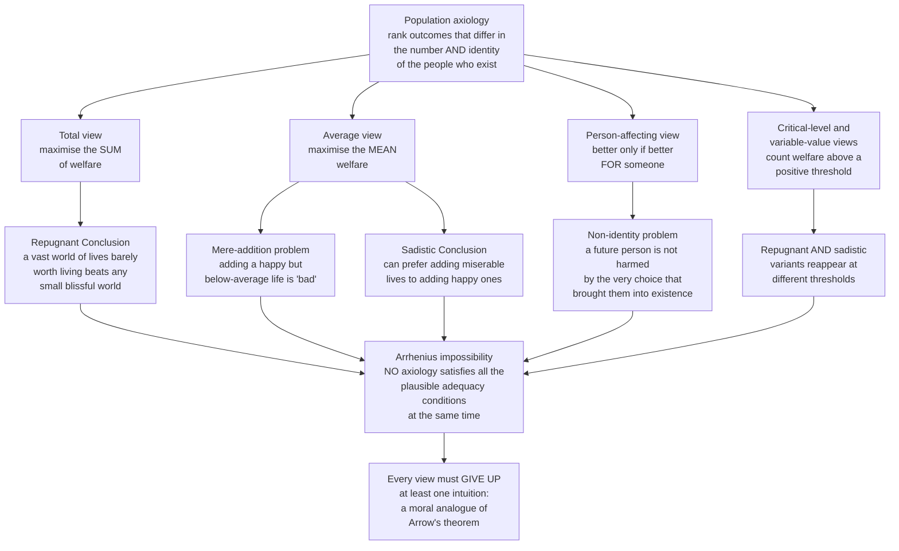

# 🌍 Population Ethics

> [!abstract] TL;DR
> **Population ethics** (or *population axiology*) asks how to rank outcomes that contain **different numbers and different identities of people** — the ethics not of how we treat existing people but of *which and how many people we bring into existence*. Founded by Derek Parfit in *Reasons and Persons* (1984), it is the moral foundation underneath climate policy, our duties to future generations, longtermism, global-priority setting, and every decision to have or not have a child. Its central scandal is that **no theory works.** The **Total view** (maximise summed welfare) implies Parfit's **Repugnant Conclusion**: for any world of very happy people, some enormous world of people whose lives are *barely worth living* is better. The **Average view** (maximise mean welfare) escapes that but implies adding a happy, below-average person is *bad*, plus the **Sadistic Conclusion**. **Person-affecting views** ("an outcome is only better if it's better *for someone*") founder on Parfit's **non-identity problem**. And **Arrhenius's impossibility theorems** prove this is not bad luck: *no* population axiology can satisfy a small set of extremely plausible conditions at once — a genuine moral analogue of **Arrow's theorem**. So every view must give something up; the field is the study of *what*. This note presents the arguments, not a verdict.

---

## Intuition

**Analogy — the festival organiser.** You run a summer music festival on a fixed field. You control one dial: **how many tickets to sell.** Sell only 10,000 and each guest has the night of their life — space to dance, short bar queues, crystal sound. Sell 500,000 and everyone still has a *good enough* time, worth the ticket, but crushed, hoarse, and squinting at a distant stage. Which festival is *better*?

Two answers both feel obviously right, and they contradict each other. "**More total joy!**" says one voice — half a million decent nights beats ten thousand great ones. "**But look how much better each person's night was in the small crowd**," says the other. The dial trades **how many** against **how good for each**, and your gut endorses *both* directions at once.

Now scale the field up to a planet and the tickets to *lives*. That is population ethics. The dials are **population size** and **quality of life**, they trade off against each other under finite resources, and — this is the deceptively simple question that breaks our moral intuitions — *is a world with more happy people better?* Every attempt to give a consistent answer forces you to accept something that feels monstrous. The discomfort you feel choosing a ticket count is, formally, the same discomfort that a theorem says cannot be escaped.

---

## How It Works

### Core mechanics

**1. What is being ranked.** Ordinary ethics compares outcomes for a *fixed* set of people ("is A or B better for these same folks?"). Population ethics compares outcomes where **the people themselves differ** — different sizes (10 billion vs 20 billion) and different *identities* (this child vs a different child conceived a month later). A **population axiology** is a rule that ranks all such outcomes. To even state it we assume each life has a **welfare level** on a scale with a **neutral "zero level"**: above zero the life is *worth living* (good for the person who lives it), below zero it is *worth not living* (a life of net suffering).

**2. The Total view and the Repugnant Conclusion.** The most natural extension of utilitarianism is **totalism**: an outcome's value is the **sum** of everyone's welfare. It is elegant, it treats extra happy lives as a genuine good, and it avoids the sadistic results below. But summation has a notorious consequence Parfit named the **Repugnant Conclusion**:

> For any possible population of, say, ten billion people all with wonderful lives, there is some much larger population whose members have lives that are *barely worth living*, and — other things equal — this larger population would be **better**.

Why it follows: total welfare is `size × quality`. Drop quality toward the zero level and you can always **compensate with sheer numbers** — a life at welfare 1 contributes 1 unit; enough such lives outweigh any fixed sum of blissful lives. Parfit found this repugnant yet spent years unable to escape it, because each individual step in the argument (the **Mere Addition Paradox**) looks innocuous.

**3. The Average view and its paradoxes.** To block the Repugnant Conclusion, **averagism** ranks outcomes by **mean** welfare instead of sum. It cleanly rejects the swarm of barely-worth-living lives (they drag the average down). But it buys that at a terrible price:

- **Mere addition is "bad."** Adding a new person whose life is happy and worth living — but *below the current average* — **lowers the mean**, so the average view calls it a change for the worse, even though a new person is glad to exist and *no one is made worse off*. (This is the exact opposite pathology to the total view.)
- **The Sadistic Conclusion** (Arrhenius): in some situations the average view (and critical-level views) implies it can be **better to add a few people with miserable, negative lives than to add a large number of people with positive, worth-living lives** — because a few small negatives dent the average less than a huge influx of merely-good lives. Preferring to *create suffering* over creating happiness is about as damning as an implication gets.
- **Non-separability / spooky sensitivities.** Because the mean depends on everyone, averagism makes the value of *your* birth depend on the welfare of **Egyptians in 2000 BC** or of people on the **other side of the galaxy**, and even on the welfare of **the dead**. Whether you should have a happy child can flip based on strangers you will never affect.

**4. Person-affecting views and the non-identity problem.** A different instinct rejects the whole "impersonal good" framing. **Person-affecting views** hold: *an outcome can only be better if it is better **for someone***. Jan Narveson's slogan captures it — **"we are in favour of making people happy, not in favour of making happy people."** On this view a merely *possible* person who never exists is not thereby wronged or deprived, because there is no one for the non-existence to be worse *for*.

The wrecking ball is Parfit's **non-identity problem**. Suppose a policy (deplete resources now; conceive later; choose embryo A over B) results in a future person with a hard-but-worth-living life. A *different* choice would have produced a **different person**, not a better-off version of *this* one. So the policy did not make **anyone** worse off than they would otherwise have been — the actual future person's only alternative was **non-existence**, which (their life being worth living) is not worse for them. The strict person-affecting view must therefore say we did **nothing wrong**, which clashes violently with the intuition that knowingly bringing about a foreseeably worse-off future is bad. (This puzzle is developed in [[Reproductive_Ethics]].)

**5. Compromise theories.** Two families try to thread the needle:

- **Critical-level views** (Blackorby, Bossert, Donaldson): a life adds value only if its welfare exceeds a *positive* **critical level**, not merely the zero level. High enough thresholds block the Repugnant Conclusion — but reintroduce the Sadistic Conclusion (lives between zero and the critical level count as *reducing* value despite being worth living to their subjects).
- **Variable-value views** (Hurka, Ng): extra lives are good but with **diminishing marginal value** as population grows. They soften the Repugnant Conclusion but violate other conditions and behave oddly at scale.

**6. The impossibility theorems — the deepest result in the field.** Gustaf **Arrhenius** proved a series of **impossibility theorems**: any population axiology that satisfies a handful of individually **very plausible adequacy conditions** — e.g. it avoids the Repugnant Conclusion, avoids the Sadistic Conclusion, respects a weak dominance/inequality condition, and is not partial to which particular people exist — is **outright inconsistent**. There is *no* such theory. This is the structural twin of **Arrow's Impossibility Theorem** in social choice (see [[Democracy_Types_and_Electoral_Systems]] and, for its mechanism-design descendant Gibbard–Satterthwaite, [[Revelation_Principle_and_IC]]): a small set of reasonable desiderata for aggregating value across people cannot be jointly satisfied. The upshot is bracing — the disagreements in population ethics are not a sign that we haven't found the right theory yet; a theorem says we **must** swallow at least one repugnant-feeling conclusion, and the honest work is choosing **which**.

**7. The Asymmetry.** Cutting across all of this is a widely shared intuition — the **Procreative Asymmetry** (Narveson; McMahan): we have a **strong** moral reason **not** to create a person who would be miserable, but **no** comparable reason **to** create a person who would be happy. Bringing suffering into the world counts against an act; declining to bring extra happiness into the world does not. The asymmetry feels obvious, yet no major axiology derives it cleanly — the total view denies its second half (extra happiness *is* a reason), and symmetric theories can't get the lopsidedness — making it one more constraint the theorems must reckon with.

### The impossibility landscape



---

## Key Concepts

### Secondary (foundational vocabulary)

- **Population axiology** — a rule for ranking outcomes that contain different numbers and identities of people.
- **Welfare and the zero level** — how good a life is for the one living it; *above zero* = worth living, *below zero* = a life of net suffering.
- **Total view** — value = the **sum** of everyone's welfare.
- **Average view** — value = the **average** welfare per person.
- **The Repugnant Conclusion** — a huge population of lives *barely worth living* can beat a small population of wonderful lives.
- **The Asymmetry** — strong reason not to create a miserable life; no matching reason to create a happy one.

### Undergraduate (the landmark moves)

- **Mere Addition Paradox (Parfit)** — the step-by-step argument from innocent-looking additions to the Repugnant Conclusion.
- **The Sadistic Conclusion (Arrhenius)** — the average/critical-level implication that adding suffering lives can beat adding (many) happy ones.
- **Non-identity problem (Parfit)** — you cannot make a future person *worse off* by a choice their very existence depended on; the alternative for *them* was non-existence.
- **Person-affecting principle** — "better only if better for someone"; Narveson's "make people happy, not happy people."
- **Critical-level utilitarianism** — welfare counts only above a positive threshold; blocks RC, reintroduces Sadistic-type results.
- **Variable-value view** — extra lives have diminishing marginal value as population grows.

### Graduate (theorems and structure)

- **Arrhenius's impossibility theorems** — no axiology jointly satisfies a small set of plausible adequacy conditions; the field's central formal result.
- **The Arrow / social-choice analogy** — impossibility of aggregating value across people, paralleling Arrow's theorem and its Gibbard–Satterthwaite descendant.
- **Separability vs holism** — totalism is *additively separable* (each life contributes independently); averagism and critical-level views are not, which is what generates the "spooky sensitivities" to distant and dead people.
- **The Repugnant Conclusion's near-inescapability** — results showing that *avoiding* RC forces you into equally counterintuitive territory (a "trilemma" among RC, the Sadistic Conclusion, and anti-egalitarian conclusions).
- **Neutrality intuition and the "existence value" question** — whether a good life added to the world is a genuine *impersonal* good or morally neutral.
- **Comparativism and the badness of non-existence** — can it be *worse for* a possible person never to exist? Most deny existence and non-existence are comparable *for* the possible person, which is exactly what powers the non-identity problem.

---

## Python Demo

Three panels make Parfit's Repugnant Conclusion and the Total-vs-Average split concrete. Welfare is on a scale where **0 = neutral** ("a life just barely not worth living") and **100 = a wonderful, flourishing life**. Requires only `numpy` and `matplotlib`.

```python
# Population ethics: visualising the Repugnant Conclusion and the
# Total-view vs Average-view tradeoff.  numpy + matplotlib only.
#
# Welfare scale: 0 = neutral zero level, positive = life worth living,
#                100 = a wonderful, flourishing life.

import numpy as np
import matplotlib.pyplot as plt

# ---------------------------------------------------------------------------
# WORLD A: small and blissful  (the benchmark we are told is "obviously best")
# ---------------------------------------------------------------------------
N_A, q_A = 10_000, 90.0            # ten thousand near-blissful lives
total_A  = N_A * q_A               # summed welfare of world A
avg_A    = q_A                     # average welfare of world A

# ---------------------------------------------------------------------------
# Panel A: the Repugnant Conclusion.
# For several "barely worth living" quality levels q_Z, plot TOTAL welfare
# (= N * q_Z) as the low-quality population N grows.  Each curve eventually
# crosses A's total -> a vast drab world beats the small blissful one.
# ---------------------------------------------------------------------------
N_grid = np.logspace(3, 8, 500)                 # populations from 1e3 to 1e8
low_qualities = [0.5, 1.0, 2.0, 5.0]            # lives just above the zero level

fig, ax = plt.subplots(1, 3, figsize=(16, 4.8))

for q_Z in low_qualities:
    total_Z = N_grid * q_Z
    ax[0].plot(N_grid, total_Z, lw=2, label=f"quality q = {q_Z}")
    N_cross = total_A / q_Z                      # N where Z's total overtakes A
    ax[0].scatter([N_cross], [total_A], zorder=5)

ax[0].axhline(total_A, color="black", ls="--", lw=1.5,
              label=f"World A total (10k @ 90 = {total_A:,.0f})")
ax[0].set_xscale("log"); ax[0].set_yscale("log")
ax[0].set_title("Panel A: Repugnant Conclusion\n(Total view: enough drab lives beat bliss)")
ax[0].set_xlabel("Population size N of barely-worth-living world")
ax[0].set_ylabel("TOTAL welfare  (N x quality)")
ax[0].legend(fontsize=8, loc="lower right")

# ---------------------------------------------------------------------------
# Panel B: Total and Average DIVERGE as a barely-worth-living world grows.
# Fix quality at q_Z = 1.  Total climbs without bound; average stays pinned
# at 1.  The two metrics rank the same growth in opposite ways.
# ---------------------------------------------------------------------------
q_Z = 1.0
total_Z = N_grid * q_Z
avg_Z   = np.full_like(N_grid, q_Z)

axB = ax[1]
l1, = axB.plot(N_grid, total_Z, color="#2563eb", lw=2, label="TOTAL welfare")
axB.axhline(total_A, color="#2563eb", ls="--", lw=1,
            label="World A total")
axB.set_xscale("log"); axB.set_yscale("log")
axB.set_xlabel("Population size N (quality fixed at 1)")
axB.set_ylabel("Total welfare", color="#2563eb")
axB.set_title("Panel B: Total rises, Average is flat\n(the two views pull apart)")

axB2 = axB.twinx()
l2, = axB2.plot(N_grid, avg_Z, color="#d97706", lw=2, label="AVERAGE welfare")
axB2.axhline(avg_A, color="#d97706", ls="--", lw=1, label="World A average (90)")
axB2.set_ylabel("Average welfare", color="#d97706")
axB2.set_ylim(0, 100)
axB.legend(handles=[l1, l2], fontsize=8, loc="center right")

# ---------------------------------------------------------------------------
# Panel C: the Mere-Addition paradox that damns the Average view.
# Start with 1000 people at welfare 100.  Add 1000 MORE happy people whose
# lives are worth living but BELOW the average (welfare 40).  Total rises,
# nobody is made worse off -- yet the average FALLS, so averagism calls it bad.
# ---------------------------------------------------------------------------
N1, q1        = 1000, 100.0
addN, addq    = 1000, 40.0           # extra lives: happy, worth living, below avg
total_before  = N1 * q1
avg_before    = q1
total_after   = N1 * q1 + addN * addq
avg_after     = total_after / (N1 + addN)

labels = ["World A\n(1000 @ 100)", "World A+B\n(+1000 @ 40)"]
x = np.arange(2)
axC = ax[2]
b1 = axC.bar(x - 0.2, [total_before, total_after], width=0.4,
             color="#2563eb", label="Total welfare")
axC.set_ylabel("Total welfare", color="#2563eb")
axC.set_ylim(0, 160_000)
axC2 = axC.twinx()
b2 = axC2.bar(x + 0.2, [avg_before, avg_after], width=0.4,
              color="#d97706", label="Average welfare")
axC2.set_ylabel("Average welfare", color="#d97706")
axC2.set_ylim(0, 110)
axC.set_xticks(x); axC.set_xticklabels(labels)
axC.set_title("Panel C: Mere Addition\n(Total UP, Average DOWN, no one harmed)")
axC.legend(handles=[b1, b2], fontsize=8, loc="upper left")

plt.tight_layout()
plt.savefig("population_ethics.png", dpi=120)
plt.show()

# --- Console summary ---------------------------------------------------------
print("REPUGNANT CONCLUSION (Total view)")
for q_Z in low_qualities:
    N_cross = total_A / q_Z
    print(f"  Lives at welfare {q_Z:>4}: once N > {N_cross:>12,.0f}, "
          f"this drab world's TOTAL welfare beats blissful World A.")

print("\nMERE ADDITION (Average view)")
print(f"  World A    : total = {total_before:>8,.0f}, average = {avg_before:6.1f}")
print(f"  World A+B  : total = {total_after:>8,.0f}, average = {avg_after:6.1f}")
print("  Total rose and no one was harmed, yet the AVERAGE fell:")
print("  -> the Average view must call adding 1000 happy people a CHANGE FOR THE WORSE.")
```

**What it shows.** Panel A: every barely-worth-living quality — even `0.5` out of 100 — eventually produces a **total** welfare exceeding the small blissful world; that crossover *is* the Repugnant Conclusion, and it is unavoidable for any additive theory. Panel B: as that drab world grows, **total** welfare climbs without limit while **average** welfare sits flat at 1 — the two views literally rank the same trend in opposite directions. Panel C: the Average view's revenge — bolting 1,000 extra *happy* people onto a world *raises the total, harms no one, and delights the new arrivals*, yet **lowers the average**, so averagism is forced to call it a change for the worse. Three defensible metrics, three intuition-violating verdicts: the code makes the impossibility tangible.

---

## Real-World Applications

- **Climate policy and discounting.** How much present cost is justified to protect future generations depends on how we value *the existence and welfare of people who don't yet exist*. Total-style views make extinction or a smaller future population a catastrophic loss of potential welfare; person-affecting views resist counting "lost possible people." The choice quietly drives the **social discount rate** and every long-horizon cost-benefit model.
- **Longtermism and existential risk.** The argument that reducing extinction risk is astronomically valuable rests squarely on a **total/aggregative** axiology: a flourishing future of vast numbers of people is an enormous good, so preventing its loss dominates. Reject totalism and the numbers deflate — population ethics is the crux of the whole longtermist case.
- **Global-priority setting and Effective Altruism.** Cause prioritisation (life-saving vs life-improving vs "creating" future lives, e.g. family-planning charities) depends on whether adding worth-living lives is a good, a neutral, or (via the average view) sometimes a harm. There is no neutral answer that ducks the axiology.
- **Optimal population and the antinatalism/pronatalism debate.** Is the morally best world larger or smaller than today's? **Pronatalists** lean total-view (more good lives = more good); **antinatalists** (e.g. Benatar's asymmetry-based argument) lean on the Asymmetry to claim coming into existence is a harm. Both are population-ethics positions, not mere policy preferences.
- **Procreative decisions.** "Should we have a(nother) child?" is population ethics in miniature — it changes *who and how many* exist, and runs straight into the non-identity problem the moment timing or genetics differ (see [[Reproductive_Ethics]]).
- **Pandemic, space settlement, and AI-future modelling.** Any framework that scores futures by expected numbers of worth-living lives — space-colonisation optimism, "value of the long-term future" estimates — is applying a population axiology whether or not it says so.

---

## Common Pitfalls

- **Treating "more happy people is obviously good" as safe.** It is the Total view, and it *entails* the Repugnant Conclusion. You cannot help yourself to the intuitive half without inheriting the swarm of barely-worth-living lives.
- **Thinking the Average view is the easy fix.** It escapes RC only by implying that adding a happy, below-average life is *bad*, by the Sadistic Conclusion, and by making your child's value depend on ancient Egyptians and distant galaxies. Averagism is not the safe harbour it looks like.
- **Confusing the zero level with the average.** "A life worth living" means welfare *above zero*, not *above the population mean*. The average view's paradox lives exactly in that gap — lives that are genuinely good yet below-average.
- **Non-identity confusion.** Claiming a policy "harmed a specific future person" when a different policy would have produced a *different* person. If their life is worth living, their only alternative was **non-existence**, which is not straightforwardly worse *for them*.
- **Assuming the impossibility is temporary.** The disagreement is not "we haven't found the right theory yet." Arrhenius's theorems prove *no* theory satisfies all the plausible conditions — the task is choosing which intuition to sacrifice, not holding out for a clean winner.
- **Smuggling in a person-affecting "no one is affected, so it's fine."** For creation decisions this proves too much: it would license knowingly bringing about a far worse future so long as *different* people populate it — the very result the non-identity problem exposes as unacceptable.
- **Ignoring the Asymmetry's awkwardness.** It feels obvious that miserable lives count against an act while forgone happy lives don't — but no major axiology derives it, so invoking it is taking a side, not stating a neutral fact.

---

## Related Concepts

- [[Reproductive_Ethics]] — the individual-scale face of population ethics; home of the non-identity problem, procreative beneficence, and the ethics of *which* child to create.
- [[Ethical_Frameworks_in_Practice]] — the aggregation machinery (summing welfare) and the *separateness of persons* critique that the Total view runs into; population ethics is aggregation pushed to varying population sizes.
- [[Moral_Status_and_the_Moral_Circle]] — the prior question of whether *merely possible* people have any moral claim at all, which person-affecting views answer "no."
- [[Consequentialism_and_Utilitarianism]] — the Total view is classical utilitarian aggregation extended across populations; population ethics is where utilitarianism's most unstable implication surfaces.
- [[Justice_and_Rawls]] — the *separateness of persons* and contractualist worry that summing welfare across distinct people, and across people who may never exist, misdescribes what we owe each other.
- [[Democracy_Types_and_Electoral_Systems]] — Arrow's Impossibility Theorem for aggregating individual preferences; the direct social-choice analogue of Arrhenius's impossibility for aggregating welfare across populations.
- [[Revelation_Principle_and_IC]] — Arrow → Gibbard–Satterthwaite, the mechanism-design impossibility results; the same "no rule satisfies all reasonable axioms" structure that recurs in population axiology.

---

## Review Questions

**Secondary**
1. Explain the difference between the **Total view** and the **Average view** of population value, and state the single most famous objection to each in one sentence.
2. What does it mean for a life to be "barely worth living," and why is *that* threshold — rather than being above the population average — the one that matters for whether a life adds positive value?

**Undergraduate**
3. Reconstruct the **Mere Addition Paradox**: start from a small blissful world and take the innocuous-looking steps that lead to the Repugnant Conclusion. At which step, if any, would you get off the train, and what does refusing that step cost you?
4. State Narveson's slogan "make people happy, not happy people," then explain how the **non-identity problem** threatens the person-affecting view that motivates it. Use a concrete case (embryo selection or delayed conception).

**Graduate**
5. Arrhenius's impossibility theorems are described as a "moral analogue of Arrow's theorem." Lay out the structural parallel precisely: what plays the role of *voters*, of *alternatives*, of the *axioms*, and of the *impossibility*? What does the analogy suggest about the *right response* — is there one?
6. Longtermism's practical conclusions lean heavily on a Total/aggregative axiology. Construct the strongest case that the value of the long-term future **survives** switching to a plausible non-total view, then the strongest case that it **collapses**. Which is more persuasive, and what does that tell you about how load-bearing population ethics is for global-priority claims?

---

## Sources

- Parfit, D. (1984). *Reasons and Persons*, Part Four. Oxford University Press. (Coins the Repugnant Conclusion, the Mere Addition Paradox, and the non-identity problem.)
- Arrhenius, G. (forthcoming). *Population Ethics: The Challenge of Future Generations*. Oxford University Press. (The impossibility theorems and the Sadistic Conclusion.)
- Greaves, H. (2017). "Population Axiology." *Philosophy Compass*, 12(11). (A rigorous modern survey of the views and their problems.)
- Zuber, S., Arrhenius, G., Ryberg, J., & Tännsjö, T. ["The Repugnant Conclusion,"](https://plato.stanford.edu/entries/repugnant-conclusion/) *Stanford Encyclopedia of Philosophy*. (Authoritative overview with the formal statement.)
- Roberts, M. A. ["The Nonidentity Problem,"](https://plato.stanford.edu/entries/nonidentity-problem/) *Stanford Encyclopedia of Philosophy*; and Broome, J. (2004). *Weighing Lives*. Oxford University Press. (The neutrality intuition and the badness of non-existence.)

---

#ethics #population-ethics #repugnant-conclusion #parfit #utilitarianism
