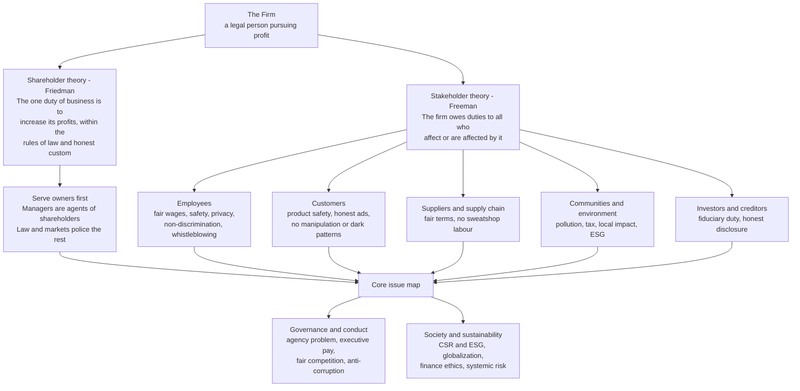

# 💼 Business Ethics

> [!abstract] TL;DR
> **Business ethics** is applied ethics for commercial life: it asks what a firm — and the people inside it — may and must do while pursuing profit. Its foundational fault line is the clash between **shareholder theory** (Milton Friedman: "the social responsibility of business is to increase its profits," *within the rules of the game* — no fraud, no deception) and **stakeholder theory** (R. Edward Freeman: a firm owes duties to *everyone who affects or is affected by it* — employees, customers, suppliers, communities, the environment — not owners alone). Around that axis cluster the field's live problems: **corporate social responsibility (CSR) and ESG** and whether they are value-creating or greenwashing cover; the **agency problem** and executive conduct; employee, consumer, competition, supply-chain, and finance ethics; and the deep question of whether a **corporation can even be a moral agent**. The recurring insight — made concrete in the demo below — is that ethics, law, and profit are not always in tension: reputation and trust can make *doing right* the long-run value-maximizing move, even when it costs short-run profit.

---

## Intuition

**Analogy:** Picture a factory on the edge of a town. Ask a simple question: *what is this factory?* One answer says it is a **money-making machine** owned by its investors — a device whose only job is to turn inputs into the largest possible return for the people who put up the capital, exactly as a vending machine's only job is to dispense a can when you feed it coins. On this view, the machine has no more moral life than the vending machine; it just runs, and the people who own it may spend the proceeds on charity if *they* wish. The other answer says the factory is a **member of the community** — it breathes the town's air, drinks its water, employs its neighbours, sells to its families, and leans on roads and schools it did not build. A member of a community is not merely a machine; a member has *duties*.

That is the whole subject in one image. If a firm is just a machine, its ethics collapses into "make money legally." If a firm is a member of society, then it inherits the obligations of membership — to workers, buyers, suppliers, and the commons — that no contract fully spells out. Business ethics is the discipline of holding those two pictures up against real decisions and working out where each one is right.

---

## How It Works

Business ethics is not a separate morality with its own commandments; it is the **ordinary ethical frameworks applied under commercial conditions** — scarcity, competition, principal-agent gaps, and legal personhood. Four moves organize the field.

**1. Fix the theory of the firm's purpose.** Everything downstream depends on *whom the firm is for*.

- **Shareholder theory (Friedman, 1970).** In a famous *New York Times Magazine* essay, Friedman argued that a corporate executive is an **employee of the owners**, with a direct responsibility to conduct the business as they wish — "which generally will be to make as much money as possible **while conforming to the basic rules of society**, both those embodied in law and those embodied in ethical custom." Spending shareholders' money on "social responsibility" is, he said, spending *other people's money* on the manager's own preferred causes — a form of taxation without representation. Crucially, Friedman's position is *not* "anything for a profit": it is profit **within a framework of law and honest dealing** — "without deception or fraud." Read carefully, it is a constrained-maximization claim, not a licence for predation.
- **Stakeholder theory (Freeman, 1984).** Freeman answered that the firm sits at the centre of a web of **stakeholders** — "any group or individual who can affect or is affected by the achievement of the organization's objectives": employees, customers, suppliers, financiers, communities, and (later) the natural environment. Managers are trustees balancing these claims, not agents of shareholders alone. Freeman's deeper charge is the **separation thesis** — the false idea that business decisions and ethical decisions are two separate boxes ("it's not personal, it's business"). His whole program is to *re-integrate* them.

**2. Locate CSR and ESG on that axis.** **Corporate Social Responsibility** is the umbrella for voluntary duties beyond the legal minimum; **ESG** (Environmental, Social, Governance) is its investor-facing, metricized cousin. There are two distinct arguments for it, and they must not be confused:
- the **business case** — CSR/ESG pays: it wins customers, retains talent, lowers cost of capital and regulatory/litigation risk, and secures a "license to operate";
- the **ethical case** — the firm *ought* to do it because of duties to stakeholders and the commons, whether or not it pays.
When only the business case holds, CSR is contingent on profitability; when the two cases diverge, you find the genuine moral demand. **Greenwashing** — marketing sustainability the firm does not practise — is the pathology that appears when firms want the *reputation* of the ethical case while doing only what the business case funds.

**3. Ask whether the corporation is a moral agent at all.** A corporation is a **legal person** (see [[Commercial_and_Corporate_Law]] and [[Rights_Duties_and_Legal_Concepts]]) — but is it a *moral* person that can be praised, blamed, and held responsible? Peter French argued yes: a firm has a **Corporate Internal Decision (CID) structure** — policies and procedures that convert individual acts into genuinely *corporate* intentions, so the company can be an intentional agent in its own right. Skeptics (e.g., Velasquez) reply that only the humans inside act; "corporate responsibility" is shorthand that can let individuals hide behind the veil. The stakes are practical: whom do you punish when a firm poisons a river — the entity, the executives, or both?

**4. Run the concrete issues through the frameworks.** The recurring toolkit is [[Ethical_Frameworks_in_Practice]]: **consequentialist** cost-benefit (does the policy maximize net welfare?), **rights-based/deontological** side-constraints (are workers or customers treated as mere means?), **virtue/integrity** (what would an honest firm and honest manager do?), and the **social contract of business** (Donaldson: business operates under an implied contract with society that grants it legitimacy in exchange for benefits and constraints).

### Flow / Architecture



---

## Key Concepts

### Secondary — the core tension
- **Two pictures of the firm.** Money-making machine for its owners, or member of society with duties? Almost every business-ethics dispute is a version of this.
- **Profit is not the enemy of ethics.** Even Friedman insisted profit must be pursued "without deception or fraud" and within the rules — lying, cheating, and harming are ruled out from the start.
- **CSR in one line.** Doing more good, or less harm, than the law strictly requires — recycling, fair wages, safe products, honest ads.
- **Greenwashing.** Advertising virtue you do not actually practise — the marketing of ethics as a substitute for the ethics.

### Undergraduate — the working distinctions
- **Shareholder theory, precisely stated.** Managers are agents of owners; their fiduciary job is to maximize shareholder value *subject to* law and ethical custom. The efficiency argument: markets and law already channel self-interest toward the social good, so firms serve society best by doing what they do well — legally.
- **Stakeholder theory, precisely stated.** The firm is a nexus of stakeholder relationships; management's job is to create value *for* stakeholders and balance their claims. It rejects the **separation thesis** that "business" and "ethics" are separate domains.
- **The business case vs the ethical case for CSR.** Whether CSR "pays" is an empirical question; whether it is *owed* is a moral one. Conflating them lets firms drop ethics the moment it stops paying.
- **The agency problem.** Owners (principals) hire managers (agents) whose interests diverge — the same **principal-agent** and [[Moral_Hazard]] structure economics studies. Business-ethics manifestations: **short-termism**, self-dealing, and **executive compensation** that rewards quarterly earnings over durable value.
- **The core issue areas.** *Employee ethics* — fair wages, workplace safety, non-discrimination, privacy/surveillance, and **whistleblowing** and its legal protection. *Consumer ethics* — product safety, honest advertising, and the ethics of **manipulation and dark patterns**. *Competition ethics* — antitrust, collusion, price-fixing (see [[Monopoly]]). *Corruption* — bribery and the **U.S. Foreign Corrupt Practices Act (FCPA)**. *Supply-chain ethics* — sweatshops, forced labour, and the exploitation debate. *Finance ethics* — fiduciary duty and conflicts of interest.
- **Codes of ethics.** Firms codify values into conduct codes — useful as coordination and signalling devices, but limited: they can become compliance theatre, cover for "check-the-box" ethics, or PR, if not backed by culture and consequences.

### Graduate — the contested frontier
- **Normative vs instrumental vs descriptive stakeholder theory (Donaldson & Preston, 1995).** Three logically distinct claims often blurred: firms *do* have stakeholders (descriptive), attending to them *improves performance* (instrumental — the business case), and they *ought* to be respected as ends (normative — the ethical case). The normative core is what makes it *ethics* rather than management strategy.
- **Integrative Social Contracts Theory (Donaldson & Dunfee, 1999).** A "macro" hypothetical social contract sets universal moral limits (**hypernorms**), inside which local business communities generate legitimate "micro" norms — a framework for judging, e.g., whether a wage that is exploitative by home-country standards is permissible in a poorer host economy.
- **Corporate moral agency.** French's **CID structure** view vs the reductionist view that only individuals act. Bears directly on **corporate criminal liability**, the moral point of fines vs personal prosecution, and whether firms can bear *blame* and not merely *cost*.
- **The exploitation debate in global supply chains.** Are sweatshops a wrong to be abolished or a rung on a ladder out of poverty? Consequentialist "least-bad option" defences collide with rights-based **non-exploitation** and fair-terms arguments — the ethical face of [[Globalization_and_Its_Discontents]].
- **Ethical lessons of the 2008 crisis.** Misaligned incentives, securitization that severed origination from risk-bearing, credit-rating conflicts of interest, and "too big to fail" **systemic risk** turned private profit into socialized loss — a case study in fiduciary failure and moral hazard at scale (see [[Market_Anomalies_and_Bubbles]]).
- **The ESG measurement problem.** ESG collapses environmental, social, and governance performance into scores that are inconsistent across raters, gameable, and prone to greenwashing — a live problem in translating an ethical demand into an auditable metric. Environmental harms are the classic **externality** the price system misses (see [[Externalities_and_Pigouvian_Tax]]).
- **Ethics, law, and profit.** Law is a *floor*, not a ceiling; some legal acts are unethical and some ethical demands are un-legislatable. The mature view treats profit as a *constraint and enabler* of an ethical firm, not its sole telos.

---

## Python Demo

We model the shareholder-vs-stakeholder tradeoff as a single managerial choice: a **responsibility level** `r` in `[0, 1]` — how much of the firm's capacity it devotes to safety, environment, and fair wages. Higher `r` **cuts today's margin** (a real cost), but it **builds trust and reputation** that raise long-run revenue and *lower the firm's risk premium / cost of capital*. Short-run profit falls monotonically in `r`; long-run firm value is **hump-shaped**. The demo finds where long-run value peaks, showing that some CSR is genuinely value-creating — but that beyond a point the tradeoff is real and more responsibility destroys value.

```python
# Business ethics as constrained value maximization: shareholder short-run
# profit vs stakeholder-driven long-run firm value. numpy + matplotlib only.
import numpy as np
import matplotlib.pyplot as plt

# --- The choice variable -----------------------------------------------------
r = np.linspace(0.0, 1.0, 401)      # responsibility level: safety/env/fair wages

# --- Parameters (a stylized firm) --------------------------------------------
REV0    = 100.0    # baseline annual revenue
m0      = 0.30     # baseline operating margin (30%)
cost    = 0.20     # margin lost per unit responsibility -> margin(1) = 0.10
g       = 0.60     # max long-run revenue uplift from full trust (+60%)
a       = 3.0      # how fast trust saturates in r
d0      = 0.12     # base discount rate / cost of capital (12%)
risk_dn = 0.05     # reputation lowers the discount rate by up to 5 pts

# --- Mechanics ---------------------------------------------------------------
margin = m0 - cost * r                       # responsibility costs margin NOW
trust  = 1.0 - np.exp(-a * r)                # reputation, with diminishing returns

# SHORT-RUN profit: trust hasn't been built yet, so no revenue uplift -> pure cost
short_run = REV0 * margin                    # strictly DECREASING in r

# LONG-RUN value: trust lifts revenue AND lowers the discount rate (lower risk),
# valued as a no-growth perpetuity  V = sustainable_earnings / discount_rate
rev_mult   = 1.0 + g * trust                 # customers, talent, license to operate
lr_earn    = REV0 * rev_mult * margin        # sustainable annual earnings
disc       = d0 - risk_dn * trust            # reputation shrinks the risk premium
long_run   = lr_earn / disc                  # present value of the firm

# --- The two optima ----------------------------------------------------------
i_sr = int(np.argmax(short_run))             # short-run maximizer -> r = 0
i_lr = int(np.argmax(long_run))              # long-run value maximizer -> interior
r_lr = r[i_lr]

print(f"Short-run profit is maximized at r = {r[i_sr]:.2f} "
      f"(profit = {short_run[i_sr]:.1f}, firm value there = {long_run[i_sr]:.0f})")
print(f"Long-run VALUE is maximized at r = {r_lr:.2f} "
      f"(firm value = {long_run[i_lr]:.0f}, short-run profit sacrificed "
      f"= {short_run[i_sr] - short_run[i_lr]:.1f})")
print(f"Pushing to full CSR r = 1.00 gives firm value = {long_run[-1]:.0f} "
      f"-> beyond the optimum, responsibility DESTROYS value (real tradeoff).")

# --- Plot --------------------------------------------------------------------
fig, (axL, axR) = plt.subplots(1, 2, figsize=(12, 4.8))

axL.plot(r, short_run, color="#d97706", lw=2.2, label="Short-run profit")
axL.axvline(r[i_sr], color="#d97706", ls="--", alpha=0.7)
axL.set_xlabel("Responsibility level  r"); axL.set_ylabel("Short-run profit")
axL.set_title("Shareholder / short-termist view\nresponsibility is pure cost")
axL.annotate("manager paid on\nquarterly profit\npicks r = 0",
             xy=(0.02, short_run[i_sr]), xytext=(0.28, short_run[i_sr]-3),
             arrowprops=dict(arrowstyle="->"))
axL.legend(loc="upper right")

axR.plot(r, long_run, color="#2563eb", lw=2.4, label="Long-run firm value")
axR.axvline(r_lr, color="#2563eb", ls="--", alpha=0.8)
axR.scatter([r_lr], [long_run[i_lr]], color="#2563eb", zorder=5)
axR.scatter([0.0], [long_run[i_sr]], color="#d97706", zorder=5)
axR.set_xlabel("Responsibility level  r"); axR.set_ylabel("Long-run firm value")
axR.set_title("Stakeholder / long-run owner view\ntrust makes CSR value-creating")
axR.annotate(f"value-max\nr* = {r_lr:.2f}",
             xy=(r_lr, long_run[i_lr]), xytext=(r_lr+0.08, long_run[i_lr]-40),
             arrowprops=dict(arrowstyle="->"))
axR.annotate("r = 0\n(short-termist)",
             xy=(0.0, long_run[i_sr]), xytext=(0.10, long_run[i_sr]-55),
             arrowprops=dict(arrowstyle="->"))
axR.legend(loc="lower center")

plt.tight_layout()
plt.savefig("business_ethics_tradeoff.png", dpi=120)
plt.show()
```

**What it shows.** The left panel is Friedman's short-termist world: responsibility is *cost*, and a manager paid on this quarter's profit rationally picks `r = 0`. The right panel adds what that manager's incentive ignores — **reputation and trust**, which lift long-run revenue and cut the risk premium. Long-run firm value peaks at an **interior optimum** `r* ≈ 0.40`: sacrificing about 8 units of short-run profit *raises* the firm's value from ~250 to ~367. So the stakeholder-minded firm and the *long-run* shareholder want the *same thing* — the "business case" and much of the "ethical case" coincide because trust is an asset. But the story is not "more CSR is always better": push to `r = 1` and value falls *below* the `r = 0` level. The genuine tradeoff survives at the extremes. And the gap between what the short-run-paid manager chooses and what the owner's long-run value wants is exactly the **principal-agent** problem (see [[Moral_Hazard]]): reputation only disciplines the firm if governance rewards it on the long horizon, not the next earnings call.

---

## Real-World Applications

- **Purpose-of-the-corporation statements.** In 2019 the U.S. **Business Roundtable** redefined corporate purpose from shareholder primacy to serving "all stakeholders" — a real-world swing of the Friedman/Freeman pendulum, and a magnet for the greenwashing critique.
- **Whistleblower regimes.** Sarbanes-Oxley and Dodd-Frank protections (and the SEC bounty program) operationalize the ethics of whistleblowing — the case where loyalty to the firm and duty to the public collide.
- **Anti-bribery enforcement.** The **FCPA** and the UK Bribery Act turn the ethics of corruption into hard law, criminalizing foreign bribery and forcing multinationals to build compliance programs.
- **Supply-chain codes and audits.** After disasters like Rana Plaza (2013), apparel and electronics firms adopted supplier codes and third-party audits — the practical, imperfect answer to the sweatshop debate.
- **ESG investing and ratings.** Trillions in assets now screen on ESG scores; the inconsistency and gameability of those scores is a leading applied controversy in finance ethics.
- **Consumer-protection and "dark pattern" rules.** Regulators (FTC, EU DSA) increasingly police manipulative interface design — advertising and consent flows engineered to exploit cognitive weaknesses.
- **The 2008 financial crisis post-mortems.** Fiduciary breaches, conflicted credit ratings, and mis-sold products became the canonical teaching case for finance ethics and systemic moral hazard.

---

## Common Pitfalls

- **Misreading Friedman as "profit at any cost."** His thesis is *constrained* maximization — legal and honest. Quoting the headline while dropping "without deception or fraud" and "the rules of the game" caricatures the strongest shareholder argument.
- **Conflating the business case with the ethical case.** "CSR pays" and "CSR is owed" are different claims. If a firm justifies ethics *only* by profit, it has promised to abandon ethics the moment it stops paying — and revealed it never held the ethical case at all.
- **Greenwashing as strategy.** Buying the reputation of virtue without the substance. It works until the gap is exposed — at which point the reputational asset the demo relied on inverts into a liability.
- **Treating "the corporation" as a moral shield.** Attributing wrongdoing to a faceless "company" so no individual is accountable. Corporate and personal responsibility are not substitutes; serious failures usually require both.
- **Codes-of-ethics theater.** A polished code with no culture, incentives, or enforcement behind it changes nothing — and can worsen things by signalling virtue the firm does not practise.
- **Ignoring the agency/time-horizon gap.** Reputation only makes ethics pay if governance rewards managers on the long horizon. Compensation tied to quarterly metrics manufactures the very short-termism that destroys long-run value.
- **Assuming law exhausts ethics.** "It's legal" is a floor, not a verdict. Regulatory arbitrage, tax gaming, and manipulative-but-lawful design are the domain where business ethics does its real work.

---

## Related Concepts

- [[Ethical_Frameworks_in_Practice]] — the consequentialist, deontological, virtue, and social-contract lenses that business ethics applies to commercial cases.
- [[Commercial_and_Corporate_Law]] — legal personhood, limited liability, fiduciary duty, and the agency problem that business ethics wrestles with in moral terms.
- [[Rights_Duties_and_Legal_Concepts]] — the legal-personhood machinery behind the "can a corporation be responsible?" debate.
- [[Moral_Hazard]] — the principal-agent / hidden-action structure underlying executive short-termism, self-dealing, and the 2008 incentive failures.
- [[Asymmetric_Information]] — the information gap between managers and owners, and between firms and consumers, that grounds disclosure and honesty duties.
- [[Monopoly]] — the market-power backdrop to competition ethics, antitrust, and collusion.
- [[Externalities_and_Pigouvian_Tax]] — pollution and social costs the price system misses, the economic core of the environmental "E" in ESG.
- [[Market_Anomalies_and_Bubbles]] — bubbles and crises, including 2008, that supply finance ethics its hardest cases.
- [[Globalization_and_Its_Discontents]] — the political-economy setting for the sweatshop and supply-chain exploitation debate.
- [[Privacy_Surveillance_and_Data_Ethics]] — consumer and employee privacy, data exploitation, and manipulative design as concrete business-ethics issues.

---

## Review Questions

1. **(Comprehension)** State Friedman's shareholder thesis in full, including its two qualifying clauses, and explain why "profit at any cost" is a misreading. Then state Freeman's stakeholder alternative and his objection to the "separation thesis."
2. **(Application)** In the Python demo, a manager is paid a bonus on this year's operating profit. Which responsibility level `r` will she choose, and which will the firm's long-run owners want? Name the economic problem this gap illustrates and describe one governance change that would close it.
3. **(Synthesis / evaluation)** A clothing brand can either (a) keep sourcing from a low-wage overseas supplier whose wages are exploitative by home-country standards but above the local norm and lift workers out of subsistence, or (b) exit and source domestically. Analyze the choice through the *instrumental* vs *normative* readings of stakeholder theory and through Integrative Social Contracts Theory's hypernorms, and explain why "it's legal and it's profitable" does not settle the question.

---

## Sources

- Friedman, M. (1970). "The Social Responsibility of Business Is to Increase Its Profits." *The New York Times Magazine*, Sept. 13. (The canonical shareholder-theory statement, qualifiers included.)
- Freeman, R. E. (1984). *Strategic Management: A Stakeholder Approach*. Pitman/Cambridge University Press. (The founding text of stakeholder theory.)
- Donaldson, T., & Preston, L. E. (1995). "The Stakeholder Theory of the Corporation: Concepts, Evidence, and Implications." *Academy of Management Review*, 20(1), 65–91. (The descriptive/instrumental/normative distinction.)
- Donaldson, T., & Dunfee, T. W. (1999). *Ties That Bind: A Social Contracts Approach to Business Ethics*. Harvard Business School Press. (Integrative Social Contracts Theory and hypernorms.)
- French, P. A. (1979). "The Corporation as a Moral Person." *American Philosophical Quarterly*, 16(3), 207–215. (The CID-structure argument for corporate moral agency.)
- Carroll, A. B. (1991). "The Pyramid of Corporate Social Responsibility." *Business Horizons*, 34(4), 39–48. (Economic, legal, ethical, and philanthropic layers of CSR.)

---

#ethics #business-ethics #csr #stakeholder-theory #corporate-responsibility
