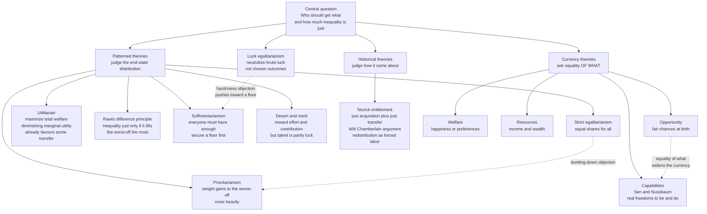

# ⚖️ Distributive Justice and Inequality

> [!abstract] TL;DR
> **Distributive justice** asks the most concrete question in political philosophy: *who should get what, and how much inequality is fair?* Society is a cooperative venture that produces a surplus — income, wealth, opportunity, rights, health — and every arrangement for splitting it favours someone. The rival answers form a map. **Strict egalitarians** want equal shares. **Utilitarians** maximize total welfare, and because the marginal utility of a dollar *falls* as you get richer, even utilitarianism already builds in a case for transferring from rich to poor. **Rawls's** justice as fairness permits inequality *only* when it lifts the worst-off the most — the **difference principle**. **Nozick's** libertarian entitlement theory rejects all such "patterns": a distribution is just if it arose from just acquisition and free transfer, so redistribution is coercion, dramatized by the **Wilt Chamberlain** argument. Between the poles sit **luck egalitarianism** (neutralize *brute* luck but not *choice*), **sufficientarianism** (everyone must have *enough*), **prioritarianism** (weight gains to the worse-off), and **desert** theories (reward contribution — but how much of your talent is luck?). **Sen and Nussbaum's capability approach** reframes the whole debate: justice is about real *freedoms to be and do*, not income alone. This is the *applied* companion to the theory in [[Justice_and_Rawls]] — here we do the measuring (Gini, Lorenz), the policy (taxation, welfare, affirmative action, reparations), and the arithmetic that shows the "best" redistribution genuinely *differs by principle*.

---

## Intuition

**Analogy — cutting the pie.** A group cooks a pie together. Some kneaded, some fetched firewood, one owns the oven, one is a child who could not lift a spoon, and one arrived late by pure luck of the road. Now the pie must be cut. Equal slices for everyone? Bigger slices for those who did more? A guaranteed minimum slice so no one goes hungry, then bigger rewards above that floor? Whatever survived the baking gets divided *however the group's rules allow* — including "whoever's hands it ended up in keeps it"? Every rule is a full theory of justice in disguise, and each wrongs *different* people for *different* reasons.

The knife makes the tension vivid. Cut perfectly equal slices and the person who did all the kneading feels robbed; let the baker take nearly all of it and the child starves. The real question is never "equal or unequal?" but **which inequalities, if any, a fair-minded group could defend to the very person who ends up with the smallest slice** — especially when a slightly *unequal* cut can somehow make even the smallest slice *bigger* than a perfectly equal one would (a reward that motivates more baking for all). That single move — an inequality that helps the worst-off — is the hinge on which the whole field turns.

---

## How It Works

### Core mechanics

Distributive justice has three moving parts, and most disagreement is really disagreement about one of them:

1. **The currency (equality *of what?*).** What is the thing we care about distributing? Candidates: **welfare** (happiness / preference-satisfaction), **resources** (income and wealth), **opportunity** (fair chances regardless of birth), and **capabilities** (real freedoms to achieve valuable states — being nourished, educated, able to appear in public without shame). Choosing the currency largely settles the debate before it starts.
2. **The pattern (*how much* inequality is permissible?).** Given a currency, what shape should the distribution take? Strict equality, a maximized floor, a guaranteed minimum, a weighted priority to the worst-off, or reward-by-contribution.
3. **The scope of responsibility (*luck vs choice*).** Should the distribution correct for disadvantages people did not choose (being born poor, disabled, untalented) while holding them responsible for disadvantages they *did* choose (gambling their savings)? This is the luck-egalitarian cut.

**The utilitarian starting point, and why it already leans egalitarian.** Utilitarianism says: maximize the *sum* of welfare. If a dollar produced the same happiness for everyone, distribution would not matter — only the total would. But the **marginal utility of income diminishes**: the thousandth dollar means far less to a billionaire than to someone who cannot eat. Move a dollar from rich to poor and the poor person's gain *exceeds* the rich person's loss, so the total *rises*. Pure utilitarianism with concave utility therefore recommends **complete equality** of a fixed pie — its famous limit. What stops it in practice is that redistribution shrinks the pie (incentive and administrative losses — Okun's "leaky bucket"), which pulls the utilitarian optimum back to an interior point. The Python demo makes exactly this trade visible.

**Rawls's correction.** Rawls rejects utilitarianism because summing welfare "does not take seriously the distinction between persons" — it can sacrifice a minority for a larger total. Behind the **veil of ignorance** in the **original position**, not knowing whether you will be rich or poor, you reason by **maximin**: make the *worst* position as good as possible. Out come two principles, in strict priority — (1) equal basic liberties, then (2) fair equality of opportunity *and* the **difference principle**: inequalities are just *only if* they maximize the expectations of the least advantaged. Inequality is not banned; it is *conditional*. (Full derivation in [[Justice_and_Rawls]].)

**Nozick's rejection of the whole frame.** Robert Nozick answers that justice is **historical, not patterned**. His **entitlement theory** has three rules: just **acquisition** of unheld things, just **transfer** by consent, and **rectification** of past injustice. Any distribution reached by these steps is just, *whatever its shape*. The **Wilt Chamberlain argument**: start from your favourite equal distribution D1; let a million fans each freely pay a star 25 cents to watch him play; you reach an unequal D2 — yet every step was voluntary, so if D1 was just, D2 is too. Maintaining any *pattern* therefore requires "continuous interference with people's lives," and redistributive taxation of earnings is, provocatively, "on a par with **forced labor**." (See [[Liberty_and_Rights]].)

**The theories that live in between.**
- **Luck egalitarianism** (Dworkin, Cohen, Arneson): neutralize the effects of **brute luck** (the natural and social lottery) but let people bear the results of genuine **choice**. Its problem is the **harshness objection** — it would deny aid to the reckless uninsured motorcyclist, which most of us reject.
- **Sufficientarianism** (Frankfurt): what matters morally is not that people are *equal* but that everyone has **enough**. Above the threshold, inequality is nobody's business. The hard question: *where* is the line, and why there?
- **Prioritarianism** (Parfit): benefits matter *more* the worse-off the recipient is — but we value the *benefit*, not equality itself. This dodges the **leveling-down objection** (equalizing by making the rich worse off with no gain to anyone improves nothing).
- **Desert and merit**: people deserve their market rewards because they earned them. But how much of your "earning power" is *talent you happened to be born with* and a *demand curve you did not create*? If talent is luck, desert claims wobble.
- **Capability approach** (Sen, Nussbaum): the right currency is neither resources nor welfare but **capabilities** — the real, effective freedoms a person has. A wheelchair user needs *more* resources to reach the same freedom of movement, so equal resources are not equal justice. This reframes poverty as **capability deprivation**, not just low income.

### Mapping the theories



---

## Key Concepts

### Secondary (intuitive, no jargon)
- **Benefits and burdens.** Society hands out good things (income, education, safety, respect) *and* bad ones (taxes, hazardous work, risk). Justice is about how *both* are shared, not just the good stuff.
- **Equality of opportunity vs equality of outcome.** "Everyone starts the race from the same line" is opportunity; "everyone finishes together" is outcome. Almost no one wants pure outcome equality; the fight is over how *unequal* the starting lines are allowed to be.
- **The floor and the ceiling.** Some theories care mainly about lifting a **floor** (nobody destitute); others worry about a runaway **ceiling** (extreme wealth buying political power). They can pull in different directions.
- **Is unequal ever fair?** Yes — if the inequality *earns its keep*. A surgeon paid more so that more people become surgeons can leave everyone, including the worst-off, better than forced equality would.

### Undergraduate (the frameworks and metrics)
- **The difference principle.** Inequalities are just only if they maximize the position of the least-advantaged group. Not "no inequality," but "no *pointless* or *predatory* inequality."
- **Diminishing marginal utility and the utilitarian case for transfer.** Because each extra dollar buys less happiness the richer you are, moving income down the distribution raises total welfare — the mathematical seed of redistribution inside a theory that never mentions equality.
- **Gini coefficient and the Lorenz curve.** The **Lorenz curve** plots the cumulative share of income held by the poorest x share of people; perfect equality is the 45-degree line. The **Gini coefficient** is the area between that line and the Lorenz curve, doubled — 0 is total equality, 1 is one person holding everything. Poverty lines add an *absolute* floor the Gini ignores.
- **Patterned vs historical justice.** Rawls, egalitarians, and utilitarians judge the *shape* of the outcome; Nozick judges the *process* that produced it. This is the deepest fault line in the field.
- **Sufficiency, priority, equality — three distinct claims.** They often recommend the same policy but for different reasons, and they *come apart* in hard cases (leveling down, thresholds, the very rich).

### Graduate (the live controversies)
- **Equality of what? (Sen's question).** Rawls's "primary goods" (rights, income, the bases of self-respect) are means; Sen objects that people vary in how efficiently they *convert* means into freedoms (the disabled, the ill, the pregnant), so justice must track **capabilities**, not resource bundles. Nussbaum defends a specific list of central capabilities as a partial theory of justice.
- **Luck egalitarianism and the harshness / disrespect objection.** Elizabeth Anderson's *"What Is the Point of Equality?"* argues luck egalitarianism both abandons the imprudent (harshness) *and* insults the naturally disadvantaged by grounding their aid in *pity* for their "inferior" endowments, when the real point of equality is a **society of equals** free from oppression (relational, not distributive, equality).
- **The leveling-down objection.** If equality is intrinsically good, then making the well-off worse-off — benefiting no one — is *in one respect* an improvement. Most find this monstrous, which is why many retreat to **prioritarianism** (value benefits weighted by badness-of-position) or **sufficientarianism** (value only reaching the threshold).
- **Talent as luck and the collapse of desert.** Rawls: the distribution of natural talents is "arbitrary from a moral point of view" — you did not earn your genes or your upbringing. If so, the *pre-tax* market distribution has no independent moral authority, and pre-tax income is not a baseline the taxman "takes from" but itself a social product. Libertarians deny this: self-ownership makes your talents *yours* to deploy.
- **Piketty and the dynamics of inequality.** *Capital in the Twenty-First Century* argues that when the rate of return on capital **r** persistently exceeds the growth rate **g**, wealth concentrates faster than labour income can catch up — inequality is not a transient friction but a structural tendency of capitalism absent countervailing policy (progressive wealth and inheritance taxes). This is an *empirical* claim with sharp *normative* consequences for every patterned theory.
- **The site of justice: basic structure vs personal choices.** G. A. Cohen's *Rescuing Justice and Equality* argues that if the difference principle is right, it must also govern the *incentive-seeking choices* of the talented, not just the tax code — otherwise inequality-justifying "incentives" are a kind of extortion. This attacks Rawls from the left.
- **Global scope.** Do the principles stop at the border? Rawls himself restricted the difference principle to a single society; cosmopolitans (Pogge, Beitz) argue the global order is itself a cooperative-and-coercive structure, so distributive justice must go **global** — the bridge to human-rights and development debates.

---

## Python Demo

We build a synthetic income distribution, measure its inequality with the **Gini coefficient and Lorenz curve**, then run one redistribution policy — a proportional tax funding an equal per-person grant, with **Okun's leaky bucket** (higher tax rates lose more to deadweight cost) — past three different principles. Each principle picks a *different* "best" tax rate, and we show that **diminishing marginal utility alone** already drives the utilitarian toward redistribution.

```python
# Distributive principles evaluated on a synthetic income distribution.
# We compute the Gini + Lorenz curve, then find the tax rate each principle
# considers optimal, showing the "best" redistribution DIFFERS by principle.
import numpy as np
import matplotlib.pyplot as plt

rng = np.random.default_rng(42)
N = 5000
# Pre-tax incomes: lognormal gives a realistic right-skewed distribution.
income = rng.lognormal(mean=10.5, sigma=0.9, size=N)

# ---- Inequality measurement -------------------------------------------------
def gini(x):
    xs = np.sort(x)
    n = xs.size
    idx = np.arange(1, n + 1)
    return (2.0 * np.sum(idx * xs) / (n * xs.sum())) - (n + 1.0) / n

def lorenz(x):
    xs = np.sort(x)
    cum = np.insert(np.cumsum(xs) / xs.sum(), 0, 0.0)   # income share, starts at 0
    pop = np.linspace(0.0, 1.0, cum.size)               # population share
    return pop, cum

# ---- Redistribution policy: proportional tax -> equal per-capita grant -------
def redistribute(y, t, leak=0.6):
    # 'leak' = Okun's leaky bucket: fraction leak*t of revenue is lost to
    # incentive + administrative (deadweight) costs, RISING with the tax rate.
    collected  = t * y.sum()
    efficiency = max(0.0, 1.0 - leak * t)
    grant      = collected * efficiency / y.size
    return (1.0 - t) * y + grant

sqrt_utility = np.sqrt        # concave -> diminishing marginal utility of income

ts = np.linspace(0.0, 1.0, 101)

# ---- Each principle scores every tax rate -----------------------------------
util  = np.array([sqrt_utility(redistribute(income, t)).sum() for t in ts])  # sum utility
rawls = np.array([redistribute(income, t).min()              for t in ts])   # worst-off income
egal  = np.array([-gini(redistribute(income, t))            for t in ts])    # less Gini = better

t_util, t_rawls, t_egal = ts[np.argmax(util)], ts[np.argmax(rawls)], ts[np.argmax(egal)]

# The diminishing-MU point: with NO efficiency loss the utilitarian wants FULL equality.
util_noleak = np.array([sqrt_utility(redistribute(income, t, leak=0.0)).sum() for t in ts])
t_util_noleak = ts[np.argmax(util_noleak)]

print(f"Pre-tax Gini ............................ {gini(income):.3f}")
print(f"Utilitarian optimal tax (leaky bucket) .. t = {t_util:.2f}")
print(f"Utilitarian optimal tax (NO leak) ....... t = {t_util_noleak:.2f}  <- full redistribution")
print(f"Rawlsian maximin optimal tax ............ t = {t_rawls:.2f}")
print(f"Egalitarian (min-Gini) optimal tax ...... t = {t_egal:.2f}")

# ---- Plots ------------------------------------------------------------------
norm = lambda a: (a - a.min()) / (a.max() - a.min())
fig, ax = plt.subplots(1, 2, figsize=(13, 5.2))

# (A) Lorenz curve: pre-tax vs post-tax at the utilitarian optimum
pop, L0 = lorenz(income)
_,   L1 = lorenz(redistribute(income, t_util))
ax[0].plot([0, 1], [0, 1], "k--", label="Perfect equality")
ax[0].plot(pop, L0, color="#dc2626", lw=2, label=f"Pre-tax (Gini={gini(income):.2f})")
ax[0].plot(pop, L1, color="#2563eb", lw=2,
           label=f"Post-tax (Gini={gini(redistribute(income, t_util)):.2f})")
ax[0].fill_between(pop, pop, L0, color="#dc2626", alpha=0.10)
ax[0].set_title("Lorenz curve: inequality before vs after redistribution")
ax[0].set_xlabel("Cumulative share of population")
ax[0].set_ylabel("Cumulative share of income")
ax[0].legend(loc="upper left")

# (B) How each principle rates every tax rate (normalized), with its optimum
ax[1].plot(ts, norm(util),  color="#d97706", lw=2, label="Utilitarian (sum sqrt-utility)")
ax[1].plot(ts, norm(rawls), color="#059669", lw=2, label="Rawlsian maximin (worst-off)")
ax[1].plot(ts, norm(egal),  color="#7c3aed", lw=2, label="Egalitarian (min Gini)")
for t, c in [(t_util, "#d97706"), (t_rawls, "#059669"), (t_egal, "#7c3aed")]:
    ax[1].axvline(t, color=c, ls=":", lw=1.5)
ax[1].set_title("The 'best' tax rate differs by principle")
ax[1].set_xlabel("Tax rate t  (proportional tax funding an equal grant)")
ax[1].set_ylabel("Normalized score for that principle")
ax[1].legend(loc="lower center")

plt.tight_layout()
plt.savefig("distributive_principles.png", dpi=120)
plt.show()
```

**What you see when you run it.** The Lorenz panel shows the red pre-tax curve bowed far below the equality line (high Gini); redistribution pulls the blue curve *toward* the diagonal (lower Gini). The right panel is the payoff: three principles, three different vertical lines. The **egalitarian** optimum sits at the far right (t near 1.0) because only full equalization drives the Gini to zero — it does not care that the pie shrank. The **utilitarian** optimum lands at an *interior* rate: it wants redistribution (diminishing marginal utility) but stops where the leaky bucket's efficiency loss overtakes the welfare gain. The printed lines deliver the key theoretical point: with the leak switched *off*, the utilitarian optimum jumps to **t = 1.0** — *full* redistribution — purely because marginal utility diminishes. Concavity, not any commitment to equality, is doing the egalitarian work. The **Rawlsian maximin** tracks the worst-off person's post-tax income and typically favours a high but not maximal rate, because past a point the shrinking pool of transfers hurts even the poorest. No single tax rate satisfies all three: that divergence *is* the moral disagreement, made numeric.

---

## Real-World Applications

> **Example — progressive income tax and the welfare state.** Every graduated tax schedule is applied distributive justice with the theory left implicit. Marginal rates that rise with income are a direct bet on **diminishing marginal utility** (the utilitarian case) and often on a **Rawlsian** or **sufficientarian** floor (funding a safety net for the worst-off). Nozick's entitlement theory brands the same schedule as coerced labour. When a treasury debates the top rate, it is really adjudicating between these theories with a spreadsheet.

- **Universal basic income and negative income tax.** A per-capita grant funded by taxation is *exactly* the policy in the demo — a sufficientarian floor with utilitarian and Rawlsian defences, contested on efficiency (the leaky bucket) and on desert ("something for nothing").
- **Affirmative action.** Justified as **fair equality of opportunity** (correcting unequal starting lines from historical discrimination) rather than equal outcome; critics invoke desert and colour-blind entitlement. The capability approach reframes it as building real freedoms, not quotas.
- **Reparations.** A direct application of Nozick's own **rectification** principle — if current holdings trace to unjust acquisition (slavery, expropriation, redlining), even a libertarian owes correction — combined with luck-egalitarian and relational-equality arguments.
- **Healthcare rationing.** The same principles, applied to an indivisible good instead of money, drive [[Justice_in_Health_and_Resource_Allocation]] — utilitarian QALY-maximization vs prioritarian "sickest first" vs egalitarian lottery.
- **Global development and aid.** The Gini and poverty-line machinery here powers World Bank and UNDP measurement; the capability approach underwrites the **Human Development Index**, operationalizing "justice as real freedoms" across countries.

---

## Common Pitfalls

- **Treating "reduce the Gini" as self-evidently just.** The Gini is a *measurement*, not a *value*. A policy that lowers it by leveling everyone down (Parfit's objection) or by ignoring an absolute poverty floor can be worse on every other principle. Always ask *which* principle a statistic is serving.
- **Confusing equality of opportunity with equality of outcome.** Most disputes conflate them. Opportunity egalitarians tolerate large outcome gaps *if* the starting lines were fair; outcome egalitarians do not. Name which you mean before arguing.
- **Assuming the pre-tax distribution is the morally neutral baseline.** Calling tax "taking your money" presupposes the market distribution is already just — the very thing at issue. If talent and market demand are partly luck (Rawls), pre-tax income has no independent moral priority over post-tax.
- **Ignoring the leaky bucket — or worshipping it.** Pretending redistribution is costless ignores real incentive effects; treating every transfer as ruinously "inefficient" smuggles in a libertarian prior. The honest question is the *size* of the leak, which is empirical, not a priori.
- **The harshness trap of pure luck egalitarianism.** A theory that perfectly separates luck from choice ends up denying aid to anyone who "chose" their misfortune — the reckless, the addicted, the uninsured. A sufficientarian floor is the usual patch.
- **Forgetting the currency question.** Two people can agree on "equality" and still disagree completely because one means equal *resources* and the other equal *capabilities*. A wheelchair user with equal income does not have equal freedom of movement.
- **Scope creep in one direction only.** Applying strict principles domestically while ignoring vastly larger *global* inequality (or vice versa) is a common inconsistency the cosmopolitan critique exposes.

---

## Related Concepts

- [[Justice_and_Rawls]] — the deep theory this note applies: the original position, veil of ignorance, and the difference principle, plus Nozick's entitlement reply in full.
- [[Liberty_and_Rights]] — home of the libertarian side: self-ownership, property rights, and the "redistribution as forced labor" objection to any patterned distribution.
- [[Equality_Marxism_and_Anarchism]] — the egalitarian and radical traditions on distribution, exploitation, and the critique of market rewards.
- [[Justice_in_Health_and_Resource_Allocation]] — the sibling applied note: the *same* principles (utilitarian, Rawlsian, egalitarian, prioritarian) applied to an indivisible, life-and-death good.
- [[Ethical_Frameworks_in_Practice]] — the toolkit for running a distribution problem through several normative lenses and reading off where they converge and diverge.
- [[Consequentialism_and_Utilitarianism]] — the utilitarian aggregation and the diminishing-marginal-utility argument that seeds redistribution from *within* a non-egalitarian theory.
- [[The_Social_Contract]] — the contractarian foundation Rawls revives: principles are just if free and equal people would agree to them.
- [[Utility_Theory]] — the microeconomic machinery of concave utility and diminishing marginal utility that the Python demo runs on.
- [[Scarcity_and_Opportunity_Cost]] — why distribution is a problem at all: finite goods mean every allocation forecloses another.
- [[Social_Class_and_Stratification]] — the sociological reality of how benefits and burdens actually sort across groups, which any normative theory must confront.
- [[Poverty_Social_Mobility_and_Life_Chances]] — poverty lines, mobility, and the empirical test of "equality of opportunity."
- [[Global_Inequality_and_Development]] — the international scope: the capability approach, the HDI, and whether distributive justice crosses borders.
- [[Welfare_States_and_Social_Policy]] — the institutions that operationalize redistribution and the floor.
- [[Public_Finance_and_Fiscal_Policy]] — the fiscal mechanics of taxation and transfer that turn a theory of justice into a budget.
- [[Tax_Policy]] — progressivity, the leaky bucket, and the efficiency-equity trade-off in real tax design.

---

## Review Questions

**Tier 1 — Foundational (explain to a peer)**
1. Explain, without equations, *why* utilitarianism recommends some redistribution even though it never mentions equality. What single feature of the utility of income does the argument rely on?
2. Draw the Lorenz curve for a perfectly equal society and for a society where one person owns everything. Where does the Gini coefficient come from geometrically, and what does a Gini of 0 versus 1 mean?

**Tier 2 — Applied (reason through a case)**
3. A government proposes a flat tax funding an equal citizen's dividend. A strict egalitarian, a Rawlsian, and a libertarian each react. State each verdict *and its justification*, then explain how Okun's "leaky bucket" would move the utilitarian's preferred tax rate away from full equalization.
4. Nozick's Wilt Chamberlain argument claims any patterned distribution is upset by free exchange. Reconstruct the argument in steps, then give the strongest Rawlsian or egalitarian reply — does the reply concede that *maintaining* a pattern requires ongoing interference, and if so, why is that acceptable?

**Tier 3 — Advanced (research-level)**
5. Sen asks "equality of *what*?" Show how choosing welfare, resources, opportunity, or capabilities as the currency changes the verdict on a concrete case (e.g., a disabled worker with average income). Which currency best captures what we owe each other, and what does your answer cost you?
6. Prioritarianism and egalitarianism often recommend the same policy. Using Parfit's *leveling-down objection*, explain the precise difference, and argue whether a policymaker who rejects leveling down must abandon equality *as an intrinsic value* altogether.
7. If, as Rawls claims, the distribution of natural talents is "arbitrary from a moral point of view," does *anyone* deserve their market rewards? Defend or attack the inference from "talent is luck" to "pre-tax income has no independent moral authority," and draw out what the losing side must give up.

---

## Sources

- Rawls, J. (1971). *A Theory of Justice.* Harvard University Press. (The original position, the difference principle, and the critique of utilitarian aggregation.)
- Nozick, R. (1974). *Anarchy, State, and Utopia.* Basic Books. (Entitlement theory, the Wilt Chamberlain argument, "redistribution as forced labor.")
- Lamont, J., & Favor, C. "Distributive Justice." *Stanford Encyclopedia of Philosophy.* [plato.stanford.edu/entries/justice-distributive](https://plato.stanford.edu/entries/justice-distributive/)
- Sen, A. (1999). *Development as Freedom.* Oxford University Press. (The capability approach; "equality of what?")
- Anderson, E. (1999). "What Is the Point of Equality?" *Ethics*, 109(2), 287–337. (Relational equality and the critique of luck egalitarianism.)
- Piketty, T. (2014). *Capital in the Twenty-First Century.* Harvard University Press. (The r greater than g dynamics of wealth concentration.)

---

#ethics #distributive-justice #inequality #rawls #egalitarianism
