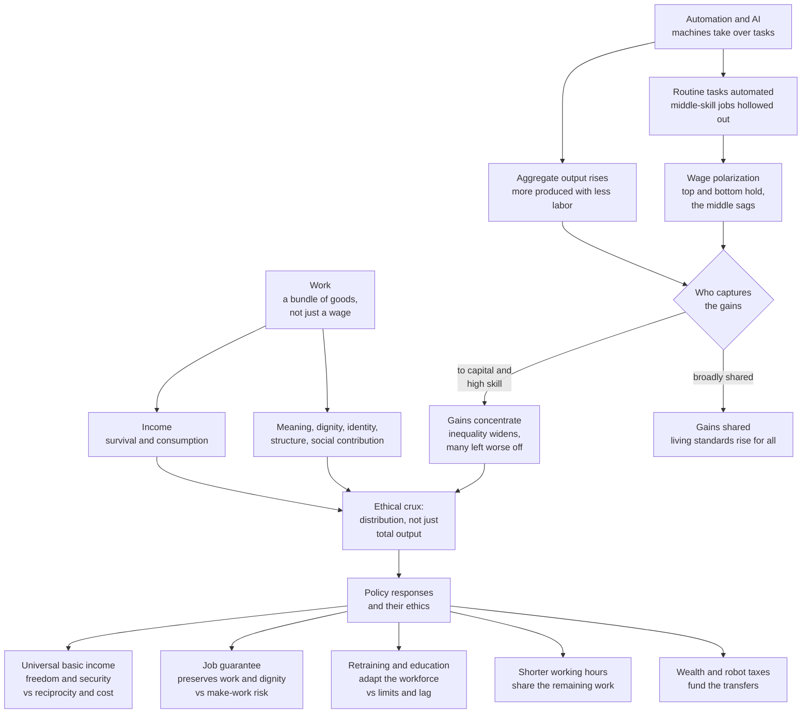

# 🏭 Ethics of Work and Automation

> [!abstract] TL;DR
> The **ethics of work and automation** asks what we owe each other as machines and AI take over the tasks that once filled human lives. Two facts sit in tension. First, **work is not only income** — it is a leading source of *meaning, dignity, identity, structure, and social contribution*, so losing it is not a purely financial injury. Second, **automation almost always raises aggregate output** while restructuring *who* does the work and *who captures the gains* — historically hollowing out routine middle-skill jobs and shifting income from labor toward capital and high-skill workers. The ethical crux is therefore **not "will there be enough total wealth?" but "how is it distributed, and does everyone retain a dignified place?"** — which is why policy debates over **universal basic income, job guarantees, retraining, shorter hours, and robot/wealth taxes** are moral debates, not merely technical ones. The recurring temptation is to celebrate the rising *aggregate* and ignore the *distribution*; this note's demo shows that automation can lift total output by 30 percent while *lowering* social welfare — until redistribution is added.

---

## Intuition

**Analogy:** Imagine a village where, overnight, a tireless machine can plow, sow, and harvest every field. The **ancient dream** of humanity has always been exactly this — freedom from toil, the golden age where "the shuttles weave by themselves" (Aristotle imagined it) and no one need labor. Yet the very same event carries the **modern nightmare**: if the machine belongs to one landowner and needs no hired hands, the villagers are not liberated — they are *made useless*, cut off from wages, from the pride of a harvest they grew, from the daily rhythm and the standing that farming gave them. The machine is identical in both stories. What differs is a single question the technology cannot answer for itself: **who owns the machine, and who eats the grain it produces?**

That is the whole ethics of automation in miniature. A labor-saving device is a *distributional Rorschach test*: the same rising productivity reads as emancipation or as immiseration depending entirely on the institutions that decide how its bounty is shared. Technology sets the *size* of the pie; ethics and politics decide the *slices* — and whether people who no longer must work still have a dignified way to belong.

---

## How It Works

Three ethical questions stack on top of one another, and confusing them is the source of most bad arguments about automation.

### 1. What is the value of work?
Reducing work to a *paycheck* misdescribes it. Empirically and philosophically, paid work bundles together several distinct goods:

- **Income** — the means to survive and consume (the obvious one).
- **Meaning and contribution** — the sense that one's effort produces something others need; work as participation in a shared social project.
- **Dignity and standing** — in most modern societies, "what do you do?" is a status question; the *social recognition* of being a contributor is tied to employment.
- **Identity** — occupations are core self-concepts ("I am a nurse," "I am a machinist").
- **Structure and social connection** — the temporal scaffolding of a day and the incidental community of coworkers.

This is why the philosophy of **"meaningful work"** treats a good job as more than fair pay, and why some argue for a *right* to meaningful work. It also sets up the opposite tradition: **Marx's theory of alienation** ([[Marx_and_Critical_Theory]]) holds that *wage labor under capitalism systematically strips work of these goods* — the worker is alienated from the product, from the act of laboring, from other workers, and from their own creative nature. So there is no consensus that work is intrinsically good: it can be a source of flourishing *or* a domain of domination, which shapes whether we should mourn its automation or welcome it.

### 2. Does automation actually destroy work?
The **technological-unemployment** debate is old and unresolved. In 1930 **Keynes** predicted a fifteen-hour work week for his grandchildren as machines multiplied productivity; that leisure never arrived, and total employment kept *growing* through a century of mechanization. Optimists invoke the **lump-of-labor fallacy** — the mistaken assumption that there is a *fixed* amount of work to be done, so every task a machine takes is a job permanently lost. In reality, automating some tasks lowers prices, raises incomes, and creates *demand for new kinds of labor* (the tractor destroyed farm jobs but the freed labor built the industrial and service economies).

The serious modern worry is **"this time is different."** The **task-based** view (Autor; Acemoglu and Restrepo) reframes it: automation targets **tasks, not whole jobs**, and it bites hardest on *routine, codifiable* tasks — which cluster in **middle-skill** occupations (clerks, bookkeepers, assembly, back-office). The result is **job polarization**: employment and wages grow at the top (non-routine cognitive: analysis, management) and hold at the bottom (non-routine manual: care, cleaning, driving-until-recently), while the **middle is hollowed out**. AI's novelty is that it now reaches *non-routine cognitive* tasks (drafting, coding, diagnosis) once thought safe — which is why the "this time is different" claim is taken seriously even by those who reject it for past technologies. See [[The_Future_of_Law]] for the same hollowing inside a single profession.

### 3. Who captures the gains? — the ethical crux
Even granting that automation *raises total output*, this settles almost nothing ethically, because output and its *distribution* are separate variables. Automation tends to **shift the functional distribution of income from labor to capital** — the owners of the machines and the algorithms — and, among workers, toward the high-skill complements of the technology. A world 30 percent richer in aggregate can leave a *majority* worse off if the entire gain (and more) accrues to capital owners while displaced middle-skill workers slide into lower-paid, precarious jobs. This is the point where the ethics of automation becomes a special case of **distributive justice** (the parallel *Distributive Justice and Inequality* sibling; and [[Justice_and_Rawls]]): the moral evaluation turns on *who benefits and who bears the cost*, not on the size of the aggregate. **Aggregate output is a fact about the pie; ethics is a fact about the slices.**

Because the market's default slicing can concentrate the gains, a menu of **policy responses** enters — each carrying its own ethical case and objections. The diagram maps the whole chain from the value of work, through automation's effects, to the distributional fork and the policy menu.



---

## Key Concepts

### Secondary — the plain-language core
- **Work is more than a wage.** People get *money, meaning, dignity, identity, and daily structure* from a job — so losing work to a machine is not the same as being handed the same money for free.
- **The old dream and the new fear.** Machines doing the work could mean *freedom from drudgery* or *being made useless*. Which one you get depends on who owns the machines.
- **It's about the slices, not the pie.** Automation usually makes the total bigger. The ethical question is whether the extra goes to everyone or piles up with a few owners.
- **Lump-of-labor fallacy.** The false belief that there is a *fixed* amount of work, so every machine permanently steals a job. History shows displaced labor has repeatedly moved into new kinds of work — the open question is whether that keeps happening.

### Undergraduate — the working structure of the debate
- **Meaningful work and the right to it.** A strand of political philosophy argues a just society owes people not just income but *decent, non-degrading, self-directed* work — because work is a primary site of self-respect and social contribution. The counter-tradition (Marxian **alienation**, [[Marx_and_Critical_Theory]]) argues much wage labor is *already* meaning-destroying, so freeing people from it could be liberation.
- **Job polarization and the task model.** Automation targets *routine tasks*, hollowing the middle of the wage distribution while sparing non-routine cognitive (high) and manual (low) work. This reshapes the *labor market's* factor prices — see [[Factor_Demand]] and [[Production_Functions]] for the economics of labor as a factor, and [[Unemployment]] for the aggregate picture.
- **The functional distribution of income.** Automation can lower **labor's share** of national income and raise **capital's share**. When machines substitute for workers, the returns flow to whoever *owns* the machines — the mechanism behind "output up, workers worse off."
- **Universal Basic Income (UBI).** An unconditional cash grant to every person. The **case**: freedom (an exit option from bad work), security under volatility, decoupling survival from a shrinking pool of jobs, and administrative simplicity. The **objections**: *cost* (funding a meaningful floor is enormous), *reciprocity* (is it fair to receive without contributing? — the "something for nothing" worry), *inflation*/labor-supply effects, and the claim that UBI *abandons* people to idleness rather than securing the goods of work.
- **The job guarantee alternative.** Instead of paying people *not* to work, the state acts as **employer of last resort**, offering a decent-wage public job to anyone who wants one — preserving work's *non-income* goods and dignity, at the risk of "make-work" and administrative bloat.
- **Other levers.** *Retraining and education* ([[Human_Capital_and_Education]]) to move workers up the skill ladder; *reduced working hours* (share the remaining work, Keynes's route); *wealth, capital, and "robot" taxes* ([[Tax_Policy]]) to fund transfers and slow labor-displacing over-automation.

### Graduate — the load-bearing debates
- **Reciprocity, desert, and who "deserves" income.** In a heavily automated economy, the classical link between *contribution* and *reward* frays: if machines produce the wealth, on what basis is it claimed? Liberal-egalitarian answers appeal to *equal citizenship* and prior social cooperation; libertarian answers to *ownership* of the capital; and the **reciprocity objection to UBI** (Rawlsian "surfers" who choose leisure) presses whether unconditional transfers violate fair terms of cooperation. This is a direct application of [[Justice_and_Rawls]] and the desert debates of distributive justice.
- **Predistribution vs redistribution.** Should we correct automation's inequality *after the fact* (taxes and transfers) or *change who owns the robots* in the first place — via **broad capital ownership**, sovereign wealth funds, worker cooperatives, or a "citizens' capital dividend"? Predistribution attacks the *labor-to-capital shift* at its root rather than patching its symptoms.
- **Labor ethics under algorithmic management.** Automation is not only *replacement* but *intensification*: **gig and platform work** disperse the employment relationship into precarious piecework, while **workplace surveillance and algorithmic management** ([[Privacy_Surveillance_and_Data_Ethics]]) automate the *supervisor*, raising exploitation, fair-wage, living-wage, and worker-voice questions (the parallel *Business Ethics* sibling). The ethical harm here is not too few jobs but *degraded* ones.
- **Care work and unpaid labor.** Much socially essential work — childcare, eldercare, domestic labor — is *unpaid and gendered*, and is precisely the non-routine relational work hardest to automate. An automation ethics that fixates on the *paid* economy risks entrenching the invisibility of care; some argue a UBI's deepest value is finally *compensating* it.
- **Post-work scenarios: utopia or dystopia.** At the horizon sit two visions. The **post-scarcity/post-work utopia** (automated abundance frees humanity for self-development, art, and relationship — echoing both Keynes and Marx's "hunt in the morning, criticize after dinner"). Against it, **Harari's dystopia of a "useless class"** — a mass of people economically superfluous and psychologically adrift, kept quiet by transfers and entertainment. The same technology, again, permits both; the deciding variable is distribution *and* whether we build non-work sources of meaning.
- **Machine autonomy and accountability spillovers.** As management and consequential decisions are automated, the *responsibility* questions of [[AI_Ethics_Overview]] and [[Autonomy_Accountability_and_Moral_Machines]] enter the workplace — who is answerable when an algorithm hires, ranks, disciplines, or fires?

---

## Python Demo

The demo makes the central claim *visible*: **automation's ethics turns on distribution, not aggregate output.** We spread a workforce across a skill distribution, apply a task-based automation shock that (a) raises total output 30 percent, (b) **complements high-skill** labor, and (c) **hollows out routine middle-skill** jobs in both wages and employment. We then compute the labor/capital split and a **utilitarian welfare** measure using a *concave* utility of income — concavity is what makes the metric sensitive to *distribution*, since a dollar matters more to the poor than the rich. Finally we add a **UBI funded by a tax on the automation-driven capital windfall** and recompute. The punchline: **the same 30 percent output gain lowers welfare without policy and raises it above baseline with redistribution.** Uses only `numpy` and `matplotlib`.

```python
# Distributional ethics of automation: the SAME +30% output can lower or raise
# social welfare depending entirely on who captures the gains.
import numpy as np
import matplotlib.pyplot as plt

# --- 1. A workforce spread across a skill distribution (percentiles 0..1) ---
N = 100_000
s = np.linspace(0.0, 1.0, N)          # skill percentile of each worker

# Baseline hourly wage rises with skill: ~$15 at the bottom to ~$75 at the top.
w0 = 15.0 + 60.0 * s

# --- 2. Automation's task-level bite ---
# Routine intensity peaks for MIDDLE-skill work -> most automatable.
routine = np.exp(-((s - 0.5) ** 2) / (2 * 0.16 ** 2))
complement = s                        # high-skill labor is complemented (wage bid up)

alpha = 0.25   # complementarity boost to high-skill wages
beta  = 0.45   # wage suppression where work is routine
gamma = 0.45   # employment loss where work is routine

# Post-automation wage and employment by skill.
w1 = w0 * (1.0 + alpha * complement) * (1.0 - beta * routine)
e0 = np.ones(N)                       # baseline: everyone employed at w0
e1 = 1.0 - gamma * routine            # middle-skill employment collapses

# Effective labor income per worker = wage x employment probability.
inc0 = w0 * e0
inc1 = w1 * e1

# --- 3. Aggregate output and the labor/capital split ---
labor_share0 = 0.62
L0 = inc0.sum()
Y0 = L0 / labor_share0                # baseline output implied by a 62% labor share
K0 = Y0 - L0                          # baseline capital income

Y1 = 1.30 * Y0                        # automation lifts TOTAL output by 30%
L1 = inc1.sum()                       # labor income after restructuring
K1 = Y1 - L1                          # capital soaks up the residual
labor_share1 = L1 / Y1
cap_gain = K1 - K0                    # extra income captured by capital owners

# --- 4. Policy: UBI funded by a tax on the automation-driven capital gain ---
tau = 0.5                             # tax half of the capital windfall
ubi = tau * cap_gain / N             # equal per-worker dividend
inc2 = inc1 + ubi                     # income after automation + UBI

# --- 5. Welfare: mean of a CONCAVE utility (log) -> sensitive to DISTRIBUTION ---
def welfare(income):
    return np.mean(np.log(income))

W0, W1, W2 = welfare(inc0), welfare(inc1), welfare(inc2)
direction = "DOWN" if W1 < W0 else "UP"

print("=== Automation: output vs distribution ===")
print(f"Total output:      Y0={Y0:,.0f}  ->  Y1={Y1:,.0f}  (+{100*(Y1/Y0-1):.0f}%)")
print(f"Labor share:       {labor_share0:.2f}  ->  {labor_share1:.2f}")
print(f"Capital windfall:  {cap_gain:,.0f}")
print(f"UBI per worker:    {ubi:,.2f} per hour-equivalent")
print()
print("Welfare (mean log income):")
print(f"  Baseline               W0 = {W0:.4f}")
print(f"  Automation, no policy   W1 = {W1:.4f}   (output UP, welfare {direction})")
print(f"  Automation + UBI        W2 = {W2:.4f}")

# --- 6. Plot ---
fig, ax = plt.subplots(1, 3, figsize=(16, 4.8))

# Panel 1: labor-market polarization by skill percentile.
pct_change = 100.0 * (inc1 - inc0) / inc0
ax[0].axhline(0, color="black", lw=1)
ax[0].plot(100 * s, pct_change, color="#dc2626", lw=2.5)
ax[0].fill_between(100 * s, pct_change, 0, where=(pct_change < 0),
                   color="#fca5a5", alpha=0.5, label="Middle hollowed out")
ax[0].fill_between(100 * s, pct_change, 0, where=(pct_change >= 0),
                   color="#86efac", alpha=0.5, label="Gains")
ax[0].set_title("Job polarization\nchange in labor income by skill")
ax[0].set_xlabel("Skill percentile")
ax[0].set_ylabel("Change in labor income  [percent]")
ax[0].legend(loc="lower right", fontsize=8)
ax[0].grid(alpha=0.25)

# Panel 2: output rises, but the split shifts from labor to capital.
labels2 = ["Labor\nincome", "Capital\nincome"]
x = np.arange(len(labels2))
ax[1].bar(x - 0.18, [L0, K0], width=0.36, label="Before", color="#93c5fd")
ax[1].bar(x + 0.18, [L1, K1], width=0.36, label="After",  color="#1d4ed8")
ax[1].set_xticks(x); ax[1].set_xticklabels(labels2)
ax[1].set_title("Output rises, but the split shifts\nfrom labor to capital")
ax[1].set_ylabel("Income (aggregate)")
ax[1].legend(fontsize=9); ax[1].grid(alpha=0.25, axis="y")

# Panel 3: welfare CHANGE vs baseline across three regimes.
labels3 = ["Baseline", "Automation\n(no policy)", "Automation\n+ UBI"]
vals3 = [0.0, W1 - W0, W2 - W0]
colors3 = ["#6b7280", "#dc2626", "#059669"]
ax[2].axhline(0, color="black", lw=1)
ax[2].bar(labels3, vals3, color=colors3)
ax[2].set_title("Same output, different ethics\nwelfare change vs baseline")
ax[2].set_ylabel("Change in welfare (mean log income)")
ax[2].grid(alpha=0.25, axis="y")

plt.tight_layout()
plt.savefig("automation_distribution_ethics.png", dpi=120)
plt.show()
```

**What it shows.** Panel 1 is the **polarization signature**: labor income *rises* at the high-skill end (automation complements it), holds at the low-skill end (hard-to-automate manual work), and *collapses in the middle* where routine tasks are eaten — the empirical shape behind "hollowing out." Panel 2 shows the **distributional shift**: total output is 30 percent larger, yet labor's slice shrinks while capital's balloons. Panel 3 delivers the moral: measured by a distribution-sensitive welfare function, **automation with no policy makes society worse off despite the bigger pie** (red bar below zero), because the losses fall on people for whom each dollar matters most — while **automation plus a UBI funded from the capital windfall pushes welfare above baseline** (green bar). Aggregate output is *identical* in the last two scenarios; only the slicing differs. That gap between the red and green bars *is* the ethics of automation.

---

## Real-World Applications

- **The polarization of Western labor markets (1980s–present).** Autor and colleagues documented exactly the middle-hollowing this note models: routine clerical and production jobs shrank while both high-skill professional and low-skill service employment grew — a real-world Panel 1. The stagnation of median wages amid rising productivity is the labor-share story of Panel 2.
- **Generative AI and knowledge work.** LLMs now automate *non-routine cognitive* tasks (drafting, summarizing, coding, first-pass legal and medical analysis), extending automation *up* the skill ladder — the concrete basis for the "this time is different" claim and the professional hollowing analyzed in [[The_Future_of_Law]].
- **UBI pilots and experiments.** GiveDirectly's long-run Kenya trials, the Finnish basic-income experiment (2017–2018), and Stockton's SEED program provide real evidence on UBI's effects on well-being, labor supply, and dignity — the empirical test of the reciprocity and "idleness" objections.
- **Alaska Permanent Fund and the "citizens' dividend."** A decades-old, popular unconditional dividend funded by *capital* (oil rents) — a working model of the predistribution idea that citizens should share directly in the returns to the productive assets the demo taxes.
- **Gig platforms and algorithmic management.** Ride-hail, delivery, and warehouse operations show automation as *intensification*: algorithms allocate, monitor, rate, and de-platform workers, making the exploitation and worker-voice questions ([[Privacy_Surveillance_and_Data_Ethics]]) as urgent as the displacement questions.
- **Shorter-hours policy.** Iceland's large-scale four-day-week trials and subsequent union adoption operationalize Keynes's "share the remaining work" route to distributing productivity gains as *time* rather than *income*.

---

## Common Pitfalls

- **Aggregate-output blindness.** Declaring automation good because GDP rises, while ignoring *who* gains. The demo's whole point: a 30 percent larger pie can leave the median person worse off. "Efficient" and "just" are different verdicts.
- **The lump-of-labor fallacy — and its overcorrection.** Assuming a fixed stock of jobs (so every machine kills a job forever) is a genuine fallacy; but *reflexively* invoking it to dismiss all concern ignores that adjustment can be slow, painful, and geographically concentrated, and that the *new* jobs may be worse. Both the panic and the complacency are errors.
- **Treating income as the whole of work.** Assuming a big enough transfer fully compensates the unemployed. It ignores work's *non-income* goods — meaning, dignity, structure, identity — which is why the job-guarantee vs UBI debate is not just about money.
- **Assuming meaningful work is universal.** The mirror-image error: romanticizing all work as fulfilling. For much routine, precarious, or degrading labor, Marx's *alienation* ([[Marx_and_Critical_Theory]]) is closer to the truth, and automating it is a *relief*. Whether automation is loss or liberation depends on *which* work.
- **Ignoring care and unpaid labor.** Framing "work" as only *paid* employment renders childcare, eldercare, and domestic labor invisible — and biases policy toward jobs that markets price and away from the relational work that automation *cannot* do but society most needs.
- **Technological determinism.** Believing the outcome (utopia or "useless class") is *dictated* by the technology. The consistent lesson is that identical productivity gains yield opposite social results depending on ownership, taxation, and institutions — which are *choices*, not fate.
- **Confusing "can be automated" with "should be, now, this way."** Over-automating to shave labor costs can destroy more social value than it creates (the "so-so automation" that displaces workers without much productivity gain), a case for *robot/wealth taxation* to correct the incentive.

---

## Related Concepts

*(This note seeds section S05 — Social, Political, and Economic Ethics. Planned siblings include Distributive Justice and Inequality, Business Ethics, and Technology and the Good Life; once written they should link back here, since automation is a shared case for all three.)*

**Within the Ethics vault**
- [[AI_Ethics_Overview]] — the normative map of AI's harms; labor displacement is one of its "present harms," and its responsibility questions spill into the automated workplace.
- [[Applied_Ethics_Overview]] — the parent survey; work-and-automation is a flagship applied-ethics domain.
- [[Ethical_Frameworks_in_Practice]] — supplies the consequentialist (aggregate welfare), deontological (a *right* to meaningful work or a decent job), and virtue (dignity, self-respect) lenses this note applies.
- [[Algorithmic_Fairness_and_Bias]] — automated hiring, ranking, and management make fairness a *labor* issue, not only a consumer one.
- [[Privacy_Surveillance_and_Data_Ethics]] — workplace surveillance and algorithmic management: automation as *intensification* of labor, not just replacement.
- [[Autonomy_Accountability_and_Moral_Machines]] — accountability when algorithms hire, discipline, and fire.

**Philosophy vault (foundations)**
- [[Marx_and_Critical_Theory]] — the theory of *alienation*: whether wage labor already destroys work's goods, reframing automation as possible liberation.
- [[Justice_and_Rawls]] — distributive justice, the difference principle, and the reciprocity/desert debate at the heart of UBI's fairness.

**Law vault**
- [[The_Future_of_Law]] — automation hollowing a single high-skill profession, a concrete case of the polarization thesis.
- [[AI_and_the_Law]] — liability and regulation as AI enters consequential workplace decisions.
- [[Law_and_Economics]] — the efficiency-versus-distribution framing that the ethics of automation contests.

**Economics vaults**
- [[Unemployment]] — the aggregate labor-market backdrop and the structural-unemployment channel of displacement.
- [[Technological_Progress]] — the growth-side view: automation as the engine of the rising *aggregate* whose *distribution* this note interrogates.
- [[Factor_Demand]] and [[Production_Functions]] — the microeconomics of labor as a factor, capital-labor substitution, and complementarity.
- [[Human_Capital_and_Education]] — the "retraining" policy lever and its limits.
- [[Tax_Policy]] — the fiscal machinery behind robot/wealth taxes and transfer-funded UBI.

**Political Science vault**
- [[Welfare_States_and_Social_Policy]] — the institutional menu of transfers within which UBI and job guarantees are debated.
- [[Socialism_Marxism_and_Communism]] — the ownership-of-capital (predistribution) traditions.
- [[Technology_AI_and_Politics]] — the political economy of who controls automating technologies.

---

## Review Questions

1. **(Comprehension)** Distinguish the *three stacked questions* of automation ethics — the value of work, whether automation destroys work, and who captures the gains. Explain why an answer to the third can *reverse* the moral verdict even when the aggregate-output answer is fixed. Use the demo's red and green bars in your answer.
2. **(Application)** A logistics firm deploys AI that raises output 25 percent while eliminating most of its middle-tier planning jobs and boosting pay for a small data-science team. Leadership calls it a win because revenue and average productivity rose. Using the labor-share and polarization concepts, state what *additional* evidence you would demand before agreeing society is better off, and design *two* interventions (one predistributive, one redistributive) that would change the outcome.
3. **(Synthesis / evaluation)** UBI's strongest objection is *reciprocity* — that unconditional income lets people take from social cooperation without contributing. Its strongest motivation is *freedom and dignity* under automation. Drawing on [[Justice_and_Rawls]] and Marx's [[Marx_and_Critical_Theory]] account of alienation, argue whether a **job guarantee** or a **UBI** better honors the *non-income* goods of work in a heavily automated economy — and name explicitly which ethical framework your argument relies on and where care and unpaid labor fit.

---

## Sources

- Keynes, J. M. (1930). "Economic Possibilities for our Grandchildren." In *Essays in Persuasion*. (The fifteen-hour week and the leisure that never came.)
- Autor, D. (2015). "Why Are There Still So Many Jobs? The History and Future of Workplace Automation." *Journal of Economic Perspectives*, 29(3), 3–30. (Task-based automation, polarization, and the lump-of-labor fallacy.)
- Acemoglu, D., & Restrepo, P. (2019). "Automation and New Tasks: How Technology Displaces and Reinstates Labor." *Journal of Economic Perspectives*, 33(2), 3–30. (Displacement vs reinstatement, "so-so" automation, and the labor share.)
- Van Parijs, P., & Vanderborght, Y. (2017). *Basic Income: A Radical Proposal for a Free Society and a Sane Economy*. Harvard University Press. (The freedom-based case for UBI and the reciprocity objection.)
- Gheaus, A., & Herzog, L. (2016). "The Goods of Work (Other Than Money!)." *Journal of Social Philosophy*, 47(1), 70–89. (The non-income goods of work; the meaningful-work debate.)
- Harari, Y. N. (2018). *21 Lessons for the 21st Century*. Spiegel & Grau. (The "useless class" and the post-work dystopia/utopia framing.)

---

#ethics #future-of-work #automation #universal-basic-income #meaningful-work
