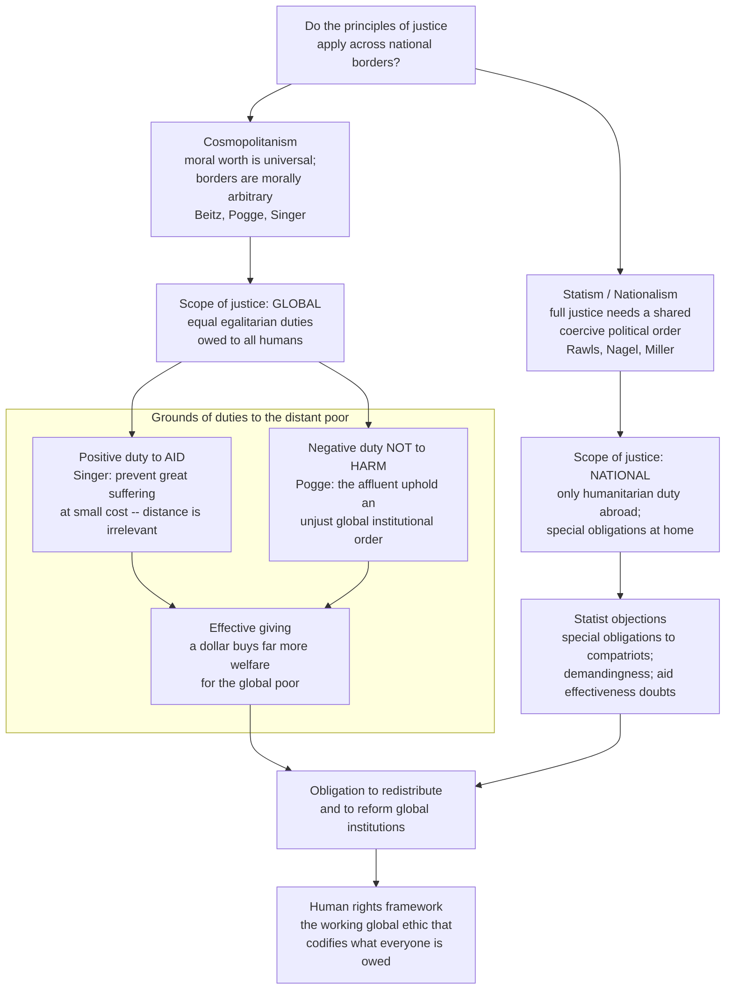

# 🌍 Global Justice and Human Rights

> [!abstract] TL;DR
> **Global justice** asks whether principles of justice stop at the border, and what the affluent owe the roughly one billion people in extreme poverty. The scope-of-justice debate splits **cosmopolitans** (moral worth is universal, national boundaries are morally arbitrary, so egalitarian justice is *global* — Pogge, Beitz) from **statists/nationalists** (the full demands of justice arise only inside a shared coercive political order, and we owe special obligations to compatriots — Rawls's *Law of Peoples*, Nagel). On duties to the distant poor, **Singer** argues from a *positive* duty (if we can prevent great suffering at small cost we must, and distance is irrelevant), while **Pogge** argues from a *negative* duty (the rich don't merely fail to help — they actively *harm* by upholding an unjust global institutional order). **Effective altruism** adds a quantitative turn: because the marginal utility of income falls steeply, the same dollar buys roughly **100 times** more welfare for the global poor than for the rich. The **human rights** framework is the working global ethic that operationalizes these duties — but its universalism is itself contested.

---

## Intuition

**Analogy — Singer's drowning child.** You are walking to work past a shallow ornamental pond and see a small child face-down in the water, drowning. No one else is around. You can wade in and pull her out, but your expensive shoes and suit will be ruined and you'll be late. Does the cost of the shoes cancel your duty to save her? Obviously not — the trivial loss is morally irrelevant next to a child's life. Nearly everyone agrees you *must* wade in.

Now Peter Singer presses the uncomfortable question. A donation of the same amount you'd spend replacing those shoes — routed to effective aid — can, with high probability, save a child's life from malaria or diarrheal disease somewhere far away. If **distance** doesn't change your duty (why would a child's death matter less because she is 8,000 km away?), and if the **number** of other people who *could* help but don't doesn't change it (their inaction doesn't discharge your duty), then the logic that forces you into the pond seems to force you to give — and to keep giving until giving more would cost you something morally comparable to a child's life. That conclusion feels absurdly demanding, and the entire field of global-poverty ethics is the argument over which premise, if any, we can reject without also abandoning the child in the pond.

---

## How It Works

### The two questions of global ethics

Global justice separates into two questions that are often run together:

1. **Scope.** *To whom* do the demands of justice apply? Only to fellow members of a state, or to all human beings? This is where cosmopolitanism and statism collide.
2. **Grounds and content.** *What kind* of duty do the affluent owe the distant poor — mere charity, a positive duty of assistance, or a strict negative duty of non-harm and rectification? And how much does it demand?

### Scope: cosmopolitanism vs statism

**Cosmopolitanism** holds that every human being is a unit of equal moral concern and that national boundaries are *morally arbitrary* — an accident of birth, like race or sex, that cannot justify vast inequalities in life prospects. Charles **Beitz** argued that global economic interdependence already constitutes something like a single scheme of cooperation, so Rawls's difference principle (inequalities are just only if they benefit the worst-off) should apply *globally*, not just nationally. Thomas **Pogge** radicalizes this: the global order is a shared institutional scheme that the affluent design and enforce, so its inequalities fall squarely within justice.

**Statism / nationalism** denies that justice's *full* egalitarian demands travel across borders. Thomas **Nagel** ("The Problem of Global Justice") argues that egalitarian justice is *associative* — it is triggered specifically by the coercive, will-imposing authority of the state over its members. Absent a world government exercising coercion in our name, we owe foreigners *humanitarian* duties (help them meet basic needs) but not *distributive* justice (equalize shares). John **Rawls**, in *The Law of Peoples*, strikingly declined to extend his own difference principle globally; he defended only a **duty of assistance** to "burdened societies" until they can sustain just institutions, arguing that a society's wealth depends mainly on its domestic political culture, not global transfers. David **Miller** adds that co-nationals share a bond that grounds genuine **special obligations**, just as family ties do.

### Grounds: positive duties (Singer) vs negative duties (Pogge)

The two most influential arguments for helping the global poor rest on *different* moral foundations:

- **Singer — a positive duty to aid (1972).** Premise: suffering and death from lack of food, shelter, and medicine are bad. Premise: if it is in our power to prevent something bad without sacrificing anything of *comparable moral importance*, we ought to do it. Conclusion: affluent people are obligated to give — a lot. Singer's argument is **consequentialist** in spirit and generates a stringent *positive* duty of beneficence.
- **Pogge — a negative duty not to harm.** Pogge accepts that positive duties are contested and instead argues the affluent violate the far less controversial *negative* duty **not to harm**. The rich nations impose a global institutional order — trade rules, an "international borrowing privilege" and "resource privilege" that let any group controlling a country by force sell its resources and take on debt in its name — that *foreseeably and avoidably* produces mass poverty. On this view, global poverty is not a failure to rescue strangers but an ongoing **injustice we are actively implicated in**, so what's owed is not charity but *rectification*.

### The quantitative turn: effective altruism

Effective altruism (EA) accepts Singer's core and asks the empirical follow-up: *given that we should help, where does a dollar do the most good?* Because the **marginal utility of income diminishes** steeply, transferring resources from the rich to the extreme poor produces enormous welfare gains — GiveWell estimates top charities avert a death for a few thousand dollars. EA thus reframes giving as a problem of *cost-effectiveness under uncertainty*, foregrounding evidence, measurement, and the vast multiplier explored in the demo below.

### The map of the debate



The diagram's last node matters: **human rights** is the practical language in which these philosophical duties get cashed out globally. But it inherits an unresolved dispute from [[Metaethics_and_Moral_Disagreement]] — are rights *universal* (grounded in a shared human nature or agency), or a **culturally specific** Western export, as relativists and the "Asian values" critique of the 1990s alleged? The framework's authority depends on which answer wins.

---

## Key Concepts

### Secondary (intuitive, no jargon)
- **The accident of birth.** Where you are born is the single largest predictor of your life prospects, and you did nothing to earn it. Global justice asks whether that lottery can be morally justified.
- **Charity vs duty.** Is giving to the global poor a nice extra (charity) or something you're *required* to do (a duty)? Singer says duty; the whole debate turns on this shift.
- **Distance doesn't matter (Singer).** A dying child is no less a dying child for being far away or unseen. Our intuitions weaken with distance, but the *moral reality* doesn't.
- **Human rights.** The idea that every person, simply as a human, has claims — to life, liberty, subsistence, freedom from torture — that any government and the world order must respect.

### Undergraduate (the frameworks and arguments)
- **Cosmopolitanism.** Universal equal moral status; borders are morally arbitrary; egalitarian justice is global. **Moral** cosmopolitanism (everyone counts equally) is weaker and widely held; **institutional** or **distributive** cosmopolitanism (we owe global redistribution/world institutions) is the contested strong claim.
- **Statism and the associative view (Nagel).** Egalitarian distributive justice is triggered by the *coercive, co-authored* institutions of the state; between states we owe only humanitarian assistance, not equality.
- **Rawls's *Law of Peoples*.** Rawls extends his contract theory to a "society of peoples" but rejects a *global* difference principle, endorsing only a **duty of assistance** to burdened societies — a much-criticized retreat from his own domestic egalitarianism.
- **Singer's argument.** Prevent-bad-at-small-cost principle → strong positive duty to give. The **demandingness objection**: taken seriously it seems to require giving until near marginal sacrifice, which critics say is too much for any moral theory to demand.
- **Pogge's harm-based argument.** Negative duty not to harm + the claim that the affluent *impose* a poverty-producing global order = an obligation of rectification, not charity. Sidesteps the demandingness worry by not relying on positive duties.
- **Universalism vs relativism about rights.** Are human rights grounded in something universal (agency, basic needs, human dignity), or are they contingent cultural constructs? The **Vienna Declaration (1993)** reaffirmed universality against the relativist challenge.

### Graduate (the live controversies)
- **The coercion vs cooperation dispute.** Nagel keys justice to *coercion*; Beitz and Cohen/Sabel key it to *interdependent cooperation*. The global economy is deeply cooperative but only weakly coercive — so which trigger is the right one determines whether global egalitarianism follows.
- **Special obligations, defended and attacked.** Can partiality to compatriots be justified (Miller, Scheffler on associative duties) or is it "the last acceptable form of prejudice"? The parallel with family partiality is contested: does sharing a passport really resemble sharing a home?
- **Pogge's empirical premise.** His argument's force depends on the causal claim that global institutions *cause* poverty rather than merely fail to cure it (Mathias Risse's critique: the order has coincided with the largest poverty reduction in history). If institutions net-*help*, the harm argument weakens.
- **The demandingness objection and agent-relative permissions.** How much can morality demand before it becomes self-effacing? Responses range from biting the bullet (Singer, Unger) to building in agent-centered prerogatives and moderate "fair-share" duties.
- **Open vs closed borders (Carens).** Joseph Carens argues that from *any* leading liberal theory (Rawlsian, libertarian, utilitarian) the conclusion is roughly the same: freedom of movement is a basic liberty, and restricting immigration to preserve privilege is like feudal restrictions on serfs. Opponents (Miller, Wellman) defend a **right of legitimate states to exclude** grounded in self-determination and associative freedom.
- **The exploitation debate on sweatshops and trade.** Are sweatshops *wrongful exploitation* (taking unfair advantage of desperation) even when they are the best option locally available and *mutually beneficial*? The puzzle: a transaction can be both a genuine improvement for the worker *and* unfair — and banning it may harm the very people it aims to protect.
- **The resource curse and the borrowing/resource privileges.** Pogge's institutional cosmopolitanism identifies specific reformable mechanisms — the international recognition that lets whoever holds power sell a nation's resources and borrow in its name — that entrench dictatorship and poverty, connecting global justice to concrete [[International_Trade_and_Economic_Law]].
- **Climate and health as global justice.** Emissions harms and pandemic vaccine access are textbook cases where the *causers* and the *sufferers* are separated by borders and generations, folding global justice into climate ethics and [[Justice_in_Health_and_Resource_Allocation]].

---

## Python Demo

This models the quantitative core of the effective-giving argument: **the diminishing marginal utility of income**. If well-being rises with income but with a *falling* slope, then a dollar is worth far more to a poor person than to a rich one. Using isoelastic utility, we compute how much welfare the *same* dollar buys across the income distribution, recover the famous **~100x multiplier** of the global poor over the affluent, and then plot the total welfare gained by donating a fixed sum to recipients at different income levels. We also flag the objections that no utility curve can settle.

```python
# The quantitative case for global giving: diminishing marginal utility of income.
# Isoelastic (CRRA) utility:  U(c) = (c**(1-eta) - 1) / (1 - eta),  eta != 1
#                             U(c) = ln(c)                          eta  = 1
# Marginal utility of income:  U'(c) = c**(-eta)   -> a dollar is worth
# more at low income. We use eta = 1 (log utility) as the well-supported base case.
import numpy as np
import matplotlib.pyplot as plt

eta = 1.0  # standard elasticity of marginal utility (log utility); 1.0-1.5 typical

def marginal_utility(c, eta=1.0):
    # Utils gained from one extra dollar at consumption level c.
    return c ** (-eta)

def utility(c, eta=1.0):
    if eta == 1.0:
        return np.log(c)
    return (c ** (1 - eta) - 1) / (1 - eta)

# Annual consumption (USD) across a global spectrum, log-spaced.
income = np.logspace(np.log10(300), np.log10(200_000), 400)  # $300 .. $200k / yr

# --- 1) The 100x multiplier ---------------------------------------------------
poor_income = 500.0     # near-extreme-poverty annual consumption
rich_income = 50_000.0  # affluent-country consumption
multiplier = marginal_utility(poor_income, eta) / marginal_utility(rich_income, eta)
print(f"Marginal utility ratio (poor $500 vs rich $50,000): {multiplier:.0f}x")
# With log utility this is exactly 50000/500 = 100x.

# --- 2) Welfare from donating a FIXED sum to recipients at each income level ---
donation = 100.0  # dollars given away
# Welfare GAINED by the recipient = U(income + donation) - U(income).
recipient_gain = utility(income + donation, eta) - utility(income, eta)

# --- 3) Plots -----------------------------------------------------------------
fig, ax = plt.subplots(1, 2, figsize=(13, 5))

# (a) Marginal utility per dollar vs income
ax[0].loglog(income, marginal_utility(income, eta), color="#2563eb", lw=2)
ax[0].scatter([poor_income, rich_income],
              [marginal_utility(poor_income, eta), marginal_utility(rich_income, eta)],
              color="#dc2626", zorder=5)
ax[0].annotate("global poor\n$500/yr", (poor_income, marginal_utility(poor_income, eta)),
               textcoords="offset points", xytext=(10, -5), color="#dc2626")
ax[0].annotate("affluent\n$50,000/yr", (rich_income, marginal_utility(rich_income, eta)),
               textcoords="offset points", xytext=(-20, 15), color="#dc2626")
ax[0].set_title(f"Utility gain per dollar vs income\n(~{multiplier:.0f}x more welfare for the poor)")
ax[0].set_xlabel("recipient annual income (USD, log)")
ax[0].set_ylabel("marginal utility per $ (log)")
ax[0].grid(True, which="both", ls=":", alpha=0.5)

# (b) Welfare gained by a fixed $100 gift, by recipient income
ax[1].semilogx(income, recipient_gain, color="#059669", lw=2)
ax[1].axvline(poor_income, color="#dc2626", ls="--", alpha=0.7)
ax[1].axvline(rich_income, color="#6b7280", ls="--", alpha=0.7)
ax[1].set_title(f"Welfare from the SAME ${donation:.0f} gift\n"
                "vast where income is low, negligible where it is high")
ax[1].set_xlabel("recipient annual income (USD, log)")
ax[1].set_ylabel("utils gained by recipient")
ax[1].grid(True, which="both", ls=":", alpha=0.5)

plt.tight_layout()
plt.savefig("global_giving_utility.png", dpi=120)
plt.show()

# --- 4) The effective-giving headline ----------------------------------------
gain_poor = utility(poor_income + donation, eta) - utility(poor_income, eta)
gain_rich = utility(rich_income + donation, eta) - utility(rich_income, eta)
print(f"${donation:.0f} to someone at $500/yr  -> {gain_poor:.4f} utils")
print(f"${donation:.0f} to someone at $50,000/yr -> {gain_rich:.4f} utils")
print(f"Welfare ratio of the identical gift: {gain_poor / gain_rich:.0f}x")
```

**What you see when you run it.** The left panel is a straight downward line on log-log axes — the signature of diminishing marginal utility — with the poor recipient sitting **100x** higher than the affluent one under log utility: the *same* dollar produces roughly a hundred times more welfare in extreme poverty. The right panel shows a fixed \$100 gift generating a large welfare jump at low incomes that decays to near-zero for the rich. This is the quantitative spine of Singer's and effective altruism's case: given *any* plausible concave utility of income, geography-blind giving to the poorest is astonishingly efficient at producing well-being.

**What the model deliberately cannot settle.** (1) It assumes welfare is **interpersonally comparable** and reducible to a utility of income — both contested. (2) It ignores **special obligations**: statists insist a dollar owed to your own community is not fungible with a dollar to a stranger, however larger the stranger's utility gain. (3) It assumes aid *works*; real-world **effectiveness is uncertain** (leakage, dependency, general-equilibrium effects), which is exactly why EA insists on measurement rather than treating the curve as automatic. The math shows the *stakes* of global giving; it does not, by itself, discharge the moral argument.

---

## Real-World Applications

> **Example — GiveWell and the effective-giving movement.** GiveWell operationalizes the utility argument above by ranking charities on *cost per life saved / per unit of welfare*, directing hundreds of millions of dollars to interventions like the Against Malaria Foundation (insecticide-treated nets) and vitamin-A / deworming programs. It is Singer's philosophy turned into a spreadsheet — and its debates over moral weights, deworming's contested evidence, and cash-transfer benchmarks (GiveDirectly) are the demandingness and effectiveness objections litigated in practice.

- **The UN human rights regime.** The Universal Declaration of Human Rights (1948) and the two 1966 Covenants (civil-political and economic-social-cultural rights) are the institutional embodiment of universalist global ethics — the working answer to "what does everyone, everywhere, get?" See [[Human_Rights_Law]] and [[Human_Rights_and_International_Law]].
- **The 0.7% aid target.** The long-standing UN pledge for rich states to give 0.7% of gross national income as official development assistance — routinely unmet — is a concrete, statist-flavored *duty of assistance* rather than cosmopolitan redistribution.
- **Fair-trade, sweatshop campaigns, and supply-chain law.** Anti-sweatshop movements, fair-trade certification, and modern-slavery / due-diligence statutes (UK 2015, EU CSDDD) are the exploitation debate made into policy, tied to [[International_Trade_and_Economic_Law]] and [[Global_Inequality_and_Development]].
- **The Responsibility to Protect (R2P).** Adopted at the 2005 UN World Summit, R2P holds that sovereignty is conditional on protecting one's population, and that the international community may intervene against genocide and mass atrocity — cosmopolitan duties overriding statist sovereignty, and the live controversy behind Libya 2011. See [[International_Humanitarian_and_Criminal_Law]] and [[The_State_System_and_Sovereignty]].
- **Immigration policy and the border ethics debate.** Carens's open-borders argument and the "right to exclude" reply structure real disputes over asylum, labor migration, and refugee resettlement — the normative backdrop to [[Migration_and_Diaspora]].
- **Development practice.** The turn to randomized evaluation and cash transfers (Banerjee–Duflo, GiveDirectly) reflects effectiveness worries at the heart of [[Development_Anthropology_and_Aid]].

---

## Common Pitfalls

- **Collapsing moral and institutional cosmopolitanism.** Believing every human counts equally (moral cosmopolitanism) is nearly universal and cheap; it does *not* by itself entail global redistribution or world government (institutional cosmopolitanism). Most disagreement is about the *second* step, so treat them separately.
- **Reading Singer as "give until you starve."** The principle is "sacrifice nothing of *comparable moral importance*." The demandingness bites, but the conclusion is calibrated to comparability, not literal self-destitution — and Singer's later "fair share" framings soften it. Attack the real argument, not a caricature.
- **Conflating positive and negative duties.** Singer needs a strong (contested) *positive* duty to aid; Pogge needs only a weak (widely accepted) *negative* duty not to harm. They can succeed or fail independently. Objecting "we didn't cause their poverty" answers Singer but is *exactly what Pogge denies*.
- **Assuming aid automatically works.** The utility curve shows the *potential* welfare gain, not the *realized* one. Ignoring leakage, dependency, and general-equilibrium effects turns a moral argument into naive charity — which is why effective altruism insists on evidence.
- **Treating human rights as self-evidently universal.** The universalism-vs-relativism question is genuinely open and inherited from metaethics. Asserting universality without grounding it lets the "cultural imperialism" objection go unanswered. See [[Metaethics_and_Moral_Disagreement]].
- **The "sweatshops are good, therefore fine" leap.** That a sweatshop job beats a worker's alternatives shows it is *mutually beneficial*; it does not show it is *non-exploitative*. Mutual benefit and unfair advantage-taking can coexist — the interesting cases are precisely where both hold.
- **Special obligations as a conversation-stopper.** "But I owe more to my compatriots" is a *thesis to be defended* (why does a shared passport ground duties?), not an axiom. Invoking it without an argument for its scope simply relabels the partiality it is supposed to justify.

---

## Related Concepts

- [[Justice_and_Rawls]] — Rawls's domestic theory of justice as fairness, and his surprising refusal to globalize it in *The Law of Peoples* (a duty of assistance, not a global difference principle) — the anchor of the statist position.
- [[Consequentialism_and_Utilitarianism]] — the utilitarian engine behind Singer's argument and effective altruism's welfare-maximizing, geography-blind calculus.
- [[Metaethics_and_Moral_Disagreement]] — the universalism-vs-relativism dispute that determines whether human rights have genuinely global authority.
- [[Justice_in_Health_and_Resource_Allocation]] — global health justice, the 10/90 gap, and access to medicines as a concrete arena of duties across borders.
- [[Human_Rights_Law]] — the legal codification of the human rights framework this note grounds philosophically.
- [[Human_Rights_and_International_Law]] — the political-science treatment of human rights regimes, enforcement, and their politics.
- [[International_Trade_and_Economic_Law]] — the WTO/trade-rule architecture at the center of trade justice, sweatshops, and Pogge's "unjust institutional order" claim.
- [[International_Humanitarian_and_Criminal_Law]] — the law of armed conflict and atrocity crimes underpinning humanitarian intervention and R2P.
- [[The_State_System_and_Sovereignty]] — the Westphalian sovereignty backdrop that statism defends and cosmopolitan intervention challenges.
- [[Global_Inequality_and_Development]] — the empirical facts of global stratification the whole debate is trying to morally assess.
- [[Migration_and_Diaspora]] — the movement-of-people reality behind the open-vs-closed-borders debate.
- [[Development_Anthropology_and_Aid]] — the on-the-ground effectiveness and unintended-consequence critique of aid that tempers the giving argument.

---

## Review Questions

**Tier 1 — Foundational (explain to a peer)**
1. State Singer's drowning-child argument as a short valid syllogism. What roles do "distance" and "the number of other potential helpers" play, and why does Singer say each is morally irrelevant?
2. Distinguish *cosmopolitanism* from *statism* about the scope of justice. Give the core reason each side offers, and name one philosopher associated with each.

**Tier 2 — Applied (reason through a case)**
3. Pogge and Singer both conclude the affluent owe the global poor, but from different premises. A critic says "we are not responsible for other countries' poverty." Explain why this reply may defeat Singer yet leave Pogge's argument standing, and what empirical claim Pogge must defend for his argument to work.
4. A factory offers wages that are miserable by rich-world standards but higher than any local alternative, and workers line up for the jobs. Construct the strongest case that this is *still* wrongful exploitation, and the strongest reply that banning it would harm the workers. Which do you find more persuasive, and why?

**Tier 3 — Advanced (research-level)**
5. Nagel grounds egalitarian justice in *state coercion*; Beitz grounds it in *global cooperation*. Using the actual structure of the world economy (deeply interdependent, only weakly coercive), argue for one trigger over the other and draw out what follows for global redistribution.
6. Carens claims that Rawlsian, libertarian, and utilitarian premises all converge on open borders. Reconstruct one of these derivations, then mount the strongest "right to exclude" reply grounded in collective self-determination. Does a liberal egalitarian have a principled place to stop the argument short of open borders?
7. The Python model derives a ~100x welfare multiplier for giving to the global poor. Identify the three assumptions that carry the most moral weight (interpersonal utility comparison, denial of special obligations, aid effectiveness), and argue whether a statist could accept the *math* while rejecting the *obligation*.

---

## Sources

- Singer, P. (1972). "Famine, Affluence, and Morality." *Philosophy & Public Affairs*, 1(3), 229–243. [JSTOR](https://www.jstor.org/stable/2265052).
- Pogge, T. (2008). *World Poverty and Human Rights* (2nd ed.). Polity Press. See also the [Stanford Encyclopedia of Philosophy — Global Justice](https://plato.stanford.edu/entries/justice-global/).
- Rawls, J. (1999). *The Law of Peoples*. Harvard University Press.
- Nagel, T. (2005). "The Problem of Global Justice." *Philosophy & Public Affairs*, 33(2), 113–147. [DOI](https://doi.org/10.1111/j.1088-4963.2005.00027.x).
- Carens, J. (1987). "Aliens and Citizens: The Case for Open Borders." *The Review of Politics*, 49(2), 251–273. [DOI](https://doi.org/10.1017/S0034670500033817).
- Beitz, C. (1979). *Political Theory and International Relations*. Princeton University Press.

---

#ethics #global-justice #human-rights #cosmopolitanism #global-poverty
