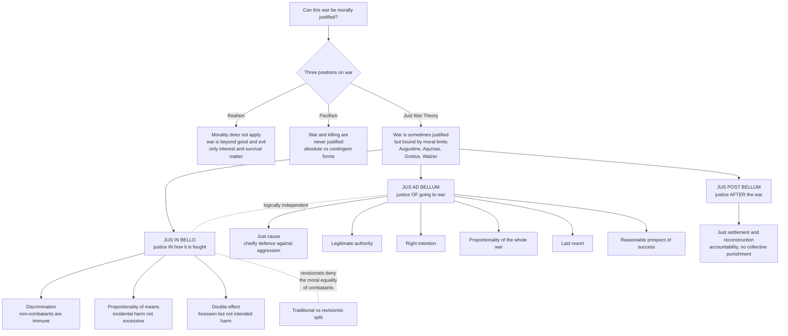

# ⚔️ Just War and the Ethics of Violence

> [!abstract] TL;DR
> War is the most destructive thing organized humans do, so the central ethical question is whether it can *ever* be morally justified and, if so, under what limits. Three positions frame the debate: **realism** says morality simply does not apply between states ("war is hell," only interest and survival count); **pacifism** says war and killing are *never* justified (in its *absolute* form) or almost never (in its *contingent* form); and the dominant **just war tradition** — running from **Augustine** and **Aquinas** through **Grotius** to **Michael Walzer** — says war is *sometimes* permissible but always bound by moral constraints. Just war theory has three parts: ***jus ad bellum*** (when it is just to *go* to war — just cause, legitimate authority, right intention, proportionality, last resort, reasonable prospect of success), ***jus in bello*** (how war may be *fought* — **discrimination**/non-combatant immunity, **proportionality** of means, and the **doctrine of double effect** for foreseen civilian deaths), and ***jus post bellum*** (justice *after* the war). Modern debate splits over the **moral equality of combatants** — the traditional Walzerian view that soldiers on both sides fight as moral equals, versus the **revisionist** challenge (**Jeff McMahan**) that fighting for an unjust cause cannot be permissible. The hard cases — humanitarian intervention, preemptive war, terrorism, torture, nuclear deterrence, and autonomous weapons — are where the framework earns or loses its keep.

---

## Intuition

**Analogy — the two dials on the most dangerous machine.** Imagine the most destructive machine ever built, one that only ever runs by grinding up human lives. Three engineers stand at the control panel. The first, the **realist**, shrugs: "This machine has no safety rules — it runs on power, and talk of 'shouldn't' is a category error; the only question is who controls it." The second, the **pacifist**, reaches for the master switch: "The only ethical setting is *off*. Nothing this machine produces is worth what it consumes." The third, the **just war theorist**, refuses both. "It is monstrous, but sometimes refusing to run it — while an aggressor runs *theirs* over the defenseless — is worse. So we do not switch it off, and we do not run it wild. We fit it with **two dials**: one that governs *whether we are even permitted to start it* (was there a just cause, a last resort, a real chance of success?), and one that governs *how it may run once started* (never aim it at those who are not fighting; never let the destruction outrun the point of it)."

That third stance is the whole subject. Just war theory is the centuries-long attempt to place **moral limits on the most extreme human activity** — to occupy the narrow and unstable ground between "anything goes" and "nothing is ever permitted." Everything technical below — *jus ad bellum*, *jus in bello*, discrimination, proportionality, double effect — is just the engineering of those two dials, plus a third for cleaning up after the machine stops.

---

## How It Works

### Core mechanics

**The three positions on war.** Before any criteria, there is a prior question: does morality even *govern* war? Three answers structure the field.

1. **Realism (war is beyond morality).** In the descriptive form, states act on interest and survival, not moral principle; in the prescriptive form (echoing Hobbes and Machiavelli), it is *foolish or even wrong* for a statesman to sacrifice the nation's safety for moral scruple. "War is hell" (Sherman) can be read as a realist claim: once war begins, restraint is sentimental and the humane path is to win fast and totally. Just war theory's first job is to deny this — to insist that even in war, some acts remain **wrong**, not merely imprudent.
2. **Pacifism (war is never justified).** *Absolute pacifism* holds that killing is categorically impermissible — a deontological or religious absolute (early Christianity, Tolstoy, some readings of Gandhi). *Contingent* (or *consequentialist*) pacifism holds not that violence is intrinsically wrong but that war's costs so reliably swamp its benefits, and its escalation is so uncontrollable, that it is *practically* never justified. Pacifism's deepest challenge to just war theory is the accusation that "limited, justified war" is a comforting fiction that mostly *enables* violence by dressing it in respectability.
3. **Just war theory (war can be justified but is constrained).** The mainstream tradition: war is a great evil but sometimes the lesser one, and the task is to specify *precisely when* and *within what limits*. It grew from **Augustine** (a Christian could fight to defend the innocent, with the right inner disposition), was systematized by **Aquinas** (just cause, legitimate authority, right intention), secularized and turned into law by **Hugo Grotius** (the 17th-century founder of international law), and given its canonical modern statement by **Michael Walzer** in *Just and Unjust Wars* (1977).

**The two-plus-one part structure.** Just war theory's signature move is to split the moral evaluation of war into logically **independent** compartments — a war can pass one test and fail another.

- ***Jus ad bellum*** — the justice of *resorting* to war. Traditionally six criteria, all of which must be met: **(a) Just cause** — a wrong received, chiefly **self-defense against aggression** (the paradigm case; humanitarian rescue is the contested extension). **(b) Legitimate authority** — declared by a competent public authority, not a private faction. **(c) Right intention** — aimed at the just cause and ultimately at peace, not at conquest, plunder, or hatred. **(d) Proportionality** — the overall good expected must outweigh the overall harm (a whole-war cost-benefit judgment). **(e) Last resort** — peaceful alternatives exhausted or clearly futile. **(f) Reasonable prospect of success** — pointless slaughter with no chance of achieving the cause is impermissible.
- ***Jus in bello*** — the justice of *conduct within* war, binding **every** combatant on **every** side. Two core rules plus a bridging doctrine: **Discrimination (distinction)** — you may target combatants and military objectives, but **non-combatants are immune**; deliberately killing civilians is murder, not war. **Proportionality of means** — even against a legitimate target, expected incidental civilian harm must not be **excessive** relative to the concrete military advantage. **The Doctrine of Double Effect (DDE)** — bridges the two: civilian deaths *foreseen but not intended*, as a side effect of a legitimate strike, can be permissible where *intending* the same deaths would be murder (see [[Ethical_Frameworks_in_Practice]] on DDE's four conditions).
- ***Jus post bellum*** — the justice of *the peace afterward*: proportionate and discriminating settlement terms, restoration of a rights-respecting order, accountability for crimes without collective punishment, and reconstruction. The newest and least-developed compartment, pressed into prominence by post-2003 occupations.

**The independence thesis and the equality of combatants.** The most important structural claim is that *jus ad bellum* and *jus in bello* are **logically independent**: whether your side was *right to fight* is a separate question from whether you *fight rightly*. From this the traditional (Walzerian) view derives the **moral equality of combatants** — an ordinary soldier of the aggressor state and an ordinary soldier of the defender are *moral equals* on the battlefield, each entitled to kill enemy combatants and each bound by the same *in bello* rules, regardless of whose cause is just. Soldiers are not responsible for the justice of the war (a decision made above them); they are responsible only for *how* they fight. This is what makes [[International_Humanitarian_and_Criminal_Law]] enforceable: the laws of war bind both sides equally and never wait on a verdict about who started it.

**The revisionist challenge (McMahan).** **Jeff McMahan** and other *revisionists* reject the moral equality of combatants. On their view, liability to be killed derives from **moral responsibility for an unjust threat**. If your cause is *unjust*, then your soldiers are inflicting wrongful harm, so they are not the moral equals of the defenders they attack — a soldier fighting for an unjust war does wrong *even if* he obeys every *in bello* rule, because there was no right to be fighting at all. Revisionism collapses part of the wall between *ad bellum* and *in bello*: killing in an unjust war is closer to murder than to permissible combat. Its practical problem is that it seems to make ordinary soldiers murderers for obeying, and it fits poorly with the *law* of war (which must remain symmetric to protect civilians on both sides). The **traditionalist vs revisionist** split is the central fault line in contemporary just war theory.

### Flow / Architecture



---

## Key Concepts

### Secondary Level

**Can killing ever be right?** The oldest question about war. Three simple answers: some people say war has *no* rules and is just about winning (**realism**); some say war and killing are *always* wrong (**pacifism**); and most traditions say war is *sometimes* justified — for example to defend your country against an invader — but only if you follow strict moral rules (**just war theory**).

**Two big questions about any war.** Just war theory splits into two separate questions. First, *should we be fighting at all?* You need a **good reason** (mainly self-defense against attack), it must be a **last resort** after trying peace, and you must have a **real chance of winning** rather than causing pointless death. Second, *once fighting, what may we do?* The most important rule is that you may **never deliberately target civilians** — people who are not fighting. You may attack soldiers and military targets, but ordinary people must be protected.

**Why soldiers on both sides follow the same rules.** A soldier usually does not decide *whether* the war is just — their government does. So the traditional view says every soldier, on every side, must obey the same battlefield rules and may be treated the same if captured. That is why the rules protect wounded and captured soldiers on *both* sides (see [[International_Humanitarian_and_Criminal_Law]]).

**The hardest cases.** Real dilemmas test the rules: Should one country invade another to *stop a genocide* (humanitarian intervention)? Is it ever right to *strike first* if you are sure you will be attacked? Is **terrorism** — attacking civilians to spread fear — ever justifiable? Is **torture** acceptable to stop a bomb? These are the cases where thoughtful people disagree.

### Undergraduate Level

***Jus ad bellum* vs *jus in bello* — keep them apart.** The single most important structural idea: whether it was *just to start* the war (*jus ad bellum*) is a **separate** question from whether the war is *fought justly* (*jus in bello*). A war can be just to begin and fought with atrocities; a war can be unjust to begin yet fought cleanly. The traditional **moral equality of combatants** follows: because ordinary soldiers do not choose the war, an aggressor's soldier and a defender's soldier are *battlefield equals*, both permitted to fight and both bound by the same rules.

**The six *jus ad bellum* criteria — all necessary.**

| Criterion | The test | The hard part |
|---|---|---|
| **Just cause** | A genuine wrong, chiefly aggression against you or others | Does humanitarian rescue count? Does an *anticipated* attack? |
| **Legitimate authority** | Declared by a competent public authority | Rebels, secessionists, non-state groups |
| **Right intention** | Aimed at the just cause and at peace | A just cause used as a pretext for conquest |
| **Proportionality** | Expected overall good outweighs overall harm | Comparing incommensurable goods across a whole war |
| **Last resort** | Peaceful options exhausted or futile | How long must you wait while people die? |
| **Reasonable success** | A real prospect of achieving the aim | May the doomed still fight in self-defense? |

**The two *jus in bello* rules and double effect.** **Discrimination** is the immunity of non-combatants: you may intentionally kill combatants, never civilians. **Proportionality of means** forbids attacks whose *incidental* civilian harm is **excessive** relative to the military advantage (note: *excessive*, not *any* harm — the law and the ethics both permit some foreseen civilian death). The **Doctrine of Double Effect** is the bridge: dropping a bomb on a legitimate munitions factory that you *know* will also kill some neighbors can be permissible (the deaths are foreseen, not intended, not the means, and proportionate), whereas bombing the neighbors *to terrorize the enemy* is murder. This is the moral engine behind IHL's targeting rules.

**Terrorism and the supreme emergency.** Terrorism is often *defined* by its violation of discrimination: the deliberate targeting of non-combatants to coerce through fear. This is why "terrorism" is normally a term of moral condemnation and why the label is so contested. Walzer's most controversial move is the **"supreme emergency" exception**: when a political community faces an *imminent* threat of enslavement or extermination (his example: Britain in 1940 before Nazi invasion looked survivable-only-by-any-means), the immunity of non-combatants may — tragically and guiltily — be overridden. Critics charge this either proves too much (every side thinks *its* survival is at stake) or concedes the pacifist's point that "absolute" rules are not absolute.

**Torture and the ticking bomb.** The **ticking-bomb** thought experiment (a captured terrorist knows where a bomb will kill thousands; may you torture him?) is designed to make a consequentialist case for an absolute prohibition's exception. The standard critiques: the scenario's certainties (right person, reliable information, torture works, no alternative, one-off) *never* obtain in reality; institutionalizing a "torture warrant" corrupts the institutions that use it; and it launders a rare hypothetical into routine practice. Most just war theorists treat non-combatant torture (and torture of detainees, who are *hors de combat*) as categorically forbidden, precisely the kind of act *jus in bello* exists to rule out.

### Graduate Level

**The independence thesis under strain.** The logical independence of *ad bellum* and *in bello* is what makes the *law* of armed conflict workable — it binds both sides symmetrically and does not require first adjudicating whose cause is just (a judgment no belligerent will concede). But **McMahan's revisionism** argues that *morality* does not respect this symmetry. Liability to defensive killing, he holds, tracks **moral responsibility for an unjust threat**: unjust combatants, by posing wrongful threats, make themselves liable, while just combatants do not — so the two are *not* moral equals, and killing in an unjust war lacks the justification that killing in a just war has. The upshot is a **deliberate gap between the morality and the law of war**: the law should remain symmetric (to protect civilians and the captured on all sides) even though, on the revisionist view, the deep morality is asymmetric. Traditionalists (Walzer, Yoram Dinstein-style) reply that ordinary soldiers face duress, epistemic limits, and legitimate-authority claims that render the symmetric convention both fair and indispensable.

**Humanitarian intervention and the Responsibility to Protect.** The *just cause* criterion's most contested extension is **humanitarian intervention** — using force *inside* a sovereign state to halt mass atrocity (genocide, ethnic cleansing). It collides head-on with **state sovereignty** and the UN Charter's ban on force (see [[The_State_System_and_Sovereignty]]). The **Responsibility to Protect (R2P)** doctrine (2005 World Summit) reframes sovereignty as *conditional* — a state that fails to protect its people, or perpetrates atrocities against them, forfeits the immunity, and the responsibility passes to the international community. R2P imports the just war criteria (just cause, last resort, proportionality, reasonable prospects, right authority via the Security Council) but its record — non-intervention in Rwanda, contested intervention in Kosovo, mission-creep in Libya, paralysis over Syria — exposes the **selectivity** and **abuse** worries: powerful states invoke humanitarianism opportunistically, and the veto makes "right authority" hostage to great-power interest.

**Preemption vs prevention.** The just war tradition tolerates **preemptive** war against an *imminent* attack (the threat is instant, overwhelming, leaving no moment for deliberation — the classic *Caroline* standard) but rejects **preventive** war against a *distant, speculative* threat (attacking now to stop a rival from *becoming* dangerous later). The 2003 Iraq War stressed this line: the "Bush Doctrine" of preemption was, critics argued, actually *prevention* in disguise, since no imminent attack existed. The distinction matters because prevention has no natural limit — any rising power is a *future* threat, so a preventive license is a standing license for aggression.

**Nuclear deterrence — the paradox.** Nuclear deterrence sits astride the tradition's deepest fault line. Deterrence works only by a **credible threat** to inflict massive, indiscriminate harm on population centers — an act that, if *carried out*, would be the paramount violation of discrimination and proportionality. So the paradox: is it permissible to *threaten* (and *intend*, conditionally) what it would be gravely wrong to *do*? The 1983 US Catholic bishops' letter *The Challenge of Peace* gave deterrence a grudging, conditional, "interim" acceptance while condemning both use and the arms race. Consequentialists who credit deterrence with preventing great-power war weigh that against the risk of catastrophic failure; deontologists focus on the **conditional intention** to commit mass murder. See [[Nuclear_Strategy_and_Arms_Control]].

**Drones and autonomous weapons.** Remote and automated force reshapes *in bello* judgment. **Drones** promise *better* discrimination (persistent surveillance, precision) but generate new problems: the "risk-transfer" ethics of zero-casualty war for one side, expansive "signature strikes" that erode the combatant/civilian line, and the psychological distance of remote killing. **Lethal autonomous weapons systems (LAWS)** push further: if a machine selects and engages targets, *who* makes the discrimination and proportionality judgments the laws of war require, and *who is accountable* for a wrongful killing — the programmer, the commander, the state? This is the **responsibility gap** analyzed in [[Autonomy_Accountability_and_Moral_Machines]], and it is why campaigns for a ban on autonomous weapons frame them as inherently unable to satisfy *jus in bello*.

**Civil disobedience, revolution, and political violence.** Just war reasoning generalizes to *internal* political violence. **Civil disobedience** (Rawls, King) is the *non-violent*, public, conscientious breach of law that accepts its penalty — the limit case that keeps political contestation below the threshold of violence. **Revolution** and armed resistance raise a domestic *jus ad bellum*: a just cause (tyranny, systematic rights-violation), legitimate authority (who speaks for "the people"?), last resort, proportionality, and prospects of success — the same grid applied to overthrowing a government rather than fighting a foreign one. The through-line is that organized violence, *whoever* wields it, faces the same two dials: was there a right to resort to it, and are its means discriminate and proportionate?

---

## Python Demo

```python
# The ethics of JUS IN BELLO as TWO constraints on the use of force.
# This is the moral mirror of the *legal* proportionality surface in the
# International_Humanitarian_and_Criminal_Law note -- here framed as MORAL
# permissibility (discrimination + proportionality), not black-letter law.
#
# A military action produces two morally relevant quantities:
#     A = military advantage gained   (x-axis, 0..10)
#     H = expected civilian harm      (y-axis, 0..10)
#
# TWO just-war constraints bound the set of MORALLY PERMISSIBLE actions:
#
#   1. DISCRIMINATION -- a categorical, deontological GATE.
#      Civilians may NEVER be the intended object of attack. If the harm is
#      INTENDED (civilians targeted), the action is forbidden for ANY advantage:
#      the entire (A, H) plane is off-limits. Only INCIDENTAL, foreseen-but-not-
#      intended harm can even be weighed -- this is the Doctrine of Double Effect
#      (see Ethical_Frameworks_in_Practice).
#
#   2. PROPORTIONALITY -- a scalar comparison, applied ONLY after the gate.
#      Even incidental harm is impermissible if EXCESSIVE relative to advantage:
#      H <= k * A. There is no agreed exchange rate k, so we show a BAND between a
#      protective (k_strict) and a permissive (k_lax) moral reading.
#
# numpy + matplotlib only.
import numpy as np
import matplotlib.pyplot as plt

k_strict = 0.6   # protective moral reading: harm judged excessive sooner
k_lax    = 1.4   # permissive reading: more incidental harm tolerated per unit advantage

# --- decision grid over the (advantage, INCIDENTAL civilian harm) plane -------
A = np.linspace(0.01, 10, 500)
H = np.linspace(0, 10, 500)
AX, HY = np.meshgrid(A, H)
ratio = HY / AX

region = np.zeros_like(ratio)          # 0 permissible, 1 contested, 2 impermissible
region[ratio > k_strict] = 1
region[ratio > k_lax]    = 2

fig, (axL, axR) = plt.subplots(1, 2, figsize=(13, 6),
                               gridspec_kw={"width_ratios": [1, 3]})

# --- LEFT PANEL: the discrimination GATE (categorical, comes first) -----------
axL.set_title("Constraint 1\nDISCRIMINATION\n(categorical gate)",
              fontsize=11, fontweight="bold")
axL.set_xlim(0, 1); axL.set_ylim(0, 1); axL.axis("off")
axL.add_patch(plt.Rectangle((0.05, 0.55), 0.9, 0.4, fc="#1e6b3a", alpha=0.9))
axL.text(0.5, 0.75,
         "Target is a COMBATANT\nor military objective\n->  harm is INCIDENTAL\n"
         "->  proceed to weigh  -->",
         ha="center", va="center", color="white", fontsize=9, fontweight="bold")
axL.add_patch(plt.Rectangle((0.05, 0.05), 0.9, 0.4, fc="#7f1d1d", alpha=0.95))
axL.text(0.5, 0.25,
         "Civilians are the\nINTENDED target\n->  FORBIDDEN for\nANY advantage\n"
         "(no cell on the right\nis reachable)",
         ha="center", va="center", color="white", fontsize=9, fontweight="bold")

# --- RIGHT PANEL: proportionality surface, GIVEN discrimination passed --------
cmap = plt.matplotlib.colors.ListedColormap(["#1e6b3a", "#c9a227", "#7f1d1d"])
axR.pcolormesh(AX, HY, region, cmap=cmap, shading="auto", alpha=0.85)
axR.plot(A, k_strict * A, "w--", lw=2, label=f"protective line  H = {k_strict} A")
axR.plot(A, k_lax * A, "w:",  lw=2, label=f"permissive line  H = {k_lax} A")

# concrete example actions: (label, advantage, expected incidental civilian harm)
strikes = [
    ("Strike a tank column\nin open desert",     8.5, 0.5),
    ("Bomb a headquarters\nin a dense city",      5.0, 6.0),
    ("Destroy a bridge\nused for resupply",       7.0, 2.0),
    ("Flatten a block to\nkill one commander",    2.0, 7.5),
    ("Ammo depot beside a\nmarket (contested)",   5.0, 4.0),
]

def verdict(a, h):
    r = h / a
    if r > k_lax:    return "IMPERMISSIBLE"
    if r > k_strict: return "CONTESTED"
    return "PERMISSIBLE"

print("JUS IN BELLO -- moral review (discrimination already passed: harm is incidental)")
print("=" * 76)
for name, a, h in strikes:
    v = verdict(a, h)
    print(f"  advantage={a:4.1f}  civ_harm={h:4.1f}  ratio={h/a:4.2f}  -> {v}")
    axR.scatter(a, h, s=110, color="white", edgecolor="black", zorder=5)
    axR.annotate(name.replace(chr(10), " "), (a, h),
                 textcoords="offset points", xytext=(8, 6),
                 fontsize=8, color="white", fontweight="bold",
                 bbox=dict(boxstyle="round,pad=0.25", fc="black", alpha=0.55))

axR.set_xlim(0, 10); axR.set_ylim(0, 10)
axR.set_xlabel("military advantage gained  (greater ->)", fontsize=11)
axR.set_ylabel("expected INCIDENTAL civilian harm  (greater ->)", fontsize=11)
axR.set_title("Constraint 2: PROPORTIONALITY\n"
              "green = permissible   amber = contested   red = impermissible",
              fontsize=11, fontweight="bold")
axR.legend(loc="upper left", framealpha=0.9)

fig.suptitle("The morally permissible use of force under jus in bello",
             fontsize=13, fontweight="bold")
fig.text(0.5, 0.005,
         "Caveat: the axes are quantified only to make the structure visible. Real "
         "proportionality weighs INCOMMENSURABLE goods --\ncivilian lives against "
         "'military advantage' -- so the numbers encode a value judgment, not a "
         "measurement. The amber band is where honest people disagree.",
         ha="center", fontsize=8.5, style="italic")

plt.tight_layout(rect=[0, 0.04, 1, 0.95])
plt.savefig("just_war_permissible_force.png", dpi=130)
print("\nSaved figure -> just_war_permissible_force.png")
plt.show()
```

**What it shows.** Two constraints, applied in order. The **discrimination** gate (left) is *categorical* and deontological: if civilians are the *intended* object of attack, the action is forbidden **for any level of military advantage** — no amount of good result can buy back a targeted massacre, and none of the right-hand plane is even reachable. Only if the target is a legitimate military objective (so civilian harm is *incidental*, foreseen but not intended — the Doctrine of Double Effect) do you enter the second constraint. **Proportionality** (right) then asks whether that incidental harm is *excessive*: the strike on the tank column is comfortably permissible, flattening a city block to kill one commander is comfortably impermissible, and the ammunition depot beside a market lands in the **amber contested band** where the word "excessive" does all the moral work. The **caveat is the point**: quantifying "advantage" and "civilian lives" on shared axes is a modeling fiction — these goods are genuinely incommensurable, the exchange rate `k` is a value judgment rather than a measurement, and the amber band is exactly where the ethics (and the law in [[International_Humanitarian_and_Criminal_Law]]) become genuinely indeterminate.

---

## Real-World Applications

- **The laws of armed conflict.** *Jus in bello*'s discrimination and proportionality principles are the direct moral parents of black-letter [[International_Humanitarian_and_Criminal_Law]] — the Geneva Conventions' protection of civilians and the prohibition on indiscriminate attacks operationalize non-combatant immunity, and the Doctrine of Double Effect underwrites the legal treatment of "collateral damage."
- **UN Charter and the ban on aggression.** *Jus ad bellum* is codified in the UN Charter: force is presumptively unlawful except in **self-defense** (Article 51) or with **Security Council authorization** — a legal crystallization of "just cause" and "legitimate authority" (see [[International_Institutions_and_Multilateralism]]).
- **Humanitarian intervention and R2P.** The Responsibility to Protect doctrine explicitly applies just war criteria to atrocity-halting intervention — invoked over Libya (2011), debated bitterly over Syria, and haunted by the non-intervention in Rwanda (see [[Human_Rights_and_International_Law]]).
- **The Iraq War (2003) debate.** A textbook application: the argument turned on whether the cause was *just* (WMD, links to terrorism), whether force was a *last resort* (inspections), whether it was *preemptive* (imminent) or *preventive* (speculative), and — during the occupation — on *jus post bellum* failures.
- **Targeted killing and drone warfare.** US drone campaigns are argued explicitly in discrimination/proportionality terms: who counts as a combatant, whether "signature strikes" satisfy distinction, and the ethics of risk-free war for the striking side.
- **Nuclear deterrence policy.** Cold War and contemporary posture (mutual assured destruction, no-first-use debates) is a standing real-world instance of the deterrence paradox — threatening indiscriminate harm to prevent war (see [[Nuclear_Strategy_and_Arms_Control]]).
- **Autonomous weapons governance.** The "Campaign to Stop Killer Robots" and UN discussions on lethal autonomous weapons frame the ban case on the claim that machines cannot make the discrimination and proportionality judgments *jus in bello* requires (see [[Autonomy_Accountability_and_Moral_Machines]]).

---

## Common Pitfalls

- **Collapsing *ad bellum* into *in bello*.** Assuming a *just cause* licenses *any* means ("they started it, so anything goes"), or that fighting cleanly makes an aggressive war just. The two are **independent**: a just war can be fought with war crimes, and an unjust war can be fought within the rules. Conflating them is exactly what discrimination exists to prevent.
- **Reading proportionality as "minimize civilian harm."** The test is that incidental harm not be **excessive** relative to the military advantage — a deliberately high bar that permits *some* foreseen civilian death. "Any civilian died, therefore disproportionate" misstates both the ethics and the law.
- **Abusing double effect.** DDE is misapplied when the "unintended" civilian harm is actually the **means** to the military goal (as in terror bombing dressed up as targeting a factory), or when "proportionate reason" is asserted rather than argued. It is a test to *pass*, not a label to *apply*.
- **Treating "supreme emergency" as a routine escape hatch.** Every belligerent believes its own survival is at stake; a freely invoked emergency exception swallows non-combatant immunity whole. Walzer intends it as a rare, tragic, guilt-incurring override, not a standing permission.
- **Taking the ticking-bomb scenario at face value.** Its stacked certainties (right person, reliable intel, torture works, no alternative, one-off) never co-occur in reality; using it to license real-world torture policy is the fallacy of legislating from a fantasy.
- **Confusing preemption with prevention.** Striking an *imminent* attack (preemption) is traditionally permitted; striking a *speculative future* threat (prevention) is not. Relabeling prevention as "preemption" launders aggression, because every rising power is a *future* threat.
- **Assuming the moral equality of combatants is obvious.** It is the *traditional* view and the basis of the *law*, but revisionists (McMahan) argue it is false at the level of deep morality — do not present it as settled. The traditional/revisionist split is live and load-bearing.
- **Using "terrorism" as a pure epithet.** Because terrorism is usually *defined* by the deliberate targeting of non-combatants, calling something terrorism is already a moral condemnation; sloppy usage ("all violence I oppose is terrorism") empties the concept of analytic force.

---

## Related Concepts

- [[International_Humanitarian_and_Criminal_Law]] — the legal codification of *jus in bello*; distinction, proportionality, and the Geneva/Hague framework are the black-letter counterpart of this note's ethics, and its criminal-law arm supplies the *jus post bellum* accountability teeth.
- [[Ethical_Frameworks_in_Practice]] — supplies the **Doctrine of Double Effect** (its four conditions) and the consequentialist/deontological lenses that structure the whole realism-pacifism-just-war debate.
- [[Autonomy_Accountability_and_Moral_Machines]] — the "responsibility gap" for lethal autonomous weapons: who satisfies discrimination and proportionality, and who is liable, when a machine selects and engages targets.
- [[War_Conflict_and_Security]] — the political-science account of *why* wars start and how they are fought; just war theory is the normative cage placed around that empirical reality.
- [[International_Relations_Theories]] — the theoretical home of **realism**, the first of the three positions on war and just war theory's principal rival.
- [[The_State_System_and_Sovereignty]] — the sovereignty that humanitarian intervention and R2P challenge; the *legitimate authority* criterion and the ban on aggression presuppose this order.
- [[Human_Rights_and_International_Law]] — the human-rights basis for humanitarian intervention and the Responsibility to Protect, and the global-justice frame for evaluating atrocity.
- [[Global_Security_and_Terrorism]] — the classification of non-state fighters, the ethics of targeting civilians, and the definitional politics of "terrorism."
- [[Nuclear_Strategy_and_Arms_Control]] — the deterrence paradox: threatening indiscriminate harm to prevent war, the hardest case for *jus in bello*.
- [[Deontology_and_Kantian_Ethics]] — the source of non-combatant immunity as a **side-constraint** and of the objection to "supreme emergency" and torture.
- [[Consequentialism_and_Utilitarianism]] — grounds *contingent* pacifism, cost-benefit *jus ad bellum* proportionality, and the pro-deterrence and ticking-bomb arguments.
- [[Social_Contract_Theory]] — the legitimate-authority and self-defense premises, and the framework for evaluating revolution and armed resistance as political violence.

> [!note] Planned companion notes for this Ethics section
> Two natural siblings in **05_Social_Political_and_Economic_Ethics** are referenced above and should be wikilinked here once created: **Global_Justice_and_Human_Rights** (cosmopolitan duties, humanitarian intervention, R2P, the ethics of the global order) and **Political_Ethics_and_Civil_Disobedience** (legitimate authority, the ethics of resistance, revolution, and non-violent lawbreaking). Until they exist, the closest existing anchors are [[Human_Rights_and_International_Law]] and [[Social_Contract_Theory]].

---

## Review Questions

### Secondary

1. Name the **three positions** on the ethics of war and give a one-sentence description of each. Which one is the mainstream tradition, and what does it say?
2. Explain in your own words the difference between the two questions "*was it right to start this war?*" and "*is this war being fought rightly?*" Give an example of a war that could pass one test and fail the other.
3. What is the **principle of discrimination**, and why does it make deliberately targeting civilians (terrorism) so hard to justify?

### Undergraduate

1. Walk through the **six *jus ad bellum* criteria** for a proposed intervention to stop an ongoing genocide in another country. At which criteria is such an intervention most likely to be *contested*, and how does the concept of **legitimate authority** complicate it?
2. Explain the **Doctrine of Double Effect** using a bombing example, and use it to distinguish a *lawful strike on a munitions factory that kills nearby civilians* from *terror bombing a residential district*. Which of DDE's conditions does the terror bombing fail?
3. Distinguish **preemptive** from **preventive** war and explain why the tradition permits the first but not the second. Why is calling a preventive war "preemptive" a dangerous move?

### Graduate

1. "The moral equality of combatants is a convenient legal fiction that survives only because we refuse to ask whether a soldier's *cause* is just." Evaluate this claim by contrasting the **traditional (Walzerian)** and **revisionist (McMahan)** positions. Why might the *law* of war be right to remain symmetric even if the *morality* is asymmetric?
2. Using the demo's two-constraint structure, assess **nuclear deterrence**: deterrence requires a credible *conditional intention* to inflict massive indiscriminate harm. Is it coherent to hold that carrying out the threat would be gravely wrong while forming and communicating the intention is permissible? Draw on both the discrimination and proportionality constraints.
3. Analyze the **"supreme emergency" exception** (Walzer) and the **ticking-bomb** argument for torture as two attempts to breach an otherwise absolute *jus in bello* prohibition. Do they succeed in showing that non-combatant immunity is *overridable*, or do they merely reveal how consequentialist pressure erodes constraints once any exception is admitted? Connect your answer to the pacifist critique that "limited just war" mostly *enables* violence.

---

## Sources

- Walzer, M. (2015). *Just and Unjust Wars: A Moral Argument with Historical Illustrations* (5th ed.). Basic Books. (The canonical modern statement of just war theory, the moral equality of combatants, and the supreme-emergency exception.)
- McMahan, J. (2009). *Killing in War*. Oxford University Press. (The leading revisionist challenge to the moral equality of combatants and the independence thesis.)
- [Lazar, S. "War." *Stanford Encyclopedia of Philosophy* (2020 edition).](https://plato.stanford.edu/entries/war/)
- [Moseley, A. "Just War Theory." *Internet Encyclopedia of Philosophy*.](https://iep.utm.edu/justwar/)
- Aquinas, T. *Summa Theologiae*, II-II, Q. 40 ("Of War"). (The classical statement of just cause, legitimate authority, and right intention.)
- Grotius, H. (1625). *De Jure Belli ac Pacis* (*On the Law of War and Peace*). (The founding text of secular international law and the modern just war tradition.)

---

#ethics #just-war #ethics-of-war #pacifism #jus-in-bello
