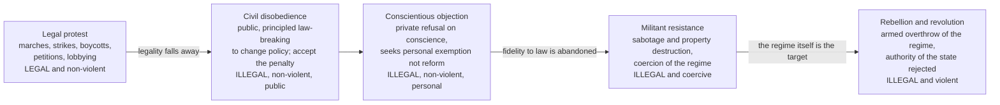

# ⚖️ Political Ethics and Civil Disobedience

> [!abstract] TL;DR
> **Political ethics** is the morality of political action — of **obligation** (do we have a duty to obey the law, and why?), **resistance** (when may we break it?), and **rule** (what may leaders do in the name of the public good?). Its central tension is the citizen's dilemma between the **duty to obey** a legitimate order and the **duty to resist** injustice. **Civil disobedience** — in **Rawls's** classic definition, *a public, non-violent, conscientious breach of law, undertaken within fidelity to law, to change policy or law* — occupies the narrow band where these duties collide: the disobedient breaks a law **openly** and **accepts the penalty**, precisely to signal that they still respect the legal order they are trying to reform. This distinguishes it from **ordinary crime** (covert, self-interested), from **conscientious objection** (a private request for exemption, not a public appeal for reform), and from **resistance, rebellion, and revolution** (which reject the regime's authority outright — **Locke's** right to revolution). A mirror-image problem faces those *in* power: the **problem of dirty hands** (**Machiavelli**, **Walzer**) asks whether the good political leader must sometimes do what is morally wrong — lie, coerce, use violence — for the public good, and how to hold both the necessity and the wrongness in view at once.

---

## Intuition

**Analogy:** You are driving a badly injured passenger to hospital at 3 a.m. and you reach a red light on a completely empty road. The law says stop. Every reason the law *exists* — protect people from collision — says go. So which do you owe: obedience to the *rule*, or fidelity to the *point* of the rule? Now change the case. The red light is not malfunctioning; it is **deliberately rigged** to keep certain people from reaching the hospital at all. The law itself has become the injury. Do you still owe it obedience?

That is the citizen's dilemma in miniature. We normally have a genuine duty to obey the law — living together requires it — yet the law can command injustice, and then a second duty pulls the other way: the duty to resist. **Civil disobedience** is what it looks like to break the rigged light *while still stopping to explain yourself to the officer* — running the red **in the open**, and then **waiting for the ticket** — because you are not rejecting traffic law as such, you are trying to fix the one light that has been turned into a weapon. The person who simply floods the intersection at speed to burn the whole system down is doing something else entirely: that is resistance or revolution, and it needs a different, heavier justification.

---

## How It Works

Political ethics sits at the seam between the individual conscience and the collective order. Three questions organize it.

**1. Why obey at all? The problem of political obligation.** A duty to obey the law *because it is the law* — a **content-independent** reason, binding even on laws you dislike — is surprisingly hard to ground. Five families of answer compete, each with a famous hole (developed fully in [[The_State_and_Political_Authority]]): **consent** (Locke — but almost no one *expressly* consented, and Hume shredded "tacit" consent), **fair play** (Hart, Rawls — you benefit from a cooperative scheme, so free-riding is unfair; but Nozick shows benefits can be *foisted* on you), **gratitude** (you owe a debt for what the state gave you; but gratitude does not obviously entail *obedience*), **natural duty** (Rawls — a duty to support just institutions; but why *this* state? — the particularity problem), and **associative** accounts (Dworkin — obligations of membership, like family ties). The **philosophical anarchist** (Wolff, Simmons) denies that *any* general duty to obey exists, since the duty of autonomy is incompatible with content-independent authority — while still allowing that we should not murder or steal. The upshot that makes disobedience *intelligible*: a state can be broadly **legitimate** yet issue a **particular** law you have no duty to obey. Obligation is real but **defeasible**.

**2. When may we break it? The spectrum of resistance.** Once obligation is defeasible, the question becomes *how* to break the law, and *how much*. The options form a spectrum ordered by **legality** and **means**, from ordinary politics through principled law-breaking to armed revolt.

**3. What may rulers do? Public morality and dirty hands.** The exercise of power raises the inverse problem. A leader responsible for millions cannot always keep clean hands: **Machiavelli** insisted the prince "must learn how not to be good"; **Walzer** argues the good politician is precisely the one who *knows* an act is wrong, does it because the public good requires it, and remains *guilty* of it — the wrongness is not cancelled by the necessity. This is **role morality**: the duties of office can license (and forbid) acts that private morality would judge differently — which is exactly why **corruption**, the abuse of public office for private gain, is a distinctively *political* wrong, not just ordinary theft.

### The spectrum of political action



The spectrum is not perfectly linear — **conscientious objection** is *milder in aim* than civil disobedience (it asks only to be left alone, not to change the world) yet still breaks the law, which is why it sits between overt reform-seeking disobedience and outright resistance rather than neatly after either. The crucial *moral* boundary is the one the diagram marks with "fidelity to law is abandoned": everything to its left still accepts the authority of the legal order and works *within* it; everything to its right withdraws that acceptance and needs the far heavier justification of a **right to revolution**.

---

## Key Concepts

### Secondary — the plain-language core
- **Political obligation.** The claim that you have a moral duty to obey the law *just because* it is the law. Real, but not unconditional.
- **Civil disobedience.** Breaking a law **openly**, **non-violently**, and **on principle** to protest an injustice — and then **accepting the punishment**. Gandhi's salt march, King's Birmingham campaign, Thoreau refusing his tax over slavery and the Mexican War.
- **Why accept the penalty?** Taking the punishment is the proof that you are protesting *this law*, not the *rule of law* itself. It converts a crime into a public moral appeal and shows the disobedient's sincerity and their continued respect for the legal order.
- **Not the same as ordinary crime.** A thief hides, acts for private gain, and evades punishment. The civil disobedient acts in the open, for a public cause, and *invites* arrest. Same broken statute, opposite moral character.
- **Conscientious objection.** "I personally will not do this" — the pacifist who refuses to be drafted, the nurse who declines to assist an execution. It seeks a **private exemption**, not to change everyone's law.

### Undergraduate — the working structure of the field
- **Rawls's definition and conditions.** In *A Theory of Justice*, civil disobedience is "a public, non-violent, conscientious yet political act contrary to law usually done with the aim of bringing about a change in the law or policies of the government." Rawls sets **conditions** for when it is *justified* in a **nearly just** society: (a) it addresses **substantial and clear injustice**, especially violations of equal basic liberties; (b) **normal legal and political channels have been tried** and failed; and (c) the action is **coordinated and restrained** so that a general resort to disobedience by all similarly aggrieved groups would not produce breakdown. It is a **public appeal to the community's shared sense of justice**, not private coercion.
- **King's "Letter from Birmingham Jail" (1963).** The canonical defense: "one has a moral responsibility to disobey unjust laws." King's test, drawing on Augustine and Aquinas, distinguishes a **just law** (one that "squares with the moral law") from an **unjust law** (one "out of harmony" with it — degrading, or applied to some but not the majority who made it). He insists the disobedient break the law "openly, lovingly, and with a willingness to accept the penalty."
- **Conscientious objection vs civil disobedience.** CO is **private, defensive, exemption-seeking**; CD is **public, communicative, reform-seeking**. The objector says "not through me"; the disobedient says "not in our name — change it." Blurring them is a common error.
- **The right to revolution (Locke).** In the *Second Treatise*, when government becomes systematically tyrannical and dissolves the trust on which it was founded, the people may "appeal to Heaven" and replace it — the philosophical charter behind the American Declaration of Independence. Revolution is not disobedience *within* the order but the **withdrawal of the order's authority**, requiring a far higher bar (see also political violence and just-cause thresholds).
- **The ethics of democratic citizenship.** Beyond obedience and resistance lies the everyday morality of the citizen: a duty to **vote** and deliberate in good faith, to seek **fair compromise**, to practice **toleration** of reasonable disagreement, and to speak **truthfully** in public. The rise of political **misinformation** and manipulation makes the ethics of political speech a live frontier (see [[Media_Propaganda_and_Political_Communication]]).
- **Corruption and role morality.** Public office is a **trust**, not a possession. **Corruption** — using the office for private gain — is wrong not merely as theft but as a betrayal of the fiduciary role, corroding the very legitimacy that grounds obligation. **Whistleblowing** is its counter-move: an insider breaks confidentiality or law to expose wrongdoing to the public — a political-ethical act on the same family tree as civil disobedience, judged by the seriousness of the wrong exposed, the exhaustion of internal channels, and the proportionality of the disclosure.

### Graduate — the load-bearing debates
- **The problem of dirty hands.** Can a leader be *right* to do what is *wrong*? **Machiavelli** severed political virtue from Christian virtue; **Sartre** named the problem in his play *Les Mains Sales*; **Michael Walzer's** "Political Action: The Problem of Dirty Hands" (1973) gives the sharpest modern statement: the good ruler is the one who commits the necessary wrong (ordering a coercive act, authorizing a lie) *and* recognizes it as wrong, carrying real **guilt**. This resists both the **utilitarian** dissolution (if it maximized welfare it was simply *right*, no residue) and the **absolutist** denial (never do wrong, *fiat justitia ruat caelum*). The distinctive claim is a **moral remainder**: the necessity does not erase the wrong.
- **The tension between effectiveness and moral purity.** Politics is the domain of consequences at scale, where clean hands can be a form of self-indulgence that lets greater evils proceed — yet unchecked "necessity" is the tyrant's oldest excuse. Weber's "**ethic of responsibility**" (weigh foreseeable consequences) versus the "**ethic of conviction**" (act on principle and leave results to God or history) frames the same divide.
- **Why accept punishment — obligation or strategy?** Two readings of the punishment requirement: a **principled** one (accepting the penalty *expresses* continued fidelity to law and the sincerity of conscience) and a **strategic / communicative** one (visible suffering dramatizes the injustice and moves the public — the logic of nonviolent "moral jiu-jitsu"). Critics (e.g., some readings of Dworkin) question whether accepting *unjust* punishment is really required or is sometimes itself a capitulation.
- **The threshold for revolution.** When does legitimate resistance become justified **revolution**, and by what standard of last resort, proportionality, and probability of success — criteria that echo the *jus ad bellum* of just-war theory applied inward against one's own state? Political violence must clear a bar far above civil disobedience precisely because it abandons fidelity to law and risks the very order that protects rights.
- **The ethics of protest tactics.** A live contemporary debate over the boundary of "civil": is **disruption** (blocking traffic, occupations) still within the Rawlsian ideal? Is **property destruction** (sabotage of pipelines, defacing monuments) compatible with "non-violence," or does it cross into militant resistance? Analysts distinguish **violence against persons** (widely rejected) from **coercive but non-injurious** tactics, and debate whether strict non-violence is a *moral requirement* or a *strategic choice* whose effectiveness is contingent.
- **Public vs private morality.** The recurring meta-question: are the standards binding on office-holders the *same* as those binding on private persons (with dirty hands as an unhappy exception), or does the political role generate a **genuinely distinct morality** with its own duties and permissions? How one answers reshapes obligation, resistance, and corruption alike.

---

## Python Demo

Why are revolutions and mass mobilizations so hard to predict — placid one week, unstoppable the next? The **threshold model** (**Granovetter, 1978**), joined to **Kuran's (1991)** theory of *preference falsification*, gives the mechanism. Each citizen has a private **threshold**: the fraction of *others* who must already be visibly participating before they, too, will join (fear of the regime, of standing out, of wasted effort keeps the threshold high). People hide their true discontent, so no one can see how much support a movement really has. Now lower everyone's threshold a little — a focal event, a wave of grievance, or an act of **civil disobedience** that visibly *shifts what others believe is possible* — and the system can flip **discontinuously** from near-total quiescence to mass participation. The point of principled, public law-breaking, on this reading, is precisely to **shift thresholds**: to reveal hidden preferences and lower the number of others each cautious citizen needs to see before acting. Uses only `numpy` and `matplotlib`.

```python
# Protest as a threshold cascade (Granovetter 1978; Kuran 1991).
# Each citizen joins a movement only once the FRACTION already participating
# meets their private threshold. A tiny downward shift in thresholds -- what a
# focal event, rising grievance, or an act of civil disobedience aims to
# produce -- can flip the society from quiescence to mass mobilization.
# This is why revolutions look impossible right up until they look inevitable.
import numpy as np
import matplotlib.pyplot as plt

rng = np.random.default_rng(7)
N = 20000

# Private thresholds: the fraction of others a citizen must see acting before
# they too will join. A cautious majority sits high; a few zealots near zero.
base_thresholds = np.clip(rng.normal(0.60, 0.20, N), 0.0, 1.0)

def cascade(thresholds, rounds=250):
    """Grow participation from the zealots upward; return the per-round path."""
    traj, r = [], 0.0
    for _ in range(rounds):
        r_new = np.mean(thresholds <= r)   # all whose threshold is now met join
        traj.append(r_new)
        if abs(r_new - r) < 1e-12:          # reached a stable equilibrium
            break
        r = r_new
    return np.array(traj)

def equilibrium(thresholds):
    return cascade(thresholds)[-1]

# Sweep a downward SHIFT applied to every threshold. Civil disobedience, focal
# events, and preference revelation (Kuran) all lower the number of others each
# citizen needs to see acting before they will act themselves.
shifts = np.linspace(0.0, 0.6, 200)
eq = np.array([equilibrium(np.clip(base_thresholds - s, 0.0, 1.0)) for s in shifts])

# The tipping point: the shift producing the largest one-step jump in turnout.
jump = int(np.argmax(np.diff(eq)))
tip = shifts[jump]

print("=== Protest cascade: threshold model ===")
print(f"Tipping shift ~ {tip:.3f}")
print(f"   just below: equilibrium participation = {eq[jump]:.3f}")
print(f"   just above: equilibrium participation = {eq[jump + 1]:.3f}")

# Two example histories from near-identical conditions: one fizzles, one erupts.
below = cascade(np.clip(base_thresholds - (tip - 0.01), 0.0, 1.0))
above = cascade(np.clip(base_thresholds - (tip + 0.01), 0.0, 1.0))

fig, (ax1, ax2) = plt.subplots(1, 2, figsize=(12, 5))

ax1.plot(shifts, eq, color="#b91c1c", lw=2.5)
ax1.axvline(tip, color="#2563eb", ls="--", lw=1.5)
ax1.annotate("tipping point:\na tiny extra shift\ntriggers mass mobilization",
             xy=(tip, eq[jump + 1]), xytext=(tip - 0.30, 0.55),
             arrowprops=dict(arrowstyle="->", color="#2563eb"),
             color="#2563eb", fontsize=9)
ax1.set_xlabel("Downward shift in thresholds\n[grievance, focal events, civil disobedience]")
ax1.set_ylabel("Equilibrium size of the movement")
ax1.set_title("A small shift triggers a sudden cascade")
ax1.set_ylim(-0.03, 1.03)
ax1.grid(alpha=0.25)

ax2.plot(below, "o-", color="#6b7280", lw=2, ms=4, label="just below tip: fizzles")
ax2.plot(above, "o-", color="#b91c1c", lw=2, ms=4, label="just above tip: cascades")
ax2.set_xlabel("Round of mobilization")
ax2.set_ylabel("Participation fraction")
ax2.set_title("Same society, near-identical conditions,\nopposite outcomes")
ax2.set_ylim(-0.03, 1.03)
ax2.legend(loc="center right", fontsize=9)
ax2.grid(alpha=0.25)

plt.tight_layout()
plt.savefig("protest_cascade.png", dpi=120)
plt.show()
```

**What it shows.** The left panel sweeps how far thresholds have been shifted down and plots the *equilibrium* size the movement settles at. For most of the range the movement barely exists — then, at a sharp **tipping point**, the equilibrium leaps from near-zero to near-total. The right panel takes two societies on opposite sides of that point, differing by a hair, and runs the actual round-by-round dynamics: one movement fizzles after a handful join, the other cascades to the whole population. This is the formal core of why mobilization is **unpredictable** (the same visible conditions can sit on either side of an invisible threshold), why **preference falsification** hides the coming storm (everyone privately near their threshold, no one able to see it), and why **civil disobedience** is strategically potent out of all proportion to its numbers: a small band that visibly and courageously acts can lower everyone else's threshold just enough to move the system across the tipping point. The dynamics link directly to [[Cascades_and_Systemic_Risk]], [[Bifurcations_and_Tipping_Points]], and [[Agent_Based_Modeling]] in the Systems Thinking vault.

---

## Real-World Applications

- **The US civil rights movement.** The paradigm case of Rawlsian civil disobedience: the Montgomery bus boycott, lunch-counter sit-ins, and the Birmingham campaign broke segregation laws **openly and non-violently**, accepted mass arrest, and appealed to the nation's professed sense of justice — culminating in the Civil Rights Act of 1964. King's "Letter" is its written charter.
- **Gandhi and Indian independence.** *Satyagraha* — "truth-force" — turned mass non-violent law-breaking (the 1930 Salt March against the salt monopoly) into an anti-colonial strategy, explicitly designed to make the injustice of the response visible and to raise the political cost of repression.
- **Anti-war conscientious objection.** Draft resistance across the two World Wars and Vietnam sharpened the CO/CD distinction in law: legal regimes now often grant formal **conscientious-objector status** (a private exemption) precisely because the state recognizes a claim of conscience distinct from public protest.
- **Whistleblowing.** Insiders exposing state or corporate wrongdoing — Ellsberg and the Pentagon Papers, later Snowden — enact a contested political ethic: breaking law or confidentiality to serve the public's right to know, judged by the gravity of the wrong, exhaustion of internal channels, and proportionality of disclosure.
- **Climate and disruption tactics.** Extinction Rebellion, Just Stop Oil, and pipeline sabotage debates test the modern **boundary of "civil"**: whether road-blocking, occupations, and property destruction remain within non-violent civil disobedience or cross into militant resistance — a live case in the ethics of protest tactics.
- **Governing in emergencies.** Wartime leaders authorizing coercion, deception, or surveillance for the public good — the textbook home of the **dirty-hands** problem, where the necessity and the wrongness of the act both have to be acknowledged rather than one wished away.

---

## Common Pitfalls

- **Collapsing civil disobedience into ordinary crime.** The whole moral point is *publicity plus acceptance of penalty*. A covert, self-interested law-break is a crime; the disobedient's openness and willingness to be punished is what marks continued fidelity to law. Strip that out and the justification evaporates.
- **Confusing conscientious objection with civil disobedience.** CO seeks a **private exemption** ("not through me"); CD is a **public appeal for reform** ("change this for everyone"). They answer to different justifications, and treating a demand for personal exemption as if it were a reform campaign — or vice versa — misfires.
- **Treating "no duty to obey" as "anything goes."** Even the philosophical anarchist grants that independent moral reasons still forbid violence and theft. Denying a *content-independent* duty to obey is not a license for lawlessness; disobedience still needs its own positive justification.
- **Assuming legitimacy settles obligation.** A broadly legitimate state can still enact a particular unjust law you have no duty to obey. Conflating the state's *right to rule* with a citizen's *duty to obey each law* (the error dissected in [[The_State_and_Political_Authority]]) obscures the whole space in which disobedience operates.
- **Utilitarian erasure of dirty hands.** Concluding that because a wrong act produced the best outcome it was therefore simply *right*, with no moral remainder. Walzer's point is that the necessity does **not** cancel the wrong — losing the "guilt" loses the phenomenon and removes a real check on power.
- **"Necessity" as a blank cheque.** The mirror pitfall: invoking dirty hands or emergency to license whatever the powerful find convenient. The concept is meant to be *rare, tragic, and accountable*, not a standing excuse — the tyrant's oldest move is to declare a permanent emergency.
- **Confusing non-violence with a mere tactic vs. a principle.** Sliding between "non-violence is morally required" and "non-violence just works better" without noticing which claim you are making — they have different implications for when, if ever, disruptive or destructive tactics become permissible.

---

## Related Concepts

*(This note anchors section S05 — Social, Political, and Economic Ethics. Planned siblings on Just War and the Ethics of Violence, Distributive Justice and Inequality, Global Justice and Human Rights, and Business Ethics are not yet written and are intentionally not linked here.)*

**Within the Ethics vault**
- [[Applied_Ethics_Overview]] — the parent survey; political ethics is one of its most consequential branches.
- [[Ethical_Frameworks_in_Practice]] — supplies the consequentialist, deontological, and virtue lenses used to weigh obligation, resistance, and dirty hands.
- [[Moral_Reasoning_and_Case_Analysis]] — the method for adjudicating the hard cases (justified disobedience, the leader's dilemma) that this note poses.

**Philosophy vault (foundations)**
- [[The_State_and_Political_Authority]] — the theory of legitimacy and political obligation (consent, fair play, gratitude, natural duty, philosophical anarchism) that makes disobedience intelligible.
- [[The_Social_Contract]] — Hobbes, Locke, and Rousseau on why we should obey the sovereign, and Locke's right of revolution when the trust is broken.
- [[Justice_and_Rawls]] — Rawls's theory of justice, the frame within which he defines and conditions civil disobedience in a "nearly just" society.
- [[Liberty_and_Rights]] — the limits of legitimate state coercion; where authority may not reach.
- [[Equality_Marxism_and_Anarchism]] — social anarchism and the Marxist critique of the state as an instrument of class rule.

**Law vault**
- [[Rule_of_Law_and_Due_Process]] — the legal ideal the disobedient claims fidelity to even while breaking a particular law; the standard against which "unjust law" is measured.
- [[Rights_and_Civil_Liberties]] — the protected liberties (speech, assembly, protest) whose violation is the usual trigger for justified disobedience.

**Political Science vault**
- [[Political_Participation_and_Civil_Society]] — protest and social movements as forms of participation; the empirical study of mobilization.
- [[Social_Contract_Theory]] — the political-science treatment of consent, obligation, and the grounds of the state.
- [[Media_Propaganda_and_Political_Communication]] — the ethics of political speech, persuasion, and misinformation in democratic citizenship.
- [[Democratic_Backsliding_and_Polarization]] — where the ethics of resistance meets the erosion of the very order that grounds obligation.
- [[Human_Rights_and_International_Law]] — the rights framework invoked to justify resistance to, and intervention against, gross injustice.

**Systems Thinking vault (the cascade dynamics)**
- [[Cascades_and_Systemic_Risk]] — the general theory of threshold-driven cascades the demo instantiates.
- [[Network_Dynamics_and_Contagion]] — how participation spreads through social ties.
- [[Bifurcations_and_Tipping_Points]] — the discontinuous flip from quiescence to mass movement.
- [[Criticality_and_Phase_Transitions]] — the physics-of-many-agents view of sudden collective change.
- [[Agent_Based_Modeling]] — the modeling method behind the threshold simulation.

---

## Review Questions

1. **(Comprehension)** State Rawls's definition of civil disobedience and explain why each element — *public*, *non-violent*, *conscientious*, *within fidelity to law*, *accepting the penalty* — is doing work. Using two of those elements, explain precisely how civil disobedience differs from (a) ordinary crime and (b) conscientious objection.
2. **(Application)** A climate group blockades a motorway and, separately, sabotages an empty oil pipeline, in each case courting arrest and publicly explaining their reasons. A legitimate but flawed democracy has repeatedly ignored the issue through normal channels. Using Rawls's conditions for justified civil disobedience *and* the violence/coercion/property-destruction distinctions from the "protest tactics" debate, argue which (if either) act qualifies as justified civil disobedience and which crosses into militant resistance — and say what further facts would change your verdict.
3. **(Synthesis / evaluation)** A prime minister authorizes a deception of the public to prevent a foreseeable atrocity. Reconstruct the **dirty-hands** analysis (Walzer), then contrast it with how a strict **utilitarian** and a strict **absolutist** would each judge the act. Does the notion of a "moral remainder" survive scrutiny, or is it a confusion? Defend a position, and say explicitly whether you think political office generates a **genuinely distinct morality** or the *same* morality with tragic exceptions.

---

## Sources

- Rawls, J. (1971). *A Theory of Justice*. Harvard University Press. (Chs. 55–59 on civil disobedience and conscientious refusal in a nearly just society.)
- King, M. L. Jr. (1963). "Letter from Birmingham Jail." (Reprinted in *Why We Can't Wait*, 1964.)
- Walzer, M. (1973). "Political Action: The Problem of Dirty Hands." *Philosophy & Public Affairs*, 2(2), 160–180.
- Granovetter, M. (1978). "Threshold Models of Collective Behavior." *American Journal of Sociology*, 83(6), 1420–1443.
- Kuran, T. (1991). "Now Out of Never: The Element of Surprise in the East European Revolution of 1989." *World Politics*, 44(1), 7–48.
- Thoreau, H. D. (1849). "Resistance to Civil Government" ("Civil Disobedience").

---

#ethics #political-ethics #civil-disobedience #political-obligation #dirty-hands
