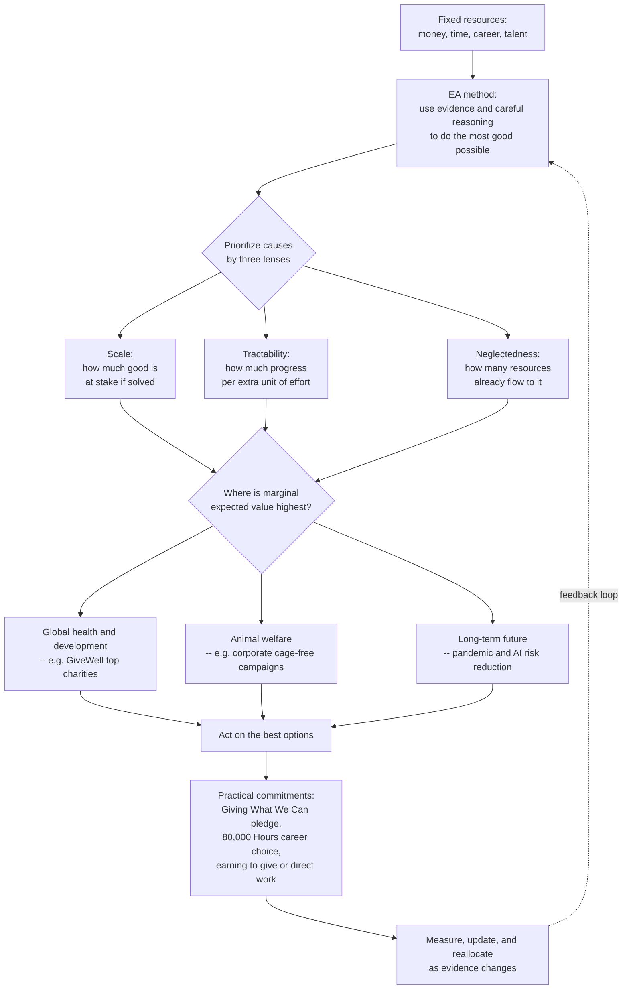

# 🎯 Effective Altruism and Doing Good

> [!abstract] TL;DR
> **Effective altruism (EA)** is the project of using **evidence and careful reasoning to do the most good possible** with whatever resources — money, time, career — you are willing to devote to helping others (Singer, MacAskill, Ord). Its philosophical engine is **impartial beneficence**: if suffering is bad, it is bad no matter *whose* it is or *how far away*, so Singer's drowning-child argument concludes we have strong obligations to the distant poor. Its distinctive empirical claim is that **effectiveness varies enormously** — the best global-health interventions avert a unit of suffering for *hundreds to thousands of times* less money than typical ones — so *where* you give matters far more than *that* you give. The method is **cause prioritization** by **scale, tractability, and neglectedness**, plus **cost-effectiveness analysis**, **expected value under uncertainty**, and **counterfactual impact**. It has crystallized around three cause areas — **global health and development** (GiveWell's evidence-vetted charities), **animal welfare**, and the **long-term future / existential risk** (the "longtermism" turn) — and into practical commitments like the **Giving What We Can** pledge and **80,000 Hours** career advice, including the contested strategy of **earning to give**. EA is essentially **applied consequentialism**, and it inherits consequentialism's power *and* its pathologies: a **legibility bias** toward measurable causes over systemic/political change, brutal **demandingness**, **fanaticism** and Pascal's-mugging worries in longtermist expected-value reasoning, and the **FTX collapse** as a live case study in "ends justify the means." Yet its core discovery survives every critique: the effectiveness spread is *real*, and ignoring it wastes lives.

---

## Intuition — analogy first

**If you're going to give, why not give where it does the most good?**

Imagine two people each donate the same $40,000 to fight blindness in the developing world. The first funds **guide dogs** trained in a wealthy country; that money trains and places roughly one dog for one blind person. The second funds **cataract surgeries** in a low-income country, where restoring sight costs a few tens of dollars per operation; that same $40,000 cures blindness for **hundreds of people**. Both donors are generous. Both feel good. But one did *hundreds of times more good* with identical money — and if you cared about the *outcome* rather than the *gesture*, that difference should be unbearable to ignore.

Effective altruism treats charity the way a serious investor treats returns: not "did I put money in?" but "how much good came out **per dollar**?" — where the return is measured in lives saved, years of healthy life restored, or suffering averted rather than profit. The uncomfortable premise is that most giving leaves that return almost entirely to chance, and that a little cold arithmetic on top of a warm heart can multiply the good you do by orders of magnitude.

---

## How It Works

### The philosophical root: impartial beneficence

EA descends from **Peter Singer's 1972 drowning-child argument**. If you passed a child drowning in a shallow pond, you would be a monster not to wade in and save her, even at the cost of ruining an expensive suit. Singer's claim: **distance and identity are morally irrelevant** — a child dying of a preventable disease an ocean away has the same moral claim on you as the child in the pond, and the modest cost of ruined clothes is analogous to the modest cost of a donation that saves a life. The conclusion is a strong, impartial duty of **beneficence**: we ought to prevent very bad things when we can do so at comparatively little cost to ourselves. This is straightforwardly the outcome-first, everyone-counts-for-one logic of **utilitarian and broadly consequentialist ethics** (see [[Consequentialism_and_Utilitarianism]]); EA is best understood as that theory *operationalized* into a practical program.

### The empirical discovery: effectiveness varies by orders of magnitude

The move from philosophy to *program* rests on an empirical fact documented in global-health economics: interventions are **not** roughly equally good. Toby Ord's analysis of the Disease Control Priorities data found the most cost-effective health interventions delivering **thousands of times** more benefit per dollar than the least — and even the best being several times better than the *median*. If effectiveness were roughly uniform, "give effectively" would be a footnote. Because it is wildly non-uniform, **choosing well is the single highest-leverage decision a donor makes** — often mattering more than how much you give.

### The method: cause prioritization and cost-effectiveness

EA turns "do the most good" into a searchable question with a few tools:

1. **The scale / tractability / neglectedness framework.** For any cause, ask: **Scale** — how much good is at stake if solved? **Tractability** — how much progress do we get per extra unit of effort? **Neglectedness** — how many resources already flow there (because the marginal dollar does more where few dollars go). Multiplying these estimates a cause's **marginal expected value** — the good from the *next* dollar or hour, which is what a new contributor actually controls.
2. **Cost-effectiveness analysis.** Estimate **cost per unit of good**: cost per life saved, per **QALY** (quality-adjusted life-year) gained, or per **DALY** (disability-adjusted life-year) *averted* — the same currency used in health-resource allocation (see [[Justice_in_Health_and_Resource_Allocation]]).
3. **Expected value under uncertainty.** Since we rarely *know* an intervention's effect, weight outcomes by probability and compare *expected* good. This lets EA take seriously high-uncertainty, high-stakes bets — but also opens the door to **fanaticism** (below).
4. **Counterfactual impact.** Credit an action only for the good that **would not otherwise have happened.** Funding a surgery someone else would have funded anyway achieves nothing on the margin; the question is always "what changes *because of me*?"

### The three cause areas

- **Global health and development.** The founding, evidence-heaviest area. **GiveWell** runs deep cost-effectiveness reviews and recommends a short list of charities (bed nets against malaria, vaccination, direct cash transfers, vitamin supplementation) where a life is plausibly saved for a few thousand dollars.
- **Animal welfare.** Extending impartial beneficence past the species boundary (see [[Animal_Ethics_and_Rights]]): factory farming inflicts suffering on tens of billions of sentient animals, and corporate cage-free/welfare campaigns look extraordinarily cheap per unit of suffering reduced — a highly *neglected* cause at vast *scale*.
- **The long-term future / existential risk.** If humanity's future could contain an astronomical number of worthwhile lives, then reducing the risk of **extinction or permanent collapse** — from engineered pandemics or misaligned AI (see [[AI_Alignment_and_Existential_Risk]]) — may be the highest-value cause of all. This is the **longtermism** turn (MacAskill's *What We Owe the Future*, Ord's *The Precipice*), grounded in our obligations to **future generations** (see [[Future_Generations_and_Intergenerational_Justice]]).

### Careers and commitments

Beyond donations, EA reframes **career choice** as your largest lever: **80,000 Hours** (the ~80,000 working hours of a career) advises using that time for maximum impact, whether by **direct work** on a top problem or by **earning to give** — deliberately taking a high-paying job to donate a large share. Practical commitments include **Giving What We Can**, whose members **pledge** to give at least 10 percent of income to the most effective charities they can find.



---

## Key Concepts

### Secondary — the core idea

- **Do the most good, not just some good.** Generosity is not enough; *where* the help goes can matter hundreds of times more than *how much* is given.
- **Everyone counts equally.** A life saved far away counts the same as one saved nearby — Singer's drowning child scaled to the whole world.
- **Measure the return.** Ask "how much good per dollar?" the way an investor asks "how much profit per dollar?" — measured in lives improved.
- **The three questions for any cause.** Is it *big* (scale), *solvable* (tractable), and *overlooked* (neglected)?

### Undergraduate — the working machinery

- **Impartial beneficence.** The duty to prevent bad outcomes wherever they occur, weighting no one's suffering as less real for being distant or unfamiliar — EA's ethical premise (see [[Ethical_Frameworks_in_Practice]]).
- **Cost-effectiveness in QALYs / DALYs.** The common currency of "good": cost per healthy life-year gained or lost-year averted, letting unlike interventions be ranked on one axis.
- **Marginal expected value.** New contributors control the *next* dollar or hour, so the right question is the value of the marginal contribution — which is why *neglectedness* matters (diminishing returns mean crowded causes pay less on the margin).
- **Counterfactual impact.** Only good that would not otherwise have happened counts; this reshapes career and donation choices around *additionality*.
- **The three cause areas.** Global health/development, animal welfare, and the long-term future — chosen because each scores high on some combination of scale, tractability, and neglectedness.
- **Earning to give vs direct work.** Two strategies for maximizing career impact; which dominates depends on your comparative advantage and the funding-vs-talent bottleneck in your chosen cause.

### Graduate — the contested frontier

- **Longtermism, strong and weak.** *Weak* longtermism (the far future is *a* key priority) is hard to reject; *strong* longtermism (positively shaping the far future is *the* key priority of our time) is the controversial claim, resting on expected-value reasoning over astronomically large future populations.
- **Fanaticism and Pascal's mugging.** A decision rule that always maximizes expected value will let a *tiny* probability times an *astronomical* payoff dominate every choice — making the theory exploitable by anyone with a sufficiently grand story and arguably irrational (see [[AI_Alignment_and_Existential_Risk]] and [[Moral_Reasoning_and_Case_Analysis]] on robust decision-making under deep uncertainty).
- **Cluelessness.** Over long horizons the indirect effects of our actions swamp the direct ones, and we often cannot even guess their *sign* — a deep challenge to confident cost-effectiveness estimates for anything but near-term, measurable interventions.
- **The legibility / measurement bias.** EA's methods systematically favor causes whose effects are *quantifiable* (bed nets, deworming) over diffuse, hard-to-measure systemic and **political** change (institutions, movements, structural inequality) — potentially the highest-value work of all, which never shows up in the spreadsheet.
- **Demandingness.** Impartial beneficence, taken seriously, seems to demand giving until further giving would hurt you as much as it helps others — a standard so severe it may be psychologically unsustainable and self-defeating; EA's 10 percent pledge is partly a pragmatic retreat from the theory's full demand.
- **Applied consequentialism vs pluralism.** EA is consequentialism with a clipboard; critics argue a mature ethics is **pluralist** — that rights, special obligations, justice, and integrity are not reducible to an expected-value tally, and that EA's blind spots are exactly the ones a purely aggregative theory always has (see [[Ethical_Frameworks_in_Practice]] on the *separateness of persons*).

---

## Python Demo

The demo makes EA's central empirical claim concrete: **the spread in cost-effectiveness across interventions is enormous**, so choosing well multiplies the good you do. Panel A ranks health interventions by good-per-dollar on a log scale; Panel B shows that, for one fixed budget, funding the most cost-effective options first ("choose well") buys far more total good than spreading the money thinly. Uses only numpy and matplotlib.

```python
# Effective altruism's core claim, quantified:
# cost-effectiveness varies by ORDERS OF MAGNITUDE across interventions,
# so WHERE you give dominates HOW MUCH you give.
import numpy as np
import matplotlib.pyplot as plt

# Illustrative "cost per DALY averted" (USD). DALY = disability-adjusted
# life-year; lower cost per DALY = more good per dollar. These figures echo
# the RANGE in the Disease Control Priorities Project / GiveWell-style work.
# NOTE: real estimates carry huge uncertainty (often a plausible 10x band).
names = np.array([
    "Oral rehydration therapy",
    "Vitamin A supplementation",
    "Childhood vaccination",
    "Insecticide-treated bed nets",
    "Deworming (contested)",
    "TB treatment (DOTS)",
    "Cataract surgery",
    "HIV antiretroviral therapy",
    "Hospital dialysis",
    "Late-stage cancer care",
])
cost_per_daly = np.array([8., 12., 20., 30., 25., 45., 60., 550., 40000., 65000.])

# Convert to GOOD per $1000 = DALYs averted per $1000 spent.
daly_per_1000 = 1000.0 / cost_per_daly

order   = np.argsort(daly_per_1000)          # worst -> best for a tidy barh
names_s = names[order]
eff_s   = daly_per_1000[order]

spread      = eff_s.max() / eff_s.min()
best_v_med  = eff_s.max() / np.median(eff_s)
print(f"Best is {spread:,.0f}x more cost-effective than worst.")
print(f"Best is {best_v_med:.0f}x better than the MEDIAN intervention.")

# --- Panel B setup: same budget, 'choose well' vs 'spread thin' --------------
# Each intervention can only absorb so much money before saturating
# ('room for more funding'), so you cannot pour an infinite budget into #1.
eff_best_first = daly_per_1000[np.argsort(-daly_per_1000)]   # best first
room_best_first = np.array([3e6, 3e6, 5e6, 5e6, 2e6, 4e6, 4e6, 8e6, 2e6, 2e6])

def dalys_for_budget(B, per_intervention_share=None):
    """Total DALYs averted spending budget B (USD), respecting room caps."""
    total, remaining = 0.0, B
    if per_intervention_share is None:              # GREEDY: best-first
        for cap, eff in zip(room_best_first, eff_best_first):
            spend = min(cap, remaining)
            total += spend / 1000.0 * eff
            remaining -= spend
            if remaining <= 0:
                break
    else:                                           # EVEN: equal split
        share = B / len(eff_best_first)
        for cap, eff in zip(room_best_first, eff_best_first):
            total += min(cap, share) / 1000.0 * eff
    return total

budgets = np.linspace(0, 2.0e7, 400)                # up to $20M
greedy  = np.array([dalys_for_budget(B) for B in budgets])
even    = np.array([dalys_for_budget(B, per_intervention_share=True)
                    for B in budgets])

# --- Plots -------------------------------------------------------------------
fig, (ax1, ax2) = plt.subplots(1, 2, figsize=(13, 5.2))

ax1.barh(np.arange(len(eff_s)), eff_s, color="#059669")
ax1.set_yticks(np.arange(len(eff_s)))
ax1.set_yticklabels(names_s, fontsize=8)
ax1.set_xscale("log")
ax1.set_xlabel("DALYs averted per $1000  (log scale)")
ax1.set_title(f"Cost-effectiveness spans ~{spread:,.0f}x\n(the spread that motivates EA)")

ax2.plot(budgets / 1e6, greedy, color="#059669", lw=2.5,
         label="Choose well (fund best-first)")
ax2.plot(budgets / 1e6, even,   color="#b45309", lw=2.5, ls="--",
         label="Spread thin (split evenly)")
ax2.set_xlabel("Total budget spent (USD millions)")
ax2.set_ylabel("Total DALYs averted")
ax2.set_title("Same money, different good:\nprioritization is the lever")
ax2.legend()

# Annotate the gap at a $5M budget.
b_mark = 5.0
g5 = dalys_for_budget(b_mark * 1e6)
e5 = dalys_for_budget(b_mark * 1e6, per_intervention_share=True)
ax2.annotate(f"at $5M: {g5/e5:.1f}x more good\nby choosing well",
             xy=(b_mark, g5), xytext=(b_mark + 3, g5 * 0.55),
             arrowprops=dict(arrowstyle="->"), fontsize=9)

plt.tight_layout()
plt.savefig("effective_altruism_cost_effectiveness.png", dpi=120)
plt.show()
```

**What it shows.** Panel A: on a *log* axis, the interventions fan across roughly **four orders of magnitude** — the cheapest averts a DALY for single-digit dollars while high-tech late-stage care costs tens of thousands, and the best is many times better than even the *median*. Panel B: with one fixed budget, funding the most cost-effective options first buys **several times more total good** than spreading the same money evenly across all ten. That gap *is* the EA thesis in one picture — prioritization, not just generosity, is the lever. **The essential caveat:** every number here is an *estimate* under deep uncertainty; real cost-effectiveness figures carry wide error bars, can be revised by an order of magnitude, and (for longtermist causes especially) may not be reliably measurable at all — which is exactly the "legibility bias" critique the plot cannot show.

---

## Real-World Applications

> **Example:** **GiveWell.** The clearest institutional embodiment of EA. GiveWell publishes exhaustive, versioned cost-effectiveness models and recommends only a handful of charities — the Against Malaria Foundation (bed nets), Malaria Consortium (seasonal chemoprevention), Helen Keller International (vitamin A), and cash-transfer programs — where its estimates put the cost of saving a life in the low thousands of dollars. It has directed well over a billion dollars on the strength of those spreadsheets, and openly revises recommendations when evidence shifts.

- **Open Philanthropy** applies the scale/tractability/neglectedness lens across grantmaking that spans global health, farm-animal welfare, biosecurity, and AI safety — the same framework, one funder, three cause areas.
- **80,000 Hours** turns career choice into an impact-maximization problem, steering talented graduates toward high-leverage problems and popularizing (then partly de-emphasizing) **earning to give**.
- **Giving What We Can** operationalizes the pledge; tens of thousands have committed 10 percent of lifetime income to effective charities.
- **Corporate animal-welfare campaigns** (cage-free and broiler commitments) are EA-funded bets justified by extraordinary estimated suffering-reduction per dollar — the movement's animal-welfare arm in action.
- **Biosecurity and AI-safety funding** (pandemic preparedness, model evaluations, alignment research) is the longtermist arm putting the existential-risk case (see [[AI_Alignment_and_Existential_Risk]]) into practice.

---

## Common Pitfalls

- **Legibility / measurement bias.** EA's methods reward what can be *counted*, so they tilt toward bed nets and deworming and away from diffuse **systemic and political change** (institution-building, movements, reducing structural inequality) whose payoff may be larger but is unmeasurable. Treating "not in the spreadsheet" as "not valuable" is the deepest recurring error — and the critics' central charge that EA depoliticizes poverty.
- **Fanaticism and Pascal's mugging.** Naively maximizing expected value lets a *tiny* probability of an *astronomical* payoff swallow every decision, so any dramatic enough story ("this reduces extinction risk by 0.0001 percent") can hijack all resources. The corrective is robust, worldview-diverse decision-making that preserves option value rather than chasing the single biggest number.
- **Demandingness and its psychology.** Impartial beneficence taken literally can demand near-total self-sacrifice, breeding burnout, guilt, and scrupulosity — and an unlivable ethic helps no one. The 10 percent pledge is a deliberate, sustainable compromise, not the theory's true ceiling.
- **"Ends justify the means" — the FTX collapse.** Sam Bankman-Fried, a prominent EA donor, defrauded customers of billions while professing to earn-to-give at scale; his 2023 conviction became the movement's reckoning with **naive consequentialism** — the illusion that good goals sanctify bad acts. It vindicates why serious consequentialists still endorse rule-following, honesty, and side-constraints (see [[Ethical_Frameworks_in_Practice]]).
- **Earning to give in harmful industries.** Taking a lucrative but *net-harmful* job to fund charity can destroy more value than the donations create, and ignores the counterfactual that someone else would do the harm anyway only if the role is truly fungible. The good you fund must be netted against the harm you do.
- **Paternalism and the politics of aid.** Outsiders ranking interventions by *their* metrics can override recipient priorities and reproduce a technocratic, apolitical model of development that sidesteps power, colonial history, and self-determination.
- **False precision.** Reporting a point estimate ("$4,500 per life saved") without its wide error bars launders deep uncertainty as arithmetic and invites overconfident reallocation.

---

## Related Concepts

*(All wikilinks below were verified to exist in the vault. Dedicated notes for Global Justice, Distributive Justice, and Population Ethics are not yet written here, so those ideas — Singer's obligations to the distant poor, the equality-vs-effectiveness debate, and total-vs-average population views — appear in prose above without links.)*

- [[Consequentialism_and_Utilitarianism]] — EA's ethical engine; it is essentially this theory operationalized into a donation-and-career program, and it inherits both the aggregative power and the pathologies.
- [[Ethical_Frameworks_in_Practice]] — the pluralist counterweight: why rights, integrity, and the *separateness of persons* resist reduction to an expected-value tally, and why naive consequentialism fails.
- [[Future_Generations_and_Intergenerational_Justice]] — the longtermism turn: our obligations to people who do not yet exist, and the cluelessness and fanaticism objections to acting on the far future.
- [[AI_Alignment_and_Existential_Risk]] — the flagship longtermist cause area and the shared expected-value-under-deep-uncertainty problem EA's x-risk arm confronts.
- [[Animal_Ethics_and_Rights]] — the animal-welfare cause area; impartial beneficence extended past the species boundary to factory-farmed sentience.
- [[Justice_in_Health_and_Resource_Allocation]] — the QALY/DALY machinery EA borrows for cost-effectiveness, plus the fairness objections to ranking lives by health-economic value.
- [[Moral_Status_and_the_Moral_Circle]] — whose interests count: distant strangers, animals, and future people are the widening circle EA's impartiality commits it to.
- [[Moral_Reasoning_and_Case_Analysis]] — reasoning under moral and empirical uncertainty, the method for avoiding both dismissal and fanaticism.
- [[Applied_Ethics_Overview]] — the section parent situating EA within the broader map of applied ethics.

---

## Review Questions

1. **(Secondary)** Using the guide-dog-vs-cataract-surgery example, explain in your own words why an effective altruist thinks *where* you donate can matter more than *how much* you donate. What single empirical fact makes this claim true rather than trivial?
2. **(Undergraduate)** A friend gives $500 to a local charity that a wealthy patron was already fully funding. Using the concepts of **counterfactual impact** and **neglectedness**, explain why an EA analyst would judge the *marginal* good of this gift to be near zero, and what the friend could do instead.
3. **(Graduate)** Longtermism argues that reducing a tiny probability of human extinction can outrank saving many lives today, because the future is astronomically large. (a) Reconstruct that expected-value argument. (b) Name and explain the decision-theoretic objection it invites (hint: it also afflicts a mugger who promises infinite reward). (c) Given the FTX collapse and the legibility-bias critique, argue whether EA is better understood as a *replacement* for pluralist ethics or as one *tool* within it — and defend your answer.

---

## Sources

- Singer, P. (1972). "Famine, Affluence, and Morality." *Philosophy & Public Affairs*, 1(3). (The drowning-child argument and obligations to the distant poor.)
- MacAskill, W. (2015). *Doing Good Better: Effective Altruism and a Radical New Way to Make a Difference*. Gotham Books. (Cost-effectiveness, counterfactuals, and the movement's founding case.)
- MacAskill, W. (2022). *What We Owe the Future*. Basic Books. (The longtermism turn and its defense.)
- Ord, T. (2013). "The Moral Imperative toward Cost-Effectiveness in Global Health." Centre for Effective Altruism. (The empirical spread in health-intervention effectiveness.)
- Ord, T. (2020). *The Precipice: Existential Risk and the Future of Humanity*. Hachette. (Existential risk as a top moral priority.)
- Srinivasan, A. (2015). "Stop the Robot Apocalypse." *London Review of Books*, 37(18). (The systemic-change and legibility critique of effective altruism.)

---

#ethics #effective-altruism #cost-effectiveness #cause-prioritization #doing-good
