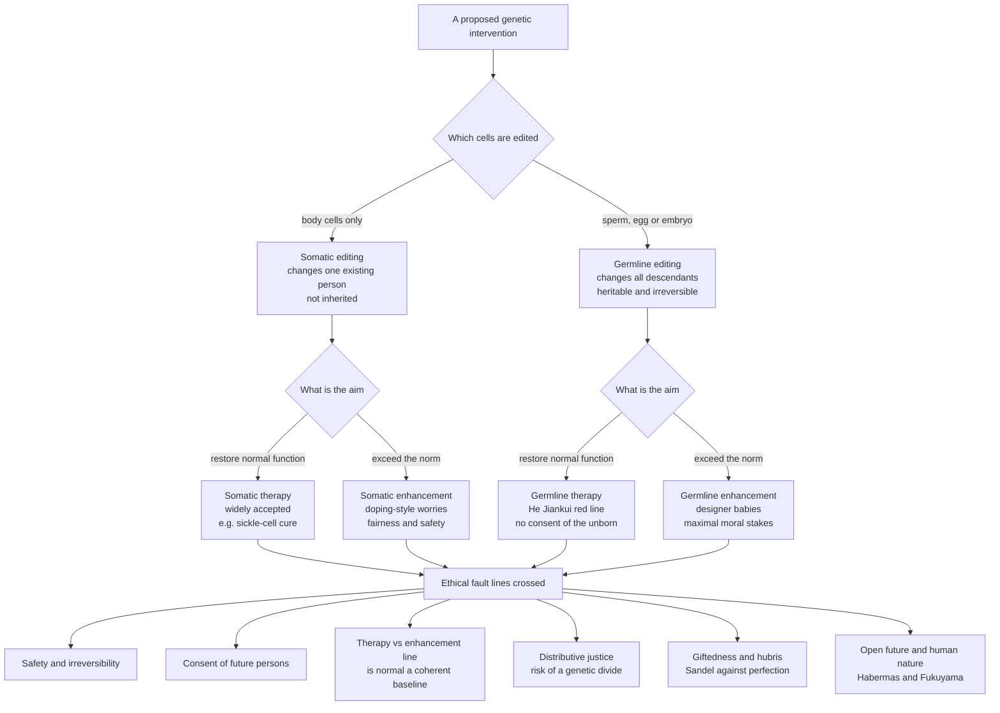

# 🧬 Genetic Engineering and Enhancement Ethics

> [!abstract] TL;DR
> For the whole history of our species we could only *read* the genome; with tools like CRISPR-Cas9 we can now *rewrite* it. This note is about whether, when, and how far we should — and it argues that the moral weight lives in **two distinctions plus one background condition**. First, **somatic vs germline**: editing the cells of one existing person is ethically ordinary medicine, but editing sperm, egg, or embryo rewrites *every descendant* without their consent and is effectively irreversible — the line the He Jiankui "CRISPR babies" scandal crossed. Second, **therapy vs enhancement**: curing sickle-cell disease feels different from engineering a "better" child, though whether that line is philosophically *coherent* is itself contested. Third, and cutting across everything, the **distributive-justice** condition: an enhancement that only the wealthy can buy threatens to biologically entrench inequality — the GATTACA "genetic divide" — which is why many argue *unequal access*, not enhancement as such, is the deepest worry. The note lays out the strongest arguments **for** (Savulescu's procreative beneficence, continuity with medicine and education, morphological freedom) and **against** (Sandel's giftedness, Habermas's open future, Fukuyama on human nature, safety and irreversibility) without endorsing any.

---

## Intuition

**Analogy — from proofreader to author.** For thousands of years, our relationship to heredity was that of a *reader*. We could observe traits, breed selectively, and (recently) *sequence* a genome the way you can read a printed book — but we could not change the words on the page. Then, with restriction enzymes, then with CRISPR-Cas9, humanity was handed a **pencil with an eraser** and, for the first time, could sit down at the manuscript of life and *edit the text itself*: delete a lethal typo, swap one letter for another, insert a new sentence.

Once you hold that pencil, three questions become unavoidable, and they map onto how any editor thinks about a manuscript:

1. **Whose copy am I editing?** If I correct the typo only in *this* printing (a somatic edit), it affects one book. If I correct it in the *master plates* (a germline edit), every future printing inherits the change — including copies no one has printed yet and no one can consult.
2. **Am I fixing an error or rewriting the story?** Erasing a genuine typo (therapy) feels different from rewriting the plot to suit my taste (enhancement) — but who decides which is which, and is "the original text" even a coherent standard to appeal to?
3. **Who gets a pencil?** If only some authors can afford the pencil, the manuscripts of the rich and the poor will, over generations, literally diverge — and heredity will start to encode wealth.

Everything technical below is an attempt to reason carefully about a species that has just been handed the pencil.

---

## How It Works

### The two distinctions that carry the moral weight

Most of the ethics organizes around *where on two axes* a proposed intervention sits.

**Axis 1 — Somatic vs germline (the heritability axis).** A **somatic** edit alters the non-reproductive cells of a person who already exists; it affects only that individual and dies with them. This is, ethically, continuous with ordinary medicine: it needs the person's (or guardian's) informed consent and a favourable risk-benefit balance, and that is largely that. A **germline** edit alters gametes or an early embryo, so the change is present in *every* cell of the resulting person — including their own gametes — and is therefore **heritable**, passing to all descendants indefinitely. Three features make germline uniquely fraught:

- **It binds people who cannot consent.** The edited person, and their entire lineage, never agreed. Habermas's worry (below) is that this makes one generation the *author* of another's biological nature.
- **It is effectively irreversible at the population scale.** A mistake does not stay contained; it propagates down the generations and can spread through the gene pool.
- **Uncertainty compounds.** We understand single-gene disorders reasonably well; we understand the pleiotropic, epistatic, gene-by-environment web behind complex traits very poorly. An edit that looks beneficial in one environment may be harmful in another (sickle-cell trait protects against malaria), and germline editing locks the bet in.

The **He Jiankui affair (2018)** is the concrete anchor. A Chinese researcher edited the *CCR5* gene in embryos — aiming for HIV resistance — that were brought to term as twin girls. It was condemned near-universally: the intervention was medically unnecessary (safer means of preventing HIV transmission exist), the *CCR5* edits were imprecise and mosaic, the consent process was deceptive, and it crossed the germline red line that the scientific community had explicitly asked to hold. He was convicted and imprisoned, and the episode triggered international calls for a **moratorium on clinical germline editing** (see [[Gene_Therapy_and_CRISPR]] for the biology and the case).

**Axis 2 — Therapy vs enhancement (the "beyond normal" axis).** **Therapy** aims to *restore* normal functioning — curing or preventing disease. **Enhancement** aims to *improve* a person *beyond* the normal range — more memory, more height, a "better" temperament. The intuitive moral asymmetry is strong: we cheer a cure and hesitate at an upgrade. But the line is philosophically slippery:

- It presupposes a **species-typical baseline** of "normal functioning" (Boorse, Daniels). Yet "normal" is partly statistical, partly value-laden, and shifts with technology — vaccination and eyeglasses were once "enhancements."
- Many interventions sit **on the boundary**: is boosting a healthy immune system therapy or enhancement? Is preventing late-onset Alzheimer's in a healthy 30-year-old treatment or improvement?
- Critics such as Harris argue the distinction is **morally irrelevant**: if a state is good for a person, what matters is the *benefit*, not whether we reached it by climbing to "normal" or above it. Defenders reply that the therapy line, however fuzzy, tracks real differences in **need, urgency, and the justice claims** they generate (a cure answers a need; an upgrade answers a preference).

### The decision map and its ethical fault lines



Reading the map: as you move from the top-left cell (somatic therapy) toward the bottom-right (germline enhancement), you cross *more* fault lines at once, and the stakes rise. Somatic therapy trips essentially only the safety line; germline enhancement trips all six simultaneously. This is why almost nobody objects to a sickle-cell cure and almost everybody hesitates at engineered "designer babies," and why the *hard* cases are the boundary ones (germline therapy to prevent a devastating heritable disease) where a few high-stakes fault lines are crossed but not all.

### The arguments FOR enhancement

- **Procreative beneficence (Savulescu).** Parents have *moral reason* to give their child the best chance of the best life; if a safe enhancement would improve wellbeing, choosing to withhold it needs justification. On this view, the burden of proof runs the *other* way.
- **Continuity with what we already praise.** We already spend enormous effort enhancing our children — education, nutrition, music lessons, orthodontics, vaccines. If improving a child through *environment* is not just permissible but admirable, why is improving them through *biology* categorically different? The "means" (a gene vs a tutor) may not carry the moral weight opponents assign it.
- **Autonomy and morphological freedom.** Transhumanist and liberal thinkers argue for a right to shape one's own body and mind — **morphological freedom** — as an extension of bodily autonomy and self-determination. For adults choosing somatic enhancement, this is the strongest pro-liberty case.
- **Aggregate and relief-of-suffering gains.** Raising baseline health, immunity, or cognition across a population could yield large welfare gains and reduce disease burden, especially where the therapy/enhancement line blurs (e.g., strengthening disease resistance).

### The arguments AGAINST enhancement

- **Safety and irreversibility.** The strongest *near-term* objection is simply that we don't know enough — off-target edits, mosaicism, pleiotropy — and germline mistakes are heritable. This is a reason for caution now even if enhancement were permissible in principle.
- **Playing God / hubris.** The theological and secular versions both warn against **overreach**: treating the given as raw material for our designs betrays a failure of humility about the limits of our understanding and our right to redesign human nature.
- **Giftedness and the case against perfection (Sandel).** Michael Sandel argues that what is wrong with the "drive to mastery" is that it erodes our appreciation of life as a **gift** — of children as beings we welcome rather than products we design. Enhancement, he warns, corrodes three goods: **humility** (openness to the unbidden), **responsibility** (hyper-agency makes us answerable for everything), and **solidarity** (we help the unfortunate partly because their fate could have been ours — but if traits are chosen, the "natural lottery" that grounds mutual insurance dissolves).
- **The open future (Habermas).** Jürgen Habermas argues that a genetically *programmed* person is denied the ability to understand themselves as the sole author of their own life. A child who knows their traits were *designed to specification* by their parents stands in an asymmetric, irreversible relation to them that undermines the **symmetry of free and equal persons** and the child's "right to an open future."
- **Human nature and dignity (Fukuyama).** Francis Fukuyama warns that enhancement could alter the shared human nature — "Factor X" — that grounds universal human dignity and equal rights, risking a future of biological classes.
- **Authenticity.** Achievements and character reached via engineering may feel *unearned* or *not truly one's own* — the same unease behind doping in sport, scaled to the person.
- **Distributive justice (see next section).** For many, this is the decisive worry, and it is distinct from all the above.

### Why distributive justice is the central axis

Suppose enhancement were perfectly *safe* and every philosophical objection about nature and authenticity were answered. A justice problem would remain: **enhancement is a positional and heritable good that costs money.** If access tracks wealth, then advantage compounds across generations — the already-advantaged buy cognitive, health, and appearance boosts, pass them to their (also-enhanced) children, and the population **stratifies** into an enhanced upper caste and an unenhanced lower one. Commentators call the dystopian endpoint a **"genetic divide"** or **"genobility,"** dramatized in the film *GATTACA*. This connects genetic ethics directly to theories of fair distribution and to health justice (see [[Justice_in_Health_and_Resource_Allocation]]): the Rawlsian worry is that heritable enhancement would violate **fair equality of opportunity** at the most fundamental level imaginable — by writing inequality into biology itself. The Python demo below models exactly this dynamic and shows why the *access rule* matters more than the technology.

### Three further pressures

- **The disability-rights / expressivist critique.** Widespread editing-out of conditions such as deafness or Down syndrome may **express** the message that lives with disability are less worth living, wronging disabled people who already exist and resting on able-bodied overestimates of how much disability reduces wellbeing (developed in [[Reproductive_Ethics]]). It reframes "curing" as, sometimes, a value judgment about whose lives are welcome.
- **The enhancement arms race (a collective-action trap).** Even people who would *prefer* a world without enhancement can be driven to enhance because *others* do — a **positional** good like height in basketball or SAT prep. Each parent enhancing is individually rational, but the equilibrium may leave everyone worse off (more cost, more inequality, no net advantage) — a classic collective-action failure analysable with [[Nash_Equilibrium]] and the dynamics of [[Cooperation_and_Evolutionary_Game_Theory]]. It is a reason enhancement may need *collective* regulation, not just individual choice.
- **Gene drives and ecological ethics.** A **gene drive** is a germline edit engineered to spread through a *wild population* far faster than normal inheritance — potentially editing an entire species (e.g., malaria-carrying mosquitoes). This escalates the irreversibility and consent problems to the level of whole ecosystems: releasing a drive is an act with no clear "off switch," which links this topic to environmental ethics, to the propagation dynamics of [[Cascades_and_Systemic_Risk]], and to the governance of [[Systems_Failure_and_Wicked_Problems]].

### Eugenics: the history that haunts the field

Any discussion of "better" genes must reckon with 20th-century **eugenics** — the state programs of forced sterilization, marriage restriction, and, at the extreme, Nazi murder, justified in the name of "improving the race." The standard modern distinction is between:

- **Coercive / authoritarian eugenics** — the state decides who may reproduce and imposes it by force. This is condemned by essentially everyone; its wrongs are coercion, violated autonomy, pseudo-scientific racism, and a collectivized notion of "fit."
- **"Liberal eugenics"** (Agar, Nozick) — *individual parents* freely choosing enhancements for their children, with no state coercion and value-neutrality about which traits count as "better." Proponents argue this shares none of the features that made historical eugenics monstrous.

Critics (Sandel, Habermas) reply that **decentralizing** the choice does not dissolve every objection: the aggregate of countless private choices can still produce a stratified society, homogenized preferences, and a subtly coercive climate (where "everyone enhances" becomes the new normal parents cannot opt out of). The lesson most draw is that "it's just individual choice" is not, by itself, a complete answer.

### Governance and the precautionary principle

Because the stakes are civilizational and the knowledge incomplete, the field leans heavily on the **precautionary principle** — when an action risks serious or irreversible harm, the absence of full scientific certainty should not be used to postpone protective measures. In practice this has produced international moratoria on clinical germline editing, national bans, and the ethics of **moral uncertainty** itself: how to act responsibly when reasonable people disagree about the moral status of what we're doing *and* about the empirical risks. The dual-use, irreversible, civilization-scale character of the technology puts its governance in the same conceptual family as other transformative-technology risks (compare [[AI_Alignment_and_Existential_Risk]]).

---

## Key Concepts

### Secondary (foundational vocabulary)

- **Gene editing / CRISPR.** Molecular tools that can cut and change specific DNA sequences — a "find-and-replace" for the genome.
- **Somatic vs germline.** Editing body cells (affects one person, not inherited) vs editing eggs, sperm, or embryos (affects all descendants, inherited forever).
- **Therapy vs enhancement.** Curing or preventing disease vs improving a person *beyond* normal health.
- **Designer baby.** A child whose traits have been selected or edited by choice rather than left to the "natural lottery."
- **Eugenics.** Historical attempts to "improve" human heredity, notoriously by coercion — the cautionary backdrop of the whole topic.

### Undergraduate (the landmark arguments)

- **The He Jiankui case.** The 2018 germline editing of embryos brought to term as twins — the concrete event that crystallized the germline red line and triggered calls for a moratorium.
- **Procreative beneficence (Savulescu).** Parents have moral reason to choose the child expected to have the best life; withholding a safe benefit needs justification.
- **The case against perfection (Sandel).** Enhancement erodes *giftedness*, threatening humility, responsibility, and the solidarity grounded in the natural lottery.
- **The right to an open future (Habermas / Feinberg).** Programming a child's nature undermines their standing as the free, self-authoring equal of their parents.
- **The therapy/enhancement line.** Whether "restoring normal function" is a coherent, morally relevant boundary or a fuzzy, value-laden one (Boorse and Daniels defend it; Harris attacks it).
- **The genetic divide / GATTACA.** The distributive-justice worry that unequal access biologically entrenches a class structure ("genobility").
- **Liberal eugenics and its critics.** Individual, non-coercive, value-neutral enhancement (Agar) vs the reply that aggregated private choices still produce collective harms.

### Graduate (the deep puzzles and debates)

- **Is the therapy/enhancement distinction morally load-bearing?** If benefit is what matters, does the *route* to a good state (up to "normal" vs beyond) carry any independent moral weight? What justice claims, if any, does "need" generate that "preference" does not?
- **Species-typical function as a baseline.** Boorse's biostatistical theory of "normal function" vs normativist critiques; how the baseline shifts with technology, and whether a moving baseline can ground stable ethics.
- **The non-identity problem in editing.** If a germline edit changes *which* person comes to exist, can that person later complain of being harmed, given that without the edit they would not exist at all? (Parfit's puzzle, developed in [[Reproductive_Ethics]].)
- **Collective-action structure of enhancement.** Modeling enhancement as a positional good and an arms race; whether individual permissibility can coexist with a collective duty to regulate, and what mechanism could hold the cooperative equilibrium.
- **Gene drives and irreversible ecological intervention.** The ethics of acting on whole wild populations with no rollback; consent and moral status at the level of species and ecosystems.
- **Human nature, dignity, and "Factor X" (Fukuyama).** Whether there is a shared human nature that grounds equal dignity, and whether enhancement could erode it — and whether "human nature" is even a coherent normative anchor.
- **Precaution vs proaction under moral uncertainty.** How to weigh irreversible catastrophic risk against the opportunity cost of *not* curing heritable disease; decision theory when both the empirical risks and the moral facts are uncertain.

---

## Python Demo

This simulation is deliberately a **model of an ethical argument**, not an empirical genetics claim. It formalizes the **distributive-justice worry**: if a heritable enhancement boosts a polygenic trait but is *costly*, how does a population evolve over generations under **unequal access** (only an "advantaged" group can afford it, and germline edits compound down their lineage) versus **universal access** (everyone gets it)? The point is to show *why the injustice lives in the access rule, not in the enhancement itself*: unequal access produces the GATTACA "genetic divide," while universal access lifts everyone together with no stratification.

```python
# Genetic Enhancement and Distributive Justice -- a MODEL OF AN ETHICAL ARGUMENT.
# NOT an empirical genetics model. It formalizes the "genetic divide" worry:
# a costly, HERITABLE polygenic-trait boost, compared under two access rules.
#
#   Unequal access : only the "advantaged" group can afford enhancement; because
#                    germline edits are heritable they COMPOUND each generation,
#                    so the advantaged group's trait mean climbs while the other
#                    stays at baseline -> a widening "genetic divide" (GATTACA).
#   Universal access: everyone is enhanced equally each generation -> the whole
#                    population rises together and the gap stays ~0.
#
# Takeaway: the distributive-justice problem is UNEQUAL ACCESS, not enhancement.
# numpy + matplotlib only.

import numpy as np
import matplotlib.pyplot as plt

rng = np.random.default_rng(42)

# ---- Parameters -------------------------------------------------------------
N            = 20000     # population size
frac_access  = 0.20      # 20 percent can afford enhancement under UNEQUAL access
generations  = 12        # generations to simulate
boost        = 0.5       # trait-SD gain per generation from one enhancement round
sigma        = 1.0       # within-group trait spread (standard deviations)

# Assign the "advantaged" (has-access) subgroup once; membership is inherited.
is_advantaged = rng.random(N) < frac_access

def simulate(universal):
    """Return per-generation trait means for the advantaged and other groups.
    Heritable enhancement is modeled as a compounding shift to a group's mean:
    each generation an enhanced group adds `boost` to its inherited baseline."""
    mu_adv = np.zeros(generations + 1)   # advantaged group's mean over time
    mu_oth = np.zeros(generations + 1)   # everyone else's mean over time
    for t in range(1, generations + 1):
        if universal:
            # Everyone enhanced equally -> both groups rise together, no divide.
            mu_adv[t] = mu_adv[t-1] + boost
            mu_oth[t] = mu_oth[t-1] + boost
        else:
            # Only the advantaged can afford it; edits compound down the lineage.
            mu_adv[t] = mu_adv[t-1] + boost
            mu_oth[t] = mu_oth[t-1]          # no access -> stays at baseline
    return mu_adv, mu_oth

adv_uneq, oth_uneq = simulate(universal=False)
adv_univ, oth_univ = simulate(universal=True)

# Final-generation trait DISTRIBUTIONS (sample individuals around group means).
n_adv = is_advantaged.sum()
n_oth = N - n_adv
final_adv_uneq = rng.normal(adv_uneq[-1], sigma, n_adv)
final_oth_uneq = rng.normal(oth_uneq[-1], sigma, n_oth)
final_all_univ = rng.normal(adv_univ[-1], sigma, N)   # one merged distribution

# ---- Plot -------------------------------------------------------------------
fig, ax = plt.subplots(2, 2, figsize=(13, 9))
gens = np.arange(generations + 1)

# (1) Mean-trait trajectories under UNEQUAL access -> divergence.
ax[0, 0].plot(gens, adv_uneq, lw=2, color="#b91c1c", label="Advantaged (has access)")
ax[0, 0].plot(gens, oth_uneq, lw=2, color="#1d4ed8", label="Everyone else (no access)")
ax[0, 0].fill_between(gens, oth_uneq, adv_uneq, color="#b91c1c", alpha=0.12,
                      label="The genetic divide")
ax[0, 0].set_title("Unequal access: trait means diverge over generations")
ax[0, 0].set_xlabel("Generation"); ax[0, 0].set_ylabel("Mean trait (SDs)")
ax[0, 0].legend(fontsize=8)

# (2) Mean-trait trajectories under UNIVERSAL access -> parallel rise, no divide.
ax[0, 1].plot(gens, adv_univ, lw=2, color="#b91c1c", label="Formerly-advantaged")
ax[0, 1].plot(gens, oth_univ, lw=3, ls="--", color="#1d4ed8", label="Everyone else")
ax[0, 1].set_title("Universal access: everyone rises together, gap ~ 0")
ax[0, 1].set_xlabel("Generation"); ax[0, 1].set_ylabel("Mean trait (SDs)")
ax[0, 1].legend(fontsize=8)

# (3) Final trait distributions under UNEQUAL access -> two separated populations.
bins = np.linspace(-4, generations * boost + 4, 80)
ax[1, 0].hist(final_oth_uneq, bins=bins, alpha=0.6, color="#1d4ed8", label="No access")
ax[1, 0].hist(final_adv_uneq, bins=bins, alpha=0.6, color="#b91c1c", label="Has access")
ax[1, 0].set_title("Unequal access: two separated trait populations (a caste line)")
ax[1, 0].set_xlabel("Trait value (SDs)"); ax[1, 0].set_ylabel("Count")
ax[1, 0].legend(fontsize=8)

# (4) The divide (gap between group means) over time, both rules side by side.
gap_uneq = adv_uneq - oth_uneq
gap_univ = adv_univ - oth_univ
ax[1, 1].plot(gens, gap_uneq, lw=2, color="#b91c1c", label="Unequal access")
ax[1, 1].plot(gens, gap_univ, lw=2, color="#059669", label="Universal access")
ax[1, 1].set_title("Size of the 'genetic divide' vs access rule")
ax[1, 1].set_xlabel("Generation"); ax[1, 1].set_ylabel("Gap in mean trait (SDs)")
ax[1, 1].legend(fontsize=8)

plt.tight_layout()
plt.savefig("genetic_enhancement_divide.png", dpi=120)
plt.show()

# ---- Console summary --------------------------------------------------------
print(f"After {generations} generations:")
print(f"  Unequal access  -> divide between groups: {gap_uneq[-1]:.2f} SDs")
print(f"  Universal access -> divide between groups: {gap_univ[-1]:.2f} SDs")
print("The same enhancement is stratifying under one rule and shared under the "
      "other -- which is the whole distributive-justice point.")
```

**What you see when you run it.** Under **unequal access**, the advantaged group's trait mean climbs generation after generation while everyone else stays put; the final-generation histogram shows *two cleanly separated populations* — a biological caste line, the GATTACA scenario made numeric. Under **universal access**, both curves rise in parallel and the gap panel stays flat at zero: the *same* enhancement, applied equally, lifts everyone and stratifies no one. The model isolates the ethical claim it is meant to illustrate — **the injustice is produced by the access rule, not by enhancement per se** — which is why so many arguments converge on *access and governance* as the decisive lever. (It is a stylized argument-model: real polygenic traits regress, interact with environment, and do not compound so cleanly.)

---

## Real-World Applications

> **Example — CRISPR somatic gene therapy is already curing disease.** In 2023, **Casgevy (exa-cel)**, a CRISPR-Cas9 *somatic* therapy for sickle-cell disease and beta-thalassemia, became the first CRISPR medicine approved by the FDA and UK MHRA. It edits a patient's own blood stem cells to reactivate fetal hemoglobin — the paradigm of the *uncontroversial* top-left cell of the decision map: somatic, therapeutic, consented. Yet at a list price near two million US dollars, it *also* instantiates the access worry at the therapy end, previewing the equity problem enhancement would sharpen.

- **The He Jiankui germline case (2018).** The concrete event that defined the germline red line; it drove a WHO advisory committee and an international commission to call for a moratorium and a governance framework for heritable human genome editing.
- **Preimplantation genetic testing and polygenic embryo screening.** IVF clinics already offer PGT to *select* embryos against disease alleles, and companies now market **polygenic risk scores** to rank embryos — a selection-based approach that raises the enhancement, disability-rights, and equity questions without any editing at all (see [[Genetic_Counseling_and_Prenatal_Testing]] and [[Complex_Trait_Genetics_and_GWAS]]).
- **Gene drives against disease vectors.** Field-trial-stage projects (e.g., Target Malaria) engineer gene drives to suppress or alter malaria-carrying mosquito populations — enormous potential humanitarian benefit against irreversible, cross-border ecological risk and the consent of affected communities.
- **Cognitive and physical enhancement pressure.** Off-label "smart drugs," athletic doping, and the demand for embryo selection on cognitive traits show the arms-race dynamic is not hypothetical — the positional-good structure is already visible in education and sport (the neuro-side of this is developed in [[Neuroethics]]).
- **International governance and moratoria.** The 2015 and 2018 International Summits on Human Genome Editing, the WHO governance framework, and national laws (many banning clinical germline editing outright) are the field's live attempt to operationalize the precautionary principle.

---

## Common Pitfalls

- **Collapsing somatic and germline.** Treating "gene editing" as one thing. Somatic therapy is ethically ordinary medicine; germline editing binds non-consenting descendants and is heritable and near-irreversible. The heritability axis is where most of the moral weight sits — do not flatten it.
- **Assuming the therapy/enhancement line is obvious.** It *feels* clear (cure vs upgrade) but rests on a contestable "normal function" baseline that shifts with technology; some philosophers deny it is morally load-bearing at all. Use it, but defend it rather than assume it.
- **Answering the justice worry with "it's just individual choice."** Liberal-eugenics defenders are right that individual choice removes the *coercion* wrong of historical eugenics — but aggregated private choices can still produce a stratified society and an arms race. Permissibility-for-one does not entail permissibility-in-aggregate.
- **Ignoring the collective-action structure.** Enhancement is often a *positional* good: each parent enhancing is individually rational, yet the equilibrium can leave everyone worse off. Reasoning only about the isolated individual choice misses why collective regulation may be needed.
- **The "playing God" argument as a conversation-stopper.** "Hubris" points at a real risk (overconfidence about irreversible interventions) but by itself proves too much — we already "play God" with medicine and agriculture. State it as a claim about *humility under uncertainty*, not a blanket prohibition, or it collapses.
- **Reading the disability-rights critique as either obviously right or obviously wrong.** Neither "editing-out a condition clearly devalues disabled people" nor "it clearly says nothing to them" can be assumed; the *rejecting-a-trait vs rejecting-people* distinction is genuinely contested.
- **Treating the GATTACA scenario as inevitable.** The demo shows stratification is a function of the *access rule*, not the technology. Fatalism ("enhancement will inevitably create castes") skips the actual policy question of how access is governed.
- **Confusing selection with editing.** Polygenic embryo *selection* and germline *editing* raise overlapping but distinct issues (selection works within existing variation and consumes embryos; editing creates novel changes). Do not silently swap one for the other.

---

## Related Concepts

- [[Reproductive_Ethics]] — the parent debate: selecting *against* disease shades into selecting *for* traits and then into direct editing; also the home of the non-identity problem and the expressivist objection this note leans on.
- [[Gene_Therapy_and_CRISPR]] — the underlying biology and the detailed He Jiankui case; grounds the somatic/germline distinction in real molecular mechanism.
- [[Neuroethics]] — the sibling frontier note: the *brain-side* version of the same therapy/enhancement line, morphological freedom, and Savulescu-style moral/cognitive enhancement debates.
- [[Justice_in_Health_and_Resource_Allocation]] — the distributive-justice machinery (Rawls, fair equality of opportunity, access) that the "genetic divide" worry draws on directly.
- [[Principles_of_Biomedical_Ethics]] — the autonomy / beneficence / non-maleficence / justice framework through which clinical editing decisions are argued.
- [[Moral_Status_and_the_Moral_Circle]] — background for the status of embryos and of future/non-consenting persons whose nature germline edits fix.
- [[Genetic_Counseling_and_Prenatal_Testing]] — the clinical selection technologies (PGT, polygenic screening) that already pose the enhancement question without any editing.
- [[Complex_Trait_Genetics_and_GWAS]] — why enhancing polygenic traits is scientifically fraught: pleiotropy, epistasis, and the polygenic-score limits the demo abstracts away.
- [[Quantitative_Genetics_and_Heritability]] — the heritability and breeder's-equation intuitions the compounding demo stylizes.
- [[Human_Genome_and_Genetic_Variation]] — the variation on which selection acts and against which "normal function" is defined.
- [[Nash_Equilibrium]] — models the enhancement arms race as a collective-action trap where individual rationality yields a worse-for-all equilibrium.
- [[Cooperation_and_Evolutionary_Game_Theory]] — the dynamics of whether a "no-enhancement" cooperative equilibrium could be sustained.
- [[Cascades_and_Systemic_Risk]] — the propagation logic behind gene drives spreading irreversibly through wild populations.
- [[Systems_Failure_and_Wicked_Problems]] — biotechnology governance as a wicked problem with no clean stopping rule.
- [[AI_Alignment_and_Existential_Risk]] — the sibling case of governing a transformative, dual-use, potentially irreversible technology under deep uncertainty.

---

## Review Questions

**Secondary**
1. Explain the difference between a *somatic* and a *germline* edit, and say why the germline case is treated as far more ethically serious.
2. Give one everyday example of "enhancing" a child that almost everyone accepts, and one biological enhancement that many people find troubling. What, if anything, is the difference?

**Undergraduate**
3. Reconstruct Sandel's "case against perfection." What are the three goods (humility, responsibility, solidarity) he says enhancement erodes, and how does the "natural lottery" figure in the solidarity argument?
4. The He Jiankui case was condemned on *several* independent grounds, not just "germline editing is wrong." List at least three distinct things that went wrong, and explain which would still apply even to a technically flawless germline therapy.
5. State the therapy/enhancement distinction, then reconstruct Harris's argument that it is morally irrelevant. How might a defender (Boorse or Daniels) reply using the idea of "normal function"?

**Graduate**
6. Using the distributive-justice model in the Python demo, argue for the claim that "the injustice of enhancement lies in the access rule, not the technology." Then construct the strongest *objection* to that claim — is there a wrong of germline enhancement that would survive even perfectly universal access?
7. "Liberal eugenics shares none of the features that made historical eugenics evil." Assess this. Distinguish clearly the *coercion* objection from the *aggregate-outcome* objection, and say whether decentralizing the choice dissolves both.
8. Model the enhancement arms race as a game (see [[Nash_Equilibrium]]). Under what payoff structure is "everyone enhances" the dominant-strategy equilibrium even though "no one enhances" Pareto-dominates it? What real mechanisms could hold the cooperative outcome, and what does this imply for whether enhancement should be governed individually or collectively?
9. Apply Habermas's "open future" argument and Parfit's non-identity problem *to the same germline case*. Do they pull in the same direction or against each other, and can a coherent view hold both?

---

## Sources

- Sandel, M. J. (2007). *The Case Against Perfection: Ethics in the Age of Genetic Engineering.* Belknap/Harvard University Press.
- Habermas, J. (2003). *The Future of Human Nature.* Polity Press. And Fukuyama, F. (2002). *Our Posthuman Future: Consequences of the Biotechnology Revolution.* Farrar, Straus and Giroux.
- Savulescu, J., & Kahane, G. (2009). "The Moral Obligation to Create Children with the Best Chance of the Best Life." *Bioethics*, 23(5), 274–290. And Harris, J. (2007). *Enhancing Evolution.* Princeton University Press.
- Agar, N. (2004). *Liberal Eugenics: In Defence of Human Enhancement.* Blackwell. And Buchanan, A., Brock, D., Daniels, N., & Wikler, D. (2000). *From Chance to Choice: Genetics and Justice.* Cambridge University Press.
- National Academies of Sciences, Engineering, and Medicine (2017). *Human Genome Editing: Science, Ethics, and Governance.* Washington, DC. See also the [Stanford Encyclopedia of Philosophy — Human Enhancement](https://plato.stanford.edu/entries/enhancement/) and [Eugenics](https://plato.stanford.edu/entries/eugenics/).

---

#ethics #bioethics #genetic-engineering #crispr #human-enhancement
