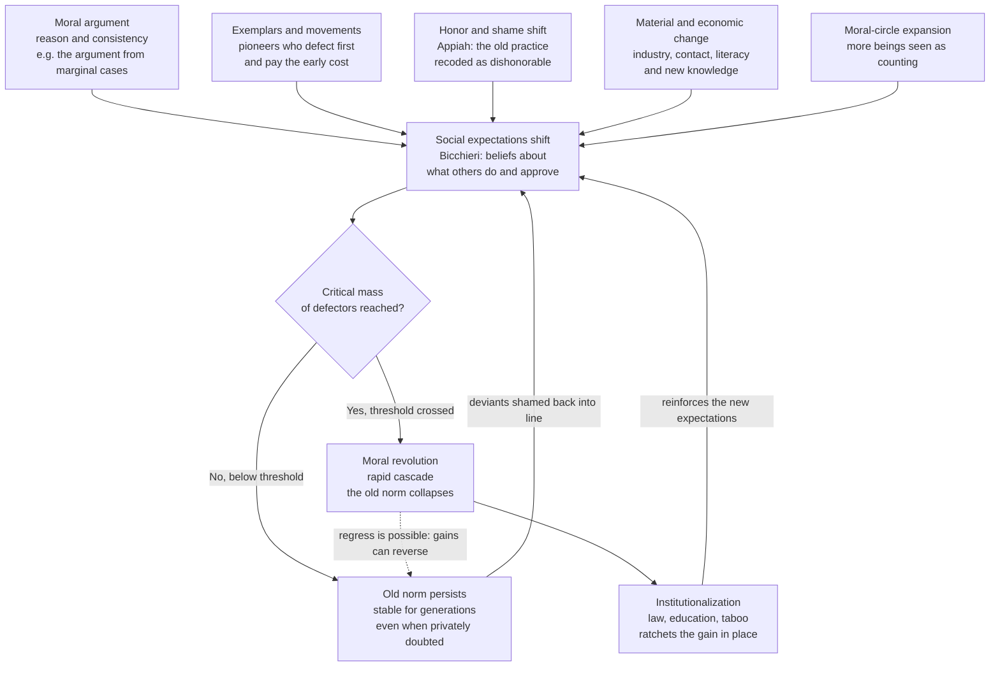

# 🌅 Moral Progress and Moral Revolution

> [!abstract] TL;DR
> Practices once seen as ordinary — chattel **slavery**, denying women the vote, **dueling**, footbinding, public torture as entertainment — now strike almost everyone as obviously wrong. That change looks like **moral progress**: morality itself seeming to get *better* over time. This note asks the hard questions that phrase hides. **(1) The metaethical precondition:** "progress" presupposes a standard by which later is *better*, not merely *different* — a tension with relativism (see [[Metaethics_and_Moral_Disagreement]]) that even an anti-realist must somehow answer. **(2) What would count as progress:** moral-**circle** expansion (Lecky, Singer), better internal coherence, the reduction of suffering and cruelty (Pinker's "better angels" thesis and its critics), and increased impartiality. **(3) The *mechanisms* of moral change:** Appiah's insight that **honor and shame**, not argument alone, drive moral *revolutions*; Bicchieri's account of how a **social norm** held up by mutual expectation can persist for generations even when privately doubted, then **collapse fast** once a critical mass defects — a tipping-point/cascade dynamic (see [[Cascades_and_Systemic_Risk]]). **(4) The warnings:** progress is **not inevitable** — norms backslide, and reading history as a guaranteed march upward is the *whiggish* fallacy. **(5) The frontier:** which of *our* accepted practices — factory farming, mass incarceration, our treatment of the global poor — will future generations condemn?

## Intuition

**Analogy — the norm that "everyone knew" was right, until suddenly no one did.** Picture a duelist in 1804. An insult has been thrown; his honor demands he meet the offender at dawn with pistols. He does not *want* to risk death over a slight, and privately he may think the whole business absurd — but he goes, because **everyone he respects expects him to**, and to refuse is to be branded a coward for life. For centuries the norm held with iron force across the European and American gentry. Then, within roughly a generation, it evaporated: by the 1850s a gentleman who challenged a rival to a duel was not admired but *ridiculed* — seen as a preening fool re-enacting a dead custom. Nothing new had been *discovered* about the wrongness of shooting people over insults. What changed was the **social meaning** of the act: honor flipped sides. The very code that once *compelled* dueling came to *forbid* it.

That is the shape of a **moral revolution**: a practice sits stable and unquestioned for ages — propped up not by anyone's genuine approval but by everyone's belief that *everyone else* approves — and then tips over with startling speed. The deep question is whether such flips are mere *changes* in fashion, or genuine **progress** toward getting morality *right* — and if it is progress, what invisible standard we are progressing *toward*.

---

## How It Works

### 1. The metaethical precondition: "progress" needs a yardstick

To call a change **progress** rather than mere **change** is to say the later state is *better by some standard*. If morality were purely relative — true only "for" each culture — then abolition would be a change *from* one self-contained moral world *to* another, with no neutral vantage from which to say the second is *superior*. So moral progress seems to **presuppose objective, or at least improvable, moral standards** — exactly the pressure point of [[Metaethics_and_Moral_Disagreement]].

Realists take this in stride: if there are moral facts, we can track them better over time, and convergence (the near-universal modern rejection of slavery) is *evidence* of a real target. But an **anti-realist need not surrender the word "progress."** Three moves are available: **(a)** progress as increasing *internal coherence* — removing contradictions between our principles and our practice (we said "all men are created equal" while owning slaves; abolition made practice cohere with an avowed principle); **(b)** progress as better satisfaction of *functional* aims morality serves — expanding cooperation, reducing needless suffering; **(c)** progress relative to *idealized* endpoints a constructivist can specify (what suitably informed, impartial agents would endorse). Each lets us say slavery's end was an *improvement* without positing a Platonic moral realm.

### 2. What would count as progress — four candidate markers

- **Moral-circle expansion.** W.E.H. Lecky (1869) and Peter Singer (*The Expanding Circle*, 1981) describe morality's boundary of concern widening from kin to tribe to nation to all humans and, latterly, to sentient animals — the theme of [[Moral_Status_and_the_Moral_Circle]]. *Wider* is the leading candidate for *better*.
- **Coherence and consistency.** Progress as ironing out arbitrary exceptions — the **argument from marginal cases**, or the demand that a principle apply to relevantly similar cases alike.
- **Reduction of suffering and cruelty.** Steven Pinker's *Better Angels* thesis: rates of violence, torture, and cruelty have fallen dramatically over the long run. Critics (e.g., historians of colonial and structural violence) charge selective metrics and Eurocentric framing.
- **Increased impartiality.** Progress as the shrinking of in-group favoritism — treating a stranger's like interests as counting equally with a kinsman's.

### 3. The mechanisms — *how* moral norms actually change

Moral philosophers long assumed **argument** does the work: give people better reasons and they update. Real moral revolutions run on more than reasons.

1. **Argument and consistency pressure.** Reasons matter — abolitionist and suffragist arguments exposed contradictions between professed principles and practice. But argument alone rarely moves a stable norm.
2. **Honor and shame (Appiah).** In *The Honor Code*, Kwame Anthony Appiah argues that dueling, Chinese footbinding, and Atlantic slavery each ended not when people were first *told* they were wrong (they had been, for generations) but when the practice became a source of **dishonor and shame** rather than pride — often via ridicule, and via a group's sense that it was falling in the esteem of a wider "honor world."
3. **Moral exemplars and social movements.** Visible pioneers who defect first and pay the cost — and organized [[Social_Movements_and_Revolution|movements]] that coordinate defection and change what counts as respectable.
4. **Material and economic change.** Industrialization, urbanization, expanded literacy, and new forms of contact reshape which norms are sustainable — see [[Globalization_and_Social_Change]] and, for slavery specifically, [[The_Atlantic_Slave_Trade]].
5. **Expanding knowledge and contact.** New facts (about animal cognition, about the humanity of the enslaved) and sheer exposure to out-groups erode the *non-moral* beliefs that once propped up a practice.
6. **Social norms and their collapse (Bicchieri).** Cristina Bicchieri models a **social norm** as sustained by two beliefs: *empirical expectations* ("others do X") and *normative expectations* ("others think I ought to do X"). A norm can persist even when almost no one privately endorses it — a state of **pluralistic ignorance** — because each person conforms to a phantom consensus. Shift enough people's *beliefs about others*, and the whole edifice **collapses rapidly**.
7. **The ratchet of institutionalization.** Once a new norm wins, embedding it in **law, education, and taboo** locks in the gain and raises the cost of backsliding.

### 4. Moral revolutions as tipping points

Put mechanism 6 together with dynamics: a norm held up by mutual expectation behaves like a **contagion on a network**. Below a critical mass of defectors it is *self-repairing* (deviants are shamed back into line); above it, defection becomes self-reinforcing and the norm **cascades to collapse** — long stability, then a sudden flip. This is the same math as [[Cascades_and_Systemic_Risk|cascades]], [[Network_Dynamics_and_Contagion|social contagion]], and [[Bifurcations_and_Tipping_Points|fold bifurcations]]: a slowly rising pressure crosses a threshold and the system jumps discontinuously to a new stable state.



### 5. Regress and the non-inevitability of progress

Nothing guarantees the arrow points up. The moral circle has **contracted** as well as expanded — the dehumanization that enabled the [[The_Holocaust|Holocaust]] and other genocides was a *narrowing* of who counts. Hard-won norms **backslide** when institutions weaken. Reading history as an inevitable ascent is the **whiggish fallacy** — projecting the present's values backward and treating their triumph as preordained. Progress is *possible and real in cases*, but it is *contingent*, reversible, and won by effort, not by the tide of time.

---

## Key Concepts

### Secondary (the plain idea)

- **Moral progress = morality getting *better*, not just *different*.** Ending slavery was not a mere change of fashion; by almost any standard it was an *improvement*.
- **The expanding circle.** Over history, "who counts morally" has widened — from family and tribe to all humans and, increasingly, to animals.
- **A moral revolution is a fast flip.** A practice everyone accepted (dueling) becomes something everyone condemns, often within a single generation.
- **Norms are held up by what we think *others* think.** People often keep doing something not because they approve of it but because they believe everyone *else* does. Change that belief and the practice can vanish quickly.

### Undergraduate (the working vocabulary)

- **The metaethical worry.** "Progress" needs a standard of *better*. Strong relativism struggles to supply one — if each culture's morality is self-validating, there is no neutral platform to call abolition an *improvement* rather than a *substitution* (link to [[Metaethics_and_Moral_Disagreement]]).
- **Anti-realist rescues of "progress."** Coherence-based (remove contradictions between principle and practice), functional (serve morality's cooperative aims better), and constructivist (approach what idealized agents would endorse). You can affirm progress without moral realism.
- **Appiah's honor thesis.** In *The Honor Code*, the decisive lever in ending dueling, footbinding, and Atlantic slavery was a shift in **honor and shame** — the practice becoming a mark of disgrace — not the first appearance of the *arguments*, which had long been available and ignored.
- **Bicchieri on norm collapse.** A norm is a cluster of **conditional preferences** backed by empirical and normative expectations. **Pluralistic ignorance** (privately rejected but publicly upheld) makes norms fragile: a small, visible shift in beliefs-about-others can trigger abandonment.
- **Pinker's "better angels."** The long-run *decline* of violence and cruelty as evidence of moral progress — with critics disputing the metrics and the framing.
- **The whiggish warning.** Do not read history as guaranteed uphill motion; moral gains are contingent and reversible.

### Graduate (where the difficulty lives)

- **Progress requires a *rank ordering*, not just a *direction*.** "The circle expanded" is a descriptive trend; calling it progress smuggles in an evaluative claim that *wider is better*. Singer treats this as rational (impartiality generalizes); critics note the circle has also contracted, so historical momentum is not itself justification. The **direction still needs an independent moral argument**.
- **The bootstrapping problem.** How can a moral community *critique its own* deepest norms using standards *internal* to it? Progress by increasing coherence (reflective equilibrium across generations) offers one answer, but coherence is *necessary, not sufficient* — a perfectly consistent slaveholding ethic is conceivable. Something must adjudicate *which* fixed points to keep.
- **Debunking cuts both ways.** Evolutionary and genealogical stories can *debunk* a norm (revealing it as a fitness- or power-serving accident rather than a truth-tracker) — but the *same* tools can debunk our *new* norms. Buchanan and Powell (*The Evolution of Moral Progress*, 2018) argue for **"inclusivist" progress** as the exercise of an evolved but flexible capacity that can, under the right ecological and institutional conditions, override tribal defaults — a *biocultural* account that avoids both naive optimism and blanket debunking.
- **Mechanism vs justification.** Appiah's honor mechanism explains *how* revolutions happen without settling *whether* they are progress: shame is a *cause*, not a *reason*. A complete theory must connect the causal story (what tips the norm) to the normative story (why the new norm is better) — otherwise "moral revolution" is just "moral fashion at scale."
- **Tipping dynamics and hysteresis.** Because norm cascades are fold-bifurcation phenomena ([[Bifurcations_and_Tipping_Points]]), they exhibit **hysteresis**: the pressure needed to *topple* the old norm exceeds the pressure needed to *reinstate* it once toppled — which is why institutionalization matters and why regress, though possible, is not simply the collapse run in reverse.
- **Impartiality vs partiality.** If progress = increasing impartiality, it strains against the partial ties (to kin, community, nation) that much of ethics also treats as valuable. A theory of progress owes an account of *which* partialities are prejudices to be dissolved and which are legitimate.

---

## Python Demo

We model a **moral norm as a threshold/contagion process** on a population (Granovetter's threshold model, given a normative reading by Bicchieri). Each person clings to the **old norm** until the fraction of others who have already **abandoned** it exceeds their personal *conformity threshold* — high threshold means strongly attached to the old way. A small seed of **moral pioneers** abandons regardless of anyone else. As accumulated pressure (arguments, honor-shifts, economic change, contact) slowly **lowers everyone's resistance** over generations, the old norm can hold near-total adherence for a long time and then **collapse in a rush** the moment a critical threshold is crossed — the *moral-revolution* dynamic. The second panel shows the sobering flip side: below a critical intensity of pressure the movement **stalls and the old norm survives** — progress is not inevitable. This is the same tipping-point math as social [[Cascades_and_Systemic_Risk|cascades]] and political mobilization.

```python
# Granovetter/Bicchieri threshold model of NORM ABANDONMENT.
# A social norm held up by mutual expectation stays stable for a long time,
# then collapses fast once accumulated pressure crosses a tipping point.
# numpy + matplotlib only.
import numpy as np
import matplotlib.pyplot as plt

rng = np.random.default_rng(7)
N = 5000

# Each agent's conformity threshold = fraction of others who must abandon the
# OLD norm before this agent will. Higher = more attached / conformist.
base_thresholds = np.clip(rng.normal(0.55, 0.15, N), 0.0, 1.0)

# A small seed of moral pioneers abandon the old norm no matter what (~3%).
seed = rng.uniform(0.0, 1.0, N) < 0.03

def old_norm_adherence(pressure):
    """Accumulated pressure lowers everyone's resistance by 'pressure';
    return the fraction still holding the OLD norm at the cascade's fixed point."""
    thr = base_thresholds - pressure          # arguments/shame/economics erode resistance
    abandoned = seed.copy()
    for _ in range(2000):
        x = abandoned.mean()                  # fraction who have abandoned so far
        new = seed | (thr <= x)               # you defect if a pioneer OR enough others have
        if new.sum() == abandoned.sum():      # fixed point reached
            break
        abandoned = new
    return 1.0 - abandoned.mean()

# ---- Panel A: pressure rises slowly over time -> sudden collapse ----------
T = 240
pressure_t = np.linspace(0.0, 0.50, T)        # accumulates over "generations"
adherence = np.array([old_norm_adherence(p) for p in pressure_t])
tip = int(np.argmax(-np.diff(adherence)))     # largest single-step drop = the tipping point

fig, (axA, axB) = plt.subplots(1, 2, figsize=(15, 6))
axA.plot(pressure_t, adherence, color="#1e3a8a", lw=2.6)
axA.axvline(pressure_t[tip], color="#dc2626", ls="--", lw=1.5)
axA.annotate("tipping point:\nold norm collapses",
             xy=(pressure_t[tip], adherence[tip]),
             xytext=(pressure_t[tip] + 0.05, 0.62),
             color="#dc2626", fontsize=10,
             arrowprops=dict(arrowstyle="->", color="#dc2626"))
axA.set_xlabel("accumulated pressure over time  (arguments, honor-shift, economics)")
axA.set_ylabel("adherence to the OLD norm")
axA.set_title("Long stability, then sudden collapse\n(the moral-revolution dynamic)")
axA.set_ylim(-0.02, 1.02)
axA.grid(alpha=0.3)

# ---- Panel B: non-inevitability -- movement strength decides the outcome --
for ceiling, label, col in [(0.15, "weak: pressure never crosses the fold -> norm survives", "#6b7280"),
                            (0.30, "moderate: late tipping", "#d97706"),
                            (0.50, "strong: early tipping", "#059669")]:
    path = np.linspace(0.0, ceiling, T)
    adh = np.array([old_norm_adherence(p) for p in path])
    axB.plot(np.linspace(0, 1, T), adh, lw=2.4, color=col, label=label)
axB.set_xlabel("time  (normalized)")
axB.set_ylabel("adherence to the OLD norm")
axB.set_title("Progress is NOT inevitable:\nbelow a critical intensity the old norm holds")
axB.set_ylim(-0.02, 1.02)
axB.legend(fontsize=8, loc="lower left")
axB.grid(alpha=0.3)

plt.tight_layout()
plt.savefig("moral_revolution_cascade.png", dpi=120)
plt.show()

print(f"Tipping point at accumulated pressure ~ {pressure_t[tip]:.3f}")
print(f"Adherence just before: {adherence[max(tip-1,0)]:.2f}"
      f"  ->  just after: {adherence[min(tip+1, T-1)]:.2f}")
```

**What you see.** In **Panel A** the old norm holds near-total adherence while pressure builds slowly across generations — the plateau — then **collapses almost vertically** at the tipping point, mirroring how dueling or footbinding endured for centuries and then vanished within a generation. The collapse is *discontinuous*: nothing about the practice changed at the last moment, only the shared belief that everyone else still upheld it. **Panel B** delivers the cautionary lesson: a **weak movement** whose accumulated pressure never reaches the fold leaves the old norm **standing indefinitely** (stall/regress), while stronger movements tip it — and the stronger they are, the sooner. The model captures Bicchieri's core claim — a norm can be *privately doubted yet publicly stable* — and locates moral revolution firmly in the family of tipping-point/cascade phenomena, while remaining pointedly silent on whether the *new* norm is *better*: the dynamics settle *when* a norm flips, never *whether the flip is progress*.

---

## Real-World Applications

> **Example — the end of dueling and footbinding as engineered revolutions.** Appiah's cases show mechanism over mere argument. **Dueling** in Britain collapsed in the mid-19th century not from a new moral discovery but as the rising middle class recoded it from a mark of aristocratic *honor* into an object of *ridicule*. **Chinese footbinding**, practiced for roughly a millennium, ended within a single generation around 1900 once reformers reframed it as a source of national *shame* and — crucially — organized **anti-footbinding pledge societies** in which families publicly committed both *not to bind their daughters* and *not to let their sons marry bound women*. That deliberately shifted everyone's **expectations about everyone else** (Bicchieri's lever), dissolving the coordination trap that had sustained the practice.

- **Abolition of slavery.** A moral revolution driven by argument, religious exemplars, organized movements, *and* shifting economic and honor dynamics — the reason [[The_Atlantic_Slave_Trade]] and its abolition is the paradigm case for the whole debate.
- **Deliberate norm-change campaigns.** UNICEF and others use Bicchieri's framework explicitly to end **female genital cutting** and child marriage — targeting *collective* expectations through public, coordinated pledges rather than lecturing individuals, because a purely private change of heart leaves the coordination trap intact.
- **Rapid attitude shifts on same-sex marriage.** In many countries public opinion flipped within about two decades — a textbook fast cascade once visible defection and elite/media endorsement crossed a threshold, illustrating the plateau-then-collapse curve.
- **Smoking and drunk-driving norms.** Behaviors once socially normal became stigmatized within a generation as the *social meaning* of the act shifted — norm change reinforced by the institutional ratchet of law.
- **The frontier — practices future generations may condemn.** Candidates repeatedly flagged: industrial **factory farming** (link to [[Animal_Ethics_and_Rights]]), mass **incarceration**, and affluent nations' treatment of the **global poor** and of future generations under climate change. The honest posture is uncertainty: some current practice is almost certainly a future *abolition of slavery*, but we cannot be sure which.

---

## Common Pitfalls

- **Assuming progress is inevitable (the whiggish fallacy).** Treating the triumph of present values as preordained and reading history as guaranteed ascent. The moral circle has *contracted* in genocides; gains *backslide*. Progress is real in cases but contingent and reversible.
- **Confusing change with progress.** A norm flipping (mechanism) does not by itself make the new norm *better* (justification). Appiah's honor mechanism explains *how* revolutions happen; it does not certify them as improvements. Shame is a *cause*, not a *reason*.
- **Letting relativism quietly cancel the concept.** If you sincerely hold that each culture's morality is self-validating, you forfeit the standpoint from which abolition counts as an *improvement* rather than a lateral *substitution*. Either supply a cross-temporal standard (realist or anti-realist) or drop the word "progress" (see [[Metaethics_and_Moral_Disagreement]]).
- **Over-crediting argument, under-crediting mechanism.** Believing that better *reasons*, delivered clearly, will move a stable norm. The arguments against dueling and footbinding existed for generations before anything changed; what tipped them was honor/shame, coordination, and material conditions.
- **Ignoring pluralistic ignorance.** Assuming a persistent norm reflects genuine private endorsement. Often it is privately doubted but publicly upheld because each person misreads everyone else — which is exactly why it can collapse *fast* once beliefs-about-others shift.
- **Selective metrics in "decline of violence" claims.** Declaring sweeping progress (or its absence) from a curated set of measures. Pinker's optimists and their critics both risk cherry-picking; robust claims need transparent, contestable metrics.
- **Presentism about the frontier.** Assuming *our* moral consensus is the finished endpoint. The lesson of every past revolution is that some practice we currently find unremarkable will likely look monstrous to descendants.

---

## Related Concepts

- [[Metaethics_and_Moral_Disagreement]] — supplies the precondition debate: "progress" needs a standard of *better*, which strains against relativism; shows how even an anti-realist can rescue the concept.
- [[Moral_Status_and_the_Moral_Circle]] — moral-circle expansion (Lecky, Singer) is the leading *candidate* for what moral progress consists in; this note asks whether wider is genuinely better.
- [[Animal_Ethics_and_Rights]] — factory farming as the paradigm *frontier* case: a currently accepted practice many predict future generations will condemn.
- [[Cascades_and_Systemic_Risk]] — the tipping-point/cascade math behind norm collapse: long stability, then rapid, self-reinforcing change once a threshold is crossed.
- [[Network_Dynamics_and_Contagion]] — moral-norm abandonment spreads like a contagion on a social network; the demo is a threshold-contagion model.
- [[Bifurcations_and_Tipping_Points]] — a norm collapse is a fold bifurcation, complete with hysteresis (toppling costs more pressure than reinstating), which is why institutionalization locks gains in.
- [[Social_Movements_and_Revolution]] — the collective actors and coordination mechanisms (pledge societies, movements) that push a norm past its tipping point.
- [[Culture_Norms_Values_and_Ideology]] — the sociological account of how norms are constituted, transmitted, and sanctioned that any theory of moral change relies on.
- [[Collective_Behavior_and_Crowds]] — Granovetter-style threshold dynamics of collective behavior, the direct ancestor of the model used here.
- [[The_Atlantic_Slave_Trade]] — the historical paradigm case of a moral revolution: abolition as the benchmark against which "moral progress" is argued.
- [[Globalization_and_Social_Change]] — the material, economic, and contact-driven forces that reshape which norms are sustainable over the long run.
- [[Moral_Psychology_and_Intuitions]] — the individual-level psychology (intuition, disgust, in-group bias) that mechanisms of moral change must work with or against.

---

## Review Questions

**Secondary**
1. Using the example of dueling or footbinding, explain in your own words why a practice can persist for centuries even when many people privately doubt it — and what has to change for it to collapse quickly. What is the difference between calling this *change* and calling it *progress*?

**Undergraduate**
2. Appiah argues that moral *revolutions* are driven by shifts in **honor and shame**, not by the first appearance of the *arguments* against a practice. Reconstruct this claim using one of his cases, then explain how it fits Bicchieri's account of social norms — and say why the honor mechanism, by itself, does not settle whether the revolution counts as moral *progress*.

**Graduate**
3. "Moral progress presupposes a standard by which later is *better*, which seems to require moral realism." Evaluate this. Give the strongest *anti-realist* reconstruction of moral progress you can (coherence-based, functional, or constructivist), and say whether it genuinely captures the intuition that abolishing slavery was an *improvement* — or merely relabels a change. Then connect your answer to the tipping-point model: what, if anything, does the *dynamics* of norm collapse tell us about the *justification* of the new norm?

---

## Sources

- Appiah, K. A. (2010). *The Honor Code: How Moral Revolutions Happen.* W. W. Norton. (Dueling, footbinding, Atlantic slavery; honor and shame as engines of moral change.)
- Bicchieri, C. (2017). *Norms in the Wild: How to Diagnose, Measure, and Change Social Norms.* Oxford University Press. (Empirical vs normative expectations; pluralistic ignorance; norm abandonment.)
- Singer, P. (1981/2011). *The Expanding Circle: Ethics, Evolution, and Moral Progress.* Princeton University Press.
- Pinker, S. (2011). *The Better Angels of Our Nature: Why Violence Has Declined.* Viking. (The long-run decline-of-violence thesis and its critics.)
- Buchanan, A. & Powell, R. (2018). *The Evolution of Moral Progress: A Biocultural Theory.* Oxford University Press.
- Granovetter, M. (1978). "Threshold Models of Collective Behavior." *American Journal of Sociology* 83(6), 1420–1443. (The threshold/cascade model underlying the demo.)

---

#ethics #moral-progress #moral-revolution #social-norms #moral-circle
