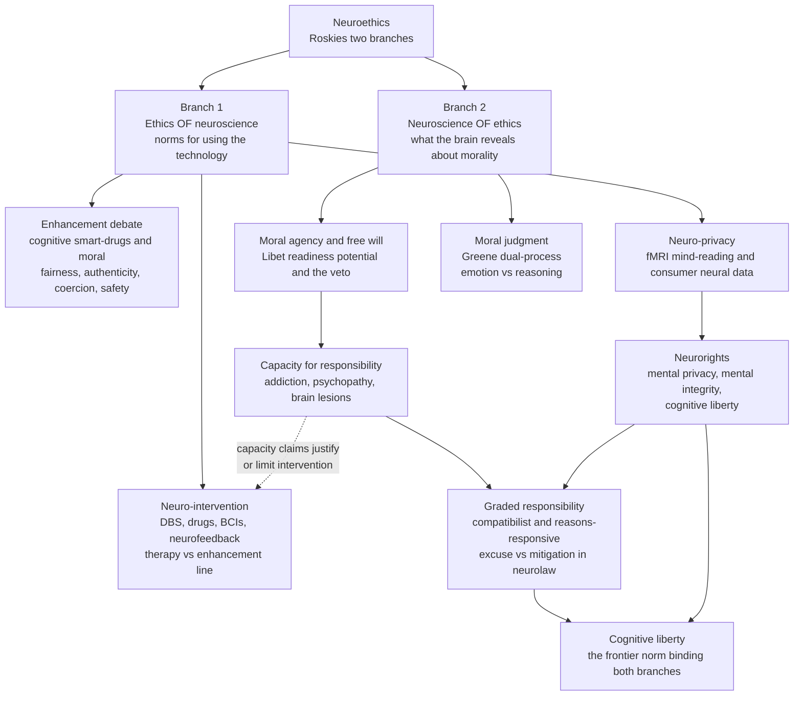

# 🧠⚖️ Neuroethics

> [!abstract] TL;DR
> **Neuroethics** is the two-way street between the brain sciences and ethics. Adina **Roskies (2002)** split it into two branches: the **ethics of neuroscience** — how may we *use* neurotechnology that can read, stimulate, and edit the mind (deep brain stimulation, psychopharmacology, brain–computer interfaces, fMRI "mind-reading," cognitive and *moral* enhancement)? — and the **neuroscience of ethics** — what does a mechanistic brain tell us about *moral agency, free will, and responsibility* themselves (Libet, "my brain made me do it," neurolaw)? The unifying threat and promise is that the mind, historically the one guaranteed-private space, is becoming **legible and modifiable**, which is why a new vocabulary of **neurorights** — mental privacy, mental integrity, and **cognitive liberty** — is being drafted into law even as neuroscience reframes responsibility from a binary (guilty/insane) toward a **graded** function of a person's capacity for control.

---

## Intuition

**Analogy: the last locked room.**

Every other private space has already fallen. Your letters can be subpoenaed, your location is a phone ping, your purchases are a data broker's spreadsheet, your face is a match in a camera network (see [[Privacy_Surveillance_and_Data_Ethics]]). Through all of it, one room stayed locked from the inside: the inside of your skull. You could *lie*, you could *think a thought and tell no one*, and no warrant could reach it. The thought "I disagree" was yours alone.

Neurotechnology is picking that lock — from two directions at once. From the **outside in**, a scanner or a cheap consumer EEG headset begins to *infer* what is in the room (a felt intention, a recognized face, deception, a diagnosis), and a stimulator or a drug can *rearrange the furniture* (calm a tremor, lift a depression, blunt a craving, perhaps one day sharpen attention or soften cruelty). From the **inside out**, the science of what is *in* the room — that "you" are a lawful pattern of firing neurons — makes the old idea that a free, uncaused self chose to act look shaky, which reaches straight into the courtroom question of whether anyone truly *deserves* blame. Neuroethics is the discipline that stands in that doorway and asks: now that the last room can be read, changed, and explained, what are the rules?

---

## How It Works

### Core Mechanics

**1. Roskies's two branches — the field's founding map.** In 2002 Adina Roskies partitioned neuroethics into (a) the **ethics of neuroscience** — the applied-ethics analysis of what neuroscience and its technologies *let us do to brains* — and (b) the **neuroscience of ethics** — the empirical study of *how the moral brain works* and what that implies for concepts like free will and responsibility. The branches feed each other: what the neuroscience of ethics says about a person's *capacity for control* directly governs the ethics of *intervening* on that person.

**2. The ethics of neuro-intervention (therapy vs enhancement).** A spectrum of tools now reaches into functioning neural circuitry:
- **Deep brain stimulation (DBS):** implanted electrodes deliver current to targets like the subthalamic nucleus — routine for Parkinsonian tremor, expanding into OCD, treatment-resistant depression, and (controversially) addiction. It works, but can transiently alter mood, impulsivity, and even a patient's sense of *who they are* ("post-DBS personality change"), raising authenticity and identity worries.
- **Psychopharmacology:** SSRIs, stimulants, and beyond modify the same neurotransmitter systems that carry mood, motivation, and self-control (see [[Psychopharmacology_and_Drug_Mechanisms]]).
- **Brain–computer interfaces (BCIs):** decode motor intention to move a cursor or prosthesis and, increasingly, encode signals *back in* (see [[Brain_Computer_Interfaces]]).
- **Neurofeedback:** real-time display of one's own brain activity to train self-regulation.

The recurring fault line is the **therapy/enhancement distinction**: repairing a *disorder* enjoys broad license under [[Principles_of_Biomedical_Ethics|beneficence]]; *upgrading a healthy brain* triggers the fairness/authenticity/coercion debate. The line is medically fuzzy (is shyness a disease? grief? mild inattention?) but ethically load-bearing.

**3. Cognitive enhancement.** "Smart drugs" (modafinil, prescription stimulants used off-label) promise sharper attention and wakefulness. Four objections dominate: **safety** (unknown long-term costs), **fairness** (does enhancement entrench advantage, and is it "cheating"?), **authenticity** (is an enhanced achievement *yours*?), and **coercion** (if colleagues enhance, must you, to keep your job?). Liberal defenders (Greely et al., 2008, *Nature*) reply that we already enhance with coffee, sleep, and education, and that a well-regulated market beats prohibition.

**4. Moral enhancement — the most radical proposal.** Persson and Savulescu (*Unfit for the Future*, 2012) argue that our evolved moral psychology — parochial, present-biased, weak on large-number and long-horizon harms — is dangerously mismatched to a world with weapons of mass destruction and climate change, and that we should therefore consider *biomedically* boosting moral dispositions (e.g., pharmacologically raising empathy or fairness, dampening aggression). Critics led by **John Harris** press the **"freedom to fall"** objection: a being that *cannot* choose the bad is not virtuous but merely constrained — moral worth requires the standing possibility of wrongdoing, so engineered goodness may abolish the very agency it claims to perfect. This is a biological mirror of the AI **value-loading** problem: "improving values" from the outside runs headlong into who gets to specify the target (see [[AI_Alignment_and_Existential_Risk]]).

**5. Neuro-privacy and "brain-reading."** fMRI decoding can, in constrained lab settings, classify what category of image someone is viewing, reconstruct rough perceptual content, and flag recognition or deception above chance. Consumer EEG/wearables now stream **neural data** from millions of ordinary devices. The ethics: mental states can be *inferred* (never simply "downloaded" — decoding is probabilistic and context-bound), yet even probabilistic inference of intentions, diagnoses, or beliefs from a headset is a categorically new privacy exposure. **Neuro lie-detection** (fMRI, EEG-based "brain fingerprinting") has been marketed for court use; reliability and the Fifth-Amendment/self-incrimination questions have so far kept it largely out of Western courts, though it has appeared in verdicts elsewhere.

**6. Neurorights — the regulatory response.** As inference and modulation advance, Ienca and Andorno (2017) proposed new human rights: the **right to mental privacy**, the **right to mental integrity** (protection from unauthorized alteration of neural activity), **cognitive liberty** (self-determination over one's own mental life — both the right to *use* neurotech and the right to *refuse* it), and **psychological continuity**. **Chile** amended its constitution in 2021 to protect "neurorights," the first nation to do so; UNESCO and the OECD have since advanced governance frameworks. Cognitive liberty is the frontier value uniting both Roskies branches — it is what neuro-privacy protects *and* what moral enhancement risks overriding.

**7. The neuroscience of ethics — free will and responsibility.** The empirical branch collides with desert-based blame:
- **Libet's experiments (1983):** the **readiness potential**, a ramp of preparatory brain activity, appears to *precede* the conscious felt "urge to move" by hundreds of milliseconds — suggesting the brain "decides" before "you" do. **Interpretation is fiercely contested:** the RP may reflect noisy drift toward a threshold rather than a settled decision; the paradigm covers trivial *when*-to-flex acts, not deliberated moral choices; and Libet himself preserved a role for conscious **veto** ("free won't"). The experiment does *not* cleanly refute free will, but it sharpened the question.
- **The "my brain made me do it" defense / neurolaw:** if every act is a brain event and every brain event is caused, does anyone *deserve* punishment? **Compatibilism** (see [[Free_Will_and_Determinism]]) answers that responsibility never required contra-causal freedom — it requires the ordinary **capacities** for rational, reasons-responsive control, which most agents have and some (severe psychosis, certain brain lesions) lack.
- **Graded responsibility:** neuroscience pushes law away from crude binaries (sane/insane, guilty/not-guilty) toward a **continuum** of capacity. Damage to prefrontal impulse-control circuitry, active addiction craving, adolescent immaturity (invoked in *Roper v. Simmons*), or a tumor pressing on orbitofrontal cortex can *diminish* — not necessarily erase — the capacity for self-control, arguing for **mitigation** rather than all-or-nothing **excuse** (see [[Criminal_Law_Principles]] on the insanity defense and capacity, and [[Theories_of_Punishment]] on how retribution vs deterrence weathers the challenge).

**8. Addiction, psychopathy, and the capacity for responsibility.** These are the crucial *hard cases* because they attack control from different angles. **Addiction** as a "brain disease" (hijacked dopaminergic reward learning; see [[Decision_Making_and_Reward_Circuits]]) seems to shrink voluntary control, yet addicts demonstrably respond to incentives — so the honest verdict is *diminished, context-dependent* capacity, not none. **Psychopathy** spares means-end reasoning but blunts the *affective* machinery of moral judgment (amygdala/vmPFC), raising the question of whether someone who *knows* the rules but cannot *feel* their force is a fully responsible agent or a different kind of case (see [[Psychiatric_Disorders_and_Neurobiology]]).

**9. The neuroscience of moral judgment.** Greene's dual-process fMRI work shows moral verdicts arising from a competition between a fast **emotional alarm** and a slow **utilitarian calculus** — grounding the neuroscience-of-ethics branch in specific circuits and feeding the *debunking* debate about whether emotion-driven intuitions carry justificatory authority (developed fully in [[Moral_Psychology_and_Intuitions]]).

**10. Consciousness and disorders of consciousness.** Neuroimaging that detects **covert awareness** in some patients diagnosed as vegetative (Owen's tennis-imagery paradigm: a patient answering yes/no by imagining tennis vs navigation) forces revision of the persistent-vegetative-state diagnosis and of withdrawal-of-treatment decisions — the ethics of consciousness detection bleeds directly into end-of-life choice (see [[Consciousness_and_Neural_Correlates]] and [[End_of_Life_Ethics]]).

### Flow / Architecture



---

## Key Concepts

### Secondary (intuitive level)

- **Neuroethics has two halves:** the ethics of the *tools* we point at brains, and what brain science tells us about *right and wrong* and *free will* themselves.
- **The mind was the last private place.** New scanners and headsets can start to *guess* what you are thinking; new devices and drugs can *change* it. That is why people are inventing "**neurorights**."
- **Therapy vs enhancement:** fixing a sick brain feels fine; *upgrading* a healthy one raises fairness worries ("is it cheating?"), authenticity worries ("is the achievement really mine?"), and pressure worries ("if everyone does it, must I?").
- **"My brain made me do it":** if a choice is just neurons firing, did the person really *choose*? Neuroscience nudges the law from a yes/no verdict toward *degrees* of responsibility.

### Undergraduate (mechanistic level)

- **Roskies's split:** *ethics of neuroscience* (intervention, enhancement, privacy) vs *neuroscience of ethics* (agency, free will, moral judgment) — and how the second constrains the first.
- **Intervention toolkit:** DBS (with post-DBS personality/identity change), psychopharmacology, BCIs (read *and* write), neurofeedback — all operating on functioning circuits, hence the authenticity and identity questions.
- **The neurorights quartet (Ienca & Andorno):** mental privacy, mental integrity, cognitive liberty, psychological continuity; Chile's 2021 constitutional amendment as first implementation.
- **Moral enhancement:** Persson & Savulescu's mismatch argument vs Harris's **"freedom to fall"** — moral worth may require the real possibility of doing wrong, so engineered virtue could hollow out agency.
- **Libet, carefully:** the readiness potential precedes reported conscious intention; but it may be threshold-crossing noise, covers only trivial timed acts, and leaves room for conscious veto — so it *sharpens* rather than *settles* the free-will question.
- **Compatibilism + graded responsibility:** responsibility tracks the *capacity* for reasons-responsive control, which comes in degrees — supporting **mitigation** over binary excuse.

### Graduate (theoretical and critical level)

- **Does determinism defeat desert?** Retributive punishment ([[Theories_of_Punishment]]) presupposes basic desert; hard incompatibilists (Pereboom, Caruso) argue neuroscience-plus-determinism dissolves it and favor a **public-health/quarantine** model of criminal justice, while compatibilists (Dennett, Morse) insist "folk-psychological" agency is untouched. Stephen **Morse's** rejoinder — "brains do not commit crimes, *people* do" — warns against **"brain overclaim syndrome":** inferring exculpation directly from a scan when the law's real question is a *behavioral* capacity, not a lesion.
- **The excuse/mitigation architecture:** law already grades culpability (premeditation vs provocation, diminished capacity, adolescent immaturity in *Roper v. Simmons*). Neuroscience supplies *mechanism* for existing categories rather than a new metaphysics — its danger is being oversold as *dispositive*.
- **The authenticity problem, sharpened:** if a drug or a DBS setting *changes what one wants*, which preferences are the "real" ones for informed-consent purposes ([[Informed_Consent_and_Autonomy]])? Post-DBS reports of "I feel more myself" *and* "I don't recognize myself" show that identity is not a fixed baseline the intervention deviates from.
- **Reading vs constructing mental states:** decoders do not "read minds" — they *predict* a target variable from a trained model within a narrow prior; their forensic use imports every base-rate, generalization, and adversarial-countermeasure problem of any classifier, with liberty on the line.
- **Cognitive liberty is Janus-faced:** it grounds a *right to enhance/modulate one's own brain* **and** a *right against imposed modulation* (coerced medication, subliminal manipulation, employer neuro-monitoring) — the two can conflict, e.g., mandated moral enhancement of offenders pits public safety against mental integrity.
- **Neuroscience of moral judgment as a normative lever:** Greene's debunking of deontological intuitions (see [[Moral_Psychology_and_Intuitions]]) is a *neuroscience-of-ethics* result deployed for a *normative* conclusion — a clean example of the is/ought bridge neuroethics keeps trying to build (and Hume keeps warning against).

---

## Python Demo

```python
# Neuroscience-and-responsibility, quantified.
# A signal-detection account of "loss of control": a provocation raises an
# antisocial URGE; the prefrontal impulse-control system emits an INHIBITORY
# signal proportional to a person's self-control CAPACITY C (1 = intact,
# 0 = severely impaired: vmPFC/dlPFC damage, acute mania, peak addiction craving).
# The agent ACTS on the urge iff  urge - gain*C + noise > go_threshold.
#
# We then ask the neurolaw question: how should RESPONSIBILITY scale with C?
# The law's traditional insanity test is BINARY (fully responsible OR excused
# at a single cutoff). A compatibilist / reasons-responsive account says
# responsibility is GRADED, tracking capacity smoothly -> supporting MITIGATION
# (a diminished-responsibility band) rather than an all-or-nothing excuse.

import numpy as np
import matplotlib
matplotlib.use("Agg")
import matplotlib.pyplot as plt

rng = np.random.default_rng(7)

# ---- Signal-detection model of acting on an antisocial urge --------------
N          = 30000     # Monte-Carlo agents per capacity level
urge_mean  = 1.6       # strength of the impulse under provocation
gain       = 2.2       # how strongly intact control suppresses the urge
go_thresh  = 0.5       # internal "act" threshold
sigma_urge = 0.40      # variability of the urge
sigma_nz   = 0.50      # decision noise

C = np.linspace(0.0, 1.0, 200)   # self-control capacity

def p_act(cap):
    urge  = rng.normal(urge_mean, sigma_urge, N)
    noise = rng.normal(0.0, sigma_nz, N)
    drive = urge - gain * cap + noise
    return np.mean(drive > go_thresh)   # probability of acting on the urge

P_act = np.array([p_act(c) for c in C])

# ---- From capacity to responsibility -------------------------------------
def logistic(x, x0, k):
    return 1.0 / (1.0 + np.exp(-k * (x - x0)))

C_star   = 0.45                       # legal insanity cutoff
R_graded = logistic(C, C_star, 12.0)  # smooth reasons-responsive curve
R_binary = (C >= C_star).astype(float)

# Mitigation band: where graded responsibility is clearly partial (0.15..0.85)
mit_lo = C[np.argmin(np.abs(R_graded - 0.15))]
mit_hi = C[np.argmin(np.abs(R_graded - 0.85))]

# ---- Report a few landmark agents ----------------------------------------
for label, cap in [("intact adult", 0.90),
                   ("active addiction craving", 0.35),
                   ("severe prefrontal impairment", 0.10)]:
    print(f"{label:32s}  C={cap:.2f}  "
          f"P(act on urge)={p_act(cap)*100:5.1f}%  "
          f"graded responsibility={logistic(cap, C_star, 12.0):.2f}")

# ---- Plot -----------------------------------------------------------------
fig, (ax1, ax2) = plt.subplots(1, 2, figsize=(13, 5.2))

# Panel 1: impairment raises the probability of acting on the urge
ax1.plot(C, P_act * 100, color="#dc2626", lw=2.6)
ax1.set_xlabel("Self-control capacity  C   (0 = impaired impulse control, 1 = intact)")
ax1.set_ylabel("Percent acting on the antisocial urge")
ax1.set_title("Loss of control: weaker inhibition, more acting-out")
ax1.invert_xaxis()   # read left-to-right as capacity is LOST
ax1.grid(alpha=0.3)
ax1.annotate("impairment\nurge wins", (0.12, p_act(0.12) * 100),
             textcoords="offset points", xytext=(35, -10), color="#dc2626",
             fontsize=9, arrowprops=dict(arrowstyle="->", color="#dc2626"))

# Panel 2: graded vs binary responsibility
ax2.axvspan(mit_lo, mit_hi, color="#fde68a", alpha=0.5,
            label="diminished-responsibility / mitigation band")
ax2.plot(C, R_graded, color="#2563eb", lw=2.8,
         label="graded (reasons-responsive) responsibility")
ax2.step(C, R_binary, where="post", color="#6b7280", lw=2.0, ls="--",
         label="binary insanity test (excuse vs full blame)")
ax2.axvline(C_star, color="#111827", lw=1, ls=":")
ax2.set_xlabel("Self-control capacity  C")
ax2.set_ylabel("Degree of moral / legal responsibility")
ax2.set_title("Neurolaw: excuse (binary) vs mitigation (graded)")
ax2.set_ylim(-0.05, 1.08)
ax2.legend(loc="lower right", fontsize=8.5)
ax2.grid(alpha=0.3)

plt.tight_layout()
plt.savefig("neuroethics_graded_responsibility.png", dpi=110, bbox_inches="tight")
plt.show()
```

**What the demo shows:** The **left panel** operationalizes "loss of control" as a signal-detection shift: as prefrontal impulse-control capacity `C` falls, the same provoking urge more often clears the internal "act" threshold, so the rate of acting-out climbs steeply — the quantitative core of the addiction/lesion/"the brain disease" argument. The **right panel** turns that capacity into a *responsibility* claim and contrasts two mappings. The law's classic **insanity test** is a step function: below a single cutoff you are *fully excused*, above it *fully blamed*. A **compatibilist, reasons-responsive** account instead makes responsibility a smooth function of capacity, opening a shaded **mitigation band** where an agent is *partly* culpable — the graded picture neuroscience actually supports. The takeaway mirrors Morse's caution: neuroscience does not abolish responsibility (the curve never hits zero for ordinary agents), but it argues for *degrees* over a binary — moving the debate from **excuse** toward **mitigation**.

---

## Real-World Applications

> **Deep brain stimulation for movement and mood disorders:** DBS of the subthalamic nucleus is standard care for advanced Parkinson's disease and is trialed for OCD and treatment-resistant depression. Documented transient changes in impulsivity, hypersexuality, and self-reported identity make DBS the paradigm case for the neuroethics of *authenticity, consent, and post-intervention personality change* — and for who controls the device's settings (the "who holds the remote" problem).

> **Chile's neurorights law (2021):** the first constitutional protection of mental integrity and neural data, followed by UNESCO's 2025 recommendation on the ethics of neurotechnology and OECD guidance. These translate the abstract *cognitive liberty* debate into enforceable rules for consumer EEG firms and BCI makers, constraining the sale and secondary use of neural data.

> **Consumer neurotech and workplace monitoring:** wearable EEG for focus, sleep, and meditation streams neural data to companies with weak regulation; pilots of EEG fatigue-monitoring for drivers and factory workers make *mental privacy* and *coerced monitoring* concrete labor-rights issues, not thought experiments.

> **Neurolaw in the courtroom:** neuroscientific evidence (frontal-lobe damage, addiction, adolescent brain immaturity in *Roper v. Simmons* which abolished the juvenile death penalty) is routinely introduced at *sentencing/mitigation* rather than for outright acquittal — exactly the graded-responsibility use the demo models, and the use Morse endorses while warning against "brain overclaim."

> **Disorders of consciousness:** Owen-style active fMRI paradigms detecting covert awareness in a subset of patients diagnosed as vegetative have changed diagnosis, prognosis, and withdrawal-of-treatment deliberations — a direct bridge from neuroethics to [[End_of_Life_Ethics]].

> **Moral/cognitive enhancement policy:** militaries fund attention and wakefulness enhancement for operators; bioethics bodies debate off-label modafinil and the *coercion* dynamics of enhancement in competitive institutions — the live, non-hypothetical edge of the enhancement/therapy line.

---

## Common Pitfalls

- **Brain overclaim syndrome (Morse):** treating a lesion or scan as *automatically* exculpatory. The law's question is a *behavioral capacity* for rational control; a correlated brain finding is evidence about that capacity, not a substitute for it. A vivid image is not a verdict.
- **"Mind-reading" hype:** describing probabilistic, narrowly-trained decoders as if they *download thoughts*. Decoders predict a target variable within a tight prior and degrade off-distribution; over-trusting them in court or hiring imports base-rate and generalization errors with liberty at stake.
- **Collapsing determinism into "no responsibility":** the inference "everything is caused, therefore no one is responsible" ignores compatibilism, which never required uncaused choice — only reasons-responsive capacity. The graded curve, not zero, is the right output (see [[Free_Will_and_Determinism]]).
- **Over-reading Libet:** citing the readiness potential as *proof* free will is an illusion. The RP may be accumulating noise, the task is trivial timed flexing (not deliberated moral choice), and the veto ("free won't") survives. It reframes the question; it does not close it.
- **Erasing the therapy/enhancement fuzz OR pretending it doesn't matter:** the line is medically porous (shyness, grief, mild inattention), yet the *fairness/authenticity/coercion* stakes are real. Both denying the line exists and treating it as sharp are errors.
- **The freedom-to-fall blind spot in moral enhancement:** engineering people who *cannot* choose wrong may not create saints but constrained objects; a "value upgrade" imposed from outside recapitulates the AI alignment problem of *who specifies the target* (see [[AI_Alignment_and_Existential_Risk]]).
- **Ignoring identity in consent:** if an intervention *changes what a patient wants*, "informed consent" measured against a pre-intervention baseline is unstable — a deeper problem than a signed form ([[Informed_Consent_and_Autonomy]]).
- **Treating psychopathy and addiction as the same "excuse":** they impair *different* components (affective moral response vs reward-driven control) to *different* degrees; lumping them flattens exactly the graded analysis the science demands ([[Psychiatric_Disorders_and_Neurobiology]]).

---

## Related Concepts

- [[Moral_Psychology_and_Intuitions]] — the *neuroscience of ethics* in action; Greene's dual-process account of moral judgment and the debunking debate that neuroethics inherits.
- [[Privacy_Surveillance_and_Data_Ethics]] — the general privacy/surveillance framework that neuro-privacy and mental-privacy neurorights extend into the "last private space."
- [[Criminal_Law_Principles]] — mens rea, capacity, and the insanity defense that the graded-responsibility argument and the "my brain made me do it" defense press on.
- [[Free_Will_and_Determinism]] — the metaphysics beneath the responsibility branch: compatibilism vs hard incompatibilism, the ground the Libet debate is fought on.
- [[AI_Alignment_and_Existential_Risk]] — the "improving values from the outside" problem shared by moral enhancement and value-loading; who specifies the moral target.
- [[End_of_Life_Ethics]] — where covert-consciousness detection in "vegetative" patients reshapes withdrawal-of-treatment decisions.
- [[Theories_of_Punishment]] — retribution/desert (threatened by determinism) vs deterrence/incapacitation (which survive), and the quarantine model debate.
- [[Principles_of_Biomedical_Ethics]] — beneficence, non-maleficence, autonomy, and justice as applied to neuro-intervention and the therapy/enhancement line.
- [[Informed_Consent_and_Autonomy]] — the consent and authenticity problems sharpened when an intervention alters the very preferences consent is measured against.
- [[Brain_Computer_Interfaces]] — the read/write neurotechnology at the center of the mental-integrity and neuro-privacy debates.
- [[Psychopharmacology_and_Drug_Mechanisms]] — the neurochemical basis of the drugs used for both therapy and cognitive/moral enhancement.
- [[Decision_Making_and_Reward_Circuits]] — the dopaminergic reward/control machinery whose disruption underlies the addiction-and-capacity argument modeled in the demo.
- [[Psychiatric_Disorders_and_Neurobiology]] — the neurobiology of psychopathy, addiction, and mania that supplies neuroethics' hard cases for responsibility.
- [[Consciousness_and_Neural_Correlates]] — the science of consciousness underwriting the ethics of disorders of consciousness and covert-awareness detection.
- [[Neuroimaging_Methods]] — how fMRI/EEG decoding actually works, and therefore what "brain-reading" can and cannot support.

---

## Review Questions

### Secondary

1. Neuroethics is described as a "two-way street." In your own words, what are the *two directions* — and give one example of an ethical question raised by each.
2. Explain the difference between using neurotechnology for **therapy** and for **enhancement**, and name two worries people have about the *enhancement* side (for example, about fairness or authenticity).

### Undergraduate

1. Distinguish **excuse** from **mitigation** in the criminal law. Using the demo's graded-responsibility curve, explain why a defense lawyer usually introduces neuroscientific evidence (frontal damage, addiction, adolescent brain immaturity) at *sentencing* rather than to seek outright acquittal.
2. State Persson & Savulescu's argument for **moral enhancement** and John Harris's **"freedom to fall"** objection. Then explain in what precise sense this debate is a biological version of the AI **value-alignment** problem.
3. Ienca and Andorno propose four **neurorights**. List them, and explain why **cognitive liberty** is "Janus-faced" — how can it be invoked *both* to demand a right *and* to resist an imposition?

### Graduate

1. A hard incompatibilist (e.g., Pereboom/Caruso) argues that if neuroscience shows all action is caused, basic **desert** collapses and retributive punishment is unjustified, favoring a public-health/quarantine model. Reconstruct this argument, then give the strongest **compatibilist** reply (Morse/Dennett), and adjudicate: does the Libet literature strengthen or weaken the incompatibilist case, and why is that verdict more modest than popular accounts suggest?
2. Post-DBS patients sometimes report *both* "I feel more myself" and "I don't recognize myself." Analyze what this does to a consent framework that measures autonomy against a *pre-intervention* baseline of preferences. What account of personal identity and authenticity would you need for "informed consent to a preference-altering intervention" to be coherent?
3. A jurisdiction proposes admitting fMRI-based lie detection as evidence. Combining the limits of neural *decoding* (base rates, generalization, countermeasures) with the ethics of **mental privacy** and self-incrimination, argue for or against admissibility, and specify the minimum epistemic and rights-protective conditions you would require before any such evidence could touch a verdict.

---

## Sources

- [Roskies, A. (2002). "Neuroethics for the New Millennium." *Neuron*, 35(1), 21–23.](https://doi.org/10.1016/S0896-6273(02)00763-8)
- [Ienca, M., & Andorno, R. (2017). "Towards New Human Rights in the Age of Neuroscience and Neurotechnology." *Life Sciences, Society and Policy*, 13(5).](https://doi.org/10.1186/s40504-017-0050-1)
- [Greely, H., Sahakian, B., Harris, J., Kessler, R. C., Gazzaniga, M., Campbell, P., & Farah, M. J. (2008). "Towards Responsible Use of Cognitive-Enhancing Drugs by the Healthy." *Nature*, 456, 702–705.](https://doi.org/10.1038/456702a)
- [Persson, I., & Savulescu, J. (2012). *Unfit for the Future: The Need for Moral Enhancement*. Oxford University Press.](https://global.oup.com/academic/product/unfit-for-the-future-9780199653645)
- [Morse, S. J. (2006). "Brain Overclaim Syndrome and Criminal Responsibility: A Diagnostic Note." *Ohio State Journal of Criminal Law*, 3, 397–412.](https://kb.osu.edu/handle/1811/73007)
- [Farahany, N. A. (2023). *The Battle for Your Brain: Defending the Right to Think Freely in the Age of Neurotechnology*. St. Martin's Press.](https://us.macmillan.com/books/9781250272959/thebattleforyourbrain)

---

#ethics #neuroethics #cognitive-liberty #free-will #moral-enhancement
