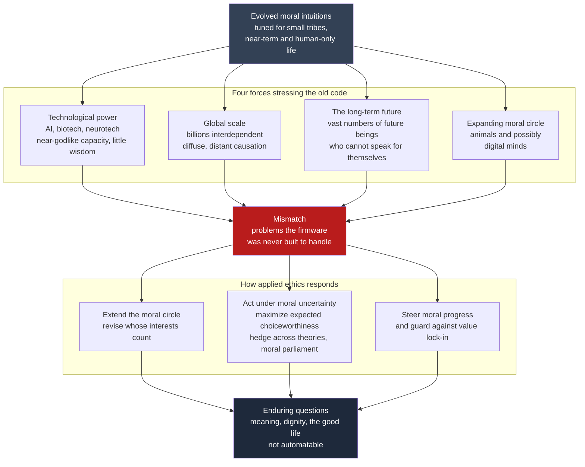

# 🔭 The Future of Ethics

> [!abstract] TL;DR
> This is the **capstone** of the Ethics & Applied Ethics vault. Its organizing claim: our moral minds are **evolved firmware** — a fast, affect-laden intuition engine calibrated for small tribes, near-term consequences, and human-only, face-to-face interaction (see [[Moral_Psychology_and_Intuitions]]). But the problems now on the table are **global** (billions interdependent, causation diffuse), **technologically mediated** (AI, biotech, and neurotech handing us near-godlike capacities faster than wisdom accrues), **long-term** (our choices bind an astronomical number of future beings who cannot vote or protest — see [[Future_Generations_and_Intergenerational_Justice]]), and **cross-substrate** (an expanding moral circle now reaching toward animals and possibly digital minds — see [[Moral_Status_and_the_Moral_Circle]]). The firmware is running far outside its design envelope. The future of ethics is the project of **extending morality beyond its evolutionary and traditional comfort zone** — and doing so *rigorously despite unresolved metaethical disagreement*. The central methodological advance is **moral uncertainty**: since we do not know which ethical theory is correct, we should not just pick one and bet the world on it, but **maximize expected choiceworthiness** across the theories we might be right about (MacAskill & Ord), hedging like a diversified portfolio and reaching for options that are **robustly good across theories** rather than fanatically optimal on one. Looming over all of it is **value lock-in** — the risk that powerful technology freezes today's flawed values forever (see [[AI_Alignment_and_Existential_Risk]]) — and the enduring, un-automatable questions of **meaning, dignity, and the good life** that no optimizer will answer for us. The demand is a **moral seriousness proportional to our growing power**.

---

## Intuition

**Analogy: ancient firmware running on alien hardware.**

Your moral sense is a piece of very old, very good software. Natural selection wrote it to solve the adaptive problems of a Pleistocene band of a hundred-odd relatives and neighbors: *don't be cheated, punish free-riders, care for kin, guard your reputation, feel disgust at the diseased and the taboo, trust the person in front of you and fear the stranger over the hill.* It runs in milliseconds, below awareness, and it is astonishingly reliable **for the environment it was compiled for** — a world of small numbers, immediate consequences, visible faces, and no non-human stakeholders that could talk back.

Now we have quietly swapped out the hardware. The band of a hundred became eight billion strangers linked by supply chains and comment threads. The immediate consequence became a carbon molecule that warms a coastline in ninety years, or a training run whose effects ripple across a century. The visible face became a statistic, an algorithm's output, an unborn generation, a factory-farmed animal, a candidate digital mind. The firmware keeps executing its old routines — scope-neglecting ("one child in a well moves me more than a famine of millions"), present-biased, in-group-favoring, proximity-sensitive — and it **misfires**, because the inputs are nothing like what it was built to handle. Ethics-as-a-discipline is the ongoing, deliberate work of **patching and extending that firmware**: noticing where the evolved intuition tracks a morally irrelevant feature, and consciously overriding it with reasoning the ancestral environment never required. The future of ethics is that upgrade project, running under deadline pressure — because for the first time, the technologies we build could **lock the current version in place before we finish debugging it.**

---

## How It Works

### The synthesis: what this vault has been building toward

Read the whole vault as one argument. It opened with the **method** — how to reason from cases toward reflective equilibrium ([[Applied_Ethics_Overview]], [[Moral_Reasoning_and_Case_Analysis]]), the empirical psychology of the intuitions that method must sometimes trust and sometimes override ([[Moral_Psychology_and_Intuitions]]), the persistent *disagreement* that makes ethics contested rather than solved ([[Metaethics_and_Moral_Disagreement]]), and the prior question of *whose interests even count* ([[Moral_Status_and_the_Moral_Circle]]). It then ran that machinery through four domains: **bioethics** ([[Principles_of_Biomedical_Ethics]], [[End_of_Life_Ethics]], [[Reproductive_Ethics]]), **AI and technology ethics** ([[AI_Ethics_Overview]], [[Algorithmic_Fairness_and_Bias]], [[Privacy_Surveillance_and_Data_Ethics]], [[AI_Alignment_and_Existential_Risk]]), **environmental and animal ethics** ([[Climate_Ethics]], [[Animal_Ethics_and_Rights]], [[Future_Generations_and_Intergenerational_Justice]]), and **social, political, and economic ethics** ([[Business_Ethics]], [[Global_Justice_and_Human_Rights]]). The frontier note does not add a *sixth domain*; it **names the common shape** underneath all of them. Every one of those problems is a case where the evolved, tradition-bound moral sense is stretched past its envelope by the *same four forces* — and where the *same methodological upgrade* (moral uncertainty) is what lets us act anyway.

### Force 1 — Technological power outrunning wisdom

AI, biotechnology, and neurotechnology are handing humanity capacities that were, for all of prior history, reserved for gods or fiction: to design minds, edit the germline, read and rewrite affect and memory, and deploy optimizers more capable than their designers. The structural problem is a **rate mismatch** — capability compounds exponentially while moral wisdom, institutions, and consensus accrete slowly and locally. Genetic engineering and human enhancement force questions the tradition never had to answer (what may we *choose* about our children's nature; is there a wisdom in the given?); neurotechnology reopens autonomy, identity, and mental privacy at the level of the neuron; and advanced AI raises the possibility of **artificial agents that are themselves moral patients or agents** ([[Autonomy_Accountability_and_Moral_Machines]]). *(Dedicated Neuroethics and Genetic-Engineering notes are planned for this section but not yet written; the ideas appear here in prose.)*

### Force 2 — Global scale and interdependence

Morality evolved for **dyadic and small-group** interaction; the defining moral facts of the present are **aggregate and diffuse**. My consumption is one imperceptible contribution to a collective harm; the person I could help is a statistic on another continent; the institution I participate in distributes benefits and burdens across strangers I will never meet ([[Global_Justice_and_Human_Rights]], [[Environmental_Justice_and_Sustainability]]). Intuitions built for reciprocity between visible partners handle this badly — hence scope neglect, the identifiable-victim effect, and the diffusion of responsibility. Extending ethics here means constructing **impartial, institution-level, aggregative** reasoning that the gut does not supply for free.

### Force 3 — The long-term future

Almost everyone who could ever exist lives in the **future**, and they are entirely at our mercy while being unable to bargain, vote, or protest. If humanity's potential is vast, then decisions made this century — about existential risk, climate, and which values get entrenched — carry moral weight out of all proportion to the number of people alive to make them ([[Future_Generations_and_Intergenerational_Justice]]). This is where **population ethics** bites (do we count *additional happy lives* as a benefit? the Repugnant Conclusion; the Non-Identity Problem — *planned Population-Ethics note, discussed here in prose*), and where the **longtermist** wager originates: that positively shaping the far future may be a key moral priority of our time.

### Force 4 — The expanding moral circle

The historical arc of moral progress reads, in part, as an **expansion of the circle of moral concern** — from clan to tribe to nation to all humans, and then outward to sentient animals and, prospectively, to artificial minds ([[Moral_Status_and_the_Moral_Circle]], [[Animal_Ethics_and_Rights]]). Each expansion required overriding an evolved in-group bias with a principled criterion (sentience, the capacity to suffer, the capacity for a life that can go better or worse). The open frontier is **cross-substrate**: if a system's *functional organization* is what grounds moral status, then a sufficiently sophisticated AI might be a moral patient — and building, copying, or deleting it would be morally loaded acts we currently perform without a second thought.

### The methodological advance: acting under moral uncertainty

Here is the deepest upgrade, because it addresses the **disagreement** that Force-driven problems make unavoidable. We are uncertain not only about the *facts* but about the *theory* — is the right framework consequentialist, deontological, virtue-based, contractualist? The traditional move is to *pick your favorite and act on it*. But if you assign real credence to other theories, betting the whole world on your single best guess is reckless. The alternative, developed by **William MacAskill and Toby Ord**, treats metaethical uncertainty the way decision theory treats empirical uncertainty:

1. **Credences over theories.** Assign a probability distribution across the normative theories you take seriously — say 50 percent consequentialism, 30 percent deontology, 20 percent virtue.
2. **Choiceworthiness within each theory.** Each theory rates every available option by how *choiceworthy* it is according to that theory.
3. **Maximize Expected Choiceworthiness (MEC).** Choose the option with the highest credence-weighted average choiceworthiness across theories — **moral hedging**, the ethical analogue of a diversified portfolio.

Two hard problems make this non-trivial. The **problem of intertheoretic comparison**: theories rate options on **incommensurable, arbitrary scales**, so a theory that merely happens to output *bigger numbers* would hijack the weighted sum — a scale-driven **fanaticism** in which one theory dictates the answer regardless of your credence in it. The standard fix is **normalization** (variance or range normalization), giving each theory a *proportionate* say rather than a say scaled by its accidental units — the [[#Python Demo]] makes this concrete. And **theories that don't offer cardinal choiceworthiness at all** (many deontologies speak only of *permitted/forbidden*, not degrees) motivate richer procedures — Ord's **moral parliament** (imagine delegates apportioned by your credences, bargaining and voting), and **moral trade** (parties with different views strike deals that each finds better by its own lights). The practical upshot is a bias toward **robustness**: options that are *acceptable across many theories* beat options that are *optimal on one and catastrophic on another* — precisely the hedge that avoids fanaticism.

### Two frontier risks and one enduring residue

**Moral progress and whether we can steer it.** History shows values *do* change — slavery abolished, the circle widened — but progress is neither automatic nor monotonic (*planned Moral-Progress note; discussed here in prose*). The frontier question is whether we can deliberately *accelerate and direct* moral improvement rather than leave it to accident. **Value lock-in.** The mirror-image danger: a sufficiently powerful technology — a globally dominant AI, a stable totalitarian order — could **freeze the prevailing values permanently**, ending the error-correcting process before we have gotten values right. Getting the values *wrong and permanent* may be the worst outcome available to us, which is why alignment is not only a safety problem but a **moral-epistemology** problem ([[AI_Alignment_and_Existential_Risk]]). **The un-automatable residue.** Finally, some questions will not be handed off to any machine or method — *what makes a life meaningful, what dignity demands, what the good life is* ([[Technology_and_the_Good_Life]]). AI may become a powerful **moral tool or even advisor** (surfacing considerations, checking consistency, modeling consequences), but delegating *the choice of what to value* to a system whose values we set is circular — and outsourcing moral judgment risks atrophying the very capacity that makes us moral agents.



---

## Key Concepts

### Secondary — the picture everyone should hold

- **Your moral sense is evolved firmware.** It works beautifully for small, near-term, face-to-face problems and **misfires** on global, long-term, technological, cross-species ones. Ethics is the deliberate work of patching it.
- **The four forces.** Modern moral problems are hard because they are *bigger* (global scale), *more powerful* (new technology), *longer* (the far future), and *wider* (animals, maybe AIs) than anything the gut was built for.
- **We disagree about which theory is right — and that's okay to act under.** You do not have to *first* solve metaethics to act well. You can **hedge**: weight the theories by how likely each is to be correct, and pick the option that comes out best on average.
- **Robust beats fanatical.** An option that is *decent under every plausible theory* is usually wiser than one that is *perfect under your favorite and disastrous under the others*.
- **The scariest failure is getting values wrong *and permanent* — value lock-in.** Some questions (meaning, dignity, the good life) no machine will answer for us.

### Undergraduate — the working machinery

- **Evolutionary mismatch** — the gap between the environment the moral emotions were selected for and the one we now inhabit; the mechanistic root of scope neglect, present bias, in-group favoritism, and proximity sensitivity.
- **Expanding moral circle** (Lecky, Singer) — moral progress as the widening of who counts, driven by overriding evolved in-group bias with a principled criterion of moral status.
- **Longtermism** — the view that positively influencing the long-term future is a key moral priority, resting on (i) future people count morally, (ii) there may be very many of them, and (iii) we can non-trivially affect their prospects.
- **Moral uncertainty & MEC** — take credences over normative theories; **maximize expected choiceworthiness**; hedge like a portfolio; prefer robustness to fanaticism.
- **Intertheoretic comparison** — the problem that theories' choiceworthiness scales are incommensurable and arbitrary; addressed by **variance/range normalization** so a theory's *units* don't decide the answer.
- **Value lock-in** — the entrenchment of a set of values (via AI, institutions, or ideology) in a way that forecloses future moral correction.

### Graduate — the contested frontier

- **The normalization problem, precisely.** MEC requires a **common scale** across theories. Variance normalization (equalize each theory's variance in choiceworthiness across options) and range normalization are defensible but *substantive* choices — they smuggle in a metaethical stance about "how much each theory gets to say." There is no theory-neutral exchange rate; the whole approach is only as principled as the normalization it assumes.
- **Ordinal vs cardinal theories.** Many deontologies and virtue ethics give only *rankings* or *permissible/forbidden* verdicts, not cardinal choiceworthiness — so MEC is undefined for them. Remedies: the **moral parliament** (Nash-bargaining or proportional-voting delegates), **My Favorite Theory**, and **My Favorite Option** approaches, each with pathologies.
- **Regress and higher-order uncertainty.** If we are uncertain over first-order theories, are we not also uncertain over the *decision procedure* for handling that uncertainty? The threat of a regress, and whether MEC can be motivated non-question-beggingly.
- **Fanaticism, again.** MEC can be hijacked not only by scale but by theories that posit *infinite* or *lexically prior* values (an absolute deontological side-constraint, infinite disvalue of a soul's damnation), swamping all finite considerations — the structural cousin of Pascal's mugging in the moral domain.
- **Debunking and moral progress.** If moral change is driven by evolved intuition, social contagion, and material conditions rather than tracking *moral facts*, in what sense is "progress" progress? The realist needs the circle's expansion to be *discovery*; the anti-realist reads it as *drift we happen to endorse* ([[Metaethics_and_Moral_Disagreement]]).
- **Steering vs lock-in trade-off.** Deliberately shaping humanity's values risks the very lock-in it fears; preserving open-ended moral exploration (option value, reversibility, a "long reflection") may be the meta-value that protects all the others.

---

## Python Demo

The demo operationalizes **acting under moral uncertainty**. We hold **credences** over three ethical theories and each theory rates four options by **choiceworthiness**. The rational act **maximizes expected choiceworthiness** (MEC). The subtle part is **intertheoretic comparison**: because the theories use arbitrary, incompatible units, a naive weighted sum lets whichever theory emits *bigger numbers* dominate — a scale-driven fanaticism. We fix it by **range-normalizing** each theory onto a common `0..1` scale, then map how the recommended option shifts across the entire **credence simplex**. Uses only `numpy` and `matplotlib`.

```python
# Decision-making under MORAL uncertainty (MacAskill & Ord).
# We are unsure WHICH ethical theory is correct, so we hold CREDENCES
# (a probability distribution) over three theories -- consequentialism,
# deontology, virtue -- and each theory rates every option by its
# "choiceworthiness". The rational act MAXIMIZES EXPECTED CHOICEWORTHINESS
# (MEC): the credence-weighted average of choiceworthiness across theories.
#
# The catch is INTERTHEORETIC COMPARISON: the theories use arbitrary,
# incompatible units, so a theory that merely happens to emit BIGGER numbers
# would hijack a naive weighted sum (a scale-driven "fanaticism"). We fix it
# by RANGE-NORMALIZING each theory onto a common 0..1 scale before combining,
# giving every theory a proportionate say.

import numpy as np
import matplotlib
matplotlib.use("Agg")
import matplotlib.pyplot as plt

# --- The decision problem -------------------------------------------------
options = ["O1 maximize welfare",   # break a promise, sacrifice one
           "O2 respect rights",      # keep the promise, no sacrifice
           "O3 act from virtue",     # compassion + integrity
           "O4 balanced compromise"]

# RAW choiceworthiness assigned by each theory (rows = theories).
# Note the arbitrary, incompatible scales -- deontology emits a big NEGATIVE
# for the rights violation. That mismatch is the intertheoretic-comparison trap.
C_raw = np.array([10.0,  3.0, 6.0, 8.5])   # consequentialism: loves O1
D_raw = np.array([-10.0, 8.0, 0.8, 5.0])   # deontology: loves O2, abhors O1
V_raw = np.array([2.0,   5.0, 9.0, 7.6])   # virtue: loves O3
raw   = np.vstack([C_raw, D_raw, V_raw])

def range_normalize(M):
    # Map each theory's row onto a common 0..1 scale (variance/range voting):
    # every theory gets an equal say, independent of its accidental units.
    lo = M.min(axis=1, keepdims=True)
    hi = M.max(axis=1, keepdims=True)
    return (M - lo) / (hi - lo)

norm = range_normalize(raw)

def recommend(credences, table):
    ec = credences @ table          # expected choiceworthiness per option
    return int(np.argmax(ec)), ec

# --- 1. The intertheoretic-comparison trap --------------------------------
# Suppose deontology merely expressed its scores in bigger units (x50).
raw_inflated = raw.copy()
raw_inflated[1] *= 50.0
cred = np.array([0.80, 0.10, 0.10])        # we are 80% consequentialist!

i_naive, _ = recommend(cred, raw_inflated)  # naive sum, no normalization
i_mec,   _ = recommend(cred, norm)          # MEC on normalized scales

print("Credences: 80% consequentialism, 10% deontology, 10% virtue")
print(f"  Naive sum on inflated raw scores -> picks {options[i_naive]}")
print( "     (deontology's favorite wins on 10% credence: SCALE FANATICISM)")
print(f"  Range-normalized MEC             -> picks {options[i_mec]}")
print( "     (tracks our actual 80% consequentialist credence)\n")

# --- 2. How the recommendation shifts across the credence simplex ---------
res, pts, winners = 160, [], []
for a in range(res + 1):
    for b in range(res + 1 - a):
        pC, pD = a / res, b / res
        pV = 1.0 - pC - pD
        w, _ = recommend(np.array([pC, pD, pV]), norm)
        x = pD + 0.5 * pV                       # barycentric -> 2D:
        y = (np.sqrt(3) / 2) * pV               # C=(0,0) D=(1,0) V=(0.5, h)
        pts.append((x, y)); winners.append(w)

pts, winners = np.array(pts), np.array(winners)
colors = ["#2563eb", "#dc2626", "#059669", "#f59e0b"]      # O1 O2 O3 O4
labels = ["O1 welfare (conseq. favorite)", "O2 rights (deont. favorite)",
          "O3 virtue (virtue favorite)", "O4 compromise (the HEDGE)"]

plt.figure(figsize=(8.2, 7.4))
for k in range(4):
    m = winners == k
    plt.scatter(pts[m, 0], pts[m, 1], s=11, c=colors[k], label=labels[k])
plt.text(0.0, -0.05, "100% Consequentialism", ha="center", fontsize=9)
plt.text(1.0, -0.05, "100% Deontology",       ha="center", fontsize=9)
plt.text(0.5, np.sqrt(3)/2 + 0.03, "100% Virtue ethics", ha="center", fontsize=9)
plt.title("Maximize Expected Choiceworthiness across the credence simplex\n"
          "which option is rational as credence over theories shifts")
plt.legend(loc="upper right", fontsize=8, markerscale=2)
plt.axis("equal"); plt.axis("off")
plt.tight_layout()
plt.savefig("moral_uncertainty_mec.png", dpi=120, bbox_inches="tight")
plt.show()
```

**What the demo shows.** *Part 1* is the intertheoretic-comparison trap. We are 80 percent confident consequentialism is correct, yet if deontology merely states its verdicts in bigger units (a x50 rescaling — arbitrary, since the units were never meaningful), the **naive weighted sum still picks deontology's favorite, O2**, on a mere 10 percent credence. That is **fanaticism by scale**: the theory you barely believe dictates the answer because it happened to shout louder. After **range-normalizing** every theory onto a common 0..1 scale, MEC recovers sanity and picks **O1**, the consequentialist favorite — tracking our *actual* 80 percent credence. *Part 2* maps the recommendation over the whole space of credences (the triangle: each corner is 100 percent belief in one theory). Near each vertex, that theory's favorite wins — blue O1 by consequentialism, red O2 by deontology, green O3 by virtue. But look at the **amber region in the center**: there, where no single theory dominates, MEC recommends **O4, the compromise that *no theory ranks first*** (every theory ranks it *second*). That is **moral hedging** made visual — under genuine uncertainty, the rational act is often the robustly-acceptable option, not any theory's ideal. Shift your credences and the boundary moves; the picture is a rigorous way to *act* while your metaethics stays unresolved.

---

## Real-World Applications

> **Example — Effective Altruism and cause prioritization.** The EA movement is applied moral-uncertainty reasoning at scale: it explicitly hedges across worldviews (near-term human welfare, animal welfare, long-term/x-risk) rather than betting everything on one, using expected-value and "robustness across moral views" to allocate billions in giving. Its longtermist wing operationalizes Force 3 directly — treating existential-risk reduction as high-priority precisely because of the astronomical number of future beings at stake (*a dedicated Effective-Altruism note is planned for this vault*).

- **AI governance and alignment.** Frontier-lab safety frameworks and international summits are, at root, attempts to prevent **value lock-in** and to keep the future correctable — the [[AI_Alignment_and_Existential_Risk]] agenda is the future-of-ethics problem in its most urgent institutional form. "Whose values, loaded how" is the intertheoretic-comparison problem wearing an engineering hat.
- **Gene editing and enhancement policy.** The 2018 CRISPR-babies episode and ongoing germline-editing moratoria are Force 1 in the wild: a capacity arriving faster than consensus, forcing bioethics ([[Principles_of_Biomedical_Ethics]], [[Reproductive_Ethics]]) to reason under deep moral uncertainty about irreversible, heritable change.
- **Climate policy and discounting.** The fight over the **social discount rate** (Stern vs Nordhaus) is population ethics and intergenerational justice made fiscal — how much a future life is "worth" today is exactly the long-term-future force meeting concrete policy ([[Climate_Ethics]], [[Future_Generations_and_Intergenerational_Justice]]).
- **Animal welfare and the moral circle.** Cultivated meat, cage-free legislation, and wild-animal-suffering research are Force 4 operationalized — a live, funded attempt to widen the circle to non-human sentience ([[Animal_Ethics_and_Rights]]).
- **AI as moral advisor.** Early "constitutional" and value-elicitation systems (see [[Responsible_AI]]) are prototypes of AI-as-moral-tool — useful for surfacing considerations and checking consistency, dangerous if we let them *set* the values rather than *serve* our reasoning. The parallel capstone [[The_Future_of_Law]] traces the same "code eats judgment" dynamic in the legal domain.

---

## Common Pitfalls

- **Trusting the firmware where it misfires.** Treating a strong gut reaction as authoritative on a global/long-term/technological problem it was never calibrated for — scope neglect, present bias, and proximity effects masquerading as moral insight. The corrective is *discrimination*, not blanket deference or blanket suspicion (see [[Moral_Psychology_and_Intuitions]]).
- **Waiting to solve metaethics before acting.** Refusing to act until you know which theory is *correct*. You never will; moral uncertainty is the permanent condition, and MEC-style hedging is precisely how to act well within it.
- **Fanaticism — by probability or by scale.** Letting a tiny-probability, astronomically-large payoff (Pascalian x-risk) or a single theory's inflated units dominate every decision. Both are structurally identical hijackings; normalization and worldview-robustness are the guardrails.
- **Ignoring the intertheoretic-comparison problem.** Naively averaging choiceworthiness across theories as if their numbers were on the same scale — the demo's trap. There is *no theory-neutral exchange rate*; any aggregation smuggles in a substantive normalization choice, and pretending otherwise hides the assumption.
- **Confusing moral change with moral progress.** Assuming that because values *shift*, they *improve*. Progress is a normative claim that needs defending, not a historical inevitability — and lock-in could freeze a *bad* endpoint just as easily as a good one.
- **Outsourcing the un-automatable.** Delegating the *choice of what to value* to an AI whose values we set is circular; using AI to *replace* rather than *augment* moral judgment risks atrophying moral agency itself.
- **Longtermist tunnel vision.** Letting the sheer size of the future crowd out present, identifiable suffering — a moral-scope error in the opposite direction. Robustness cuts both ways: an ethic acceptable across theories does not sacrifice the near for a fanatical bet on the far.

---

## Related Concepts

*(All wikilinks below were verified against the vault. Notes for Neuroethics, Genetic Engineering, Population Ethics, Moral Progress, and Effective Altruism are planned for this section but not yet written, so those ideas appear above in prose without links.)*

- [[Applied_Ethics_Overview]] — the vault's entry point; this capstone names the common structure beneath the six domains that overview mapped.
- [[Moral_Psychology_and_Intuitions]] — the "evolved firmware" thesis; the empirical basis for *why* our intuitions misfire outside their ancestral envelope.
- [[Metaethics_and_Moral_Disagreement]] — the persistent theory-level disagreement that makes moral uncertainty the honest baseline and MEC necessary.
- [[Moral_Reasoning_and_Case_Analysis]] — the method (reflective equilibrium, reasoning under uncertainty) that moral hedging extends to the metaethical level.
- [[Moral_Status_and_the_Moral_Circle]] — Force 4: whose interests count, and the cross-substrate frontier of animals and digital minds.
- [[AI_Alignment_and_Existential_Risk]] — Force 1 and the value-lock-in risk in their most urgent form; the sister capstone on catastrophic and existential stakes.
- [[Autonomy_Accountability_and_Moral_Machines]] — whether artificial agents can be moral agents or patients; the machine-moral-status question.
- [[Future_Generations_and_Intergenerational_Justice]] — Force 3: what we owe the vast number of people who come after us.
- [[Climate_Ethics]] — Force 2 and Force 3 fused: diffuse global causation binding distant future generations.
- [[Animal_Ethics_and_Rights]] — the already-open expansion of the moral circle to non-human sentience.
- [[Global_Justice_and_Human_Rights]] — Force 2: impartial, institution-level reasoning across billions of strangers.
- [[Technology_and_the_Good_Life]] — the un-automatable residue: meaning, flourishing, and dignity that no optimizer resolves.
- [[Metaethics]] — the Philosophy-vault treatment of moral realism vs anti-realism underlying "is moral change *progress*?"
- [[Consequentialism_and_Utilitarianism]] — one of the three theories in the MEC demo; the framework the longtermist expected-value case leans on.
- [[Deontology_and_Kantian_Ethics]] — the rights-and-constraints theory whose big-negative verdict drives the intertheoretic-comparison trap in the demo.
- [[Virtue_Ethics]] — the character-and-flourishing theory rounding out the credence distribution; the natural home of the "good life" residue.
- [[Responsible_AI]] — the AI-ML vault's governance machinery; the parallel operationalization of "keep the future correctable."
- [[The_Future_of_Law]] — the parallel capstone in the Law vault: the same "powerful technology outruns human judgment" dynamic, in the legal operating system.

---

## Review Questions

### Secondary

1. Explain the "evolved firmware" analogy in your own words. Give one concrete example of a modern moral problem (global, long-term, technological, or cross-species) where a strong gut reaction is a *poor* guide, and say why the intuition misfires.
2. You are unsure whether consequentialism, deontology, or virtue ethics is correct. Instead of just picking your favorite, what does "maximize expected choiceworthiness" tell you to do — and why is the compromise option sometimes the wise choice even though *no* theory ranks it first?

### Undergraduate

1. Name the **four forces** stretching ethics beyond its evolutionary comfort zone and give a real-world case for each. For one of them, explain the specific evolved intuition (e.g., scope neglect, in-group bias, present bias) that the force exposes as unreliable.
2. In the Python demo, inflating deontology's units by 50x flips the naive recommendation to deontology's favorite even at 10 percent credence, while normalization restores the consequentialist favorite at 80 percent credence. (a) Explain *why* the naive sum fails — what is the intertheoretic-comparison problem? (b) What substantive assumption does range normalization itself smuggle in, and why is there no fully theory-neutral fix?
3. Define **value lock-in** and explain why alignment is therefore not only a safety problem but a *moral-epistemology* problem. Why might "getting values wrong and permanent" be worse than many other catastrophes?

### Graduate

1. MEC requires cardinal, cross-theory-comparable choiceworthiness, but many deontologies and virtue theories are only *ordinal* or verdict-based. Lay out how the **moral parliament** handles this, and identify one pathology of the parliament approach and one of "My Favorite Theory." Which better respects the intuition that a theory you barely believe should not dictate your action?
2. There is a structural tension between **steering moral progress** and **avoiding value lock-in**: deliberately shaping humanity's values could itself entrench them prematurely. Argue for a meta-value (e.g., preserving option value, reversibility, or a "long reflection") that could resolve the tension, and state the strongest objection to prioritizing it over first-order moral improvement.
3. A longtermist argues that reducing a 0.1 percent existential risk this century swamps all present suffering because the future could contain astronomically many lives. Reconstruct the argument, then deploy **two** distinct objections from the vault (e.g., Pascalian fanaticism, cluelessness about long-run effects, deep uncertainty, or a moral-scope error toward the present) and specify what a *worldview-robust*, non-fanatical decision procedure recommends instead.

---

## Sources

- MacAskill, W., Bykvist, K., & Ord, T. (2020). *Moral Uncertainty*. Oxford University Press. (Maximize expected choiceworthiness, intertheoretic comparison, the moral parliament.)
- Ord, T. (2020). *The Precipice: Existential Risk and the Future of Humanity*. Hachette. (Existential risk, value lock-in, the long reflection, our obligations to the future.)
- MacAskill, W. (2022). *What We Owe the Future*. Basic Books. (Longtermism, the expanding moral circle, value lock-in, steering moral progress.)
- Singer, P. (1981/2011). *The Expanding Circle: Ethics, Evolution, and Moral Progress*. Princeton University Press. (The moral circle and the tension between evolved intuition and impartial reason.)
- Greene, J. D. (2013). *Moral Tribes: Emotion, Reason, and the Gap Between Us and Them*. Penguin Press. (Evolved moral firmware vs the modern problems it was not built for.)
- Bostrom, N. (2013). "Existential Risk Prevention as Global Priority." *Global Policy*, 4(1), 15–31. (The astronomical-stakes argument and its structure.)

---

#ethics #future-of-ethics #moral-uncertainty #applied-ethics #metaethics
