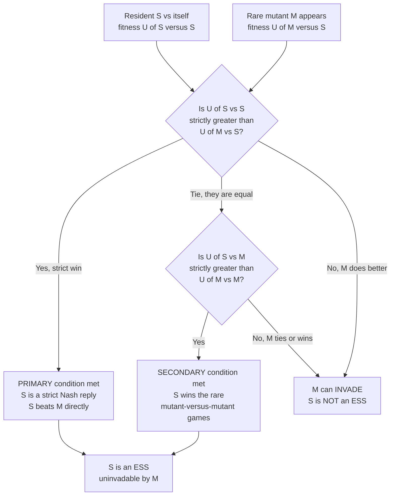

# 🛡️ Evolutionarily Stable Strategies (ESS)

> [!abstract] TL;DR
> An **Evolutionarily Stable Strategy (ESS)** is a strategy that, once adopted by (almost) an entire population, **cannot be invaded** by any rare mutant strategy — natural selection defends it against deviants. It is the central *static* solution concept of evolutionary game theory (Maynard Smith & Price, 1973), a **refinement of Nash equilibrium** (every ESS is Nash, but not vice versa). It can be a pure convention or a stable population mixture (like the Hawk-Dove fraction), and — crucially — it need **not** be optimal: mutual defection in the Prisoner's Dilemma is an ESS. ESS answers the question *"what does evolution get stuck at?"*

---

## Intuition

**Analogy:** Imagine a population where *everyone* follows one strategy, and it is so entrenched that any lone rebel who tries something different does **worse** and dies out before it can spread. That strategy is "evolutionarily stable" — a **fortress that natural selection defends against invaders**. It is the evolutionary answer to *"what strategy will we end up stuck with?"* — not necessarily the *best* possible one, just the one that no mutant can beat once it is in charge.

In classical game theory a Nash equilibrium is about *rational* players who have no incentive to unilaterally deviate. ESS translates this to a world with **no rationality at all** — just birth, death, and imitation. A strategy is "chosen" not because anyone reasons about it, but because its carriers out-reproduce (or out-compete, or get copied more than) the carriers of every alternative. Payoff becomes *fitness*; "deviating" becomes a *mutation*; "stable" becomes *uninvadable*.

---

## How It Works

### Core Mechanics

Consider a large, well-mixed population where individuals repeatedly play a **symmetric two-player game** with payoff (fitness) function `u(x, y)` = the payoff to an `x`-player facing a `y`-player. Almost everyone plays the resident strategy **S**; a tiny fraction `ε` are mutants playing **M**.

1. **Encounter mix.** A random opponent is `S` with probability `1 − ε` and `M` with probability `ε`. So the effective opponent distribution is `(1 − ε)S + εM`.
2. **Resident fitness** = `u(S, (1−ε)S + εM)`; **mutant fitness** = `u(M, (1−ε)S + εM)`.
3. **Invasion test.** If the mutant's fitness *exceeds* the resident's for small `ε`, mutants grow in frequency — the invasion **succeeds** and `S` is *not* an ESS. If the resident always does at least as well, selection pushes the mutants back to zero.

Expanding the fitnesses to first order in `ε` collapses this into **Maynard Smith's two conditions**. `S` is an ESS if, for *every* mutant `M ≠ S`, one of these holds:

- **Primary (strict Nash) condition:** `u(S, S) > u(M, S)` — the resident beats the mutant directly in the overwhelming common encounter (against other residents). This alone makes `S` a *strict best reply to itself*.
- **Secondary (tie-breaker) condition:** if they tie against the resident, `u(S, S) = u(M, S)`, then require `u(S, M) > u(M, M)` — the resident must win the *rare* mutant-vs-mutant encounters. This handles the boundary case where the mutant is an equally-good reply to `S`.

The secondary condition is what makes ESS **stronger than Nash**: a plain Nash equilibrium only needs `u(S, S) ≥ u(M, S)`; ESS additionally demands that ties be broken in the resident's favour, killing off *neutral* invaders that could otherwise drift in.

### The Nash hierarchy

Every ESS is a symmetric Nash equilibrium (a best reply to itself — otherwise a fitter mutant invades immediately). But not every Nash equilibrium is an ESS. The inclusion is strict:

> **strict Nash ⊂ ESS ⊂ Nash**

ESS is a *refinement* that rules out **unstable** equilibria — for example the mixed 50/50 equilibrium of a coordination game is Nash but *not* an ESS, because a pure-strategy mutant ties against it and then wins the mutant-vs-mutant encounters (fails the secondary condition).

### Flow / Architecture



---

## Key Concepts

### Secondary (school) level

- **The idea in one line:** an ESS is a habit so widespread that any newcomer trying something different does worse and vanishes. Aggressive "Hawks" and peaceful "Doves" settle into a fixed proportion where neither type has an advantage.
- **Not always the "nice" outcome:** the stable strategy can be a bad one for everyone. If "always fight" spreads, a lone peaceful individual gets exploited, so fighting persists even though everyone would be better off cooperating.

### Undergraduate level

- **Formal definition:** `S` is an ESS iff for all `M ≠ S`, either `u(S,S) > u(M,S)`, or `u(S,S) = u(M,S)` and `u(S,M) > u(M,M)`.
- **ESS vs Nash:** ESS = Nash + stability. Every strict Nash equilibrium is automatically an ESS. Weak/mixed Nash equilibria may fail the secondary condition.
- **Pure vs mixed ESS.** A **pure ESS** = everyone does the same thing (a coordination convention: drive on the right, a shared signalling code). A **mixed ESS** = each individual randomizes, *or* — the biologically important reading — the **population is a stable polymorphic mixture** of pure types in fixed proportions. Hawk-Dove with cost `C` exceeding value `V` has a mixed ESS at Hawk-fraction `p* = V / C`.
- **Bishop-Cannings support property:** at a mixed ESS, every pure strategy in the support earns *equal* fitness against the equilibrium; strategies outside the support earn strictly less.

### Graduate level

- **Existence and multiplicity.** ESS need **not exist**: **Rock-Paper-Scissors** has a unique (interior) Nash equilibrium that is *not* an ESS — every strategy is beaten by another, so the dynamics **cycle** endlessly rather than settling. Conversely, games can have **multiple** ESSs (multiple stable conventions), producing **path-dependence**: which one you reach depends on initial conditions.
- **Static vs dynamic stability.** ESS is a *static*, invasion-based criterion. It connects tightly to the **replicator dynamics**: **every ESS is an asymptotically stable rest point** of the replicator equation. The converse fails in general — there exist asymptotically stable rest points that are not ESSs (and, in games with more than two strategies, ESS is only a *sufficient* not necessary condition for dynamic stability).
- **Refinements and generalizations.** Weakenings and extensions include the **Neutrally Stable Strategy (NSS)** (allows neutral invaders, `≥` instead of `>` in the secondary condition), the **evolutionarily stable *state*** (a population composition rather than a single strategy), the **Continuously Stable Strategy (CSS)** for continuous traits, and ESS analogues for **asymmetric** and **multi-player** games. Adaptive-dynamics theory studies when a CSS is instead an **evolutionary branching point**.

---

## Python Demo

```python
# ESS as an INVASION TEST.
# We (1) code Maynard Smith's two conditions, (2) simulate a rare mutant
# invading a resident population, and (3) show that a genuine ESS resists
# ALL mutants while a Nash-but-not-ESS strategy gets invaded.
# Games: Hawk-Dove (mixed ESS) and a coordination game (pure ESS vs mixed NE).

import numpy as np
import matplotlib.pyplot as plt


# u(x, y) = x^T A y : expected payoff/fitness of an x-player facing a y-player.
def u(x, y, A):
    return float(x @ A @ y)


# Maynard Smith's two ESS conditions for resident s against mutant m.
#   PRIMARY   : u(s,s) > u(m,s)                          -> strict, resists
#   SECONDARY : if u(s,s) == u(m,s) then u(s,m) > u(m,m) -> tie broken by s
# Returns True iff s is uninvadable BY THIS specific mutant m.
def resists(s, m, A, tol=1e-9):
    uss, ums = u(s, s, A), u(m, s, A)
    if uss > ums + tol:                       # primary condition
        return True
    if abs(uss - ums) <= tol:                 # tie -> test secondary
        return u(s, m, A) > u(m, m, A) + tol
    return False                              # mutant strictly better -> invades


# Direct invasion simulation: gap = mutant fitness - resident fitness
# in a population that is (1-eps) residents and eps mutants.
# gap > 0  => mutants grow => invasion SUCCEEDS (s is not ESS vs m).
def invasion_gap(s, m, A, eps=0.05):
    mix = (1 - eps) * s + eps * m
    return u(m, mix, A) - u(s, mix, A)


def is_ess(s, A, n_grid=401):
    """Sweep every 2-strategy mutant [q, 1-q] and require s to resist all."""
    for q in np.linspace(0.0, 1.0, n_grid):
        m = np.array([q, 1.0 - q])
        if np.allclose(m, s):
            continue
        if not resists(s, m, A):
            return False, q                    # found an invader
    return True, None


# ---- Game 1: Hawk-Dove, V < C  => interior mixed ESS at p* = V/C ----
V, C = 2.0, 4.0
HD = np.array([[(V - C) / 2, V],
               [0.0,        V / 2]])           # rows/cols: Hawk, Dove
p_star = V / C                                 # = 0.5
ess_HD = np.array([p_star, 1 - p_star])

# ---- Game 2: pure-coordination game  A = I ----
CO = np.array([[1.0, 0.0],
               [0.0, 1.0]])
ess_pure = np.array([1.0, 0.0])                # a strict Nash -> ESS
ne_mixed = np.array([0.5, 0.5])               # Nash, but NOT an ESS

print("Hawk-Dove mixed ESS  p* =", p_star,
      "-> uninvadable?", is_ess(ess_HD, HD)[0])
print("Coordination pure  [1,0] -> uninvadable?", is_ess(ess_pure, CO)[0])
ok, bad_q = is_ess(ne_mixed, CO)
print("Coordination mixed [.5,.5] -> uninvadable?", ok,
      "(invaded by q =", round(bad_q, 3), ")" if bad_q is not None else "")

# ---------- Visualization: invasion gap across all mutant types ----------
qs = np.linspace(0.0, 1.0, 401)
gap_HD   = [invasion_gap(ess_HD,   np.array([q, 1 - q]), HD) for q in qs]
gap_pure = [invasion_gap(ess_pure, np.array([q, 1 - q]), CO) for q in qs]
gap_mix  = [invasion_gap(ne_mixed, np.array([q, 1 - q]), CO) for q in qs]

fig, ax = plt.subplots(1, 2, figsize=(12, 4.5))

ax[0].plot(qs, gap_HD, color="teal", lw=2)
ax[0].axhline(0, color="k", lw=0.8)
ax[0].axvline(p_star, color="gray", ls="--", lw=1, label=f"ESS p*={p_star}")
ax[0].fill_between(qs, gap_HD, 0, where=np.array(gap_HD) <= 0,
                   color="teal", alpha=0.15)
ax[0].set_title("Hawk-Dove mixed ESS: gap <= 0 for every mutant\n(uninvadable)")
ax[0].set_xlabel("mutant Hawk-probability q")
ax[0].set_ylabel("mutant fitness - resident fitness")
ax[0].legend()

ax[1].plot(qs, gap_pure, color="green", lw=2, label="resident = pure ESS [1,0]")
ax[1].plot(qs, gap_mix,  color="crimson", lw=2, label="resident = mixed NE [.5,.5]")
ax[1].axhline(0, color="k", lw=0.8)
ax[1].fill_between(qs, gap_mix, 0, where=np.array(gap_mix) > 0,
                   color="crimson", alpha=0.15, label="invasion succeeds")
ax[1].set_title("Coordination game: ESS resists all,\nNash-not-ESS is invaded")
ax[1].set_xlabel("mutant Hawk-type probability q")
ax[1].set_ylabel("mutant fitness - resident fitness")
ax[1].legend()

plt.tight_layout()
plt.savefig("ess_invasion.png", dpi=120)
print("saved ess_invasion.png")
```

**What the output shows.** For Hawk-Dove the invasion gap is `≤ 0` for *every* mutant type (touching zero only at the ESS itself, `q = 0.5`) — the mixed ESS `p* = V/C = 0.5` is uninvadable. For the coordination game, the pure ESS `[1, 0]` also keeps the gap non-positive everywhere, but the *mixed* Nash equilibrium `[0.5, 0.5]` has a **positive** gap against pure-type mutants: it is a Nash equilibrium that is **not** an ESS, and selection lets the mutants invade.

---

## Real-World Applications

> **Example — Animal conflict (the original motivation):** Maynard Smith & Price built ESS to explain why animals often use *limited* rather than lethal aggression. In many species the observed frequency of aggressive versus display behaviour tracks the Hawk-Dove mixed ESS `V/C` rather than the "all-out war" outcome an individual-optimizing view would predict.

- **Sex ratios.** Fisher's argument that a `1:1` sex ratio is stable is an ESS argument: whichever sex is rarer has higher reproductive value, so any deviation is invaded until parity returns.
- **Microbial and cancer ecology.** "Cooperator" versus "cheater" microbes, and drug-sensitive versus resistant tumour cells, are analysed as ESS/invasion problems; adaptive-therapy protocols deliberately keep a sensitive population as a stable buffer against a resistant invader.
- **Multi-agent learning and mechanism robustness (CS).** ESS underlies stability analysis in multi-agent reinforcement learning, the attractors of evolutionary/genetic algorithms, and the design of protocols and mechanisms robust to "invasion" by a small fraction of cheaters or exploiters — a robustness notion that generalizes well beyond biology.
- **Social conventions.** Which side of the road to drive on, currency and language conventions, and bargaining norms are pure ESSs: once a convention dominates, a lone deviant is simply worse off, so the convention self-enforces even without any central authority.

---

## Common Pitfalls

- **"ESS = the best/optimal outcome."** False, and this is the single most important caveat. An ESS is *stable*, not *efficient*. Mutual **defection** in the Prisoner's Dilemma is an ESS (defect strictly dominates, so no cooperator mutant can invade), yet everyone would be better off cooperating. This gap between *stable* and *optimal* is precisely what motivates the entire study of the evolution of cooperation.
- **"ESS = Nash equilibrium."** Every ESS is a Nash equilibrium, but the reverse fails. Nash omits the secondary tie-breaking condition, so mixed/weak Nash equilibria (like the 50/50 coordination equilibrium) are Nash but invadable, hence not ESS.
- **"Every game has an ESS."** No. **Rock-Paper-Scissors** has none — no strategy resists all invaders — and the population cycles forever. Assuming an ESS exists (and is unique) can be badly wrong.
- **"ESS forgets to break ties."** Checking only the primary condition `u(S,S) ≥ u(M,S)` and forgetting the secondary condition `u(S,M) > u(M,M)` misclassifies neutral invaders as harmless. The secondary condition is exactly what distinguishes an ESS from a merely neutrally stable strategy.
- **"Static ESS and dynamic replicator stability are identical."** They are closely related but not equivalent. Every ESS is asymptotically stable under the replicator dynamics, but not every asymptotically stable rest point is an ESS once there are three or more strategies.

---

## Related Concepts

- [[Evolutionary_Stable_Strategies]] — the Game Theory vault's algebraic treatment, including the Bishop-Cannings theorem and the Hawk-Dove `p* = V/C` derivation.
- [[Nash_Equilibrium]] — the classical solution concept that ESS **refines**; every ESS is a symmetric Nash equilibrium.
- [[Mixed_Strategies]] — the machinery behind a *mixed* ESS and its population-polymorphism interpretation.
- [[Replicator_Dynamics]] — the *dynamic* counterpart: every ESS is an asymptotically stable rest point of the replicator equation.
- [[Cooperation_and_Evolutionary_Game_Theory]] — how the "ESS need not be optimal" tension (defection is an ESS) drives the whole cooperation problem.
- [[Evolutionary_Dynamics_and_Fitness_Landscapes]] — invasion and stability viewed through fitness landscapes and adaptive peaks.
- [[Natural_Selection_and_Adaptation]] — the biological substrate: differential reproduction is what makes "uninvadable" meaningful.

*This note is the foundation of a new Evolutionary Game Theory vault. Sibling notes still to be written — `Evolutionary_Game_Theory_Overview`, `From_Classical_to_Evolutionary_Game_Theory`, `The_Hawk_Dove_Game`, `Evolutionary_Stability_and_Dynamic_Stability`, `Cyclic_Dynamics_and_Rock_Paper_Scissors`, `The_Prisoners_Dilemma_and_Cooperation`, `The_Evolution_of_Conventions_and_Norms`, `Adaptive_Dynamics_and_Evolutionary_Branching`, and `Evolutionary_Game_Theory_and_Machine_Learning` — will each link back here as the vault's anchor solution concept.*

---

## Review Questions

1. **(Secondary)** In words, why does a strategy that "everyone already plays" survive when it is an ESS, and why can a lone rebel still succeed if the strategy is *not* an ESS? Give the Hawk-Dove example.
2. **(Undergraduate)** State Maynard Smith's two ESS conditions. Show that every *strict* Nash equilibrium is an ESS, then exhibit a Nash equilibrium (e.g. the 50/50 equilibrium of a coordination game) that is *not* an ESS by naming which condition it violates.
3. **(Graduate — scenario)** You observe a two-strategy population settle at a stable interior fraction, and a separate three-strategy population that cycles endlessly without settling. For each, say whether an ESS exists, what its relationship to the replicator dynamics is, and why the cyclic case (Rock-Paper-Scissors) shows that "asymptotically stable rest point" and "ESS" are not interchangeable.

---

## Sources

- Maynard Smith, J. & Price, G. R. (1973). "The Logic of Animal Conflict." *Nature* 246, 15–18.
- Maynard Smith, J. (1982). *Evolution and the Theory of Games.* Cambridge University Press.
- Hofbauer, J. & Sigmund, K. (1998). *Evolutionary Games and Population Dynamics.* Cambridge University Press.
- Weibull, J. W. (1995). *Evolutionary Game Theory.* MIT Press.
- Bishop, D. T. & Cannings, C. (1978). "A Generalised War of Attrition." *Journal of Theoretical Biology* 70, 85–124.

---

#evolutionary-game-theory #ess #maynard-smith #invasion #uninvadable
