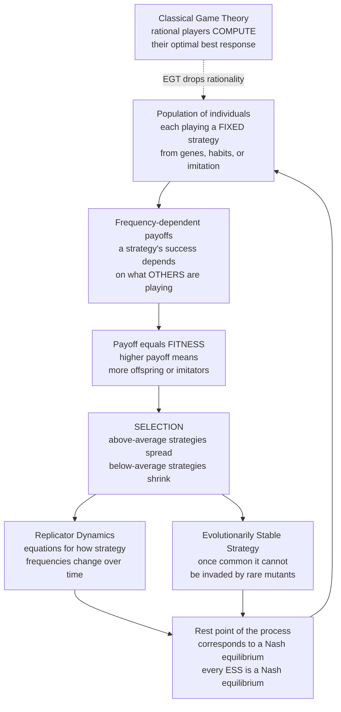

# 🧬 Evolutionary Game Theory Overview

> [!abstract] TL;DR
> **Evolutionary game theory (EGT)** applies game theory to **populations of strategies undergoing selection** rather than to rational players. Classical game theory (von Neumann–Morgenstern, Nash) assumes agents who *compute* their optimal move; EGT (Maynard Smith & Price, 1973) **drops rationality** — a population of individuals each play a *fixed* strategy (from genes, habits, or imitation), and strategies that earn higher **payoff = fitness** simply **spread** by reproduction or copying. The population, not the individual, "solves" the game. Its two central ideas are the **Evolutionarily Stable Strategy (ESS)** — a strategy that, once common, cannot be invaded by rare mutants (the equilibrium view) — and **replicator dynamics** — the equations for how strategy frequencies change over time (the process view). A beautiful bridge ties EGT back to classical theory: **every ESS is a Nash equilibrium**, so evolution gives a *dynamic justification* for Nash without any rational deliberation. Because it needs no reasoning agents, EGT is **one math for many worlds** — animal conflict, cooperation, sex ratios, economic learning, social norms, and multi-agent AI.

---

## Intuition

**Analogy:** Classical game theory imagines a chess grandmaster at the table — a perfectly rational player who looks ahead, weighs every option, and calculates the single best move. But a bacterium fighting for nutrients, a plant angling its leaves for sun, or a small firm setting a price **does not calculate anything**. It just does what its genes, habits, or inherited routines dictate. And here is the trick: **whatever works, spreads.** The bacterium that grows faster leaves more descendants; the pricing habit that earns more gets copied by rivals. Over many generations the *population itself* drifts toward the best-performing strategies — as if it had reasoned its way there, except no one ever reasoned at all.

Evolutionary game theory formalizes exactly this. It replaces the clever rational agent with a **mindless process**: strategies that earn higher payoff **reproduce more**, so the population "learns" the winning strategy through selection, not thought. That makes it game theory for a world without rational players — which, from microbes to markets to cultures, is most of the real world.

---

## How It Works

### The core shift: from rational choice to evolutionary process

Classical game theory rests on **rational players** who know the payoffs and pick a best response (the equilibrium concept is Nash equilibrium). EGT keeps the *game* — the same strategies and payoff matrix — but changes **who plays and how equilibrium arises**:

1. **A population of players, not a single decider.** Instead of one agent choosing among strategies, imagine a large population where each individual is *locked into* one strategy, inherited from genes, learned as a habit, or copied from a successful neighbour.
2. **Payoff is fitness.** The key reinterpretation of Maynard Smith: a strategy's payoff *is* its reproductive **fitness** — its expected number of offspring or imitators. High payoff means "more copies next generation."
3. **Fitness is frequency-dependent.** A strategy's success depends on **what everyone else is doing.** A Hawk (aggressor) does brilliantly in a population of Doves but disastrously among other Hawks. Because the "environment" of any strategy is *the mix of other strategies*, evolution becomes a **game** — this frequency dependence is what makes EGT genuinely game-theoretic rather than ordinary optimization.
4. **Selection replaces reasoning.** No agent computes a best response. Strategies with above-average fitness grow their share; below-average ones shrink. Equilibrium is not *chosen* — it is the **resting point of a selection process.**

### The two central concepts

- **Evolutionarily Stable Strategy (ESS)** — the *static / equilibrium* concept (Maynard Smith & Price, 1973). A strategy is an ESS if, once it is common in the population, **no rare mutant strategy can invade** and spread. Formally, the incumbent must do at least as well against itself as any mutant does, and strictly better against the mutant when tied. ESS answers "which strategy configurations are *uninvadable*?"
- **Replicator dynamics** — the *dynamic* concept (Taylor & Jonker, 1978). A system of differential equations stating that a strategy's frequency grows in proportion to **how much better than the population average** its payoff is. Replicator dynamics answer "starting from any mix, *where does the population go*, and *how fast*?"

Together they give both the endpoint (ESS) and the journey (replicator flow): an ESS is typically an **asymptotically stable rest point** of the replicator dynamics.

### The bridge back to Nash

EGT does not abandon classical theory — it *grounds* it. The "folk theorem of evolutionary game theory" states that **rest points of the replicator dynamics correspond to Nash equilibria**, and **every ESS is a Nash equilibrium** (though not every Nash equilibrium is an ESS — ESS is a *refinement*). So evolution provides a **dynamic justification for Nash equilibrium**: it is what a population of non-rational adapters *converges to*, with no assumption of foresight. Where classical theory asks agents to *deduce* the equilibrium, EGT lets a mindless population *arrive* at it.

### Framework



---

## Key Concepts

### Secondary (intuitive)

- **Strategy that spreads by success, not reason** — the whole field replaces "the smart player picks the best move" with "the strategy that pays best makes the most copies."
- **Payoff = fitness** — winning the game means leaving more descendants (or imitators), not collecting utility points.
- **Frequency dependence** — how good a strategy is depends on how common it (and its rivals) already are; a Hawk thrives among Doves and suffers among Hawks.
- **Uninvadability** — an ESS is a strategy so entrenched that a handful of "mutant" deviants can never gain a foothold.

### Undergraduate (formal)

- **Symmetric normal-form game as a population game** — a payoff matrix `A` where `A[i,j]` is the payoff to an `i`-player meeting a `j`-player; the population state is a probability vector over strategies.
- **ESS definition** — strategy `σ*` is an ESS if for all mutants `σ ≠ σ*`: either `u(σ*, σ*) > u(σ, σ*)`, or `u(σ*, σ*) = u(σ, σ*)` **and** `u(σ*, σ) > u(σ, σ)`.
- **Replicator equation** — `dx_i/dt = x_i · ( f_i(x) − φ(x) )`, where `f_i` is strategy `i`'s fitness against the current mix and `φ` is the population-average fitness. Above-average strategies grow; below-average shrink; the simplex is invariant.
- **ESS ⊆ Nash** — every ESS is a Nash equilibrium; strict Nash equilibria are automatically ESS; mixed Nash equilibria may fail the ESS stability condition (e.g. Rock–Paper–Scissors).
- **Mixed ESS in Hawk–Dove** — when cost `C` exceeds value `V`, the ESS is a *mixed* strategy playing Hawk with probability `V/C`.

### Graduate (advanced)

- **Folk theorem of EGT** — Nash equilibria are exactly the rest points of the replicator dynamics; ESS implies asymptotic stability, but asymptotic stability does **not** imply ESS in games with more than two strategies.
- **Bishop–Cannings theorem** — all pure strategies in the support of a mixed ESS earn equal fitness against it; off-support strategies earn strictly less.
- **Beyond the replicator equation** — the *replicator–mutator* equation (adds mutation), *imitation dynamics*, *best-response dynamics*, and *Moran / Wright–Fisher* finite-population models, where drift and fixation probabilities matter and an ESS can differ from the finite-population "ESS_N."
- **Dynamic pathologies** — replicator dynamics need not converge: Rock–Paper–Scissors produces closed orbits or limit cycles, and some games are chaotic, so "evolution finds Nash" is a hope, not a theorem.
- **Adaptive dynamics & evolutionary branching** — continuous strategy spaces where invasion-fitness gradients drive gradual evolution, sometimes splitting one strategy into two.

---

## Python Demo

The demo below strips EGT to its core. Take the **Hawk–Dove game** (animals contesting a resource of value `V`, where fighting costs `C > V`). Run **replicator dynamics** — the fraction of Hawks changes in proportion to how much better-than-average the Hawk payoff is — from several different starting frequencies. Every trajectory **converges to the same rest point**, the mixed ESS at `p* = V/C`, with **no rational deliberation** anywhere in the loop: just selection acting on payoffs. Note that this evolutionary endpoint **coincides exactly with the classical mixed-Nash prediction** — evolution *derives* what rationality would *deduce*.

```python
# Replicator dynamics on the Hawk-Dove game.
# Core EGT claim demonstrated: a mindless selection process converges to the
# ESS (= mixed Nash) from every starting point, with no rational agent anywhere.
import numpy as np
import matplotlib.pyplot as plt

# Hawk-Dove payoffs. Resource value V, fighting cost C, with C > V.
# Strategy 0 = Hawk, Strategy 1 = Dove.
# A[i, j] = payoff to an i-player that meets a j-player.
V, C = 4.0, 6.0
A = np.array([[(V - C) / 2, V     ],   # Hawk vs {Hawk, Dove}
              [0.0,         V / 2 ]])   # Dove vs {Hawk, Dove}

def replicator_step(x, dt=0.01):
    """One selection step. x = fraction of Hawks (Dove fraction = 1 - x)."""
    pop     = np.array([x, 1.0 - x])   # current population mix
    fitness = A @ pop                  # frequency-dependent payoff of each strategy
    avg     = pop @ fitness            # population-average fitness
    dx      = x * (fitness[0] - avg)   # grow Hawks if above-average, shrink if below
    return x + dx * dt

# Classical / evolutionary prediction: mixed ESS = mixed Nash = V / C.
p_star = V / C

# Run selection from several starting Hawk-fractions -- nobody "reasons".
starts = [0.02, 0.20, 0.40, 0.60, 0.85, 0.98]
T = 2000
trajectories = {x0: [] for x0 in starts}
for x0 in starts:
    x = x0
    for _ in range(T + 1):
        trajectories[x0].append(x)
        x = replicator_step(x)

# Visualize convergence to the ESS from every start.
plt.figure(figsize=(9, 5))
for x0 in starts:
    plt.plot(trajectories[x0], lw=1.8, label=f"start x0 = {x0:.2f}")
plt.axhline(p_star, color="black", ls="--", lw=1.3,
            label=f"ESS = mixed Nash = V/C = {p_star:.3f}")
plt.xlabel("time  (selection steps)")
plt.ylabel("fraction of population playing Hawk")
plt.title("Replicator dynamics converge to the ESS from every starting point")
plt.ylim(0, 1)
plt.legend(loc="center right", fontsize=8)
plt.tight_layout()
plt.savefig("hawk_dove_replicator.png", dpi=120)

print(f"Analytic ESS / mixed-Nash Hawk fraction  p* = V/C = {p_star:.3f}")
for x0 in starts:
    print(f"  start {x0:.2f}  ->  converged to {trajectories[x0][-1]:.3f}")
```

Expected output — every seed relaxes to the same value the rational calculation predicts:

```
Analytic ESS / mixed-Nash Hawk fraction  p* = V/C = 0.667
  start 0.02  ->  converged to 0.667
  start 0.20  ->  converged to 0.667
  start 0.40  ->  converged to 0.667
  start 0.60  ->  converged to 0.667
  start 0.85  ->  converged to 0.667
  start 0.98  ->  converged to 0.667
```

The plotted trajectories fan out from six different starts and all bend toward the dashed ESS line. That the evolutionary rest point and the Nash prediction land on the *same* number is the folk theorem in miniature: **selection reaches the equilibrium that rationality would have reasoned to.**

---

## Real-World Applications

- **Animal conflict (the founding case)** — Maynard Smith & Price introduced the Hawk–Dove game to explain why animals engage in *limited war* rather than fighting to the death: the ESS mixes aggression and restraint. This launched modern behavioral ecology and dissolved the need for group-selection hand-waving.
- **Evolution of cooperation** — EGT's flagship puzzle: how does cooperation survive when defection pays more (the Prisoner's Dilemma)? Mechanisms include kin selection, direct and indirect reciprocity, reputation, and spatial/network structure — a theme with deep reach into biology and society.
- **Sex ratios and life history** — Fisher's argument that a 1:1 sex ratio is evolutionarily stable is an EGT result: whichever sex is rarer earns higher reproductive payoff, so the ratio self-corrects.
- **Host–pathogen and microbial dynamics** — antibiotic resistance, virulence evolution, and "cheater" strains in microbial communities are frequency-dependent games between strategy types.
- **Economics with bounded rationality** — firms, traders, and consumers that *learn and imitate* rather than optimize follow replicator-like dynamics; EGT models market evolution, technology adoption, and the emergence of institutions.
- **Social norms and cultural evolution** — conventions (which side of the road to drive on), fairness norms, and language shifts spread by imitation of success, exactly the EGT mechanism applied to culture rather than genes.
- **Multi-agent AI and self-play** — evolutionary and replicator-style analyses model populations of learning agents, evolutionary algorithms, and self-play training (the meta-game of strategies in systems like poker and Go bots).

---

## Common Pitfalls

- **Assuming replicator dynamics always converge** — they do not. Rock–Paper–Scissors yields cycles, and richer games can be chaotic. "Evolution finds Nash" is a tendency in nice games, not a universal law.
- **Confusing ESS with Nash** — every ESS is a Nash equilibrium, but the reverse fails. Mixed Nash equilibria (as in RPS) are often *not* ESS, and a game can have a stable Nash configuration that no invasion analysis certifies as uninvadable.
- **Reading "fitness" too literally** — outside biology, payoff need not mean offspring. It can be profit, imitation rate, or reinforcement. The math is agnostic; forgetting this makes economic and cultural applications look forced.
- **Ignoring finite-population effects** — replicator dynamics assume an infinite, well-mixed population. In small populations, random drift and fixation probabilities matter, and the finite-population ESS can differ from the deterministic one.
- **Forgetting frequency dependence** — treating a strategy as "good" or "bad" in absolute terms. In EGT a strategy's value is *always* relative to the current population mix; that dependence is the entire source of the game.
- **Over-crediting selection with foresight** — evolution optimizes *local* invasion fitness, not global welfare. It can settle on a suboptimal ESS (mutual defection) even when a cooperative outcome would be better for all.

---

## Related Concepts

- [[Evolutionary_Stable_Strategies]] — the equilibrium pillar of EGT; the uninvadability condition formalized by Maynard Smith & Price.
- [[Replicator_Dynamics]] — the dynamic pillar; the differential equations whose rest points this note connects to Nash and ESS.
- [[Nash_Equilibrium]] — the classical concept EGT refines and *dynamically justifies*; every ESS is a Nash equilibrium.
- [[Mixed_Strategies]] — the Hawk–Dove ESS is a mixed strategy; EGT reinterprets randomization as a population *ratio* of pure types.
- [[Repeated_Games_and_Folk_Theorems]] — the repeated-interaction machinery behind reciprocity, the engine of the evolution of cooperation.
- [[Cooperation_and_Evolutionary_Game_Theory]] — companion note on how cooperation survives despite the temptation to defect (Nowak's five mechanisms, Tit-for-Tat).
- [[Evolutionary_Dynamics_and_Fitness_Landscapes]] — the complexity-science view of adaptation as motion over a fitness landscape.
- [[Natural_Selection_and_Adaptation]] — the biological substrate: differential reproduction is what "payoff = fitness" literally means.
- [[Population_Genetics]] — allele-frequency dynamics that replicator equations generalize to strategy-frequency dynamics.
- [[Population_Ecology]] — frequency- and density-dependent selection connect EGT to ecological population models.
- [[Dynamical_Systems_and_Attractors]] — ESS as an asymptotically stable attractor of the replicator flow.
- [[Systems_of_ODEs]] — the mathematical language of replicator and adaptive dynamics.
- [[_MOC_Game_Theory_Master]] — the classical/rational game theory vault that this evolutionary vault complements.

**Forthcoming siblings in this vault (planned, not yet written):** `From_Classical_to_Evolutionary_Game_Theory` (the rationality-to-selection shift), `Fitness_Payoffs_and_Population_Games` (payoff-as-fitness and frequency dependence), `The_Hawk_Dove_Game` (the founding model), `The_Folk_Theorem_of_EGT` (the ESS–Nash bridge), `The_Prisoners_Dilemma_and_Cooperation` and `Direct_Reciprocity_and_Repeated_Games` (the cooperation section), `Animal_Conflict_and_Signaling`, `Evolutionary_Economics_and_Bounded_Rationality`, `Cultural_Evolution_and_Social_Learning`, `Evolutionary_Game_Theory_and_Machine_Learning`, and `The_Reach_and_Future_of_Evolutionary_Game_Theory`.

---

## Vault Map — Evolutionary Game Theory

1. **Foundations** *(this note)* — the core shift from rational players to evolving populations; ESS, replicator dynamics, and the Nash bridge.
2. **Dynamics & Stability** — replicator, imitation, and best-response dynamics; convergence, cycles, and finite-population models.
3. **The Evolution of Cooperation** — Prisoner's Dilemma, reciprocity, reputation, spatial structure, and Nowak's five mechanisms.
4. **Applications in Biology** — animal conflict, signaling, sex ratios, host–pathogen games, and social evolution.
5. **Applications in Economics & Society** — bounded-rationality learning, market and institutional evolution, norms, conventions, and fairness.
6. **Advanced Topics & Frontiers** — adaptive dynamics, evolutionary branching, stochastic evolution, and evolutionary multi-agent AI.

---

## Review Questions

1. **(Conceptual)** Classical game theory assumes rational players who compute a best response. What does evolutionary game theory replace this assumption with, and why does that replacement make it applicable to bacteria, plants, and firms that never "reason"?
2. **(Applied / scenario)** In the Hawk–Dove game with `V = 4` and `C = 6`, the ESS plays Hawk with probability `V/C`. Compute that probability. If a population currently has 90% Hawks, will the Hawk fraction rise or fall under replicator dynamics, and what does that reveal about frequency-dependent fitness?
3. **(Trade-off / synthesis)** State the relationship between ESS and Nash equilibrium in both directions. Why is it a *strength* of EGT that it "derives" Nash equilibria dynamically rather than assuming them — and what is a concrete game (name one) where the replicator dynamics fail to converge to any equilibrium at all?

---

## Sources

- Maynard Smith, J. & Price, G. R. (1973). "The Logic of Animal Conflict." *Nature*, 246, 15–18.
- Maynard Smith, J. (1982). *Evolution and the Theory of Games*. Cambridge University Press.
- Taylor, P. D. & Jonker, L. B. (1978). "Evolutionarily Stable Strategies and Game Dynamics." *Mathematical Biosciences*, 40, 145–156.
- Hofbauer, J. & Sigmund, K. (1998). *Evolutionary Games and Population Dynamics*. Cambridge University Press.
- Nowak, M. A. (2006). *Evolutionary Dynamics: Exploring the Equations of Life*. Harvard University Press.

---

#evolutionary-game-theory #ess #replicator-dynamics #frequency-dependent-selection #maynard-smith
