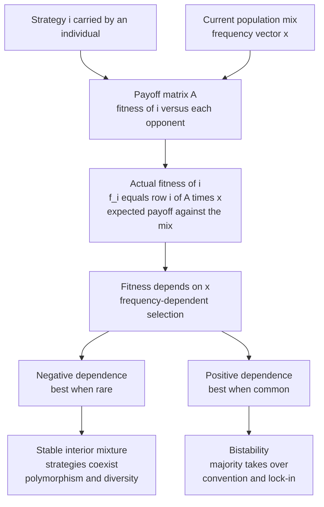

# 🧬 Fitness, Payoffs, and Population Games

> [!abstract] TL;DR
> Evolutionary game theory rebuilds classical game theory on one substitution: **payoff = fitness**. A strategy's reward is not utility or money but the number of copies it leaves behind — reproductive success in biology, imitation rate in culture. Because an individual meets opponents drawn from the current population, its fitness is the expected payoff against the population mix (payoff matrix times the frequency vector), so **fitness depends on how common each strategy already is**. This coupling — **frequency-dependent selection** — is exactly what turns natural selection into a *game*: the best strategy is a moving target. When a strategy does best while **rare** (negative dependence) the population settles into a stable coexisting mixture; when it does best while **common** (positive dependence) the majority wins and the system is bistable, locking in conventions.

---

## Intuition

**Analogy:** In an ordinary game, "payoff" is money or utility — abstract points on a scoreboard. In evolution, payoff is something far more visceral: **babies**. A strategy's reward is simply how many copies of itself it manages to leave behind in the next generation. There is no scorekeeper handing out utility; the currency is *replication*.

And here is the twist that makes it a game rather than a footrace: that reward **depends on who else is around**. Being tall is a huge advantage in a short crowd — you can see over everyone and reach the high shelves. Put the same tall person in a crowd where *everyone* is tall, and the advantage evaporates. Your success is measured against the field, not against a fixed bar. This "your payoff depends on what everyone else is doing" is **frequency-dependent selection**, and it is the single idea that converts Darwin's sieve into a strategic contest. A gene, a behavior, or a business tactic is never good or bad in the abstract — only good or bad *given the current mix* of everyone else.

---

## How It Works

### Payoff = Fitness: the foundational reinterpretation

Classical game theory asks: what should a *rational* agent choose to maximize utility? Evolutionary game theory drops rationality entirely. It asks: what strategy *survives*, given that strategies which earn more payoff automatically leave more copies? The "payoff" of a strategy is reinterpreted as its **fitness** — its reproductive success in biology, or its rate of being imitated and adopted in culture and economics. No one optimizes; selection does the work. High-payoff strategies proliferate not because anyone reasons about them but because the low-payoff ones die out or get abandoned. This is the bridge that welds game theory onto **natural selection** (see `[[Natural_Selection_and_Adaptation]]`).

### The payoff matrix

A symmetric game is specified by a **payoff matrix** `A` whose entry `A[i][j]` gives the fitness earned by a strategy `i` when it meets an opponent playing strategy `j`. For a two-strategy game this is just four numbers: A-vs-A, A-vs-B, B-vs-A, B-vs-B. **Symmetric** means both players share the same strategy set and the same payoffs — the standard EGT setting, because a fox playing against another fox is not a distinct "row player" and "column player," just two draws from one population. The classic example is the Hawk-Dove contest, where the four numbers encode the reward `V` of winning a resource and the cost `C` of an escalated fight.

### A strategy's *actual* fitness

Here is the key computation. An individual playing strategy `i` does not meet one fixed opponent — it meets opponents **drawn at random from the current population**. So its realized fitness is the *average* payoff over that mix:

$$f_i(x) = \sum_j A_{ij}\, x_j = (A x)_i$$

where `x` is the **frequency vector** giving the fraction of the population playing each strategy. Fitness is the payoff matrix times the population mix. The consequence is profound: fitness is **not a property of the strategy alone** — it is a property of the strategy *plus the composition of the population*. This is precisely what couples every individual into a shared game and feeds directly into `[[Replicator_Dynamics]]`, where the share of each strategy grows in proportion to how far its fitness exceeds the population average.

### Frequency-dependent selection: the defining feature

Because `f_i(x)` contains `x`, a strategy's fitness **changes as the population changes**. Contrast two worlds:

- **Constant (frequency-independent) selection:** a fitter type simply always wins — like a faster runner in a race. The winner never depends on how many others share the type. This is the textbook "survival of the fittest" and it is *not* a game.
- **Frequency-dependent selection:** the ranking of strategies flips depending on the mix. The best move today may be the worst move once everyone copies it. *This* is what makes evolution strategic.

Two regimes matter:

- **Negative frequency-dependence → coexistence.** A strategy does *best when rare*. Rare types are favored, so any strategy that becomes too common is pushed back down, driving the population to a **stable interior mixture** (a polymorphism) where strategies **coexist**. Hawk-Dove, rock-paper-scissors-like cycles, and the maintenance of genetic **diversity** all run on this force — it is a major reason biodiversity and polymorphism persist rather than collapsing to a single type.
- **Positive frequency-dependence → bistability.** A strategy does *best when common*. The majority is favored, so whichever strategy happens to start common takes over — **winner-take-all**. This produces coordination, conventions, social norms, standards lock-in, and path-dependence. The interior equilibrium exists but is *unstable*; the system rolls to one extreme or the other.

### Population games and playing-the-field

The modern general formalism is the **population game** (Sandholm): a continuum or large number of players each pick a strategy, and payoffs depend on the *aggregate distribution* of choices. Matrix games are a special case. Two structural flavors both count as frequency-dependent:

- **Pairwise contest (matrix) games** — individuals meet in pairs, and the payoff matrix applies directly (Hawk-Dove).
- **Playing-the-field games** — fitness depends on the *whole* population at once, not on pairwise encounters (the sex ratio of a population, dispersal strategies). There is no opponent, just the field.

Finally, note the biological reading of a **mixed strategy**. In classical game theory a mixed strategy is one individual randomizing. In biology it is usually a stable **population mixture** — some fraction of individuals are pure Hawks, some pure Doves — a *polymorphism*. The monomorphic-mixed interpretation (each animal randomizes) and the polymorphic interpretation (the population is a blend) often give the same equilibrium frequency, which is why `[[Evolutionary_Stable_Strategies]]` can be read either way.



---

## Key Concepts

**Secondary (intuition level)**
- Payoff means **babies**, not points — a strategy wins by making more copies of itself.
- Whether a strategy is good depends on **how common it already is**. Rare can be an advantage; so can being in the majority.

**Undergraduate (formal level)**
- **Payoff matrix** `A`: `A[i][j]` is the fitness of strategy `i` against strategy `j`; symmetric games are the default EGT setting.
- **Actual fitness** `f_i(x) = (Ax)_i`: expected payoff against the current mix `x`; fitness is a function of the population, not of the strategy alone.
- **Negative vs positive frequency-dependence** → coexistence (stable interior equilibrium) vs bistability (unstable interior, winner-take-all).
- **Mixed strategy = polymorphism**: a stable population blend of pure types, not necessarily an individual randomizing.

**Graduate (research level)**
- **Population games** (Sandholm): payoffs are functionals of the aggregate strategy distribution; matrix games are the pairwise special case.
- **Potential games** and **stable games**: structural classes guaranteeing convergence of `[[Replicator_Dynamics]]` and related evolutionary dynamics.
- **Matrix vs playing-the-field**: pairwise-contest payoffs versus whole-population payoffs (sex ratio, dispersal) — both frequency-dependent, different mathematical structure.
- ESS as a **static, dynamics-free stability condition** (no invading mutant can spread) versus stability under an explicit selection dynamic; every ESS is a Nash equilibrium but not conversely.

---

## Python Demo

This demo makes frequency-dependence concrete. For a two-strategy symmetric game we plot each strategy's **fitness as a function of the population frequency of strategy 1**, `f_i(x) = (Ax)_i`. Three payoff matrices produce the three canonical regimes — **dominance**, **coexistence** (negative dependence, Hawk-Dove), and **bistability** (positive dependence, coordination) — and we mark and classify the interior equilibrium where the fitness lines cross.

```python
# Frequency-dependent selection: fitness vs population frequency for a 2-strategy game.
# f_i(x) = (A @ mix)_i, where mix = [x, 1 - x] and x is the frequency of strategy 1.
import numpy as np
import matplotlib.pyplot as plt

def fitness_lines(A, x):
    """Return fitness of strategy 0 and strategy 1 across frequencies x of strategy 0."""
    x = np.asarray(x)
    mix = np.stack([x, 1.0 - x], axis=0)        # shape (2, len(x)): rows are the mix
    f = A @ mix                                  # shape (2, len(x)): f[i] = fitness of strat i
    return f[0], f[1]

def interior_equilibrium(A):
    """Solve f0(x) = f1(x) for x in (0,1); classify stability via slope of (f0 - f1)."""
    a, b = A[0]        # payoffs of strategy 0 vs (0, 1)
    c, d = A[1]        # payoffs of strategy 1 vs (0, 1)
    # g(x) = f0 - f1 = (a-c)x + (b-d)(1-x); solve g(x)=0
    slope = (a - c) - (b - d)                    # dg/dx
    if np.isclose(slope, 0.0):
        return None, None
    x_star = (b - d) / ((b - d) - (a - c))
    if not (0.0 < x_star < 1.0):
        return None, None
    # Under replicator dynamics, interior point is STABLE iff g decreases through zero.
    stable = slope < 0.0
    return x_star, stable

# Three payoff matrices, rows = focal strategy, cols = opponent strategy
games = {
    "Dominance\n(strategy 0 always fitter)":
        np.array([[3.0, 5.0],
                  [1.0, 2.0]]),      # f0 - f1 = 2*x + 3 > 0 for all x -> strat 0 wins
    "Coexistence\n(negative freq-dependence, Hawk-Dove)":
        np.array([[-1.0, 2.0],      # V=2, C=4: (V-C)/2=-1, V=2
                  [ 0.0, 1.0]]),     # crosses at x*=0.5, STABLE mixture
    "Bistability\n(positive freq-dependence, coordination)":
        np.array([[3.0, 0.0],
                  [0.0, 2.0]]),      # crosses at x*=0.4, UNSTABLE -> majority wins
}

x = np.linspace(0.0, 1.0, 400)
fig, axes = plt.subplots(1, 3, figsize=(15, 4.5), sharey=False)

for ax, (title, A) in zip(axes, games.items()):
    f0, f1 = fitness_lines(A, x)
    ax.plot(x, f0, lw=2.4, label="fitness of strategy 0", color="#1f77b4")
    ax.plot(x, f1, lw=2.4, label="fitness of strategy 1", color="#d62728")

    x_star, stable = interior_equilibrium(A)
    if x_star is not None:
        y_star = (A @ np.array([x_star, 1 - x_star]))[0]
        if stable:
            ax.plot(x_star, y_star, "o", ms=12, color="black",
                    label=f"stable equilibrium x*={x_star:.2f}")
            # arrows point INWARD toward a stable rest point
            ax.annotate("", xy=(x_star - 0.05, y_star), xytext=(x_star - 0.18, y_star),
                        arrowprops=dict(arrowstyle="->", color="green", lw=2))
            ax.annotate("", xy=(x_star + 0.05, y_star), xytext=(x_star + 0.18, y_star),
                        arrowprops=dict(arrowstyle="->", color="green", lw=2))
        else:
            ax.plot(x_star, y_star, "o", ms=12, mfc="white", mec="black", mew=2,
                    label=f"unstable equilibrium x*={x_star:.2f}")
            # arrows point OUTWARD away from an unstable rest point
            ax.annotate("", xy=(x_star - 0.18, y_star), xytext=(x_star - 0.05, y_star),
                        arrowprops=dict(arrowstyle="->", color="red", lw=2))
            ax.annotate("", xy=(x_star + 0.18, y_star), xytext=(x_star + 0.05, y_star),
                        arrowprops=dict(arrowstyle="->", color="red", lw=2))

    ax.set_title(title, fontsize=10)
    ax.set_xlabel("frequency x of strategy 0 in the population")
    ax.set_ylabel("expected fitness")
    ax.grid(alpha=0.3)
    ax.legend(fontsize=8, loc="best")

fig.suptitle("Frequency-dependent selection: fitness depends on the population mix", fontsize=13)
fig.tight_layout(rect=[0, 0, 1, 0.95])
plt.savefig("frequency_dependent_selection.png", dpi=120)
print("Dominance      : lines never cross in (0,1) -> strategy 0 sweeps to fixation")
print("Coexistence    : x* = 0.50, STABLE  -> both strategies persist (polymorphism)")
print("Bistability    : x* = 0.40, UNSTABLE -> whichever strategy starts common wins")
plt.show()
```

Reading the plots: in **dominance** the two fitness lines never cross inside `[0,1]`, so one strategy is fitter at every mix and sweeps to fixation (frequency-*independent* in outcome). In **coexistence** the lines cross with the fitter strategy switching as it becomes common — each strategy is best *when rare* — giving a **stable** interior rest point (filled dot, arrows point inward). In **bistability** the lines also cross but each strategy is best *when common*, so the interior point is **unstable** (open dot, arrows point outward) and the population rolls to whichever pure type started in the majority.

---

## Real-World Applications

- **Sex ratios (playing-the-field).** Fisher's principle: the rarer sex enjoys higher reproductive payoff, a textbook case of negative frequency-dependence that drives populations to a stable 1:1 investment ratio — no pairwise contest required, fitness depends on the whole population's sex composition.
- **Maintenance of polymorphism.** Side-blotched lizard mating morphs (orange/blue/yellow) cycle like rock-paper-scissors; each morph invades when rare, sustaining all three. Genetic and behavioral diversity persist *because* rarity is rewarded (see `[[Population_Genetics]]`, `[[Community_Ecology]]`).
- **Immune escape and pathogens.** A viral strain common in a host population meets widespread immunity, so *rare* strains spread — negative frequency-dependence keeps pathogen populations diverse and drives antigenic turnover.
- **Technology standards and social conventions.** Positive frequency-dependence: the more people use a platform, keyboard layout, or driving side, the greater the payoff of joining them, producing bistable lock-in and path-dependence.
- **Markets and imitation.** In economics the "reproduction" is imitation — profitable strategies get copied. Congestion and market-crowding are negative frequency-dependence (a trade is best when few others make it); network effects are positive.

---

## Common Pitfalls

- **Treating fitness as a fixed number.** The whole point is `f_i(x) = (Ax)_i` — fitness is a *function of the population mix*. Quoting "the fitness of Hawk" without stating the frequency of Hawks is meaningless.
- **Confusing constant selection with a game.** If one type is always fitter regardless of the mix, there is no strategic interaction — it is a race, not a game. Only frequency-dependence makes it evolutionary game theory.
- **Reading a mixed strategy as individual randomization only.** In biology the more common reading is a *polymorphic population* (a fraction plays each pure type). The two readings can share an equilibrium frequency but describe different biology.
- **Assuming an interior equilibrium is stable.** A crossing point of the fitness lines can be stable (negative dependence, coexistence) or **unstable** (positive dependence, bistability). Always check which strategy gains as it becomes common.
- **Forcing every game into the pairwise matrix mold.** Playing-the-field problems (sex ratio, dispersal) depend on the entire population at once and cannot be captured by a 2x2 contest matrix, even though they are still frequency-dependent.
- **Equating Nash equilibrium with evolutionary stability.** Every ESS is a Nash equilibrium, but a Nash equilibrium need not resist invasion — stability is an extra, dynamical requirement.

---

## Related Concepts

- [[Evolutionary_Stable_Strategies]] — the stability criterion built directly on payoff-as-fitness: a strategy no rare mutant can invade; the interior coexistence equilibrium above is often a mixed ESS.
- [[Replicator_Dynamics]] — the explicit dynamic that turns "fitness above average grows" into an equation `ẋᵢ = xᵢ[fᵢ(x) − f̄(x)]`; it consumes exactly the `f_i(x) = (Ax)_i` fitness defined here.
- [[Nash_Equilibrium]] — the classical fixed-point notion that ESS refines; every ESS is a Nash equilibrium of the symmetric game.
- [[Mixed_Strategies]] — the classical object reinterpreted in biology as a stable population polymorphism rather than individual randomization.
- [[Players_Strategies_and_Payoffs]] — the classical payoff concept that EGT reinterprets as reproductive fitness.
- [[Natural_Selection_and_Adaptation]] — the biological engine (variation, heredity, differential reproduction) that supplies the "replication" currency of EGT payoffs.
- [[Population_Genetics]] — the allele-frequency framework; frequency-dependent selection is a classic mechanism it uses to explain maintained polymorphism.
- [[Population_Ecology]] — density- and frequency-dependent regulation of populations; the ecological cousin of these dynamics.
- [[Community_Ecology]] — coexistence theory and the competitive maintenance of diversity, driven by rare-type advantage.
- [[Population_Genetics_and_Hardy_Weinberg]] — the null model of no selection against which frequency-dependent selection is measured.
- [[Natural_Selection_Genetic_Drift_and_Bottlenecks]] — the evolutionary-genetics forces that interact with frequency-dependent selection in finite populations.

> Sibling notes planned for this vault — *Evolutionary Game Theory Overview*, *The Hawk-Dove Game*, *Sex Ratios and the Fisher Principle*, and *The Evolution of Conventions and Norms* — will expand the specific models referenced above once created.

---

## Review Questions

**Tier 1 — Conceptual**
1. In one sentence, what is substituted for "payoff" in evolutionary game theory, and what is the currency of that payoff?
2. Explain the difference between constant (frequency-independent) selection and frequency-dependent selection using a simple example.

**Tier 2 — Applied**
3. Given the payoff matrix `A = [[-1, 2], [0, 1]]` with `x` the frequency of strategy 0, write `f_0(x)` and `f_1(x)`, solve for the interior equilibrium, and argue whether it is stable.
4. A population game rewards a strategy more the more common it is. Sketch what happens to two initial conditions, one starting at 30% strategy 0 and one at 70%, and name the phenomenon.

**Tier 3 — Analytical / Open-ended**
5. Sex ratio is a "playing-the-field" game rather than a pairwise-contest game. Explain why it cannot be captured by a 2x2 contest matrix, yet is still frequency-dependent, and how negative frequency-dependence drives it to a 1:1 outcome.
6. Negative frequency-dependence maintains diversity while positive frequency-dependence destroys it (locking in one type). Reconcile these opposite consequences by explaining what differs in the *shape* of the fitness-versus-frequency lines, and give one real biological or cultural example of each.

---

## Sources

- Maynard Smith, J. (1982). *Evolution and the Theory of Games*. Cambridge University Press. — origin of ESS and the payoff-as-fitness reinterpretation.
- Hofbauer, J., & Sigmund, K. (1998). *Evolutionary Games and Population Dynamics*. Cambridge University Press. — rigorous link between fitness, frequency-dependence, and replicator dynamics.
- Sandholm, W. H. (2010). *Population Games and Evolutionary Dynamics*. MIT Press. — the modern population-game formalism, potential and stable games.
- Nowak, M. A. (2006). *Evolutionary Dynamics: Exploring the Equations of Life*. Harvard University Press. — accessible treatment of frequency-dependent selection and coexistence.
- Alexander, J. M. "Evolutionary Game Theory", *Stanford Encyclopedia of Philosophy*. [plato.stanford.edu/entries/game-evolutionary](https://plato.stanford.edu/entries/game-evolutionary/)

---

#evolutionary-game-theory #fitness #frequency-dependent-selection #payoff-matrix #population-games
