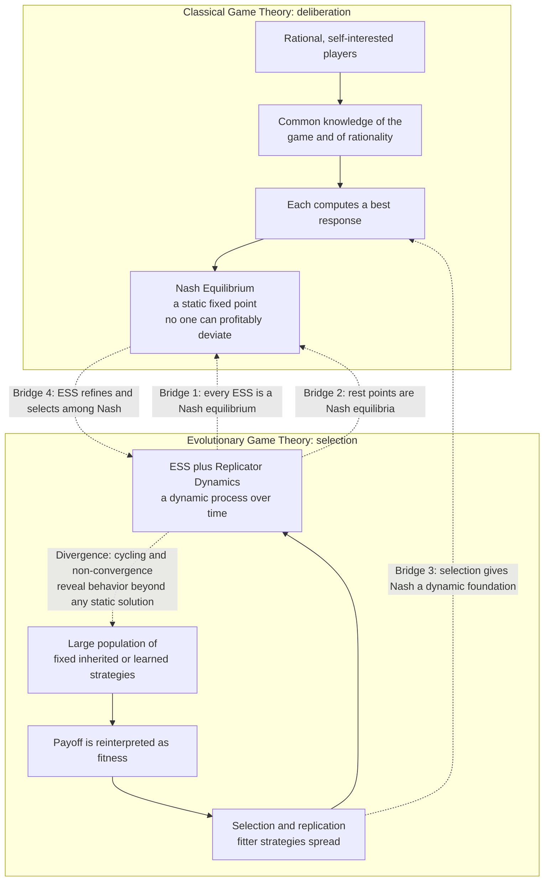

# 🌱 From Classical to Evolutionary Game Theory

> [!abstract] TL;DR
> **Classical game theory** predicts what infinitely rational, mutually-aware players will do: they compute **best responses** and settle at a **Nash equilibrium**. **Evolutionary game theory (EGT)** throws out the rational agent entirely: a large **population** of individuals plays fixed (inherited or learned) strategies, **payoff becomes fitness**, higher-fitness strategies **spread by selection**, and equilibrium **emerges from dynamics** rather than deliberation. The two paradigms are bridged by deep results — **every ESS is a Nash equilibrium**, and **rest points of the replicator dynamics are Nash equilibria** — so evolution supplies a *dynamic foundation* for a concept that classical theory could only assume. But they also **diverge**: some dynamics cycle forever (matching pennies, rock-paper-scissors) or never converge, revealing behavior richer than any static solution concept. This transition is what lets game theory describe not just idealized economists but genes, bacteria, firms, cultures, and learning algorithms.

---

## Intuition

**Analogy first.** Picture **two grandmasters at a chessboard**. Each is brilliant, each knows the other is brilliant, and each silently calculates the perfect reply to every possible move. Neither will make a mistake, and the game glides to an outcome that both foresaw. That is **classical game theory**: strategic behavior as *deliberate calculation* by flawless minds who know everything about each other.

Now picture a **garden**. Thousands of plants sprout, each using a slightly different strategy — grow tall to grab sunlight, spread wide to grab water, flower early, flower late. No plant *reasons* about anything. But whichever strategy happens to do best in this soil simply **leaves more seeds**, so next season there are more plants like it. Season after season, the garden fills with whatever *works* — and it can end up looking astonishingly "well-designed," as if someone had optimized it. That is **evolutionary game theory**: strategic behavior as the residue of *blind selection* acting on a whole population.

The startling punchline of the field is that **both routes often arrive at the same destination**. The garden, with no brains at all, drifts to the very same "smart" mixes of strategies that the grandmasters would have calculated. Understanding *how* deliberate reasoning and mindless selection can converge — and, just as importantly, *when they don't* — is the conceptual bridge on which the entire subject is built.

---

## How It Works

### The classical picture (a one-minute recap)

Classical, non-cooperative game theory — the edifice built by **von Neumann & Morgenstern (1944)** and completed by **Nash (1950)** — rests on a stack of assumptions about the players:

1. **Players are rational.** Each has well-defined preferences (a von Neumann-Morgenstern utility function) and chooses actions to maximize expected utility. See [[Utility_Theory]] and [[Players_Strategies_and_Payoffs]].
2. **Players are self-interested.** Each maximizes its *own* payoff, not the group's.
3. **Common knowledge of the game.** Everyone knows the strategies, the payoffs, *and* knows that everyone knows, infinitely deep. See [[Information_in_Games]].
4. **Common knowledge of rationality.** Each player assumes the others are also flawless maximizers reasoning about them in turn.

Given all that, a player computes a **best response** — the action that maximizes payoff *given* what everyone else does. A **Nash equilibrium** is a strategy profile where everyone is simultaneously best-responding, so **no one can profitably deviate**. It is a *fixed point of the best-response map* and a **static solution concept**: a snapshot of a self-consistent world, with no story about how anyone got there. (See [[Nash_Equilibrium]], [[Mixed_Strategies]], and [[Dominance_and_Rationality]].)

### The problem with the rational agent

The trouble is that **almost nothing in the real world is a chess grandmaster.** Animals contesting territory, bacteria racing to metabolize sugar, plants competing for light, firms setting prices, and ordinary people choosing routes home do *not* solve fixed-point equations. They lack the **cognition**, the **information**, or the **computation** to do so — and "common knowledge of rationality" is a wildly strong idealization even for humans (this is the terrain of *bounded rationality* and evolutionary economics, covered in the sibling note *Evolutionary_Economics_and_Bounded_Rationality*). If the players can't reason their way to a Nash equilibrium, the obvious question is: **how could equilibria ever arise at all?**

### The evolutionary reinterpretation

**Maynard Smith & Price (1973)** answered by *changing what a "player" is.* Their move — importing biology into game theory — replaces **rational choice** with **selection**:

- Instead of a few clever agents, there is a **large population** of individuals.
- Each individual is **hard-wired** to a single strategy (genetically inherited, culturally copied, or learned) — it does *not* choose.
- A strategy's **payoff is reinterpreted as fitness**: expected number of offspring, or, in social settings, the rate at which the strategy gets imitated. (This mapping is the subject of the sibling note *Fitness_Payoffs_and_Population_Games*.)
- Individuals are randomly matched to play the game; **higher-fitness strategies reproduce faster and spread**; lower-fitness strategies dwindle.
- **Equilibrium emerges from the dynamics of the population**, not from anyone's deliberation. No individual needs any cognition whatsoever.

Two tools formalize this. An **Evolutionarily Stable Strategy (ESS)** is a population state that cannot be invaded by a small group of mutants — the evolutionary analogue of a *stable* equilibrium (see [[Evolutionary_Stable_Strategies]]). The **replicator dynamics** is the differential equation describing how strategy frequencies change over time: strategies that beat the population average grow, those below it shrink (see [[Replicator_Dynamics]]).

### The bridges between paradigms

The reason EGT is not just a separate theory but a *foundation* for the classical one lies in a set of tight theorems — sometimes called the **"folk theorem of evolutionary game theory"** (sibling note *The_Folk_Theorem_of_EGT*):

1. **Every ESS is a Nash equilibrium.** If a population state could be invaded by a *better* reply, that reply is by definition a profitable deviation — so a non-Nash state can never be evolutionarily stable. Evolution *cannot rest* anywhere except at a Nash equilibrium.
2. **Every rest point of the replicator dynamics is a Nash equilibrium** (more precisely, every *stable* rest point is a Nash equilibrium, and every Nash equilibrium is a rest point). Where mindless selection stops moving, the classical solution concept is satisfied.
3. **Evolution gives Nash a dynamic justification.** Classical theory *assumes* the equilibrium; EGT *derives* it as the resting place of myopic selection or learning. It answers the "how did they get there?" question that Nash left open.
4. **ESS refines Nash.** A game may have many Nash equilibria; ESS singles out the *stable, invasion-proof* ones, acting as an equilibrium-selection criterion.

### When the two paradigms diverge

The bridges are one-way and incomplete, which is exactly what makes the dynamic view richer:

- **Evolution does not always converge.** Some replicator trajectories **cycle** forever (matching pennies, rock-paper-scissors) or are outright **chaotic**. There is a Nash equilibrium, but the population orbits it without ever landing (sibling note *Cyclic_Dynamics_and_Rock_Paper_Scissors*).
- **Not every Nash equilibrium is reachable or stable.** Unstable (repelling) equilibria are Nash points that no evolving population settles at — the mixed equilibrium of a coordination game is a textbook example.
- **The dynamics matter.** Two different but reasonable adjustment processes can make *different* predictions, so "what rationality recommends" and "what evolution produces" can genuinely disagree.

### Learning is evolution too

Crucially, the very same mathematics governs **learning and imitation in humans, firms, and machines**, not just genes. **Best-response dynamics**, **imitation dynamics**, **reinforcement learning** (see [[Reinforcement_Learning]]), and **cultural transmission** (see [[Evolutionary_Psychology_and_Cultural_Evolution]]) are all "evolutionary" processes that select successful strategies over time. Genetic selection, cultural copying, and individual learning are three engines running one abstract dynamic. This is why EGT unifies biology, economics, and multi-agent AI under a single lens (the sibling note *Evolutionary_Game_Theory_and_Machine_Learning* pushes this into modern ML).

### The two paradigms, side by side



---

## Key Concepts

### Secondary (intuition, no math)
- **Two ways to be smart.** You can *think your way* to a good decision, or a *process* can grind toward one without any thinking. Chess grandmaster versus garden.
- **Payoff becomes survival.** In evolution, "winning" a game just means leaving more copies of yourself (offspring, or people who imitate you).
- **Equilibrium is where change stops.** A population settles when no strategy is doing better than the average — nobody is being replaced.

### Undergraduate (formal but standard)
- **Nash equilibrium**: a strategy profile where every player best-responds; a fixed point of the best-response map; no profitable unilateral deviation.
- **ESS**: a strategy `σ*` such that a rare mutant `σ` cannot invade — either `u(σ*, σ*) > u(σ, σ*)`, or these are equal and `u(σ*, σ) > u(σ, σ)`.
- **Replicator equation** (single population): `dxᵢ/dt = xᵢ · [ fᵢ(x) − f̄(x) ]`, where `fᵢ` is strategy `i`'s expected payoff and `f̄` is the population mean.
- **Inclusion chain**: `ESS ⊂ Nash`. Every ESS is Nash; not every Nash is an ESS.
- **Selection as equilibrium refinement**: dynamics pick out *stable* equilibria and discard repellers.

### Graduate (dynamic-systems view)
- **Folk theorem of EGT** (Hofbauer & Sigmund): (i) Nash equilibria are rest points of the replicator dynamics; (ii) *strict* Nash equilibria are asymptotically stable; (iii) a *stable* rest point is a Nash equilibrium; (iv) the limit of an interior trajectory, if it converges, is Nash. The converse fails — a rest point need not be Lyapunov-stable.
- **ESS ⟹ asymptotic stability** under the replicator dynamics for symmetric games; the reverse implication holds for `2×2` games but not in general.
- **Non-convergence classes**: zero-sum symmetric games (e.g. matching pennies) give **Hamiltonian / conservative** replicator flows with closed orbits; rock-paper-scissors gives **heteroclinic cycles** or neutral centers; larger games admit **chaotic** attractors (Sato-Akiyama-Farmer).
- **Beyond biology**: best-response dynamics, smoothed/logit best response, fictitious play, and the exponential-weights / multiplicative-weights family of learning algorithms are all "evolutionary" in that their rest points and limit sets are governed by the same Nash-selection machinery. See [[Reinforcement_Learning]] and the *Evolutionary_Game_Theory_and_Machine_Learning* sibling.

---

## Python Demo

This demo makes the central claim concrete: **a mindless evolutionary (replicator) dynamic can reach the same Nash equilibrium a rational calculation would find — and sometimes fails to converge at all.**

- **Game 1 — coordination game:** the replicator dynamics *converges* to a pure Nash equilibrium, and *which* one depends on the starting mix. Evolution thus **selects among** the game's Nash equilibria and skips the unstable interior one entirely.
- **Game 2 — matching pennies:** the replicator dynamics **cycles forever** around the unique mixed Nash equilibrium, never settling. Rationality points at `(0.5, 0.5)`; evolution orbits it.

```python
# From Classical to Evolutionary Game Theory
# Show that evolutionary (replicator) dynamics can REACH a Nash equilibrium
# with no rationality -- and can also CYCLE around one forever.
import numpy as np
import matplotlib.pyplot as plt

# ----------------------------------------------------------------------
# GAME 1: 2x2 symmetric COORDINATION game (single population)
#   Two strategies 0 and 1; payoff 1 for matching, 0 for mismatching.
#   A[i, j] = payoff to a player using i against an opponent using j.
# ----------------------------------------------------------------------
A = np.array([[1.0, 0.0],
              [0.0, 1.0]])

# (a) CLASSICAL route: solve for the Nash equilibria by hand.
#   Pure NE: everyone plays 0 (x = 1) or everyone plays 1 (x = 0).
#   Mixed NE: both strategies equally good -> x = 1 - x -> x* = 0.5 (unstable).
nash_coord = [0.0, 0.5, 1.0]   # x = fraction of the population playing strategy 0
print("Coordination Nash equilibria (x = share on strategy 0):", nash_coord)

def replicator_1pop(x, A, dt=0.01, steps=2000):
    """Single-population replicator dynamics; return the trajectory of x."""
    traj = np.empty(steps)
    for t in range(steps):
        traj[t] = x
        p = np.array([x, 1.0 - x])         # current population strategy mix
        fit = A @ p                        # expected fitness of each strategy
        avg = p @ fit                      # mean population fitness
        # dx/dt = x * (fitness_of_strategy_0 - mean_fitness)
        x = x + dt * x * (fit[0] - avg)
        x = min(max(x, 0.0), 1.0)          # stay on the simplex
    return traj

# (b) EVOLUTIONARY route: run selection from several starting mixes.
starts = [0.10, 0.35, 0.49, 0.51, 0.65, 0.90]
coord_trajs = [replicator_1pop(x0, A) for x0 in starts]

# ----------------------------------------------------------------------
# GAME 2: MATCHING PENNIES (two populations -- an anti-coordination, zero-sum game)
#   Row "matcher" wants to match; Column "mismatcher" wants to mismatch.
#   x = share of row pop playing Heads; y = share of column pop playing Heads.
#   Unique Nash: (x*, y*) = (0.5, 0.5). Selection CYCLES around it, never settling.
#   (Exact dynamics give closed orbits; Euler adds a slight outward drift.)
# ----------------------------------------------------------------------
def replicator_2pop(x, y, dt=0.003, steps=6000):
    xs, ys = np.empty(steps), np.empty(steps)
    for t in range(steps):
        xs[t], ys[t] = x, y
        rH, rT = (2*y - 1), (1 - 2*y)      # row payoffs: Heads vs Tails
        r_avg = x*rH + (1 - x)*rT
        cH, cT = (1 - 2*x), (2*x - 1)      # column payoffs: Heads vs Tails
        c_avg = y*cH + (1 - y)*cT
        x = x + dt * x * (rH - r_avg)
        y = y + dt * y * (cH - c_avg)
        x = min(max(x, 1e-6), 1 - 1e-6)
        y = min(max(y, 1e-6), 1 - 1e-6)
    return xs, ys

mp_orbits = [replicator_2pop(x0, 0.5) for x0 in [0.60, 0.70, 0.80]]

# ----------------------------------------------------------------------
# VISUALIZE: convergence vs. cycling
# ----------------------------------------------------------------------
fig, (ax1, ax2) = plt.subplots(1, 2, figsize=(13, 5))

# Left: coordination game -> converges to a PURE Nash (evolution selects one).
for x0, tr in zip(starts, coord_trajs):
    ax1.plot(tr, label=f"x0 = {x0}")
for ne in nash_coord:
    ax1.axhline(ne, ls="--", color="grey", alpha=0.6)
ax1.text(700, 1.02, "Nash x=1  (ESS, attractor)", color="green")
ax1.text(700, 0.02, "Nash x=0  (ESS, attractor)", color="green")
ax1.text(700, 0.52, "Nash x=0.5  (unstable, repeller)", color="red")
ax1.set_title("Coordination: replicator CONVERGES to a Nash equilibrium")
ax1.set_xlabel("time step")
ax1.set_ylabel("share playing strategy 0")
ax1.set_ylim(-0.05, 1.12)
ax1.legend(fontsize=8, loc="center right")

# Right: matching pennies -> ORBITS the mixed Nash (never converges).
for xs, ys in mp_orbits:
    ax2.plot(xs, ys, lw=1)
ax2.plot(0.5, 0.5, "k*", ms=16, label="Nash equilibrium (0.5, 0.5)")
ax2.set_title("Matching pennies: replicator CYCLES, never settles")
ax2.set_xlabel("row population: share playing Heads")
ax2.set_ylabel("column population: share playing Heads")
ax2.set_xlim(0, 1)
ax2.set_ylim(0, 1)
ax2.legend(loc="upper right")

plt.tight_layout()
plt.savefig("classical_vs_evolutionary.png", dpi=110)
print("Left  plot: evolution REACHES a Nash equilibrium without any rationality.")
print("Right plot: evolution can ORBIT a Nash equilibrium forever -- dynamics != rationality.")
```

**What to read off the figure.** In the left panel every trajectory that starts above `x = 0.5` climbs to the pure equilibrium `x = 1`, and every trajectory below it falls to `x = 0`; the analytic mixed Nash at `x = 0.5` is a **repeller** that no population settles at. Selection has *found* Nash equilibria — and *chosen* which ones to keep — with zero deliberation. In the right panel the population loops endlessly around the star at `(0.5, 0.5)`: rationality names that point, but the evolutionary process never arrives. The two paradigms **coincide** in Game 1 and **diverge** in Game 2.

---

## Real-World Applications

- **Animal behavior.** Territorial aggression, sex ratios, and foraging strategies match ESS predictions even though no animal solves a game — the original and still canonical use case (Maynard Smith's hawk-dove).
- **Microbiology and cancer.** Bacterial resistance, public-goods "cheating" among microbes, and competing cell lineages in tumors are modeled as evolving populations whose stable states are ESSs; this underpins *evolutionary therapy* dosing strategies.
- **Economics and industrial organization.** Firms that cannot compute equilibria still **imitate** profitable rivals and **learn** from experience; boundedly rational adjustment converges to (or cycles around) the same equilibria classical theory predicts, giving those predictions an empirical footing. See [[Nash_Equilibrium_Applications]].
- **Cultural and social norms.** The spread of conventions, cooperation, and languages is a selection process on strategies transmitted by imitation, not genes — see [[Evolutionary_Psychology_and_Cultural_Evolution]] and [[Cooperation_and_Evolutionary_Game_Theory]].
- **Multi-agent AI and machine learning.** Training self-play agents, analyzing GAN dynamics, and multi-agent reinforcement learning all use replicator-style and best-response dynamics; convergence-versus-cycling is a live engineering concern, not just theory. See [[Reinforcement_Learning]].
- **Complex adaptive systems.** EGT is the strategic core of adaptation on fitness landscapes across ecology and economics — see [[Evolutionary_Dynamics_and_Fitness_Landscapes]].

---

## Common Pitfalls

- **Assuming evolution always finds a Nash equilibrium.** It reaches one only when the dynamics *converge*. Cycling (matching pennies, rock-paper-scissors) and chaos are genuine outcomes; a Nash equilibrium can exist yet never be attained.
- **Equating ESS with Nash.** Every ESS is Nash, but many Nash equilibria are *not* ESS (unstable mixed equilibria, weakly dominated equilibria). Do not use the labels interchangeably.
- **Smuggling rationality back in.** The whole point is that agents need *no* cognition. If your "evolutionary" model quietly assumes players anticipate the dynamics or coordinate on an equilibrium, you have re-imported the classical assumptions.
- **Confusing the equilibrium with the process.** Nash equilibrium is a static *snapshot*; the replicator equation is a *movie*. Which equilibrium (if any) is reached depends on **initial conditions and the specific dynamic** — different learning rules can select different outcomes.
- **Over-reading a single dynamic.** The replicator equation is one adjustment process among many (best-response, imitation, logit). Predictions can differ across them, so conclusions should be checked for robustness rather than treated as "the" evolutionary answer.
- **Ignoring finite-population and stochastic effects.** The classic replicator dynamics assumes an infinite, well-mixed population; drift, mutation, and network structure in real (finite) populations can overturn its deterministic predictions.

---

## Related Concepts

- [[Nash_Equilibrium]] — the static classical solution concept that evolution provides a *dynamic foundation* for; every ESS and every stable rest point is one of these.
- [[Evolutionary_Stable_Strategies]] — the evolutionary refinement of Nash: an equilibrium robust to invasion by mutants; the "stable" endpoint of selection.
- [[Replicator_Dynamics]] — the differential equation that makes "fitter strategies spread" precise; its rest points are Nash equilibria, its cycles are where the paradigms diverge.
- [[Mixed_Strategies]] — the classical object (a probability over actions) that evolution reinterprets as a *population fraction* playing each pure strategy.
- [[Dominance_and_Rationality]] — the rationality assumptions of classical theory that EGT deliberately drops and replaces with selection.
- [[Players_Strategies_and_Payoffs]] — the shared primitives; EGT keeps strategies and payoffs but recasts payoff as fitness.
- [[Information_in_Games]] — the "common knowledge" idealization whose implausibility motivates the evolutionary turn.
- [[Utility_Theory]] — the von Neumann-Morgenstern utility that grounds classical rational choice, contrasted with fitness.
- [[Nash_Equilibrium_Applications]] — economic settings where boundedly rational learning, not calculation, delivers equilibrium.
- [[Reinforcement_Learning]] — algorithmic learning as an evolutionary dynamic; policy improvement plays the role of selection.
- [[Evolutionary_Psychology_and_Cultural_Evolution]] — cultural transmission and imitation as non-genetic selection on strategies.
- [[Cooperation_and_Evolutionary_Game_Theory]] — how selection dynamics explain the emergence of cooperation in complex adaptive systems.
- [[Evolutionary_Dynamics_and_Fitness_Landscapes]] — the broader adaptation-on-landscapes framing that EGT specializes to strategic interaction.

*(Sibling notes in this vault — Evolutionary_Game_Theory_Overview, Fitness_Payoffs_and_Population_Games, The_Folk_Theorem_of_EGT, Cyclic_Dynamics_and_Rock_Paper_Scissors, Evolutionary_Economics_and_Bounded_Rationality, Cultural_Evolution_and_Social_Learning, Evolutionary_Game_Theory_and_Machine_Learning — are referenced in prose above and will be created as this vault grows.)*

---

## Review Questions

1. **(Secondary)** Explain, using the chess-grandmasters-versus-garden analogy, how a population with no reasoning ability could end up at the same "smart" outcome a rational calculator would choose. What has replaced deliberation?
2. **(Undergraduate)** State the two bridging results linking the paradigms: "every ESS is a Nash equilibrium" and "rest points of the replicator dynamics are Nash equilibria." Prove the first informally — why can selection never rest at a non-Nash population state?
3. **(Undergraduate/Graduate)** In the coordination game of the demo, the interior Nash equilibrium `x = 0.5` is never reached by the replicator dynamics while the pure equilibria are. Explain why in terms of stability, and describe what "ESS refines Nash" means operationally here.
4. **(Graduate)** Matching pennies has a unique Nash equilibrium yet the replicator dynamics cycles around it forever. What does this reveal about using Nash equilibrium as a *prediction* of behavior in adaptive systems, and how does it complicate the claim that "evolution provides a dynamic foundation for Nash"? Contrast the replicator flow here with the strict-Nash / coordination case.

---

## Sources

- Maynard Smith, J. & Price, G. R. (1973). "The Logic of Animal Conflict." *Nature* 246, 15-18.
- Maynard Smith, J. (1982). *Evolution and the Theory of Games.* Cambridge University Press.
- Hofbauer, J. & Sigmund, K. (1998). *Evolutionary Games and Population Dynamics.* Cambridge University Press. (Folk theorem of EGT; replicator/Nash correspondence.)
- Weibull, J. W. (1995). *Evolutionary Game Theory.* MIT Press. (Bridges between static equilibrium and evolutionary dynamics.)
- Sandholm, W. H. (2010). *Population Games and Evolutionary Dynamics.* MIT Press. (Learning dynamics, best-response and imitation as evolution.)
- Nash, J. F. (1950). "Equilibrium Points in n-Person Games." *PNAS* 36(1), 48-49. (The classical benchmark.)

---

#evolutionary-game-theory #nash-equilibrium #rationality #best-response #bounded-rationality
