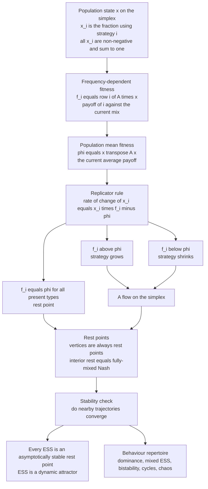

# 🌀 Replicator Dynamics

> [!abstract] TL;DR
> **Replicator dynamics** (Taylor & Jonker, 1978) is the fundamental *dynamic* model of evolutionary game theory: the mathematical engine that turns any game into a moving, evolving system. The **replicator equation** says a strategy's population share grows in proportion to *how much better than average* it performs — `ẋᵢ = xᵢ · [ fᵢ(x) − f̄(x) ]`, where `fᵢ(x) = (Ax)ᵢ` is strategy *i*'s **frequency-dependent** fitness and `f̄(x) = xᵀAx` is the population mean. Strategies above average grow, below average shrink — "the rich get richer" by *relative* fitness. The state lives on the **simplex** (frequencies summing to 1), and the equation defines a **flow** on it. Its **rest points** include every vertex plus interior points where all present strategies tie — and those interior rest points are exactly the fully-mixed **Nash equilibria**. Crucially, **every ESS is an asymptotically stable rest point** (the static-dynamic bridge), though the converse fails in multi-strategy games. The dynamics show the full repertoire of evolution: convergence to a pure winner (dominance), to an interior mix (Hawk-Dove), bistable path-dependence (coordination), and endless cycles (Rock-Paper-Scissors). The same equation arises from biological reproduction, imitation, reinforcement learning, and cultural transmission — making it the workhorse of biology, economics, and multi-agent ML.

---

## Intuition

**Analogy:** Picture several companies competing for a fixed market. Each quarter you look at profit. Whichever company earns *above the industry average* pulls in customers and capital, growing its market share; whichever earns *below average* bleeds share to the others. Nobody hands out a fixed reward — a firm's fate depends on how it does *relative to everyone else this quarter*. The **replicator equation is exactly this rule written as calculus**: a strategy's fraction of the population increases at a rate proportional to *how much better than the current average* it performs.

That one sentence — *grow in proportion to your above-average performance* — is the whole engine. It converts a **static** game (who *should* play what) into a **dynamic** one (how a population actually *moves* through strategy space over time). The payoff of this shift is enormous: instead of only asking *where* evolution ends up (equilibrium), replicator dynamics show us *how it gets there* — whether it converges smoothly, gets stuck in one of several basins depending on where it started, or never settles and cycles forever.

---

## How It Works

### Core Mechanics

**Setup.** A large, well-mixed population of individuals each play one of *n* pure strategies. The **state** is a frequency vector `x = (x₁, …, xₙ)` where `xᵢ ≥ 0` is the fraction using strategy *i* and `Σᵢ xᵢ = 1`. Interactions are captured by a **payoff matrix** `A`, where `Aᵢⱼ` is the payoff to an *i*-player meeting a *j*-player.

**1. Frequency-dependent fitness.** The expected payoff — the Darwinian *fitness* — of strategy *i* is its payoff against a random opponent drawn from the current mix:

$$f_i(x) = \sum_j A_{ij}\,x_j = (Ax)_i$$

This is the heart of the "game": a strategy's fitness **depends on the current population composition**, not on a fixed constant. Because `fᵢ` moves as `x` moves, the dynamics are **nonlinear**. That frequency-dependence is precisely what separates a *game* from ordinary constant-fitness selection.

**2. Population mean fitness.** Average over the population:

$$\bar{f}(x) = \sum_i x_i f_i(x) = x^{\top} A x$$

**3. The replicator equation.** In continuous time:

$$\dot{x}_i = x_i \,\big[\, f_i(x) - \bar{f}(x)\,\big]$$

Read it directly: `ẋᵢ > 0` iff `fᵢ(x) > f̄(x)`. A strategy grows exactly when it beats the population average, shrinks when it lags, and holds steady when it ties. The multiplicative `xᵢ` out front means a strategy already at zero stays at zero (selection cannot resurrect an absent type) and that the simplex `Σ xᵢ = 1` is **invariant** — the flow never leaves it. There is also a **discrete-time** version, `xᵢ(t+1) = xᵢ(t) · fᵢ / f̄`, the generation-by-generation form.

**4. The state space is the simplex.** A population state is a point in the `(n−1)`-dimensional **probability simplex** `Δⁿ`. For 2 strategies this is a line segment `[0,1]`; for 3 strategies an equilateral triangle (the 2-simplex); for *n* strategies an `(n−1)`-simplex. Replicator dynamics define a **vector field / flow** on this simplex, and evolution becomes literal *motion through the triangle*.

**5. Rest points and their meaning.** A **rest point** (fixed point) is a state where `ẋ = 0`. Two families always appear:
- **Vertices** (all-one-strategy states) are *always* rest points — with nobody else around, `xᵢ(fᵢ − f̄) = 0` trivially.
- **Interior rest points**, where every strategy present earns *equal* payoff (`fᵢ = f̄` for all `i` with `xᵢ > 0`). These are exactly the **fully-mixed Nash equilibria** of the game. Rest points ↔ Nash is one of the deep bridges of the field.

**6. Stability and the link to ESS.** A rest point is **asymptotically stable** if nearby trajectories converge to it. The central theorem: **every Evolutionarily Stable Strategy is an asymptotically stable rest point** of the replicator dynamics. So an ESS is not just uninvadable in the static sense — it is a genuine dynamic *attractor*. The converse is *not* fully general: in games with three or more strategies there exist asymptotically stable rest points that are not ESS. This asymmetry is the static-dynamic bridge that motivates a whole family of refined stability concepts.

### Flow / Architecture



---

## Key Concepts

### Secondary
- **The one rule.** A strategy's share of the population goes *up* when it does better than average and *down* when it does worse. That is the whole idea.
- **It depends on everyone else.** How good a strategy is depends on what everyone *else* is currently doing — that is what makes it a *game* and not a simple race.
- **The map of all possibilities.** Every possible population mix is a point on a shape called the simplex — a line for two strategies, a triangle for three. Evolution is a path that moves across this shape.
- **Not every story ends.** Sometimes the population settles on a winner, sometimes it splits depending on where it started, and sometimes (like Rock-Paper-Scissors) it circles forever.

### Undergraduate
- **The equation.** `ẋᵢ = xᵢ (fᵢ − f̄)` with `f = Ax` and `f̄ = xᵀAx`. Selection acts on *relative* fitness; adding a constant to a whole column of `A` does not change the dynamics.
- **Simplex invariance.** If `x(0)` sums to 1 with non-negative entries, so does `x(t)` for all `t` — the simplex and each of its faces are forward-invariant.
- **Rest points ↔ Nash.** Vertices are always rest points. An *interior* rest point requires all strategies to have equal payoff, which is exactly the condition for a fully-mixed Nash equilibrium.
- **ESS ⇒ asymptotic stability.** Every ESS is a locally (for interior ESS, globally) asymptotically stable rest point; the Lyapunov function is the relative entropy from the ESS to the current state.
- **2×2 classification.** For a symmetric 2×2 game with entries `a,b,c,d`, `ẋ = x(1−x)[(a−c)x + (b−d)(1−x)]`. The signs of `a−c` and `b−d` give four regimes: **dominance** (monotone to a vertex), **anti-coordination / Hawk-Dove** (stable interior mix), **coordination** (unstable interior point, two stable vertices), and the degenerate neutral case.
- **Frequency-dependence.** Because `fᵢ` moves with `x`, the vector field is nonlinear even though `A` is a fixed matrix — this is where all the rich behaviour comes from.

### Graduate
- **The Folk Theorem of EGT (precise form).** (1) Every Nash equilibrium is a rest point. (2) Every *stable* rest point is a Nash equilibrium. (3) Every *strict* Nash equilibrium is asymptotically stable, and every ESS is asymptotically stable. Reverse implications generally fail.
- **Lyapunov / Fisher-Shahshahani structure.** For interior ESS `x*`, the Kullback-Leibler divergence `V(x) = Σᵢ xᵢ* log(xᵢ*/xᵢ)` is a strict Lyapunov function. More deeply, under the **Shahshahani metric** the replicator equation is a **gradient flow** for doubly-symmetric (partnership) games, and mean fitness `f̄` increases monotonically — the game-theoretic form of **Fisher's Fundamental Theorem of Natural Selection**.
- **Equivalence to Lotka-Volterra.** Hofbauer's theorem: the *n*-strategy replicator equation is diffeomorphic to the `(n−1)`-dimensional generalized **Lotka-Volterra** predator-prey / competition equations. Population-game selection and ecological dynamics are the *same mathematics* in different coordinates.
- **Structural instability and cycles.** In zero-sum games such as Rock-Paper-Scissors the interior equilibrium is a **center**: orbits are closed curves conserving `Πᵢ xᵢ`, Lyapunov stable but *not* asymptotically stable. Perturbing the payoffs turns the center into a stable spiral or an unstable spiral with a limit cycle; in `n ≥ 4` strategies the flow can be **chaotic**.
- **Microfoundations and robustness.** The same equation is the mean-field limit of biological reproduction (fitness = expected offspring), **imitation** dynamics (copy a random more-successful individual), **reinforcement learning** (Cross/Erev-Roth updating), and cultural transmission. Different microstories, one macro-equation — evidence of its robustness as a model of adaptation.
- **Variants and extensions.** The **replicator-mutator** equation adds a mutation matrix `Q` (`ẋⱼ = Σᵢ xᵢ fᵢ Qᵢⱼ − f̄ xⱼ`), the basis of Eigen's **quasispecies** model and Nowak's language-evolution dynamics. Other relatives: **best-response** and **logit** dynamics, replicator dynamics on **graphs/structured populations**, and the finite-population stochastic analog, the **Moran process** — whose large-population, weak-selection limit recovers the replicator equation.

---

## Python Demo

We **implement** the replicator field, **integrate** it with classic RK4, and run it on four canonical games to see the entire behavioural repertoire: (a) **dominance** — one strategy sweeps to fixation; (b) **Hawk-Dove** — every trajectory converges to the interior mixed ESS `V/C`; (c) a **coordination** game — bistable, with a basin boundary separating the two pure ESS (path dependence); and (d) **Rock-Paper-Scissors** — perpetual cycling with no convergence. The second figure **visualizes the replicator flow on the 2-simplex** (a triangle) for RPS: the vector field, closed orbits around the central Nash point, and the rest point itself. `numpy` and `matplotlib` only.

```python
# Replicator dynamics: implement the field, integrate with RK4, and explore
# four games -- dominance, Hawk-Dove, coordination (bistable), and RPS (cycles).
import numpy as np
import matplotlib.pyplot as plt

# --- Replicator core ------------------------------------------------------
def replicator_rhs(x, A):
    """Replicator vector field  dx_i/dt = x_i * (f_i - phi),
    with frequency-dependent fitness f = A x and mean fitness phi = x . f."""
    f = A @ x
    phi = x @ f
    return x * (f - phi)

def rk4(A, x0, T=40.0, dt=0.01):
    """Classic 4th-order Runge-Kutta; clip + renormalize each step so the
    trajectory stays exactly on the probability simplex."""
    steps = int(T / dt)
    x = np.asarray(x0, float); x = x / x.sum()
    out = np.empty((steps + 1, x.size)); out[0] = x
    for k in range(steps):
        k1 = replicator_rhs(x, A)
        k2 = replicator_rhs(x + 0.5 * dt * k1, A)
        k3 = replicator_rhs(x + 0.5 * dt * k2, A)
        k4 = replicator_rhs(x + dt * k3, A)
        x = x + (dt / 6.0) * (k1 + 2 * k2 + 2 * k3 + k4)
        x = np.clip(x, 0.0, None); x = x / x.sum()   # project back to simplex
        out[k + 1] = x
    return out

# --- Four canonical games -------------------------------------------------
A_dom = np.array([[2.0, 2.0],
                  [1.0, 1.0]])                 # (a) strategy 0 strictly dominates

V, C = 4.0, 6.0
A_hd = np.array([[(V - C) / 2, V],
                 [0.0,         V / 2]])        # (b) Hawk-Dove: mixed ESS at V/C = 2/3

A_coord = np.array([[3.0, 0.0],
                    [0.0, 2.0]])               # (c) coordination: basin split at 2/5

A_rps = np.array([[ 0.0, -1.0,  1.0],
                  [ 1.0,  0.0, -1.0],
                  [-1.0,  1.0,  0.0]])         # (d) Rock-Paper-Scissors: neutral orbits

# --- Figure 1: strategy frequencies vs time ------------------------------
t = np.linspace(0, 40, 4001)
fig, ax = plt.subplots(2, 2, figsize=(12, 8))

# (a) Dominance: one strategy takes over regardless of start.
tr = rk4(A_dom, [0.9, 0.1])
ax[0, 0].plot(t, tr[:, 0], label="strategy 0 (dominant)")
ax[0, 0].plot(t, tr[:, 1], label="strategy 1")
ax[0, 0].set_title("(a) Dominance: fixation at a vertex")
ax[0, 0].legend(); ax[0, 0].set_xlabel("time"); ax[0, 0].set_ylabel("frequency")

# (b) Hawk-Dove: every initial condition converges to the interior ESS.
for h0 in [0.05, 0.30, 0.60, 0.95]:
    ax[0, 1].plot(t, rk4(A_hd, [h0, 1 - h0])[:, 0], color="crimson", alpha=0.7)
ax[0, 1].axhline(V / C, ls="--", color="black", label="mixed ESS = V/C = 2/3")
ax[0, 1].set_title("(b) Hawk-Dove: interior mixed ESS (attractor)")
ax[0, 1].legend(); ax[0, 1].set_xlabel("time"); ax[0, 1].set_ylabel("fraction Hawks")

# (c) Coordination: bistable -- outcome depends on the initial condition.
for a0 in [0.20, 0.35, 0.45, 0.60, 0.80]:
    ax[1, 0].plot(t, rk4(A_coord, [a0, 1 - a0])[:, 0], alpha=0.8)
ax[1, 0].axhline(2 / 5, ls="--", color="gray", label="basin boundary = 2/5")
ax[1, 0].set_title("(c) Coordination: bistable, path-dependent")
ax[1, 0].legend(); ax[1, 0].set_xlabel("time"); ax[1, 0].set_ylabel("freq strategy 0")

# (d) RPS: the interior equilibrium is a center -- perpetual cycling.
tr = rk4(A_rps, [0.5, 0.3, 0.2], T=60)
t3 = np.linspace(0, 60, tr.shape[0])
for i, nm in enumerate(["Rock", "Paper", "Scissors"]):
    ax[1, 1].plot(t3, tr[:, i], label=nm)
ax[1, 1].set_title("(d) Rock-Paper-Scissors: never settles")
ax[1, 1].legend(); ax[1, 1].set_xlabel("time"); ax[1, 1].set_ylabel("frequency")

plt.tight_layout(); plt.show()

# --- Figure 2: the replicator flow on the 2-simplex (RPS) ----------------
TRI = np.array([[0.0, 0.0], [1.0, 0.0], [0.5, np.sqrt(3) / 2]])
def to_xy(x):                         # linear map: barycentric -> triangle coords
    return np.asarray(x) @ TRI

fig2, ax2 = plt.subplots(figsize=(7, 6.2))

edge = np.vstack([TRI, TRI[0]])       # draw the triangle boundary
ax2.plot(edge[:, 0], edge[:, 1], color="black", lw=1)
for p, nm in zip(TRI, ["Rock", "Paper", "Scissors"]):
    ax2.annotate(nm, p, ha="center", va="center", fontsize=11)

# Flow field: sample interior barycentric points, map velocities to the plane.
pts, vel, res = [], [], 16
for i in range(1, res):
    for j in range(1, res - i):
        x = np.array([i, j, res - i - j], float) / res
        pts.append(x); vel.append(replicator_rhs(x, A_rps))
pts, vel = np.array(pts), np.array(vel)
XY, UV = to_xy(pts), vel @ TRI        # same linear map sends velocities to xy
ax2.quiver(XY[:, 0], XY[:, 1], UV[:, 0], UV[:, 1],
           color="gray", alpha=0.6, width=0.003)

# Closed orbits from several initial conditions + the central rest point.
for r0 in [0.42, 0.30, 0.18]:
    xy = to_xy(rk4(A_rps, [r0, 0.5 * (1 - r0), 0.5 * (1 - r0)], T=150))
    ax2.plot(xy[:, 0], xy[:, 1], lw=1)
c = to_xy([1 / 3, 1 / 3, 1 / 3])
ax2.plot(c[0], c[1], "ko", label="interior Nash = center (1/3, 1/3, 1/3)")
ax2.set_title("Replicator flow on the 2-simplex: RPS orbits around a center")
ax2.legend(loc="upper right"); ax2.set_aspect("equal"); ax2.axis("off")
plt.tight_layout(); plt.show()
```

What to notice: in **(a)** the frequency of the dominant strategy climbs monotonically to 1 — a vertex is the attractor. In **(b)** four wildly different starting mixes all funnel to the *same* horizontal line `V/C = 2/3` — the interior mixed ESS is a global attractor. In **(c)** the exact same dynamics *split*: trajectories starting above `2/5` climb to 1, those below fall to 0 — the basin boundary is an *unstable* interior rest point, and history (the initial condition) decides the winner. In **(d)** nothing converges; on the triangle the orbits are **closed loops** around the central Nash point, and the quiver shows the rotational flow that never spirals in. Four games, one equation — that is the reach of replicator dynamics.

---

## Real-World Applications

> **Example — evolutionary biology (the founding use case).** In the **Hawk-Dove / side-blotched lizard** system, three male throat-color morphs (orange, blue, yellow) play a literal Rock-Paper-Scissors: orange beats blue, blue beats yellow, yellow beats orange. Field data over years show the morph frequencies *cycling* exactly as the replicator flow around a center predicts — a real population that never settles to equilibrium.

- **Multi-agent reinforcement learning.** The continuous-time limit of many learning rules (softmax/Boltzmann Q-learning, cross-learning, policy-gradient in the strategy simplex) is a replicator or replicator-mutator equation. Researchers analyze whether learning *converges* or *cycles* by studying the induced replicator flow — a core tool in the theory of multi-agent RL and self-play (e.g., the cycling pathologies seen in GAN and self-play training echo RPS orbits).
- **Economics and market dynamics.** Adoption of competing technologies, trading conventions, or pricing strategies follows replicator-like share dynamics; bistable coordination games explain **path dependence** and lock-in (QWERTY vs Dvorak, VHS vs Betamax).
- **Cultural evolution and language.** The **replicator-mutator** equation is the standard model for the spread of behaviors, norms, and grammatical rules, where imitation plays the role of reproduction and innovation plays the role of mutation.
- **Epidemiology and host-pathogen coevolution.** Frequency-dependent selection among pathogen strains and host immune types produces Red-Queen cycles modeled directly by replicator / Lotka-Volterra dynamics.
- **Algorithmic game theory and traffic.** Day-to-day route choice in congested networks (adjusting toward faster routes) is a replicator-like adjustment converging to Wardrop/Nash equilibria in the (potential-game) case.

---

## Common Pitfalls

- **"A rest point means a Nash equilibrium."** Only *interior* rest points (all present strategies tied) are Nash. **Boundary** rest points — including every vertex — are rest points *automatically* and are frequently **not** Nash (a vertex is Nash only if that pure strategy is a best response to itself). Always check invadability at the boundary.
- **"Asymptotic stability is the same as ESS."** ESS ⇒ asymptotic stability, but the converse fails once there are three or more strategies. Do not infer evolutionary stability from a phase portrait that merely *looks* convergent; verify the ESS inequalities.
- **"The dynamics always converge."** Rock-Paper-Scissors cycles forever, and four-plus strategies can be chaotic. Reporting only the "equilibrium" of such a game hides its actual long-run behavior. Evolution does not always settle.
- **Confusing Lyapunov stability with attraction in RPS.** The RPS center is *neutrally* stable (closed orbits), not attracting. Numerically, RK4 (or Euler) introduces small energy drift, so a long simulation may appear to slowly spiral in or out — that is a **discretization artifact**, not real dynamics. Use a small step, renormalize, and interpret cautiously.
- **Adding a constant to payoffs and expecting change.** Replicator dynamics depend only on *payoff differences*. Adding a constant to an entire column of `A` (or to all payoffs) leaves the flow unchanged; only relative fitness matters.
- **Ignoring the large-population assumption.** The replicator equation is *deterministic* and assumes an infinite, well-mixed population. In finite populations, stochastic drift (the **Moran process**) can fixate a strategy that the deterministic dynamics would eliminate — the deterministic picture is a limit, not the whole story.
- **Forgetting the simplex constraint in code.** Naive Euler steps can push `x` off the simplex or negative. Always clip to non-negative and renormalize (as the demo does), or integrate in transformed coordinates.

---

## Related Concepts

- [[Evolutionary_Stable_Strategies]] — the *static* stability concept; every ESS is an asymptotically stable rest point of the replicator dynamics — the static-dynamic bridge these notes formalize.
- [[Nash_Equilibrium]] — interior rest points of the replicator flow are exactly the fully-mixed Nash equilibria; rest points generalize and *dynamize* the Nash concept.
- [[Mixed_Strategies]] — a population state on the simplex is the evolutionary counterpart of a single agent's mixed strategy; the mixed ESS is where the two views meet.
- [[Systems_of_ODEs]] — the replicator equation is a coupled nonlinear ODE system on the simplex; its phase-portrait analysis uses exactly this machinery.
- [[First_Order_ODEs]] — the 2×2 case reduces to a single scalar first-order ODE `ẋ = x(1−x)[…]` whose sign analysis gives every fixed point and its stability.
- [[Numerical_ODEs_and_PDEs]] — RK4 and step-size/stability considerations behind the demo's integrator, including why symplectic-style care matters for the neutral RPS orbits.
- [[Eigenvalues_and_Eigenvectors]] — linearizing the flow at a rest point (the Jacobian) classifies stability; eigenvalue signs distinguish attractors, saddles, and centers.
- [[Dynamical_Systems_and_Attractors]] — rest points, basins, limit cycles, and chaos are the general vocabulary; replicator dynamics is a canonical example living on a simplex.
- [[Bifurcations_and_Tipping_Points]] — sweeping a payoff parameter can flip a game from Hawk-Dove (interior attractor) to coordination (bistable), a bifurcation in the replicator flow.
- [[Chaos_Theory_and_Sensitive_Dependence]] — in four or more strategies the replicator flow can be chaotic, so evolution can be aperiodic and sensitive to initial conditions.
- [[Evolutionary_Dynamics_and_Fitness_Landscapes]] — the complexity-science view: replicator dynamics is selection climbing a *frequency-dependent* landscape that shifts as the population moves.
- [[Cooperation_and_Evolutionary_Game_Theory]] — applies the replicator equation to the Prisoner's Dilemma and Nowak's mechanisms; shows how cooperation invades and stabilizes.
- [[Natural_Selection_and_Adaptation]] — the biological engine; payoff-as-fitness makes the replicator equation the mathematical form of Darwinian selection.
- [[Population_Genetics]] — allele-frequency dynamics under selection are a special (constant- or frequency-dependent-fitness) case closely related to the replicator equation.
- [[Population_Ecology]] — via Hofbauer's theorem the replicator equation is equivalent to Lotka-Volterra ecological dynamics; selection and species competition share one mathematics.

*(The sibling foundations notes for this new vault — an Evolutionary Game Theory overview, Fitness/Payoffs and Population Games, the Folk Theorem of EGT, Cyclic Dynamics and Rock-Paper-Scissors, Replicator Dynamics and Fixed Points, Finite Populations and Stochastic Dynamics, and EGT and Machine Learning — are referenced here in prose and will be wired as wikilinks once written.)*

---

## Review Questions

1. **(Conceptual)** Explain why the *multiplicative* factor `xᵢ` in `ẋᵢ = xᵢ(fᵢ − f̄)` guarantees two things at once: that the probability simplex is invariant, and that a strategy at zero frequency can never re-enter. Why does this second property matter when interpreting replicator dynamics as a model of *selection* rather than *innovation*, and which extension repairs it?
2. **(Scenario)** You simulate a symmetric 2×2 game and find a single interior rest point at `x* = 0.4`. From `x = 0.3` the population drifts to 0; from `x = 0.5` it drifts to 1. Is `x*` an ESS? Classify the game (dominance / Hawk-Dove / coordination), state what the two vertices are, and describe the basin structure. What would the trajectories look like if instead `x*` were a *stable* interior point?
3. **(Trade-off)** In Rock-Paper-Scissors the interior Nash point is a *center* (neutral orbits), whereas in Hawk-Dove the interior point is an *asymptotically stable* attractor. Both are interior Nash equilibria — why is only one an ESS? Discuss what "evolution settling versus cycling" implies for using ESS as a solution concept, and how a small perturbation of the RPS payoffs (making it non-zero-sum) could turn the center into either a stable spiral or a limit cycle.

---

## Sources

- Taylor, P. D., & Jonker, L. B. (1978). "Evolutionarily Stable Strategies and Game Dynamics." *Mathematical Biosciences*, 40(1-2), 145-156. *(The paper that introduced the replicator equation.)*
- Hofbauer, J., & Sigmund, K. (1998). *Evolutionary Games and Population Dynamics.* Cambridge University Press. *(Definitive treatment of the simplex flow, the Folk Theorem, and the Lotka-Volterra equivalence.)*
- Maynard Smith, J. (1982). *Evolution and the Theory of Games.* Cambridge University Press. *(Origin of the ESS concept the dynamics stabilize.)*
- Weibull, J. W. (1995). *Evolutionary Game Theory.* MIT Press. *(Rigorous economics-oriented account of replicator dynamics and stability.)*
- Nowak, M. A. (2006). *Evolutionary Dynamics: Exploring the Equations of Life.* Harvard University Press. *(Replicator-mutator dynamics, finite populations, and applications.)*

---

#evolutionary-game-theory #replicator-dynamics #population-dynamics #simplex #selection
