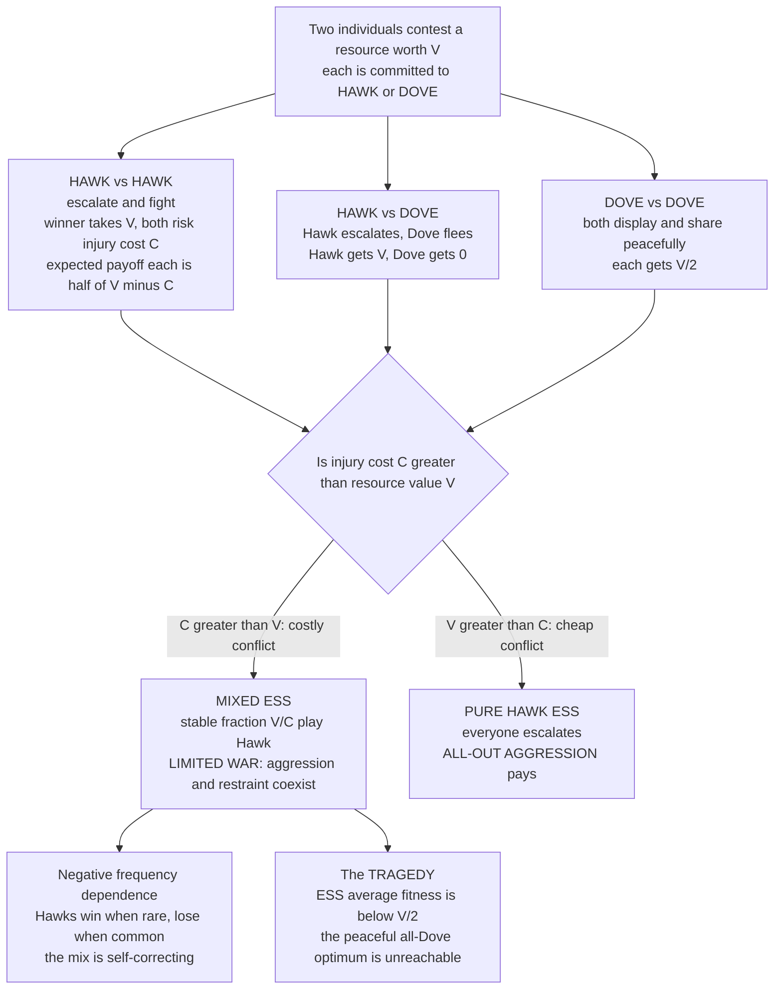

# 🦅 The Hawk-Dove Game

> [!abstract] TL;DR
> The **Hawk-Dove game** (Maynard Smith & Price, 1973) is the **founding model of evolutionary game theory**. It asks: why is animal conflict usually *limited* — ritual displays and one contestant backing down — rather than lethal all-out fighting? Two individuals contest a resource worth `V`; each plays **Hawk** (escalate and fight, risking injury cost `C`) or **Dove** (display and retreat). When fighting is costly (`C > V`), *neither* pure strategy is stable: all-Hawk populations bleed themselves out and can be invaded by Doves, while all-Dove populations get exploited and invaded by Hawks. The stable outcome is a **mixed ESS** — a population fraction **`V/C`** playing Hawk — held in place by **negative frequency dependence** (Hawks win when rare, lose when common). Crucially, this needs **no group selection or "good of the species"**: limited conflict emerges purely from **individual selection**. The model also shows a **tragedy** — the ESS population has *lower* average fitness than an all-Dove world would, yet selection cannot reach that peaceful optimum because it is invadable.

---

## Intuition

**Analogy:** Two red deer stags meet over a harem. They *could* gore each other to death — antlers are lethal weapons. Instead they mostly **roar, parallel-walk, and lock antlers in a shoving match**, and usually one simply **turns and walks away** before anyone is seriously hurt. Why the restraint? The old, comforting answer was *"they hold back for the good of the species — if every fight were lethal the species would go extinct."* That answer is **wrong**: a mutant stag that fought dirty and won every contest would leave more offspring, so "restraint for the species" is not evolutionarily stable — the ruthless gene would spread.

The Hawk-Dove game gives the *right* answer, and it is pure self-interest. Imagine a population where some animals are born **Hawks** (always escalate) and some **Doves** (always display, then flee if the other attacks). If almost everyone is a Dove, a rare Hawk **cleans up** — it wins every resource unopposed, so Hawks spread. But once Hawks are common, they keep **running into other Hawks**, and Hawk-versus-Hawk means real injury; now the cautious Doves, who never get hurt, quietly do *better*. So Hawks are great when **rare** and terrible when **common** — a self-correcting see-saw that settles at a **stable mixture** of aggressors and pacifists. Conflict is limited not by kindness but by the arithmetic of **who does better when rare**. And the tipping fraction is beautiful: exactly **`V/C`**, the value of the prize divided by the cost of a fight.

---

## How It Works

### The puzzle it solved

Before 1973, biologists explained ritualized, non-lethal animal contests with **group selection**: species that fought "humanely" avoided self-destruction, so restraint was "for the good of the species." John Maynard Smith and George Price demolished this by importing **game theory** and asking a sharper question: *is restraint stable against a rare cheat?* Their answer — limited conflict falls straight out of **individual selection**, no group benefit required — became the founding insight of the whole field (see the sibling note *Evolutionary_Game_Theory_Overview*, and the group-selection critique in the planned *Group_and_Multilevel_Selection*).

### The game setup

Two individuals contest a **resource worth `V`** (fitness units — food, territory, a mate). Each is committed to one of two strategies:

- **Hawk** — escalate and fight until injured or victorious.
- **Dove** — display, but retreat immediately if the opponent escalates.

Playing out the three encounters (payoff = expected fitness gain, and this is a payoff-as-fitness *population game*, the topic of the planned sibling *Fitness_Payoffs_and_Population_Games*):

| meets → | **Hawk** | **Dove** |
|---|---|---|
| **Hawk** | fight: winner takes `V`, both risk cost `C` → each gets `(V − C)/2` | Hawk escalates, Dove flees → Hawk `V`, Dove `0` |
| **Dove** | Dove flees → Dove `0`, Hawk `V` | both display, share → each gets `V/2` |

The single number driving everything is the **cost-to-value ratio** `C / V`.

### The key result: a mixed ESS at `V/C`

Suppose fighting is **costly**, `C > V`. Check the two pure strategies for **evolutionary stability** (uninvadability — the criterion of *Evolutionary_Stable_Strategies*):

- **All-Hawk is not an ESS.** In a Hawk world every contest is Hawk-vs-Hawk, paying `(V − C)/2 < 0`. A rare Dove earns `0` by fleeing — *better than negative* — so **Doves invade**.
- **All-Dove is not an ESS.** In a Dove world every contest is a peaceful split paying `V/2`. A rare Hawk beats every Dove for the full `V > V/2`, so **Hawks invade**.

Neither extreme holds, so the ESS must be **interior** — a stable coexistence. Set the two strategies' fitnesses equal (an ESS mixture makes its component pure strategies equally fit — the Bishop-Cannings principle). Writing `p` for the Hawk fraction:

```
Hawk fitness:  p·(V − C)/2 + (1 − p)·V
Dove fitness:  p·0         + (1 − p)·V/2
```

Setting them equal and solving gives the clean, famous result:

> **`p* = V / C`** — the stable fraction of Hawks (valid when `C > V`).

**Negative frequency dependence** stabilizes it: if `p` drifts *above* `V/C`, Doves become fitter and pull `p` back down; if `p` drifts *below*, Hawks become fitter and push it back up. The mix is a self-correcting attractor.

### Two regimes

Everything hinges on `C` versus `V`:

1. **`C > V` (costly fight, ordinary prize) → mixed ESS at `V/C`.** *Limited war*: aggression and restraint coexist. This is the biologically common case and explains ritualized display.
2. **`V > C` (cheap fight, precious prize) → pure Hawk ESS.** Now `V/C > 1`, so there is no interior point; escalation always pays and the population goes **all-Hawk**. All-out aggression is the stable outcome — think of contests where the resource is life-or-death and the weapons are not.

The single ratio `C/V` thus predicts *how aggressive a species or context should be*, explaining variation across animals and situations.

### The tragedy: ESS ≠ optimum

Here is the sting. At the mixed ESS, wasteful Hawk-vs-Hawk injuries drag the **average population fitness below `V/2`** — the payoff everyone would enjoy in an **all-Dove** world. A peaceful population would be collectively *better off*, but that state is **not reachable by selection**: it is invadable by a single Hawk. Selection optimizes *individual* invasion fitness, not group welfare, so it settles on a wasteful equilibrium it cannot escape. This is the same logic that makes cooperation fragile in the planned sibling *The_Prisoners_Dilemma_and_Cooperation* — a first glimpse that **stable does not mean good**.

### Structure of the game



---

## Key Concepts

### Secondary (intuitive)

- **Limited war** — animals mostly bluff and back down instead of fighting to the death; the game explains this without any "for the good of the species" story.
- **Hawk when rare, Dove when common** — aggressors thrive while scarce and suffer once crowded; that see-saw creates a stable balance.
- **The `V/C` mixture** — at balance, the fraction of aggressors equals the prize value divided by the injury cost.
- **The tragedy of conflict** — everyone would be better off if all were peaceful, but a single cheat always makes peace unstable.

### Undergraduate (formal)

- **Payoff matrix** — with Hawk = row/col 0 and Dove = 1: `A = [[(V−C)/2, V], [0, V/2]]`, where `A[i,j]` is the payoff to an `i`-player meeting a `j`-player.
- **ESS condition** — for a mixed strategy playing Hawk with probability `p*`, `p* = V/C` when `C > V`; it satisfies the Maynard Smith uninvadability criterion `u(σ*, σ*) = u(σ, σ*)` with the second-order tie-break favoring the incumbent.
- **Mixed vs pure ESS** — `C > V` gives a mixed interior ESS; `V > C` collapses to the pure Hawk ESS (`V/C > 1` has no interior root).
- **Negative frequency-dependent selection** — the fitness of Hawk *decreases* as Hawk frequency rises, guaranteeing a single stable interior rest point.
- **ESS ⊂ Nash** — the `V/C` mixture is exactly the symmetric mixed **Nash equilibrium** of the same matrix game; evolution *derives* what rationality would *deduce*.

### Graduate (advanced)

- **Replicator stability** — `p* = V/C` is an asymptotically stable rest point of the replicator equation `dp/dt = p·(f_H(p) − φ(p))`; the 2-strategy replicator flow converges globally from any interior start (see *Replicator_Dynamics*).
- **Bishop-Cannings theorem** — every pure strategy in the support of a mixed ESS earns *equal* payoff against it; hence the "set fitnesses equal" shortcut is exact, not an approximation.
- **Monomorphic vs polymorphic realization** — the same ESS is realized either as a **monomorphic** population in which every individual randomizes (Hawk with probability `V/C`) or a **polymorphic** population that is a stable *mixture* (a fraction `V/C` of pure Hawks, the rest pure Doves). In biology the polymorphic reading usually applies; both give identical population dynamics.
- **Bourgeois strategy** — augment the strategy set with an **ownership-conditional** rule: *"Hawk if I am the resource owner, Dove if I am the intruder."* Bourgeois is an ESS in the `C > V` regime and *pays no fighting cost at all*, because an arbitrary asymmetry (who arrived first) breaks the symmetry and settles the contest by convention. This explains **respect for territory and ownership** and previews the planned sibling *The_Evolution_of_Conventions_and_Norms*. The mirror-image "anti-Bourgeois" (paradoxical) strategy is *also* an ESS in theory — nature almost always picks Bourgeois.
- **Continuous generalization: the War of Attrition** — replace the binary Hawk/Dove choice with a continuous **persistence time**; the ESS is a *mixed distribution* of giving-up times (exponential), the continuous analogue of the Hawk-Dove mixture. Add **assessment/signaling** and you get the family of asymmetric contest games in *Animal_Conflict_and_Signaling* (planned).

---

## Python Demo

The code fully analyzes the Hawk-Dove game: it builds the payoff matrix, computes the mixed ESS analytically as `V/C`, and **confirms it by running the replicator dynamics** from six different starting Hawk-fractions — all converge to `V/C`. It then flips to the `V > C` regime to show the **pure Hawk ESS**, quantifies the **tragedy** (ESS average fitness below the all-Dove optimum), and prints both the **monomorphic and polymorphic** readings of the same equilibrium. Requires only `numpy` and `matplotlib`.

```python
# Full analysis of the Hawk-Dove game:
#   1. payoff matrix from resource value V and injury cost C
#   2. analytic mixed ESS = V/C, confirmed by replicator dynamics
#   3. the two regimes: C>V (limited war) vs V>C (all-out aggression)
#   4. the tragedy: ESS average fitness is below the all-Dove optimum
#   5. two readings of the ESS: monomorphic randomizer vs polymorphic mixture
import numpy as np
import matplotlib.pyplot as plt

def hawk_dove_matrix(V, C):
    # rows/cols: 0 = Hawk, 1 = Dove.  A[i, j] = payoff to i meeting j.
    return np.array([[(V - C) / 2.0, V      ],
                     [0.0,           V / 2.0]])

def replicator(A, x0, T=4000, dt=0.01):
    # x = fraction of Hawks; return the trajectory of the Hawk fraction.
    xs = np.empty(T + 1)
    x = x0
    for t in range(T + 1):
        xs[t] = x
        pop = np.array([x, 1.0 - x])       # current population mix
        fit = A @ pop                       # frequency-dependent payoffs
        phi = pop @ fit                     # population-average fitness
        x = np.clip(x + x * (fit[0] - phi) * dt, 0.0, 1.0)
    return xs

starts = [0.02, 0.15, 0.35, 0.55, 0.80, 0.98]

# ---- Regime 1: costly conflict C > V  ->  interior mixed ESS at V/C ----
V1, C1 = 2.0, 4.0
A1 = hawk_dove_matrix(V1, C1)
ess = V1 / C1                               # analytic prediction
traj1 = {s: replicator(A1, s) for s in starts}

# ---- Regime 2: cheap conflict V > C  ->  pure Hawk ESS at x = 1 ----
V2, C2 = 6.0, 2.0
A2 = hawk_dove_matrix(V2, C2)
traj2 = {s: replicator(A2, s) for s in starts}

# ---- The tragedy: average fitness vs Hawk fraction (in the C > V regime) ----
xgrid   = np.linspace(0.0, 1.0, 501)
phi     = np.array([np.array([x, 1 - x]) @ (A1 @ np.array([x, 1 - x])) for x in xgrid])
phi_ess = np.array([ess, 1 - ess]) @ (A1 @ np.array([ess, 1 - ess]))
phi_dove = V1 / 2.0                         # all-Dove average fitness = V/2

print(f"[C > V]  V={V1}, C={C1}  ->  analytic mixed ESS Hawk fraction = V/C = {ess:.3f}")
for s in starts:
    print(f"   start {s:.2f}  ->  replicator settles at {traj1[s][-1]:.3f}")
print(f"[V > C]  V={V2}, C={C2}  ->  V/C = {V2 / C2:.2f} > 1  ->  Hawk is a PURE ESS")
for s in starts:
    print(f"   start {s:.2f}  ->  replicator settles at {traj2[s][-1]:.3f}")

print(f"\nThe tragedy (C > V regime):")
print(f"   average fitness at the mixed ESS = {phi_ess:.3f}")
print(f"   average fitness of an all-Dove world = {phi_dove:.3f}  (HIGHER, yet unreachable)")
print(f"   wasteful Hawk-Hawk injuries cost the population {phi_dove - phi_ess:.3f} fitness units.")

print(f"\nTwo readings of the SAME ESS x* = {ess:.3f}:")
print(f"   monomorphic : every individual plays Hawk with probability {ess:.3f}")
print(f"   polymorphic : a fraction {ess:.3f} are pure Hawks, the rest pure Doves")

# ---- Visualize ----
fig, ax = plt.subplots(1, 3, figsize=(16, 4.6))

for s in starts:
    ax[0].plot(traj1[s], lw=1.6, label=f"x0 = {s:.2f}")
ax[0].axhline(ess, color="k", ls="--", lw=1.3, label=f"ESS = V/C = {ess:.2f}")
ax[0].set_title(f"C > V  (V={V1}, C={C1}): converge to the mixed ESS")
ax[0].set_xlabel("selection steps"); ax[0].set_ylabel("fraction playing Hawk")
ax[0].set_ylim(0, 1); ax[0].legend(fontsize=7, loc="center right")

for s in starts:
    ax[1].plot(traj2[s], lw=1.6, label=f"x0 = {s:.2f}")
ax[1].axhline(1.0, color="k", ls="--", lw=1.3, label="pure Hawk ESS (x = 1)")
ax[1].set_title(f"V > C  (V={V2}, C={C2}): converge to all-Hawk")
ax[1].set_xlabel("selection steps"); ax[1].set_ylabel("fraction playing Hawk")
ax[1].set_ylim(0, 1); ax[1].legend(fontsize=7, loc="lower right")

ax[2].plot(xgrid, phi, lw=2.0, color="tab:red", label="average fitness")
ax[2].scatter([ess], [phi_ess], color="k", zorder=5, label=f"ESS (x = {ess:.2f})")
ax[2].scatter([0.0], [phi_dove], color="tab:green", zorder=5, label="all-Dove optimum")
ax[2].annotate("tragedy: ESS sits\nbelow the optimum",
               xy=(ess, phi_ess), xytext=(0.42, phi_dove * 0.55),
               arrowprops=dict(arrowstyle="->"), fontsize=8)
ax[2].set_title("The cost of conflict: ESS fitness < all-Dove")
ax[2].set_xlabel("fraction playing Hawk"); ax[2].set_ylabel("average population fitness")
ax[2].legend(fontsize=8)

plt.tight_layout()
plt.savefig("hawk_dove_analysis.png", dpi=120)
print("\nsaved figure -> hawk_dove_analysis.png")
```

Expected output — every seed relaxes to `V/C`, the pure regime goes all-Hawk, and the tragedy is quantified:

```
[C > V]  V=2.0, C=4.0  ->  analytic mixed ESS Hawk fraction = V/C = 0.500
   start 0.02  ->  replicator settles at 0.500
   start 0.15  ->  replicator settles at 0.500
   start 0.35  ->  replicator settles at 0.500
   start 0.55  ->  replicator settles at 0.500
   start 0.80  ->  replicator settles at 0.500
   start 0.98  ->  replicator settles at 0.500
[V > C]  V=6.0, C=2.0  ->  V/C = 3.00 > 1  ->  Hawk is a PURE ESS
   start 0.02  ->  replicator settles at 1.000
   ...
The tragedy (C > V regime):
   average fitness at the mixed ESS = 0.500
   average fitness of an all-Dove world = 1.000  (HIGHER, yet unreachable)
   wasteful Hawk-Hawk injuries cost the population 0.500 fitness units.
```

The left panel shows six trajectories fanning out from different starts and all bending to the dashed `V/C` line — the mixed ESS is a global attractor. The middle panel shows the cheap-conflict regime collapsing to all-Hawk. The right panel is the moral: the population's fitness *peaks* at the all-Dove state (`x = 0`) and the ESS sits strictly *below* it — selection cannot climb to the peaceful peak because it is invadable.

---

## Real-World Applications

- **Animal contests (the founding case)** — red deer stags parallel-walk and shove rather than gore; funnel-web spiders and hermit crabs assess before escalating; most fights over territory or mates are ritualized precisely because injury cost `C` exceeds prize value `V` for the average contest.
- **Territory and ownership conventions** — the **Bourgeois** ESS ("owner escalates, intruder retreats") explains why residents almost always win disputes across species from butterflies (speckled wood, *Pararge aegeria*) to songbirds; an arbitrary asymmetry settles conflict cheaply, a biological root of *property* respected long before any law.
- **Variation in aggression** — species or contexts with high `V/C` (a life-or-death resource, or cheap-to-use weapons) tip toward all-out fighting (the pure Hawk regime); explaining why some contests are lethal while most are not.
- **International relations and the game of Chicken** — Hawk-Dove is the biologist's Chicken: two nuclear powers in a standoff, an arms race, or brinkmanship each face "escalate vs back down," where mutual escalation is catastrophic (`C` huge). The mixed/asymmetric equilibria and the tragedy of escalation inform deterrence theory (see *Nuclear_Strategy_and_Arms_Control* and the planned sibling *Evolutionary_Political_Science_and_Conflict*).
- **Economics and markets** — price wars, patent litigation, and entry deterrence are Hawk-Dove standoffs: aggressive undercutting pays only while rivals stay meek, and mutual aggression destroys value for all — a frequency-dependent equilibrium of aggressive and accommodating firms.

---

## Common Pitfalls

- **Invoking group selection** — the classic error the model *fixed*: assuming animals limit conflict "for the good of the species." Restraint is stable only where individual invasion fitness makes it so; a would-be "humane" convention that a cheat can exploit will not persist.
- **Confusing the ESS fraction with an optimum** — `V/C` is *stable*, not *good*. The population would be fitter if all were Doves; selection is trapped at a wasteful equilibrium. "Stable" and "best for the group" are different questions.
- **Forgetting the `C > V` precondition** — the elegant `V/C` mixture exists *only* when fighting is costly. If `V > C`, `V/C > 1` is not a probability; the ESS is pure Hawk, and quoting "`V/C` Hawks" is meaningless.
- **Reading the mixed ESS as one fixed animal type** — the equilibrium is a *ratio*, realized either as every individual randomizing or as a stable mixture of pure Hawks and pure Doves. Both are valid; assuming there must be a single "Hawk-Dove" phenotype misreads the polymorphism.
- **Treating `V` and `C` as fixed constants** — real contests have asymmetries (size, ownership, prior investment) that shift `V` and `C` between contestants. Ignoring them misses why the **Bourgeois**/assessment strategies, not the naive mixture, often govern real fights.
- **Assuming the replicator always converges** — true for 2-strategy Hawk-Dove, but adding a third strategy (e.g. a Bourgeois-vs-anti-Bourgeois-vs-Hawk world, or Rock-Paper-Scissors-like structure) can produce cycles rather than a fixed ESS.

---

## Related Concepts

- [[Evolutionary_Game_Theory_Overview]] — the parent note; Hawk-Dove is the canonical example that launched the whole field.
- [[Evolutionary_Stable_Strategies]] — the uninvadability criterion Hawk-Dove is the textbook illustration of; the `V/C` mixture is its most famous ESS.
- [[Replicator_Dynamics]] — the dynamic engine confirming that selection drives the Hawk fraction to `V/C` from any start.
- [[Mixed_Strategies]] — the Hawk-Dove ESS *is* a mixed strategy; EGT reinterprets it as a stable population ratio rather than a randomizing rational agent.
- [[Nash_Equilibrium]] — the `V/C` mixture is exactly the symmetric mixed Nash equilibrium of the payoff matrix; every ESS is a Nash equilibrium.
- [[Natural_Selection_and_Adaptation]] — the biological substrate: "payoff = fitness" means differential reproduction, the mechanism selecting the `V/C` mix.
- [[Population_Genetics]] — the allele-frequency framework in which a stable Hawk/Dove polymorphism is maintained by frequency-dependent selection.
- [[Population_Ecology]] — frequency- and density-dependent interactions connect the game to real population dynamics.
- [[Nuclear_Strategy_and_Arms_Control]] — brinkmanship and deterrence as a high-stakes Chicken/Hawk-Dove standoff between states.
- [[War_Conflict_and_Security]] — escalation, limited war, and the political-science face of the same escalate-vs-retreat logic.
- [[_MOC_Game_Theory_Master]] — the classical game-theory vault this evolutionary treatment complements.

**Forthcoming siblings in this vault (planned, referenced in prose above):** `Fitness_Payoffs_and_Population_Games`, `Animal_Conflict_and_Signaling`, `The_Prisoners_Dilemma_and_Cooperation`, `The_Evolution_of_Conventions_and_Norms`, `Group_and_Multilevel_Selection`, and `Evolutionary_Political_Science_and_Conflict`.

---

## Review Questions

1. **(Conceptual)** Before 1973, biologists explained ritualized, non-lethal animal contests by appeal to "the good of the species." Why is that explanation *not evolutionarily stable*, and how does the Hawk-Dove game produce limited conflict from individual selection alone?
2. **(Applied / scenario)** A species contests a resource worth `V = 3` where fighting costs `C = 5`. Compute the ESS fraction of Hawks. If the population is currently 80% Hawks, will that fraction rise or fall under selection, and *why* (name the mechanism)? Now the environment changes so the resource becomes life-or-death, making `V = 5`, `C = 3`. What is the ESS now, and what happened to limited war?
3. **(Trade-off / synthesis)** The Hawk-Dove ESS has *lower* average fitness than an all-Dove population would. Explain precisely why selection cannot reach the peaceful, higher-fitness state. How does the **Bourgeois** strategy escape this tragedy, and what does that tell you about the role of *arbitrary conventions* (ownership, who-arrived-first) in resolving conflict cheaply?

---

## Sources

- Maynard Smith, J. & Price, G. R. (1973). "The Logic of Animal Conflict." *Nature*, 246, 15–18.
- Maynard Smith, J. (1982). *Evolution and the Theory of Games*. Cambridge University Press. (Chapters on Hawk-Dove, the War of Attrition, and Bourgeois.)
- Hofbauer, J. & Sigmund, K. (1998). *Evolutionary Games and Population Dynamics*. Cambridge University Press.
- Nowak, M. A. (2006). *Evolutionary Dynamics: Exploring the Equations of Life*. Harvard University Press.
- Dawkins, R. (1976). *The Selfish Gene*. Oxford University Press. (Chapter 5, "Aggression: stability and the selfish machine," the classic popular account of Hawk-Dove and ESS.)

---

#evolutionary-game-theory #hawk-dove #animal-conflict #mixed-ess #limited-war
