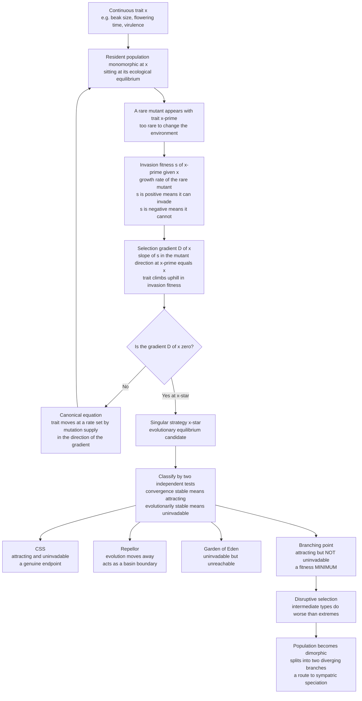

# 🌿 Adaptive Dynamics and Evolutionary Branching

> [!abstract] TL;DR
> **Adaptive dynamics** (Metz, Geritz, Dieckmann & Law, 1990s) extends evolutionary game theory from a fixed *menu* of strategies (Hawk / Dove) to a **continuous trait** — beak size, body size, flowering time, virulence, investment level — that evolves *gradually* by the successive invasion of nearby-better mutants. Its central object is **invasion fitness** `s(x', x)`: the per-capita growth rate of a rare mutant with trait `x'` in a resident population monomorphic for trait `x`. The local slope of invasion fitness, the **selection gradient** `∂s/∂x'` evaluated at `x' = x`, tells the trait which way to climb; the **canonical equation** turns that gradient into a trajectory. Evolution moves until the gradient vanishes at a **singular strategy**, which is classified by two *independent* properties — is it **convergence stable** (an attractor) and is it **evolutionarily stable** (uninvadable)? A singular point that is attracting but *not* uninvadable is a **branching point**: the population is drawn to a fitness **minimum**, experiences **disruptive selection**, and **splits** into two diverging lineages. This **evolutionary branching** is a game-theoretic route to **sympatric speciation** and polymorphism — showing that frequency-dependent selection can *create* diversity, not merely maintain it. The whole geometry is read off a single diagram, the **pairwise invasibility plot (PIP)**.

---

## Intuition

**Analogy:** So far a strategy has been a choice from a short list — you are a Hawk *or* a Dove. But most biological "strategies" are really a **continuous dial**: how big a beak, how tall a stem, how early to flower, how much poison to make, how fiercely a pathogen exploits its host. Turn the dial a hair and fitness changes a hair. **Adaptive dynamics** tracks how that dial slowly turns as tiny mutations that happen to do a *little* better invade and take over — evolution as **hill-climbing on a fitness landscape**.

Here is the twist that makes it profound. The landscape is not fixed: because fitness is **frequency-dependent**, every step the population takes *reshapes the hill under its own feet*. Astonishingly, the dial can climb steadily to a point that turns out to be a fitness **valley** rather than a peak — a spot the whole population is pulled *toward*, yet where intermediate types do *worse* than the extremes on either side. Stuck at that valley bottom, the single population cannot stay unified: it **tears in two**, the two halves sliding apart up opposite slopes. That is **evolutionary branching** — quite possibly how one species becomes two. **Speciation as a game-theoretic phase transition.**

---

## How It Works

### Core Mechanics

**1. A continuous strategy.** The strategy is a real number `x` (or a vector) — a quantitative trait such as beak depth or resource-use position. A population is (usually) **monomorphic**: nearly everyone shares trait `x`, sitting at its ecological equilibrium (population size set by carrying capacity and competition).

**2. Invasion fitness.** Introduce a rare **mutant** with trait `x'`. Because it is rare, it does not affect the environment; it simply grows or shrinks at rate

$$s(x', x) = \text{per-capita growth rate of a rare } x' \text{-mutant in an } x\text{-resident population.}$$

By construction `s(x, x) = 0` — a resident cannot out-grow itself at equilibrium. If `s(x', x) > 0` the mutant **can invade**; if `s(x', x) < 0` it cannot. Evolution proceeds as a **trait substitution sequence**: invade, replace, repeat, so the resident trait creeps through trait space.

**3. The selection gradient.** The direction of that creep is set by the local slope of invasion fitness in the mutant direction:

$$D(x) = \left.\frac{\partial s(x', x)}{\partial x'}\right|_{x'=x}.$$

If `D(x) > 0`, mutants with *larger* trait invade — the trait increases; if `D(x) < 0`, it decreases. The trait always moves **uphill in invasion fitness**.

**4. The canonical equation.** Averaging the stochastic substitution sequence gives the deterministic **canonical equation of adaptive dynamics**:

$$\dot{x} = \tfrac{1}{2}\,\mu\,\sigma^2\,N(x)\,D(x),$$

where `μ` is the mutation rate, `σ²` the mutational variance, and `N(x)` the equilibrium population size. The **rate** of evolution is set by mutation supply and population size; the **direction** is set purely by the selection gradient. It is hill-climbing on a **landscape that moves as the population moves**.

**5. Singular strategies.** Evolution stops moving where the gradient vanishes: `D(x^*) = 0`. Such an `x^*` is a **singular strategy** — a candidate evolutionary equilibrium. But "the gradient is zero" says nothing yet about what *kind* of point it is. Two *independent* second-order properties decide its fate:

- **Convergence stability (CS):** does evolution actually move *toward* `x^*`? True iff the gradient points inward, i.e. `dD/dx < 0` at `x^*`. This is about **attraction along the resident axis**.
- **Evolutionary stability (ES):** once *at* `x^*`, is it uninvadable — a fitness **maximum** for the mutant? True iff `∂²s/∂x'² < 0` at `x' = x = x^*`. This is the continuous-trait version of an [[Evolutionarily_Stable_Strategies|ESS]].

**6. The four singular types.** Because CS and ES combine **independently**, a singular point falls into one of four classes:

| | Evolutionarily stable (uninvadable, ES) | Not evolutionarily stable (invadable) |
|---|---|---|
| **Convergence stable (attracting)** | **CSS** — a genuine endpoint | **Branching point** — the surprise |
| **Not convergence stable (repelling)** | **Garden of Eden** — uninvadable but unreachable | **Repellor** — evolution flees |

- **CSS (Continuously Stable Strategy):** attracting *and* uninvadable — evolution climbs to it and stays. The clean, expected outcome.
- **Repellor:** evolution moves *away*; it acts as a basin boundary between two attractors (the continuous analog of a coordination-game watershed).
- **Garden of Eden:** uninvadable if you were there, but evolution never brings you there — a fitness peak in a valley of the convergence landscape, biologically irrelevant.
- **Branching point:** the remarkable case — **attracting but NOT evolutionarily stable**. Evolution converges to a fitness *minimum*.

**7. Evolutionary branching.** At a branching point the monomorphic population is pulled to `x^*`, then finds itself sitting in a **fitness valley**: intermediate types are worse than either extreme (frequency-dependent **disruptive selection**). The population can no longer stay unified — it becomes **dimorphic**, splitting into two sub-populations that evolve **apart**. One lineage becomes two. Frequency-dependent competition has **created polymorphism from a single ancestor**.

### Flow / Architecture



---

## Key Concepts

### Secondary (school) level

- **The trait is a dial, not a switch.** Instead of "Hawk or Dove," think "how big a beak" — a number you can nudge up or down. Evolution slowly turns the dial toward whatever does a bit better.
- **Climbing to a valley.** Normally you expect evolution to climb to a peak and stop. The shock of this theory: sometimes evolution is dragged to the *bottom of a valley*, where being average is the worst place to be — so the population splits, half going one way and half the other.
- **Making new species without a wall.** Two groups usually become different species when a mountain or river separates them. Evolutionary branching says they can split **while living in the same place**, just by competing for slightly different food.

### Undergraduate level

- **Invasion fitness `s(x', x)`.** The growth rate of a rare `x'`-mutant among `x`-residents; the single object from which everything else is derived. Always `s(x, x) = 0`.
- **Selection gradient and its sign.** `D(x) = ∂s/∂x'` at `x' = x`. Sign of `D` gives the direction of evolution; its zeros are the **singular strategies**.
- **Two independent stability questions.** *Convergence stability* (`dD/dx < 0`, is `x^*` an attractor?) and *evolutionary stability* (`∂²s/∂x'² < 0`, is `x^*` a fitness max?). Crucially, a point can be one without the other — that decoupling is the whole story.
- **The 2×2 classification.** CS × ES gives **CSS**, **repellor**, **Garden of Eden**, and **branching point**. Only the CSS is a "textbook" evolutionary endpoint.
- **The PIP.** The **pairwise invasibility plot** shades the sign of `s(x', x)` over the (resident `x`, mutant `x'`) plane. The diagonal is always neutral. The *pattern of + and − regions where the diagonal meets a singular point* reveals its type at a glance.
- **Disruptive selection.** At a branching point the fitness landscape (seen by mutants) is locally **concave up** — a minimum — so selection pushes trait values *apart*, not together.

### Graduate level

- **Timescale separation.** Adaptive dynamics assumes **ecological dynamics are fast** (residents reach demographic equilibrium) while **evolution is slow** (mutations are rare). This lets `s(x', x)` be computed from the resident equilibrium and justifies the substitution-sequence picture.
- **Geritz et al. classification, formally.** With `s_{11} = ∂²s/∂x'²` and `s_{22} = ∂²s/∂x²` at `x^*`: evolutionary stability is `s_{11} < 0`; convergence stability is `s_{11} + s_{22} < 0` (equivalently `dD/dx < 0`). The two conditions are independent because `s_{22}` can flip `s_{11}`'s verdict — this is why a fitness minimum (`s_{11} > 0`) can still be convergence stable. Branching requires `s_{11} > 0` **and** convergence stability.
- **Protected dimorphism.** Just after a branching point, the two nascent morphs `x_1, x_2` **mutually invade** (`s(x_1, x_2) > 0` and `s(x_2, x_1) > 0`) — a *protected polymorphism* that cannot collapse. Evolution then proceeds on the **two-dimensional** trait pair, potentially branching again (adaptive radiation).
- **Canonical equation as a limit.** Dieckmann & Law (1996) derived `\dot{x} = \tfrac{1}{2}\mu\sigma^2 N(x)\,D(x)` as the deterministic mean-path of the underlying mutation-selection jump process — a diffusion/large-deviation-style limit, not a postulate.
- **Relation to the [[Replicator_Dynamics|replicator equation]].** The replicator dynamics live on a **fixed, finite** strategy simplex; adaptive dynamics live on a **continuous** trait space with a *co-evolving* environment. Near a branching point the trait distribution is a delta that becomes bimodal — invisible to a fixed-strategy replicator model but natural in the continuous, oligomorphic formulation.
- **Assumptions and their extensions.** The clean theory assumes **clonal (asexual) inheritance**, **rare** and **small** mutations, and monomorphic residents. Sexual reproduction can *block* branching (recombination refills the fitness valley with intermediate offspring) unless **assortative mating** evolves — the central controversy of sympatric-speciation theory. Larger mutations, standing variation, and finite populations connect adaptive dynamics to **quantitative genetics** (the Lande equation) and to individual-based stochastic models.

---

## Python Demo

We use the canonical **Gaussian resource-competition** model (MacArthur–Levins; Dieckmann & Doebeli 1999). A resident with trait `x` has carrying capacity `K(x) = exp(-x^2 / (2 σ_K²))` (resources are richest at `x = 0`), and a mutant `x'` competes with residents through the kernel `a(x', x) = exp(-(x'-x)^2 / (2 σ_a²))`. At ecological equilibrium the resident population equals `K(x)`, so the **invasion fitness** of a rare mutant is

`s(x', x) = 1 - a(x', x) · K(x) / K(x')`.

The single singular strategy is `x^* = 0`, and a short calculation gives `∂²s/∂x'² ∝ (1/σ_a² - 1/σ_K²)`: when the **competition kernel is narrower than the resource distribution** (`σ_a < σ_K`) the singular point is a **fitness minimum** and hence a **branching point**; otherwise it is a **CSS**. The demo (a) draws the **PIP**, (b) locates and **classifies** the singular strategy numerically, and (c) runs an individual-based simulation that starts monomorphic, climbs to `x^* = 0`, and **branches into two diverging clusters**. `numpy` and `matplotlib` only.

```python
# Adaptive dynamics & evolutionary branching in the Gaussian competition model.
#   K(x)      = exp(-x^2 / (2 sigK^2))     resource carrying capacity (peak at 0)
#   a(x',x)   = exp(-(x'-x)^2/(2 siga^2))  competition kernel (mutant vs resident)
#   s(x',x)   = 1 - a(x',x) * K(x)/K(x')   invasion fitness of a RARE mutant
# Singular strategy x* = 0. Branching iff siga < sigK (narrow competition).
import numpy as np
import matplotlib.pyplot as plt

rng = np.random.default_rng(7)

sigK = 1.0        # width of the resource distribution
siga = 0.7        # width of the competition kernel  (siga < sigK  -> BRANCHING)

def Kcap(x):                      # carrying capacity as a function of trait
    return np.exp(-x**2 / (2 * sigK**2))

def akern(xm, xr):                # competition felt by mutant xm from resident xr
    return np.exp(-(xm - xr)**2 / (2 * siga**2))

def inv_fitness(xm, xr):          # invasion fitness s(x'=xm, x=xr)
    return 1.0 - akern(xm, xr) * Kcap(xr) / Kcap(xm)

# ---------------------------------------------------------------------------
# (b) Singular strategy and its classification (do this first; used in titles)
# ---------------------------------------------------------------------------
def selection_gradient(xr, h=1e-5):     # D(x) = d s/d x'  at x'=x
    return (inv_fitness(xr + h, xr) - inv_fitness(xr - h, xr)) / (2 * h)

def d2s_dxm2(x0, h=1e-4):               # curvature of s in the mutant direction
    f = lambda xm: inv_fitness(xm, x0)
    return (f(x0 + h) - 2 * f(x0) + f(x0 - h)) / h**2

xstar = 0.0                                        # by symmetry of the model
grad_slope = (selection_gradient(0.05) -
              selection_gradient(-0.05)) / 0.10    # dD/dx at x*
curv = d2s_dxm2(xstar)                             # d^2 s / d x'^2 at x*
conv_stable = grad_slope < 0                       # attracting?
evo_stable = curv < 0                              # uninvadable (fitness max)?
if conv_stable and evo_stable:
    kind = "CSS (attracting + uninvadable)"
elif conv_stable and not evo_stable:
    kind = "BRANCHING POINT (attracting fitness MINIMUM)"
elif (not conv_stable) and evo_stable:
    kind = "Garden of Eden (uninvadable but unreachable)"
else:
    kind = "Repellor"
print(f"singular strategy x* = {xstar:.3f}")
print(f"  dD/dx = {grad_slope:+.3f}  -> convergence stable: {conv_stable}")
print(f"  d2s/dx'^2 = {curv:+.3f}   -> evolutionarily stable: {evo_stable}")
print(f"  CLASSIFICATION: {kind}")

# ---------------------------------------------------------------------------
# (a) Pairwise Invasibility Plot: sign of s over (resident, mutant) space
# ---------------------------------------------------------------------------
grid = np.linspace(-2.2, 2.2, 400)
XR, XM = np.meshgrid(grid, grid)            # XR = resident x, XM = mutant x'
S = inv_fitness(XM, XR)
PIP = np.sign(S)                            # +1 mutant invades, -1 it cannot

# ---------------------------------------------------------------------------
# (c) Individual-based simulation: monomorphic start -> branching
# ---------------------------------------------------------------------------
def simulate_branching(N=200, gens=2500, mu=0.03, mut_sd=0.05, sel=4.0, x0=0.6):
    traits = np.full(N, x0)                        # start monomorphic, off-center
    hist_g, hist_x = [], []
    for g in range(gens):
        d = traits[:, None] - traits[None, :]      # pairwise trait differences
        A = np.exp(-d**2 / (2 * siga**2))          # competition matrix
        load = A.sum(axis=1)                        # competition felt by each indiv
        w = np.exp(-sel * load / (N * Kcap(traits)))   # fitness: low load/high K wins
        p = w / w.sum()
        parents = rng.choice(N, size=N, p=p)        # Wright-Fisher resampling
        traits = traits[parents].copy()
        m = rng.random(N) < mu                      # rare mutations
        traits[m] += rng.normal(0, mut_sd, m.sum())
        if g % 10 == 0:                             # subsample for plotting
            hist_g.append(np.full(N, g)); hist_x.append(traits.copy())
    return np.concatenate(hist_g), np.concatenate(hist_x)

gen_pts, trait_pts = simulate_branching()

# ---------------------------------------------------------------------------
# Visualization
# ---------------------------------------------------------------------------
fig, ax = plt.subplots(1, 3, figsize=(17, 5.2))

# Panel A: the PIP
ax[0].contourf(XR, XM, PIP, levels=[-2, 0, 2],
               colors=["#f4c7c3", "#cfe8cf"])
ax[0].contour(XR, XM, S, levels=[0], colors="k", linewidths=1.2)
ax[0].plot(grid, grid, "k--", lw=1)                # neutral diagonal x'=x
ax[0].plot(xstar, xstar, "ko", ms=8)
ax[0].annotate("singular x*", (xstar, xstar), textcoords="offset points",
               xytext=(8, 8))
ax[0].set_title("(a) Pairwise Invasibility Plot\ngreen: mutant invades  |  red: it cannot")
ax[0].set_xlabel("resident trait  x"); ax[0].set_ylabel("mutant trait  x'")

# Panel B: selection gradient (zero crossing = singular strategy)
Dvals = np.array([selection_gradient(x) for x in grid])
ax[1].plot(grid, Dvals, color="navy", lw=2)
ax[1].axhline(0, color="k", lw=0.8); ax[1].axvline(xstar, color="gray", ls="--")
ax[1].fill_between(grid, Dvals, 0, where=Dvals > 0, color="navy", alpha=0.12)
ax[1].set_title("(b) Selection gradient D(x)\ncrosses zero downward -> convergence-stable x*")
ax[1].set_xlabel("resident trait  x"); ax[1].set_ylabel("selection gradient  D(x)")

# Panel C: evolutionary branching (trait vs generation)
ax[2].plot(gen_pts, trait_pts, ".", ms=1.2, color="darkgreen", alpha=0.25)
ax[2].axhline(xstar, color="crimson", ls="--", lw=1, label="branching point x*")
ax[2].set_title("(c) Evolutionary branching\none lineage climbs to x* then SPLITS in two")
ax[2].set_xlabel("generation"); ax[2].set_ylabel("trait value")
ax[2].legend(loc="upper right")

plt.tight_layout()
plt.savefig("adaptive_dynamics_branching.png", dpi=120)
print("saved adaptive_dynamics_branching.png")
```

**What the output shows.** The printout classifies `x^* = 0` as a **branching point** (`dD/dx < 0` so it is convergence stable, but `∂²s/∂x'² > 0` so it is a fitness *minimum*, hence not evolutionarily stable). Panel **(a)**, the PIP, shows the signature geometry: around the singular point on the diagonal, the regions *just above and just below* the diagonal are **green** — a mutant on *either* side of a near-singular resident can invade, the fingerprint of disruptive selection. Panel **(b)** shows the selection gradient crossing zero with negative slope, confirming attraction to `x^* = 0`. Panel **(c)** is the payoff: a population that starts monomorphic at `x = 0.6` first **converges** to the branching point, hovers there briefly, then **splits into two clusters** that march steadily apart — one lineage becoming two, live, from competition alone. Rerun with `siga = 1.5` (`σ_a > σ_K`) and the singular point becomes a **CSS**: the population converges to `x^* = 0` and stays put, no branching.

---

## Real-World Applications

> **Example — Darwin's finches:** On the Galápagos, ground finches feed on seeds of different sizes, and **beak depth** is a continuous trait under frequency-dependent competition. When one seed size is over-exploited, birds with beaks tuned to *other* seeds gain an advantage — exactly the disruptive selection of a branching point. Adaptive-dynamics models of beak size reproduce the observed **diversification of beak morphologies** and character displacement between coexisting species, a textbook empirical anchor for evolutionary branching.

- **Sympatric speciation.** Adaptive dynamics gives frequency-dependent competition a mechanism to split one species into two **without geographic isolation** — the central, still-debated claim (Dieckmann & Doebeli 1999). Whether it works in sexual populations hinges on the parallel evolution of **assortative mating**.
- **Virulence evolution in pathogens.** Parasite **virulence** (host-exploitation rate) is a continuous strategy with a transmission–virulence trade-off; adaptive dynamics locates the evolutionarily singular virulence and, under superinfection, can predict **branching into coexisting high- and low-virulence strains** — a framing that carries into host–pathogen and co-evolution models.
- **Microbial resource partitioning and cross-feeding.** In chemostats, clonal microbes branch into **coexisting metabolic specialists** (e.g. glucose vs acetate users in long-term *E. coli* evolution), a laboratory demonstration of branching-driven diversification relevant to public-goods and microbial-game models.
- **Cooperation–defection dimorphisms.** Continuous "investment level" traits (how much to contribute to a public good) can branch into distinct **cooperator and defector morphs**, giving an adaptive-dynamics account of coexisting social strategies rather than a single ESS.
- **Seed size, plant height, flowering time.** Many plant life-history traits are modeled as branching-prone continuous strategies, explaining stable **polymorphisms** and niche packing in communities.

---

## Common Pitfalls

- **"Convergence stable implies evolutionarily stable."** The single most important error. The two are **independent**: a branching point is convergence stable yet evolutionarily *un*stable. Always test **both** `dD/dx < 0` *and* `∂²s/∂x'² < 0` before calling a singular point an endpoint.
- **"A singular strategy is always a fitness peak."** No — a branching point is a fitness **minimum** that evolution nonetheless converges to. "The gradient is zero" does not mean "the landscape has a maximum."
- **"Branching happens for any singular point."** It requires the *specific* combination attracting-plus-fitness-minimum. In the competition model it needs `σ_a < σ_K`; flip that inequality and you get a CSS and no branching.
- **"Sexual populations branch the same way."** Recombination in sexual species continually **regenerates intermediate genotypes**, refilling the fitness valley. Branching in sexual populations generally requires the co-evolution of **assortative mating** (or linkage) — the crux of the sympatric-speciation controversy. Do not read clonal-model branching as automatic speciation.
- **"Big mutations are fine."** The clean theory assumes **rare, small** mutations and a **separation of timescales** (fast ecology, slow evolution). Large mutations, strong mutation supply, or fast environmental change break the trait-substitution picture and demand individual-based or quantitative-genetic models instead.
- **"The PIP alone tells you the outcome."** The PIP reveals invadability and singular-point *type*, but the realized long-term outcome (how many branches, where they settle) also depends on **mutual invasibility** of the emerging morphs and the higher-dimensional dynamics after the first split.
- **"Adaptive dynamics replaces the replicator equation."** It complements it. The [[Replicator_Dynamics|replicator dynamics]] handle a *fixed finite* strategy set; adaptive dynamics handle a *continuum* with a co-evolving environment. Use the right tool for the trait structure.

---

## Related Concepts

- [[Replicator_Dynamics]] — the fixed-strategy *dynamic* engine of EGT; adaptive dynamics is its continuous-trait, co-evolving-environment counterpart, and the canonical equation is the gradient-ascent analog of the replicator flow.
- [[Evolutionarily_Stable_Strategies]] — the ESS is the discrete ancestor of the **CSS**; a branching point is precisely a convergence-stable singular strategy that *fails* the ESS uninvadability condition.
- [[Fitness_Payoffs_and_Population_Games]] — invasion fitness is the frequency-dependent fitness of this vault, evaluated for a *rare* mutant against a resident equilibrium.
- [[Evolutionary_Game_Theory_Overview]] — the vault's entry point; adaptive dynamics is the "continuous-trait" branch of the EGT map.
- [[From_Classical_to_Evolutionary_Game_Theory]] — situates the move from discrete strategy menus to continuous evolving traits.
- [[Speciation_and_Macroevolution]] — the biology of how one lineage becomes two; evolutionary branching supplies a *sympatric*, competition-driven mechanism.
- [[Natural_Selection_and_Adaptation]] — the Darwinian substrate: invasion of fitter mutants is selection, and branching is disruptive selection made dynamic.
- [[Community_Ecology]] — resource partitioning, character displacement, and niche packing are the ecological face of repeated branching.
- [[Population_Ecology]] — the carrying-capacity / Lotka–Volterra competition that sets the resident equilibrium behind invasion fitness.
- [[Population_Genetics]] — the allele-frequency view of the same selection; branching corresponds to protected polymorphism.
- [[Quantitative_Genetics_and_Heritability]] — the standing-variation, sexual-population framework (Lande equation) that generalizes the single-locus clonal picture.
- [[Speciation_and_Reproductive_Isolation]] — the assortative-mating machinery a branching sexual population needs to complete speciation.
- [[Bifurcations_and_Tipping_Points]] — a branching point is a **bifurcation** of the evolutionary dynamics: as `σ_a/σ_K` crosses one, a stable monomorphism loses stability and a dimorphism is born.
- [[Dynamical_Systems_and_Attractors]] — singular strategies are fixed points; CS/ES are the two stability axes classifying attractors, repellors, and saddles of the evolutionary flow.
- [[Evolutionary_Dynamics_and_Fitness_Landscapes]] — branching is the population climbing a *frequency-dependent* landscape into a valley that its own presence carves.
- [[Cooperation_and_Evolutionary_Game_Theory]] — continuous investment traits can branch into coexisting cooperator and defector morphs.
- [[Systems_of_ODEs]] — the canonical equation and the resident ecological equilibrium are coupled ODE systems on trait and density.
- [[Partial_Derivatives]] — the selection gradient and the CS/ES conditions are first- and second-order partials of `s(x', x)`.

*Sibling EGT notes referenced in prose and to be wired once written: `Evolutionary_Stability_and_Dynamic_Stability` (the CS-vs-ES decoupling in the discrete setting), `Host_Pathogen_and_Coevolution` (virulence branching), `Microbial_Games_and_Public_Goods` (cross-feeding and cooperator/defector branching), and `Eco_Evolutionary_Dynamics` (the fast-ecology / slow-evolution feedback that adaptive dynamics formalizes).*

---

## Review Questions

1. **(Secondary)** Using the beak-size dial analogy, explain in plain words how a population can be pulled *toward* a spot where being average is the *worst* thing to be, and why that forces the population to split into two. Why is this called "speciation without a wall"?
2. **(Undergraduate)** Define invasion fitness `s(x', x)` and the selection gradient `D(x)`. State the two *independent* conditions that distinguish a **CSS** from a **branching point**, and explain why a singular strategy can be *convergence stable* yet *not evolutionarily stable*. Sketch what the PIP looks like around each of the two types.
3. **(Graduate — scenario)** In the Gaussian competition model you measure the competition-kernel width `σ_a` and the resource-distribution width `σ_K`. (a) For which ratio does the singular strategy branch, and why does that inequality correspond to `∂²s/∂x'² > 0`? (b) You now switch the population from clonal to **sexual** reproduction and branching disappears — explain the mechanism, and state what additional trait would have to co-evolve to restore branching. (c) What does the timescale-separation assumption buy you, and when would you abandon adaptive dynamics for an individual-based model?

---

## Sources

- Geritz, S. A. H., Kisdi, É., Meszéna, G., & Metz, J. A. J. (1998). "Evolutionarily Singular Strategies and the Adaptive Growth and Branching of the Evolutionary Tree." *Evolutionary Ecology*, 12(1), 35–57.
- Dieckmann, U., & Law, R. (1996). "The Dynamical Theory of Coevolution: A Derivation from Stochastic Ecological Processes." *Journal of Mathematical Biology*, 34(5–6), 579–612.
- Dieckmann, U., & Doebeli, M. (1999). "On the Origin of Species by Sympatric Speciation." *Nature*, 400(6742), 354–357.
- Metz, J. A. J., Geritz, S. A. H., Meszéna, G., Jacobs, F. J. A., & van Heerwaarden, J. S. (1996). "Adaptive Dynamics, a Geometrical Study of the Consequences of Nearly Faithful Reproduction." In *Stochastic and Spatial Structures of Dynamical Systems*, 183–231.
- Doebeli, M. (2011). *Adaptive Diversification.* Princeton University Press.

---

#evolutionary-game-theory #adaptive-dynamics #evolutionary-branching #invasion-fitness #speciation
