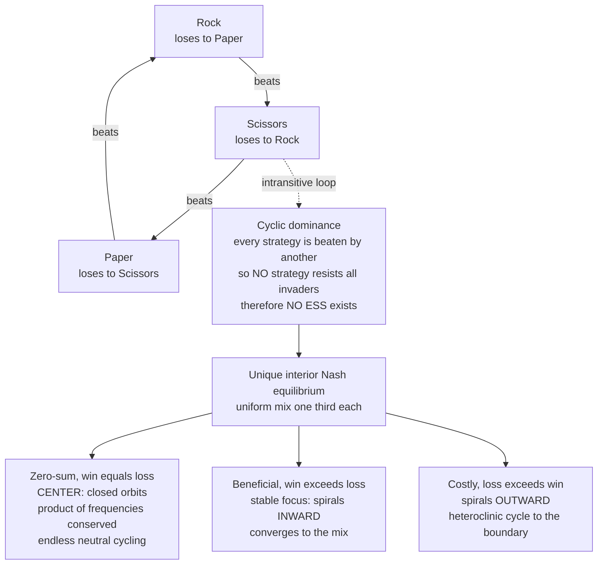

# 🔄 Cyclic Dynamics and Rock-Paper-Scissors

> [!abstract] TL;DR
> Not every evolutionary game settles down. When three or more strategies stand in **cyclic (intransitive) dominance** — each beats one and loses to another, like **Rock beats Scissors, Scissors beats Paper, Paper beats Rock** — *no* strategy resists every invader, so there is **no ESS**. Under the replicator dynamics the population never converges; it **cycles forever**, endlessly chasing its own tail. In the exact zero-sum case the unique interior equilibrium `(1/3, 1/3, 1/3)` is a **center** ringed by closed orbits (a conserved quantity, neutral oscillation). Tiny changes to the payoffs break the center: "beneficial" RPS spirals **inward** (stable focus), "costly" RPS spirals **outward** into a **heteroclinic cycle** that hugs the boundary and, in finite populations, drives strategies extinct. Cyclic dominance is real — **side-blotched lizards** and **bacterial colicin systems** literally play RPS — and it maintains diversity ("you can't have a best"), is rescued by spatial structure into **spiral waves**, and proves that selection and multi-agent learning can *cycle rather than converge*.

---

## Intuition

**Analogy:** Everyone knows the playground game. Rock smashes Scissors, Scissors cut Paper, Paper wraps Rock. There is **no best throw** — whatever you pick, something beats it. Now imagine a whole *population* of players, and instead of choosing, they simply *reproduce*: winners leave more copies of their throw. What happens? The population can never settle on an answer, because the moment any throw becomes common, its predator gets a feast and rises. When **Rocks** are everywhere, **Papers** cash in and multiply; once **Papers** dominate, **Scissors** surge; when **Scissors** rule, **Rocks** come back — and around it goes, forever. The population endlessly chases itself in a circle that never closes into rest.

This is not a contrived puzzle. Real nature plays exactly this game: **side-blotched lizards** have three male mating types — orange, blue, and yellow — that beat each other in a perfect rock-paper-scissors loop, and their frequencies cycle over the generations just as the toy model predicts. The deep lesson is that some evolutionary games have **no stable answer, only perpetual motion** — and that is not a bug or a failure of the model but a genuine, fundamental possibility that pure "find the equilibrium" thinking completely misses.

---

## How It Works

### Intransitive dominance means no ESS

An `[[Evolutionarily_Stable_Strategies|ESS]]` is a strategy that, once common, no rare mutant can invade. That definition quietly assumes a "best" strategy exists to be defended. **Cyclic dominance destroys that assumption.** Order the strategies in a loop where each one is beaten by the next: R is beaten by P, P is beaten by S, S is beaten by R. Now take *any* candidate resident. Whatever it is, there exists another strategy that beats it — so a mutant playing that predator earns higher fitness and **invades**. Since this is true for *every* strategy, **no strategy is uninvadable**, and therefore **no ESS exists**. Intransitivity ("A beats B beats C beats A") is precisely the structure that breaks the static equilibrium picture. This is the crucial fact the foundational note stresses: *not every game has an ESS.*

### The Rock-Paper-Scissors structure

RPS is the canonical example. Three strategies, symmetric payoffs, win gives `+w`, loss gives `-c`, a tie gives `0`:

$$A = \begin{pmatrix} 0 & -c & w \\ w & 0 & -c \\ -c & w & 0 \end{pmatrix} \qquad \text{order: Rock, Paper, Scissors}$$

Row Rock beats column Scissors `(+w)` and loses to column Paper `(-c)`. Because of the cyclic symmetry, no pure strategy dominates, and there is a **unique interior Nash equilibrium**: the uniform mix `(1/3, 1/3, 1/3)`. At that mix every strategy earns identical expected payoff, so no one has an incentive to move — but as we will see, that equilibrium is *not attracting* in the way a real solution should be.

### Replicator dynamics: a center and closed orbits

Feed this matrix into the `[[Replicator_Dynamics|replicator equation]]` `ẋᵢ = xᵢ[(Ax)ᵢ − x·Ax]`. In the exact **zero-sum** case `w = c` (the winner gains exactly what the loser loses), the average payoff `x·Ax` is zero everywhere, and something remarkable happens: the product of the three frequencies

$$H = x_R \, x_P \, x_S$$

is **conserved** along every trajectory. Level sets of `H` are closed loops nested around the center `(1/3, 1/3, 1/3)` where `H` is maximal. So the interior equilibrium is a **center** in the dynamical-systems sense — surrounded by **closed orbits** that the population circles **forever**, neither approaching nor leaving. There is **no convergence** and **no ESS**: just perpetual, neutrally stable oscillation. The three frequencies rise and fall out of phase — a strategy peaks, its predator peaks a quarter-cycle later, and the wave rolls on. (The `Replicator_Dynamics_and_Fixed_Points` sibling note classifies exactly this: an interior fixed point that is a center rather than a sink.)

### Structural fragility: heteroclinic cycles

The center is a **knife-edge**. The zero-sum condition `w = c` is special, and the qualitative behavior depends delicately on it — a hallmark of a non-hyperbolic equilibrium:

- **Beneficial RPS, `w > c`** (winner gains *more* than the loser loses, a net-positive-sum encounter): the product `H` grows over time, so orbits spiral **inward** toward `(1/3, 1/3, 1/3)`. The mix becomes a **stable focus** — cycling that damps out, converging to coexistence.
- **Costly RPS, `w < c`** (the loss outweighs the win, net-negative-sum): `H` shrinks, so orbits spiral **outward** toward the boundary of the simplex. The trajectory approaches a **heteroclinic cycle** — a loop connecting the three pure-strategy corners. The population spends **ever-longer** periods stuck near one pure state, then switches rapidly to the next, with the pauses growing without bound. In an infinite deterministic population it never quite reaches a corner; in a **finite** population, one strategy's frequency eventually dips so low that random drift wipes it out entirely — **stochastic extinction** — which then collapses the cycle (`Finite_Populations_and_Stochastic_Dynamics` covers this fixation route). The system's fate hinges on a detail of the payoffs that a static analysis would never flag.

### Cyclic dominance maintains diversity

Because *no single strategy can win*, all three **coexist** — permanently in the neutral and inward-spiral cases. This is the profound ecological upshot: **intransitive competition is a mechanism for maintaining biodiversity that transitive (hierarchical) competition cannot provide.** If A simply beats B beats C in a straight ranking, A takes over and diversity collapses to one type. Loop that ranking back on itself and the collapse becomes impossible — "you can't have a best," so everyone stays in the game. This connects to negative frequency-dependence in `[[Fitness_Payoffs_and_Population_Games]]`: each strategy is favored precisely when it is *rare*.



---

## Key Concepts

**Secondary (intuition level)**
- **No best move.** In rock-paper-scissors nothing wins outright, so a population of reproducing players can never settle — it goes round and round.
- **Chasing your tail.** Common today, rare tomorrow: whichever throw dominates feeds its predator, which then dominates and feeds *its* predator.
- **Diversity survives.** Because there is no winner, all three throws persist together instead of one taking over.

**Undergraduate (formal level)**
- **Intransitivity.** A beats B, B beats C, C beats A — a cyclic dominance graph with no top element. This is exactly why **no ESS exists**.
- **Interior equilibrium.** The unique Nash equilibrium is the uniform mix `(1/3, 1/3, 1/3)`; every strategy earns equal payoff there.
- **Center vs focus.** In zero-sum RPS `(w = c)` the equilibrium is a **center** (closed orbits, conserved product `H = x_R x_P x_S`); it is neutrally stable, not asymptotically stable.
- **Out-of-phase oscillation.** The three frequencies trace sinusoid-like waves shifted in phase; the trajectory on the 2-simplex is a closed loop.

**Graduate (research level)**
- **Conserved quantity and Hamiltonian-like structure.** Zero-sum replicator RPS admits an invariant of motion; `d/dt ln H = (w − c)(1 − 3Q)` with `Q` the sum of pairwise products, so `w = c` gives `H` conserved, `w > c` gives inward spiral, `w < c` gives outward spiral.
- **Heteroclinic cycle.** For `w < c` the ω-limit set is a boundary cycle joining the three vertices via saddle connections; residence times near each corner grow geometrically. The deterministic flow is bounded away from the boundary yet non-recurrent in the interior.
- **Finite-population fixation.** Stochastic RPS (`Moran` or `Wright-Fisher`) breaks the deterministic cycle: outward-spiraling drift plus demographic noise yields extinction of one strategy in finite time, after which the survivor of the remaining pair fixates — a route detailed in `Finite_Populations_and_Stochastic_Dynamics`.
- **Non-convergence of learning.** RPS is the standard counterexample showing that replicator, fictitious play, and gradient-based multi-agent learning **need not converge** to Nash — they can cycle or diverge, a live issue for `Evolutionary_Game_Theory_and_Machine_Learning`.

---

## Python Demo

This simulation integrates the **replicator dynamics for the generalized Rock-Paper-Scissors matrix** and shows the three signature behaviors. Panel A plots the three frequencies **oscillating out of phase** and never settling. Panel B shows the zero-sum case as **nested closed orbits** on the 2-simplex circling the center `(1/3, 1/3, 1/3)` — the equilibrium is a **center**, neutrally stable, with **no ESS**. Panels C and D perturb the payoffs: "beneficial" RPS spirals **inward** (stable focus), while "costly" RPS spirals **outward** into a **heteroclinic cycle** that hugs the boundary. Pure `numpy` (hand-written RK4) plus `matplotlib`.

```python
# Rock-Paper-Scissors replicator dynamics: cycling, a center, and spirals.
# xdot_i = x_i * ( (A x)_i  -  x . A x )   on the simplex sum(x) = 1.
import numpy as np
import matplotlib.pyplot as plt

# ---- Replicator right-hand side and a classic RK4 integrator (numpy only) ----
def replicator_rhs(x, A):
    f = A @ x                 # fitness of each strategy vs the current mix
    phi = x @ f               # mean fitness of the population
    return x * (f - phi)      # replicator equation

def rk4_orbit(x0, A, dt=0.01, steps=8000):
    x = np.asarray(x0, dtype=float)
    x = x / x.sum()
    traj = np.empty((steps + 1, 3))
    traj[0] = x
    for k in range(steps):
        k1 = replicator_rhs(x, A)
        k2 = replicator_rhs(x + 0.5 * dt * k1, A)
        k3 = replicator_rhs(x + 0.5 * dt * k2, A)
        k4 = replicator_rhs(x + dt * k3, A)
        x = x + (dt / 6.0) * (k1 + 2 * k2 + 2 * k3 + k4)
        x = np.clip(x, 1e-12, None)
        x = x / x.sum()        # project back onto the simplex each step
        traj[k + 1] = x
    return traj

# Generalized RPS payoff matrix: win = w, loss = -c, tie = 0. Order R, P, S.
# R beats S, P beats R, S beats P.  w == c -> center; w > c inward; w < c outward.
def rps_matrix(w, c):
    return np.array([[0.0, -c,   w ],
                     [ w,  0.0, -c ],
                     [-c,   w,  0.0]])

# Barycentric -> 2D triangle coordinates for plotting on the simplex.
CORNERS = np.array([[0.0, 0.0],              # Rock
                    [1.0, 0.0],              # Paper
                    [0.5, np.sqrt(3) / 2]])  # Scissors
def to_xy(traj):
    return traj @ CORNERS

def draw_triangle(ax):
    tri = np.vstack([CORNERS, CORNERS[0]])
    ax.plot(tri[:, 0], tri[:, 1], color="black", lw=1.2)
    labels = ["Rock", "Paper", "Scissors"]
    for (px, py), name in zip(CORNERS, labels):
        ax.annotate(name, (px, py), textcoords="offset points",
                    xytext=(0, 8 if py > 0 else -14), ha="center",
                    fontsize=10, weight="bold")
    ctr = CORNERS.mean(axis=0)
    ax.plot(*ctr, "k+", ms=12, mew=2)
    ax.set_aspect("equal")
    ax.axis("off")

# ----------------------------------------------------------------------------
fig = plt.figure(figsize=(13, 10))

# (A) Zero-sum RPS: three frequencies oscillate forever, out of phase.
A0 = rps_matrix(w=1.0, c=1.0)
traj0 = rk4_orbit([0.5, 0.3, 0.2], A0, dt=0.01, steps=6000)
t = np.arange(traj0.shape[0]) * 0.01
axA = fig.add_subplot(2, 2, 1)
for i, (name, col) in enumerate(zip(["Rock", "Paper", "Scissors"],
                                    ["#c0392b", "#2980b9", "#27ae60"])):
    axA.plot(t, traj0[:, i], color=col, lw=1.8, label=name)
axA.axhline(1 / 3, color="gray", ls="--", lw=1)
axA.set_title("Zero-sum RPS: frequencies OSCILLATE forever, no convergence")
axA.set_xlabel("time"); axA.set_ylabel("frequency")
axA.legend(loc="upper right", fontsize=8)

# (B) Zero-sum on the simplex: nested CLOSED ORBITS around the center.
axB = fig.add_subplot(2, 2, 2); draw_triangle(axB)
for r in [0.06, 0.12, 0.18, 0.24]:
    x0 = np.array([1 / 3 + r, 1 / 3 - r / 2, 1 / 3 - r / 2])
    orb = to_xy(rk4_orbit(x0, A0, dt=0.01, steps=8000))
    axB.plot(orb[:, 0], orb[:, 1], lw=1.0, color="#8e44ad")
axB.set_title("Zero-sum: CLOSED ORBITS, a center, neutrally stable, NO ESS")

# (C) Beneficial RPS (w > c): orbit spirals INWARD to the mixed equilibrium.
Ain = rps_matrix(w=1.0, c=0.5)
in_traj = rk4_orbit([0.6, 0.25, 0.15], Ain, dt=0.01, steps=40000)
axC = fig.add_subplot(2, 2, 3); draw_triangle(axC)
axC.plot(*to_xy(in_traj).T, lw=0.7, color="#16a085")
axC.set_title("Beneficial win exceeds loss: spirals INWARD, stable focus")

# (D) Costly RPS (w < c): orbit spirals OUTWARD -> heteroclinic cycle.
Aout = rps_matrix(w=1.0, c=2.0)
out_traj = rk4_orbit([1 / 3 + 0.02, 1 / 3 - 0.01, 1 / 3 - 0.01],
                     Aout, dt=0.005, steps=60000)
axD = fig.add_subplot(2, 2, 4); draw_triangle(axD)
axD.plot(*to_xy(out_traj).T, lw=0.7, color="#d35400")
axD.set_title("Costly loss exceeds win: spirals OUTWARD, heteroclinic cycle")

fig.suptitle("Rock-Paper-Scissors replicator dynamics: cycles, centers, and spirals",
             fontsize=14)
fig.tight_layout(rect=[0, 0, 1, 0.96])
plt.savefig("rps_cyclic_dynamics.png", dpi=120)

# ---- Numerical confirmation of the three regimes ----
H = traj0.prod(axis=1)  # conserved product for the zero-sum center
print("Zero-sum RPS  product x_R*x_P*x_S:  min =", round(H.min(), 5),
      " max =", round(H.max(), 5), " -> nearly constant => closed orbit / center")
print("Beneficial (w>c) end state:", np.round(in_traj[-1], 3),
      " -> converged to 1/3, 1/3, 1/3")
print("Costly    (w<c) end state:", np.round(out_traj[-1], 3),
      " -> pushed to a near-pure boundary state")
plt.show()
```

**What the output shows.** Panel A: the Rock/Paper/Scissors frequencies trace out-of-phase waves that never damp — the population perpetually oscillates. Panel B: starting from different radii, the trajectories are **closed loops** nested around `(1/3, 1/3, 1/3)`, and the printed product `H` stays essentially constant, confirming a **center** with no attraction (hence no ESS). Panel C: with `w > c` the same game **spirals inward** and settles at the mix (a stable focus). Panel D: with `w < c` it **spirals outward**, hugging the triangle's edges with ever-longer pauses near each corner — the **heteroclinic cycle** that, in a finite population, ends in the extinction of a strategy.

---

## Real-World Applications

> **Example — Side-blotched lizards (`Uta stansburiana`):** The textbook empirical case. Males come in three throat colors with three mating strategies: **orange** are aggressive territory-holders, **blue** guard a single mate, **yellow** are sneaker "mimics." Orange beats blue (takes territory), blue beats yellow (guards against sneaks), yellow beats orange (sneaks past the over-extended aggressors) — a perfect RPS loop. Sinervo and Lively documented the three morph frequencies **cycling over roughly six-year periods** in the wild, exactly as replicator theory predicts. Nature really plays rock-paper-scissors.

- **Bacterial colicin systems.** Three `E. coli` strains — a **toxin (colicin) producer**, a **resistant** strain, and a **sensitive** strain — form an RPS loop: producers kill sensitives, resistants outgrow producers (no toxin cost), sensitives outgrow resistants (no resistance cost), and producers kill sensitives again. In a **well-mixed** flask the cycle is fragile and one strain wins; only **spatial structure** on a plate lets all three coexist (Kerr et al., Nature 2002). Related **microbial public-goods and toxin games** are surveyed in the sibling note `Microbial_Games_and_Public_Goods`.
- **Spatial spiral waves.** On a lattice with local interaction, RPS strategies self-organize into **rotating spiral waves** and coexist robustly and indefinitely — spatial structure *rescues* the diversity that a well-mixed population loses to extinction (Reichenbach, Mobilia & Frey, Nature 2007). The pattern formation is covered in `Spatial_and_Network_Games` and echoes reaction-diffusion patterns in `[[Morphogenesis_and_Pattern_Formation]]` and `[[Emergence_and_Self_Organization]]`.
- **Male mating polymorphisms and immune escape.** Alternative reproductive tactics, self-incompatibility alleles in plants, and antigenic turnover in pathogens all show intransitive, rare-advantage cycling that sustains polymorphism (see `[[Population_Genetics]]`, `[[Community_Ecology]]`).
- **Multi-agent learning (CS).** RPS is *the* canonical demonstration that learning dynamics can **cycle instead of converge**. Gradient ascent, fictitious play, and replicator-based multi-agent RL orbit the equilibrium rather than reaching it — which is why modern algorithms add extra machinery (optimism, regularization, averaging) to tame the cycles.

---

## Common Pitfalls

- **"Every game has an ESS."** The single biggest error. RPS has none — intransitive dominance means no strategy resists all invaders. Assuming an ESS exists (or is unique) before checking the dominance structure leads to nonsense conclusions.
- **"The interior Nash equilibrium is stable, so the population converges to it."** The uniform mix `(1/3, 1/3, 1/3)` is a Nash equilibrium *and* a rest point, but in zero-sum RPS it is a **center**, not an attractor — trajectories orbit it forever without approaching. Nash-existence does not imply dynamic convergence.
- **"A center is robust."** It is the opposite: a center is **structurally fragile**. Perturbing the payoffs by any amount tips it into an inward or outward spiral. Never treat the neutral cycling of zero-sum RPS as the generic behavior — real systems almost always spiral one way or the other.
- **"Cycling means the model is broken / non-equilibrium is a numerical artifact."** Perpetual oscillation is a **genuine, correct** outcome, not a solver bug. If your integrator's orbit slowly drifts inward or outward in the *exact zero-sum* case, that is numerical error — but real convergence/divergence appears the moment `w ≠ c`.
- **"Well-mixed intuition transfers to space."** In a well-mixed population costly RPS drives strategies extinct; on a lattice the *same* game produces stable spiral waves and permanent coexistence. Ignoring spatial structure inverts the qualitative prediction about diversity.
- **"Deterministic coexistence guarantees survival in a real population."** Even an outward spiral that never reaches the boundary deterministically will, under **finite-population noise**, push a strategy to extinction. The infinite-population picture over-predicts persistence.

---

## Related Concepts

- [[Evolutionarily_Stable_Strategies]] — the static solution concept that RPS *lacks*; cyclic dominance is the canonical proof that an ESS need not exist.
- [[Replicator_Dynamics]] — the equation of motion whose RPS solutions are the closed orbits, centers, and spirals studied here.
- [[Fitness_Payoffs_and_Population_Games]] — negative frequency-dependence (each strategy best when rare) is the engine driving the cycle and maintaining diversity.
- [[Nash_Equilibrium]] — RPS has a unique interior Nash equilibrium `(1/3,1/3,1/3)` that is nonetheless not dynamically attracting: Nash without convergence.
- [[Dynamical_Systems_and_Attractors]] — the general vocabulary of centers, foci, limit sets, and heteroclinic cycles applied to the simplex flow.
- [[Systems_of_ODEs]] — the ODE machinery (fixed points, Jacobians, invariants) used to classify the interior equilibrium.
- [[Bifurcations_and_Tipping_Points]] — the `w = c` center is a bifurcation knife-edge; crossing it flips inward vs outward spiral.
- [[Natural_Selection_and_Adaptation]] — the biological substrate: differential reproduction is what makes the frequencies move.
- [[Population_Genetics]] — allele-frequency cycling and rare-advantage polymorphism, the genetic reading of intransitive selection.
- [[Community_Ecology]] — intransitive competition as a coexistence mechanism that hierarchical competition cannot provide.
- [[Population_Ecology]] — the ecological cousin: predator-prey and rock-paper-scissors oscillations share the same cyclic structure.
- [[Biodiversity_and_Conservation]] — "you can't have a best" as a route by which competition *maintains* rather than erodes diversity.
- [[Evolutionary_Dynamics_and_Fitness_Landscapes]] — cyclic dynamics as motion on a landscape with no static peak to climb.
- [[Cooperation_and_Evolutionary_Game_Theory]] — the complementary case where dynamics *can* settle; RPS marks the boundary of equilibrium thinking.
- [[Morphogenesis_and_Pattern_Formation]] — spiral waves of coexisting strategies on a spatial lattice are a reaction-diffusion-style pattern.
- [[Emergence_and_Self_Organization]] — the spatial spiral-wave rescue of diversity is a self-organized pattern absent in the well-mixed case.

> Sibling notes planned for this Evolutionary Game Theory vault — `Replicator_Dynamics_and_Fixed_Points` (center classification), `Evolutionary_Stability_and_Dynamic_Stability` (static ESS vs dynamic attraction), `Finite_Populations_and_Stochastic_Dynamics` (stochastic extinction and fixation), `Spatial_and_Network_Games` (spiral waves and lattice RPS), `Microbial_Games_and_Public_Goods` (colicin and toxin cycles), and `Evolutionary_Game_Theory_and_Machine_Learning` (non-convergent multi-agent learning) — will each link back here as the vault's anchor example of non-convergent, ESS-free dynamics.

---

## Review Questions

**Tier 1 — Conceptual**
1. In plain words, why can a population playing rock-paper-scissors never settle on a single strategy, and why does that mean no strategy is an ESS?
2. Cyclic (intransitive) competition is said to *maintain* diversity while a straight competitive hierarchy *destroys* it. Explain the difference using "A beats B beats C" versus "A beats B beats C beats A."

**Tier 2 — Applied**
3. For the zero-sum RPS matrix (`w = c`), the interior equilibrium `(1/3,1/3,1/3)` is a *center*. What quantity is conserved along trajectories, and what does "center" imply about convergence and about the existence of an ESS?
4. Starting from the zero-sum game, you slightly increase the win payoff so that the winner now gains more than the loser loses `(w > c)`. Sketch what happens to a trajectory on the simplex and name the type of equilibrium it becomes. What if instead `w < c`?

**Tier 3 — Analytical / Open-ended**
5. A heteroclinic cycle makes the population spend ever-longer intervals near each pure state before switching. Explain why this is fatal in a **finite** population but survivable in an **infinite deterministic** one, and how **spatial structure** changes the outcome yet again.
6. RPS is the standard example that multi-agent learning "can cycle rather than converge." Discuss what this implies for using Nash equilibrium as a *prediction* of where an evolutionary or learning system will end up, and give one biological and one machine-learning consequence.

---

## Sources

- Hofbauer, J., & Sigmund, K. (1998). *Evolutionary Games and Population Dynamics*. Cambridge University Press. — replicator dynamics of RPS, the conserved quantity, centers, and heteroclinic cycles.
- Sinervo, B., & Lively, C. M. (1996). "The rock-paper-scissors game and the evolution of alternative male strategies." *Nature* 380, 240-243. — the side-blotched lizard cycling data.
- Kerr, B., Riley, M. A., Feldman, M. W., & Bohannan, B. J. M. (2002). "Local dispersal promotes biodiversity in a real-life game of rock-paper-scissors." *Nature* 418, 171-174. — the `E. coli` colicin three-strain experiment.
- Reichenbach, T., Mobilia, M., & Frey, E. (2007). "Mobility promotes and jeopardizes biodiversity in rock-paper-scissors games." *Nature* 448, 1046-1049. — spatial spiral waves and diversity.
- Nowak, M. A. (2006). *Evolutionary Dynamics: Exploring the Equations of Life*. Harvard University Press. — accessible treatment of cyclic dominance and non-convergence.

---

#evolutionary-game-theory #rock-paper-scissors #cyclic-dynamics #limit-cycles #no-ess
