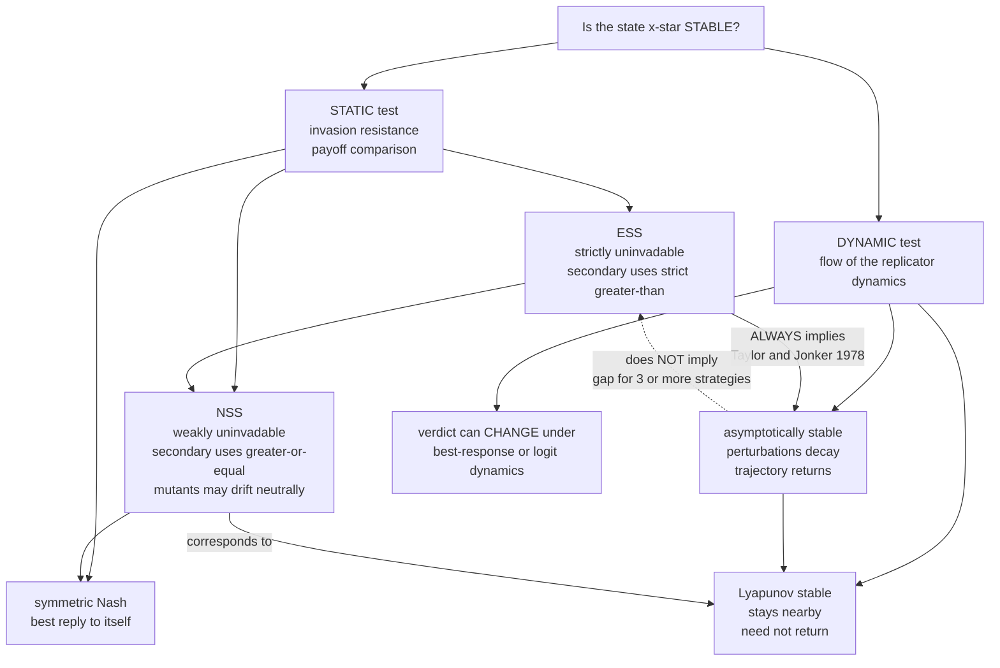

# ⚖️ Evolutionary Stability and Dynamic Stability

> [!abstract] TL;DR
> There are **two different questions** you can ask about whether an evolutionary strategy is "safe." The **static** question (the **ESS** test of Maynard Smith): *could any rare mutant invade it?* The **dynamic** question: *is it an asymptotically stable rest point of the evolutionary dynamics — do small perturbations decay and trajectories return?* The reassuring bridge is a theorem: **every ESS is an asymptotically stable rest point of the replicator dynamics** (Taylor & Jonker, 1978). But the **converse fails** once there are three or more strategies, "dynamic stability" depends on **which dynamics** you assume (replicator vs best-response vs logit), and weaker notions — the **Neutrally Stable Strategy (NSS)**, which matches mere **Lyapunov** stability — sit between ESS and Nash. Knowing *which* kind of stability you have tells you exactly how robust an equilibrium really is.

---

## Intuition

**Analogy:** Imagine you want to know whether a marble resting in a valley is "safe." There are two honest ways to check.

- The **static / structural** check: *nudge it with a single small pebble — the rare mutant — and see whether that one push can dislodge it.* If no single deviant can get a foothold and grow, the resting point is "uninvadable." This is exactly the **ESS** test: compare payoffs and ask whether a rare mutant strategy does strictly worse than the resident.
- The **dynamic** check: *let the whole system drift a little off the resting point and watch the flow.* If the trajectory rolls back down and settles again, the point is an **attractor** — asymptotically stable. This is a statement about the *vector field* of the evolutionary dynamics, not about a payoff comparison.

You would *hope* these two always agree: anything that resists invaders should also pull the population back. For a marble in a simple bowl they do. But in richer landscapes — three or more strategies, or a different "law of motion" for how the population adapts — the two definitions can **come apart**. A resting point can be an attractor of the flow yet *not* uninvadable, or it can be uninvadable-but-only-weakly (a ridge you slide along without falling off). Understanding *exactly when* the static picture and the dynamic picture diverge is one of the subtle beauties of evolutionary game theory.

---

## How It Works

### Two notions of stability

Fix a large, well-mixed population playing a symmetric game with payoff (fitness) matrix `A`. A population state `x` is a probability vector over strategies. The two notions of stability are:

**1. Static — Evolutionarily Stable Strategy (ESS).** `x*` is an ESS if no rare mutant `m` can invade: for every `m != x*`, either `u(x*, x*) > u(m, x*)` (primary), or `u(x*, x*) = u(m, x*)` and `u(x*, m) > u(m, m)` (secondary tie-break). It is a *payoff comparison* — pure algebra, no time, no trajectories. It is the invasion criterion of [[Evolutionarily_Stable_Strategies]].

**2. Dynamic — asymptotically stable rest point.** Endow the population with a **law of motion**, most famously the [[Replicator_Dynamics]]:

```
x_i_dot = x_i * ( (A x)_i  -  x . A x )
```

A rest point `x*` (where `x_dot = 0`) is **asymptotically stable** if every small perturbation *decays* and the trajectory *returns* to `x*`. This is a claim about the flow of a dynamical system — the language of [[Dynamical_Systems_and_Attractors]] and [[Systems_of_ODEs]].

### The key theorem: ESS implies dynamic stability

The **fundamental bridge** (Taylor & Jonker, 1978; Hofbauer & Sigmund, 1998):

> **Every ESS is an asymptotically stable rest point of the replicator dynamics.**

So the *static* invasion criterion is a **sufficient condition** for *dynamic* attraction under replicator selection. The proof uses the relative-entropy / cross-entropy function `H(x) = sum over support of x*_i log of the ratio x*_i over x_i` as a **Lyapunov function**: near an ESS `H` strictly decreases along trajectories, forcing convergence. This is the reassuring result — if you have found an ESS, standard selection will actively **drive the population toward it** and hold it there. Belt and suspenders: safe against invaders *and* an attractor of the flow.

### Where the converse fails

The bridge is a **one-way street** in general. An asymptotically stable rest point of the replicator dynamics need **not** be an ESS.

- For **2-strategy games** the two notions are **equivalent** — ESS iff asymptotically stable. The intuition and the algebra line up perfectly.
- For **3-or-more-strategy games** they **diverge**: Zeeman (1980) constructed replicator systems with rest points that are asymptotically stable yet fail the ESS invasion test. Algebraically, ESS requires the payoff matrix to be **negative definite** on the tangent space (its *symmetric* part must be), whereas asymptotic stability only requires the linearization's **eigenvalues to have negative real part**. A non-normal matrix can have all eigenvalues in the left half-plane while its symmetric part is *indefinite* — attracting, but with a direction of "invadability." So **dynamic stability is strictly weaker than ESS** in general.

### Dynamics-dependence

There is a deeper subtlety hiding in the phrase "*the* dynamics." Stability is a property of a **specific** law of motion. Different plausible adaptation rules — **replicator**, **best-response**, **imitation**, **Brown–von Neumann–Nash**, **smoothed / logit best-response** — can return **different stability verdicts for the same game**. An ESS is asymptotically stable under the replicator dynamics *and* a broad class known as **regular selection dynamics**, but **not universally**. The same equilibrium can be a non-attracting center under replicator yet globally convergent under best-response. So "is it dynamically stable?" is really "dynamically stable *under which adaptation mechanism*?" — a point developed in the note on going *From Classical to Evolutionary Game Theory*.

### The refinement hierarchy and Lyapunov vs asymptotic

Two dynamical-systems distinctions matter:

- **Lyapunov stable** — trajectories that *start* near `x*` *stay* near (they never wander off) but need not converge.
- **Attracting** — trajectories converge to `x*` (but might first stray far).
- **Asymptotically stable** — *both* (stays near AND converges).

The **Neutrally Stable Strategy (NSS)** is the static concept that matches the *middle* case. An NSS resists invasion only **weakly**: the secondary condition uses `>=` instead of `>`, so mutants do not *increase* but may **drift neutrally**. An NSS corresponds to **Lyapunov (neutral) stability** rather than asymptotic stability. This gives the clean inclusion:

> **ESS ⊂ NSS ⊂ symmetric Nash** (statically) — matching — **asymptotically stable ⊂ Lyapunov stable ⊂ rest point** (dynamically).

The interior equilibrium of **Rock–Paper–Scissors** is the textbook NSS: it is Lyapunov-stable (replicator orbits circle it forever on closed loops) but **not attracting** (they never converge) and **not an ESS** — see the sibling note on *Cyclic Dynamics and Rock–Paper–Scissors*.



---

## Key Concepts

### Secondary (school) level

- **Two ways to ask if a habit is safe.** One way: could a single newcomer doing something different take over? If not, the habit is "uninvadable." The other way: if the group drifts a bit off the habit, does it drift back? A truly safe habit passes *both* tests, and usually they agree.
- **Rock–Paper–Scissors never settles.** Its balanced mix is "stable" in the weak sense that it never blows up, but it also never *settles down* — the population endlessly cycles. That is a warning that "safe" has more than one meaning.

### Undergraduate level

- **ESS (static):** for all mutants `m != x*`, `u(x*,x*) > u(m,x*)`, or a tie there plus `u(x*,m) > u(m,m)`. Pure payoff algebra.
- **Asymptotic stability (dynamic):** `x*` is a rest point of the replicator equation and the eigenvalues of the linearized flow (restricted to the simplex tangent space) have **strictly negative real parts**.
- **The theorem:** ESS ⟹ asymptotically stable under replicator. For 2-strategy games the two are **equivalent**; the equivalence breaks for 3+ strategies.
- **NSS:** relax the secondary strict inequality to `>=`. NSS = **Lyapunov** (neutral) stability. Hierarchy: **ESS ⊂ NSS ⊂ Nash**.
- **Lyapunov function:** relative entropy `H(x)` from `x` to an ESS `x*` decreases along replicator trajectories — the analytic engine behind the bridge theorem.

### Graduate level

- **Definiteness vs eigenvalues.** Interior ESS ⟺ the payoff matrix is **negative definite on the tangent space** `T = { xi : sum xi = 0 }`, i.e. `xi . A . xi < 0` for all nonzero `xi` in `T` (only the *symmetric* part matters). Asymptotic stability of the replicator linearization only needs the **eigenvalues** of the projected `A` to have negative real part. Since a real matrix can have left-half-plane eigenvalues with an **indefinite symmetric part** (any strongly non-normal matrix), you get *asymptotically stable but not ESS* — the Zeeman phenomenon.
- **Regular selection dynamics.** ESS ⟹ asymptotic stability holds not just for replicator but for the class of **regular / payoff-monotone selection dynamics** (Hofbauer–Sigmund, Weibull). Outside this class — e.g. certain imitation or best-response variants — the guarantee can weaken, hence **dynamics-dependence**.
- **Best-response vs replicator.** On zero-sum Rock–Paper–Scissors the interior NE is a **replicator center** (Lyapunov, not attracting) but the **continuous best-response dynamics converge** to it: a Lyapunov function (the "value gap" `max_i (Ax)_i - x . A x`) strictly decreases under best response. Same game, same equilibrium, opposite verdict — the sharpest illustration that dynamic stability is a property of the *dynamics*, not only the game.
- **Stochastic refinement.** In **finite** populations with mutation/drift the deterministic dichotomy is replaced by a **probabilistic** one: **stochastic stability** (which states the process occupies most of the time as noise vanishes, Foster–Young / Kandori–Mailath–Rob), **fixation probabilities**, and the risk of drifting out of an NSS's neutral set. An ESS of the deterministic system may still be escaped by a lucky sequence of mutations in a small population — see the sibling notes on *Finite Populations and Stochastic Dynamics* and *Stochastic Evolutionary Dynamics and Fixation*.

---

## Python Demo

```python
# Evolutionary (static) stability vs Dynamic stability.
# We demonstrate, all in one script:
#   (A) ESS  => asymptotically stable under replicator: perturb a known ESS
#       (Hawk-Dove mixed ESS) and watch the population RETURN.
#   (B) CONVERSE FAILS: a 3-strategy game with a rest point that is
#       asymptotically stable under replicator yet is NOT an ESS.
#   (C) NSS: standard Rock-Paper-Scissors interior point is neutrally stable
#       (a replicator CENTER: Lyapunov stable, orbits stay near but never
#       return) and is an NSS, not an ESS.
#   (D) DYNAMICS-DEPENDENCE: the SAME RPS equilibrium is a non-attracting
#       center under replicator but CONVERGES under best-response dynamics.
# numpy + matplotlib only.

import numpy as np
import matplotlib.pyplot as plt

rng = np.random.default_rng(0)


# ---------- dynamics ----------
def replicator_rhs(x, A):
    f = A @ x
    return x * (f - x @ f)                       # x_i (fitness_i - mean fitness)


def best_response_rhs(x, A):
    br = np.zeros_like(x)
    br[np.argmax(A @ x)] = 1.0                    # pure best reply to current state
    return br - x                                 # continuous best-response flow


def integrate(rhs, x0, A, T=20.0, dt=0.005):
    steps = int(T / dt)
    xs = np.empty((steps + 1, len(x0)))
    x = x0.astype(float).copy()
    xs[0] = x
    for k in range(steps):
        k1 = rhs(x, A)
        k2 = rhs(x + 0.5 * dt * k1, A)
        k3 = rhs(x + 0.5 * dt * k2, A)
        k4 = rhs(x + dt * k3, A)
        x = x + (dt / 6.0) * (k1 + 2 * k2 + 2 * k3 + k4)
        x = np.clip(x, 0.0, None)
        x = x / x.sum()                           # stay on the simplex
        xs[k + 1] = x
    return xs


# ---------- stability tests for an INTERIOR uniform rest point ----------
# Tangent space of the simplex: T = { xi : sum(xi) = 0 }. Orthonormal basis:
V = np.array([[1, -1, 0],
              [1, 1, -2]], dtype=float).T
V[:, 0] /= np.linalg.norm(V[:, 0])
V[:, 1] /= np.linalg.norm(V[:, 1])                # V is 3x2


def ess_nss_report(A):
    """Interior ESS  <=>  A negative-definite on T (symmetric part).
       Interior NSS  <=>  A negative-SEMIdefinite on T."""
    symA = 0.5 * (A + A.T)
    m = V.T @ symA @ V                            # 2x2 form on the tangent space
    top = np.linalg.eigvalsh(m).max()            # max of xi.A.xi over unit xi in T
    is_ess = top < -1e-9
    is_nss = top < 1e-9
    return is_ess, is_nss, top


def dynamic_report(A, xstar):
    """Eigenvalues of the replicator linearization on the tangent space."""
    n = len(xstar)
    J = np.empty((n, n))
    h = 1e-6
    for j in range(n):
        e = np.zeros(n); e[j] = h
        J[:, j] = (replicator_rhs(xstar + e, A) - replicator_rhs(xstar - e, A)) / (2 * h)
    ev = np.linalg.eigvals(V.T @ J @ V)          # reduce to the 2 meaningful modes
    return ev, np.all(ev.real < -1e-9)


# ================= GAME (A): Hawk-Dove, mixed ESS at p* = V/C =================
Vv, Cc = 2.0, 4.0
HD = np.array([[(Vv - Cc) / 2, Vv],
               [0.0, Vv / 2]])                    # rows/cols: Hawk, Dove
p_star = Vv / Cc                                  # = 0.5  (the ESS Hawk fraction)

# perturb the ESS several ways and integrate the (2-strategy) replicator dynamics
starts_HD = [np.array([0.15, 0.85]), np.array([0.85, 0.15]), np.array([0.5, 0.5])]
traj_HD = [integrate(replicator_rhs, s, HD, T=15, dt=0.005)[:, 0] for s in starts_HD]

# ============ GAME (B): asymptotically stable but NOT an ESS (n=3) ============
# Build A so that, on the tangent space, the replicator linearization acts like
# B = [[-1, 5], [-2, -1]] : eigenvalues -1 +/- i*sqrt(10) (spiral IN, stable),
# but B's symmetric part [[-1,1.5],[1.5,-1]] is INDEFINITE (eig 0.5, -3) => not ESS.
e1 = np.array([1, -1, 0]) / np.sqrt(2)
e2 = np.array([1, 1, -2]) / np.sqrt(6)
e3 = np.array([1, 1, 1]) / np.sqrt(3)
Q = np.column_stack([e1, e2, e3])
B = np.array([[-1.0, 5.0],
              [-2.0, -1.0]])
A_Q = np.zeros((3, 3))
A_Q[:2, :2] = B                                  # act as B on T, kill the e3 axis
NOTESS = Q @ A_Q @ Q.T                            # row sums 0 -> uniform is a rest point
xstar = np.array([1, 1, 1]) / 3.0
traj_B = integrate(replicator_rhs, xstar + np.array([0.06, -0.04, -0.02]), NOTESS, T=18)

# ================= GAME (C)/(D): standard zero-sum Rock-Paper-Scissors ========
RPS = np.array([[0.0, -1.0, 1.0],
                [1.0, 0.0, -1.0],
                [-1.0, 1.0, 0.0]])                # R beats S, etc.
x0_rps = np.array([0.6, 0.3, 0.1])
traj_rep = integrate(replicator_rhs, x0_rps, RPS, T=40)          # a CENTER (cycles)
traj_br = integrate(best_response_rhs, x0_rps, RPS, T=40)        # CONVERGES to center

# ---------------------------- numerical verdicts ----------------------------
print("== (A) Hawk-Dove mixed ESS p* =", p_star, "==")
print("   ESS/NSS on T:", ess_nss_report(HD)[:2], " (2-strategy: ESS <=> stable)")
print()
print("== (B) constructed 3-strategy game ==")
ess_B, nss_B, top_B = ess_nss_report(NOTESS)
ev_B, stab_B = dynamic_report(NOTESS, xstar)
print("   ESS? ", ess_B, "  (max xi.A.xi on T =", round(top_B, 3), "> 0 -> invadable)")
print("   asymptotically stable? ", stab_B, "  Jacobian eigenvalues:", np.round(ev_B, 3))
print("   -> ATTRACTING BUT NOT AN ESS: the converse of the theorem fails.")
print()
print("== (C) Rock-Paper-Scissors interior point [1/3,1/3,1/3] ==")
ess_R, nss_R, top_R = ess_nss_report(RPS)
ev_R, stab_R = dynamic_report(RPS, xstar)
print("   ESS?", ess_R, " NSS?", nss_R, " (max xi.A.xi on T =", round(top_R, 3), ")")
print("   Jacobian eigenvalues:", np.round(ev_R, 3), "-> purely imaginary => CENTER")
print("   -> NSS = Lyapunov (neutral) stability, NOT asymptotic.")


# ------------------------------- visualization ------------------------------
def to_xy(X):
    """barycentric 3-vector(s) -> 2D triangle coordinates."""
    X = np.atleast_2d(X)
    return np.column_stack([X[:, 1] + 0.5 * X[:, 2],
                            (np.sqrt(3) / 2) * X[:, 2]])


def draw_triangle(ax, labels=("R", "P", "S")):
    corners = to_xy(np.eye(3))
    tri = np.vstack([corners, corners[0]])
    ax.plot(tri[:, 0], tri[:, 1], color="0.6", lw=1)
    for c, lab in zip(corners, labels):
        ax.annotate(lab, c, ha="center", va="center", fontsize=9,
                    xytext=(0, 0), textcoords="offset points")
    ax.set_xticks([]); ax.set_yticks([])
    ax.set_aspect("equal"); ax.axis("off")


fig, axs = plt.subplots(2, 2, figsize=(12, 10))

# (A) ESS is asymptotically stable: every perturbation returns to p* = 0.5
axA = axs[0, 0]
t = np.linspace(0, 15, traj_HD[0].size)
for h in traj_HD:
    axA.plot(t, h, lw=2)
axA.axhline(p_star, color="k", ls="--", lw=1, label="ESS  p* = 0.5")
axA.set_title("(A) ESS => asymptotically stable\nHawk-Dove: perturbations RETURN")
axA.set_xlabel("time"); axA.set_ylabel("Hawk fraction"); axA.legend(); axA.set_ylim(0, 1)

# (B) asymptotically stable but NOT an ESS: trajectory spirals IN to center
axB = axs[0, 1]
draw_triangle(axB, labels=("1", "2", "3"))
xy = to_xy(traj_B)
axB.plot(xy[:, 0], xy[:, 1], color="crimson", lw=1.2)
axB.scatter(*to_xy(xstar)[0], color="k", zorder=5)
axB.scatter(*xy[0], color="crimson", marker="o", s=40, zorder=5)
axB.set_title("(B) Spirals IN = asymptotically stable\nyet invasion test says NOT an ESS")

# (C) NSS / replicator CENTER: closed orbit, stays near but never returns
axC = axs[1, 0]
draw_triangle(axC)
xy = to_xy(traj_rep)
axC.plot(xy[:, 0], xy[:, 1], color="teal", lw=1.2)
axC.scatter(*to_xy(xstar)[0], color="k", zorder=5)
axC.set_title("(C) NSS: replicator CENTER on RPS\nLyapunov stable, NOT attracting")

# (D) dynamics-dependence: same RPS, best-response CONVERGES
axD = axs[1, 1]
draw_triangle(axD)
xy_r = to_xy(traj_rep); xy_b = to_xy(traj_br)
axD.plot(xy_r[:, 0], xy_r[:, 1], color="teal", lw=1.0, label="replicator (cycles)")
axD.plot(xy_b[:, 0], xy_b[:, 1], color="darkorange", lw=1.4, label="best-response (converges)")
axD.scatter(*to_xy(xstar)[0], color="k", zorder=5)
axD.set_title("(D) DYNAMICS-DEPENDENCE on RPS\nsame equilibrium, opposite verdict")
axD.legend(loc="upper right", fontsize=8)

plt.tight_layout()
plt.savefig("ess_vs_dynamic_stability.png", dpi=120)
print("\nsaved ess_vs_dynamic_stability.png")
```

**What the output shows.**
- **(A)** Every perturbed start of Hawk-Dove flows back to the mixed ESS `p* = 0.5`: an ESS *is* an asymptotically stable attractor of the replicator dynamics — the Taylor–Jonker bridge in action.
- **(B)** The constructed 3-strategy game has a uniform rest point whose replicator linearization has eigenvalues `-1 +/- i*sqrt(10)` (negative real part, so the trajectory **spirals inward** and the state is **asymptotically stable**), yet the invasion test finds a direction with `xi . A . xi > 0` (`max = 0.5`), so it is **not an ESS**. The converse of the theorem genuinely fails for three or more strategies.
- **(C)** Standard RPS: the interior point has purely imaginary eigenvalues (`max xi.A.xi on T = 0`), so it is an **NSS but not an ESS**, and the replicator orbit is a **closed loop** — Lyapunov (neutrally) stable but never converging: **not** asymptotically stable.
- **(D)** The *same* RPS equilibrium that only cycles under replicator **converges** under continuous best-response — proof that "dynamically stable" is a statement about the *adaptation rule*, not the game alone.

---

## Real-World Applications

> **Example — robustness auditing of an equilibrium (biology, economics, protocols):** When a biologist claims a sex ratio, a signalling code, or a mixed foraging strategy is "stable," the *kind* of stability matters. An **ESS** guarantees the trait survives both a lone mutant *and* standard selection pressure — the strongest claim. A trait that is merely **dynamically stable under replicator** might still be **invadable** under a different learning or migration process. Distinguishing the two is exactly what separates a robust prediction from a fragile one.

- **Multi-agent learning and MARL.** Convergence of learning dynamics (replicator, cross-learning, regret matching, fictitious play) to an equilibrium is a *dynamic*-stability question, and the answer is **algorithm-dependent** — the same game can converge under one learning rule and cycle under another, mirroring exactly the replicator-vs-best-response contrast on RPS.
- **Cancer and antibiotic dynamics.** Whether a drug-sensitive cell population is a *stable buffer* against resistant invaders depends on both invasion resistance (ESS) and the actual eco-evolutionary flow under a dosing schedule; adaptive-therapy protocols are engineered so the desired composition is an *attractor*, not just uninvadable on paper.
- **Social conventions and norm design.** A convention (currency, standard, driving side) that is a **pure ESS** self-enforces against single defectors; but designers of digital protocols and mechanisms must also check it is an **attractor** of the actual update dynamics agents use, since a merely Lyapunov-stable (NSS) norm can slowly **drift** away under neutral mutation — the finite-population concern.
- **Ecology and coexistence.** Whether a polymorphic mix of species/strategies persists (asymptotic stability), merely oscillates (Lyapunov center, like predator-prey and RPS-type bacterial systems), or collapses is precisely the static-vs-dynamic distinction applied to community assembly.

---

## Common Pitfalls

- **"Asymptotically stable therefore ESS."** False for three or more strategies. Dynamic stability is *weaker* than ESS in general (the Zeeman phenomenon). A spiral-in attractor can still have an "invadable" direction because attraction needs only negative-real-part eigenvalues, while ESS needs a negative-*definite* payoff form.
- **"ESS therefore stable under any reasonable dynamics."** ESS guarantees asymptotic stability under **replicator and regular selection dynamics**, not universally. Best-response, imitation, and logit dynamics can behave differently — always name the dynamics.
- **"Lyapunov stable = asymptotically stable."** No. Lyapunov = *stays near*; asymptotic = *stays near AND returns*. The RPS center is Lyapunov-stable but not attracting — orbits circle forever without converging. This is exactly the ESS-vs-NSS gap in dynamical language.
- **"NSS is basically an ESS."** An NSS only *weakly* resists invasion; neutral mutants can drift. In a finite population that neutral drift becomes a real escape route (nonzero fixation probability), so an NSS is materially less robust than an ESS.
- **"A rest point is automatically stable."** Rock-Paper-Scissors' interior point is a Nash equilibrium and a rest point, yet under a *destabilized* variant (positive diagonal) it repels and the population spirals out to a heteroclinic cycle. Being a rest point says nothing about stability by itself.
- **"Deterministic stability settles the question."** In small populations, drift and mutation make stability **probabilistic** — stochastic stability and fixation probabilities can overturn the deterministic verdict.

---

## Related Concepts

- [[Evolutionarily_Stable_Strategies]] — the *static* invasion criterion this note contrasts with dynamic stability; the ESS is exactly the strong end of the hierarchy.
- [[Replicator_Dynamics]] — the canonical *dynamic* law of motion under which every ESS becomes an asymptotically stable attractor (the Taylor–Jonker bridge).
- [[Nash_Equilibrium]] — the outer layer of the static hierarchy: **ESS ⊂ NSS ⊂ Nash**; ESS and NSS are refinements that add stability.
- [[Evolutionary_Stable_Strategies]] — the Game Theory vault's algebraic treatment (Bishop–Cannings, definiteness-on-the-tangent-space characterization) that underpins the ESS-vs-eigenvalue distinction.
- [[Mixed_Strategies]] — the machinery behind interior/mixed equilibria whose stability we test both statically and dynamically.
- [[Dynamical_Systems_and_Attractors]] — the general theory of rest points, attractors, Lyapunov vs asymptotic stability that the "dynamic" notion draws on directly.
- [[Systems_of_ODEs]] — linearization, Jacobians, and eigenvalue criteria for stability of rest points, used to test asymptotic stability of the replicator flow.
- [[Eigenvalues_and_Eigenvectors]] — the negative-real-part eigenvalue test for asymptotic stability vs the negative-*definite* test for ESS: the exact algebraic source of the gap.
- [[Evolutionary_Dynamics_and_Fitness_Landscapes]] — invasion, attraction, and drift viewed as motion on adaptive landscapes.
- [[Bifurcations_and_Tipping_Points]] — how tuning a payoff parameter flips a rest point between stable, center, and unstable — the dynamics-dependence made continuous.
- [[Chaos_Theory_and_Sensitive_Dependence]] — richer non-convergent evolutionary dynamics (cycles and chaos) that lie beyond both ESS and simple asymptotic stability.

*Sibling notes in this Evolutionary Game Theory vault — `Evolutionary_Game_Theory_Overview` (exists) plus the still-to-be-written `From_Classical_to_Evolutionary_Game_Theory`, `Replicator_Dynamics_and_Fixed_Points`, `The_Folk_Theorem_of_EGT`, `Cyclic_Dynamics_and_Rock_Paper_Scissors`, `Finite_Populations_and_Stochastic_Dynamics`, `Stochastic_Evolutionary_Dynamics_and_Fixation`, and `Adaptive_Dynamics_and_Evolutionary_Branching` — each connect to this static-vs-dynamic distinction and will link back here.*

---

## Review Questions

1. **(Secondary)** Describe, in plain words, the *two different questions* you can ask about whether an evolutionary strategy is "safe," and give one everyday reason they might give different answers.
2. **(Undergraduate)** State the Taylor–Jonker theorem relating ESS to the replicator dynamics. For a two-strategy game, argue why ESS and asymptotic stability are *equivalent*. Then explain what an NSS is and why it corresponds to Lyapunov (not asymptotic) stability, using Rock–Paper–Scissors as the example.
3. **(Graduate — scenario)** You are handed a three-strategy game whose interior rest point is asymptotically stable under the replicator dynamics. (a) Explain, in terms of the *symmetric part* of the payoff matrix versus the *eigenvalues* of the linearization, how this state can still fail to be an ESS. (b) Your colleague then switches the model to continuous best-response dynamics and observes different behaviour. What does this tell you about the phrase "the equilibrium is dynamically stable," and how would you report your stability conclusion honestly?

---

## Sources

- Taylor, P. D. & Jonker, L. B. (1978). "Evolutionary Stable Strategies and Game Dynamics." *Mathematical Biosciences* 40, 145–156.
- Hofbauer, J. & Sigmund, K. (1998). *Evolutionary Games and Population Dynamics.* Cambridge University Press.
- Zeeman, E. C. (1980). "Population Dynamics from Game Theory." In *Global Theory of Dynamical Systems*, Lecture Notes in Mathematics 819, Springer, 471–497.
- Weibull, J. W. (1995). *Evolutionary Game Theory.* MIT Press.
- Sandholm, W. H. (2010). *Population Games and Evolutionary Dynamics.* MIT Press.

---

#evolutionary-game-theory #ess #asymptotic-stability #dynamic-stability #neutrally-stable
