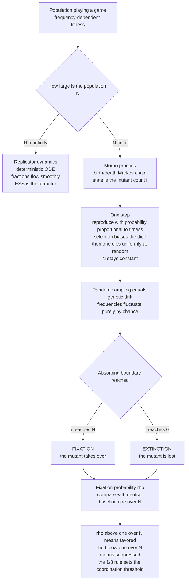

# 🎲 Finite Populations and Stochastic Evolutionary Dynamics

> [!abstract] TL;DR
> The smooth **replicator dynamics** assume an **infinite** population where strategy fractions flow deterministically. Real populations are **finite**, so **chance matters**: random sampling — **genetic drift** — means a superior strategy can vanish by bad luck and an inferior one can take over by a lucky streak. The canonical finite-population model is the **Moran process**: a fixed population of `N` individuals where, each step, one individual reproduces (with probability proportional to **fitness** — selection) and one dies at random, giving a **birth-death Markov chain**. The central quantity is no longer "can it invade?" but the **fixation probability** `ρ` — the chance a single mutant eventually takes over the whole population. Selection shifts `ρ` above or below the **neutral baseline `1/N`**, and finite-population results (the **1/3 rule**, weak selection, stochastic stability) change what counts as "stable" — especially for the evolution of **cooperation**.

---

## Intuition

**Analogy:** Flip a fair coin ten times and you can easily get ten heads — small samples are ruled by luck, not by the true 50/50 odds. Evolution in a **finite** population is the same: with only `N` individuals, *who happens to reproduce* this generation is partly a roll of the dice. A strategy that is genuinely *better* is like a very slightly loaded coin — it tips the odds, but a slightly loaded coin can still come up tails ten times in a row and lose. So a beneficial mutant can vanish by bad luck, and a mildly harmful one can spread by a lucky streak.

The deterministic replicator equation is the mathematical fiction that you flipped the coin *infinitely* many times, so the fractions came out exactly at the true probabilities with no wobble. Drop that fiction and evolution becomes **a game of dice as well as skill**: "which strategy wins" stops being a certainty and becomes a **probability**. The Moran process is the honest bookkeeping of that dice game — it tracks the population one birth-and-death at a time, letting selection bias the dice without ever removing the randomness.

---

## How It Works

### Core Mechanics

Take a population of exactly `N` individuals, each playing one of two strategies, **A** (a rare *mutant*) or **B** (the *resident*). Let `i` be the number of A-players; the whole state of the system is that single number, moving on the ladder `0, 1, 2, …, N`.

1. **Frequency-dependent fitness.** Because payoffs come from a *game*, each type's fitness depends on the current mix. With `i` copies of A, the average payoff to an A-player is `π_A(i) = [a(i-1) + b(N-i)] / (N-1)` and to a B-player `π_B(i) = [c·i + d(N-i-1)] / (N-1)`, using payoff matrix rows `[a, b]` and `[c, d]`. Fitness is a linear map `f = 1 - w + w·π`, where **`w` is the selection strength** (`w → 0` is neutral, `w = 1` is strong selection).
2. **One Moran step = one birth-death event.** Choose one individual to **reproduce**, with probability proportional to its fitness — this is where **selection** enters, biasing the dice toward fitter types. Then choose one individual to **die**, uniformly at random. The offspring replaces the dead one, so `N` stays exactly constant. The count `i` moves up by one, down by one, or stays put.
3. **A birth-death Markov chain.** The up- and down-probabilities are `T⁺(i) = [f_A·i / (f_A·i + f_B·(N-i))] · (N-i)/N` and `T⁻(i) = [f_B·(N-i) / (f_A·i + f_B·(N-i))] · i/N`. Conditioning on a *change* of state, the chance A increases is simply `f_A / (f_A + f_B)` — a biased random walk on the ladder.
4. **Absorbing boundaries.** The states `i = 0` (mutant **extinct**) and `i = N` (mutant **fixed**) are absorbing: once there, the process is stuck. Every run ends in one or the other. **Genetic drift** is exactly this random walk — frequencies fluctuate by chance, and in a small population that noise can overwhelm the small fitness bias.
5. **Fixation probability replaces invasion.** The key output is `ρ_A`, the probability that a walk starting at `i = 1` (a *single* mutant) reaches `i = N`. It has an exact closed form from the birth-death chain: `ρ_A = 1 / (1 + Σ_{k=1}^{N-1} Π_{j=1}^{k} γ_j)` with `γ_j = T⁻(j)/T⁺(j) = f_B(j)/f_A(j)`. For a **neutral** mutant (`w = 0`, all `γ = 1`) this collapses to `ρ = 1/N`. Selection pushes `ρ` above `1/N` (favored) or below it (suppressed).

### The finite-population stability criterion

In infinite populations, an [[Evolutionarily_Stable_Strategies|ESS]] is *uninvadable*. In finite populations that must be redefined (Nowak's **ESS_N**): a mutant is **favored by selection** when its fixation probability *exceeds* the neutral `1/N`, and a resident is stable when mutants have `ρ < 1/N`. This yields the celebrated **1/3 rule**: in a bistable coordination-type game with an interior *unstable* equilibrium at fraction `x*`, under weak selection and large `N`, strategy A is favored to replace B exactly when `x* < 1/3` — a threshold strictly different from the deterministic basin-of-attraction boundary at `1/2`.

### Flow / Architecture



---

## Key Concepts

### Secondary (school) level

- **The idea in one line:** in a *small* group, luck decides as much as merit. A slightly better habit can die out because the person who had it got unlucky, and a slightly worse habit can spread because its user got lucky — just like a fair coin can land heads ten times in a row.
- **Fixation = takeover.** The big question is: if *one* person starts doing something new, what is the chance the *whole* group ends up doing it? That chance is the **fixation probability**. If everyone were identical (no advantage), the chance is just `1/N` — one in `N`, the same as any random person.
- **Drift vs selection.** In a huge population the better strategy almost always wins (selection). In a tiny population, random chance (drift) can drown that out.

### Undergraduate level

- **The Moran process.** A fixed-size `N` birth-death chain on the mutant count `i ∈ {0,…,N}`. Each step: reproduce ∝ fitness, die uniformly. States `0` and `N` are absorbing. This is the discrete, stochastic counterpart to the continuous, deterministic [[Replicator_Dynamics|replicator equation]] — and the replicator equation is recovered as the `N → ∞` deterministic limit.
- **Fixation formula.** `ρ_A = 1 / (1 + Σ_{k=1}^{N-1} Π_{j=1}^{k} γ_j)`, `γ_j = f_B(j)/f_A(j)`. For *constant* relative fitness `r` (frequency-independent), this simplifies to the Kimura/gambler's-ruin result `ρ = (1 - 1/r) / (1 - 1/r^N)`. Neutral case: `ρ = 1/N`.
- **What drift does.** A beneficial mutant (`r > 1`) is *not* guaranteed to fix — for a `1%` advantage, `ρ ≈ 2%` for a fresh mutant, so it is lost ~98% of the time. A deleterious mutant (`r < 1`) has a *small but nonzero* fixation chance. This is the core lesson: **selection changes the odds, it does not dictate the outcome.**
- **Connection to population genetics.** These are exactly the objects of [[Population_Genetics_and_Hardy_Weinberg|Wright-Fisher / Moran population genetics]] — allele frequencies, effective population size, and Kimura's diffusion — now with *game-derived, frequency-dependent* fitness. EGT in finite populations is population genetics with an interaction structure.

### Graduate level

- **Weak selection and the diffusion limit.** The tractable middle ground is **weak selection**, `w ≪ 1` (fitness differences small relative to `1/N`). Here the discrete chain converges to a **diffusion approximation** — a stochastic differential equation (a drift term from selection plus a `√(x(1-x)/N)` noise term from sampling) closely related to [[Brownian_Motion|Brownian motion]]. Most closed-form EGT results about cooperation (e.g. `b/c > N` type conditions on structured populations) are derived in this regime.
- **ESS_N and the 1/3 rule.** Nowak, Sasaki, Taylor & Fudenberg (2004) showed the ESS concept splits in finite `N` into two independent conditions: (i) the resident is a Nash-like best reply, and (ii) mutants have `ρ < 1/N`. For a 2×2 coordination game, condition (ii) under weak selection and large `N` becomes `a + 2b > c + 2d`, equivalently the interior unstable equilibrium sits at `x* < 1/3`. The deterministic threshold `1/2` and the stochastic threshold `1/3` genuinely disagree — a signature finite-population effect.
- **Mutation, stationary distributions, and stochastic stability.** Add a small **mutation** rate and fixation is no longer permanent — the system reaches a **stationary distribution** over states. In the low-mutation limit the dynamics jump between the pure fixation states, and the relevant equilibrium concept becomes **stochastic stability** (Foster & Young): which state the system spends *most of its time* in as noise `→ 0`. This is the long-run answer to "which convention wins" and underlies analyses of the evolution of norms and conventions.
- **Population structure amplifies or suppresses selection.** On a well-mixed population the Moran fixation formula is fixed, but on a **graph** the same mutant can have a dramatically different `ρ`. Lieberman, Hauert & Nowak (2005) proved some graphs are **amplifiers of selection** (star graphs push `ρ` toward the advantageous limit) and others **suppressors**. Structure is thus a first-class lever on evolutionary outcomes — the finite/stochastic foundation for realistic cooperation theory (spatial reciprocity, network reciprocity).

---

## Python Demo

```python
# FINITE-POPULATION EVOLUTIONARY DYNAMICS via the MORAN PROCESS.
# We (1) run the frequency-dependent Moran birth-death chain,
# (2) MEASURE the fixation probability by simulation and check it against
#     the exact birth-death formula and the neutral baseline 1/N, and
# (3) demonstrate four finite-population effects:
#     (a) a beneficial mutant is often LOST to drift,
#     (b) a deleterious mutant sometimes FIXES,
#     (c) how selection strength and population size N shift the odds,
#     (d) the 1/3 rule for a bistable coordination game.

import numpy as np
import matplotlib.pyplot as plt

rng = np.random.default_rng(7)


# ---- game -> fitness ------------------------------------------------------
# Payoff matrix M = [[a, b], [c, d]] : row = focal strategy, col = opponent.
# Strategy A (mutant) = index 0, strategy B (resident) = index 1.
# With i copies of A in a population of N, average payoff to each type
# (a focal individual does NOT play against itself):
def avg_payoffs(i, N, M):
    a, b = M[0]
    c, d = M[1]
    piA = (a * (i - 1) + b * (N - i)) / (N - 1)
    piB = (c * i + d * (N - i - 1)) / (N - 1)
    return piA, piB


# Fitness is the linear map  f = 1 - w + w * payoff.
# w in [0, 1] is the SELECTION STRENGTH: w -> 0 is neutral (pure drift),
# w = 1 is strong selection.
def fitnesses(i, N, M, w):
    piA, piB = avg_payoffs(i, N, M)
    return 1 - w + w * piA, 1 - w + w * piB


# ---- embedded birth-death chain ------------------------------------------
# In the Moran process one individual reproduces (probability proportional to
# fitness) and one dies (uniform). CONDITIONING on a state change, the chance
# the number of A goes up is exactly f_A / (f_A + f_B) -> a biased walk.
def p_up(i, N, M, w):
    fA, fB = fitnesses(i, N, M, w)
    return fA / (fA + fB)


# ---- exact fixation probability of a single A mutant ----------------------
# rho_A = 1 / (1 + sum_{k=1..N-1} prod_{j=1..k} (T-_j / T+_j)),
# where T-_j / T+_j = f_B(j) / f_A(j).
def fixation_exact(N, M, w):
    total, prod = 0.0, 1.0
    for k in range(1, N):
        fA, fB = fitnesses(k, N, M, w)
        prod *= fB / fA
        total += prod
    return 1.0 / (1.0 + total)


# ---- simulate the Moran chain --------------------------------------------
def moran_run(N, M, w, i0=1, record=False):
    i = i0
    path = [i]
    while 0 < i < N:
        i += 1 if rng.random() < p_up(i, N, M, w) else -1
        if record:
            path.append(i)
    return i == N, path                       # fixed? , trajectory


def sim_fixation(N, M, w, i0=1, trials=2000):
    fixed = sum(moran_run(N, M, w, i0)[0] for _ in range(trials))
    return fixed / trials


# =========================================================================
fig, ax = plt.subplots(2, 2, figsize=(13, 9))

# ---- Panel (a): trajectories of a slightly beneficial mutant -------------
N = 100
r = 1.10                                       # a 10% fitness advantage
Mc = np.array([[r, r], [1.0, 1.0]])            # frequency-INDEPENDENT: fA=r, fB=1
n_traj, fixed_count = 40, 0
for _ in range(n_traj):
    did_fix, path = moran_run(N, Mc, w=1.0, record=True)
    fixed_count += did_fix
    ax[0, 0].plot(path, color="seagreen" if did_fix else "indianred",
                  alpha=0.6, lw=1)
ax[0, 0].axhline(N, color="k", ls=":", lw=0.8)
ax[0, 0].axhline(0, color="k", ls=":", lw=0.8)
ax[0, 0].set_title(f"(a) {n_traj} Moran runs, r={r}, N={N}\n"
                   f"beneficial mutant still LOST in "
                   f"{n_traj - fixed_count} of {n_traj} runs")
ax[0, 0].set_xlabel("birth-death events")
ax[0, 0].set_ylabel("number of mutants i")

# ---- Panel (b): fixation vs selection (constant fitness r) ---------------
N = 30
rs = np.linspace(0.85, 1.20, 8)
sim, exact = [], []
for rr in rs:
    Mr = np.array([[rr, rr], [1.0, 1.0]])
    sim.append(sim_fixation(N, Mr, w=1.0, trials=4000))
    exact.append(fixation_exact(N, Mr, w=1.0))
ax[0, 1].plot(rs, exact, color="navy", lw=2, label="exact formula")
ax[0, 1].scatter(rs, sim, color="orange", zorder=5, label="simulation")
ax[0, 1].axhline(1 / N, color="gray", ls="--", label="neutral 1/N")
ax[0, 1].axvline(1.0, color="k", lw=0.6)
ax[0, 1].set_title("(b) fixation probability vs fitness r\n"
                   "r<1 deleterious can still fix, r>1 can be lost")
ax[0, 1].set_xlabel("relative fitness r of the mutant")
ax[0, 1].set_ylabel("fixation probability")
ax[0, 1].legend()

# ---- Panel (c): fixation vs N for a fixed small advantage ----------------
Ns = np.arange(2, 120)
r_ben, r_del = 1.05, 0.97
fix_ben = [fixation_exact(n, np.array([[r_ben, r_ben], [1, 1]]), 1.0) for n in Ns]
fix_del = [fixation_exact(n, np.array([[r_del, r_del], [1, 1]]), 1.0) for n in Ns]
ax[1, 0].plot(Ns, fix_ben, color="seagreen", lw=2, label=f"beneficial r={r_ben}")
ax[1, 0].plot(Ns, fix_del, color="indianred", lw=2, label=f"deleterious r={r_del}")
ax[1, 0].plot(Ns, 1 / Ns, color="gray", ls="--", label="neutral 1/N")
ax[1, 0].axhline(1 - 1 / r_ben, color="seagreen", ls=":", lw=1,
                 label="large-N limit 1 - 1/r")
ax[1, 0].set_title("(c) selection beats drift as N grows\n"
                   "at small N everything sits near neutral 1/N")
ax[1, 0].set_xlabel("population size N")
ax[1, 0].set_ylabel("fixation probability")
ax[1, 0].legend()

# ---- Panel (d): the 1/3 rule for a bistable coordination game ------------
# Family with interior UNSTABLE equilibrium at x*:  M = [[1, 1-t], [0, 1]],
# with t = x*/(1 - x*). Under weak selection and large N the fixation
# probability crosses the neutral level 1/N exactly at x* = 1/3.
N = 100
w = 0.05
xs = np.linspace(0.05, 0.60, 40)
rho = []
for xstar in xs:
    t = xstar / (1 - xstar)
    M = np.array([[1.0, 1.0 - t], [0.0, 1.0]])
    rho.append(fixation_exact(N, M, w) * N)    # scaled by N -> relative to 1/N
ax[1, 1].plot(xs, rho, color="purple", lw=2)
ax[1, 1].axhline(1.0, color="gray", ls="--", label="neutral level rho = 1/N")
ax[1, 1].axvline(1 / 3, color="crimson", ls=":", lw=1.5, label="x* = 1/3")
ax[1, 1].set_title("(d) the 1/3 rule\n"
                   "mutant favored (rho > 1/N) iff unstable eq x* < 1/3")
ax[1, 1].set_xlabel("location of interior unstable equilibrium x*")
ax[1, 1].set_ylabel("fixation prob / neutral  =  rho * N")
ax[1, 1].legend()

plt.tight_layout()
plt.savefig("moran_fixation.png", dpi=120)
print(f"(a) N=100, r=1.10: mutant fixed in {fixed_count}/{n_traj} runs "
      f"(expected rho ~ {fixation_exact(100, Mc, 1.0):.3f})")
print("saved moran_fixation.png")
```

**What the output shows.** Panel **(a)**: most of the 40 trajectories of a genuinely *beneficial* mutant (`r = 1.10`) still hit `0` and die — its fixation probability is only about `1 - 1/1.1 ≈ 0.09`, so ~90% are lost to drift. Panel **(b)**: the simulated fixation probabilities land right on the exact `(1 - 1/r)/(1 - 1/r^N)` curve; note the curve is *nonzero and above 0* even for `r < 1` (deleterious mutants sometimes fix) and *well below 1* for `r > 1` (beneficial mutants often do not). Panel **(c)**: as `N` grows, selection separates the beneficial curve (toward `1 - 1/r`) from the deleterious one (toward 0), while both collapse onto the neutral `1/N` at small `N` — *drift dominates in small populations, selection in large ones*. Panel **(d)**: the scaled fixation probability crosses the neutral level exactly at `x* = 1/3`, the finite-population invasion threshold that the deterministic replicator dynamics (which uses `1/2`) never sees.

---

## Real-World Applications

> **Example — the evolution of cooperation:** The whole modern theory of when cooperation evolves runs on finite-population fixation analysis. Nowak's `b/c > k` rule for cooperation on networks, "network reciprocity," and adaptive-therapy dosing in cancer are all statements about whether a cooperator (or a drug-sensitive cell) has fixation probability above the neutral `1/N`. The deterministic replicator picture is too coarse to give these conditions.

- **Molecular evolution and drug resistance.** The spread of a resistance allele through a finite bacterial or tumour-cell population is a Moran/Wright-Fisher fixation problem; effective population size `N_e` directly controls whether a resistant mutant is likely to fix or be purged — the same mathematics as [[Natural_Selection_Genetic_Drift_and_Bottlenecks|genetic drift and bottlenecks]].
- **Cultural and technology adoption.** "Fixation probability" is literally the **adoption probability** of a new behaviour, norm, or technology introduced by a single agent. Small communities show more path-dependence and lock-in (drift), large markets are more selection-driven — and network structure (amplifiers/suppressors) predicts which innovations go viral.
- **Evolutionary algorithms and multi-agent learning (CS).** Genetic algorithms and evolutionary strategies run *finite* populations, so **premature convergence** and loss of good solutions are drift, not a bug — the same `1/N` intuition tells you when population size is too small for selection to work. Stochastic finite-population dynamics also model realistic multi-agent reinforcement-learning systems where a beneficial strategy may not take over deterministically.
- **Conservation biology.** For an endangered species, whether a favourable variant survives is governed by `N_e`; small populations lose adaptive variation to drift, which is why effective population size is a central conservation metric.

---

## Common Pitfalls

- **"A beneficial mutant will spread."** No. Its fixation probability for a fresh single mutant is roughly `2s` for a small selective advantage `s` (not `1`), so a `1%`-better strategy is lost ~98% of the time. Selection changes odds, it does not guarantee outcomes — the single most common misreading of "survival of the fittest."
- **"Only the fitter strategy can take over."** A *deleterious* mutant has a small but strictly positive fixation probability; in a small enough population it fixes with meaningful probability. Drift can carry a worse strategy to victory.
- **"The finite answer converges to the replicator answer."** Only as `N → ∞` *and* only for the deterministic content. The **thresholds differ** at finite `N`: the 1/3 rule versus the deterministic 1/2, and stochastic stability can select a *different* equilibrium than any replicator basin analysis.
- **"Fixation is the end of the story."** With mutation there is no permanent fixation — the right object is the **stationary distribution** and **stochastic stability**, not a single absorbing state.
- **"Neutral means nothing happens."** Neutral drift is highly consequential: it still fixes variants (at rate `1/N` per mutant), and the neutral `1/N` is the *baseline every selection claim is measured against*. Forgetting the `1/N` yardstick makes weak selection look like no selection.
- **"Well-mixed results carry over to structured populations."** Population structure can turn a suppressor into an amplifier of selection, changing fixation probabilities by large factors. The well-mixed Moran formula is a special case, not the general answer.

---

## Related Concepts

- [[Replicator_Dynamics]] — the deterministic, infinite-population limit; the Moran process is its stochastic finite-`N` counterpart, and the replicator ODE reappears as `N → ∞`.
- [[Evolutionarily_Stable_Strategies]] — the static invasion criterion for infinite populations; fixation probability (and Nowak's ESS_N with the 1/3 rule) is its finite-population replacement.
- [[Natural_Selection_Genetic_Drift_and_Bottlenecks]] — the Genetics-vault treatment of drift, selection, and effective population size that this note imports into game theory.
- [[Population_Genetics_and_Hardy_Weinberg]] — the Wright-Fisher / Hardy-Weinberg machinery; finite-population EGT is population genetics with frequency-dependent, game-derived fitness.
- [[Population_Genetics]] — the Biology-vault overview of allele-frequency change under selection and drift.
- [[Markov_Chains]] — the birth-death Markov chain is the mathematical skeleton of the Moran process; fixation probability is a first-passage / absorption probability.
- [[Probability_Theory]] — the sampling, expectations, and absorption probabilities underlying every claim here.
- [[Brownian_Motion]] — the diffusion approximation that makes weak-selection EGT analytically tractable.
- [[Cooperation_and_Evolutionary_Game_Theory]] — cooperation conditions (network reciprocity, `b/c` rules) are derived precisely as finite-population fixation results.
- [[Nash_Equilibrium]] — the classical solution concept whose evolutionary refinements are reinterpreted here through fixation probabilities.

*Companion Evolutionary Game Theory notes still to be written link back here: `Stochastic_Evolutionary_Dynamics_and_Fixation` (the exact fixation formula and Kimura diffusion), `Evolutionary_Stability_and_Dynamic_Stability` (ESS vs replicator vs ESS_N), `The_Prisoners_Dilemma_and_Cooperation`, `Evolutionary_Dynamics_on_Graphs` (amplifiers and suppressors of selection), `Kin_Selection_and_Inclusive_Fitness` (weak-selection cooperation conditions), `The_Evolution_of_Conventions_and_Norms` (stochastic stability), and `Evolutionary_Game_Theory_and_Machine_Learning`.*

---

## Review Questions

1. **(Secondary)** Using the coin-flip analogy, explain why a strategy that is genuinely *better* can still disappear from a small population, and why the same strategy would almost certainly take over an enormous one. What everyday quantity plays the role of "how loaded the coin is"?
2. **(Undergraduate)** Write down the fixation probability of a single mutant with constant relative fitness `r` in a Moran population of size `N`. Show it reduces to `1/N` when `r = 1`, and use it to argue that (a) a mutant with `r = 1.02` fixes only about 4% of the time and (b) a mutant with `r = 0.99` still has a nonzero fixation probability. What single quantity is the "neutral baseline" every selection claim is compared against?
3. **(Graduate — scenario)** You analyse a bistable 2×2 coordination game and find the deterministic replicator basin boundary at `x* = 0.40`, so strategy A's basin is smaller than B's. A colleague concludes A cannot spread. Using the 1/3 rule (weak selection, large `N`), explain why A is in fact *favoured* by selection in a finite population, why the stochastic threshold (1/3) differs from the deterministic one (1/2), and how adding mutation would reframe the question in terms of stochastic stability rather than fixation.

---

## Sources

- Nowak, M. A., Sasaki, A., Taylor, C. & Fudenberg, D. (2004). "Emergence of cooperation and evolutionary stability in finite populations." *Nature* 428, 646–650. (Introduces ESS_N and the 1/3 rule.)
- Nowak, M. A. (2006). *Evolutionary Dynamics: Exploring the Equations of Life.* Harvard University Press. (Ch. 6–7: Moran process and finite-population game dynamics.)
- Moran, P. A. P. (1958). "Random processes in genetics." *Mathematical Proceedings of the Cambridge Philosophical Society* 54(1), 60–71.
- Traulsen, A. & Hauert, C. (2009). "Stochastic evolutionary game dynamics." In *Reviews of Nonlinear Dynamics and Complexity* (ed. H. G. Schuster), Wiley-VCH.
- Lieberman, E., Hauert, C. & Nowak, M. A. (2005). "Evolutionary dynamics on graphs." *Nature* 433, 312–316. (Amplifiers and suppressors of selection.)
- Ewens, W. J. (2004). *Mathematical Population Genetics I: Theoretical Introduction.* Springer. (Fixation probabilities and Kimura's diffusion approximation.)

---

#evolutionary-game-theory #moran-process #fixation-probability #genetic-drift #finite-populations
