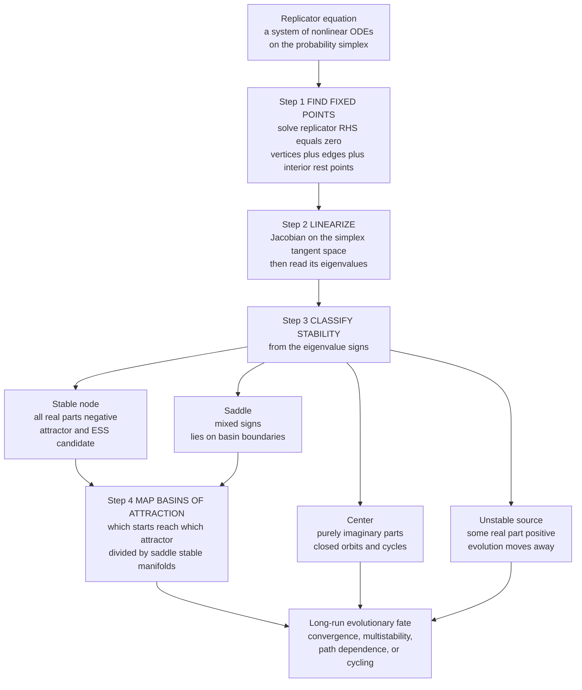

# 🎯 Replicator Dynamics and Fixed Points

> [!abstract] TL;DR
> The [[Replicator_Dynamics|replicator equation]] is a **system of nonlinear ODEs on the probability simplex**, so the entire toolkit of dynamical-systems theory applies to it. To predict where evolution ends up you (1) **find the fixed points** — rest states where every strategy frequency stops changing (always the **vertices** where one strategy is at 100%, plus possibly **interior** mixed rest points where all present strategies have equal fitness), by solving the replicator right-hand side equal to zero; (2) **linearize** at each one — build the **Jacobian** and read its **eigenvalues** (all negative real parts means **asymptotically stable / attracting**, any positive part means **unstable / repelling**, mixed signs means a **saddle**, purely imaginary means a **center** with closed orbits); and (3) **map the basins of attraction** — when several attractors coexist (as in a coordination game with two pure ESS), the simplex splits into regions whose destiny depends on the **initial condition**, separated by the stable manifold of a saddle. This analysis is the master method for the whole field: it locates the Nash/ESS candidates, certifies which are actually reachable, explains **multistability, path-dependence, and lock-in**, and distinguishes convergence from cycling — and it ties the *static* notion of an [[Evolutionary_Stable_Strategies|ESS]] to the *dynamic* notion of an attractor (**every ESS is asymptotically stable, but the converse fails with more than two strategies**).

---

## Intuition

**Analogy — a ball rolling on a hilly landscape.** Release a ball somewhere on a landscape of hills, valleys, and mountain passes. It rolls downhill and settles at the bottom of some **valley** — a *stable* resting spot that pulls in everything nearby. Try to balance it on a **peak** and the faintest nudge sends it rolling away — an *unstable* spot that repels. Perch it on a **mountain pass (a saddle)** and it is stable if you push it along the ridge but unstable if you push it off to either side — the pass sits exactly on the dividing line between two valleys. And on a perfectly level, frictionless **circular track** the ball just orbits forever, neither settling nor escaping — a *neutral* center.

Evolutionary dynamics behave the same way. The "ball" is the population's current mix of strategies, and it "rolls" across the space of all possible mixes according to selection — above-average strategies grow, below-average ones shrink. Valleys are the outcomes evolution converges to; peaks are the ones it flees; passes are the **basin boundaries** that decide *which* valley you fall into; and level tracks are the endless cycles of games like Rock–Paper–Scissors. **Finding these rest points and classifying their stability tells you the long-run fate of the population** — where evolution ends up, and which starting mixes lead where. The one twist the analogy hides: in a general game there is no literal height to roll down, so instead of "downhill" you follow the *flow arrows* painted throughout the space, and stability has to be read off the **eigenvalues** of the local flow rather than by eye.

---

## How It Works

### The replicator equation is a dynamical system

For a symmetric game with `n` strategies and payoff matrix `A` (where `A[i,j]` is the payoff to an `i`-player meeting a `j`-player), the population state is a frequency vector `x` living on the **simplex** `Δ = { x : x_i ≥ 0, Σ x_i = 1 }`. The [[Replicator_Dynamics|replicator equation]] is

$$\dot{x}_i = x_i\,\big[(A x)_i - x^\top A x\big], \qquad i = 1,\dots,n$$

Strategy `i`'s frequency grows in proportion to how much its fitness `(Ax)_i` beats the population average `x^\top A x`. This is exactly a coupled system of nonlinear autonomous ODEs (see [[Systems_of_ODEs]] and [[First_Order_ODEs]]) — a **vector field on the simplex** — so the standard machinery of [[Dynamical_Systems_and_Attractors|dynamical systems]] applies verbatim: fixed points, linearization, eigenvalues, phase portraits, invariant sets, and Lyapunov functions. **EGT dynamics *are* dynamical systems**; this note is the bridge that makes that literal.

### Step 1 — Find the fixed points (the candidate outcomes)

A **fixed point** `x*` is a rest state where `ẋ = 0` — every frequency stops changing. Setting the replicator right-hand side to zero, `x_i [(Ax)_i - x^\top A x] = 0` for all `i`, gives three families:

- **Vertices (monomorphic populations).** Every corner of the simplex — one strategy at 100%, all others absent — is *always* a fixed point, because if `x_i = 0` its growth term vanishes and if `x_i = 1` there is nothing to compete against.
- **Edges and faces.** Any sub-population using only a subset of strategies can itself be at rest, so lower-dimensional faces contain their own fixed points.
- **Interior fixed points (mixed equilibria).** A rest point with *all* strategies present requires every present strategy to earn **equal fitness**, `(Ax)_i = x^\top A x` for all `i` in the support — otherwise the fitter one would grow. These are the mixed Nash/ESS candidates; finding them is solving a small linear system.

By the **folk theorem of evolutionary game theory** (a planned sibling note, `The_Folk_Theorem_of_EGT`), these rest points are precisely the **Nash equilibria** of the game, so Step 1 is a purely dynamical way of enumerating the game's equilibria (see [[Nash_Equilibrium]]).

### Step 2 — Linearize: the Jacobian and its eigenvalues

Finding a rest point does not tell you whether evolution *goes there* or *runs from it*. To classify it, zoom in until the curved flow looks straight — **linearize**. The local behavior is governed by the **Jacobian** matrix `J = Df(x*)` of the replicator field, and its **eigenvalues** decide everything (see [[Eigenvalues_and_Eigenvectors]] and [[Matrices_and_Determinants]]). Because the dynamics are confined to the simplex, you restrict the Jacobian to the **tangent space** of the simplex (the directions that keep `Σ x_i = 1`) before reading its spectrum:

- **All eigenvalues have negative real part → asymptotically STABLE (attracting).** The flow pulls every nearby mix back in. This is an evolutionary endpoint — an attractor and an ESS candidate.
- **Some eigenvalue has positive real part → UNSTABLE (repelling).** Evolution moves *away*; the state is never observed as a persistent outcome.
- **Mixed signs (some negative, some positive) → SADDLE.** Attracting along some directions, repelling along others. Saddles are the basin boundaries — their **stable manifold** is the ridge separating one attractor's territory from another's.
- **Purely imaginary eigenvalues → CENTER.** Neutral stability: the flow neither contracts nor expands but *rotates*, producing **closed orbits / cycles** (the Rock–Paper–Scissors signature). Centers are delicate — the linear picture can be overturned by nonlinear terms (the non-hyperbolic case where Hartman–Grobman is silent).

In short: **the signs of the eigenvalues are the evolutionary fate.**

### Step 3 — Map the basins of attraction

When a game has **multiple stable fixed points** — for example a coordination game with two pure ESS — the simplex partitions into **basins of attraction**: the set of initial mixes that flow to each attractor, separated by the **stable manifold of a saddle** (the separatrix). Now the outcome is **path-dependent**: which convention, norm, or equilibrium you end up in depends on **where you start**. This is the mathematics behind lock-in and the emergence of conventions (planned siblings `The_Evolution_of_Conventions_and_Norms` and `Fitness_Payoffs_and_Population_Games`), and it is a defining feature of evolutionary systems that pure equilibrium analysis misses entirely.

### Invariant sets, boundaries, and global tools

Two structural facts sharpen the picture. First, the **boundary faces of the simplex are invariant**: under the deterministic replicator flow, *a strategy that is absent stays absent* (its growth term is `0 · [...]`), so a missing strategy can never reappear without **mutation or stochasticity** (the finite-population story, planned sibling `Finite_Populations_and_Stochastic_Dynamics`). Second, beyond local linearization, a **Lyapunov function** can prove *global* convergence: for **potential games** and **doubly-symmetric games**, average fitness increases monotonically along trajectories (the **Fisher–Shahshahani gradient** structure), so the flow provably "climbs" a landscape and must converge — the precise sense in which evolution optimizes (linking to [[Evolutionary_Dynamics_and_Fitness_Landscapes]] and the planned `Adaptive_Dynamics_and_Evolutionary_Branching`).

### The analysis pipeline



---

## Key Concepts

### Secondary (intuitive level)

The population's strategy mix is a ball rolling on a landscape. **Fixed points** are the flat spots where it can rest — valleys (stable, evolution settles here), peaks (unstable, evolution flees), passes (saddles, the dividing ridges), and level circular tracks (centers, endless cycles). **Stability** just asks: if you nudge the ball, does it come back or roll away? A **basin of attraction** is the whole region of starting spots that drain into one valley; when there are two valleys, *where you start decides where you end*. That single idea — history determines outcome — is why the same evolutionary rules can produce different conventions in different places.

### Undergraduate (analytical level)

For a 2-strategy game `A = [[a,b],[c,d]]`, the replicator dynamics collapse to a **1D ODE** on `x` = frequency of strategy 0:

$$\dot{x} = x(1-x)\big[(a-b-c+d)\,x + (b-d)\big]$$

The bracket is the fitness *difference* between the two strategies. Fixed points are the vertices `x = 0` and `x = 1`, plus an interior point `x* = (d-b)/(a-b-c+d)` when it lands in `(0,1)`. In one dimension the "Jacobian" is the scalar slope `g'(x*)`: **negative slope means stable, positive means unstable**. Four canonical regimes result — **dominance** (one vertex stable, no interior rest point), **coexistence** (interior point stable, both vertices unstable — the Hawk–Dove / anti-coordination case), **bistable coordination** (both vertices stable, interior repeller as the basin boundary at `x*`), and — needing 3 strategies — the **cyclic** case. For `n` strategies you compute the full **Jacobian** on the simplex tangent space and classify by the **trace–determinant / eigenvalue signs**, exactly as in [[Dynamical_Systems_and_Attractors]]. The **Hartman–Grobman theorem** guarantees the linearization is faithful whenever no eigenvalue sits on the imaginary axis (hyperbolic fixed point); centers are the excluded, non-hyperbolic case.

### Graduate (system-level)

The replicator equation defines a flow on `Δ` whose invariant structure encodes the whole game. Key results: **(ESS ⇒ asymptotic stability)** every ESS is an asymptotically stable rest point of the replicator dynamics — the static invasion inequality implies dynamic attraction — **but the converse fails** in games with more than two strategies (an asymptotically stable interior point need not satisfy the ESS condition), so "attractor" is strictly weaker than "ESS" (this precise static-vs-dynamic mismatch is the subject of the planned sibling `Evolutionary_Stability_and_Dynamic_Stability`). **Zeeman's classification** enumerates the phase portraits of low-dimensional replicator systems. For **potential and doubly-symmetric games** the average payoff is a **Lyapunov function** (Fisher–Shahshahani / Kimura's maximum-principle structure), giving global convergence and a genuine gradient-ascent interpretation. **Conservative games** (zero-sum symmetric, like Rock–Paper–Scissors) admit an interior constant of motion, so the interior rest point is a **center** ringed by closed orbits — no attractor exists, and the **Poincaré–Bendixson** dimension barrier means that genuine chaos in replicator dynamics requires at least four strategies. The boundary faces are invariant, so the deterministic flow is confined to whichever sub-game it starts in; escaping requires the stochastic terms of finite-population models (Moran/Wright–Fisher), where fixation probabilities and drift can reverse the deterministic verdict.

---

## Python Demo

The demo runs the **full fixed-point-and-stability analysis** of the replicator dynamics on four games — **dominance, coexistence, bistable coordination, and cyclic** Rock–Paper–Scissors. For each it (1) finds every fixed point by solving the replicator right-hand side equal to zero, (2) builds the **Jacobian** and takes its **eigenvalues** to classify stability, (3) draws the **phase portrait** (the flow), and (4) shades the **basins of attraction** for the bistable game. The eigenvalue signs printed to the console match the behavior seen in the phase portraits exactly — that agreement *is* the method.

```python
# Replicator dynamics as a DYNAMICAL SYSTEM: fixed points + stability + basins.
#   1) find fixed points  (solve the replicator RHS = 0)
#   2) build the Jacobian, take eigenvalues -> classify each fixed point
#   3) draw the phase portrait (the flow)
#   4) shade the basins of attraction for the bistable game
# 2-strategy games live on the interval [0,1]; Rock-Paper-Scissors on the 2-simplex.
import numpy as np
import matplotlib.pyplot as plt

def replicator(x, A):
    """Full replicator field on the simplex:  x_i' = x_i * ((Ax)_i - x.Ax)."""
    f = A @ x
    return x * (f - x @ f)

def jacobian(F, u, eps=1e-6):
    """Numerical Jacobian of a reduced field F at u (central differences)."""
    u = np.asarray(u, float)
    n = u.size
    J = np.zeros((n, n))
    for i in range(n):
        du = np.zeros(n); du[i] = eps
        J[:, i] = (F(u + du) - F(u - du)) / (2 * eps)
    return J

def classify(eigs, tol=1e-7):
    """Name a fixed point from the real parts of its Jacobian eigenvalues."""
    re, im = np.real(eigs), np.imag(eigs)
    if np.all(np.abs(re) < tol) and np.any(np.abs(im) > tol):
        return "CENTER  (neutral cycles)"
    if np.all(re < -tol):
        return "STABLE  (attractor)"
    if np.all(re > tol):
        return "UNSTABLE (repeller / basin boundary)"
    return "SADDLE  (basin boundary)"

# ---- 2-strategy games reduce to a 1D ODE on x = frequency of strategy 0 ----
#   x' = x(1-x)[ (a-b-c+d) x + (b-d) ]    with  A = [[a,b],[c,d]]
def reduced_1d(A):
    a, b = A[0]; c, d = A[1]
    return lambda u: np.array([u[0] * (1 - u[0]) * ((a - b - c + d) * u[0] + (b - d))])

def interior_fp_1d(A):
    a, b = A[0]; c, d = A[1]
    denom = a - b - c + d
    if abs(denom) < 1e-12:
        return None
    xs = (d - b) / denom
    return xs if 0.0 < xs < 1.0 else None

games = {
    "Dominance (PD: Defect dominates)":  np.array([[1.0, 5.0], [0.0, 3.0]]),
    "Coexistence (Hawk-Dove, V=4 C=6)":  np.array([[-1.0, 4.0], [0.0, 2.0]]),
    "Bistable (coordination)":           np.array([[2.0, 0.0], [0.0, 1.0]]),
}

print("=== 2-strategy games: fixed points and eigenvalue classification ===")
for name, A in games.items():
    F = reduced_1d(A)
    fps = [0.0, 1.0]
    xi = interior_fp_1d(A)
    if xi is not None:
        fps.append(xi)
    print(f"\n{name}")
    for xf in sorted(fps):
        lam = jacobian(F, [xf])[0, 0]            # 1D eigenvalue = slope g'(x*)
        print(f"  x* = {xf:5.3f}   eigenvalue = {lam:+.3f}   -> {classify([lam])}")

# ---- 3-strategy Rock-Paper-Scissors: the CYCLIC case on the 2-simplex ----
A_rps = np.array([[0.0, -1.0,  1.0],
                  [1.0,  0.0, -1.0],
                  [-1.0, 1.0,  0.0]])

def rps_reduced(u):                    # simplex coords (x1, x2), x3 = 1 - x1 - x2
    x = np.array([u[0], u[1], 1.0 - u[0] - u[1]])
    d = replicator(x, A_rps)
    return np.array([d[0], d[1]])

fp_rps = np.array([1/3, 1/3])
eigs_rps = np.linalg.eigvals(jacobian(rps_reduced, fp_rps))
print("\n=== Rock-Paper-Scissors: interior fixed point (1/3,1/3,1/3) ===")
print(f"  Jacobian eigenvalues = {np.round(eigs_rps, 4)}")
print(f"  -> {classify(eigs_rps)}")

# ------------------------- PHASE PORTRAITS -------------------------
def rk4(f, s0, dt, steps):
    S = np.empty((steps, len(s0))); S[0] = s0
    for i in range(steps - 1):
        k1 = f(S[i]); k2 = f(S[i] + .5*dt*k1)
        k3 = f(S[i] + .5*dt*k2); k4 = f(S[i] + dt*k3)
        S[i+1] = S[i] + dt/6.0*(k1 + 2*k2 + 2*k3 + k4)
    return S

fig = plt.figure(figsize=(13, 10))
xs = np.linspace(0, 1, 400)

# panels 1-3: 1D phase lines (dx/dt vs x) for the 2-strategy games
for k, (name, A) in enumerate(games.items()):
    ax = fig.add_subplot(2, 2, k + 1)
    F = reduced_1d(A)
    g = np.array([F([x])[0] for x in xs])
    ax.axhline(0, color="0.6", lw=.8)
    ax.plot(xs, g, lw=2, color="tab:blue")
    # flow arrows on the phase line: sign of g gives the direction of drift
    for xa in np.linspace(0.06, 0.94, 12):
        ga = F([xa])[0]
        if abs(ga) > 1e-3:
            ax.annotate("", xy=(xa + 0.035*np.sign(ga), 0), xytext=(xa, 0),
                        arrowprops=dict(arrowstyle="->", color="tab:red", lw=1.2))
    # fixed points: filled = stable, hollow = unstable
    fps = [0.0, 1.0]; xi = interior_fp_1d(A)
    if xi is not None: fps.append(xi)
    for xf in fps:
        stable = jacobian(F, [xf])[0, 0] < 0
        ax.plot(xf, 0, "o", ms=13, mfc=("black" if stable else "white"),
                mec="black", zorder=5)
    # basins of attraction for the bistable game
    if "Bistable" in name and xi is not None:
        ax.axvspan(0, xi, color="tab:green",  alpha=.12)
        ax.axvspan(xi, 1, color="tab:orange", alpha=.12)
        top = ax.get_ylim()[1] * 0.75
        ax.text(xi/2, top, "basin of x=0", ha="center", fontsize=8)
        ax.text((1+xi)/2, top, "basin of x=1", ha="center", fontsize=8)
    ax.set_title(name, fontsize=9)
    ax.set_xlabel("x = frequency of strategy 0"); ax.set_ylabel("dx/dt")
    ax.set_xlim(0, 1)

# panel 4: Rock-Paper-Scissors on the 2-simplex -> closed orbits (center)
axr = fig.add_subplot(2, 2, 4)
R, P, Sc = np.array([0.0, 0.0]), np.array([1.0, 0.0]), np.array([0.5, np.sqrt(3)/2])
to2d = lambda x: x[0]*R + x[1]*P + x[2]*Sc
tri = np.array([R, P, Sc, R])
axr.plot(tri[:, 0], tri[:, 1], color="0.5", lw=1)
for start in [np.array([.60,.30,.10]), np.array([.50,.40,.10]),
              np.array([.45,.35,.20])]:
    traj = rk4(lambda u: replicator(u, A_rps), start, 0.005, 3000)
    traj = traj / traj.sum(axis=1, keepdims=True)      # keep on the simplex
    xy = np.array([to2d(p) for p in traj])
    axr.plot(xy[:, 0], xy[:, 1], lw=1)
axr.plot(*to2d(np.array([1/3, 1/3, 1/3])), "o", ms=12,
         mfc="white", mec="black", zorder=5, label="interior CENTER")
for lab, pt in zip(("Rock", "Paper", "Scissors"), (R, P, Sc)):
    axr.annotate(lab, pt, ha="center", fontsize=8)
axr.set_title("Rock-Paper-Scissors -- CENTER: closed orbits", fontsize=9)
axr.legend(loc="upper right", fontsize=8); axr.axis("equal"); axr.axis("off")

plt.tight_layout()
plt.savefig("replicator_fixed_points_stability.png", dpi=120)
print("\nSaved figure: replicator_fixed_points_stability.png")
```

Expected console output — the eigenvalue signs *are* the classification, and they match every phase portrait:

```
=== 2-strategy games: fixed points and eigenvalue classification ===

Dominance (PD: Defect dominates)
  x* = 0.000   eigenvalue = +2.000   -> UNSTABLE (repeller / basin boundary)
  x* = 1.000   eigenvalue = -1.000   -> STABLE  (attractor)

Coexistence (Hawk-Dove, V=4 C=6)
  x* = 0.000   eigenvalue = +2.000   -> UNSTABLE (repeller / basin boundary)
  x* = 0.667   eigenvalue = -0.667   -> STABLE  (attractor)
  x* = 1.000   eigenvalue = +1.000   -> UNSTABLE (repeller / basin boundary)

Bistable (coordination)
  x* = 0.000   eigenvalue = -1.000   -> STABLE  (attractor)
  x* = 0.333   eigenvalue = +0.667   -> UNSTABLE (repeller / basin boundary)
  x* = 1.000   eigenvalue = -2.000   -> STABLE  (attractor)

=== Rock-Paper-Scissors: interior fixed point (1/3,1/3,1/3) ===
  Jacobian eigenvalues = [ 0.+0.5774j -0.-0.5774j]
  -> CENTER  (neutral cycles)
```

Read the four panels against the console: **dominance** has a single stable vertex (Defect fixes, no interior rest point); **coexistence** has a stable interior point at `V/C = 0.667` with both vertices repelling (the Hawk–Dove ESS); **bistable** has two stable vertices with a repeller at `x* = 1/3` that is the **basin boundary** — start below it and you fall to `x = 0`, start above and you climb to `x = 1` (the shaded regions), so *history decides the outcome*; and **Rock–Paper–Scissors** has purely imaginary eigenvalues, so the interior point is a **center** ringed by closed orbits — evolution never settles, it cycles forever. In one dimension the bistable basin boundary shows up as a repeller; in three or more strategies the same role is played by a genuine **saddle** whose stable manifold is the separatrix.

---

## Real-World Applications

- **Predicting multi-agent learning outcomes.** Replicator dynamics are the continuous-time limit of many reinforcement-learning and imitation rules, so this fixed-point-and-eigenvalue analysis predicts whether a population of learning agents will **converge, cycle, or wander chaotically** — the core question in the planned sibling `Evolutionary_Game_Theory_and_Machine_Learning` and in analyses of self-play and multi-agent training.
- **Emergence and lock-in of conventions and norms.** Which side of the road a society drives on, which technology standard wins, which language or currency dominates — these are bistable coordination games where the **basin of attraction** the population happens to start in determines the convention, explaining path-dependence and why inferior standards can lock in.
- **Antibiotic resistance and microbial cheaters.** Resistant and susceptible strains, or cooperator and "cheater" phenotypes, form frequency-dependent games; locating the stable interior fixed point predicts the persistent coexistence fraction, and shifting it (by dosing or structuring the environment) is a control problem on the phase portrait.
- **Cyclic ecological and social dynamics.** Real "Rock–Paper–Scissors" systems — three competing lizard mating strategies, bacterial toxin–resistance–sensitivity triads, boom-and-bust fashion cycles — are centers or limit cycles whose *non-convergence* is correctly predicted only by the eigenvalue (purely imaginary) analysis, never by static equilibrium reasoning.
- **Institutional and market evolution.** Bounded-rationality models of firms adopting strategies follow replicator-like flows; identifying attractors versus saddles tells an analyst which market configurations are self-reinforcing and which are knife-edge outcomes that any perturbation destroys.

---

## Common Pitfalls

- **Confusing a fixed point with a stable outcome.** *Every* Nash equilibrium is a fixed point, but many are **unstable** and never observed. You must compute the Jacobian eigenvalues — a rest point is not a prediction until its stability is checked.
- **Reporting "the equilibrium" in a multistable game.** When two attractors coexist, there is no single answer — the outcome depends on the **initial condition**. Failing to map the basins hides the entire path-dependence story and gives a false sense of determinism.
- **Trusting linearization at a center.** Purely imaginary eigenvalues are the **non-hyperbolic** case where Hartman–Grobman is silent: nonlinear terms decide whether orbits are truly closed, spiral in, or spiral out. Rock–Paper–Scissors variants can turn a "center" into a slow inward or outward spiral, and only the full nonlinear analysis (or a conserved-quantity argument) settles it.
- **Assuming replicator dynamics always converge.** They need not. Cyclic games give centers, and games with four or more strategies can be genuinely chaotic (Poincaré–Bendixson forbids chaos only up to three strategies). "Evolution finds the equilibrium" is a hope licensed by potential/doubly-symmetric structure, not a theorem.
- **Forgetting the invariant boundary.** A strategy at frequency zero *stays* at zero under the deterministic flow, so a fixed point can be "stable" within the interior yet be invadable once mutation reintroduces a missing strategy. Deterministic stability is not the same as evolutionary robustness — that needs the finite-population, stochastic picture.
- **Equating an attractor with an ESS.** Every ESS is an attractor, but with more than two strategies an attractor need not be an ESS. Do not read dynamic stability back into the static invasion criterion without checking.
- **Numerical artifacts on centers.** A naive integrator adds artificial dissipation and turns a true center into a spurious spiral; always sanity-check closed orbits (conserved quantity, or refine the step) before declaring convergence or divergence.

---

## Related Concepts

- [[Replicator_Dynamics]] — the equation whose fixed points and stability this note analyzes; the dynamical-systems view of that selection process.
- [[Evolutionary_Stable_Strategies]] — an ESS is exactly an asymptotically stable fixed point of the replicator flow; this note supplies the eigenvalue test that certifies it (and shows the converse can fail).
- [[Dynamical_Systems_and_Attractors]] — the general theory (fixed points, Jacobian, attractors, basins, centers) that the replicator equation is a special case of; the ball-in-a-landscape picture is shared.
- [[Systems_of_ODEs]] — the replicator equation *is* a coupled system of first-order ODEs on the simplex; the language for writing and integrating it.
- [[First_Order_ODEs]] — the 2-strategy reduction is a single first-order ODE on `[0,1]`; the atomic case of the phase-line analysis.
- [[Eigenvalues_and_Eigenvectors]] — the signs of the Jacobian eigenvalues are the stability classification (stable, unstable, saddle, center).
- [[Matrices_and_Determinants]] — the Jacobian is a matrix; trace and determinant give the quick 2D stability test.
- [[Nash_Equilibrium]] — the rest points of the replicator dynamics are the Nash equilibria; stability analysis is a dynamic refinement selecting which are reachable.
- [[Mixed_Strategies]] — an interior fixed point is a mixed equilibrium read as a population ratio; its stability decides whether the mixture persists.
- [[Bifurcations_and_Tipping_Points]] — varying a payoff parameter can make a stable fixed point collide with a saddle and vanish, reorganizing the whole phase portrait (e.g. coexistence turning into dominance).
- [[Chaos_Theory_and_Sensitive_Dependence]] — with four or more strategies replicator dynamics can be chaotic, the limit case of "evolution never settles."
- [[Nonlinearity_and_Feedback]] — frequency dependence is the nonlinear feedback that creates multiple fixed points and basins in the first place.
- [[Evolutionary_Dynamics_and_Fitness_Landscapes]] — the Lyapunov / gradient-ascent view: for potential games the flow provably climbs a fitness landscape to its attractor.
- [[Cooperation_and_Evolutionary_Game_Theory]] — cooperation puzzles are stability questions: whether a cooperative fixed point is an attractor and how large its basin is.
- [[Evolutionary_Game_Theory_Overview]] — the foundations note this dynamics-and-stability note builds on.

**Planned siblings in this vault (referenced above, not yet written):** `Evolutionary_Stability_and_Dynamic_Stability` (the precise ESS-versus-attractor mismatch), `The_Folk_Theorem_of_EGT` (rest points equal Nash equilibria), `Cyclic_Dynamics_and_Rock_Paper_Scissors` (centers and limit cycles), `Finite_Populations_and_Stochastic_Dynamics` (drift, fixation, escaping invariant boundaries), `Adaptive_Dynamics_and_Evolutionary_Branching` (invasion-fitness gradients and Lyapunov structure), `Fitness_Payoffs_and_Population_Games`, `The_Evolution_of_Conventions_and_Norms`, and `Evolutionary_Game_Theory_and_Machine_Learning`.

---

## Review Questions

1. **(Conceptual)** Explain why *every* vertex of the simplex is automatically a fixed point of the replicator dynamics, yet most vertices are irrelevant to predicting evolutionary outcomes. What single computation turns a "fixed point" into a "prediction," and what do its results mean?
2. **(Scenario)** You analyze a symmetric game and find three fixed points: two vertices with all-negative Jacobian eigenvalues and one interior point whose Jacobian has one positive and one negative eigenvalue. Sketch the qualitative phase portrait on the simplex. Where are the basins of attraction, what role does the interior point play, and what does your analysis predict about the *dependence of the final outcome on the initial population mix*?
3. **(Trade-off / synthesis)** Two interior fixed points arise in different games: one has eigenvalues `-0.4 ± 0.9i`, the other has eigenvalues `0 ± 0.6i`. Classify each, describe the long-run behavior of a population near each, and explain why the second classification is *fragile* in a way the first is not. Which of the two could correspond to an ESS, and why does the purely-imaginary case sit exactly at the boundary of what linearization can tell you?

---

## Sources

- Hofbauer, J. & Sigmund, K. (1998). *Evolutionary Games and Population Dynamics*. Cambridge University Press. — The definitive treatment of replicator dynamics as ODEs on the simplex, with fixed points, stability, and Lyapunov functions.
- Weibull, J. W. (1995). *Evolutionary Game Theory*. MIT Press. — Rigorous development of ESS, replicator dynamics, and the static-versus-dynamic stability relationship.
- Sandholm, W. H. (2010). *Population Games and Evolutionary Dynamics*. MIT Press. — Modern, dynamical-systems-first account of evolutionary dynamics, potential games, and stability.
- Taylor, P. D. & Jonker, L. B. (1978). "Evolutionarily Stable Strategies and Game Dynamics." *Mathematical Biosciences*, 40, 145–156. — The paper introducing the replicator equation and the ESS-implies-stability link.
- Zeeman, E. C. (1980). "Population Dynamics from Game Theory." In *Global Theory of Dynamical Systems*, Lecture Notes in Mathematics 819, Springer. — The classification of replicator phase portraits and their fixed-point stability.
- Strogatz, S. H. (2015). *Nonlinear Dynamics and Chaos* (2nd ed.). Westview Press. — Background on phase portraits, Jacobians, eigenvalue classification, and basins used throughout.

---

#evolutionary-game-theory #fixed-points #stability-analysis #phase-portrait #basins-of-attraction
