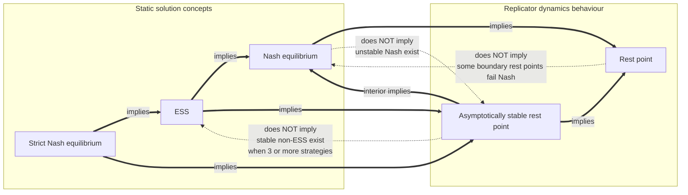

# 🌉 The Folk Theorem of Evolutionary Game Theory

> [!abstract] TL;DR
> The **"folk theorem" of evolutionary game theory** is the tight web of results (Hofbauer & Sigmund, Nachbar, Bomze) that pins **static game-theory solution concepts** onto **dynamical properties of the replicator equation**: every **Nash equilibrium is a rest point**, every **interior rest point is a Nash equilibrium**, every **limit of an interior trajectory is Nash**, every **strict Nash equilibrium is asymptotically stable**, and every **ESS is asymptotically stable**. In one sentence — *wherever blind selection stops moving, a rational calculator would have found a Nash equilibrium, and every point selection actually settles onto is an even stronger equilibrium.* This gives Nash a **dynamic foundation** and a principled **equilibrium selection** rule (only the stable/ESS survive). But the correspondence is **not fully bidirectional**: some Nash points are unstable repellers, some stable points are not ESS, some boundary rest points are not Nash, and the dynamics may **cycle forever** and never converge at all. (This is a completely different result from the *folk theorem of repeated games* — same name, different theorem.)

---

## Intuition

**Analogy first.** Imagine you want to find the lowest pools in a rugged valley. A brilliant **surveyor** grabs the elevation equations, sets the gradient to zero, and *calculates* every flat spot — hilltops, saddles, and basins alike. Separately, a farmer just **pours a bucket of water** at the top and watches where it runs. The water has no idea what calculus is, yet it always comes to rest at a flat spot the surveyor's equations predicted — and, more tellingly, it *settles and stays* only in the genuine **basins**, never balancing on a hilltop or a saddle.

That is exactly the relationship between rational game theory and evolution. The surveyor is the **Nash calculator**: it finds every strategy mix that is a best response to itself. The pouring water is the **replicator dynamics**: mindless selection flowing "downhill" toward whatever earns above-average fitness. The folk theorem of EGT is the guarantee that **the water's resting places are precisely the surveyor's flat spots (Nash equilibria)**, and that **the pools it actually collects in are the stable ones (ESS)**. Blind selection independently rediscovers the solutions a perfect reasoner would compute — no brain required.

The analogy also warns us where the correspondence frays: water balanced on a knife-edge saddle (an *unstable* Nash equilibrium) is a rest point no real trickle ever lands on, and in some landscapes the water swirls endlessly in an **eddy** (Rock-Paper-Scissors) without ever pooling. The folk theorem is precise about both the bridges *and* their limits.

---

## How It Works

### What the "folk theorem" of EGT actually is

It is not a single named theorem but a **collection of foundational results** — so standard that they circulated as "folklore" before being formalized by **Taylor & Jonker (1978)**, **Hofbauer, Schuster & Sigmund (1979)**, **Bomze (1986)**, and **Nachbar (1990)**, and consolidated in **Hofbauer & Sigmund (1998)**. Together they establish a dictionary translating the *static* language of Nash, strict Nash, and ESS into the *dynamic* language of rest points and asymptotic stability of the **replicator equation** `ẋᵢ = xᵢ · [ (Ax)ᵢ − x·Ax ]`.

> [!warning] Name clash
> This is **not** the *folk theorem of repeated games* (Friedman, Aumann, Rubinstein), which says that any individually-rational payoff can be sustained as a subgame-perfect equilibrium of an infinitely repeated game. Same phrase "folk theorem," entirely different result. The repeated-games version lives in [[Repeated_Games_and_Folk_Theorems]] and underpins [[Direct_Reciprocity_and_Repeated_Games|direct reciprocity]]; the EGT version is about *dynamics converging to equilibrium*.

### The core correspondences

Let `A` be the payoff matrix of a symmetric game and `x*` a population state on the simplex.

1. **Every Nash equilibrium is a rest point.** If `x*` is a (symmetric) Nash equilibrium, every strategy in its support earns the *maximal* payoff, so no strategy beats the population average — selection has **no gradient** to push on, and `ẋ = 0`. Nash play is exactly "nobody is being out-reproduced."
2. **Every interior rest point is a Nash equilibrium.** At an interior rest point all strategies are present yet none grows, which forces every strategy to earn *equal* payoff. Equal-and-maximal-among-those-present is precisely the interior Nash condition. (Boundary rest points can escape this — see the caveats.)
3. **Every limit of an interior trajectory is a Nash equilibrium** (Nachbar 1990). If an orbit starting in the interior *converges*, its limit cannot be beaten by any strategy that was present along the way — otherwise that strategy would have grown and the orbit would not have converged there. So *dynamically reached* endpoints are always Nash. This is the sharpest statement of "evolution does not converge to non-Nash points."
4. **Every strict Nash equilibrium is asymptotically stable.** A strict Nash equilibrium is a pure state that is the *unique* best reply to itself; any mutant strictly loses, so selection actively pushes invaders back to zero. The rest point is a genuine attractor.
5. **Every ESS is asymptotically stable.** The invasion-proof condition of an [[Evolutionarily_Stable_Strategies|ESS]] is exactly strong enough to make the relative-entropy function `V(x) = Σ x*ᵢ ln(xᵢ/x*ᵢ)` a strict local Lyapunov function, so the replicator flow converges to the ESS from every nearby state. ESS is a *sufficient* condition for dynamic stability. (See [[Replicator_Dynamics_and_Fixed_Points]] for the Lyapunov argument in full.)

### The containment hierarchy

Stacking the implications gives a layered map of who implies whom:

- On the **static** side: `strict Nash ⊂ ESS ⊂ Nash`.
- On the **dynamic** side: `asymptotically stable rest points ⊂ Nash rest points ⊂ all rest points`.
- The **bridges** connect them: `strict Nash ⟹ ESS ⟹ asymptotically stable ⟹ (interior) Nash ⟹ rest point`.

So the strongest static concept (strict Nash) implies the strongest dynamic property (asymptotic stability), and the weakest (rest point) sits at the bottom of both stacks. The details of the ESS-side of this nesting are developed in [[Evolutionarily_Stable_Strategies]].

### The significance — evolution as equilibrium selection

Two profound payoffs fall out of this dictionary:

- **A dynamic foundation for Nash.** Classical theory *assumes* players land on a Nash equilibrium but never says *how*. The folk theorem answers it: Nash equilibria are exactly the resting places of a mindless adaptive process, so we should *expect* equilibrium play because it is what selection and learning converge to — no rationality, common knowledge, or computation required (the through-line of [[From_Classical_to_Evolutionary_Game_Theory]]).
- **A principled equilibrium refinement.** Games routinely have *many* Nash equilibria. The folk theorem selects among them: the **unstable** ones are repellers no population settles at, while the **stable/ESS** ones are the attractors that actually survive. Evolution does the equilibrium-selection work that static theory could only do by hand-waving.

### The correspondences and their caveats



The **solid arrows are theorems**; the **dashed arrows are the non-implications** — the exact places the bridge does *not* run both ways:

- **Not every Nash equilibrium is stable.** The mixed equilibrium of a coordination game is a Nash rest point that is a **repeller**; a saddle is Nash but escaped along one direction. These are Nash yet evolutionarily irrelevant.
- **Not every asymptotically stable point is an ESS.** With three or more strategies the replicator flow can be pulled inward by *non-normal* (asymmetric) payoffs even when the static ESS definiteness condition fails. Stable but not ESS is a genuine phenomenon (demonstrated in the Python below).
- **Not every rest point is Nash.** Boundary rest points where an *absent* strategy would have done strictly better are rest points (a missing strategy cannot grow from zero) but are **not** Nash equilibria.
- **Convergence is not guaranteed at all.** [[Replicator_Dynamics|Replicator]] trajectories can **cycle** or be **chaotic**. Rock-Paper-Scissors has a Nash rest point that is a **non-attracting center** — the population orbits the equilibrium forever (see [[Cyclic_Dynamics_and_Rock_Paper_Scissors]] and [[Evolutionary_Stability_and_Dynamic_Stability]]).

### Dynamics-dependence and the link to learning

The correspondences are **cleanest for the replicator dynamics**. Other adjustment processes — **best-response dynamics**, **imitation dynamics**, **logit/smoothed best response**, **fictitious play** — satisfy *weaker or different* versions. The robust, dynamics-independent core is **Nash-stationarity**: any "reasonable" payoff-monotone dynamic has its rest points *contained in* the Nash set, so no sensible adaptive process converges to a non-Nash state. *Which* Nash point gets selected, however, varies with the dynamic (this is the theme of [[Evolutionary_Stability_and_Dynamic_Stability]]).

This is the same machinery that grounds **learning in games**: [[Reinforcement_Learning|reinforcement learning]], no-regret / multiplicative-weights dynamics, and fictitious play converge (under conditions) to Nash or [[Correlated_Equilibrium|correlated equilibria]], with time-averages of no-regret play landing in the correlated-equilibrium set. "Learning ↔ evolution ↔ equilibrium" is one idea wearing three hats — the bridge into modern multi-agent learning is the sibling note *Evolutionary_Game_Theory_and_Machine_Learning*.

---

## Key Concepts

### Secondary (intuition, no math)
- **The dictionary.** Nash equilibrium = "a spot where selection stops." ESS = "a spot selection stops *and stays*." The folk theorem says these dictionary entries are correct.
- **Two routes, one destination.** A calculator finds equilibria by reasoning; a population finds them by dying and reproducing. They arrive at the same places.
- **Where it stays vs. where it merely pauses.** A ball can rest on a hilltop, but the tiniest nudge sends it off; it *stays* only in a valley. Unstable Nash = hilltop, ESS = valley.

### Undergraduate (formal but standard)
- **Rest point / Nash correspondence.** `x*` Nash `⟹ ẋ* = 0`; `x*` an *interior* rest point `⟹ x*` Nash; a convergent interior trajectory's limit is Nash.
- **Strict Nash `⟹` asymptotically stable**, and **ESS `⟹` asymptotically stable** under the replicator dynamics.
- **Inclusions.** `strict Nash ⊂ ESS ⊂ Nash` (static); `asympt. stable ⊂ Nash rest points ⊂ rest points` (dynamic).
- **Non-implications.** Nash `⇏` stable; asympt. stable `⇏` ESS (needs `n ≥ 3`); rest point `⇏` Nash (boundary).

### Graduate (dynamical-systems view)
- **Lyapunov characterization.** For interior `x*`, `V(x) = Σ x*ᵢ ln(xᵢ/x*ᵢ)` satisfies `V̇ = −(x − x*)·A·(x − x*)` along the replicator flow. If `x*` is an **interior ESS** the quadratic form is negative on the tangent space, so `V` is a strict Lyapunov function `⟹` asymptotic stability.
- **ESS `⟺` local superiority.** `x*` is an ESS iff `x*·Ay > y·Ay` for all `y ≠ x*` in a neighborhood; this is the *definiteness* condition `z·A·z < 0` for tangent `z` at an interior equilibrium.
- **Why stability `⇏` ESS.** Asymptotic stability only needs the linearization `diag(x*)·A` (restricted to the tangent space) to have eigenvalues with **negative real part** — a strictly weaker condition than negative-definiteness of `A`'s symmetric part. Non-normal `A` can be a contraction while its symmetric part is indefinite. In `2×2` games the two conditions coincide (`ESS ⟺ asymptotically stable`); they can separate only for `n ≥ 3`.
- **Non-convergence classes.** Zero-sum symmetric games give conservative flows with closed orbits (Rock-Paper-Scissors center); heteroclinic cycles and, for `n ≥ 4`, chaotic attractors (Sato-Akiyama-Farmer) all preserve Nash-stationarity yet violate convergence.
- **Robustness (Nash-stationarity).** For any *payoff-monotone* selection dynamic, the set of rest points includes all Nash equilibria and every *stable* rest point is Nash; the classification of `2×2` phase portraits is due to Bomze (1986), Cressman (2003).

---

## Python Demo

This demo **verifies the folk-theorem dictionary game by game**. For a set of `2`- and `3`-strategy games it (1) states the Nash equilibria analytically, (2) confirms each is a **rest point** of the replicator dynamics numerically, (3) classifies each by **stability** (eigenvalues of the linearization on the simplex tangent space) and checks the **ESS** definiteness condition, and (4) exhibits the caveats: a Nash point that is **unstable**, a stable point that is **not ESS**, a **center** that never converges, and a boundary **rest point that is not Nash**. It then overlays the Nash points on the replicator phase portraits, color-coded by stability.

```python
# The Folk Theorem of Evolutionary Game Theory
# Verify the correspondences between STATIC solution concepts (Nash, strict Nash,
# ESS) and DYNAMIC properties of the replicator equation (rest points, stability),
# and expose exactly where the dictionary is NOT bidirectional.
import numpy as np
import matplotlib.pyplot as plt

# --- single-population replicator dynamics: dx_i/dt = x_i * ((A x)_i - x . A x) ---
def rep_rhs(x, A):
    f = A @ x
    return x * (f - x @ f)

def rk4_traj(x0, A, dt=0.01, steps=2500):
    x = np.array(x0, float); x /= x.sum()
    out = np.empty((steps, len(x)))
    for t in range(steps):
        out[t] = x
        k1 = rep_rhs(x, A);            k2 = rep_rhs(x + 0.5*dt*k1, A)
        k3 = rep_rhs(x + 0.5*dt*k2, A); k4 = rep_rhs(x + dt*k3, A)
        x = x + (dt/6)*(k1 + 2*k2 + 2*k3 + k4)
        x = np.clip(x, 1e-12, None); x /= x.sum()   # stay on the simplex
    return out

def is_rest_point(x, A, tol=1e-8):
    return np.linalg.norm(rep_rhs(np.array(x, float), A)) < tol

def tangent_basis(n):
    """Orthonormal basis of the tangent space { z : sum(z) = 0 }."""
    U, _, _ = np.linalg.svd(np.eye(n) - np.ones((n, n)) / n)
    return U[:, :n-1]

def stability(x, A, h=1e-6, tol=1e-6):
    """Classify a rest point via eigenvalues of the replicator linearization."""
    x = np.array(x, float); n = len(x)
    J = np.empty((n, n))
    for j in range(n):                       # numerical Jacobian of rep_rhs
        e = np.zeros(n); e[j] = h
        J[:, j] = (rep_rhs(x + e, A) - rep_rhs(x - e, A)) / (2*h)
    T = tangent_basis(n)
    ev = np.linalg.eigvals(T.T @ J @ T)      # eigenvalues on the tangent space
    if   np.all(ev.real < -tol): return "asymptotically stable", ev
    elif np.any(ev.real >  tol): return "unstable repeller/saddle", ev
    else:                        return "center (neutrally stable)", ev

def is_ess_interior(x, A, tol=1e-9):
    """Interior x* is an ESS  <=>  z . A . z < 0 for every tangent z != 0."""
    T = tangent_basis(len(x))
    Q = T.T @ (0.5 * (A + A.T)) @ T          # quadratic form on the tangent space
    return bool(np.all(np.linalg.eigvalsh(Q) < -tol))

# ----------------------------- the games -----------------------------------
games = {}
# 1. 2-strategy COORDINATION: strict Nash at corners, UNSTABLE Nash inside.
games["Coordination"] = dict(
    A=np.array([[1., 0.], [0., 1.]]),
    nash=[("[1,0] pure",  np.array([1., 0.])),
          ("[0,1] pure",  np.array([0., 1.])),
          ("[.5,.5] mix", np.array([.5, .5]))])
# 2. 2-strategy HAWK-DOVE (V=2, C=4): interior mixed ESS at p* = V/C = 0.5.
V, C = 2., 4.
games["Hawk-Dove"] = dict(
    A=np.array([[(V - C)/2, V], [0., V/2]]),
    nash=[("[.5,.5] ESS", np.array([V/C, 1 - V/C]))])
# 3. 3-strategy ROCK-PAPER-SCISSORS (zero sum): interior Nash is a CENTER, no ESS.
games["Rock-Paper-Scissors"] = dict(
    A=np.array([[0., -1., 1.], [1., 0., -1.], [-1., 1., 0.]]),
    nash=[("centroid", np.ones(3) / 3)])
# 4. 3-strategy NON-NORMAL game (zero row/col sums, strong shear):
#    interior Nash is ASYMPTOTICALLY STABLE but NOT an ESS.
games["Non-normal 3x3"] = dict(
    A=np.array([[1., 4., -5.], [-2., -5., 7.], [1., 1., -2.]]),
    nash=[("centroid", np.ones(3) / 3)])

print(f"{'game':<20}{'Nash point':<14}{'rest?':<7}{'stability':<28}{'ESS?'}")
print("-" * 76)
for name, g in games.items():
    A = g["A"]
    for tag, ne in g["nash"]:
        interior = bool(np.all(ne > 1e-9))
        lab, _ = stability(ne, A)
        ess = is_ess_interior(ne, A) if interior else "pure/strict"
        print(f"{name:<20}{tag:<14}{str(is_rest_point(ne, A)):<7}{lab:<28}{ess}")

# CAVEAT: a boundary REST POINT that is NOT a Nash equilibrium (Hawk-Dove vertex).
A_hd = games["Hawk-Dove"]["A"]
vtx = np.array([0., 1.])                      # all-Dove: a rest point (vertex)
dev = A_hd @ vtx                              # payoff of each pure strategy vs all-Dove
print("\nBoundary rest point [0,1] (all-Dove) in Hawk-Dove:")
print(f"  is a rest point?  {is_rest_point(vtx, A_hd)}")
print(f"  pure payoffs vs it = {dev}  -> Hawk earns {dev[0]} > Dove {dev[1]}"
      f"  => NOT Nash (a rest point that is not an equilibrium)")

# Interior rest point <=> Nash: at the centroid all strategies must earn EQUAL payoff.
print("\nInterior rest point <=> Nash (payoffs must be equal across strategies):")
for name in ["Rock-Paper-Scissors", "Non-normal 3x3"]:
    A = games[name]["A"]; xs = np.ones(3) / 3
    print(f"  {name:<20} A x* = {np.round(A @ xs, 3)}  (equal => interior rest point is Nash)")

# ----------------------------- visualization -------------------------------
fig, ax = plt.subplots(2, 2, figsize=(12.5, 10))

# Panel (0,0): coordination phase line -- Nash points colored by stability.
A = games["Coordination"]["A"]
xg = np.linspace(0, 1, 400)
vel = np.array([rep_rhs(np.array([x, 1 - x]), A)[0] for x in xg])
ax[0, 0].plot(xg, vel, color="navy")
ax[0, 0].axhline(0, color="k", lw=.7)
for xr, col, txt in [(0., "green", "strict Nash / ESS (stable)"),
                     (1., "green", ""),
                     (.5, "red", "mixed Nash (unstable repeller)")]:
    ax[0, 0].plot(xr, 0, "o", color=col, ms=12, zorder=5)
    if txt: ax[0, 0].annotate(txt, (xr, 0), textcoords="offset points",
                              xytext=(6, 12), fontsize=8, color=col)
ax[0, 0].set_title("Coordination 2x2: every Nash is a rest point;\ninterior Nash is unstable")
ax[0, 0].set_xlabel("share on strategy 1"); ax[0, 0].set_ylabel("replicator velocity")

# Panel (0,1): Hawk-Dove phase line -- interior ESS stable; vertices rest-but-not-Nash.
A = games["Hawk-Dove"]["A"]
vel = np.array([rep_rhs(np.array([x, 1 - x]), A)[0] for x in xg])
ax[0, 1].plot(xg, vel, color="teal")
ax[0, 1].axhline(0, color="k", lw=.7)
ax[0, 1].plot(0.5, 0, "o", color="green", ms=12, zorder=5)
ax[0, 1].annotate("interior ESS (stable)", (0.5, 0), textcoords="offset points",
                  xytext=(6, 12), fontsize=8, color="green")
for xr in (0., 1.):
    ax[0, 1].plot(xr, 0, "o", color="red", ms=11, zorder=5)
ax[0, 1].annotate("vertex: rest point\nbut NOT Nash", (0., 0), textcoords="offset points",
                  xytext=(8, -28), fontsize=8, color="red")
ax[0, 1].set_title("Hawk-Dove 2x2: interior ESS attracts;\nboundary rest points are not Nash")
ax[0, 1].set_xlabel("share of Hawks"); ax[0, 1].set_ylabel("replicator velocity")

# Simplex helpers for the 3-strategy panels.
CORNERS = np.array([[0., 0.], [1., 0.], [0.5, np.sqrt(3) / 2]])
def to_xy(P): return np.atleast_2d(P) @ CORNERS
def draw_simplex(a, labels):
    tri = np.vstack([CORNERS, CORNERS[0]])
    a.plot(tri[:, 0], tri[:, 1], "k", lw=1)
    for (cx, cy), lab in zip(CORNERS, labels):
        a.annotate(lab, (cx, cy), fontsize=10, ha="center")
    a.set_aspect("equal"); a.axis("off")

# Panel (1,0): Rock-Paper-Scissors -- Nash centroid is a non-attracting CENTER.
A = games["Rock-Paper-Scissors"]["A"]; draw_simplex(ax[1, 0], ["R", "P", "S"])
for s in (0.15, 0.30, 0.45):
    x0 = (1 - s) * np.ones(3) / 3 + s * np.array([1., 0., 0.])
    xy = to_xy(rk4_traj(x0, A))
    ax[1, 0].plot(xy[:, 0], xy[:, 1], lw=1, color="darkorange")
c = to_xy(np.ones(3) / 3)[0]
ax[1, 0].plot(c[0], c[1], "o", color="orange", ms=13, mec="k", zorder=5)
ax[1, 0].set_title("Rock-Paper-Scissors: Nash centroid is a CENTER\n"
                   "-- orbits never converge (no ESS)")

# Panel (1,1): non-normal game -- Nash centroid is STABLE but NOT an ESS.
A = games["Non-normal 3x3"]["A"]; draw_simplex(ax[1, 1], ["1", "2", "3"])
for th in np.linspace(0, 2*np.pi, 7)[:-1]:
    d = np.cos(th) * np.array([1., -1., 0.]) + np.sin(th) * np.array([1., 1., -2.]) / np.sqrt(3)
    x0 = np.ones(3) / 3 + 0.08 * d / np.linalg.norm(d)
    xy = to_xy(rk4_traj(x0, A, steps=3000))
    ax[1, 1].plot(xy[:, 0], xy[:, 1], lw=1, color="seagreen")
ax[1, 1].plot(c[0], c[1], "o", color="green", ms=13, mec="k", zorder=5)
ax[1, 1].set_title("Non-normal 3x3: Nash centroid is asymptotically\n"
                   "STABLE but NOT an ESS (n>=3 caveat)")

plt.tight_layout()
plt.savefig("folk_theorem_egt.png", dpi=110)
print("\nsaved folk_theorem_egt.png")
```

**What the run confirms.** The printed table verifies the dictionary: *every* listed Nash point comes back `rest? = True`; the coordination corners and the Hawk-Dove interior are `asymptotically stable` and pass the ESS test; the coordination interior mix is `unstable` and fails ESS; the Rock-Paper-Scissors centroid is a `center` with no ESS; and the non-normal centroid is `asymptotically stable` yet `ESS? = False` — the clean separation that can only happen with `n ≥ 3`. The two extra checks show a Hawk-Dove **vertex that is a rest point but not Nash** (Hawk strictly beats the all-Dove state), and that both interior centroids give **equal payoffs** across strategies (so the interior rest point is Nash). The four phase portraits then show the Nash points sitting exactly where the dynamics rest, green where selection *stays*, red where it flees, orange where it merely circles.

---

## Real-World Applications

- **Justifying equilibrium in economics.** Boundedly rational firms that only *imitate* profitable rivals or *learn* from experience still gravitate to the Nash equilibria classical theory predicts — the folk theorem is what licenses using Nash equilibrium as an empirical prediction for agents who never solve a fixed-point problem (see [[From_Classical_to_Evolutionary_Game_Theory]]).
- **Equilibrium selection in coordination problems.** When a game has many Nash equilibria (technology standards, driving conventions, currencies), the folk theorem's stability filter predicts *which* one a population locks into — the risk-dominant / stable one — dissolving the classical selection puzzle without appeals to focal points.
- **Multi-agent reinforcement learning.** Convergence analyses of self-play, policy-gradient, and no-regret learners lean directly on Nash-stationarity: prove the learning dynamic is payoff-monotone and its rest points are pinned to the Nash/correlated-equilibrium set (see [[Reinforcement_Learning]] and [[Correlated_Equilibrium]]).
- **Evolutionary biology and medicine.** Predicting stable sex ratios, signalling conventions, and drug-resistance mixes as ESSs is exactly using the "ESS `⟹` asymptotically stable" bridge — the stable population state is where the system is observed and where interventions must aim.
- **Mechanism and protocol design.** "Stability against invasion by a small fraction of deviators" is the ESS-as-attractor idea repurposed to certify that a protocol or norm, once adopted, is dynamically self-enforcing rather than merely a static best reply.

---

## Common Pitfalls

- **Confusing the two folk theorems.** The EGT folk theorem is about *dynamics converging to equilibrium*; the repeated-games folk theorem is about *which payoffs are sustainable in equilibrium*. They share a name and nothing else — do not cite one for the other ([[Repeated_Games_and_Folk_Theorems]]).
- **Reading the correspondence as an equivalence.** "Nash `=` rest point" and "ESS `=` stable" are *implications with exceptions*, not equalities. Unstable Nash repellers, boundary rest points that fail Nash, and stable non-ESS states are all real. Treating the bridge as bidirectional is the single most common error.
- **Assuming convergence.** The folk theorem never promises the dynamics *reach* a rest point. Rock-Paper-Scissors cycles around its Nash equilibrium forever; higher-dimensional games can be chaotic. "A Nash equilibrium exists" does not mean "evolution finds it."
- **Over-generalizing from `2×2`.** In two-strategy games ESS and asymptotic stability coincide, tempting people to treat them as synonyms. They separate at `n ≥ 3` — asymptotic stability is strictly weaker than ESS there.
- **Treating the replicator as "the" dynamic.** The tightest statements are replicator-specific. Best-response, logit, and imitation dynamics keep Nash-stationarity but can select different equilibria and have different stability verdicts. Always ask *which* dynamic before quoting a stability result (see [[Evolutionary_Stability_and_Dynamic_Stability]]).
- **Ignoring finite populations.** The dictionary assumes an infinite, well-mixed population. Stochastic drift, mutation, and network structure in finite populations can overturn the deterministic classification entirely.

---

## Related Concepts

- [[From_Classical_to_Evolutionary_Game_Theory]] — the paradigm bridge this note makes precise; the folk theorem is *how* mindless selection reaches the equilibria rational calculation predicts.
- [[Replicator_Dynamics]] — the differential equation whose rest points and attractors the folk theorem maps onto Nash, strict Nash, and ESS.
- [[Replicator_Dynamics_and_Fixed_Points]] — the companion note deriving the rest-point / Nash correspondence and the ESS-stability Lyapunov argument in full.
- [[Evolutionarily_Stable_Strategies]] — the static invasion-proof concept that *implies* asymptotic stability; the strongest survivable equilibrium.
- [[Evolutionary_Stability_and_Dynamic_Stability]] — the precise boundary between static ESS and dynamic stability across different adjustment dynamics.
- [[Cyclic_Dynamics_and_Rock_Paper_Scissors]] — the canonical non-convergence caveat: a Nash center that is a rest point but never attracts.
- [[Nash_Equilibrium]] — the classical solution concept that every rest point (interior) and every stable point corresponds to; the folk theorem gives it a dynamic foundation.
- [[Evolutionary_Stable_Strategies]] — the Game Theory vault's algebraic ESS treatment, including the ESS `⟹` stability Lyapunov argument.
- [[Mixed_Strategies]] — the object that becomes a population fraction; interior Nash mixtures are the interior rest points the theorem characterizes.
- [[Correlated_Equilibrium]] — the solution concept that time-averaged no-regret learning converges to, extending "learning ↔ equilibrium" beyond Nash.
- [[Repeated_Games_and_Folk_Theorems]] — the *other* folk theorem (repeated games); same name, different result, clarified here to avoid the clash.
- [[Direct_Reciprocity_and_Repeated_Games]] — where that *other* folk theorem does its work: sustaining cooperation through repetition.
- [[Reinforcement_Learning]] — learning-in-games as an evolutionary dynamic whose convergence guarantees rest on Nash-stationarity.
- [[Systems_of_ODEs]] — the dynamical-systems toolkit (rest points, linearization, eigenvalues) that makes "asymptotic stability" precise.
- [[Dynamical_Systems_and_Attractors]] — the general theory of attractors, saddles, centers, and basins that the replicator flow instantiates.

*(Sibling note referenced in prose — Evolutionary_Game_Theory_and_Machine_Learning — will be created as this vault grows.)*

---

## Review Questions

1. **(Secondary)** Using the surveyor-versus-pouring-water analogy, explain the difference between "a Nash equilibrium" and "an ESS" in dynamical terms. Why does water rest at *every* flat spot but *stay* only in the basins?
2. **(Undergraduate)** State the five core correspondences of the folk theorem. Prove informally that (a) every Nash equilibrium is a rest point and (b) every *interior* rest point is a Nash equilibrium. Why does part (b) fail for *boundary* rest points — give the Hawk-Dove all-Dove vertex as an example.
3. **(Graduate — scenario)** You are handed a `3×3` symmetric game whose interior equilibrium the replicator dynamics clearly attracts, yet the equilibrium fails the ESS definiteness test `z·A·z < 0`. Explain how both can be true simultaneously (what property of `A` allows it), why this cannot happen in a `2×2` game, and what this tells you about using ESS versus asymptotic stability as *the* refinement of Nash. Then contrast this case with Rock-Paper-Scissors, where the Nash equilibrium is neither ESS nor asymptotically stable.

---

## Sources

- Hofbauer, J. & Sigmund, K. (1998). *Evolutionary Games and Population Dynamics.* Cambridge University Press. (The canonical statement of the EGT folk theorem and the Lyapunov/ESS-stability results.)
- Hofbauer, J. & Sigmund, K. (2003). "Evolutionary Game Dynamics." *Bulletin of the American Mathematical Society* 40(4), 479-519.
- Nachbar, J. H. (1990). "'Evolutionary' Selection Dynamics in Games: Convergence and Limit Properties." *International Journal of Game Theory* 19, 59-89. (Limits of interior trajectories are Nash.)
- Bomze, I. M. (1986). "Non-cooperative Two-Person Games in Biology: A Classification." *International Journal of Game Theory* 15, 31-57. (Phase-portrait classification of `2×2` replicator dynamics.)
- Weibull, J. W. (1995). *Evolutionary Game Theory.* MIT Press. (Bridges between static equilibrium concepts and replicator stability; the `n ≥ 3` stable-but-not-ESS distinction.)
- Sandholm, W. H. (2010). *Population Games and Evolutionary Dynamics.* MIT Press. (Nash-stationarity across the family of evolutionary dynamics; learning connections.)

---

#evolutionary-game-theory #folk-theorem #nash-equilibrium #rest-points #ess-stability
