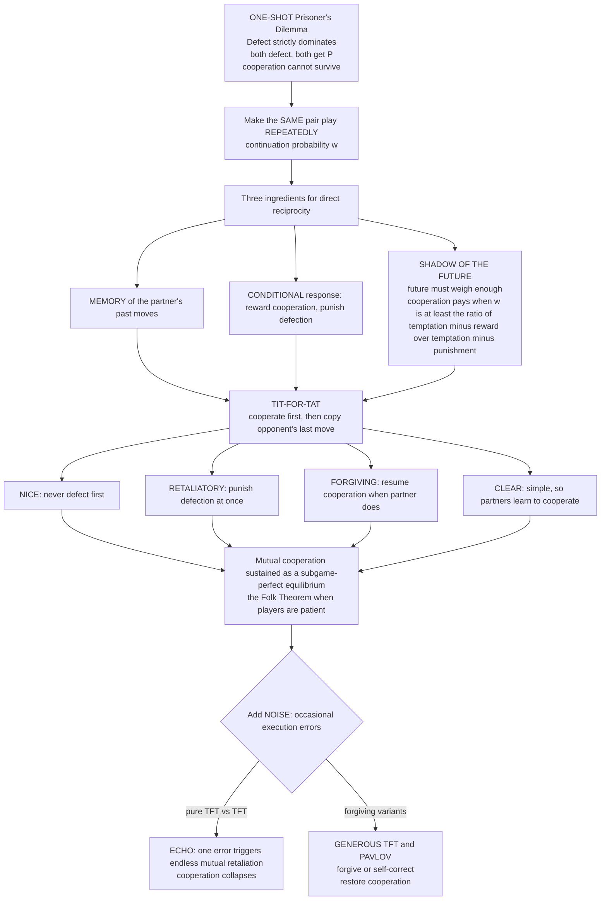

# 🤝 Direct Reciprocity and Repeated Games

> [!abstract] TL;DR
> **Direct reciprocity** is the first and simplest route out of the cooperation trap: *"I help you because you will help me back."* In a **one-shot** Prisoner's Dilemma, defection strictly dominates — betraying a stranger you will never meet again is the rational move. But if the **same two individuals interact repeatedly**, can **remember** past moves, and **respond** to them, cooperation can pay: you cooperate today to secure your partner's cooperation tomorrow. This is the **shadow of the future** — cooperation is sustainable only when future interactions matter enough, i.e. when the **continuation probability / discount factor `w`** is high. **Robert Axelrod's computer tournaments (1980–1984)** revealed the winner was breathtakingly simple: **TIT-FOR-TAT** (Anatol Rapoport) — cooperate first, then copy your opponent's last move. Its success came from four properties: **NICE** (never defect first), **RETALIATORY** (punish defection at once), **FORGIVING** (return to cooperation the moment the other does), and **CLEAR** (predictable enough to be learned). But TFT is fragile to **noise** — one accidental defection between two TFTs triggers an endless retaliatory "echo" — so evolution favours **forgiving** successors: **Generous Tit-for-Tat** and **Win-Stay-Lose-Shift / Pavlov**. Direct reciprocity explains cooperation in *repeated pair relationships* — trade partnerships, alliances, primate grooming, vampire-bat blood-sharing, arms-control — but it **fails in large anonymous groups**, which is exactly what motivates the other mechanisms of cooperation.

---

## Intuition

**Analogy:** Imagine you are travelling and stop at a roadside stall in a town you will *never* visit again. The vendor could shortchange you and you could pass a bad note — neither of you will pay a price tomorrow, because there is no tomorrow *together*. Cheating a stranger you will never see again is tempting precisely because the relationship has no future. Now imagine instead the corner shop you pass **every single morning**. Shortchanging that shopkeeper is foolish: they will remember, refuse you service, warn you off — and you lose a lifetime of small daily gains for one petty win. The **repetition** of the interaction, and the vendor's **memory** of how you behaved, completely rewires the incentives. What was rational (cheat) in the one-shot encounter becomes self-defeating in the repeated one.

That difference *is* direct reciprocity. When interactions **repeat** and partners **remember and respond**, today's kindness becomes an investment that earns tomorrow's cooperation, and today's betrayal becomes a debt you will be made to repay. Axelrod's tournaments put this to the test by pitting submitted computer strategies against each other in a repeated Prisoner's Dilemma — and the champion was almost embarrassingly simple: **be nice, retaliate if crossed, and forgive quickly.** Tit-for-tat beat every elaborate, scheming program by refusing to be the first to defect, punishing anyone who did, and holding no grudges once the other came back.

---

## How It Works

### The one-shot trap, and the escape

Recall the stage game (the **Prisoner's Dilemma**, developed in the planned sibling *The_Prisoners_Dilemma_and_Cooperation*). Two players each choose **Cooperate (C)** or **Defect (D)** with the ordering **T > R > P > S** and **2R > T + S**:

| | opponent **C** | opponent **D** |
|---|---|---|
| **C** | `R, R` (reward) | `S, T` (sucker vs temptation) |
| **D** | `T, S` (temptation vs sucker) | `P, P` (punishment) |

In the **one-shot** game, `D` strictly dominates: whatever the other does, defecting earns more (`T > R` and `P > S`). Both defect, both get `P`, though both would prefer mutual `R`. This is the tragedy — see also the *ESS-is-not-optimum* lesson of [[The_Hawk_Dove_Game]].

**Direct reciprocity** escapes it by changing the *game*, not the payoffs. If the same pair plays **round after round**, a player can make their move **conditional on the partner's past behaviour**. Cooperation stops being a one-time gift and becomes a *renewable contract*: I cooperate as long as you do; defect on me and you forfeit all the future rewards I would have given you.

### The shadow of the future

Repetition alone is not enough — the **future must weigh enough**. Let `w` be the **continuation probability**: after each round, the pair meets again with probability `w` and parts forever with probability `1 − w`. Equivalently, `w` is a **discount factor** on future payoffs, and the expected number of remaining rounds is `1 / (1 − w)` (see discounting in [[Repeated_Games_and_Folk_Theorems]]).

Consider a reciprocator (cooperate-until-betrayed) facing the temptation to defect *now*. Defecting gains `T − R` this round but forfeits the cooperative stream forever after, replaced by mutual punishment. Cooperation is the better long-run choice when the discounted future value of the relationship exceeds the one-shot temptation. For grim-style reciprocity against itself, cooperation is stable when:

```
w  ≥  (T − R) / (T − P)
```

The larger the temptation `T`, the more future weight `w` you need to hold cooperation together. If `w` is high (you will almost surely meet again), the long-run gains from mutual cooperation swamp the short-run grab, and cooperation pays. If `w` is low (interactions rarely recur), the future casts no shadow, and defection wins. **The weight of the future decides whether cooperation survives.**

### The Folk Theorem connection

Repeated interaction does not merely *permit* cooperation — it permits *almost anything*. The **Folk Theorem of repeated games** (Friedman; Fudenberg–Maskin) says that in an infinitely/indefinitely repeated game, **any** feasible payoff profile that gives each player at least their minmax value can be sustained as a **subgame-perfect Nash equilibrium**, provided players are **patient enough** (`w`, or `δ`, close to 1). Mutual cooperation is one such equilibrium, enforced by the **credible threat of future punishment**: reciprocity strategies (grim trigger, tit-for-tat) make defection unprofitable by promising retaliation.

> **Two different "folk theorems."** The **classical** folk theorem above is about *rational, patient* players in [[Repeated_Games_and_Folk_Theorems]]. The **evolutionary** folk theorem — the topic of the planned sibling *The_Folk_Theorem_of_EGT* — is a *different* result linking the rest points and stability of the [[Replicator_Dynamics]] to Nash equilibria and ESSs. Do not conflate them: one is about strategic reasoning, the other about selection dynamics.

### Axelrod's tournaments and Tit-for-Tat

In 1980 the political scientist **Robert Axelrod** ran a landmark experiment. He invited game theorists to submit **computer strategies** for the **iterated Prisoner's Dilemma** and pitted every strategy against every other (and itself) in a **round-robin** tournament, scoring cumulative payoff. Strategies ranged from simple to fiendishly complex. The winner — in the first tournament *and* the second, larger one, even after everyone knew the result — was the **shortest program submitted**: **TIT-FOR-TAT**, from **Anatol Rapoport**. Its rule:

> **Cooperate on the first move; thereafter, do whatever your opponent did last.**

A four-line strategy beat every elaborate scheme. This launched a whole research program on the **evolution of cooperation**.

### Why Tit-for-Tat won: four properties

Axelrod distilled TFT's success into four qualities that a good reciprocity strategy needs:

1. **NICE** — it is *never the first to defect*. Nice strategies dominated the tournament; being the aggressor almost always backfired.
2. **RETALIATORY** — it *punishes defection immediately*, so it cannot be exploited by chiselers who probe for weakness.
3. **FORGIVING** — it *returns to cooperation the instant the opponent does*, holding no grudges; this prevents needless feuds and lets cooperation be restored.
4. **CLEAR** — it is *simple and predictable*, so opponents can quickly learn that cooperation is rewarded and defection punished, and adapt toward cooperation.

TFT is thus **not exploitable** (it retaliates) yet **not exploitative** (it never opens with defection, and it never beats a cooperative partner — at best it ties). It is a strategy that *brings out the best* in whoever it meets.

### The diagram



---

## Key Concepts

### Secondary (intuitive)

- **Direct reciprocity** — "I help you because you will help me back"; cooperation built on *repeated* encounters with the *same* partner, using *your own* history with them.
- **Shadow of the future** — cooperation survives only when you are likely to meet again; the more the future matters, the more cooperation pays.
- **Tit-for-tat** — the champion rule: start friendly, then mirror your partner. Be nice, hit back if hit, forgive fast.
- **The echo problem** — between two unforgiving reciprocators, a single mistake ricochets into an endless vendetta; real relationships need a little forgiveness.

### Undergraduate (formal)

- **Continuation probability `w` / discount factor `δ`** — the probability the pair meets again next round; expected relationship length is `1 / (1 − w)`. Cooperation via grim trigger is stable when `w ≥ (T − R) / (T − P)`.
- **Strategy as an automaton** — a repeated-game strategy maps *history* to an action. Memory-one strategies (TFT, GRIM, Pavlov, GTFT) depend only on the last round and are describable by a small transition table.
- **Reciprocity strategies** — **TFT** (copy last move), **GRIM/trigger** (cooperate until first defection, then defect forever), **Generous TFT / GTFT** (like TFT but forgive a defection with probability `g`), **Win-Stay-Lose-Shift / Pavlov** (repeat your move after a good payoff `T` or `R`, switch after a bad one `P` or `S`).
- **Nash / subgame-perfect status** — GRIM and "TFT vs TFT" are Nash equilibria of the repeated game for high `w`; but **TFT is not subgame-perfect** in general (after an off-path defection it can prescribe a suboptimal continuation), whereas GRIM is. TFT's fame is *empirical/evolutionary robustness*, not equilibrium perfection.
- **Folk Theorem** — for `w → 1`, any individually-rational feasible payoff (including mutual cooperation) is a subgame-perfect equilibrium payoff, enforced by punishment threats.

### Graduate (advanced)

- **Evolutionary robustness vs invasion** — no reciprocity strategy is an ESS in the strict sense against *all* mutants. TFT can **invade** a defector population *only if it arrives in a cluster* (assortment) so that TFTs meet each other often enough; a single TFT among AllD is driven out because its first cooperative move is wasted. Once established, a cooperative regime resists invasion by AllD (defectors get punished), but is **neutrally invadable** by other nice strategies (e.g. AllC), which then opens the door to exploiters — an **evolutionary cycle**.
- **Noise and the echo effect** — with execution error rate `ε`, two TFTs fall into alternating or locked mutual defection, and their long-run payoff drops from `R` toward `(R + S + T + P)/4`. **Generous TFT** (forgive with probability `g ≈ 1 − (T − R)/(R − S)`) and **Pavlov** recover cooperation after errors; Pavlov *self-corrects* because a mutual accidental defection `(D,D)` is a "bad" payoff that makes both switch back to `C`.
- **Pavlov's double edge** — Win-Stay-Lose-Shift can **exploit unconditional cooperators**: once it accidentally defects against AllC, it keeps getting `T` (a "win"), so it *stays* defecting and locks in exploitation. This makes Pavlov both error-correcting *and* opportunistic — a big part of why it succeeds in noisy, mixed populations where pure TFT stagnates at `R`.
- **The strategy ecology and cycles** — evolutionary simulations show *no single winner*: populations cycle AllD → TFT/GRIM (reciprocators invade via clustering) → AllC (drifts in under the cooperative regime, being neutral) → AllD again (exploiters invade the now-unconditional cooperators). Reciprocity is a *stabilizer*, not a fixed endpoint.
- **Zero-determinant (ZD) strategies** — Press & Dyson (2012) discovered a class of memory-one strategies that can **unilaterally set a linear relation** between the two players' scores, including **extortionate** strategies that guarantee a fixed share of the surplus. Their surprise: in an *evolutionary* setting extortioners are *not* evolutionarily stable — evolution favours **generous ZD** strategies that share surplus, re-deriving fairness-like cooperation. A modern coda to Axelrod.
- **Requirements and limits** — direct reciprocity needs *repeated interaction*, *recognition of the specific partner*, *memory of past moves*, and *high enough `w`*. It works for **pairs** with recurring encounters, but degrades in **large or anonymous groups** where you rarely meet the same individual twice and cannot condition on *your own* history with them. There, cooperation must lean on **indirect reciprocity** (reputation), spatial structure, kin selection, or institutions (planned siblings *Indirect_Reciprocity_and_Reputation*, *Spatial_and_Network_Games*, *Kin_Selection_and_Inclusive_Fitness*).

---

## Python Demo

The program runs a full **Axelrod-style study** in two stages, using only `numpy` and `matplotlib`.

1. **Round-robin tournament** — seven iterated-PD strategies (**Always Defect, Always Cooperate, Tit-for-Tat, Grim Trigger, Generous TFT, Win-Stay-Lose-Shift / Pavlov, Random**) play every strategy including themselves in *repeated* matches with **continuation probability `w`** (the shadow of the future) and an optional **noise** rate `ε` (execution errors). Strategies are ranked by mean per-round score.
2. **Evolutionary tournament** — the tournament payoff matrix drives **replicator dynamics** on the *frequencies* of the strategies, showing which rise and which fall.

Both stages are run **without noise** and **with noise** so you can see reciprocity thrive, unconditional cooperation get exploited, and the *forgiving/generous* strategies (GTFT, Pavlov) gain the edge once errors are present.

```python
# Axelrod-style iterated Prisoner's Dilemma:
#   1. round-robin tournament with continuation probability w and noise rate eps
#   2. replicator (evolutionary) dynamics driven by the tournament payoff matrix
# Shows: reciprocity thrives, unconditional cooperation is exploited,
#        and forgiving/generous strategies (GTFT, Pavlov) win under noise.
import numpy as np
import matplotlib.pyplot as plt

rng = np.random.default_rng(7)

# Prisoner's Dilemma payoffs: T > R > P > S and 2R > T + S.  C = 1, D = 0.
T, R, P, S = 5.0, 3.0, 1.0, 0.0
def payoff(a, b):                       # payoff to a given moves a, b (1=C, 0=D)
    return R if (a and b) else P if (not a and not b) else (S if a else T)

# ---- Strategies: each maps (my_history, opp_history) -> next move (1=C, 0=D) ----
def all_d(my, opp):  return 0
def all_c(my, opp):  return 1
def tft(my, opp):    return 1 if not opp else opp[-1]                 # copy last move
def grim(my, opp):   return 0 if (0 in opp) else 1                    # unforgiving trigger
def gtft(my, opp, g=0.3):                                             # forgive defection w.p. g
    if not opp:            return 1
    if opp[-1] == 1:       return 1
    return 1 if rng.random() < g else 0
def pavlov(my, opp):                                                  # win-stay, lose-shift
    if not my:            return 1
    return 1 if my[-1] == opp[-1] else 0
def rand(my, opp):   return int(rng.random() < 0.5)

STRATS = [("AllD", all_d), ("AllC", all_c), ("TFT", tft),
          ("GRIM", grim), ("GTFT", gtft), ("Pavlov", pavlov), ("Random", rand)]
NAMES  = [s[0] for s in STRATS]
N      = len(STRATS)

def play_match(fa, fb, w, eps, n_matches=60, cap=1000):
    """Repeated PD with continuation prob w and noise eps; mean per-round payoff to each."""
    tot_a = tot_b = rounds = 0
    for _ in range(n_matches):
        ha, hb = [], []                                  # actual played histories
        while True:
            ia, ib = fa(ha, hb), fb(hb, ha)              # intended moves
            a = ia if rng.random() > eps else 1 - ia     # execution error flips the move
            b = ib if rng.random() > eps else 1 - ib
            tot_a += payoff(a, b); tot_b += payoff(b, a)
            ha.append(a); hb.append(b); rounds += 1
            if rng.random() > w or len(ha) >= cap:       # meet again w.p. w, else part
                break
    return tot_a / rounds, tot_b / rounds

def tournament(w, eps):
    """Full round-robin. Returns payoff matrix M[i,j] = score of i vs j."""
    M = np.zeros((N, N))
    for i in range(N):
        for j in range(i, N):
            a, b = play_match(STRATS[i][1], STRATS[j][1], w, eps)
            M[i, j] = a
            M[j, i] = b if i != j else a
    return M

def replicator(M, steps=1500, dt=0.04):
    """Replicator dynamics on strategy frequencies from a uniform start."""
    x = np.ones(N) / N
    traj = np.empty((steps + 1, N)); traj[0] = x
    for t in range(steps):
        fit = M @ x                       # each strategy's mean payoff in current population
        x = x + dt * x * (fit - x @ fit)  # replicator equation
        x = np.clip(x, 0, None); x /= x.sum()
        traj[t + 1] = x
    return traj

W = 0.95                                   # high continuation prob -> long shadow of the future
M_clean = tournament(W, eps=0.0)           # noise-free world
M_noisy = tournament(W, eps=0.02)          # 2% execution errors

score_clean = M_clean.mean(axis=1)         # mean score vs the whole field
score_noisy = M_noisy.mean(axis=1)
traj_clean  = replicator(M_clean)
traj_noisy  = replicator(M_noisy)

def rank(scores, title):
    order = np.argsort(scores)[::-1]
    print(f"\n{title}")
    for r, k in enumerate(order, 1):
        print(f"  {r}. {NAMES[k]:8s} mean per-round score = {scores[k]:.3f}")

rank(score_clean, f"TOURNAMENT (w={W}, no noise) — ranking:")
rank(score_noisy, f"TOURNAMENT (w={W}, 2% noise) — ranking:")
print(f"\nFinal evolutionary mix (no noise): "
      f"{ {NAMES[i]: round(traj_clean[-1, i], 3) for i in range(N)} }")
print(f"Final evolutionary mix (2% noise): "
      f"{ {NAMES[i]: round(traj_noisy[-1, i], 3) for i in range(N)} }")

# ---- Visualize: tournaments (top row) and evolution (bottom row) ----
fig, ax = plt.subplots(2, 2, figsize=(14, 9))
colors = plt.cm.tab10(np.linspace(0, 1, N))

for a, sc, ttl in [(ax[0, 0], score_clean, "Tournament scores — NO noise"),
                   (ax[0, 1], score_noisy, "Tournament scores — 2% noise")]:
    order = np.argsort(sc)[::-1]
    a.bar([NAMES[k] for k in order], sc[order], color=[colors[k] for k in order])
    a.axhline(R, ls="--", color="grey", lw=1, label="mutual cooperation R")
    a.set_ylabel("mean per-round score"); a.set_title(ttl); a.legend(fontsize=8)
    a.tick_params(axis="x", rotation=30)

for a, tr, ttl in [(ax[1, 0], traj_clean, "Evolutionary dynamics — NO noise"),
                   (ax[1, 1], traj_noisy, "Evolutionary dynamics — 2% noise")]:
    for i in range(N):
        a.plot(tr[:, i], color=colors[i], lw=2, label=NAMES[i])
    a.set_xlabel("selection steps"); a.set_ylabel("population frequency")
    a.set_ylim(0, 1); a.set_title(ttl); a.legend(fontsize=8, ncol=2)

plt.tight_layout()
plt.savefig("direct_reciprocity_axelrod.png", dpi=120)
print("\nsaved figure -> direct_reciprocity_axelrod.png")
```

**What you should see (illustrative — exact numbers depend on the seed and `w`):**

```
TOURNAMENT (w=0.95, no noise) — ranking:
  1. TFT / GRIM / Pavlov / GTFT ... ~2.9–3.0   (reciprocators cluster near mutual R)
  ...
  7. AllD                          ~1.4        (exploits AllC once, then punished to P)

TOURNAMENT (w=0.95, 2% noise) — ranking:
  ... GTFT and Pavlov rise relative to pure TFT/GRIM, whose mutual scores fall
      because a single error triggers a retaliatory echo ...
```

- **Top-left (no noise):** the nice, reciprocal strategies (TFT, GRIM, GTFT, Pavlov) all hover near the dashed **mutual-cooperation line `R`**, because against each other and against AllC they sustain cooperation. **AllD** scores lowest overall: it grabs `T` off AllC exactly once, then is punished down to `P` by every reciprocator — a vivid demonstration that *defection does not pay when the future is long*.
- **Top-right (2% noise):** the unforgiving reciprocators (pure **TFT**, **GRIM**) lose ground because errors ignite retaliatory **echoes** that pull their mutual scores below `R`. The **forgiving** strategies **GTFT** and **Pavlov** absorb mistakes and keep cooperation alive, so they climb the ranking.
- **Bottom row (evolution):** starting from a uniform mix, **reciprocators rise** while **AllD collapses** (it can invade only unconditional cooperators, which are quickly gone) — showing **reciprocity thriving**. **AllC** is *exploited whenever AllD is present* and only survives as a neutral passenger once defectors vanish — the **vulnerability of unconditional cooperation**. Under **noise**, the *forgiving/generous* strategies (**GTFT, Pavlov**) end with the largest share, because they repair the damage that errors do to rigid tit-for-tat — the evolutionary edge of **forgiveness**.

---

## Real-World Applications

- **Reciprocal altruism in biology (Trivers, 1971)** — the biological name for direct reciprocity. **Vampire bats** regurgitate blood to roost-mates who failed to feed, and preferentially help those who helped *them* before — a textbook repeated-PD with recognition and memory. **Primate grooming** and coalition support are exchanged reciprocally; **cleaner-fish / client-fish** interactions are repeated bargains policed by reputation and retaliation. See the reciprocity discussion in [[Natural_Selection_and_Adaptation]] and the interaction framing in [[Community_Ecology]].
- **Trade partnerships and business relationships** — repeat customers, long-term suppliers, and merchant networks sustain honest dealing through the shadow of future business; cheating a recurring partner forfeits the whole future stream, exactly the `w ≥ (T−R)/(T−P)` logic.
- **International relations and arms control** — **tit-for-tat reciprocity** underlies **arms-reduction** and trade agreements: verified, matched, incremental concessions ("I cut if you cut, I rebuild if you rebuild") build cooperation between rival states. This is the cooperative counterpart to the escalation logic of [[Nuclear_Strategy_and_Arms_Control]] and [[War_Conflict_and_Security]], and to the institution-building of [[International_Institutions_and_Multilateralism]].
- **Cartels, price-fixing, and tacit collusion** — firms sustain high prices (mutual cooperation) via the threat of a **price war** (grim-trigger punishment) if anyone undercuts; antitrust enforcement works partly by *shortening the shadow of the future*, making defection pay.
- **Everyday human cooperation** — carpools, favour exchange, open-source contribution, and neighbourly help all run on *"I'll help you because we'll deal again."* When relationships become one-shot (tourist traps, anonymous online markets), reciprocity breaks and reputation systems (indirect reciprocity) must step in.

---

## Common Pitfalls

- **Assuming repetition *guarantees* cooperation** — it does not. Cooperation requires a **high enough `w`**. If the relationship is likely to end soon (low `w`, a "last round" in sight), backward induction *unravels* cooperation from the end, and defection returns. The future must weigh enough.
- **The last-round / finite-horizon unravelling** — in a *known, finite* repeated PD, subgame-perfect play is to defect *every* round (defect on the last round, so the second-to-last, and so on). Cooperation needs an *indefinite* horizon (a continuation probability), not a fixed known length.
- **Treating TFT as invincible** — TFT won *Axelrod's specific tournaments*, but it is **not an ESS** and is **fragile to noise**: two TFTs that make one error fall into an endless retaliatory echo. In noisy, evolving worlds, *forgiving* variants (GTFT, Pavlov) beat it. "Tit-for-tat is optimal" is a myth.
- **Confusing the two folk theorems** — the *classical* folk theorem (patient rational players sustain cooperation as SPE) is not the *evolutionary* folk theorem (linking replicator rest points to Nash/ESS). They share a name and nothing else; see the planned *The_Folk_Theorem_of_EGT*.
- **Applying direct reciprocity to anonymous large groups** — it needs *partner recognition* and *memory of your own history with that partner*. In big, anonymous, or one-shot settings you rarely re-meet anyone, so direct reciprocity fails; cooperation there needs **indirect reciprocity / reputation** (planned *Indirect_Reciprocity_and_Reputation*), spatial structure, or institutions.
- **Forgetting that forgiveness can be *too* generous** — a strategy that always forgives collapses into AllC and is exploited. The art is *calibrated* forgiveness: enough to escape echoes, not so much as to invite chiselers. GTFT's forgiveness probability is tuned to the payoffs, not maximal.

---

## Related Concepts

- [[Repeated_Games_and_Folk_Theorems]] — the classical game-theory foundation: discounting, grim trigger, the `w ≥ (T−R)/(T−P)` condition, and the Folk Theorem that direct reciprocity rests on.
- [[Evolutionary_Game_Theory_Overview]] — the parent framework; direct reciprocity is one of the canonical mechanisms for the evolution of cooperation studied with EGT tools.
- [[Replicator_Dynamics]] — the selection engine used in the demo's evolutionary tournament to show which strategies rise and fall.
- [[The_Hawk_Dove_Game]] — the sibling social dilemma; both share the lesson that individually stable outcomes need not be collectively optimal, and both are analysed by frequency-dependent selection.
- [[Evolutionarily_Stable_Strategies]] — the uninvadability criterion; the note explains why *no* reciprocity strategy is a strict ESS and why cooperation is instead an *evolutionary cycle*.
- [[Nash_Equilibrium]] — mutual defection is the one-shot Nash equilibrium; the Folk Theorem shows cooperation becomes a Nash (indeed subgame-perfect) equilibrium of the *repeated* game.
- [[Subgame_Perfect_Equilibrium]] — the refinement under which GRIM qualifies but plain TFT does not; sharpens *which* reciprocity strategies are credible.
- [[Dominance_and_Rationality]] — why `D` strictly dominates in the one-shot PD, the trap that repetition escapes.
- [[Natural_Selection_and_Adaptation]] — the biological substrate; Trivers' **reciprocal altruism** is direct reciprocity under another name.
- [[Nuclear_Strategy_and_Arms_Control]] — arms control as tit-for-tat reciprocity between states; the cooperative face of deterrence.
- [[War_Conflict_and_Security]] — escalation, punishment, and reciprocity in interstate conflict.
- [[International_Institutions_and_Multilateralism]] — institutions that lengthen the shadow of the future and stabilise reciprocal cooperation among nations.

**Forthcoming siblings in this vault (planned, referenced in prose above):** `The_Prisoners_Dilemma_and_Cooperation`, `Indirect_Reciprocity_and_Reputation`, `Kin_Selection_and_Inclusive_Fitness`, `Spatial_and_Network_Games`, `The_Folk_Theorem_of_EGT`, `Finite_Populations_and_Stochastic_Dynamics`, `Animal_Conflict_and_Signaling`, `Evolutionary_Political_Science_and_Conflict`, and `Evolutionary_Game_Theory_and_Machine_Learning`.

---

## Review Questions

1. **(Conceptual)** In a one-shot Prisoner's Dilemma, defection strictly dominates and both players defect. Explain *precisely* how repeating the game with the *same* partner changes the incentives so that cooperation can pay. What role does the continuation probability `w` play, and why does cooperation collapse when `w` is too low or when the number of rounds is *finite and known*?
2. **(Applied / scenario)** Two firms play a repeated pricing game with reward `R = 3` for both charging high, temptation `T = 5` for undercutting, punishment `P = 1` for a price war, and sucker `S = 0`. Compute the minimum continuation probability `w` at which grim-trigger cooperation is sustainable. Now the market is expected to end soon, halving `w`. What happens, and what real lever could a regulator pull to *break* the cartel using this same logic?
3. **(Trade-off / synthesis)** Tit-for-tat won Axelrod's tournaments, yet evolutionary simulations with **noise** favour **Generous TFT** and **Pavlov** instead. Explain the *echo* problem that undoes pure TFT under errors, how each successor fixes it, and why Pavlov can *exploit* Always-Cooperate whereas TFT never does. What does this reveal about whether there is a single "best" reciprocity strategy?

---

## Sources

- Axelrod, R. (1984). *The Evolution of Cooperation*. Basic Books. (The tournaments; tit-for-tat; the four properties.)
- Trivers, R. L. (1971). "The Evolution of Reciprocal Altruism." *Quarterly Review of Biology*, 46(1), 35–57.
- Nowak, M. A. & Sigmund, K. (1993). "A strategy of win-stay, lose-shift that outperforms tit-for-tat in the Prisoner's Dilemma game." *Nature*, 364, 56–58.
- Nowak, M. A. (2006). "Five Rules for the Evolution of Cooperation." *Science*, 314(5805), 1560–1563. (Direct reciprocity as rule #2; the `w > (T−R)/(T−P)`-type conditions.)
- Press, W. H. & Dyson, F. J. (2012). "Iterated Prisoner's Dilemma contains strategies that dominate any evolutionary opponent." *PNAS*, 109(26), 10409–10413. (Zero-determinant / extortionate strategies.)
- Fudenberg, D. & Maskin, E. (1986). "The Folk Theorem in Repeated Games with Discounting or with Incomplete Information." *Econometrica*, 54(3), 533–554.

---

#evolutionary-game-theory #direct-reciprocity #tit-for-tat #iterated-prisoners-dilemma #axelrod
