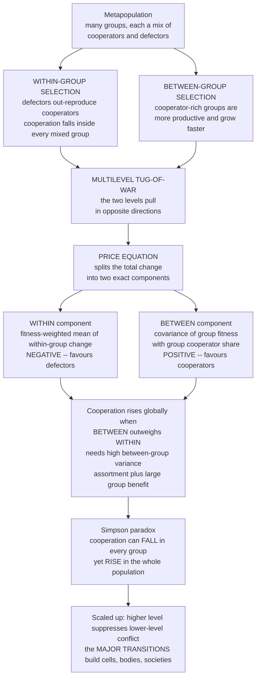

# 🪆 Group and Multilevel Selection

> [!abstract] TL;DR
> **Multilevel selection** explains the evolution of cooperation as a **tug-of-war between two levels at once**. *Within* any single group, a selfish **defector** out-reproduces a **cooperator** — so individual selection always erodes cooperation locally. *Between* groups, a group **full of cooperators** out-produces a group of defectors — so group selection favours cooperation. Cooperation evolves whenever the **between-group advantage outweighs the within-group cost**. George **Price's equation (1970)** makes this rigorous, splitting the total change in a trait into an exact **between-group component** (the covariance of group fitness with group composition — group selection) plus a **within-group component** (the average change inside groups — individual selection). Its most startling prediction is a **Simpson's-paradox** outcome: cooperation can **rise in the whole population while falling inside every single group**, because cooperative groups grow larger and drag the global average up. The requirement is **between-group variance** — cooperators must be **assorted** into cooperator-rich groups — which is exactly the assortment that also powers **kin selection**, making the two theories mathematically **equivalent accounts of the same process**. Scaled up, higher-level selection suppressing lower-level conflict is the engine behind the **major transitions in evolution** — genes into chromosomes, cells into organisms, organisms into societies — that built biological complexity itself.

---

## Intuition

**Analogy:** Imagine a country of villages, each holding a mix of two kinds of people — **givers**, who spend effort maintaining a shared well, and **takers**, who drink freely and never lift a finger. Look *inside* any one village and the takers always come out ahead: they get the water for free while the givers pay the cost, so within every village the takers' share grows and the givers slowly lose. Now zoom out and compare villages. A village **packed with givers** has a magnificent well, healthy people, and booming families; a village **full of takers** has a dry, broken well and dwindling numbers. So the giver-rich villages *send out more settlers* and found more new villages. Selection is now pulling in **two directions at the same time**: *within* villages it favours takers, *between* villages it favours givers. Which force wins depends on how **different** the villages are from one another — if givers are clustered together in giver-rich villages (rather than sprinkled evenly), the between-village force can win, and giving spreads across the whole country **even though takers keep winning inside every village**.

That two-level tug-of-war is multilevel selection. Selfishness beats altruism *within* every group, but groups *of* altruists beat groups of the selfish — and cooperation evolves precisely when the second effect overpowers the first. It is not a fringe curiosity: it may be how loose collections of genes became chromosomes, how free-living cells became bodies, and how quarrelsome primates became cooperative tribes — each a case of a higher-level *whole* taming the selfishness of its parts.

---

## How It Works

### Core mechanics

**1. Two levels of selection, pulling opposite ways.** Partition a population into **groups**. A cooperator pays a personal cost `c` to deliver a benefit `b` that is **shared across the whole group**; a defector pays nothing but still soaks up the shared benefit. This creates a fixed asymmetry at each level:

- **Within a group** (individual selection): a defector always has higher fitness than a cooperator sitting in the *same* group, because they enjoy the identical group benefit but skip the cost `c`. So the cooperator frequency **falls inside every mixed group, always**.
- **Between groups** (group selection): a group's productivity rises with its **fraction of cooperators**, since more cooperators means more shared benefit for everyone in it. So cooperator-rich groups **grow faster and export more offspring** than defector-heavy groups.

Individual selection is the wind against cooperation; group selection is the wind for it. Evolution's net direction is the *sum* of the two.

**2. The naive-group-selection fallacy — and its rehabilitation.** Early biologists loosely invoked adaptations "for the good of the species" (e.g. animals restraining their breeding to avoid overpopulation). **G. C. Williams (1966)** demolished this: a single mutant that breeds selfishly invades any such restrained population and wins, because **within-group selection almost always dominates**. Group-benefiting traits cannot evolve just because they help the group. The idea was rescued not by hand-waving but by **bookkeeping**: **Price, Hamilton, D. S. Wilson, and Sober** showed how to account for the two levels *exactly*, revealing the specific, demanding conditions under which between-group selection genuinely can win. Modern multilevel selection theory is that rigorous accounting — not the discredited "good of the species" story.

**3. The Price equation — exact multilevel bookkeeping.** George **Price (1970)** derived a single identity that decomposes the change in any trait's average value into two clean pieces. For a trait `p` (here, a group's cooperator frequency), with group fitness `w`:

$$\bar{w}\,\Delta P \;=\; \underbrace{\operatorname{Cov}(w_g,\,p_g)}_{\text{between-group selection}} \;+\; \underbrace{\mathbb{E}[\,w_g\,\Delta p_g\,]}_{\text{within-group selection}}$$

- The **between-group term** is a *covariance*: if fitter groups tend to have more cooperators, this term is **positive** — group selection favouring cooperation.
- The **within-group term** is the *fitness-weighted average of the change inside each group*: since defectors win locally, `Δp_g < 0` in every mixed group, so this term is **negative** — individual selection favouring defection.

Cooperation increases globally exactly when `Cov(w_g, p_g)` **outweighs** the negative within-group term. Nothing is assumed or approximated — the two components sum *identically* to the total change.

**4. The condition: between-group variance = assortment.** The covariance term is only large when groups genuinely **differ** in their cooperator frequency — that is, when there is high **between-group variance**. If cooperators were sprinkled evenly across all groups (every group identical), the covariance is zero and group selection has nothing to grip. So cooperation via group selection demands three things: **(i) enough between-group variance** (cooperators must be *assorted* into cooperator-rich groups), **(ii) group success that actually depends on composition** (a real group-level benefit `b`), and **(iii) limited migration/mixing**, which would otherwise homogenize groups and erase the variance. For a simple trait-group model the payoff/cost threshold works out to `b/c > n` (group benefit ratio must beat group size), a condition strikingly parallel to the network-reciprocity rule `b/c > k` for cooperation on graphs.

**5. Simpson's paradox — losing everywhere yet winning overall.** Because cooperative groups grow **larger**, they carry more weight in the global average over time. This produces a genuine statistical paradox: the cooperator frequency can **decline within every individual group** while the **whole-population** frequency **rises**, purely from the shifting group weights. "Losing every local battle but winning the global war" is not a contradiction — it is the numerical signature of strong between-group selection, and the demo below reproduces it exactly.

**6. Kin selection is the same thing.** Hamilton's rule `rb > c` and multilevel selection are **two formalisms for one underlying phenomenon: assortment**. Relatedness `r` is precisely a measure of how much more likely a cooperator is to interact with (be grouped with) another cooperator — i.e. between-group variance in disguise. **Hamilton's rule can be derived directly from the Price equation**, and both predict cooperation under the same assortment conditions. The long **kin-versus-group** debate — reignited by the **Nowak, Tarnita & Wilson (2010)** critique of inclusive fitness — is now largely seen as resolved: the two are **complementary accounting schemes for the same selection**, not rival mechanisms.

**7. The major transitions.** The grandest application is **Maynard Smith & Szathmáry's (1995) major transitions in evolution**: replicating molecules into chromosomes, independent replicators into cells, prokaryotes into eukaryotes, single cells into multicellular organisms, and solitary individuals into eusocial colonies and societies. Each transition is an event where **lower-level units gave up independent reproduction to form a higher-level cooperative individual** — and each required **higher-level selection to suppress lower-level conflict** (cells policing cancerous defectors, genomes suppressing meiotic-drive "selfish" genes, colonies policing selfish workers). Multilevel selection is thus not just a model of cooperation; it is a theory of how **new levels of biological individuality** — and complexity itself — come into being.

### The multilevel tug-of-war



---

## Key Concepts

### Secondary (intuitive)

- **Two levels, two winners.** Selfish individuals beat cooperators *inside* a group; cooperative groups beat selfish groups *between* groups. Whichever pull is stronger decides the outcome.
- **Why clustering matters.** Group selection only works if cooperators are **bunched together** in cooperator-heavy groups. Sprinkle them evenly and the group-level force vanishes.
- **Losing locally, winning globally.** Because cooperative groups grow bigger, cooperation can spread across the whole world even while shrinking inside every single group — the strangest fact in the whole theory.
- **Building bigger individuals.** The same logic explains how cells teamed up into bodies and individuals into societies: a higher-level "we" out-competes lower-level "me," once the group's success is tied together.

### Undergraduate (formal)

- **Group-structured population.** A metapopulation of `G` groups, each with cooperator frequency `p_g`. Global frequency `P = Σ f_g p_g`, weighting each group by its share `f_g`.
- **Public-goods payoff.** Cooperator fitness `f_C = 1 + b·p_g − c`; defector fitness `f_D = 1 + b·p_g`. So `f_D − f_C = c > 0`: defectors always win **within** a group. Group mean fitness `w_g = 1 + (b − c)·p_g` **rises** with `p_g`: cooperator-rich groups win **between** groups.
- **Price equation.** `w̄·ΔP = Cov(w_g, p_g) + E[w_g·Δp_g]`. The first term is between-group (group) selection; the second is within-group (individual) selection. The two sum *exactly* to the total change.
- **Between-group variance.** `Cov(w_g, p_g) = (b − c)·Var(p_g)` in the linear model, so group selection scales directly with the **variance in cooperator frequency across groups** — the assortment.
- **Trait-group threshold.** For binomially assorted groups of size `n`, global cooperation increases iff **`b/c > n`** — the group-selection analogue of the graph rule `b/c > k`.

### Graduate (advanced)

- **Full Price recursion & hierarchical nesting.** Price's identity can be applied **recursively**: the within-group term itself expands into a further Cov/expectation pair at the next level down, giving a clean formalism for selection across an arbitrary hierarchy of levels (genes within cells within organisms within groups).
- **Equivalence with inclusive fitness.** Hamilton's `rb > c` is derivable from the Price equation with `r` identified as a regression coefficient of group-mate phenotype on focal phenotype — a **measure of assortment**. Multilevel and kin-selection partitions are alternative *decompositions* of one covariance, not distinct causal forces (Frank 1998; Marshall 2011).
- **The Nowak–Tarnita–Wilson (2010) dispute.** Their claim that inclusive-fitness theory is a special, limited case drew a rebuttal signed by ~140 biologists; the mainstream view remains that the frameworks are **mathematically equivalent** under standard assumptions and disagree mostly on modelling convenience and interpretation.
- **Contextual vs. neighbour analysis.** Multilevel selection 1 (MLS1, group as context for individual fitness) versus multilevel selection 2 (MLS2, group as a reproducing individual in its own right) — the distinction that matters for **evolutionary transitions in individuality** (Damuth & Heisler 1988; Okasha 2006).
- **Conflict suppression & the transition to individuality.** New levels of individuality require mechanisms that **align the fitness of lower units with the whole**: a single-cell bottleneck (fair reproduction), germ-soma separation, fair meiosis suppressing drive, and cancer-suppression policing — each collapses within-group variance so that between-group selection dominates permanently (Michod 1999; Queller & Strassmann).

---

## Python Demo

We simulate **multilevel selection** in a **trait-group model** (D. S. Wilson). Each generation, individuals are assorted into `G` groups of size `n` by drawing each group's cooperator count from a binomial — smaller `n` means **higher between-group variance** (stronger assortment). Inside each group, defectors out-reproduce cooperators (a fractional public good: benefit `b·p_g` to all, cost `c` to cooperators only), so **cooperation falls inside every mixed group**. But cooperator-rich groups are **more productive** and contribute more offspring to the next global pool. We use the **Price equation** to split the total change into its **within-group** (negative) and **between-group** (positive) components, verify they sum *exactly* to the observed change, and show that with `b/c > n` **global cooperation rises even while declining within every group — Simpson's paradox**. `numpy` and `matplotlib` only.

```python
# Multilevel selection in a trait-group model, decomposed with the Price equation.
# Punchline: cooperation DECLINES inside every group yet RISES globally
# (Simpson's paradox) whenever between-group selection beats within-group selection.
import numpy as np
import matplotlib.pyplot as plt

rng = np.random.default_rng(0)

# ---- Parameters -----------------------------------------------------------
b, c = 8.0, 1.0     # public-good benefit and cooperator's private cost
n    = 4            # individuals per group (small n -> high between-group variance)
G    = 20000        # number of groups (large -> stable statistics)
T    = 50           # generations
P0   = 0.50         # initial global cooperator frequency

# Trait-group threshold: global cooperation rises iff b/c > n  (b - c*n > 0).
print(f"Threshold check:  b/c = {b/c:.2f}   vs   n = {n}   ->  "
      f"cooperation {'RISES' if b - c*n > 0 else 'FALLS'} globally  (b - c*n = {b - c*n:+.2f})\n")

# ---- One generation of multilevel selection -------------------------------
def generation(P):
    """Re-form G groups from global freq P, apply within+between selection,
    return next global freq P', the Price components, and per-group snapshots."""
    k   = rng.binomial(n, P, size=G)          # cooperators per group (assortment)
    p_g = k / n                               # group cooperator frequency
    fC  = 1.0 + b * p_g - c                   # a cooperator's fitness in group g
    w_g = 1.0 + (b - c) * p_g                 # group mean fitness (rises with p_g)
    p_next = np.where(p_g > 0, p_g * fC / w_g, 0.0)  # within-group replicator update
    dp     = p_next - p_g                     # local change: <= 0 in every group

    P_before = p_g.mean()                     # equal group weights (equal n)
    w_bar    = w_g.mean()
    P_after  = (w_g * p_next).mean() / w_bar  # global freq after both selection levels

    between = np.cov(w_g, p_g, bias=True)[0, 1] / w_bar   # Cov(w,p)/w_bar  (>0)
    within  = (w_g * dp).mean() / w_bar                   # E[w*dp]/w_bar   (<0)
    return P_after, between, within, P_before, p_g, dp, w_g

# ---- Run the metapopulation across generations ----------------------------
P = P0
Ps, BET, WIT = [P0], [], []
snapshot = None
for t in range(T):
    P, between, within, P_before, p_g, dp, w_g = generation(P)
    Ps.append(P); BET.append(between); WIT.append(within)
    # Price identity is exact: between + within == observed global change.
    assert np.isclose(between + within, P - P_before, atol=1e-9)
    if t == 2:                                # keep an early, well-mixed snapshot
        snapshot = (p_g.copy(), dp.copy(), w_g.copy(), P_before, P)

Ps = np.array(Ps); BET = np.array(BET); WIT = np.array(WIT)
p_snap, dp_snap, w_snap, Pb_snap, Pa_snap = snapshot

print(f"Global cooperation:   start {Ps[0]:.3f}  ->  end {Ps[-1]:.3f}   (rose {Ps[-1]-Ps[0]:+.3f})")
print(f"Snapshot generation 3:")
print(f"   max within-group change  max(dp_g) = {dp_snap.max():+.4f}   "
      f"(<= 0: cooperation NEVER rose inside any group)")
print(f"   yet global frequency moved {Pb_snap:.3f} -> {Pa_snap:.3f}  ({Pa_snap-Pb_snap:+.4f})  "
      f"<-- Simpson's paradox")

# ---- Visualize the two-level tug-of-war -----------------------------------
fig, (ax1, ax2, ax3) = plt.subplots(1, 3, figsize=(16, 5))

# (1) Global cooperation over time -- the punchline.
ax1.plot(Ps, color="seagreen", lw=2.5, marker="o", ms=3)
ax1.axhline(P0, color="gray", ls=":", lw=1)
ax1.set_title("Global cooperation RISES\n(even though it falls in every group)")
ax1.set_xlabel("generation"); ax1.set_ylabel("global cooperator frequency  P")
ax1.set_ylim(0, 1); ax1.grid(alpha=0.3)

# (2) Price components: the tug-of-war between the two levels.
gens = np.arange(1, T + 1)
ax2.axhline(0, color="black", lw=0.8)
ax2.fill_between(gens, 0, BET, color="seagreen", alpha=0.5, label="between-group  (+, group selection)")
ax2.fill_between(gens, 0, WIT, color="firebrick", alpha=0.5, label="within-group  (-, individual selection)")
ax2.plot(gens, BET + WIT, color="black", lw=2.2, label="net change  =  between + within")
ax2.set_title("Price decomposition:\nthe multilevel tug-of-war")
ax2.set_xlabel("generation"); ax2.set_ylabel("contribution to  delta P")
ax2.legend(fontsize=8, loc="upper right"); ax2.grid(alpha=0.3)

# (3) Simpson's paradox up close: every group loses locally, weighting wins globally.
sc = ax3.scatter(p_snap, dp_snap, c=w_snap, cmap="viridis", s=14, alpha=0.6)
ax3.axhline(0, color="black", lw=0.8)
ax3.axvline(Pb_snap, color="firebrick", ls="--", lw=1.5, label=f"P before = {Pb_snap:.2f}")
ax3.axvline(Pa_snap, color="seagreen",  ls="--", lw=1.5, label=f"P after  = {Pa_snap:.2f}")
ax3.set_title("Every group's local change is <= 0\nyet fitter (greener) groups pull P up")
ax3.set_xlabel("group cooperator frequency  p_g")
ax3.set_ylabel("within-group change  delta p_g")
fig.colorbar(sc, ax=ax3, label="group fitness  w_g")
ax3.legend(fontsize=8, loc="lower left"); ax3.grid(alpha=0.3)

plt.tight_layout()
plt.savefig("multilevel_selection.png", dpi=120)
print("\nSaved figure -> multilevel_selection.png")
```

Expected output (values are stable given the seed and large `G`):

```
Threshold check:  b/c = 8.00   vs   n = 4   ->  cooperation RISES globally  (b - c*n = +4.00)

Global cooperation:   start 0.500  ->  end 0.9xx   (rose +0.4xx)
Snapshot generation 3:
   max within-group change  max(dp_g) = +0.0000   (<= 0: cooperation NEVER rose inside any group)
   yet global frequency moved 0.6xx -> 0.6xx  (+0.0xx)  <-- Simpson's paradox
```

Three things to read off the figure. **Panel 1**: global cooperation climbs steadily from `0.5` toward fixation — group selection is winning. **Panel 2**: the Price decomposition lays the tug-of-war bare — the red **within-group** term is *always negative* (defectors win locally every generation) while the green **between-group** term is *always positive and larger*, so the black **net** curve stays above zero. **Panel 3**: the Simpson's-paradox mechanism made visual — **every** group sits on or below the zero line (no group's cooperation ever rises), yet the fitter, greener, cooperator-rich groups carry more offspring, sliding the global average from the red line up to the green line. Flip the inequality (set `n = 12` so `b/c < n`) and the whole story reverses: the within-group term wins, and cooperation collapses.

---

## Real-World Applications

> **Example — cancer as a broken major transition.** A multicellular body *is* a triumph of higher-level selection: trillions of cells suppressing their own reproduction for the good of the organism. **Cancer is a cell defecting on that contract** — a lineage that resumes selfish replication, out-competing its law-abiding neighbours *within* the body (within-group selection favouring the defector) even though it destroys the organism it lives in (between-group selection that would favour cooperation). The body's tumour-suppressor genes, apoptosis, and immune surveillance are exactly the **conflict-suppression machinery** that multilevel theory predicts a higher-level individual must evolve to stay whole. See [[Cancer_and_the_Cell_Cycle]].

- **The origin of the eukaryotic cell.** The endosymbiosis that turned a free-living bacterium into the mitochondrion (see [[Mitochondria_and_Chloroplasts]]) is a textbook major transition: two independently reproducing units fused into one higher-level individual, with the host suppressing the symbiont's autonomy.
- **Fair meiosis and selfish genes.** Genomes evolve mechanisms to enforce **fair meiosis**, policing "meiotic-drive" genes that would over-represent themselves at the expense of the rest of the genome (see [[Meiosis_and_Genetic_Variation]]) — lower-level conflict suppressed so the chromosome-level individual holds together.
- **Eusocial insects.** Ant, bee, and termite colonies are "superorganisms" where workers surrender reproduction to the queen. Whether via kin selection (`rb > c`) or the equivalent between-colony selection, the colony behaves as a higher-level unit of selection — the core case in the Nowak–Tarnita–Wilson debate.
- **Microbial public goods.** Bacteria secreting shared enzymes, siderophores, or biofilm matrix face cheaters that consume the public good without producing it; spatial structure and clonal groups (high assortment) are what let the cooperative strains persist.
- **Human cultural group selection.** In humans, groups with better cooperative **norms and institutions** out-compete rival groups, and because culture is transmitted by conformist imitation and enforced by punishment, **between-group variance is maintained far more easily than for genes**. This is a leading theory for human ultra-sociality and large-scale institutions — a bridge to cultural evolution and to the evolutionary study of political and inter-group conflict (planned sibling notes `Cultural_Evolution_and_Social_Learning` and `Evolutionary_Political_Science_and_Conflict`; see also [[Evolutionary_Psychology_and_Cultural_Evolution]]).

---

## Common Pitfalls

- **Reviving the "good of the species" fallacy.** Group selection does **not** license "a trait evolved because it helps the group/species." Williams' critique stands: between-group selection must actively *overcome* within-group selection, which requires specific, demanding conditions (high between-group variance, low migration, real group-level benefits). Invoking group benefit without checking those conditions is the classic error.
- **Assuming between-group variance is free.** Migration, mixing, and mutation constantly **erode** the very variance group selection feeds on. Any model that shows group selection winning must explain what *maintains* the assortment — small groups, clonal reproduction, population viscosity, or (in humans) cultural conformity and punishment.
- **Treating kin and group selection as rival mechanisms.** They are **equivalent partitions of the same covariance**, not competing causes. Arguing about "which one really explains" a case is usually a modelling-convenience dispute, not a biological one — both reduce to assortment.
- **Misreading Simpson's paradox as a trick.** Cooperation falling in every group yet rising globally is not an artefact or a paradox to be "resolved away" — it is a **real, correct consequence** of cooperative groups growing faster and re-weighting the global average. Denying it means denying the arithmetic.
- **Ignoring the level mismatch (MLS1 vs MLS2).** Whether the group is merely a *context* for individual fitness or a genuine *reproducing individual* changes what the model means. Conflating the two muddles discussions of evolutionary transitions in individuality.
- **Forgetting conflict suppression.** A stable higher-level individual is not automatic — it persists only because mechanisms (fair meiosis, single-cell bottlenecks, cancer suppression, worker policing) keep lower-level defection in check. Models that assume the transition without a suppression mechanism are incomplete.

---

## Related Concepts

- [[Cooperation_and_Evolutionary_Game_Theory]] — the companion overview of Nowak's five mechanisms; group selection is the fifth, and this note is its deep dive.
- [[Replicator_Dynamics]] — the within-group update here *is* a one-group replicator step; multilevel selection nests replicator dynamics inside a between-group layer.
- [[Evolutionarily_Stable_Strategies]] — pure defection is the ESS of the one-shot game *within* a group; group structure is what lets cooperation escape that trap.
- [[Fitness_Payoffs_and_Population_Games]] — the payoff-as-fitness foundation that makes "group productivity" a well-defined selective force.
- [[Evolutionary_Game_Theory_Overview]] — the vault's entry point situating group selection among EGT's core ideas.
- [[Natural_Selection_and_Adaptation]] — multilevel selection is Darwinian selection applied simultaneously at more than one level of biological organization.
- [[Population_Genetics]] — the Price equation generalizes allele-frequency change; between-group variance is the `F_ST`-style population structure of social evolution.
- [[Kin_Selection_and_Altruism]] — Hamilton's `rb > c`; relatedness is a measure of assortment, making kin and group selection mathematically equivalent.
- [[Cancer_and_the_Cell_Cycle]] — cancer as a defector on the multicellular cooperation contract; the failure mode of a completed major transition.
- [[Mitochondria_and_Chloroplasts]] — endosymbiosis as a concrete major transition to a higher level of individuality.
- [[Meiosis_and_Genetic_Variation]] — fair meiosis as conflict suppression that keeps the genome a cooperative whole.
- [[The_History_of_Life_on_Earth]] — the major transitions laid out along the deep-time timeline of increasing biological complexity.
- [[Evolutionary_Psychology_and_Cultural_Evolution]] — cultural group selection as a driver of human ultra-sociality and institutions.
- [[Emergence_and_Self_Organization]] — a new level of individuality is emergent macro-order that constrains and coordinates its parts.
- [[System_Boundaries_and_Hierarchy]] — "levels of selection" are a hierarchy of nested boundaries; the Price equation is the bookkeeping across them.
- [[Complex_Adaptive_Systems]] — metapopulations of competing groups are a canonical CAS; selection at multiple levels is a core adaptive mechanism.
- [[Agent_Based_Modeling]] — the natural method for simulating structured, assorted metapopulations when analytics run out.
- [[Repeated_Games_and_Folk_Theorems]] — the direct-reciprocity route to cooperation that group selection complements.
- [[Nash_Equilibrium]] — mutual defection is the within-group Nash equilibrium that between-group selection has to overturn.

**Planned siblings in this vault (referenced above, not yet written):** `The_Prisoners_Dilemma_and_Cooperation` (the atom of the cooperation problem), `Kin_Selection_and_Inclusive_Fitness` (Hamilton's rule as assortment), `Spatial_and_Network_Games` (network reciprocity and the `b/c > k` rule), `Cultural_Evolution_and_Social_Learning` (cultural group selection), `Cancer_and_Evolutionary_Medicine`, and `Evolutionary_Political_Science_and_Conflict`.

---

## Review Questions

1. **(Conceptual)** State the Price-equation decomposition of the change in a trait into within-group and between-group components. Explain, in your own words, why the within-group term is *negative* for cooperation while the between-group term is *positive*, and give the precise condition under which cooperation increases in the whole population.
2. **(Scenario)** You model a metapopulation with cooperator benefit `b = 6`, cost `c = 1`, and group size `n = 4`, groups re-formed each generation by random assortment. Will cooperation rise or fall globally, and why? Now the groups double in size to `n = 8` with everything else fixed — what happens, and what general principle about **between-group variance** does the size change illustrate?
3. **(Trade-off / synthesis)** Kin selection (`rb > c`) and multilevel selection are often presented as rival explanations for altruism. Argue the case that they are instead **equivalent accounts of the same underlying process**, identifying what `r` corresponds to in the multilevel picture. Then explain why the **major transitions in evolution** (e.g. single cells to multicellular organisms) require not just favourable assortment but *conflict-suppression mechanisms* — and what goes wrong when those mechanisms fail.

---

## Sources

- Price, G. R. (1970). "Selection and Covariance." *Nature*, 227, 520–521.
- Williams, G. C. (1966). *Adaptation and Natural Selection*. Princeton University Press.
- Sober, E. & Wilson, D. S. (1998). *Unto Others: The Evolution and Psychology of Unselfish Behavior*. Harvard University Press.
- Maynard Smith, J. & Szathmáry, E. (1995). *The Major Transitions in Evolution*. Oxford University Press.
- Nowak, M. A., Tarnita, C. E. & Wilson, E. O. (2010). "The evolution of eusociality." *Nature*, 466, 1057–1062.
- Okasha, S. (2006). *Evolution and the Levels of Selection*. Oxford University Press.

---

#evolutionary-game-theory #group-selection #multilevel-selection #price-equation #major-transitions
