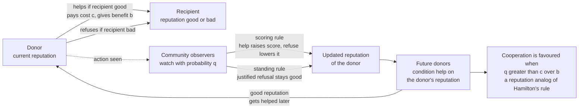

# 🪞 Indirect Reciprocity and Reputation

> [!abstract] TL;DR
> **Indirect reciprocity** is cooperation sustained by **reputation** rather than by repeated pairwise interaction: you help someone, your standing in the community rises, and later a **third party** helps *you* because they know you are a helper — *"I help you, and someone else helps me."* It solves the problem [direct reciprocity](## "requires the same two individuals to meet again and again") cannot — cooperation with **strangers** you may never meet again. Nowak & Sigmund showed it can invade and stabilize a defecting population precisely when the probability `q` of knowing a person's reputation exceeds the cost-to-benefit ratio: **`q > c/b`** — a reputation analog of Hamilton's rule. It is thought central to human ultra-cooperation and may have driven the evolution of **language, gossip, and morality**, and it powers modern online trust (seller ratings, reviews).

---

## Intuition

**Analogy:** Direct reciprocity says *"I scratch your back because you scratched mine."* It works only when the **same two people keep meeting** — like neighbours or a married couple who will settle the score next time. But humans routinely help **strangers they will never see again**: they donate to charity, give directions to a lost tourist, tip in a restaurant in a city they will never revisit, trade honestly with a brand-new supplier. Direct reciprocity cannot explain any of this — there is no "next time" with that person.

The missing ingredient is that **others are watching**. Help a stranger and word gets around: your **reputation** rises, and *someone else* — a third party who heard you are decent — helps you later. Refuse, and your reputation falls, and people quietly stop helping you. The debt is not repaid by the person you helped; it is repaid by the **community**, through the currency of reputation. This turns a one-shot, anonymous world back into a **repeated game against society at large**. And because reputation must be *observed, remembered, and communicated*, indirect reciprocity may be the evolutionary pressure that gave humans **language and gossip** (cheap ways to spread who-helped-whom), **moral judgment** (deciding who *deserves* help), and a permanent anxious concern for our own image — shame, pride, and the fear of being talked about.

---

## How It Works

### Core Mechanics

The canonical setting is the **donation game** (a one-shot Prisoner's-Dilemma-like giving game) played by a large, well-mixed population where partners are almost always new:

1. **Random donor-recipient pairs.** In each interaction one individual is the **donor**, the other the **recipient**. The donor chooses whether to **help** (pay a cost `c` to give the recipient a benefit `b`, with `b > c`) or **refuse**.
2. **Reputation / image score.** Every individual carries a **reputation** — in the simplest binary model, `GOOD` or `BAD`; in Nowak & Sigmund's original model, an integer **image score** from roughly `-5` to `+5`. Helping raises it; refusing lowers it.
3. **Conditional strategies.** A **DISCRIMINATOR** helps only recipients with a **good** reputation and refuses the rest ("help those who help others"). A **DEFECTOR** never helps. An **unconditional COOPERATOR** always helps, regardless of reputation.
4. **Observation is partial.** After each interaction the donor's action is seen by the community only with probability `q` (the **reputation-visibility** or reputation-spread probability). Seen actions update the donor's public reputation; unseen ones leave it unchanged. `q` captures how much gossip, direct observation, or record-keeping the society has.
5. **Payoff feeds back into fitness.** Over many rounds, individuals accumulate payoff; higher-payoff strategies reproduce (biologically) or are imitated (culturally). Whether cooperation survives depends on whether discriminators out-earn defectors.

**The condition (Nowak & Sigmund).** A discriminating, cooperative strategy can resist invasion by defectors — cooperation is evolutionarily favoured — when

> **`q > c / b`**

the probability of knowing a co-player's reputation must exceed the cost-to-benefit ratio of the helpful act. Read it as a **reputation analog of [Hamilton's rule](## "Hamilton: cooperate when relatedness r > c/b; here reputation-visibility q plays the role of relatedness")**: where kin selection replaces `r` (genetic relatedness) with reputation-visibility `q`. The more **transparent** reputations are, the wider the range of costly help that pays off.

### Assessment rules: the subtlety of moral judgment

*How* reputations are assigned is where the theory gets deep, because the rule itself must be evolutionarily stable:

- **First-order / image scoring (naive):** judge only the **action** — did the donor help or not? Simple, but it punishes *justified* refusal: a discriminator who correctly refuses a known defector is himself marked `BAD`, which can unravel discrimination.
- **Second-order / standing (Sugden):** judge the action **in context** — refusing to help a `BAD` recipient is **justified** and keeps you `GOOD`; refusing a `GOOD` recipient is not. This requires observers to also know the *recipient's* reputation.
- **The "leading eight" (Ohtsuki & Iwasa, 2004/2006):** an exhaustive search of the third-order assessment rules found exactly **eight** that stabilize cooperation. They share a moral logic: *justified defection is not condemned*, and *cooperating with the good is rewarded*.

### Flow / Architecture



---

## Key Concepts

### Secondary (school) level

- **One-line idea:** be kind where people can see, and your kindness comes back to you from *someone else*, because you have earned a good name.
- **Why it is different from tit-for-tat:** with tit-for-tat you help the person who helped *you*. With indirect reciprocity you help a **stranger**, and a *different* stranger helps you later — because your reputation travelled ahead of you.
- **Everyday feel:** this is why you behave better when you might be seen, why references and word-of-mouth matter, and why "what will people say?" is such a powerful motive.

### Undergraduate level

- **Donation game payoffs:** helping costs the donor `c` and gives the recipient `b`, with `b > c`. In a single anonymous round, refusing dominates — so cooperation needs a reason to expect a *future* return.
- **Discriminator vs defector vs unconditional cooperator:** discriminators condition on reputation; defectors never help; unconditional cooperators always help and are exploited by defectors (they even help known cheats).
- **The threshold `q > c/b`:** cooperation via reputation invades and resists defection only when reputation information is common enough. Below the threshold, image is too noisy to protect helpers and defection takes over.
- **Scoring vs standing:** first-order "did they help?" rules are simple but fragile; higher-order "did they help someone who *deserved* it?" rules are more robust but need more information and cognition.

### Graduate level

- **Reputation as a state variable.** The population is described not just by strategy frequencies but by the joint distribution of (strategy, reputation). Dynamics run on this augmented state; equilibria require consistency between how a strategy *acts* and the reputation it thereby *earns*.
- **The leading eight.** Ohtsuki & Iwasa's classification: among the `2^8` third-order assessment/action rule combinations, exactly eight are ESS-stable cooperators. All share four properties — maintain cooperation among the good, identify defectors, justify punishment (refusing a defector stays good), and re-admit the reformed. This is a mathematically derived skeleton of a **moral code**.
- **Private vs public assessment.** If everyone shares one public opinion (a "reputation ledger"), analysis is clean. With **private, disagreeing** opinions and **assessment errors**, cooperation is far harder to stabilize — an active research frontier (Hilbe, Radzvilavicius, Nowak). Perception errors can spiral into unjustified condemnation.
- **Second-order free-riders.** Tracking reputations, gossiping accurately, and withholding help from cheats are themselves **costly**. Individuals who enjoy a cooperative society but do not pay these information/enforcement costs are **second-order free-riders** — the same structural problem that plagues [costly punishment](## "who punishes the non-punishers?") and multilevel selection.
- **Relation to direct reciprocity.** Direct reciprocity is the special case where the "community" is a single repeated partner and reputation is your private memory of them. Indirect reciprocity generalizes memory from *the dyad* to *the group*.

---

## Python Demo

```python
# INDIRECT RECIPROCITY via IMAGE SCORING.
# A well-mixed population plays the one-shot DONATION GAME in random
# donor-recipient pairs. Three strategies:
#   DEFECT   - never help
#   DISCRIM  - help only recipients whose reputation is GOOD
#   ALLC     - unconditional cooperator: always help (a second-order free-rider)
# After each act the donor's reputation is OBSERVED with probability q and
# updated. We compare two moral assessment rules:
#   "scoring"  : GOOD iff you helped              (first-order)
#   "standing" : refusing a BAD recipient is JUSTIFIED -> stays GOOD (second-order)
# Result: discriminators sustain cooperation and beat defectors WHEN the
# reputation-visibility q exceeds c/b  (Nowak-Sigmund: q > c/b), a reputation
# analog of Hamilton's rule. We plot cooperation vs q and mark the threshold.

import numpy as np
import matplotlib.pyplot as plt

rng = np.random.default_rng(7)

# --- Donation game: benefit b to recipient, cost c to donor ---
b, c = 5.0, 1.0
THRESH = c / b                      # Nowak-Sigmund reputation threshold = 0.2
DEFECT, DISCRIM, ALLC = 0, 1, 2

def run(q, strat0, N=200, rounds=30, generations=200, assess="scoring",
        mu=0.002):
    """Agent-based Moran dynamics. Returns (coop_level, final_strategy_freqs,
    coop_trace, freq_trace)."""
    strat = strat0.copy()
    coop_trace, freq_trace = [], []
    for _ in range(generations):
        rep = np.ones(N, dtype=int)        # everyone starts GOOD (1); BAD = 0
        payoff = np.zeros(N)
        helps = acts = 0
        for _r in range(rounds):
            donors = rng.permutation(N)
            recips = np.roll(donors, rng.integers(1, N))   # derangement: d != r
            sd, rr = strat[donors], rep[recips]            # read at round start
            help = (sd == ALLC) | ((sd == DISCRIM) & (rr == 1))
            np.add.at(payoff, donors, -c * help)
            np.add.at(payoff, recips,  b * help)
            helps += int(help.sum()); acts += N
            seen = rng.random(N) < q                       # observed with prob q
            if assess == "scoring":
                good = help                                # first-order
            else:                                          # standing (2nd-order)
                good = help | (~help & (rr == 0))          # justified refusal ok
            upd = donors[seen]
            rep[upd] = good[seen].astype(int)
        coop_trace.append(helps / acts)
        freq = np.array([(strat == s).mean() for s in (DEFECT, DISCRIM, ALLC)])
        freq_trace.append(freq)
        # selection: fitness-proportional reproduction (Moran-style)
        fit = payoff - payoff.min() + 1e-6
        strat = strat[rng.choice(N, size=N, p=fit / fit.sum())].copy()
        # rare mutation keeps all strategies present
        m = rng.random(N) < mu
        strat[m] = rng.integers(0, 3, size=int(m.sum()))
    return np.mean(coop_trace[-40:]), np.array(freq_trace), np.array(coop_trace)

# ---------- Experiment 1: cooperation vs reputation-visibility q ----------
N = 200
half = np.array([DEFECT] * (N // 2) + [DISCRIM] * (N - N // 2))
qs = np.linspace(0.0, 1.0, 11)
coop_scoring  = [run(q, half, assess="scoring")[0]  for q in qs]
coop_standing = [run(q, half, assess="standing")[0] for q in qs]

# ---------- Experiment 2: three-strategy race at q above threshold ----------
q_hi = 0.9
start3 = rng.integers(0, 3, size=N)                 # random mix of all three
_, freq_trace, _ = run(q_hi, start3, generations=300, assess="standing")

# ---------------------------- Visualization ----------------------------
fig, ax = plt.subplots(1, 2, figsize=(13, 5))

ax[0].plot(qs, coop_scoring,  "o-", color="crimson", label="scoring (1st-order)")
ax[0].plot(qs, coop_standing, "s-", color="teal",    label="standing (2nd-order)")
ax[0].axvline(THRESH, color="gray", ls="--",
              label=f"threshold q = c/b = {THRESH:.2f}")
ax[0].axvspan(0, THRESH, color="crimson", alpha=0.06)
ax[0].set_xlabel("reputation-visibility  q")
ax[0].set_ylabel("cooperation level (fraction of acts that help)")
ax[0].set_title("Cooperation switches on once  q > c/b")
ax[0].set_ylim(-0.02, 1.02); ax[0].legend()

gens = np.arange(freq_trace.shape[0])
ax[1].stackplot(gens, freq_trace[:, DEFECT], freq_trace[:, DISCRIM],
                freq_trace[:, ALLC],
                labels=["defectors", "discriminators", "uncond. cooperators"],
                colors=["#b23", "#187", "#e9a"], alpha=0.85)
ax[1].set_xlabel("generation"); ax[1].set_ylabel("frequency")
ax[1].set_title(f"q = {q_hi}: discriminators beat defectors\nAND second-order-free-rider cooperators")
ax[1].set_ylim(0, 1); ax[1].legend(loc="center right")

plt.tight_layout(); plt.savefig("indirect_reciprocity.png", dpi=120)
print(f"threshold q* = c/b = {THRESH:.2f}")
print("coop (scoring): ", [round(x, 2) for x in coop_scoring])
print("coop (standing):", [round(x, 2) for x in coop_standing])
print("saved indirect_reciprocity.png")
```

**What the output shows.** In panel 1, cooperation stays near zero while reputation is too invisible (`q < c/b = 0.2`) and then **switches on** as `q` climbs past the threshold — the visible Nowak-Sigmund condition `q > c/b`, and a direct parallel to Hamilton's rule with visibility `q` playing the role of relatedness `r`. The **standing** rule sustains cooperation more robustly than naive **scoring**, because it does not punish discriminators for the justified refusal of known defectors. Panel 2 shows the three-way race at high visibility: **discriminators** win, driving out both defectors (who get marked `BAD` and cut off) and the **unconditional cooperators** — the *second-order free-riders* who help everyone, waste `c` on defectors, and so earn less than the discriminators who withhold help from the bad.

---

## Real-World Applications

> **Example — eBay / Amazon / Airbnb ratings are engineered indirect reciprocity.** A buyer and seller who will likely never transact again still cooperate (ship the goods, pay on time) because each interaction updates a **public reputation score** that *future* strangers condition on. The platform is literally a machine for making `q` (reputation-visibility) close to `1`, pushing well above `c/b` so that honest trade between strangers is the stable strategy. Uber/Airbnb reviews, freelancer ratings, and credit scores work identically.

- **Charity, blood donation, and public generosity.** People give far more when giving is **observed** (donor walls, public pledges, "I voted" stickers) — a textbook `q`-effect. Anonymous giving drops sharply, exactly as image-scoring predicts.
- **Honest trade with new partners.** Merchant guilds, the medieval *Law Merchant*, and modern B2B "trusted supplier" lists all propagate reputation so that first-time trade between strangers can be safe.
- **Gossip as a cooperation technology.** In small-scale societies, ethnographers find near-constant talk about who is generous, lazy, or a cheat. Gossip is the cheap, high-bandwidth channel that raises `q` — spreading reputation faster than direct observation ever could.
- **Open-source and academic reputation.** GitHub stars, citation counts, and Stack Overflow karma turn one-off contributions into durable reputational capital that third parties reward with jobs, collaboration, and trust.
- **Reputation attacks and the dark side.** Because the whole system runs on reputation *information*, it is gameable: **fake reviews**, review-bombing, sockpuppets, astroturfing, and paid ratings are attacks on `q`'s reliability. Defending reputation integrity is now a major applied problem.

---

## Common Pitfalls

- **Confusing it with direct reciprocity.** Direct reciprocity needs the **same pair** to meet repeatedly (memory of *your* history with *me*). Indirect reciprocity works among **strangers** via *community* memory. If you find yourself invoking "next time we meet," you are describing direct, not indirect, reciprocity.
- **Assuming naive image scoring is enough.** First-order scoring punishes **justified** refusal — a discriminator who correctly denies a known cheat gets marked bad — which can collapse cooperation. Stable cooperation generally needs **standing / higher-order** rules that judge actions *in context*. Getting the assessment rule wrong is the classic modelling error.
- **Ignoring second-order free-riders.** Assessing reputations, gossiping honestly, and refusing cheats are costly. Models that hand out reputation information "for free" hide the real problem: who pays to *maintain* the reputation system? Unconditional cooperators who never discriminate are the analog free-riders — they subsidize defectors.
- **Overrating transparency.** Real reputation is **noisy, private, and disputed**. Assessment errors and disagreeing opinions can trigger cascades of unjustified condemnation; a rule that is stable under *public* consensus can fail under *private* information. Do not assume everyone shares the same view of who is good.
- **Reputation manipulation.** Any real deployment must defend against fakes, Sybil attacks, and collusion. A reputation signal is only as valuable as it is hard to forge — otherwise `q` measures *noise*, not *truth*.
- **Treating `q > c/b` as automatic.** The threshold is a *possibility* result under idealized assumptions (well-mixed population, reliable observation, binary reputation). It tells you when reputation *can* sustain cooperation, not that it *will* in any given messy system.

---

## Related Concepts

- [[Evolutionarily_Stable_Strategies]] — the stability criterion behind "can discriminators resist invasion by defectors?"; indirect reciprocity asks when a reputation-conditional strategy is an ESS.
- [[The_Hawk_Dove_Game]] — a sibling donation-style conflict game; both use invasion analysis to find when a "nice" strategy survives.
- [[Fitness_Payoffs_and_Population_Games]] — the payoff-to-fitness machinery underlying the population dynamics simulated here.
- [[Repeated_Games_and_Folk_Theorems]] — direct reciprocity's home: cooperation from *repeated pairwise* play, the mechanism indirect reciprocity generalizes from the dyad to the community.
- [[Bargaining_Theory]] — the cooperative-game backbone of fairness and the ultimatum game, where concern for reputation and image also shapes offers.
- [[Prosocial_Behavior]] — the psychology of helping strangers, including the strong "audience effect" that empirically confirms reputation's pull.
- [[Moral_Development]] — how humans acquire the moral judgments (who *deserves* help) that higher-order assessment rules formalize.
- [[Kin_Selection_and_Altruism]] — Hamilton's `r > c/b`; indirect reciprocity is its reputation analog with visibility `q` replacing relatedness `r`.
- [[Social_Capital_and_Trust]] — the sociological counterpart: reputation networks are how trust is manufactured and stored between strangers.
- [[Identity_Stigma_and_Impression_Management]] — Goffman's dramaturgy: everyday reputation-management, the micro-behavior indirect reciprocity predicts should evolve.
- [[Evolutionary_Psychology_and_Cultural_Evolution]] — the argument that language, gossip, and morality co-evolved as machinery for cheap, wide reputation-spread.

*Sibling notes in this vault section, referenced above and still to be written, include `The_Prisoners_Dilemma_and_Cooperation`, `Direct_Reciprocity_and_Repeated_Games`, `Kin_Selection_and_Inclusive_Fitness`, `Group_and_Multilevel_Selection`, `Cultural_Evolution_and_Social_Learning`, `Fairness_Bargaining_and_the_Ultimatum_Game`, and `Evolutionary_Dynamics_in_Markets_and_Institutions`; each will link back here as the reputation-based mechanism of cooperation.*

---

## Review Questions

1. **(Secondary)** Direct reciprocity explains why you help a neighbour you will see again. Why can it *not* explain a large tip left in a distant city, or an anonymous-seeming act of charity — and how does *reputation* rescue the puzzle? Explain in the form "I help you, and ___ helps me because ___."
2. **(Undergraduate)** State the Nowak-Sigmund condition `q > c/b` in words and explain why it is called a "reputation analog of Hamilton's rule." If helping costs `c = 2` and benefits `b = 5`, how visible must reputations be for cooperation to be favoured? What happens to cooperation just below that value?
3. **(Graduate — scenario)** A design team builds a marketplace where refusing to trade with a *known scammer* lowers your rating just as much as refusing an honest buyer (pure first-order image scoring). Predict what happens to the population of "discriminating honest traders," name the assessment-rule flaw, and describe how a "standing" (second-order) rule and the leading-eight logic would fix it. Then explain the *second-order free-rider* cost the platform still has to pay, and one way reputation manipulation could break the whole scheme.

---

## Sources

- Nowak, M. A. & Sigmund, K. (1998). "Evolution of indirect reciprocity by image scoring." *Nature* 393, 573-577.
- Nowak, M. A. & Sigmund, K. (2005). "Evolution of indirect reciprocity." *Nature* 437, 1291-1298.
- Ohtsuki, H. & Iwasa, Y. (2004/2006). "How should we define goodness? — Reputation dynamics in indirect reciprocity" and "The leading eight." *Journal of Theoretical Biology* 231 & 239.
- Nowak, M. A. (2006). "Five rules for the evolution of cooperation." *Science* 314, 1560-1563.
- Alexander, R. D. (1987). *The Biology of Moral Systems.* Aldine de Gruyter.
- Sugden, R. (1986). *The Economics of Rights, Co-operation and Welfare.* Blackwell. (origin of the "standing" rule)

---

#evolutionary-game-theory #indirect-reciprocity #reputation #image-scoring #gossip
