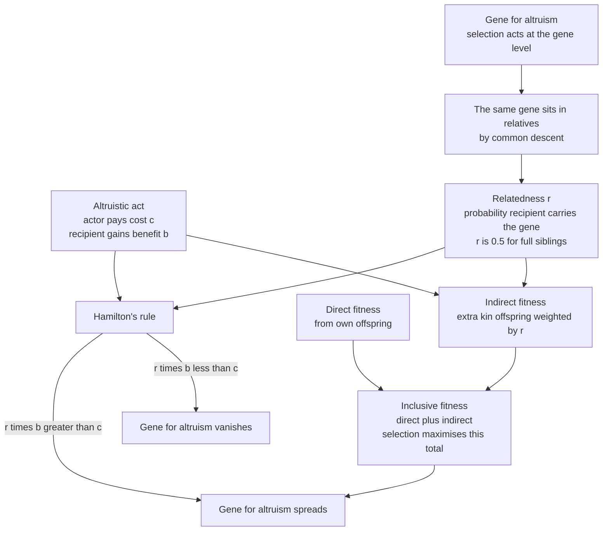

# 🐝 Kin Selection and Inclusive Fitness

> [!abstract] TL;DR
> Biological **altruism** — helping others at a cost to yourself — looks impossible under natural selection: a selfish individual should always out-reproduce a self-sacrificing one. **Kin selection** dissolves the paradox by moving the accounting from the individual to the **gene**. A gene for altruism can spread if it helps *copies of itself* sitting in relatives, even at a cost to its carrier. **Hamilton's rule** states exactly when: an altruistic act is favoured when `r·b > c`, where `r` is the **relatedness** between actor and recipient, `b` is the fitness **benefit** to the recipient, and `c` is the fitness **cost** to the actor. The full reckoning is **inclusive fitness** = direct fitness (own offspring) + indirect fitness (relatives' offspring weighted by `r`). This is the first and most fundamental mechanism for the evolution of cooperation, and its deep logic — relatives are fellow gene-carriers, so kinship creates **positive assortment** — connects it to every other cooperation mechanism.

---

## Intuition

**Analogy:** Why would a worker bee sting an intruder and die, or a ground squirrel stand up and scream an alarm call — drawing a hawk's attention to itself — to warn its burrow-mates? From the individual's point of view this is madness: the altruist pays with its life and leaves no offspring. But look again through the **gene's** eyes. That screaming squirrel's siblings each carry, on average, **half of its genes**. If one alarm call saves *three* siblings from the hawk, then more copies of the "sound-the-alarm" gene survive in those three rescued bodies than were lost in the one that got eaten. The gene wins even though its carrier loses.

The evolutionary geneticist **J.B.S. Haldane** put it as a joke that is also exact arithmetic: *"I would lay down my life for two brothers or eight cousins."* Two brothers each share half your genes — `2 × 0.5 = 1` whole genome's worth. Eight first cousins each share an eighth — `8 × 0.125 = 1`. In both cases the genes saved exactly balance the genes lost. Altruism toward kin is not selfless at all. It is genes quietly helping other copies of themselves — an organism is, as Dawkins put it, a gene's way of making more genes.

---

## How It Works

### The puzzle of altruism

Define **biological altruism** precisely: a behaviour that *lowers the actor's own reproductive success* while *raising the recipient's*. This is not about kindness or intent — a sterile worker ant and a virus can both be "altruistic" in this sense. The problem is stark. If a gene makes its carrier sacrifice reproduction for others, carriers leave fewer offspring than non-carriers, so the gene's frequency should fall every generation. Naive Darwinism predicts altruism is impossible. Yet it is everywhere: alarm calls, food sharing among vampire bats, predator mobbing, and — most spectacularly — the **sterile worker castes** of ants, bees, and wasps, who forgo reproduction *entirely* to raise the queen's brood. How can a gene for self-sacrifice spread?

### The gene's-eye view

The resolution, due to **W. D. Hamilton (1964)** and later popularised by Dawkins' *The Selfish Gene*, is to change the unit of accounting. Natural selection does not "care" about individuals; it tracks **genes** across generations. A gene is favoured whenever it increases the number of copies of *itself* in the next generation — and those copies can reside in the actor's own offspring **or** in the offspring of anyone who shares the gene by common descent. A relative is, genetically, partly "you." So a gene for helping relatives can spread by promoting copies of itself housed in other bodies, even while depressing the reproduction of the body it currently sits in. Selection at the gene level, not the individual level, is the key that unlocks altruism.

### Relatedness `r`: the currency of kinship

The **coefficient of relatedness** `r` is the probability that a gene in the actor is also present in the recipient **by common descent**. It measures how much of "you" is inside a relative:

- **Parent–offspring:** `r = 0.5`
- **Full siblings:** `r = 0.5`
- **Half-siblings / grandparent–grandchild / aunt–niece:** `r = 0.25`
- **First cousins:** `r = 0.125`
- **Full sisters under haplodiploidy (bees, ants, wasps):** `r = 0.75` (see below)
- **Unrelated individuals:** `r ≈ 0`

### Hamilton's rule

Weigh the benefit an altruistic act delivers to a relative by how much of your genes that relative carries, and compare it to what the act costs you. An altruistic gene spreads when

$$r \cdot b > c$$

where `r` is relatedness, `b` is the fitness **benefit** to the recipient, and `c` is the fitness **cost** to the actor. Help a relative when the relatedness-discounted benefit exceeds your own cost. This one inequality — often called *"the single most important theoretical result in social evolution"* — recovers Haldane's quip exactly: sacrificing yourself (`c = 1`) is favoured to save two brothers (`r·b = 0.5 × 2 = 1`) or eight cousins (`0.125 × 8 = 1`). Below those thresholds the gene dies; above them it spreads.

### Inclusive fitness

Hamilton's rule follows from a reconceptualisation of fitness itself. An individual's **inclusive fitness** is:

- **Direct fitness** — reproductive success from its *own* offspring, minus the cost of any help it gives; plus
- **Indirect fitness** — the *extra* offspring its help produces in **relatives**, each weighted by relatedness `r`.

$$\text{Inclusive fitness} = \underbrace{\text{own offspring} - \text{costs}}_{\text{direct}} + \underbrace{\sum_i r_i \cdot (\text{extra offspring of relative } i)}_{\text{indirect}}$$

Natural selection maximises **inclusive fitness**, not personal reproduction. A sterile worker has zero *direct* fitness yet can have enormous *indirect* fitness by raising hundreds of siblings — which is why "self-sacrifice" is, at the gene level, self-promotion.



### Kin selection as positive assortment

Here is the deepest reading. Kin selection works because relatedness creates **positive assortment**: altruists end up interacting preferentially with fellow altruists — namely their relatives, who disproportionately carry the same altruism gene. Relatedness is simply *one route* to that assortment. The general principle is that **cooperation evolves whenever cooperators meet cooperators more often than chance** — and `r` can be read as a general measure of that assortment, not merely a genealogical fraction. This is the thread tying kin selection to *every* cooperation mechanism (spatial structure, repetition, tags): all of them work by generating assortment. Hamilton's rule is the general statement; kinship is the special case.

---

## Key Concepts

**Secondary (intuition level)**
- **Altruism** = helping others at a cost to yourself; it looks impossible under "survival of the fittest."
- The trick: your relatives carry copies of your genes, so helping them is another way of copying *yourself*.
- **Haldane's quip** — "two brothers or eight cousins" — is really just arithmetic: `2 × ½ = 1` and `8 × ⅛ = 1`.

**Undergraduate (formal level)**
- **Coefficient of relatedness** `r`: probability a gene in the actor is shared by descent with the recipient (½ sibs, ¼ half-sibs, ⅛ cousins).
- **Hamilton's rule** `rb > c`: an altruistic allele increases in frequency exactly when the relatedness-weighted benefit exceeds the cost.
- **Inclusive fitness** = **direct** (own reproduction net of costs) + **indirect** (relatives' extra reproduction weighted by `r`); selection maximises this total.
- **Haplodiploidy** raises sister–sister relatedness to `r = 0.75`, a classic (partial) explanation for eusociality.

**Graduate (research level)**
- **Hamilton's rule as assortment**: `r` generalises to *any* mechanism producing positive assortment between altruists (Price equation, Grafen's geometric view, Fletcher–Doebeli); kin structure is one generator among many.
- **The Price equation** gives an exact covariance decomposition of selection that yields Hamilton's rule under additivity; violations of additivity (synergy, nonlinearity) require generalised inclusive-fitness accounting.
- **Kin selection vs multilevel/group selection**: the **Nowak–Tarnita–Wilson (2010)** controversy; the mainstream view is that inclusive fitness and multilevel selection are *equivalent accounting schemes* for the same evolutionary process, not competing forces.
- **Greenbeard effects**: a single gene (or tight linkage) coding *both* a recognisable signal *and* altruism toward signal-bearers achieves assortment **without** genealogical kinship — observed in slime molds (`csA`) and yeast (`FLO1`); demonstrates that shared genes, not shared ancestors per se, are the real currency.

---

## Python Demo

This demo makes **Hamilton's rule the literal threshold** of an evolutionary dynamic. We model a **donation game**: an *altruist* pays a cost `c` to give a benefit `b` to its social partner; a *defector* gives nothing. Interactions are **assorted** by a parameter `r` — with probability `r` you meet a partner *guaranteed to share your type* (a relative), and with probability `1 − r` you meet a random member of the population. Working through the algebra, an altruist's fitness exceeds a defector's by exactly `r·b − c`, **independent of the current frequency** — so altruism spreads precisely when `r·b > c`. We then check this against real relatedness values and visualise the `rb > c` frontier.

```python
# Hamilton's rule as the threshold of selection.
# Altruist pays cost c, gives benefit b to partner; defector gives nothing.
# Assortment r: with prob r you meet a same-type partner (a relative),
# with prob (1 - r) you meet a random member of the population.
# Result: fitness(altruist) - fitness(defector) = r*b - c, independent of frequency.
import numpy as np
import matplotlib.pyplot as plt

def selection_dynamics(p0, r, b, c, w0=1.0, generations=60):
    """Discrete replicator dynamics for the frequency p of the altruist allele."""
    p = np.empty(generations + 1)
    p[0] = p0
    for t in range(generations):
        pt = p[t]
        # Probability the partner is an altruist, conditioned on own type:
        q_if_altruist = r + (1.0 - r) * pt   # relative (same type) or random draw
        q_if_defector = (1.0 - r) * pt       # only the random draw can be an altruist
        W_alt = w0 - c + b * q_if_altruist   # altruist always pays c, gains b if partner helps
        W_def = w0 + b * q_if_defector       # defector pays nothing, gains b if partner helps
        mean_W = pt * W_alt + (1.0 - pt) * W_def
        p[t + 1] = pt * W_alt / mean_W       # allele frequency after selection
    return p

# ---- Fixed benefit/cost; Hamilton threshold is r* = c/b -------------------
b, c = 3.0, 1.0
r_star = c / b                                # = 1/3 : altruism spreads iff r > 1/3

# Real relatedness values, labelled by kin category
kin = [
    ("Haplodiploid sisters", 0.75),
    ("Full sibs / parent-offspring", 0.50),
    ("Half-sibs / grandparent", 0.25),
    ("First cousins", 0.125),
    ("Unrelated", 0.0),
]

fig, (ax1, ax2, ax3) = plt.subplots(1, 3, figsize=(16, 4.8))

# ---- Panel 1: allele-frequency trajectories for each relatedness ----------
colors = plt.cm.viridis(np.linspace(0.1, 0.9, len(kin)))
for (label, r), col in zip(kin, colors):
    traj = selection_dynamics(p0=0.1, r=r, b=b, c=c)
    favored = r * b > c
    ax1.plot(traj, color=col, lw=2.4,
             label=f"{label}  r={r:g}  (rb-c={r*b-c:+.2f})",
             ls="-" if favored else "--")
ax1.axhline(0.1, color="gray", ls=":", lw=1)
ax1.set_title(f"Selection dynamics  (b={b}, c={c},  threshold r*=c/b={r_star:.2f})")
ax1.set_xlabel("generation")
ax1.set_ylabel("frequency of altruist allele")
ax1.set_ylim(-0.03, 1.03)
ax1.legend(fontsize=7.5, loc="center right")
ax1.grid(alpha=0.3)

# ---- Panel 2: selection coefficient rb - c for each kin category ----------
labels = [k[0] for k in kin]
rs = np.array([k[1] for k in kin])
s = rs * b - c                                # >0 favours altruism, <0 opposes it
bar_colors = ["#2ca02c" if v > 0 else "#d62728" for v in s]
ax2.barh(labels, s, color=bar_colors)
ax2.axvline(0, color="black", lw=1.5)
for y, v in enumerate(s):
    ax2.text(v + (0.05 if v >= 0 else -0.05), y, f"{v:+.2f}",
             va="center", ha="left" if v >= 0 else "right", fontsize=9)
ax2.set_title("Hamilton's rule: selection coefficient  r*b - c")
ax2.set_xlabel("rb - c   (green: altruism favoured, red: opposed)")
ax2.invert_yaxis()
ax2.grid(alpha=0.3, axis="x")

# ---- Panel 3: the rb > c frontier in (r, b) space, cost c fixed -----------
r_grid = np.linspace(0.001, 1.0, 300)
b_grid = np.linspace(0.0, 6.0, 300)
R, B = np.meshgrid(r_grid, b_grid)
favoured = (R * B - c > 0).astype(float)      # 1 where altruism spreads
ax3.contourf(R, B, favoured, levels=[-0.5, 0.5, 1.5],
             colors=["#f4c7c3", "#c8e6c9"])
ax3.plot(r_grid, c / r_grid, "k-", lw=2, label="Hamilton frontier  rb = c")
# Mark each real relatedness value at the demo's benefit b
for label, r in kin:
    ax3.scatter(r, b, s=70,
                color="#2ca02c" if r * b > c else "#d62728",
                edgecolor="black", zorder=5)
    ax3.annotate(f"r={r:g}", (r, b), textcoords="offset points",
                 xytext=(4, 6), fontsize=8)
ax3.set_xlim(0, 1); ax3.set_ylim(0, 6)
ax3.set_title(f"rb > c frontier  (cost c = {c})")
ax3.set_xlabel("relatedness r")
ax3.set_ylabel("benefit b")
ax3.legend(loc="upper right", fontsize=9)

fig.suptitle("Kin-selected altruism spreads exactly when r*b > c", fontsize=14)
fig.tight_layout(rect=[0, 0, 1, 0.94])
plt.savefig("hamiltons_rule.png", dpi=120)

print(f"Hamilton threshold r* = c/b = {r_star:.3f}")
for label, r in kin:
    verdict = "SPREADS " if r * b > c else "dies out"
    print(f"  {label:32s} r={r:<6g} rb-c={r*b - c:+.2f}  -> altruism {verdict}")
plt.show()
```

Reading the output: with `b = 3`, `c = 1`, the threshold is `r* = c/b = 1/3`. Panel 1 shows the altruist allele *rising to fixation* (solid lines) for haplodiploid sisters (`r = 0.75`) and full siblings (`r = 0.5`), but *decaying to extinction* (dashed) for half-sibs, cousins, and unrelated partners — the crossover sits exactly at `r = 1/3`. Panel 2 confirms the sign of `rb − c` flips there. Panel 3 draws the full `rb = c` frontier: everything above-right of the curve favours altruism. The lesson generalises past genealogy — `r` is really an **assortment** parameter, so *any* process (spatial clustering, greenbeard tags) that raises the chance a cooperator meets a cooperator moves you across the same frontier.

---

## Real-World Applications

- **Eusocial insects (ants, bees, wasps).** Sterile workers achieve their entire evolutionary success *indirectly*, by raising the queen's brood. Under **haplodiploidy** (males from unfertilised eggs), full sisters share `r = 0.75` — more related to sisters than to their own hypothetical daughters (`r = 0.5`) — so raising sisters can out-compete personal reproduction. Hamilton's original explanation; now understood as *one* factor alongside lifetime monogamy and ecology.
- **Alarm calls in ground squirrels.** Belding's ground squirrels give predator alarm calls, and females (who live near relatives) call far more than dispersing males — the indirect-fitness benefit only exists when neighbours are kin, exactly as Hamilton's rule predicts.
- **Cooperative breeding.** In meerkats, Florida scrub-jays, and naked mole-rats, non-breeding "helpers at the nest" raise siblings' young; helping effort scales with relatedness to the brood.
- **Human kinship and nepotism.** Preferential aid to genetic kin, inheritance flowing down bloodlines, and the cross-cultural structure of kinship systems all bear the fingerprint of inclusive fitness (see `[[Kinship_Marriage_and_Family_Systems]]`).
- **Microbial cooperation and greenbeards.** Slime molds and yeast use single-gene recognition tags (`csA`, `FLO1`) so cooperators clump with cooperators — direct genetic assortment without genealogical kinship, the greenbeard mechanism made real.
- **Genomic conflict.** Genomic imprinting and parent–offspring conflict (weaning, sibling rivalry) arise because relatedness is *asymmetric* — a mother is equally related to all offspring, but each offspring is more related to itself, so Hamilton's rule is applied from clashing viewpoints.

---

## Common Pitfalls

- **Confusing biological with psychological altruism.** Hamilton's altruism is a *fitness* accounting term — no kindness, intent, or awareness is implied. A gene, a bacterium, or a suicidal aphid soldier can be "altruistic."
- **"For the good of the species."** Kin selection is *not* naive group selection. Alarm calls evolve to propagate the caller's genes in kin, not to benefit the species. Species-level benefit is a discredited shorthand.
- **Misreading `r` as "fraction of shared DNA."** All humans share ~99.9% of their genome. `r` is the probability of sharing a gene **by recent common descent** *above baseline* — the relevant excess, not total genetic identity.
- **Treating haplodiploidy as the whole story of eusociality.** The `r = 0.75` sister bonus is undermined by the fact that workers are only `r = 0.25` related to brothers, and eusociality also arose in *diploid* termites and mole-rats. Lifetime monogamy and ecological constraints matter as much.
- **Assuming Hamilton's rule always holds exactly.** The simple `rb > c` form requires **additive, independent** fitness effects. With synergy or strong nonlinearity you need the generalised Price-equation form, or the inequality can mislead.
- **Framing kin selection vs group selection as a factual dispute.** They are largely *equivalent accounting systems* for the same dynamics; arguing which is "true" confuses bookkeeping with biology.

---

## Related Concepts

- [[Fitness_Payoffs_and_Population_Games]] — supplies the payoff-as-fitness foundation; kin selection is what happens when the "population mix" an individual meets is assorted by relatedness rather than random.
- [[Evolutionarily_Stable_Strategies]] — an altruism allele that satisfies `rb > c` is uninvadable by defectors; Hamilton's rule is the ESS condition for assorted interactions.
- [[Replicator_Dynamics]] — the explicit selection dynamic the Python demo runs; kin structure enters as the assortment term that shifts the growth rate by `rb − c`.
- [[The_Hawk_Dove_Game]] — the canonical EGT contest; relatedness between opponents changes its ESS, since harming a relative Hawk carries an inclusive-fitness cost.
- [[Natural_Selection_and_Adaptation]] — the biological engine; this note already introduces Hamilton's rule and kin selection as the resolution to the altruism paradox.
- [[Population_Genetics]] — the allele-frequency machinery underpinning relatedness and the spread of social alleles.
- [[Population_Genetics_and_Hardy_Weinberg]] — the no-selection null model against which the change in an altruism allele's frequency is measured.
- [[Meiosis_and_Genetic_Variation]] — recombination and independent assortment set the `r = 0.5` sibling relatedness baseline that Hamilton's rule weighs benefits by.
- [[Kinship_Marriage_and_Family_Systems]] — the anthropological structures of human kinship that inclusive-fitness theory helps explain (nepotism, descent, alliance).
- [[Evolutionary_Psychology_and_Cultural_Evolution]] — extends kin-selected motives to human social cognition, kin recognition, and family behaviour.

> Sibling notes planned for this vault — *The Prisoner's Dilemma and Cooperation*, *Group and Multilevel Selection*, *Spatial and Network Games*, *Microbial Games and Public Goods*, and *Sex Ratios and the Fisher Principle* — will expand the cooperation mechanisms, greenbeard/assortment models, and sex-allocation applications referenced above once created.

---

## Review Questions

**Tier 1 — Conceptual**
1. Biological altruism lowers the actor's fitness and raises the recipient's. Explain in one or two sentences why this seems impossible under natural selection, and how the gene's-eye view resolves the paradox.
2. State Hamilton's rule and define each of its three quantities. Use it to verify Haldane's claim that he would give his life for "two brothers or eight cousins."

**Tier 2 — Applied**
3. A ground squirrel can give an alarm call that raises each of its 4 full siblings' survival by `b = 0.3` but lowers its own by `c = 0.5`. Compute `rb` and decide whether the calling allele spreads. What if the neighbours were unrelated?
4. In the Python demo, altruists and defectors get the same benefit term from the random-partner draw, yet altruists still win when `rb > c`. Trace the algebra showing why the fitness difference reduces to `rb − c` and why it is independent of the current allele frequency.

**Tier 3 — Analytical / Open-ended**
5. Kin selection is often described as a *special case* of "cooperation via positive assortment." Explain what assortment means here, why relatedness generates it, and how a greenbeard gene achieves the same effect with no genealogical kinship. What does this imply about whether "kin" is fundamental?
6. Haplodiploidy gives full sisters `r = 0.75`, historically offered as *the* explanation for insect eusociality. Give two reasons this explanation is now considered incomplete, and describe what additional factors (relatedness to brothers, monogamy, ecology) must be brought in.

---

## Sources

- Hamilton, W. D. (1964). "The genetical evolution of social behaviour, I & II." *Journal of Theoretical Biology*, 7(1), 1–52. — the founding papers of inclusive-fitness theory and Hamilton's rule.
- Dawkins, R. (1976). *The Selfish Gene*. Oxford University Press. — the popular articulation of the gene's-eye view and greenbeard thought experiment.
- Maynard Smith, J. (1982). *Evolution and the Theory of Games*. Cambridge University Press. — connects kin selection to ESS and evolutionary game theory.
- Nowak, M. A., Tarnita, C. E., & Wilson, E. O. (2010). "The evolution of eusociality." *Nature*, 466, 1057–1062. — the controversial critique of inclusive fitness and the kin-vs-group-selection debate.
- West, S. A., Griffin, A. S., & Gardner, A. (2007). "Social semantics: altruism, cooperation, mutualism, strong reciprocity and group selection." *Journal of Evolutionary Biology*, 20(2), 415–432. — a careful clarification of definitions and the assortment view.

---

#evolutionary-game-theory #kin-selection #inclusive-fitness #hamiltons-rule #altruism
