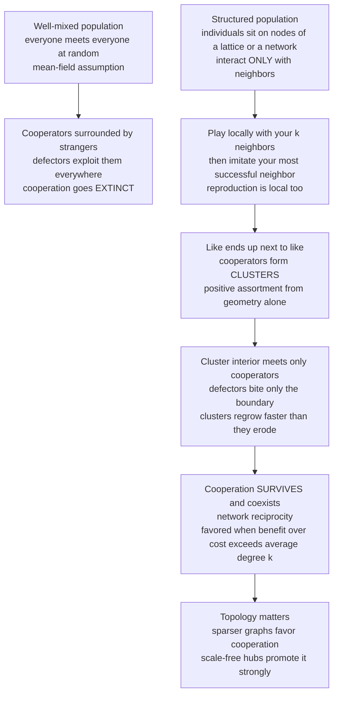

# 🕸️ Spatial and Network Games

> [!abstract] TL;DR
> Standard evolutionary game theory assumes a **well-mixed** population — everyone is equally likely to meet everyone, a mean-field crowd of strangers. In that world, cooperators are surrounded by defectors who exploit them and cooperation goes **extinct**. But real populations are **structured**: organisms interact with **neighbors in space** or **contacts in a network**, not a random draw. Put the game on a **grid or a graph** and everything changes. When individuals interact **locally** and imitate successful neighbors, cooperators can **cluster together** into protective islands where they preferentially help — and are helped by — other cooperators. The cluster **interior** never touches a defector; only the boundary is exposed, and clusters can regrow faster than defectors erode them. This is **spatial / network reciprocity** — the fifth of Nowak's five rules for cooperation, and the essence is one line: *cooperators help their neighbors, and their neighbors are cooperators.* Nowak & May's 1992 spatial Prisoner's Dilemma made this vivid: cooperation not only survives but produces ever-shifting, chaotic, fractal-like **spatial patterns**. **Evolutionary graph theory** (Lieberman-Hauert-Nowak; Ohtsuki et al.) generalizes this to arbitrary networks and yields a clean condition — cooperation is favored roughly when the **benefit-to-cost ratio exceeds the average degree**, `b/c > k`, so **sparser** networks favor cooperation more. Spatial structure also rescues **cyclic** games (Rock-Paper-Scissors spiral waves) and explains cooperation in **microbial biofilms**, ecology, and social networks. The lesson: *where* you interact matters as much as *how*.

---

## Intuition

**Analogy:** Imagine a village of generous people scattered through a giant, anonymous city. Every day each generous person is thrown into a random crowd of strangers, gives away favors, and gets nothing back — the takers, mixed in everywhere, feast on them and multiply. Generosity is a losing strategy and dies out. That is the **well-mixed** world.

Now change one thing: let people mostly interact with the **neighbors next door**. The generous families naturally **cluster** on the same few streets. Inside such a neighborhood, a generous person's neighbors are *also* generous — they trade favors among themselves and all prosper. A taker who moves in can only exploit the households on the **edge** of the cluster; he can never reach the well-fed interior, and meanwhile the thriving cooperative core keeps spreading its generous children onto the surrounding blocks faster than the takers can nibble the boundary. **The same generosity that dies among strangers survives — and flourishes — among neighbors.** Simply putting the game on a **map** or a **social network**, so that *who is next to whom* matters, can rescue cooperation that was doomed in the crowd. That single structural change is the whole idea.

---

## How It Works

### Beyond the well-mixed assumption

Classical evolutionary dynamics — the [[Replicator_Dynamics|replicator equation]] and the well-mixed [[Finite_Populations_and_Stochastic_Dynamics|Moran process]] — assume a **mean-field** population: the payoff of a strategy depends only on the *global* frequencies, as if every individual played an average opponent drawn uniformly from the whole population. That is a mathematically convenient fiction. Real organisms are **embedded in space** (plants root where their seed fell, cells sit in a tissue, animals hold territories) or in a **contact network** (friends, trade partners, sexual contacts). Interaction is **local and repeated with the same neighbors**, not random. Population structure is not a minor correction — for cooperation it is the difference between extinction and survival.

### The mechanism: spatial / network reciprocity

Place each individual on a **node** of a lattice or graph; edges are the interaction partners. Two local rules drive the dynamics:

1. **Play locally.** Each node plays the game (say, the Prisoner's Dilemma) with each of its `k` neighbors and accumulates a total payoff. A cooperator pays a cost `c` to give each neighbor a benefit `b`; a defector pays nothing and gives nothing.
2. **Reproduce / imitate locally.** Strategies spread only to neighbors — an individual copies the strategy of the most successful node in its neighborhood (imitation), or a node's offspring replaces a neighbor (birth-death / death-birth).

Because reproduction is local, **like ends up next to like**: the offspring of cooperators are cooperators sitting *adjacent* to their cooperator parents. This creates **positive assortment** — cooperators disproportionately interact with cooperators — purely from the geometry, without any kinship recognition, memory, or reputation. A **cluster** of cooperators is self-reinforcing: interior members collect `k·b` in benefits from all-cooperator neighborhoods, while defectors can only exploit the thin boundary. If a cooperator on the edge of a large cluster still out-earns a neighboring defector, the cluster **grows**. This is **spatial reciprocity** (on lattices) and **network reciprocity** (on general graphs) — Nowak's **fifth rule** for the evolution of cooperation. The slogan captures it exactly: *cooperators help their neighbors, and their neighbors are cooperators.*

### Nowak & May's spatial Prisoner's Dilemma (1992)

The seminal model is startlingly simple. Take a 2D **lattice**; each cell is a Cooperator or a Defector and plays the Prisoner's Dilemma with its **8 Moore neighbors** (and itself). Payoffs are stripped to essentials: mutual cooperation scores `1`, a defector exploiting a cooperator scores `b > 1` (the temptation), and everything involving a defector's victim scores `0`. Each cell sums its payoff over the neighborhood; then — the **update rule** — every cell **adopts the strategy of the highest-scoring cell in its neighborhood** (deterministic imitate-the-best), synchronously.

The result overturned the well-mixed verdict. In a well-mixed Prisoner's Dilemma, defection dominates and cooperation vanishes. On the lattice, cooperation **persists indefinitely** through ever-shifting **clusters** — cooperator domains grow, collide, and fragment, with defectors gnawing the boundaries and cooperators healing them. For temptation values in a broad window (famously `b ≈ 1.8` to `2.0`), the dynamics are **chaotic** and generate mesmerizing, dynamic, **fractal-like** spatial patterns; the cooperator fraction fluctuates around a characteristic value (Nowak & May reported ~`0.318`) largely independent of the starting mix. **Space alone rescued cooperation** — no repetition, no reputation, no relatedness required.

### Evolutionary graph theory and the `b/c > k` rule

Nowak & May's lattice is one graph; **evolutionary graph theory** (Lieberman, Hauert & Nowak 2005; Ohtsuki, Hauert, Lieberman & Nowak 2006) generalizes to **any** network: nodes are individuals, edges are interactions, and a Moran-style birth-death or death-birth process runs on the graph. The landmark analytic result is astonishingly clean. Under **death-birth** updating on a regular graph where each node has `k` neighbors, weak selection favors cooperation in the additive donation game precisely when

$$\frac{b}{c} > k$$

the **benefit-to-cost ratio exceeds the average degree**. The interpretation is intuitive: on a graph, a cooperator's benefit is diluted among its `k` neighbors, so the *fewer* neighbors you have, the more concentrated the mutual benefit within a cluster, and the easier cooperation evolves. **Sparser networks favor cooperation; denser ones approach the well-mixed limit** where `k → N` and cooperation dies. This single inequality unifies spatial and network reciprocity into one general condition.

### Topology matters: heterogeneity and hubs

The `b/c > k` rule is exact for **regular** graphs (every node the same degree). Real networks are **heterogeneous** — some are **scale-free**, with a few high-degree **hubs** and many low-degree nodes ([[Small_World_and_Scale_Free_Networks|scale-free structure]]). Degree distribution, clustering coefficient, and degree correlations all reshape the outcome. Santos & Pacheco (2005) showed that **scale-free networks strongly promote cooperation**: cooperative **hubs** become highly successful, their many neighbors imitate them, and cooperation cascades through the network's core. Heterogeneity, clustering, and community structure are therefore first-class levers — the *shape* of the contact network, not just its average degree, decides whether cooperation thrives.

### Update rules are a crucial modeling choice

A subtle but decisive detail: the **outcome depends on how strategies spread**. Common rules — **imitate-the-best** (copy the fittest neighbor), **death-birth** (a node dies, neighbors compete to fill it proportional to fitness), **birth-death** (a node reproduces, offspring replaces a random neighbor), and **pairwise comparison** (adopt a neighbor's strategy with probability increasing in its payoff advantage) — give **different** conditions for cooperation. The famous `b/c > k` result holds for **death-birth** but *not* birth-death (which, on a graph, often reduces to the well-mixed prediction with no benefit from structure). Spatial models are genuinely **sensitive to microscopic update dynamics**, boundary conditions, and synchronous-vs-asynchronous updating; two papers modeling "the same" system can disagree because they chose different update rules.



---

## Key Concepts

### Secondary (school) level

- **Neighbors, not strangers.** In a crowd of strangers, generous people get used and disappear. If instead you mostly deal with the people **next to you**, the generous ones can group together and look after each other.
- **Safety in clusters.** A block full of cooperators is like a fort: the people inside only ever meet other cooperators, so they do well. Takers can only pester the ones on the **edge**.
- **A grid saves cooperation.** The exact same game where cooperation dies in the crowd lets cooperation **live** once you put everyone on a map so that location matters.

### Undergraduate level

- **Well-mixed vs structured.** Mean-field EGT assumes payoffs depend only on global frequencies. **Structured** populations put individuals on a **lattice** (spatial) or **graph** (network) and restrict interaction and reproduction to **neighbors**.
- **Spatial / network reciprocity.** Local reproduction creates **positive assortment** (cooperators cluster with cooperators) with no kin recognition or memory. This is Nowak's **fifth mechanism** for the evolution of cooperation, alongside kin selection, direct reciprocity, indirect reciprocity, and group selection.
- **Nowak & May's model.** A 2D lattice Prisoner's Dilemma with 8 neighbors, temptation `b`, and imitate-the-best updating. Cooperation **persists via clusters**; for `b ≈ 1.8`–`2.0` the patterns are chaotic and fractal-like, unlike the well-mixed extinction.
- **The `b/c > k` rule.** On a regular graph of degree `k` under death-birth updating and weak selection, cooperation is favored when the benefit-to-cost ratio beats the average number of neighbors. **Sparser networks help cooperation.**

### Graduate level

- **Pair approximation and identity-by-descent.** The `b/c > k` condition is derived by tracking **pair correlations** (the probability that a neighbor of a cooperator is a cooperator) or, equivalently, via **coalescent / identity-by-descent** methods that compute the structure coefficient. The general condition takes the form `b/c > (something involving the network's assortment)`; for vertex-transitive graphs it collapses to `k`.
- **Update-rule dependence.** Death-birth and imitation updating localize competition and reward clustering, giving the `b/c > k` benefit; **birth-death** updating spreads competition globally and typically recovers the well-mixed result (no cooperation benefit). The distinction traces to *where selection acts* relative to *where interaction occurs* — the sensitivity is not a nuisance but a real feature of structured dynamics.
- **Heterogeneous networks.** On scale-free graphs the effective condition is set by the **degree distribution** and degree-degree correlations. Cooperative hubs act as amplifiers; Santos-Pacheco show cooperation dominance over wide ranges of the dilemma. Clustering coefficient and community structure further modulate outcomes ([[Network_Science_Fundamentals|network science]] language).
- **The double-edged nature of structure.** Spatial structure **usually** promotes cooperation but **not always**. For the **snowdrift (hawk-dove) game**, spatial structure can *reduce* cooperation relative to well-mixed, because local competition among cooperators is intensified. Whether structure helps or hurts depends jointly on the **payoff class**, the **update rule**, and the **network** — the honest picture is context-dependent, not a universal "space is good."
- **Connection to finite-population theory.** The whole apparatus is a structured [[Finite_Populations_and_Stochastic_Dynamics|fixation-probability]] analysis: graphs can be **amplifiers or suppressors of selection** (star graphs amplify), and cooperation-favoring means the cooperator's fixation probability exceeds the neutral `1/N` on the given topology.

---

## Python Demo

This simulation implements **Nowak & May's spatial Prisoner's Dilemma** on a 2D lattice and visualizes the clustering that rescues cooperation. Each cell plays the PD with its **8 Moore neighbors** (plus itself), accumulates a payoff (mutual cooperation `= 1`, a defector exploiting a cooperator `= b > 1`, anything touching a defection to a defector `= 0`), and then **adopts the strategy of the highest-scoring cell in its neighborhood** (deterministic imitate-the-best). We start from mostly cooperators with a sprinkling of defectors and watch cooperators **survive by forming ever-shifting clusters** — producing the classic dynamic, chaotic, fractal-like patterns — while the cooperator fraction **stabilizes** at a coexistence value. For contrast we overlay the **well-mixed** prediction (the replicator dynamics of the same PD), where cooperation goes **extinct**. Snapshots use the classic four-color Nowak-May palette (blue = cooperator staying, red = defector staying, green = new cooperator, yellow = new defector) so invasion fronts light up. Pure `numpy` + `matplotlib` (`imshow`).

```python
# NOWAK & MAY SPATIAL PRISONER'S DILEMMA on a 2D lattice.
# Each cell (Cooperator=1 / Defector=0) plays the PD with its 8 Moore
# neighbors AND itself, sums the payoff, then IMITATES the highest-scoring
# cell in its 3x3 neighborhood. Space lets cooperators form CLUSTERS and
# survive -- unlike the well-mixed case, where cooperation goes extinct.
import numpy as np
import matplotlib.pyplot as plt
from matplotlib import gridspec
from matplotlib.colors import ListedColormap
from matplotlib.patches import Patch

rng = np.random.default_rng(3)

L        = 100        # lattice side (L x L cells)
b        = 1.85       # temptation to defect (1 < b < 2 -> dynamic patterns)
GENS     = 200        # generations to simulate
P_DEFECT = 0.10       # start: mostly cooperators, a few defectors
SNAP_AT  = [0, 1, 5, 60]   # generations to snapshot

# --- 3x3 neighborhood sum via periodic (toroidal) shifts (numpy only) ------
OFFS = [(dx, dy) for dx in (-1, 0, 1) for dy in (-1, 0, 1)]  # 9 cells incl self
def block_sum(a):
    """Sum of each cell's 3x3 neighborhood (self included), wrap-around."""
    s = np.zeros_like(a, dtype=float)
    for dx, dy in OFFS:
        s += np.roll(np.roll(a, dx, axis=0), dy, axis=1)
    return s

# --- one synchronous Nowak-May update -------------------------------------
def step(grid, b):
    C = grid.astype(float)                 # 1 where cooperator
    nC = block_sum(C)                      # cooperators the cell plays against
    # payoff: cooperator earns 1 per C-partner; defector earns b per C-partner.
    # (partners that are defectors give 0 to everyone -> nothing to add.)
    payoff = np.where(grid == 1, nC, b * nC)
    # imitate-the-best: adopt the strategy of the top scorer in the 3x3 block.
    best_pay = np.full_like(payoff, -np.inf)
    best_str = np.zeros_like(grid)
    for dx, dy in OFFS:
        p = np.roll(np.roll(payoff, dx, axis=0), dy, axis=1)
        s = np.roll(np.roll(grid,   dx, axis=0), dy, axis=1)
        take = p > best_pay
        best_pay = np.where(take, p, best_pay)
        best_str = np.where(take, s, best_str)
    return best_str

# --- run the spatial model -------------------------------------------------
grid = (rng.random((L, L)) > P_DEFECT).astype(int)   # 1=C, 0=D
frac_spatial, snaps = [], {}
for g in range(GENS + 1):
    frac_spatial.append(grid.mean())
    new = step(grid, b)
    if g in SNAP_AT:
        # 4-color transition map: 2*old + new
        # 0: D->D (red) | 1: D->C (green) | 2: C->D (yellow) | 3: C->C (blue)
        snaps[g] = 2 * grid + new
    grid = new
frac_spatial = np.array(frac_spatial)

# --- well-mixed contrast: replicator dynamics of the SAME PD ---------------
# fitness_C = x, fitness_D = b*x  (S=P=0). Since b>1, x -> 0: extinction.
x = 1.0 - P_DEFECT
frac_wellmixed = [x]
for _ in range(GENS):
    fC, fD = x, b * x
    mean = x * fC + (1 - x) * fD
    x = max(0.0, x + x * (fC - mean))      # discrete replicator step
    frac_wellmixed.append(x)
frac_wellmixed = np.array(frac_wellmixed)

# --- visualize -------------------------------------------------------------
cmap = ListedColormap(["#8B0000", "#2ecc71", "#f1c40f", "#2980b9"])
fig = plt.figure(figsize=(14, 8))
gs = gridspec.GridSpec(2, 4, height_ratios=[1.25, 1.0], hspace=0.28, wspace=0.08)

for i, g in enumerate(SNAP_AT):
    ax = fig.add_subplot(gs[0, i])
    ax.imshow(snaps[g], cmap=cmap, vmin=0, vmax=3, interpolation="nearest")
    ax.set_title(f"generation {g}", fontsize=11)
    ax.set_xticks([]); ax.set_yticks([])
fig.text(0.5, 0.955, f"Nowak-May spatial Prisoner's Dilemma  (b={b}, {L}x{L})  "
                     "-- cooperators SURVIVE by clustering",
         ha="center", fontsize=13, weight="bold")

legend = [Patch(color="#2980b9", label="C stays C"),
          Patch(color="#8B0000", label="D stays D"),
          Patch(color="#2ecc71", label="D -> C (cooperation spreads)"),
          Patch(color="#f1c40f", label="C -> D (defection spreads)")]
fig.legend(handles=legend, loc="lower center", ncol=4,
           bbox_to_anchor=(0.5, 0.47), fontsize=9, frameon=False)

axT = fig.add_subplot(gs[1, :])
axT.plot(frac_spatial, color="#2980b9", lw=2.2,
         label="SPATIAL lattice: cooperation persists (clusters)")
axT.plot(frac_wellmixed, color="#c0392b", lw=2.2, ls="--",
         label="WELL-MIXED replicator: cooperation goes extinct")
axT.axhline(frac_spatial[50:].mean(), color="gray", ls=":", lw=1,
            label=f"spatial coexistence ~ {frac_spatial[50:].mean():.3f}")
axT.set_xlabel("generation"); axT.set_ylabel("fraction of cooperators")
axT.set_ylim(-0.02, 1.02)
axT.set_title("Space rescues cooperation that dies in the well-mixed crowd",
              fontsize=11)
axT.legend(loc="center right", fontsize=9)

plt.savefig("nowak_may_spatial_pd.png", dpi=120, bbox_inches="tight")
print(f"spatial  final cooperator fraction: {frac_spatial[-1]:.3f} "
      f"(stabilizes near {frac_spatial[50:].mean():.3f})")
print(f"well-mixed final cooperator fraction: {frac_wellmixed[-1]:.3f} "
      "(cooperation extinct)")
print("For networks, cooperation is favored when b/c > k (average degree).")
plt.show()
```

**What the output shows.** The top row of snapshots captures the lattice at generations `0, 1, 5, 60`: an initially near-uniform sea of cooperators speckled with defectors evolves into intricate, ever-shifting **clusters**, with green invasion fronts (cooperation advancing) and yellow fronts (defection advancing) tracing chaotic, fractal-like boundaries — the beautiful dynamic patterns Nowak & May made famous. The bottom panel plots the cooperator fraction over time: on the **spatial lattice** (solid blue) it **stabilizes** at a coexistence value (near ~`0.3` for this `b`) instead of crashing, while the **well-mixed** replicator prediction for the identical game (dashed red) drives cooperation monotonically to **extinction**. Same game, two population structures, opposite fates — and the general network condition is `b/c > k`.

---

## Real-World Applications

> **Example — microbial biofilms and colonies:** Bacteria that secrete costly "public goods" (digestive enzymes, iron-scavenging siderophores, biofilm matrix) are cooperators; "cheaters" that consume these goods without producing them are defectors. In a **well-mixed** shaken flask, cheaters win and cooperation collapses. On a **surface** — an agar plate or a real biofilm — cells grow in place, so producers cluster near their own kind and preferentially share the goods with relatives, exactly the spatial-reciprocity mechanism. Spatial structure is a primary reason microbial cooperation is stable in nature, and is surveyed in the sibling note *Microbial_Games_and_Public_Goods*.

- **Spatial cyclic games and biodiversity.** Rock-Paper-Scissors that goes extinct when well-mixed forms **rotating spiral waves** on a lattice and coexists robustly and indefinitely — the classic `E. coli` colicin three-strain experiment (Kerr et al. 2002) confirmed that **local dispersal** maintains all three strains while global mixing collapses to one. See [[Cyclic_Dynamics_and_Rock_Paper_Scissors]] for the dynamics and *Microbial_Games_and_Public_Goods* for the biology.
- **Tumors and viruses.** Cancer is a spatial evolutionary game: cooperating (growth-factor-producing) and cheating cell lineages compete within a tissue's geometry, and spatial structure shapes which clones dominate — informing adaptive-therapy dosing. Viral defective-interfering particles and phage-bacteria dynamics play out on similarly structured landscapes.
- **Spread of behaviors and innovations on social networks.** Whether a cooperative norm, a new technology, or a cost-bearing behavior spreads depends on the **contact network** — its degree distribution, clustering, and hubs. Cooperative behavior clustering on real social graphs, and the promotion of cooperation by heterogeneous (scale-free) structure, connects to [[Network_Science_Fundamentals]] and [[Network_Dynamics_and_Contagion]], and to *Cultural_Evolution_and_Social_Learning* for how strategies are copied.
- **Ecological pattern formation.** Vegetation patterns in arid ecosystems, mussel-bed self-organization, and predator-prey spatial waves are governed by local facilitation vs competition — the same structured-interaction logic, echoing reaction-diffusion [[Morphogenesis_and_Pattern_Formation|pattern formation]] and self-organized [[Emergence_and_Self_Organization|emergence]].
- **Multi-agent systems on graphs (CS).** Distributed multi-agent reinforcement learning, peer-to-peer resource sharing, and cooperation in networked autonomous systems are engineered spatial/network games; the `b/c > k` intuition — sparser interaction graphs sustain cooperation — informs their design. This links to *Evolutionary_Dynamics_in_Markets_and_Institutions* for the economic reading.

---

## Common Pitfalls

- **"The well-mixed prediction is the answer."** The single biggest error. Mean-field EGT can give the **opposite** qualitative outcome to a structured population — cooperation goes extinct well-mixed but survives on a lattice. Always ask whether interaction is really random or local before trusting a replicator/well-mixed result.
- **"Spatial structure always promotes cooperation."** False in general. Structure **usually** helps the Prisoner's Dilemma, but for the **snowdrift (hawk-dove) game** it can *reduce* cooperation relative to well-mixed, because clustered cooperators compete more intensely with each other. Whether structure helps depends on the **payoff class**, the **update rule**, and the **network** — it is a powerful but context-dependent force.
- **"The update rule is a harmless detail."** It is decisive. **Death-birth** updating yields the celebrated `b/c > k` benefit; **birth-death** updating on the same graph often recovers the well-mixed result with *no* cooperation benefit. Reporting a spatial result without stating the update rule (and boundary/synchrony choices) makes it irreproducible.
- **"`b/c > k` is a universal law."** It is exact for **regular** graphs (all nodes degree `k`) under death-birth updating and weak selection. On **heterogeneous** networks the condition changes — degree distribution, correlations, and clustering all enter — so plugging the mean degree into `b/c > k` on a scale-free graph is wrong.
- **"Denser networks are better for cooperation."** Backwards. More neighbors (`k` large) dilutes the concentrated mutual benefit inside a cluster and pushes toward the well-mixed limit where cooperation dies. **Sparser** interaction favors cooperation.
- **"Clusters are static forts."** In the chaotic regime the clusters are **dynamic** — perpetually growing, colliding, and fragmenting. Cooperation persists as a **statistical steady state** (a stable coexistence fraction), not as frozen fixed domains; expecting a still image mistakes the phenomenon.

---

## Related Concepts

- [[Cyclic_Dynamics_and_Rock_Paper_Scissors]] — space transforms cyclic games too: well-mixed RPS goes extinct, but on a lattice it self-organizes into spiral waves that maintain all three strategies (the biodiversity-rescue counterpart of cooperation-rescue).
- [[Finite_Populations_and_Stochastic_Dynamics]] — spatial/network games are structured fixation problems; graphs act as amplifiers or suppressors of selection, and cooperation-favoring means a cooperator's fixation probability beats the neutral `1/N` on that topology.
- [[Replicator_Dynamics]] — the well-mixed, mean-field baseline that spatial structure departs from; the demo contrasts the lattice against exactly this equation's extinction prediction.
- [[Evolutionarily_Stable_Strategies]] — the well-mixed ESS concept is refined by structure: a strategy uninvadable in a crowd may be invadable on a graph, and vice versa.
- [[Fitness_Payoffs_and_Population_Games]] — the payoff-matrix foundation; the Prisoner's Dilemma and snowdrift games whose spatial versions behave so differently are drawn from here.
- [[Nash_Equilibrium]] — the classical solution concept whose evolutionary, structured refinement the `b/c > k` rule provides.
- [[Cellular_Automata]] — Nowak & May's lattice is a game-theoretic cellular automaton; the deterministic local-update-produces-global-pattern logic is shared.
- [[Network_Science_Fundamentals]] — degree, clustering, and topology are the graph properties that evolutionary graph theory shows control cooperation.
- [[Small_World_and_Scale_Free_Networks]] — heterogeneous, hub-dominated networks strongly promote cooperation (Santos-Pacheco), the topology that most departs from a regular lattice.
- [[Network_Dynamics_and_Contagion]] — the spread of strategies/behaviors on a network is the same process as contagion; cooperation clusters are self-sustaining "infections."
- [[Emergence_and_Self_Organization]] — cooperation clusters and RPS spiral waves are self-organized global patterns absent from the well-mixed case.
- [[Fractals_and_Self_Similarity]] — the chaotic Nowak-May cluster boundaries are fractal-like, a spatial-pattern signature of the dynamics.
- [[Cooperation_and_Evolutionary_Game_Theory]] — the Systems-Thinking overview of how cooperation evolves; spatial/network reciprocity is one of its five mechanisms.
- [[Graph_Theory]] — the mathematics of graphs (degree, adjacency, regularity) underlying evolutionary graph theory.
- [[Community_Ecology]] — intransitive and spatial competition as coexistence mechanisms; the ecological reading of structured games.
- [[Morphogenesis_and_Pattern_Formation]] — reaction-diffusion pattern formation is the biological analogue of the spatial patterns generated by structured games.

> Sibling notes planned for this Evolutionary Game Theory vault link here as the anchor on population structure: *The_Prisoners_Dilemma_and_Cooperation* (the base dilemma and Nowak's five rules), *Evolutionary_Dynamics_on_Graphs* (amplifiers/suppressors and the full `b/c > k` derivation), *Kin_Selection_and_Inclusive_Fitness* (assortment via relatedness, the kin counterpart of spatial assortment), *Microbial_Games_and_Public_Goods* (biofilm cooperation and colicin cycles), and *Cultural_Evolution_and_Social_Learning* (imitation as the spatial update rule).

---

## Review Questions

**Tier 1 — Conceptual**
1. In plain words, why do cooperators go extinct in a well-mixed population but survive on a grid? Use the idea of a cluster's protected **interior** versus its exposed **boundary**.
2. State the slogan of spatial/network reciprocity ("cooperators help their neighbors, and their neighbors are cooperators") and explain how **positive assortment** arises from local reproduction *without* any kin recognition, memory, or reputation.

**Tier 2 — Applied**
3. The network condition for cooperation is `b/c > k`. Explain why this means **sparser** networks favor cooperation more than dense ones, and what happens to the condition in the limit `k → N` (every node connected to every other).
4. You simulate the "same" spatial Prisoner's Dilemma as a colleague but get cooperation while they get extinction. Give two modeling choices (from the update rule, boundary conditions, synchrony, or temptation value `b`) that could explain the discrepancy, and say why each matters.

**Tier 3 — Analytical / Open-ended**
5. Spatial structure is said to be **double-edged**: it usually helps the Prisoner's Dilemma but can *hurt* cooperation in the snowdrift (hawk-dove) game. Explain the mechanism behind the reversal (hint: what does clustering do to competition *among cooperators* when the payoff to meeting a like type is low?), and what this implies about claims that "space promotes cooperation."
6. Both the spatial Prisoner's Dilemma (cooperation clusters) and spatial Rock-Paper-Scissors (spiral waves) show that structure rescues an outcome that dies when well-mixed. Compare the two: what is being rescued in each case, what pattern forms, and what single deeper principle about *local* interaction unifies them?

---

## Sources

- Nowak, M. A., & May, R. M. (1992). "Evolutionary games and spatial chaos." *Nature* 359, 826-829. — the seminal spatial Prisoner's Dilemma and its fractal patterns.
- Lieberman, E., Hauert, C., & Nowak, M. A. (2005). "Evolutionary dynamics on graphs." *Nature* 433, 312-316. — evolutionary graph theory; amplifiers and suppressors of selection.
- Ohtsuki, H., Hauert, C., Lieberman, E., & Nowak, M. A. (2006). "A simple rule for the evolution of cooperation on graphs and social networks." *Nature* 441, 502-505. — derivation of the `b/c > k` rule.
- Santos, F. C., & Pacheco, J. M. (2005). "Scale-free networks provide a unifying framework for the emergence of cooperation." *Physical Review Letters* 95, 098104. — heterogeneous networks and cooperative hubs.
- Nowak, M. A. (2006). "Five rules for the evolution of cooperation." *Science* 314, 1560-1563. — spatial/network reciprocity as the fifth mechanism.
- Hauert, C., & Doebeli, M. (2004). "Spatial structure often inhibits the evolution of cooperation in the snowdrift game." *Nature* 428, 643-646. — the double-edged nature of structure.

---

#evolutionary-game-theory #spatial-games #network-reciprocity #nowak-may #cooperation-clusters
