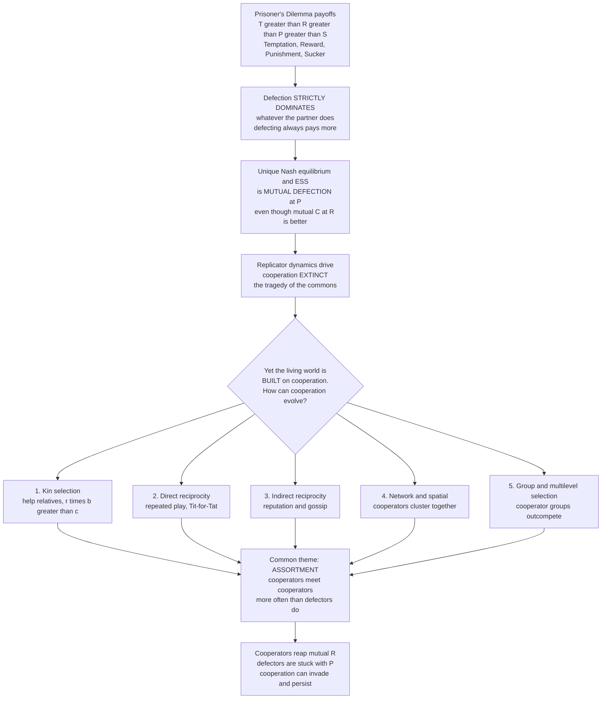

# 🤝 The Prisoner's Dilemma and the Evolution of Cooperation

> [!abstract] TL;DR
> The **Prisoner's Dilemma** is evolutionary game theory's crown-jewel puzzle. Two players each choose to **Cooperate** or **Defect**, with payoffs ordered `T > R > P > S` — the **T**emptation to cheat a cooperator beats the **R**eward for mutual cooperation, which beats the **P**unishment of mutual defection, which beats the **S**ucker's payoff. Because defecting pays more *whatever the partner does*, **defection strictly dominates**, and the only Nash equilibrium — and the only **ESS** — is **mutual defection**. In a population, replicator dynamics then drive cooperation **extinct**: selection seems to *forbid* cooperation. Yet the living world is *built* on cooperation — genes in genomes, cells in bodies, ants in colonies, humans in societies. Resolving this paradox is EGT's central quest, answered by **five mechanisms** (kin selection, direct reciprocity, indirect reciprocity, network/spatial structure, group selection), all of which work by creating **assortment** — making cooperators more likely to meet cooperators than defectors are.

---

## Intuition

**Analogy:** Two suspects are arrested and interrogated in separate rooms. If **both stay silent** (cooperate), the police have little and both get a light sentence. If **both talk** (defect), both get a heavy sentence. But if *one* talks while the other stays silent, the talker goes free and the silent one takes the maximum fall. Sitting alone, each reasons the same way: *"Whatever my partner does, I'm better off talking."* So both talk — and both end up worse off than if they had trusted each other and stayed silent. Individual rationality drives them straight into a collective disaster that *both* would have paid to avoid.

Now zoom out from two prisoners to all of life. This is the **deepest puzzle in all of science**: if selfishness always pays more than cooperation, why is the world *full* of cooperation? Cells sacrifice their independence to form bodies; ants forgo reproduction to build colonies; strangers keep promises to build civilizations. Evolution — a ruthless accountant that rewards whatever leaves more copies — seems to **forbid** cooperation, yet cooperation **built everything**. That contradiction is the heart of this note.

---

## How It Works

### The canonical game and why defection dominates

Two players each pick **C** (cooperate) or **D** (defect). Label the four payoffs by the classic mnemonic:

- **R** — *Reward* for mutual cooperation (both play C).
- **T** — *Temptation* to defect on a cooperator (you play D, they play C).
- **S** — *Sucker's payoff* for cooperating with a defector (you play C, they play D).
- **P** — *Punishment* for mutual defection (both play D).

The Prisoner's Dilemma is *defined* by the ordering:

> **T > R > P > S**

Look at it from one player's seat. **If your partner cooperates,** you get `T` by defecting versus `R` by cooperating — and `T > R`, so defect. **If your partner defects,** you get `P` by defecting versus `S` by cooperating — and `P > S`, so defect *again*. Defection is a **strictly dominant strategy**: it beats cooperation *no matter what the other does*. Both players reason identically, so both defect, landing on `(P, P)` — even though `(R, R)` would have made *both* strictly better off since `R > P`. That gap between the *rational* outcome and the *good* outcome is the dilemma. (A frequently-added condition, `2R > T + S`, ensures mutual cooperation beats *alternating* exploitation, which matters once the game is repeated.)

### The evolutionary version: the tragedy

Now drop rationality and run the game as a **population game** (the move from deliberation to selection is the whole point of [[From_Classical_to_Evolutionary_Game_Theory]]). A large, well-mixed population contains **Cooperators** and **Defectors**; each meets random partners, payoff *is* fitness, and strategies reproduce in proportion to how well they do. Two facts doom cooperation:

1. A defector meeting a cooperator gets `T`; the cooperator gets only `S` — the defector **exploits** and the cooperator is exploited.
2. A defector is **never** the sucker. In *every* pairing, a defector earns at least as much as a cooperator would in that same pairing.

So defectors always have **higher average fitness**, and the [[Replicator_Dynamics]] carry the cooperator fraction monotonically to **zero**. Mutual defection is the unique **[[Evolutionarily_Stable_Strategies|ESS]]** — stable, but *not* optimal. This is the **tragedy of the commons** written in evolutionary ink: individually rational (or individually fitter) behavior produces a collectively ruinous outcome. Selection appears to *prevent* cooperation.

### The paradox and the tragedy of the commons

Yet cooperation is *everywhere*, and every major step in the history of life is a cooperation event. Maynard Smith and Szathmáry called them the **major transitions in evolution** — replicating molecules cooperating into chromosomes, genes into cells, cells into multicellular organisms, organisms into societies. If defection always pays, how did any of this survive its first cheater?

The dilemma also scales up from two players to many. The **tragedy of the commons** and the **public goods game** are the multiplayer generalization: a shared resource — a fishery, a pasture, the climate, a common pot everyone can draw from — is overexploited because each individual reaps the full private gain of taking more while the cost is *spread across everyone*. Free-riding is the many-player analogue of defection, and social dilemmas of exactly this shape sit under overfishing, pollution, tax evasion, and vaccine hesitancy alike.

### The five rules — and the one theme underneath

Martin Nowak's synthesis identifies **five mechanisms** by which natural selection can nonetheless favor cooperation, each supplying a quantitative condition under which cooperation beats defection:

1. **Kin selection** — help relatives who share your genes; Hamilton's rule says cooperation spreads when `r·b > c` (relatedness times benefit exceeds cost).
2. **Direct reciprocity** — with **repeated** interactions, "I'll help you if you help me" (Tit-for-Tat) can beat defection when the shadow of the future is long enough (`w > c/b`).
3. **Indirect reciprocity** — help those with a good **reputation**; cooperation pays when the probability of knowing someone's reputation exceeds `c/b`.
4. **Network / spatial reciprocity** — in **structured** populations, cooperators form **clusters** and preferentially help each other; roughly, cooperation wins when `b/c > k` (the average number of neighbors).
5. **Group / multilevel selection** — groups rich in cooperators **outcompete** groups of defectors, so between-group selection can overpower within-group exploitation.

The unifying insight is **assortment** (a.k.a. positive assortment or population structure). Cooperation evolves whenever **cooperators are more likely to interact with other cooperators than defectors are** — so cooperators reap the mutual `R` reward while defectors are left to punish each other with `P`. Kinship, memory, reputation, spatial clustering, and group structure are five *different roads to the same destination*: getting cooperators to find each other. **"Cooperation needs cooperators to find each other."**



---

## Key Concepts

### Secondary (school) level

- **The dilemma in one line:** both would do better by trusting each other, yet each is individually tempted to betray — so both betray and both lose.
- **Defection is the "safe" selfish move:** no matter what your partner does, cheating gets you more. That is exactly why cooperation is hard.
- **The paradox:** cheating pays, yet cells, ants, and humans cooperate all the time. Something must be tipping the balance back toward cooperation.
- **The trick is who you play with:** if cooperators mostly meet *other* cooperators, they help each other and thrive, while cheaters are left with other cheaters.

### Undergraduate level

- **Payoff ordering `T > R > P > S`** defines the Prisoner's Dilemma; the extra condition `2R > T + S` makes mutual cooperation beat taking turns exploiting in the *repeated* game.
- **Strict dominance:** defection is a dominant strategy, so mutual defection `(D, D)` is the unique Nash equilibrium — a textbook case where individual rationality yields a Pareto-inferior outcome ([[Dominance_and_Rationality]], [[Nash_Equilibrium]]).
- **Evolutionary version:** in a well-mixed population the cooperator payoff minus the defector payoff is *negative for all frequencies*, so replicator dynamics send cooperation to extinction; mutual defection is the ESS ([[Evolutionarily_Stable_Strategies]]).
- **Hamilton's rule** `r·b > c` is the cleanest rescue condition: with relatedness/assortment `r`, cooperation is favored when the benefit-to-cost ratio exceeds `1/r`.
- **Public goods game:** the *n*-player generalization; each contributes cost `c` to a common pot multiplied by `m` and split among all, so free-riding dominates whenever `m < n`.

### Graduate level

- **The five rules and their thresholds (Nowak, 2006):** kin selection `r > c/b`; direct reciprocity `w > c/b` (with `w` the continuation probability); indirect reciprocity `q > c/b` (with `q` the probability of knowing reputation); network reciprocity `b/c > k` (with `k` the mean degree, from pair-approximation on graphs); group selection `1 + n/m > b/c` (with `n` group size, `m` number of groups). Each is a *structured* deviation from the well-mixed baseline.
- **Assortment as the master variable:** the general rule is that cooperation is favored when the assortment coefficient exceeds `c/b`. Price's equation makes this rigorous — the covariance between an individual's cooperation and its social environment's cooperation must be large enough to offset the within-pairing cost.
- **Repeated-game strategies:** Tit-for-Tat, Win-Stay-Lose-Shift (Pavlov), Generous Tit-for-Tat, and the "zero-determinant" strategies (Press & Dyson, 2012); the **folk theorem** shows cooperation is *a* subgame-perfect equilibrium of the repeated game but far from the only one ([[Repeated_Games_and_Folk_Theorems]]).
- **Finite populations and fixation:** in Moran-process models the relevant quantity is a cooperator's fixation probability versus neutral drift `1/N`; the `b/c > k` network result and the `1/3` rule for evolutionary favorability replace the deterministic ESS picture.
- **Cheater invasion and collapse:** cooperation is an unstable equilibrium against invasion in the well-mixed limit — which is exactly why cancer (defecting cells), microbial cheaters, and free-rider-driven public-goods collapse are recurrent, not accidental.

---

## Python Demo

This demo makes the paradox *and* its resolution concrete. We use the additive **donation form** of the Prisoner's Dilemma: a cooperator pays cost `c` to give benefit `b` to its partner, with `b > c > 0`. Part **(a)** runs replicator dynamics in a **well-mixed** population and shows cooperation going **extinct** from every starting frequency (the tragedy — defection is the ESS). Part **(b)** switches on **assortment** `r` (Hamilton's relatedness: a cooperator meets its own type with extra probability `r`) and shows cooperation **rescued** exactly when **Hamilton's rule** `r·b > c` holds. For this additive game the cooperator-minus-defector fitness gap collapses to the beautifully simple `r·b − c`.

```python
# The Prisoner's Dilemma and the Evolution of Cooperation.
# Additive "donation game": a Cooperator pays cost c to give benefit b (b > c > 0).
#   R = b - c (both C)   S = -c (I C, partner D)   T = b (I D, partner C)   P = 0 (both D)
#   This satisfies T > R > P > S, so DEFECTION strictly dominates.
#
# (a) Replicator dynamics in a WELL-MIXED population  -> cooperation goes EXTINCT.
# (b) Add ASSORTMENT r (Hamilton's relatedness). Cooperation is RESCUED exactly
#     when Hamilton's rule  r*b > c   (equivalently  b/c > 1/r)  holds.
import numpy as np
import matplotlib.pyplot as plt

b, c = 3.0, 1.0                         # benefit and cost of cooperation (b > c)
R, S, T, P = b - c, -c, b, 0.0
assert T > R > P > S, "payoffs must satisfy the Prisoner's Dilemma ordering"

def payoff_gap(x, r):
    """Cooperator fitness minus Defector fitness at cooperator frequency x under
    positive assortment r: a focal individual meets its OWN type with extra
    probability r, and a random partner otherwise. For the additive donation
    game this simplifies exactly to r*b - c (independent of x)."""
    fC = (r + (1 - r) * x) * R + (1 - r) * (1 - x) * S       # cooperator fitness
    fD = (1 - r) * x * T + (r + (1 - r) * (1 - x)) * P        # defector fitness
    return fC - fD

def simulate(x0, r, steps=4000, dt=0.01):
    """Replicator dynamics: dx/dt = x (1 - x) [fC - fD]."""
    x, traj = x0, [x0]
    for _ in range(steps):
        x = min(max(x + dt * x * (1 - x) * payoff_gap(x, r), 0.0), 1.0)
        traj.append(x)
    return np.array(traj)

starts = [0.1, 0.3, 0.5, 0.7, 0.9]                # (a) many starts, well-mixed
r_threshold = c / b                               # Hamilton knife-edge: r*b = c
r_values = [0.0, r_threshold, 0.5, 0.8]           # (b) assortment sweep

fig, ax = plt.subplots(1, 2, figsize=(12, 4.6))

# (a) The tragedy: no assortment, cooperation dies from everywhere.
for x0 in starts:
    ax[0].plot(simulate(x0, r=0.0), lw=1.8, label=f"start = {x0:.1f}")
ax[0].set_title("The tragedy: well-mixed (r = 0)\ncooperation goes EXTINCT from every start")
ax[0].set_xlabel("time (selection steps)")
ax[0].set_ylabel("fraction of cooperators")
ax[0].set_ylim(-0.02, 1.02)
ax[0].legend(fontsize=8)

# (b) The rescue: assortment r crosses Hamilton's threshold.
x0 = 0.3
for r in r_values:
    verdict = "rescued" if r * b > c else ("knife-edge" if abs(r * b - c) < 1e-9 else "extinct")
    ax[1].plot(simulate(x0, r=r), lw=2,
               label=f"r = {r:.2f}   rb - c = {r * b - c:+.2f}  ({verdict})")
ax[1].axhline(0, color="k", lw=0.6)
ax[1].set_title(f"The rescue: assortment r (start = {x0})\ncooperation persists when r*b > c  (b/c > 1/r)")
ax[1].set_xlabel("time (selection steps)")
ax[1].set_ylabel("fraction of cooperators")
ax[1].set_ylim(-0.02, 1.02)
ax[1].legend(fontsize=8)

plt.tight_layout()
plt.savefig("cooperation_tragedy_and_rescue.png", dpi=120)

print(f"Prisoner's Dilemma payoffs:  T={T}  R={R}  P={P}  S={S}   (T>R>P>S: {T > R > P > S})")
print(f"Well-mixed gap fC - fD = r*b - c with r=0  ->  {0 * b - c:+.2f}   (cooperation declines)")
print(f"Hamilton threshold: cooperation favored when r*b > c, i.e. r > c/b = {c / b:.3f}")
for r in r_values:
    tag = "cooperators FIX" if r * b > c else ("neutral" if abs(r * b - c) < 1e-9 else "cooperators VANISH")
    print(f"  r = {r:.2f}:  r*b - c = {r * b - c:+.2f}  ->  {tag}")
```

**What the output shows.** In panel (a) every trajectory — no matter how cooperation-rich the start — slides to zero: in a well-mixed world the gap `r·b − c = −c < 0` is negative at *every* frequency, so defection is the ESS and cooperation is doomed. In panel (b), turning up assortment flips the sign of the gap: at `r = 0` cooperation still vanishes, at the knife-edge `r = c/b = 0.333` it drifts neutrally, and once `r·b > c` (at `r = 0.5` and `r = 0.8`) cooperators **rise to fixation**. The single number `r·b − c` — Hamilton's rule — decides extinction versus rescue, and every one of Nowak's five mechanisms is ultimately a way of manufacturing that assortment `r`.

---

## Real-World Applications

> **Example — Microbial public goods:** Many bacteria secrete costly "public good" molecules (iron-scavenging **siderophores**, digestive exoenzymes) that benefit all neighbors. Non-producing **cheater** strains free-ride and outgrow producers in a well-mixed flask — cooperation collapses exactly as the tragedy predicts. But in **structured** biofilms, producers cluster near their own kin (high `r`), assortment restores `r·b > c`, and cooperation is rescued — a direct laboratory demonstration of Hamilton's rule.

- **The major transitions in evolution** — genes cooperating into chromosomes, cells into multicellular organisms, insects into eusocial colonies. Each transition is a solved Prisoner's Dilemma; policing mechanisms (fair meiosis, apoptosis, sterile castes) suppress the internal cheaters that the dilemma predicts.
- **Cancer as defection** — a tumor is a lineage of cells that stopped cooperating with the body, hijacking shared resources and refusing programmed death. Evolutionary medicine models cancer as cheater cells escaping the multicellular social contract ([[Cancer_and_the_Cell_Cycle]]).
- **The tragedy of the commons in policy** — overfishing, climate change, antibiotic overuse, and traffic congestion are large-`n` public-goods dilemmas. Elinor Ostrom's Nobel work showed real communities avert collapse precisely by *building assortment*: monitoring, reputation, boundaries, and graduated sanctions ([[Externalities_and_Pigouvian_Tax]], [[Public_Goods]]).
- **Human ultra-sociality** — trade, warfare, institutions, and morality all run on cooperation among non-kin, sustained by reciprocity and reputation (indirect reciprocity via gossip and social scoring), the mechanisms that let strangers safely cooperate.
- **Axelrod's tournaments** — Robert Axelrod's computer round-robins of the repeated Prisoner's Dilemma famously crowned **Tit-for-Tat**: be nice, retaliate once, forgive quickly — the empirical birth of direct-reciprocity theory.

---

## Common Pitfalls

- **"Cooperation is impossible because defection dominates."** Dominance kills cooperation *only* in the one-shot, well-mixed game. Structure — repetition, kinship, reputation, space, groups — changes the effective game and can make cooperation the winning strategy. The dilemma is a starting point, not a verdict.
- **Confusing the Prisoner's Dilemma with every social conflict.** Not all cooperation problems are Prisoner's Dilemmas. Snowdrift/Hawk-Dove games (`T > R > S > P`) reward cooperating when your partner defects, and coordination games have *no* temptation to defect. The `T > R > P > S` ordering is what makes the dilemma uniquely hard; mislabeling the game gives the wrong prediction.
- **"Repetition automatically produces cooperation."** Only if the future casts a long enough shadow (`w > c/b`) *and* players condition on history. A finitely-repeated game with a known last round unravels by backward induction to all-defection; reciprocity needs an uncertain horizon.
- **Treating group selection as a free pass.** "Groups of cooperators beat groups of defectors" is true only when between-group selection outweighs the *within-group* advantage of defectors. Naive group selectionism (the "for the good of the species" fallacy) ignores that cheaters spread *inside* every group.
- **Forgetting that the ESS need not be good.** Mutual defection is stable, not optimal. The whole field exists because the *stable* outcome and the *desirable* outcome come apart — do not assume evolution or markets deliver the efficient result.

---

## Related Concepts

- [[Evolutionary_Game_Theory_Overview]] — the parent overview; the Prisoner's Dilemma is EGT's flagship puzzle and this note is the cooperation section's opener.
- [[Evolutionarily_Stable_Strategies]] — mutual defection is the ESS of the well-mixed Prisoner's Dilemma: stable but not optimal, the tension that motivates everything here.
- [[Replicator_Dynamics]] — the selection equations that drive cooperation extinct in a well-mixed population and rescue it under assortment.
- [[Fitness_Payoffs_and_Population_Games]] — the payoff-as-fitness and frequency-dependence machinery the demo runs on.
- [[The_Hawk_Dove_Game]] — the sibling social-conflict game (`T > R > S > P`), a useful contrast to the Prisoner's Dilemma's `T > R > P > S`.
- [[From_Classical_to_Evolutionary_Game_Theory]] — the shift from rational deliberation to selection that turns the dilemma into a *population* tragedy.
- [[Dominance_and_Rationality]] — the classical-game-theory source of "defection strictly dominates."
- [[Nash_Equilibrium]] — mutual defection is the unique Nash equilibrium, a canonical Pareto-inferior equilibrium.
- [[Repeated_Games_and_Folk_Theorems]] — the direct-reciprocity engine: Tit-for-Tat and the folk theorem for how repetition sustains cooperation.
- [[Cooperation_and_Evolutionary_Game_Theory]] — the Systems Thinking vault's complementary treatment of Nowak's five mechanisms.
- [[Natural_Selection_and_Adaptation]] — the biological substrate; "payoff = fitness" is literally differential reproduction.
- [[Population_Genetics]] — Hamilton's rule and inclusive fitness live at the intersection of gene-frequency dynamics and this game.
- [[Cancer_and_the_Cell_Cycle]] — cancer as defection: cells that abandon the multicellular cooperative contract.
- [[Public_Goods]] — the economics of the multiplayer generalization (the public goods game and free-riding).
- [[Externalities_and_Pigouvian_Tax]] — the policy face of the tragedy of the commons and how institutions restore cooperation.

*Forthcoming siblings in this cooperation section (planned, not yet written): `Kin_Selection_and_Inclusive_Fitness` (Hamilton's rule in depth), `Direct_Reciprocity_and_Repeated_Games` (Tit-for-Tat and repeated play), `Indirect_Reciprocity_and_Reputation` (reputation and gossip), `Spatial_and_Network_Games` (network reciprocity and clustering), `Group_and_Multilevel_Selection` (between-group selection), and `Microbial_Games_and_Public_Goods` (the microbial arena) — each will link back here as the section opener.*

---

## Review Questions

1. **(Secondary)** Explain in plain words why two prisoners who would *both* be better off staying silent nonetheless both confess. Then state the paradox this creates for evolution.
2. **(Undergraduate)** Given payoffs `T = 5, R = 3, P = 1, S = 0`, verify the ordering `T > R > P > S` and show that defection strictly dominates. In a well-mixed population, why does the cooperator-minus-defector fitness gap stay negative, and what outcome does that imply for the ESS?
3. **(Graduate / scenario)** A colony of siderophore-producing bacteria is overrun by non-producing cheaters in a well-mixed flask but thrives in a structured biofilm. Using Hamilton's rule `r·b > c` and the concept of assortment, explain the difference, name which of Nowak's five mechanisms is at work, and state what would happen to the cooperation threshold if the benefit `b` were doubled.

---

## Sources

- Nowak, M. A. (2006). "Five Rules for the Evolution of Cooperation." *Science*, 314(5805), 1560–1563.
- Nowak, M. A. (2006). *Evolutionary Dynamics: Exploring the Equations of Life.* Harvard University Press.
- Axelrod, R. & Hamilton, W. D. (1981). "The Evolution of Cooperation." *Science*, 211(4489), 1390–1396.
- Hamilton, W. D. (1964). "The Genetical Evolution of Social Behaviour, I & II." *Journal of Theoretical Biology*, 7(1), 1–52.
- Hardin, G. (1968). "The Tragedy of the Commons." *Science*, 162(3859), 1243–1248.
- Maynard Smith, J. & Szathmáry, E. (1995). *The Major Transitions in Evolution.* Oxford University Press.

---

#evolutionary-game-theory #prisoners-dilemma #cooperation #tragedy-of-the-commons #five-rules
