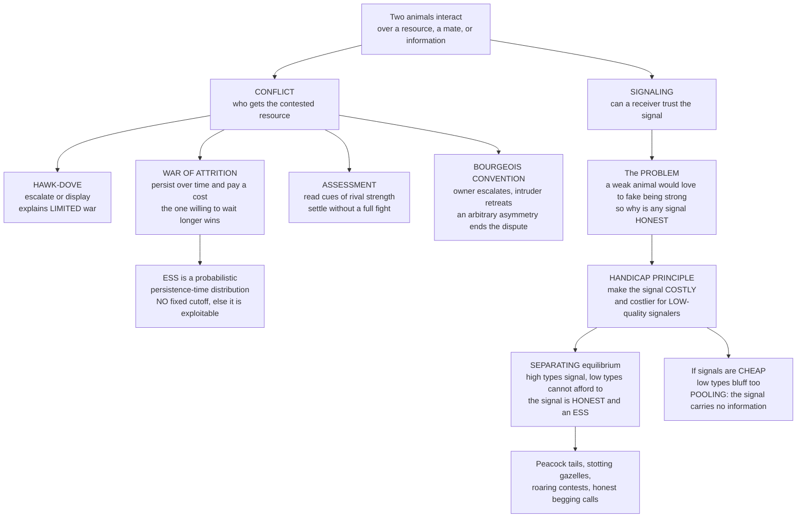

# 🦚 Animal Conflict and Signaling

> [!abstract] TL;DR
> Evolutionary game theory explains two puzzles about how animals interact: how they resolve **conflict** without lethal violence, and how their **signals** stay honest when lying pays. For conflict, richer models go beyond Hawk-Dove: the **war of attrition** (persist over time, the one willing to pay the higher cost wins — the ESS is a *probabilistic* give-up-time distribution with **no fixed cutoff**, because any cutoff is exploitable), **assessment** games (gather information and settle before a full fight), and the **Bourgeois convention** (owner escalates, intruder retreats — respecting an arbitrary asymmetry is an ESS, which is why residents usually win). For signaling, the central puzzle is reliability: a weak male would love to fake "I'm strong," a well-fed chick to beg "I'm starving." The **handicap principle** (Zahavi; formalized by Grafen) is the answer — a signal is believable *precisely because it is costly* in a way only high-quality individuals can afford. The differential cost enforces a **separating (honest) equilibrium**; make signals **cheap** and everyone bluffs, collapsing to an uninformative **pooling** equilibrium. The same cost-enforced-honesty logic explains peacock tails, stotting gazelles, and roaring stags — and reaches all the way to **sexual selection**, human status displays, and Spence's economics of **education as a signal**.

---

## Intuition

**Analogy:** A peacock drags around a tail so absurdly large it barely lets him fly and practically invites predators; a red deer stag will **roar all night** until his ribs heave, matching a rival roar-for-roar. Both look like design failures. And both pose the same puzzle: **why should anyone believe them?** If displaying "I'm a superb mate" or "I'm too strong to fight" got you extra matings and unopposed resources, then a *weak* male would love to fake the display too. Communication should collapse into a cacophony of bluffs — everyone claiming to be the best, no claim worth trusting.

The resolution is the **handicap principle**, and it is beautifully counter-intuitive: honesty is enforced **not by trust but by cost**. The peacock's tail is believable *because* it is a handicap — only a genuinely healthy, parasite-free male can grow a huge shimmering tail *and still survive* dragging it around. A sickly male who tried to fake it would pay a cost he cannot afford; the tail would literally kill him first. The all-night roar works the same way: a weak stag physically cannot keep it up. The lie is prevented by making it **too expensive to tell**. Signals are trustworthy when faking them costs more than the reward for faking — so the *cost is the guarantee of the truth*. Conflict follows the same logic from the other side: in a **war of attrition**, the way to prove you deserve the prize is to *keep paying the cost longer than your rival can stand*.

---

## How It Works

### Conflict beyond Hawk-Dove

The [[The_Hawk_Dove_Game]] explains why conflict is usually *limited* — displays and one contestant backing down rather than fights to the death. But its binary "escalate or flee" choice is a caricature of real contests. Three richer models fill in the picture:

1. **The War of Attrition (Maynard Smith 1974; Bishop & Cannings 1978).** Replace the binary choice with a continuous one: each contestant chooses a **persistence time** — how long they are willing to keep displaying and paying a cost (energy, time, risk) that accrues while both hold on. The one willing to persist longer wins the resource `V`; **both pay a cost equal to the loser's give-up time** (the contest ends when the loser quits). The crucial result: the ESS is **not a fixed persistence time**. Any fixed cutoff `T` is exploitable — a mutant who persists for `T + ε` wins almost every contest for a negligible extra cost, so fixed strategies unravel upward. The ESS is instead a **probabilistic distribution** of give-up times (an exponential distribution), engineered so that *every* persistence value earns exactly the same expected payoff. Unpredictability is the point: you must not be readable.

2. **Assessment games (sequential and mutual assessment).** Real animals do not fight blind — they *gather information*. In **mutual assessment**, each contestant reads cues of the rival's fighting ability (size, roar pitch, display vigor) and the weaker one concedes before a costly fight; in **sequential assessment**, contests escalate through stages that reveal ever-finer information (roaring → parallel walking → antler-pushing in red deer), and a contestant quits as soon as it infers it is outmatched. Assessment explains **ritualized displays** as *information exchange* that lets both sides settle at the least cost consistent with the truth.

3. **The Bourgeois convention.** In a symmetric Hawk-Dove contest, add an **arbitrary, payoff-irrelevant asymmetry** — say, who arrived first. The rule *"play Hawk if I am the owner, Dove if I am the intruder"* is an ESS: it settles disputes at **zero fighting cost** because the convention picks a winner without a fight. This is why animals across species **respect territory and ownership**, and why residents almost always win — an evolutionary root of "property" long before any law. (See the forthcoming sibling `The_Evolution_of_Conventions_and_Norms`.)

### The signaling problem

Communication poses a distinct game-theoretic puzzle. A **signaler** has private information (its quality, hunger, strength, intent); a **receiver** takes an action based on the signal. But interests rarely align perfectly: a weak male benefits if the receiver believes "strong," a well-fed chick benefits if the parent believes "starving." If signals were free, **every signaler would send the most flattering signal**, receivers would learn to ignore all of it, and communication would carry **no information**. So why is animal signaling ever *reliable*?

### The handicap principle: cost guarantees truth

Zahavi's answer (1975), long dismissed until Grafen (1990) proved it with a formal signaling model: signals are honest when they are **costly in a way that only high-quality signalers can afford**. The key ingredient is **differential cost** — the *same* signal intensity costs a low-quality signaler *more* than a high-quality one (a big tail is far deadlier to a sickly male than to a fit one; an all-night roar is impossible for a weak stag). This differential drives the system to a **separating equilibrium**:

- The **high** type produces a costly signal `s*`.
- The **low** type finds mimicking `s*` **not worth it** — the cost of faking exceeds the reward — so it sends a weaker signal (or none) and is treated as low.
- The signal is therefore **honest**: seeing `s*` reliably means "high quality." No trust required — just arithmetic.

Formally (this is exactly Spence's job-market model in biological dress — see [[Signaling_Games]] and [[Signaling]]), let `ΔB` be the extra benefit of being *treated as* high rather than low, and let signal `s` cost `s / q` where `q` is quality (higher quality → lower cost per unit signal). Separation is incentive-compatible when

> the low type **cannot afford** to fake: `s* / q_low ≥ ΔB`, **and** the high type **still gains** by signaling: `s* / q_high ≤ ΔB`.

Both hold simultaneously only when `q_low < q_high` — i.e., **only when cost is differential**. Make the signal **cheap** (cost near zero for everyone) and the low type happily mimics: the equilibrium **pools**, and the signal dies as information. Honesty is not free; it is *paid for* in wasted tails and exhausting roars. This is the same "stable ≠ optimal" tension as the Hawk-Dove tragedy: the population burns real fitness on signals, but no cheaper honest equilibrium is reachable.

### The range of conflict resolution and honest signaling



---

## Key Concepts

### Secondary (intuitive)

- **Bluffing is tempting** — any animal would benefit from *claiming* to be stronger, fitter, or hungrier than it is; the puzzle is why signals ever stay honest.
- **Cost keeps you honest** — a signal you can only produce if you *really are* high quality cannot be faked; the handicap (a huge tail, an all-night roar) is the guarantee.
- **Whoever waits longest wins** — in a war of attrition the prize goes to the one willing to keep paying the cost, but you must be *unpredictable* about how long you will wait.
- **Residents win** — respecting who-got-there-first settles fights for free, which is why territory owners almost always keep their turf.

### Undergraduate (formal)

- **Signaling game structure** — signalers of private **type** `θ` (quality) choose a signal `s`; receivers observe `s` and choose a response. A **separating** equilibrium maps different types to different signals (informative/honest); a **pooling** equilibrium maps all types to the same signal (uninformative).
- **Handicap / costly-signaling condition** — honest separation requires a **single-crossing / differential-cost** property: the marginal cost of signaling is higher for lower-quality types, so the incentive-compatibility inequalities `c_low(s*) ≥ ΔB ≥ c_high(s*)` have a non-empty solution range.
- **War of attrition ESS** — with resource value `V` and cost accruing at unit rate, the ESS give-up-time density is `p(t) = (1/V) exp(−t/V)`; against it, *every* pure persistence time earns the same expected payoff (zero), so nothing invades.
- **Bourgeois strategy** — conditioning on an uncorrelated asymmetry ("owner vs intruder") is an ESS that costs no fighting; the anti-Bourgeois mirror is also an ESS in theory but almost never seen in nature.
- **Cheap talk vs costly signaling** — when signaler and receiver interests are aligned, *costless* signals (cheap talk) can be honest; when interests conflict, honesty generally requires **cost** (or another enforcement mechanism such as punishment).

### Graduate (advanced)

- **Grafen's strategic handicap** — Grafen (1990) proved Zahavi's verbal argument by finding a signaling ESS in which signal intensity is a strictly increasing function of quality and the marginal-cost differential exactly deters mimicry; the honest signal is a **Bayesian-Nash / evolutionarily stable** equilibrium of the sender-receiver game.
- **Index vs handicap vs conventional signals** — *indices* are physically impossible to fake (roar fundamental frequency is capped by body size); *handicaps* are fakeable in principle but deterred by cost; *conventional* signals (badges of status) are cheap to produce but kept honest by **social receiver-punishment** (challenging a false badge), a fundamentally different stabilizer.
- **Bishop–Cannings theorem in the war of attrition** — the continuous exponential ESS is the infinite-strategy analogue of the mixed Hawk-Dove ESS; every strategy in the support earns equal payoff, which forces the memoryless (exponential) form — any distribution with a "gap" or atom is invadable.
- **Sir Philip Sidney game** — a canonical model (need-based begging) showing that costly signaling of *need* between relatives is stabilized when the cost times the conflict-of-interest is calibrated to Hamilton's-rule relatedness; links signaling to [[Kin_Selection_and_Inclusive_Fitness]].
- **Sexual-selection coevolution** — signaling ties into two non-exclusive engines of mate choice: **Fisherian runaway** (preference and ornament coevolve by genetic correlation, no honesty required) and **good-genes / handicap** (the ornament honestly indexes heritable quality). See [[Sex_Ratios_and_the_Fisher_Principle]] and [[Asexual_and_Sexual_Reproduction]].
- **Deception at equilibrium** — perfect honesty is not required: when detection is imperfect and mimicry is cheap, a stable **low frequency of cheats/mimics** (Batesian mimicry, aggressive mimicry, bluffing in stomatopods) persists as a mixed equilibrium — an arms race between deception and detection (see the forthcoming sibling `Host_Pathogen_and_Coevolution`).

---

## Python Demo

The code models **two** ideas at once. First, the **handicap principle** as a costly-signaling game: signalers come in HIGH and LOW quality, a signal of intensity `s` costs *more* for the LOW type (differential cost), and receivers want to reward only high types. It shows a **separating (honest) equilibrium** exists — high types pay a signal the low type cannot afford to fake — and then makes the signal **cheap** to show honesty collapses into an uninformative **pooling** equilibrium. Second, it derives the **war of attrition ESS**: the exponential give-up-time distribution, and the flat expected-payoff curve proving *no fixed persistence time can invade*. Requires only `numpy` and `matplotlib`.

```python
# Animal conflict and signaling: two classic EGT results.
#   A. HANDICAP PRINCIPLE (costly signaling): differential cost makes a
#      SEPARATING (honest) equilibrium possible; cheap signals -> POOLING.
#   B. WAR OF ATTRITION: the ESS is an exponential give-up-time distribution
#      against which every persistence time earns equal payoff (uninvadable).
import numpy as np
import matplotlib.pyplot as plt

# ----------------------------------------------------------------------
# A. COSTLY SIGNALING (the handicap principle)
# ----------------------------------------------------------------------
# Receiver pays B_high if it believes "high quality", B_low otherwise.
# A signaler treated-as-high nets  B_high - cost(s);  treated-as-low nets B_low.
# Cost of signal intensity s for a signaler of quality q is  s / q
#   -> higher quality = lower cost per unit signal (the differential cost).
B_high, B_low = 10.0, 4.0
dB = B_high - B_low                     # extra benefit of being treated as high
q_high, q_low = 2.0, 1.0               # high quality is cheaper to signal

def cost(s, q):
    return s / q

def separating_range(dB, q_low, q_high):
    # High type gains by signaling s*:      s*/q_high <= dB   -> s* <= dB*q_high
    # Low type won't afford to fake s*:      s*/q_low  >= dB   -> s* >= dB*q_low
    return dB * q_low, dB * q_high      # [s_min, s_max] where signaling is honest

s_min, s_max = separating_range(dB, q_low, q_high)
s_star = s_min                          # least-cost (Riley) honest signal

print("A. HANDICAP PRINCIPLE (differential cost, honest signaling)")
print(f"   benefit gap dB = {dB:.1f},  q_high = {q_high}, q_low = {q_low}")
print(f"   honest separating signal range: s* in [{s_min:.2f}, {s_max:.2f}]")
print(f"   least-cost honest signal s* = {s_star:.2f}")
print(f"     low type mimic payoff : B_high - cost(s*,q_low)  = "
      f"{B_high - cost(s_star, q_low):.2f}  vs stay-low = {B_low:.2f} "
      f"-> {'will NOT fake' if B_high - cost(s_star,q_low) <= B_low + 1e-9 else 'WILL fake'}")
print(f"     high type payoff      : B_high - cost(s*,q_high) = "
      f"{B_high - cost(s_star, q_high):.2f}  vs stay-low = {B_low:.2f} "
      f"-> {'DOES signal' if B_high - cost(s_star,q_high) > B_low else 'stays low'}")

# Now make signals CHEAP (both types cost almost nothing) -> pooling / dishonest
q_high_c, q_low_c = 40.0, 20.0          # tiny cost per unit signal for both
s_min_c, s_max_c = separating_range(dB, q_low_c, q_high_c)
print("\n   CHEAP-SIGNAL case (low differential cost):")
print(f"     to deter faking you would need s* >= {s_min_c:.2f}, "
      f"but low type net at that s* = {B_high - cost(s_min_c, q_low_c):.2f} "
      f"(still >= {B_low:.1f}) -> low type BLUFFS -> POOLING, signal is uninformative")

# ----------------------------------------------------------------------
# B. WAR OF ATTRITION: ESS give-up-time distribution p(t) = (1/V) e^{-t/V}
# ----------------------------------------------------------------------
V = 3.0
def ess_density(t, V):
    return np.exp(-t / V) / V

# Expected payoff of a PURE strategy "persist until x" against opponents
# drawn from the ESS.  If you outlast (x > y): win V, cost = y  -> V - y.
# If you quit first (x < y): lose, cost = x  -> -x.
def payoff_vs_ess(x, V, n=400_000, rng=None):
    rng = rng or np.random.default_rng(0)
    y = rng.exponential(V, size=n)      # opponents ~ ESS
    win = x > y
    return np.mean(np.where(win, V - y, -x))

xs = np.linspace(0.05, 3.0 * V, 25)
payoffs = np.array([payoff_vs_ess(x, V) for x in xs])
print("\nB. WAR OF ATTRITION (ESS = exponential give-up times)")
print(f"   V = {V},  expected payoff vs the ESS across persistence times "
      f"x in [{xs[0]:.2f}, {xs[-1]:.2f}]:")
print(f"     mean = {payoffs.mean():+.3f}, std = {payoffs.std():.3f}  "
      f"-> essentially FLAT at 0 (no fixed cutoff can invade)")

# ----------------------------------------------------------------------
# Visualize
# ----------------------------------------------------------------------
fig, ax = plt.subplots(2, 2, figsize=(13.5, 9))
sgrid = np.linspace(0, s_max * 1.15, 400)

# (0,0) HONEST separating equilibrium: net payoff vs signal intensity
net_high = B_high - cost(sgrid, q_high)   # payoff IF treated as high
net_low  = B_high - cost(sgrid, q_low)
ax[0, 0].plot(sgrid, net_high, lw=2, color="tab:blue",  label="HIGH type: B_high - s/q_high")
ax[0, 0].plot(sgrid, net_low,  lw=2, color="tab:red",   label="LOW type: B_high - s/q_low")
ax[0, 0].axhline(B_low, color="k", ls="--", lw=1.2, label="stay-low payoff B_low")
ax[0, 0].axvspan(s_min, s_max, color="tab:green", alpha=0.15, label="honest (separating) range")
ax[0, 0].scatter([s_star], [B_high - cost(s_star, q_high)], color="tab:blue", zorder=5)
ax[0, 0].scatter([s_star], [B_low], color="tab:red", zorder=5)
ax[0, 0].annotate("low type: faking s* is\nNOT worth it (<= B_low)",
                  xy=(s_star, B_low), xytext=(s_star * 1.05, B_low - 3.2),
                  arrowprops=dict(arrowstyle="->"), fontsize=8)
ax[0, 0].set_title("A1. Differential cost -> HONEST separating signal")
ax[0, 0].set_xlabel("signal intensity s"); ax[0, 0].set_ylabel("net payoff")
ax[0, 0].legend(fontsize=7.5, loc="lower left")

# (0,1) CHEAP signal -> pooling: low type also profits from big signals
net_high_c = B_high - cost(sgrid, q_high_c)
net_low_c  = B_high - cost(sgrid, q_low_c)
ax[0, 1].plot(sgrid, net_high_c, lw=2, color="tab:blue", label="HIGH type (cheap cost)")
ax[0, 1].plot(sgrid, net_low_c,  lw=2, color="tab:red",  label="LOW type (cheap cost)")
ax[0, 1].axhline(B_low, color="k", ls="--", lw=1.2, label="stay-low payoff B_low")
ax[0, 1].set_title("A2. Cheap signal -> LOW type bluffs -> POOLING")
ax[0, 1].set_xlabel("signal intensity s"); ax[0, 1].set_ylabel("net payoff")
ax[0, 1].legend(fontsize=8, loc="lower left")
ax[0, 1].text(0.03, 0.06, "both curves stay above B_low:\nfaking always pays -> no honest signal",
              transform=ax[0, 1].transAxes, fontsize=8,
              bbox=dict(boxstyle="round", fc="wheat", alpha=0.6))

# (1,0) War of attrition ESS give-up-time distribution
tgrid = np.linspace(0, 5 * V, 400)
ax[1, 0].plot(tgrid, ess_density(tgrid, V), lw=2, color="tab:purple")
ax[1, 0].fill_between(tgrid, ess_density(tgrid, V), color="tab:purple", alpha=0.15)
ax[1, 0].set_title(f"B1. War of attrition ESS: exponential give-up times (V={V})")
ax[1, 0].set_xlabel("persistence time t"); ax[1, 0].set_ylabel("ESS density p(t)")
ax[1, 0].text(0.35, 0.7, "memoryless: no fixed cutoff,\nyou must be unpredictable",
              transform=ax[1, 0].transAxes, fontsize=8,
              bbox=dict(boxstyle="round", fc="lavender", alpha=0.8))

# (1,1) Flat expected payoff -> uninvadability
ax[1, 1].plot(xs, payoffs, "o-", lw=1.6, color="tab:green")
ax[1, 1].axhline(0.0, color="k", ls="--", lw=1.2)
ax[1, 1].set_ylim(-1, 1)
ax[1, 1].set_title("B2. Every persistence time earns the SAME payoff (= 0)")
ax[1, 1].set_xlabel("your pure persistence time x")
ax[1, 1].set_ylabel("expected payoff vs the ESS")
ax[1, 1].text(0.05, 0.12, "flat line = uninvadable ESS\n(no cutoff does better)",
              transform=ax[1, 1].transAxes, fontsize=8,
              bbox=dict(boxstyle="round", fc="honeydew", alpha=0.9))

plt.tight_layout()
plt.savefig("animal_conflict_and_signaling.png", dpi=120)
print("\nsaved figure -> animal_conflict_and_signaling.png")
```

Expected output — an honest separating signal exists under differential cost, collapses to pooling when signals are cheap, and the war-of-attrition payoff is flat:

```
A. HANDICAP PRINCIPLE (differential cost, honest signaling)
   benefit gap dB = 6.0,  q_high = 2.0, q_low = 1.0
   honest separating signal range: s* in [6.00, 12.00]
   least-cost honest signal s* = 6.00
     low type mimic payoff : B_high - cost(s*,q_low)  = 4.00  vs stay-low = 4.00  -> will NOT fake
     high type payoff      : B_high - cost(s*,q_high) = 7.00  vs stay-low = 4.00  -> DOES signal

   CHEAP-SIGNAL case (low differential cost):
     to deter faking you would need s* >= 120.00, but low type net at that s* = 4.00 (still >= 4.0) -> low type BLUFFS -> POOLING, signal is uninformative

B. WAR OF ATTRITION (ESS = exponential give-up times)
   V = 3.0,  expected payoff vs the ESS across persistence times x in [0.05, 9.00]:
     mean = +0.001, std = 0.004  -> essentially FLAT at 0 (no fixed cutoff can invade)
```

The top-left panel shows the heart of the handicap principle: at the least-cost honest signal `s* = 6`, the LOW type's payoff from faking exactly equals its stay-low payoff (it is indifferent, so it will not bother), while the HIGH type strictly gains — an honest **separating** ESS. The top-right panel removes the differential cost: both curves stay above the stay-low line, so the low type *always* profits from a big signal, honesty collapses, and the signal **pools** into noise. The bottom row is the war of attrition: the ESS is a memoryless exponential of give-up times, and the flat payoff curve is the proof of uninvadability — no fixed persistence time beats any other, so a readable cutoff cannot invade.

---

## Real-World Applications

- **Peacock tails and sexual ornaments** — the textbook handicap: elaborate, costly ornaments (long tails, bright plumage, deep-red carotenoid coloration signaling a healthy immune system) honestly index heritable quality because sick or parasite-laden males cannot produce or survive them. Female preference for the costly ornament is the receiver side of the game (see [[Sex_Ratios_and_the_Fisher_Principle]] and [[Asexual_and_Sexual_Reproduction]]).
- **Stotting gazelles** — a Thomson's gazelle that spots a cheetah often **leaps stiff-legged into the air** instead of fleeing. This is an honest signal to the predator: "I am fit enough to escape, don't waste your energy chasing me." It is honest precisely because only a genuinely fit gazelle can afford to stott rather than run — and cheetahs preferentially abandon chases of high-stotting prey.
- **Roaring and antler contests** — red deer stags settle most disputes by a **roaring match** (roar rate is a hard-to-fake index of stamina) escalating to parallel walking and only rarely to antler-locking — a textbook sequential **assessment** game that ends as soon as one stag infers it is outmatched.
- **Nestling begging calls** — chicks beg loudly for food, but begging is costly (energy, predator attraction), which keeps it **honest**: a genuinely hungry chick gains enough from the food to pay the cost, a sated one does not, so parents can trust the loudest beggar is the hungriest (the Sir Philip Sidney game, calibrated by relatedness — see [[Kin_Selection_and_Inclusive_Fitness]]).
- **Foraging and interference contests** — the same escalate-vs-share and assessment logic governs disputes at food patches; how contest costs shape where animals settle links directly to [[Foraging_and_the_Ideal_Free_Distribution]].
- **Territory ownership** — the **Bourgeois** convention explains why speckled-wood butterflies, songbirds, and countless territorial species resolve disputes by "resident wins," avoiding costly fights over a payoff-irrelevant asymmetry.
- **Economics — education as a signal (Spence)** — the handicap logic is *identical* to Michael Spence's Nobel-winning model: education can be a costly signal of ability even if it teaches nothing job-relevant, because it is **cheaper for high-ability workers to obtain**, sustaining a separating equilibrium exactly like the peacock's tail (see [[Signaling]] and [[Signaling_Games]]). Conspicuous consumption (Veblen goods), extravagant gifts, and costly religious commitment are the human echoes of the same idea.

---

## Common Pitfalls

- **Thinking "costly" means "wasteful and therefore selected against"** — the cost is not a bug, it is the **enforcement mechanism**. Remove the cost and the signal loses its meaning. Selection keeps the handicap *because* the differential cost is what makes the signal informative.
- **Forgetting the differential-cost requirement** — a signal being expensive is not enough; it must be **more expensive for low-quality signalers**. If the cost is the same for all types, high signals do not separate the types and honesty fails. The single-crossing property is the real condition.
- **Expecting a fixed give-up time in the war of attrition** — a deterministic persistence cutoff is *never* an ESS: it is instantly invaded by "wait a tiny bit longer." The ESS *must* be a probability distribution, and specifically the memoryless exponential — unpredictability is structurally required.
- **Assuming all signals must be costly** — when signaler and receiver interests **align** (e.g., cooperative alarm calls within a group), cheap or even costless signals (cheap talk) can be perfectly honest. Costly signaling is needed only when interests **conflict**. Conflating the two over-applies the handicap principle.
- **Believing signals are perfectly honest** — they are not. Where detection is imperfect and mimicry is cheap, stable **deception** persists (Batesian mimics, bluffing mantis shrimp, aggressive-mimic anglerfish). Honesty is an equilibrium *tendency*, maintained only up to the point where cheating starts to pay.
- **Confusing indices, handicaps, and conventional badges** — an *index* (roar pitch capped by body size) is honest because it is **physically unfakeable**; a *handicap* is honest because it is **costly**; a *conventional badge* (a status patch) is cheap and stays honest only through **social punishment** of fakers. They are stabilized by different mechanisms and should not be lumped together.

---

## Related Concepts

- [[The_Hawk_Dove_Game]] — the founding conflict model; the war of attrition and assessment games are its continuous, information-rich generalizations, and the Bourgeois convention is its ownership-conditional ESS.
- [[Evolutionarily_Stable_Strategies]] — the uninvadability criterion behind every result here: the honest separating signal and the exponential war-of-attrition distribution are both ESSs.
- [[The_Prisoners_Dilemma_and_Cooperation]] — the companion reliability problem; both cooperation and honest signaling ask how self-interested agents sustain a mutually informative or beneficial equilibrium against cheats.
- [[Sex_Ratios_and_the_Fisher_Principle]] — sexual selection is the arena in which most costly signaling evolves; Fisherian runaway and the handicap are the two engines of mate-choice signaling.
- [[Foraging_and_the_Ideal_Free_Distribution]] — the same contest-cost and assessment logic shapes competition at resource patches.
- [[Kin_Selection_and_Inclusive_Fitness]] — relatedness calibrates honest need-signaling between relatives (the Sir Philip Sidney / begging game).
- [[Signaling_Games]] — the formal sender-receiver game-theoretic structure (separating vs pooling, perfect Bayesian equilibrium) that the handicap principle instantiates in biology.
- [[Signaling]] — Spence's economics of costly signaling (education as a signal of ability); the same separating-equilibrium logic as the peacock's tail.
- [[Asymmetric_Information]] — the underlying condition that makes signaling necessary: the signaler knows its quality, the receiver does not.
- [[Natural_Selection_and_Adaptation]] — the biological engine; "payoff = fitness" is what makes costly ornaments and honest signals evolve despite their apparent waste.
- [[Asexual_and_Sexual_Reproduction]] — sexual reproduction and mate choice are the arena in which most costly signaling (ornaments, displays) is selected.
- [[Mating_and_Attraction]] — the human/psychological face of sexual selection and mate-choice signaling.
- [[Nash_Equilibrium]] — the separating signaling ESS is a (Bayesian) Nash equilibrium; evolution reaches what strategic rationality would deduce.
- [[_MOC_Game_Theory_Master]] — the classical game-theory vault this evolutionary treatment complements.

**Forthcoming siblings in this vault (referenced in prose above):** `The_Evolution_of_Conventions_and_Norms`, `Host_Pathogen_and_Coevolution`, and `Evolutionary_Economics_and_Bounded_Rationality`.

---

## Review Questions

1. **(Conceptual)** A weak male would *love* to fake being strong, so why doesn't animal communication collapse into a cacophony of bluffs? State the handicap principle precisely, and explain why it is the **differential** cost — costlier for low-quality signalers — rather than mere expense that makes a signal honest. What happens to the equilibrium if you make the signal cheap for everyone?
2. **(Applied / scenario)** In a war of attrition over a resource worth `V = 4`, a rival species evolves a rigid rule: "always persist for exactly 2 time units." Show why this fixed cutoff is **not** an ESS by describing a mutant that invades it. What functional form must the true ESS take, and what property of the exponential distribution makes it uninvadable?
3. **(Trade-off / synthesis)** Compare three routes to signal reliability — a physical **index** (roar pitch), a costly **handicap** (peacock tail), and a cheap **conventional badge** (a status patch). What stabilizes the honesty of each, and under what conditions can honest signaling be achieved with *no* cost at all? Relate your answer to Spence's model of education as a job-market signal.

---

## Sources

- Zahavi, A. (1975). "Mate Selection — a Selection for a Handicap." *Journal of Theoretical Biology*, 53(1), 205–214.
- Grafen, A. (1990). "Biological Signals as Handicaps." *Journal of Theoretical Biology*, 144(4), 517–546.
- Maynard Smith, J. (1982). *Evolution and the Theory of Games*. Cambridge University Press. (Chapters on the War of Attrition, asymmetric contests, and honest signaling.)
- Maynard Smith, J. & Harper, D. (2003). *Animal Signals*. Oxford University Press.
- Spence, M. (1973). "Job Market Signaling." *Quarterly Journal of Economics*, 87(3), 355–374.
- Bishop, D. T. & Cannings, C. (1978). "A Generalized War of Attrition." *Journal of Theoretical Biology*, 70(1), 85–124.

---

#evolutionary-game-theory #animal-signaling #handicap-principle #honest-signals #war-of-attrition
