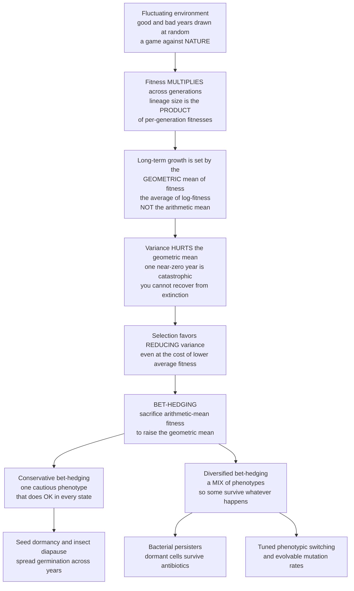

# 🎲 The Evolution of Mutation Rates and Bet-Hedging

> [!abstract] TL;DR
> Evolution in an **unpredictable environment** is a game not against other players but against a **fluctuating, capricious Nature**. The decisive twist is that fitness **multiplies across generations** — a lineage's long-term size is the *product* of its per-generation growth rates — so long-term success is governed by the **geometric mean** of fitness, not the arithmetic mean. The geometric mean is savaged by **variance**: a single near-zero year is catastrophic, and you cannot recover from extinction. Selection therefore favors **bet-hedging** — sacrificing average (arithmetic-mean) fitness to *reduce variance* and raise the geometric mean. Bet-hedging comes in two flavors: **conservative** (one cautious phenotype that does OK in every condition) and **diversified** (a *mix* of phenotypes so that some survive whatever happens). This single principle explains **seed dormancy** and insect **diapause**, bacterial **persisters** that survive antibiotics, tuned **phenotypic switching** through noisy gene expression, and the **evolution of mutation rates** (why "mutator" strains rise in novel or stressful environments). And it is *formally identical* to the **Kelly criterion** and **portfolio diversification** in finance: risk, diversification, and the value of information obey the same mathematics in biology and economics.

---

## Intuition

**Analogy:** Imagine a gambler who, every year, must put their *entire* fortune on one bet, then reinvest whatever comes back into next year's bet. There is no "take some off the table" — your stake next year is exactly what you won this year. Now suppose there is one dazzling bet that pays 5x in a good year but wipes you out (returns near zero) in a bad year, and a boring bet that pays a modest 1.1x in good years and 0.95x in bad. On *average* the dazzling bet looks far better. But run it for thirty years and the dazzling gambler is broke: the **one bad year multiplied everything by nearly zero**, and there is no coming back from zero. The boring, *diversified* gambler quietly compounds and ends up rich. Wise gamblers **spread their bets** — because what matters when you *multiply* returns is not the average return but the average of the *logarithm* of returns, the **geometric mean**, and the geometric mean punishes variance.

Organisms are exactly this gambler. A lineage's fortune is its **population size**, and each generation multiplies it by that generation's fitness. So evolution, too, learns to spread its bets. Desert annual seeds refuse to *all* germinate in one year — some stay dormant, so a drought cannot erase the lineage. A clonal bacterial population keeps a few dormant "**persister**" cells that grow slowly (a handicap in normal times) but shrug off an antibiotic that kills every active cell. Lineages even tune their own **mutation rate** up when the environment turns novel and stressful, buying the variation they might need to adapt. This is **bet-hedging** — trading away average performance to shrink the risk of catastrophe — and it is a game against a fluctuating, unpredictable *environment*, with mathematics that turns out to be surprisingly deep.

---

## How It Works

### A different kind of evolutionary game: playing against Nature

Most of evolutionary game theory is about individuals playing against *each other*: your fitness depends on the frequency of other strategies (see `[[Fitness_Payoffs_and_Population_Games]]`). Bet-hedging is a **game against Nature** — a decision-under-uncertainty problem in which the "opponent" is the environment, which draws a state (wet or dry, feast or famine, antibiotic or none) at random each generation, indifferent to what you do. There is no frequency-dependence in the simplest version; there is only **risk**. And the central result is that when conditions vary unpredictably across generations, the strategy that maximizes **average (arithmetic-mean) fitness is *not* optimal** — *variance matters*, because of how fitness compounds.

### Why the geometric mean, not the arithmetic mean, governs the long run

This is the key insight. Let a lineage's per-generation growth factors be `W_1, W_2, ..., W_T` (each is offspring-per-individual that generation). Because each generation's population is the *input* to the next, sizes **multiply**:

$$N_T = N_0 \cdot W_1 \cdot W_2 \cdots W_T = N_0 \prod_{t=1}^{T} W_t.$$

Take logarithms and the product becomes a sum, so the **long-run growth rate** is the *average of the log-fitness*:

$$\frac{1}{T}\ln\frac{N_T}{N_0} = \frac{1}{T}\sum_{t=1}^{T}\ln W_t \;\xrightarrow{T\to\infty}\; \mathbb{E}[\ln W].$$

Exponentiating, the lineage grows at the **geometric mean** of fitness, `G = exp(E[ln W])`, *not* the arithmetic mean `A = E[W]`. By the AM–GM inequality `G ≤ A` always, with equality only when fitness is constant. The gap between them is set by **variance**: to first order,

$$\ln G \approx \ln A - \frac{\sigma^2}{2A^2},$$

so **variance directly subtracts from long-term growth**. Worse than "subtracts": a single generation with `W_t = 0` sends the *product* to zero and `ln W_t` to `-∞` — one catastrophic year means **extinction**, from which there is no recovery. This is why "maximize the average" is the wrong maxim in a variable world. The right maxim is **"maximize the geometric mean"** — equivalently, *maximize expected log-fitness while shrinking its variance*.

### Bet-hedging: buying lower variance with lower average

**Bet-hedging** is the evolutionary strategy of *deliberately lowering arithmetic-mean fitness in exchange for lower variance*, because the trade raises the geometric mean. "Don't put all your eggs in one basket" is the folk statement; the geometric-mean theory is the proof. Two mechanisms achieve it:

- **Conservative bet-hedging** — adopt a *single, cautious* phenotype that does *reasonably well in every state* rather than brilliantly in one and disastrously in another. Think of a generalist that never wins big and never loses big. It sacrifices peak performance for a floor under the bad years.
- **Diversified bet-hedging** — produce a *mixture* of phenotypes within a single clone or clutch, so that **whatever state Nature draws, some fraction of your offspring is suited to it**. You spread the bet across outcomes. The population as a whole never collapses because it is never all-in on one guess. This is the more powerful mechanism when environmental variance is large, and it is the direct biological analog of a *diversified portfolio*.

### The optimal amount to hedge

Hedging is a *dial*, not a switch: how conservative, or what fraction to divert to the "insurance" phenotype? The optimum maximizes the geometric mean, and it depends on the **frequency and severity of bad states** and on how much information the organism has about the coming state. In the classic seed-dormancy model (Cohen, 1966), a plant germinates a fraction `g` of its seeds each year and keeps `1 − g` dormant; the geometric-mean-optimal `g*` is **strictly less than 1** whenever bad years occur — the lineage *always holds some seeds back*. Crucially, the arithmetic-mean-maximizing choice is the reckless one (germinate everything, harvest the good years), yet it drives the geometric mean to zero the first time a drought hits. The Python demo makes this contrast concrete.

### Phenotypic switching and the evolution of mutation rates

*How* does a lineage produce a hedged mixture? Through **stochastic phenotypic switching**: cells flip between phenotypes at random via **noisy gene expression**, and evolution tunes the *switching rate*. Kussell & Leibler (2005) showed the elegant result that the **optimal switching rate matches the rate of environmental change** — hedge fast if the world flips fast, slowly if it is sluggish — and that a *sensed* cue (responsive switching) beats blind stochastic switching exactly by the **information** it carries about the environment.

The **mutation rate** is itself a bet-hedge, and an *evolvable* strategy. Most mutations are harmful, which favors **low** mutation rates (faithful copying protects a well-adapted genome). But in a **changing or stressful** environment, higher mutation *supplies the variation needed to adapt*. This tension yields an **optimal mutation rate**. In novel or stressful settings, **mutator** strains (with elevated mutation rates) can **hitchhike** to high frequency by riding along with the beneficial mutations they generate — documented in evolving infections, antibiotic adaptation, and tumors. **Stress-induced mutagenesis** (the bacterial SOS response cranking up error-prone repair under duress) is a *conditional* bet-hedge: gamble on new variation precisely when the current genotype is failing. This is the biology of **evolvability** — the evolution of the capacity to evolve.

### Flow: evolution under uncertainty



---

## Key Concepts

### Secondary (school) level

- **Don't bet the farm.** In a world that flips unpredictably between good and bad, always chasing the *biggest* payoff is dangerous — one bad year can wipe you out. It is smarter to spread your bets so you always survive.
- **Averages lie when you multiply.** If your winnings get *multiplied* year after year, one year of "almost nothing" ruins everything, even if your *average* year looks great. What counts is the geometric mean, and a single zero is fatal.
- **Nature is the opponent.** Here you are not competing with rivals but against the *weather* — a game against an unpredictable environment. Seeds that sleep through some years, and germs that keep a few "sleeper" cells, are playing this game well.

### Undergraduate level

- **Arithmetic vs geometric mean fitness.** Arithmetic mean `A = E[W]` predicts one generation; the **geometric mean** `G = exp(E[ln W])` predicts the *long run*, because fitness compounds multiplicatively. `G ≤ A` always, and the gap grows with variance: `ln G ≈ ln A − σ²/(2A²)`.
- **Bet-hedging defined.** A strategy that *lowers* arithmetic-mean fitness to *lower variance*, thereby *raising* geometric-mean fitness. **Conservative** (one robust phenotype) vs **diversified** (a mixture of phenotypes).
- **A single zero is catastrophic.** Because `ln 0 = −∞`, any strategy that risks a zero-fitness generation has a **geometric mean of zero** — guaranteed eventual extinction — no matter how high its arithmetic mean.
- **Optimal germination fraction (Cohen 1966).** With good-year probability `p`, yield `Y`, and dormant survival `s`, the optimal germinating fraction `g*` maximizes `p·ln(gY + (1−g)s) + (1−p)·ln((1−g)s)` and is `< 1` — the lineage always holds seeds in reserve.
- **Evolvable mutation rate.** A tension between the cost of deleterious mutations (favoring low rates) and the benefit of adaptive variation in change (favoring high rates) yields an interior optimum; **mutators** can spread by hitchhiking in novel environments.

### Graduate level

- **Log-optimal growth = Kelly criterion.** Maximizing `E[ln W]` is exactly the **Kelly (1956) log-optimal betting** problem and Breiman's asymptotically optimal growth-rate criterion; the evolutionary bet-hedger and the log-optimal investor solve the *same* optimization. Diversified bet-hedging is **portfolio diversification** (see `[[Modern_Portfolio_Theory]]`).
- **The value of information.** With an environmental **cue**, the geometric-growth gain of responsive over blind switching is bounded by the **mutual information** between cue and environment — a direct information-theoretic price on sensing (Kelly's own gambling result; Donaldson-Matasci, Bergstrom & Lachmann 2010). This ties bet-hedging to `[[Information_Theory_in_Biology_and_Neuroscience]]`.
- **Kussell–Leibler switching.** For a Markov-modulated environment, the geometric growth rate of a stochastically switching population is computed from a product of random matrices; the **optimal switching rate matches the environmental transition rate**, and sensing adds a term equal to the acquired information rate.
- **Geometric mean and arithmetic mean of what unit?** Bet-hedging theory requires care about the **level of selection** and correlation structure: variance that is *independent across individuals within a generation* (demographic) largely averages out; only variance that is **shared across the whole lineage** (environmental, temporally fluctuating) depresses the geometric mean. This "environmental vs demographic stochasticity" distinction is essential and often mishandled.
- **Mutation-rate optimum and modifier theory.** In an infinite asexual population at mutation–selection balance, a mutation-rate **modifier** allele is selected toward the rate minimizing genetic load in a static environment (favoring the *lowest achievable* rate) but toward *higher* rates under recurrent environmental change; the ESS mutation rate balances these. **Stress-induced mutagenesis** is a conditional (state-dependent) modifier — a second-order bet-hedge on evolvability itself.
- **Relation to adaptive dynamics.** Bet-hedging is a *stochastic-environment* complement to the deterministic frequency-dependence of `[[Adaptive_Dynamics_and_Evolutionary_Branching]]`; germination fraction or switching rate can themselves be continuous strategies with singular points evaluated under geometric-mean invasion fitness.

---

## Python Demo

The demo makes the central claim tangible: **the bet-hedger wins the long game despite a *lower* per-generation average**, because the geometric mean — not the arithmetic mean — governs multiplicative growth. Two lineages face the *same* random sequence of good and bad years. The **specialist** thrives in good years (`W = 2.4`) and is nearly wiped out in bad ones (`W = 0.10`): a *high arithmetic mean* but ruinous variance. The **conservative bet-hedger** takes a cautious phenotype that is merely OK in every year (`1.15` good, `0.95` bad): a *lower arithmetic mean* but a geometric mean above 1. We plot lineage sizes (log scale), contrast arithmetic vs geometric means, and then compute the **optimal diversification fraction** in Cohen's seed-dormancy model — showing that germinating *everything* maximizes the average yet drives long-term growth to zero. `numpy` and `matplotlib` only.

```python
# Bet-hedging via GEOMETRIC-MEAN fitness in a fluctuating environment.
#   Lineage size = PRODUCT of per-generation fitnesses (fitness compounds).
#   Long-term growth is governed by the GEOMETRIC mean, not the arithmetic mean.
import numpy as np
import matplotlib.pyplot as plt

rng = np.random.default_rng(42)

# ---- Environment: each generation is a GOOD year (prob p) or a BAD year ----
p_good = 0.5
G = 120                                   # generations
env_good = rng.random(G) < p_good         # True = good year, False = bad year

# ---- Two strategy types: per-generation MULTIPLICATIVE fitness ----
# SPECIALIST : brilliant in good years, near-lethal in bad years
#   -> HIGH arithmetic mean, but a bad year is catastrophic -> LOW geometric mean
spec_good,  spec_bad  = 2.4, 0.10
# CONSERVATIVE BET-HEDGER : one cautious phenotype, merely OK in every year
#   -> LOWER arithmetic mean, but never catastrophic -> HIGHER geometric mean
hedge_good, hedge_bad = 1.15, 0.95

def per_gen_fitness(good_mask, w_good, w_bad):
    return np.where(good_mask, w_good, w_bad)

w_spec  = per_gen_fitness(env_good, spec_good,  spec_bad)
w_hedge = per_gen_fitness(env_good, hedge_good, hedge_bad)

# ---- Lineage size = cumulative PRODUCT of per-generation fitnesses ----
size_spec  = np.concatenate([[1.0], np.cumprod(w_spec)])
size_hedge = np.concatenate([[1.0], np.cumprod(w_hedge)])

# ---- Arithmetic vs geometric mean of per-generation fitness ----
arith = lambda w: w.mean()
geom  = lambda w: np.exp(np.log(w).mean())   # exp of mean log = geometric mean

print("SPECIALIST : arithmetic = %.3f   geometric = %.3f  -> %s"
      % (arith(w_spec),  geom(w_spec),
         "GROWS" if geom(w_spec)  > 1 else "goes EXTINCT"))
print("BET-HEDGER : arithmetic = %.3f   geometric = %.3f  -> %s"
      % (arith(w_hedge), geom(w_hedge),
         "GROWS" if geom(w_hedge) > 1 else "goes EXTINCT"))

# ---- Optimal diversification: Cohen's germination-fraction bet-hedge ----
# fraction g of seeds germinate; 1-g stay dormant (survive with prob s).
#   good year: W = g*Y + (1-g)*s      bad year: W = (1-g)*s  (germinated seeds die)
#   long-run growth = geometric mean  = exp( p*ln(W_good) + (1-p)*ln(W_bad) )
Y, s = 6.0, 0.95
g_grid = np.linspace(0.001, 0.999, 800)
W_good = g_grid * Y + (1 - g_grid) * s
W_bad  = (1 - g_grid) * s
loggrowth = p_good * np.log(W_good) + (1 - p_good) * np.log(W_bad)
g_star = g_grid[np.argmax(loggrowth)]
# The ARITHMETIC-optimal choice germinates everything (g=1): E[W] = p*Y is maximal,
# but then W_bad = 0 -> the geometric mean is ZERO -> extinction in the first drought.
print("optimal germination fraction g* = %.3f  (g=1 maximizes the ARITHMETIC mean"
      " but gives geometric mean 0 = extinction)" % g_star)

# ---------------------------------------------------------------- plotting
fig, ax = plt.subplots(1, 3, figsize=(17, 5.0))

# Panel (a): lineage sizes over time (log scale) in the SAME environment
gens = np.arange(G + 1)
ax[0].semilogy(gens, size_spec,  color="#d62728", lw=2.2,
               label="specialist (higher avg fitness)")
ax[0].semilogy(gens, size_hedge, color="#1f77b4", lw=2.2,
               label="bet-hedger (lower avg fitness)")
ax[0].axhline(1.0, color="k", lw=0.8, ls=":")
for t in np.where(~env_good)[0]:                       # shade bad years faintly
    ax[0].axvspan(t, t + 1, color="gray", alpha=0.06)
ax[0].set_title("(a) Same environment, opposite fates\n"
                "bet-hedger OVERTAKES despite lower average fitness")
ax[0].set_xlabel("generation"); ax[0].set_ylabel("lineage size (log scale)")
ax[0].legend(loc="lower left", fontsize=9)

# Panel (b): arithmetic vs geometric mean fitness for each strategy
labels = ["specialist", "bet-hedger"]
A_vals = [arith(w_spec),  arith(w_hedge)]
G_vals = [geom(w_spec),   geom(w_hedge)]
x = np.arange(2); bw = 0.36
ax[1].bar(x - bw/2, A_vals, bw, label="arithmetic mean", color="#ff9896")
ax[1].bar(x + bw/2, G_vals, bw, label="geometric mean", color="#aec7e8")
ax[1].axhline(1.0, color="k", lw=1.2, ls="--", label="replacement (=1)")
ax[1].set_xticks(x); ax[1].set_xticklabels(labels)
ax[1].set_ylabel("per-generation fitness")
ax[1].set_title("(b) Arithmetic mean MISLEADS\n"
                "specialist wins the average, loses the geometric mean")
ax[1].legend(fontsize=8)
for xi, (a, g) in enumerate(zip(A_vals, G_vals)):
    ax[1].text(xi - bw/2, a + 0.03, "%.2f" % a, ha="center", fontsize=8)
    ax[1].text(xi + bw/2, g + 0.03, "%.2f" % g, ha="center", fontsize=8)

# Panel (c): optimal diversification fraction (Cohen seed-dormancy model)
ax[2].plot(g_grid, loggrowth, color="navy", lw=2.2)
ax[2].axvline(g_star, color="green", ls="--", lw=1.6,
              label="optimal g* = %.2f" % g_star)
ax[2].axvline(1.0, color="crimson", ls=":", lw=1.6,
              label="germinate all (g=1)\n-> extinction")
ax[2].axhline(0.0, color="k", lw=0.8)
ax[2].set_title("(c) Optimal diversification\n"
                "hold seeds in reserve: g* < 1")
ax[2].set_xlabel("germination fraction g")
ax[2].set_ylabel("long-run growth rate  E[ln W]")
ax[2].legend(fontsize=8, loc="lower center")

plt.tight_layout()
plt.savefig("bet_hedging_geometric_mean.png", dpi=120)
print("saved bet_hedging_geometric_mean.png")
plt.show()
```

**What the output shows.** The printout reveals the paradox in numbers: the specialist's **arithmetic mean (~1.25)** beats the bet-hedger's (~1.05), yet its **geometric mean (~0.49)** is far below 1 while the bet-hedger's (~1.045) exceeds it — so the specialist is doomed and the hedger compounds. Panel **(a)**, both lineages riding the *same* year-by-year environment on a log scale, is the punchline: the specialist spikes upward in early good runs but every bad year (shaded) crushes it toward zero, while the steadier bet-hedger climbs and **overtakes**, ending orders of magnitude ahead. Panel **(b)** contrasts the two means side by side — the arithmetic bars would tempt you to pick the specialist; the geometric bars (the ones that matter) crown the hedger and sit the specialist below the replacement line. Panel **(c)** locates the **optimal diversification fraction** `g* ≈ 0.4`: long-run growth peaks when the plant germinates *less than half* its seeds and keeps the rest dormant. Germinating everything (`g = 1`, the arithmetic-mean-maximizing move) sends growth to `−∞` — extinction in the first drought. Rerun with `p_good = 0.8` (kinder world) and `g*` rises; make bad years rarer still and the hedge relaxes toward `g = 1`. The dial tracks the risk.

---

## Real-World Applications

> **Example — bacterial persisters and antibiotic tolerance:** A genetically *identical* population of *E. coli* stochastically produces a tiny fraction (~0.001–1%) of **persister** cells that are dormant and slow-growing — a fitness handicap during normal growth. When an antibiotic hits, active cells die but persisters, being metabolically quiet, **survive**, and after the drug clears they re-seed the population. This is textbook **diversified bet-hedging**: phenotypic heterogeneity as *insurance* against an unpredictable lethal stress. It is a leading cause of **chronic and relapsing infections** (tuberculosis, cystic-fibrosis *Pseudomonas*, biofilm infections), a distinct phenomenon from genetic resistance (it is *tolerance*), and a stepping-stone toward resistance because persisters buy time for resistance mutations to arise. Understanding it reframes antibiotic strategy around eradicating dormant sub-populations, not just killing dividers.

- **Seed dormancy and delayed germination.** Desert annuals spread germination across multiple years so that a single drought cannot wipe out the lineage — the canonical **diversified bet-hedge**, with observed germination fractions strikingly close to geometric-mean-optimal predictions (Cohen 1966; Venable 2007). Insect **diapause** (dormant eggs/pupae that skip unfavorable seasons) and variable offspring/egg size are the same strategy in animals (see `[[Plant_Reproduction]]`).
- **Microbial phenotypic switching.** Beyond persistence, microbes bet-hedge across **stress phenotypes** (sporulation, competence, capsule variation, phase variation of surface antigens) via **stochastic gene expression** — noisy, tunable switching between states, an application of the gene-regulatory machinery in `[[Gene_Regulation]]` and `[[Gene_Regulation_and_Epigenetics]]`. These microbial hedges connect to the *Microbial Games and Public Goods* and *Host–Pathogen and Coevolution* themes of this vault (siblings planned).
- **Evolution of mutation rates and mutators.** Mutation rate is an evolvable trait balancing the cost of deleterious mutations against the benefit of adaptive variation (see `[[Mutations_and_DNA_Repair]]`, `[[DNA_Repair_and_Mutation]]`). **Mutator** strains rise in novel/stressful settings — evolving chronic infections, laboratory antibiotic adaptation, and hypermutation in cancer — and **stress-induced mutagenesis** (the SOS response) is a conditional hedge. The mutator dynamics in tumors link to `[[Cancer_and_the_Cell_Cycle]]` and `[[Cancer_Genetics_and_Oncogenes]]` and to the planned *Cancer and Evolutionary Medicine* sibling.
- **Antibiotic dosing and clinical medicine.** Because persistence and mutators are bet-hedges *against* our interventions, they are a major clinical problem: they explain treatment failure, relapse, and the pace of resistance evolution (see `[[Vaccines_and_Antibiotics]]`, `[[Bacteria_and_Archaea]]`).
- **The finance parallel — Kelly and portfolios.** Bet-hedging is *formally* the **Kelly criterion** for log-optimal betting and **portfolio diversification**: maximizing the geometric mean of multiplicative returns is one problem in two disciplines (see `[[Modern_Portfolio_Theory]]`, `[[Portfolio_Optimization]]`). This cross-disciplinary equivalence extends to the *Evolutionary Economics and Bounded Rationality* sibling planned for this vault, where organisms and investors are shown to obey the same risk mathematics.

---

## Common Pitfalls

- **"Maximize expected fitness."** The single most important error. In a **temporally fluctuating** environment with multiplicative growth, the arithmetic mean predicts nothing long-term; the **geometric mean** does. A strategy with the highest average fitness can be *guaranteed to go extinct* if it risks catastrophic years.
- **Confusing demographic with environmental variance.** Bet-hedging theory applies to variance that is **correlated across the whole lineage** (a bad *year* hits everyone) — that is what depresses the geometric mean. Variance that is **independent across individuals** within a generation largely averages out and does *not* favor hedging. Mixing these up produces wrong predictions.
- **Treating a persister/dormant cell as "sick" or a mistake.** Persisters, spores, and dormant seeds look like low-fitness aberrations *in benign conditions* — but they are *adaptive insurance*, selected precisely for the rare catastrophe. Judging them by average-condition fitness misreads the strategy.
- **Assuming more diversification is always better.** Hedging is a **dial with an optimum**. Over-hedging (too many seeds dormant, too many persisters) wastes reproductive potential in the common good years; the geometric-mean-optimal fraction is interior and depends on the frequency/severity of bad states and on available cues.
- **"Mutation is just noise / always bad."** Mutation rate is an *evolvable strategy*. Zero mutation is not optimal in a changing world; there is a rate that balances load against adaptability, and stress-induced or mutator regimes are *selected* responses, not mere failures of proofreading.
- **Ignoring information.** A *sensed cue* that predicts the environment lets responsive switching beat blind bet-hedging — but only up to a bound set by the **mutual information** between cue and state. Assuming perfect sensing (or ignoring sensing entirely) both give wrong optima.
- **Reading it as frequency-dependence.** Bet-hedging in its pure form is a game against **Nature**, not against other players — the payoff depends on the *environmental state distribution*, not on strategy frequencies. Do not conflate it with the frequency-dependent selection of `[[Fitness_Payoffs_and_Population_Games]]` (though the two can combine).

---

## Related Concepts

- [[Fitness_Payoffs_and_Population_Games]] — the foundational payoff-as-fitness framing; bet-hedging is the *game against Nature* variant where fitness depends on an environmental state distribution rather than on strategy frequencies, and where the geometric (not arithmetic) mean is the currency.
- [[Adaptive_Dynamics_and_Evolutionary_Branching]] — the deterministic frequency-dependent counterpart; germination fraction, switching rate, and mutation rate can be treated as continuous strategies whose singular points are evaluated under *geometric-mean* invasion fitness in a fluctuating environment.
- [[Evolutionarily_Stable_Strategies]] — the uninvadability criterion; the ESS bet-hedge, switching rate, or mutation rate is the one no rare alternative can invade under geometric-mean fitness.
- [[Finite_Populations_and_Stochastic_Dynamics]] — the stochastic-evolution machinery; bet-hedging is fundamentally about *temporal stochasticity* in fitness and the extinction risk it creates.
- [[Evolutionary_Game_Theory_Overview]] — the vault's entry point; this note is the "evolution under environmental uncertainty" branch of the EGT map.
- [[Natural_Selection_and_Adaptation]] — the Darwinian substrate; bet-hedging is selection acting on *variance*, not just on mean fitness — an easily overlooked target of adaptation.
- [[Mutations_and_DNA_Repair]] — the molecular basis of the mutation rate that bet-hedging theory treats as an evolvable strategy; error-prone repair and the SOS response are the levers of stress-induced mutagenesis.
- [[DNA_Repair_and_Mutation]] — the genetics-vault companion on repair fidelity and mutation supply, the mechanistic substrate for mutator evolution.
- [[Population_Genetics]] — the allele-frequency view; mutation-rate modifiers and the maintenance of phenotypic variation are classic population-genetic problems underlying bet-hedging.
- [[Natural_Selection_Genetic_Drift_and_Bottlenecks]] — drift and bottlenecks amplify the extinction risk that bet-hedging exists to buffer; small populations in variable environments feel geometric-mean pressure most acutely.
- [[Gene_Regulation]] — stochastic, noisy gene expression is the *mechanism* that generates the phenotypic heterogeneity a diversified bet-hedge relies on.
- [[Gene_Regulation_and_Epigenetics]] — epigenetic switching and phase variation implement heritable-yet-reversible phenotype states, the substrate of phenotypic bet-hedging.
- [[Cancer_and_the_Cell_Cycle]] — tumors are evolving populations; drug-tolerant persister-like cancer cells and mutator phenotypes are bet-hedges against therapy, a direct clinical parallel.
- [[Cancer_Genetics_and_Oncogenes]] — the genetic basis of tumor evolvability, including hypermutator phenotypes that supply variation under treatment stress.
- [[Vaccines_and_Antibiotics]] — persistence and tolerance are why antibiotics fail against dormant sub-populations; bet-hedging reframes dosing and eradication strategy.
- [[Bacteria_and_Archaea]] — the microbes in which persistence, sporulation, competence, and phase variation provide the best-documented bet-hedges.
- [[Plant_Reproduction]] — seed dormancy and variable germination timing are the textbook diversified bet-hedge in plants.
- [[Population_Ecology]] — temporal environmental variation, extinction risk, and the demography of dormancy are the ecological setting of geometric-mean selection.
- [[Modern_Portfolio_Theory]] — the finance twin: diversifying to lower variance is mathematically the same as diversified bet-hedging; mean–variance optimization mirrors the geometric-mean trade-off.
- [[Portfolio_Optimization]] — log-optimal (Kelly) growth and portfolio construction are the economic form of maximizing geometric-mean fitness.
- [[Information_Theory_in_Biology_and_Neuroscience]] — the value of an environmental cue for responsive switching is bounded by the mutual information between cue and environment, tying bet-hedging to information theory.

*Sibling EGT notes referenced in prose and to be wired once written:* `Microbial_Games_and_Public_Goods` (persistence and stress phenotypes as microbial strategies), `Host_Pathogen_and_Coevolution` (mutators and phenotypic switching during infection), `Cancer_and_Evolutionary_Medicine` (drug-tolerant persisters and hypermutation in tumors), `Evolutionary_Economics_and_Bounded_Rationality` (the Kelly/portfolio equivalence with finance), and `Foraging_and_the_Ideal_Free_Distribution` (risk-sensitive foraging under environmental uncertainty).

---

## Review Questions

1. **(Secondary)** Using the "gambler who must reinvest everything each year" analogy, explain why a bet that pays a huge return in good years but almost nothing in bad years can leave you *poorer* in the long run than a boring, steady bet — even though its *average* return is higher. Connect this to why desert plants keep some seeds dormant instead of germinating them all.

2. **(Undergraduate)** A lineage faces good years (probability 0.5) and bad years. A **specialist** has fitness 2.4 (good) and 0.1 (bad); a **bet-hedger** has 1.15 (good) and 0.95 (bad). (a) Compute each strategy's arithmetic mean and geometric mean fitness. (b) State which strategy grows and which goes extinct in the long run, and *why the arithmetic mean is the wrong predictor*. (c) In Cohen's germination model with `W_good = gY + (1−g)s` and `W_bad = (1−g)s`, explain why germinating all seeds (`g = 1`) is optimal for the arithmetic mean but catastrophic for the geometric mean.

3. **(Graduate — scenario)** A clonal bacterial population survives intermittent antibiotic pulses by maintaining a small fraction of dormant persisters. (a) Frame persistence as diversified bet-hedging and write the geometric-growth-rate expression a lineage maximizes over the switching rate, given a distribution of drug/no-drug environments. (b) Kussell & Leibler show the optimal *stochastic* switching rate matches the environmental transition rate; explain how adding a *sensed cue* changes the optimum and how the maximum benefit of sensing is bounded by mutual information. (c) You observe that under prolonged antibiotic stress the population also evolves an elevated mutation rate (a mutator). Explain how this is a *second* bet-hedge — on evolvability itself — distinguish it from persistence (tolerance vs the supply of resistance mutations), and state the clinical consequence of the two hedges acting together.

---

## Sources

- Cohen, D. (1966). "Optimizing Reproduction in a Randomly Varying Environment." *Journal of Theoretical Biology*, 12(1), 119–129. — the founding model of germination-fraction bet-hedging and geometric-mean fitness.
- Kelly, J. L. (1956). "A New Interpretation of Information Rate." *Bell System Technical Journal*, 35(4), 917–926. — the log-optimal betting criterion, mathematically identical to geometric-mean bet-hedging, with the information bound on the value of cues.
- Kussell, E., & Leibler, S. (2005). "Phenotypic Diversity, Population Growth, and Information in Fluctuating Environments." *Science*, 309(5743), 2075–2078. — optimal phenotypic switching rate matches environmental change; sensing pays off up to its information content.
- Balaban, N. Q., Merrin, J., Chait, R., Kowalik, L., & Leibler, S. (2004). "Bacterial Persistence as a Phenotypic Switch." *Science*, 305(5690), 1622–1625. — the definitive demonstration of persisters as a bet-hedge against antibiotics.
- Donaldson-Matasci, M. C., Bergstrom, C. T., & Lachmann, M. (2010). "The Fitness Value of Information." *Oikos*, 119(2), 219–230. — the mutual-information bound on the fitness benefit of environmental cues; the biology–information-theory bridge.
- Sniegowski, P. D., Gerrish, P. J., Johnson, T., & Shaver, A. (2000). "The Evolution of Mutation Rates: Separating Causes from Consequences." *BioEssays*, 22(12), 1057–1066. — mutation rate as an evolvable trait, mutator hitchhiking, and the load-versus-adaptability trade-off.

---

#evolutionary-game-theory #bet-hedging #geometric-mean-fitness #mutation-rate #persistence
