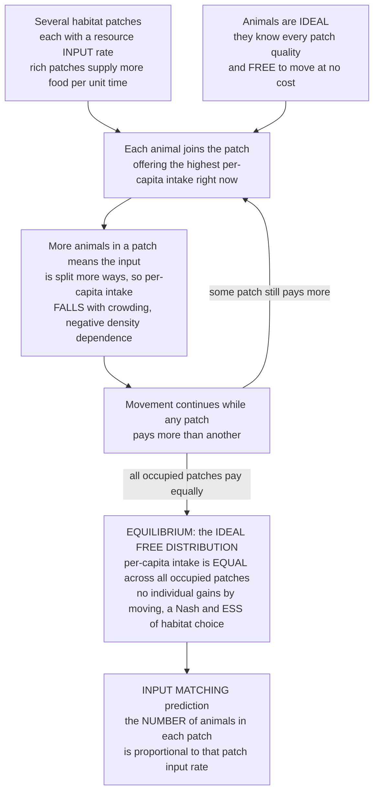

# 🦆 Foraging and the Ideal Free Distribution

> [!abstract] TL;DR
> Where an animal should feed depends on where *everyone else* feeds — a rich patch shared by a crowd yields little per head — so **habitat selection is a population game, not a solo optimization**. The **Ideal Free Distribution** (Fretwell & Lucas, 1970) is its equilibrium: if animals are **ideal** (know every patch's quality) and **free** (move without cost), they spread themselves until the **per-capita intake is equal across all occupied patches** — because any patch that paid more would immediately attract movers until competition equalized it. This is a **Nash equilibrium and ESS of habitat choice**, and it delivers a sharp, testable prediction — **input matching**: the *number* of foragers in each patch is **proportional to that patch's resource input rate**. Ducks fed bread at two ends of a pond, and sticklebacks over two feeders, sort themselves to match the feeding rates **within seconds**. Real distributions often show **undermatching** (too few in the rich patch) when the ideal/free assumptions break — travel costs, imperfect information, unequal competitive ability (the *despotic* distribution), interference. The related **producer-scrounger** game explains social foraging as a stable mix of finders and thieves. And the whole framework is **formally identical** to market equilibria, the psychologist's *matching law*, and traffic (Wardrop) equilibria — the same equalize-until-nobody-gains logic.

---

## Intuition

**Analogy:** Picture two food patches at opposite ends of a pond and a flock of hungry birds. The left patch is stocked twice as fast as the right. Where should each bird go? If *all* of them pile into the rich left patch, it becomes so crowded that each bird pecks up almost nothing — while the "poorer" right patch sits empty, and empty means every crumb there is yours. So the empty patch is now the *better* bet, and birds peel off toward it. They keep shuffling until a remarkable balance is struck: **accounting for the crowd, every bird does equally well no matter where it stands.** No individual can improve by switching. That balance is the **Ideal Free Distribution** — and the punchline is that it predicts the birds will split *exactly* in proportion to the feeding rates: **twice the input, twice the birds**, so intake per bird is identical everywhere.

The deep point is that "the best patch" is not a fixed property of the patch — it is **frequency- and density-dependent**, defined by what all the *other* foragers decide (exactly the logic of `[[Fitness_Payoffs_and_Population_Games]]`). A lone forager would just march to the richest patch and stay. A *population* of foragers plays a game against itself, and the game's equilibrium is the IFD. The startling part is not that theorists can write this down — it is that real fish and ducks *play it accurately*, matching the prediction in real time.

---

## How It Works

### Habitat selection is a game, not an optimization

Classical **optimal foraging theory** treats a single animal maximizing intake: which prey to eat (diet choice), when to quit a depleting patch (the **marginal value theorem**). That is *individual optimization* — the environment is a fixed backdrop. The instant **competitors interact** — because they deplete the same food, interfere with each other, or simply divide a shared input — the payoff of "go to patch A" depends on **how many others also chose A**. The problem flips from optimization to a **population game** (`[[Fitness_Payoffs_and_Population_Games]]`): the best response is defined *relative to the crowd's distribution*, and we must look for an equilibrium of that mutual dependence rather than a single best move.

### The Fretwell-Lucas assumptions: "ideal" and "free"

The Ideal Free Distribution (Fretwell & Lucas, 1970) rests on two idealizations, and naming them is naming exactly where reality will later deviate:

- **Ideal** — every animal has *perfect knowledge* of the intake rate available in every patch (it can assess quality and current crowding).
- **Free** — every animal can *move to any patch at no cost* (no travel time, no territorial exclusion, no dominance barrier).

Under these assumptions, each individual simply moves to whichever patch currently offers the **highest per-capita intake**.

### The equilibrium: equal intake everywhere

Let patch `i` supply resources at input rate `Q_i` and hold `n_i` competitors. In the simplest **continuous-input** model, the food is divided among whoever is present, so per-capita intake is

$$W_i = \frac{Q_i}{n_i}.$$

Now run the logic. Suppose two occupied patches paid *unequally* — say `W_A > W_B`. Then an animal in `B` could raise its intake by walking to `A`; being **free**, it does. That *raises* `n_A` and *lowers* `n_B`, which **lowers** `W_A` and **raises** `W_B`. Movement continues as long as any inequality remains. It stops precisely when

$$W_i = W_j \quad \text{for all occupied patches } i, j.$$

At this point **no individual can improve by moving** — the defining property of a **Nash equilibrium**, and (because it is uninvadable by a mutant "move elsewhere" strategy) an **ESS of habitat selection** (`[[Evolutionarily_Stable_Strategies]]`). The equalization is enforced by **negative density dependence**: adding animals to a patch lowers its per-capita payoff, the same self-correcting force that stabilizes the mixed equilibrium in `[[The_Hawk_Dove_Game]]`, here acting on *space* rather than on *strategy*.

### The input-matching prediction

Equal intake is not just qualitative — it pins down the *numbers*. Set `W_i = W_j`:

$$\frac{Q_i}{n_i} = \frac{Q_j}{n_j} \;\Longrightarrow\; \frac{n_i}{n_j} = \frac{Q_i}{Q_j}.$$

So for a total population `N` across patches with total input `Q_\text{tot}`,

$$\boxed{\,n_i = N\,\frac{Q_i}{Q_\text{tot}}\,}$$

the **number of foragers in each patch is proportional to that patch's resource input** — **input matching**. A patch stocked twice as fast holds twice as many animals, which *exactly* cancels in `W_i = Q_i / n_i`, leaving everyone with the same intake `Q_\text{tot}/N`. This is a precise, falsifiable quantitative law derived from pure equilibrium reasoning — the property the `## Python Demo` below both derives and simulates.

### Flow of the argument



### Producer-scrounger: a second foraging game

A different foraging game arises *within* a group. Some individuals **produce** — search for and discover food; others **scrounge** — exploit the discoveries of producers (kleptoparasitism, joining a finder at its food). Scrounging pays handsomely **when producers are common** (plenty of discoveries to steal) and poorly **when scroungers are common** (nothing left to scrounge). This is textbook **negative frequency dependence**, and the ESS is a **stable mix** of producers and scroungers — a Hawk-Dove-like coexistence in a foraging costume (`[[The_Hawk_Dove_Game]]`). It explains food-stealing, information parasitism, and why flocks maintain both diligent searchers and opportunistic followers rather than collapsing to all of one type.

### Deviations: from ideal-free to despotic

The IFD's assumptions are exactly its failure modes. Relax **free** by adding **unequal competitive ability** — dominants monopolize the rich patch and *exclude* subordinates — and you get the **Ideal Despotic Distribution**: intake is now *unequal* (dominants do better), and the numbers no longer match input. Relax **ideal** with perceptual limits or travel costs and animals systematically **undermatch** — too few in the rich patch, too many in the poor one, a flatter distribution than input matching predicts. **Interference** (foragers getting in each other's way, distinct from simple depletion) likewise bends the exponent. These are not embarrassments but the *productive* gap between a clean theory and messy data — each deviation diagnoses which assumption nature violated.

---

## Key Concepts

**Secondary (intuition level)**
- The best place to eat depends on **where everyone else eats** — a crowded rich patch can be worse than an empty poor one.
- At balance, **every animal does equally well everywhere** and no one gains by moving — the Ideal Free Distribution.
- **Twice the food supply, twice the foragers** — animals match their numbers to the resource (input matching).

**Undergraduate (formal level)**
- **IFD equilibrium**: per-capita intake `W_i = Q_i / n_i` is *equal across all occupied patches*; it is the Nash equilibrium / ESS of the habitat-selection game.
- **Input matching**: `n_i = N · Q_i / Q_tot` — patch occupancy is proportional to patch input; intake equalizes to `Q_tot / N`.
- **Fretwell-Lucas assumptions**: *ideal* (perfect patch knowledge) and *free* (costless movement, no exclusion).
- **Producer-scrounger ESS**: a stable producer/scrounger mixture maintained by negative frequency dependence.
- **Undermatching / despotic distribution**: deviations when ideal/free break — travel cost, imperfect info, dominance exclusion, interference.

**Graduate (research level)**
- **Interference model** (Sutherland, 1983): if per-capita intake scales as `W_i ∝ Q_i / n_i^m` with interference exponent `m`, the equilibrium is `n_i ∝ Q_i^{1/m}`. `m = 1` recovers input matching; `m > 1` yields **undermatching** (rich patches under-used); the fitted exponent is an empirical handle on interference/competitive asymmetry.
- **IFD as a population-game potential equilibrium**: the equal-payoff condition is the first-order condition of an aggregate potential; it coincides with the rest point of `[[Replicator_Dynamics]]` / best-response dynamics on patch choice (average intake `Q_tot/N` is invariant, so replicator drives every patch to the mean).
- **Continuous-input vs interference-vs-depletion**: the same equilibrium concept, different micro-mechanics of how `W_i` declines with `n_i` (share of a flow, mutual interference, or standing-stock depletion), each predicting a different matching exponent.
- **Formal identity with economics/psychology**: the IFD equal-payoff condition *is* Wardrop's traffic equilibrium (all used routes have equal travel time), a competitive market equilibrium (agents distribute until returns equalize, `[[Market_Equilibrium]]`), and Herrnstein's **matching law** (response rate proportional to reinforcement rate, `[[Reinforcement_Schedules]]`).

---

## Python Demo

This demo **derives and simulates the Ideal Free Distribution**. Several habitat patches are given different resource **input rates** `Q`. Per-capita intake in a patch is `W_i = Q_i / p_i` (input divided by the fraction of foragers there — more competitors, less each). Animals follow a **best-response / replicator dynamic of patch choice**, drifting toward whichever patch currently pays above the population average. We show the population **settles to the IFD**: per-capita intake becomes **equal across all patches**, and occupancy **matches input** (`p_i → Q_i / Q_tot`). We then break the assumptions with an **interference exponent** `m > 1` to reproduce the classic empirical deviation, **undermatching** (too few in the rich patch). Requires only `numpy` and `matplotlib`.

```python
# Ideal Free Distribution: derive and simulate input matching + equal intake.
#   patches have different resource INPUT rates Q
#   per-capita intake  W_i = Q_i / p_i^m   (m = 1 is the standard continuous-input model)
#   animals move toward above-average patches (replicator / best-response on PATCH CHOICE)
#   equilibrium:  W_i equal everywhere  and  p_i proportional to Q_i^(1/m)
import numpy as np
import matplotlib.pyplot as plt

# --- Habitat patches: patch 3 is stocked 8x faster than patch 0 ---
Q = np.array([1.0, 2.0, 4.0, 8.0])          # resource input rate per patch
K = len(Q)
Qtot = Q.sum()
p_pred = Q / Qtot                            # IFD input-matching prediction (m = 1)

def intake(p, m=1.0, eps=1e-12):
    """Per-capita intake in each patch: input split among the competitors present."""
    return Q / np.power(p + eps, m)

def simulate(m=1.0, alpha=0.6, T=60):
    """Exponential (logit) replicator on patch choice; returns occupancy + intake histories."""
    p = np.full(K, 1.0 / K)                 # start: everyone spread evenly
    P, W = [p.copy()], [intake(p, m)]
    for _ in range(T):
        w = intake(p, m)
        wbar = p @ w                        # population-average intake
        p = p * np.exp(alpha * (w - wbar))  # drift toward above-average patches
        p /= p.sum()                        # keep it a distribution
        P.append(p.copy()); W.append(intake(p, m))
    return np.array(P), np.array(W)

# Standard IFD (m = 1): expect input matching + equal intake
P1, W1 = simulate(m=1.0)
# Broken assumptions (m = 1.6: interference / unequal competition): expect undermatching
P2, W2 = simulate(m=1.6)
p_under = np.power(Q, 1.0 / 1.6); p_under /= p_under.sum()   # analytic undermatched eqm

# ---- Report ----
print("Ideal Free Distribution  (m = 1, standard continuous-input model)")
print(f"  input-matching prediction  p_i = Q_i / Qtot : {np.round(p_pred, 3)}")
print(f"  simulated equilibrium       p_i(final)       : {np.round(P1[-1], 3)}")
print(f"  per-capita intake W_i(final): {np.round(W1[-1], 3)}"
      f"   -> all equal to Qtot/1 = {Qtot:.1f}? spread = {W1[-1].ptp():.2e}")
print()
print("Broken assumptions (m = 1.6): UNDERMATCHING")
print(f"  analytic eqm  p_i = Q_i^(1/m)/Z : {np.round(p_under, 3)}")
print(f"  richest patch: input matching wants {p_pred[-1]:.3f}, "
      f"undermatching gives only {p_under[-1]:.3f}  (too few in the rich patch)")

# ---- Visualize ----
fig, ax = plt.subplots(1, 3, figsize=(16, 4.6))
colors = plt.cm.viridis(np.linspace(0.1, 0.9, K))

# Panel 1: occupancy converges to input matching
for i in range(K):
    ax[0].plot(P1[:, i], color=colors[i], lw=2, label=f"patch {i}  Q={Q[i]:g}")
    ax[0].axhline(p_pred[i], color=colors[i], ls="--", lw=1)
ax[0].set_title("Occupancy converges to INPUT MATCHING\n(dashed = Q_i / Qtot)")
ax[0].set_xlabel("movement rounds"); ax[0].set_ylabel("fraction of foragers in patch")
ax[0].legend(fontsize=8, loc="center right"); ax[0].grid(alpha=0.3)

# Panel 2: per-capita intake equalizes across patches
for i in range(K):
    ax[1].plot(W1[:, i], color=colors[i], lw=2, label=f"patch {i}  Q={Q[i]:g}")
ax[1].axhline(Qtot, color="k", ls=":", lw=1.5, label=f"equal intake = Qtot = {Qtot:g}")
ax[1].set_title("Per-capita intake EQUALIZES\n(no one gains by moving = IFD)")
ax[1].set_xlabel("movement rounds"); ax[1].set_ylabel("per-capita intake  W_i")
ax[1].legend(fontsize=8, loc="upper right"); ax[1].grid(alpha=0.3)

# Panel 3: input matching vs undermatching (occupancy vs input)
x = np.arange(K); wbar_w = 0.26
ax[2].bar(x - wbar_w, p_pred,   width=wbar_w, color="tab:green",
          label="input matching (m=1)")
ax[2].bar(x,          P1[-1],   width=wbar_w, color="tab:blue",
          label="simulated IFD (m=1)")
ax[2].bar(x + wbar_w, p_under,  width=wbar_w, color="tab:red",
          label="undermatching (m=1.6)")
ax[2].set_xticks(x); ax[2].set_xticklabels([f"patch {i}\nQ={Q[i]:g}" for i in range(K)])
ax[2].set_title("Input matching vs undermatching\n(rich patch is under-used when m>1)")
ax[2].set_ylabel("equilibrium fraction of foragers")
ax[2].legend(fontsize=8); ax[2].grid(alpha=0.3, axis="y")

fig.suptitle("The Ideal Free Distribution: foragers match input until intake is equal everywhere",
             fontsize=13)
fig.tight_layout(rect=[0, 0, 1, 0.94])
plt.savefig("ideal_free_distribution.png", dpi=120)
print("\nsaved figure -> ideal_free_distribution.png")
plt.show()
```

Expected output — the simulation lands exactly on the input-matching prediction and intake goes flat:

```
Ideal Free Distribution  (m = 1, standard continuous-input model)
  input-matching prediction  p_i = Q_i / Qtot : [0.067 0.133 0.267 0.533]
  simulated equilibrium       p_i(final)       : [0.067 0.133 0.267 0.533]
  per-capita intake W_i(final): [15. 15. 15. 15.]   -> all equal to Qtot/1 = 15.0? spread = ...e-..
Broken assumptions (m = 1.6): UNDERMATCHING
  analytic eqm  p_i = Q_i^(1/m)/Z : [0.116 0.179 0.277 0.427]
  richest patch: input matching wants 0.533, undermatching gives only 0.427  (too few in the rich patch)
```

Reading the panels: **Panel 1** — occupancy fractions climb or fall to the dashed input-matching lines `Q_i / Q_tot`; the richest patch (8x input) ends with ~8x the foragers of the poorest. **Panel 2** — the per-capita intake lines, initially unequal (the rich patch pays far more at the start), *converge to a single value* `Q_tot / N`: at the IFD everyone does equally well, so no one has an incentive to move. **Panel 3** — with `m = 1` the simulated equilibrium (blue) sits on the input-matching prediction (green); crank interference to `m = 1.6` (red) and the rich patch is systematically **under-populated** — the empirically ubiquitous *undermatching*.

---

## Real-World Applications

- **Ducks on a pond (the canonical demonstration).** Harper (1982) threw bread balls at two ends of a pond at different rates; the mallards distributed themselves in proportion to the feeding rates and **reached the IFD within about a minute** — even before individuals had personally sampled both ends, implying they used the *distribution of other ducks* as information.
- **Fish over feeders.** Sticklebacks and cichlids given two food sources at different delivery rates split to match the input ratio in seconds, and re-sort when the ratio is switched — one of the tightest confirmations of a game-theoretic prediction in all of biology.
- **Parasites, ovipositing insects, and mates.** The IFD generalizes far beyond food: parasitoid wasps distribute eggs across host patches, dung flies distribute across cowpats by female arrival rate, and the sex-ratio/mate-distribution literature uses the same equal-payoff logic — competitors spread until marginal return equalizes.
- **Fisheries and conservation.** Where fish and fishers aggregate is an IFD problem; ideal-free reasoning predicts how exploited populations redistribute across habitat and why "hyperstable" catch rates can mask depletion (density stays high in the last good patches). Habitat-selection models inform reserve design and harvest control.
- **Social foraging and information use.** Producer-scrounger dynamics govern flocks, human crowds, and information economies — the stable coexistence of those who *generate* value (find the food, do the research) and those who *exploit* others' discoveries.

---

## Common Pitfalls

- **Quoting a patch's quality without the crowd.** "Patch A is better" is meaningless at equilibrium — the whole point is that competition **equalizes** per-capita payoff. Quality is what a patch offers *after* accounting for who else is there.
- **Confusing input matching with equal numbers.** The IFD does *not* put equal numbers in each patch; it puts numbers *proportional to input* so that *intake* is equal. Equal payoff, unequal headcounts.
- **Expecting perfect matching in real data.** Nature usually **undermatches** (too few in the rich patch). This is a *feature* — it flags a violated assumption (travel cost, imperfect information, interference, dominance) — not a refutation of the framework.
- **Ignoring unequal competitors.** With dominance, the **despotic** distribution replaces the ideal-free one: intake is *no longer* equal (dominants do better), and occupancy no longer matches input. Applying the IFD to a strongly hierarchical species misleads.
- **Treating foraging as pure optimization when competitors interact.** The marginal value theorem and diet choice are individual optimization; the moment depletion or interference couples foragers, it becomes a game and the IFD, not the single-forager optimum, governs.
- **Forgetting the mechanism of density dependence.** Continuous-input sharing, mutual interference, and standing-stock depletion all produce an IFD but with *different* matching exponents — assuming `n_i ∝ Q_i` universally ignores the interference term `m`.

---

## Related Concepts

- [[Fitness_Payoffs_and_Population_Games]] — the foundational frame: fitness (here, intake) depends on the population's distribution, so habitat choice is frequency/density-dependent — a population game, not solo optimization.
- [[Evolutionarily_Stable_Strategies]] — the IFD is the ESS of the habitat-selection game: no rare mutant "move elsewhere" can invade because every occupied patch already pays the same.
- [[The_Hawk_Dove_Game]] — the sibling model whose negative frequency dependence stabilizes a *strategy* mixture; producer-scrounger is a Hawk-Dove-like coexistence, and the IFD applies the same self-correcting logic to *space*.
- [[Replicator_Dynamics]] — the explicit dynamic under which patch occupancy converges to the IFD; the demo's best-response/replicator update on patch choice.
- [[Population_Ecology]] — density-dependent regulation and how populations distribute across habitat; the ecological setting the IFD formalizes.
- [[Community_Ecology]] — competition, coexistence, and resource partitioning among species, the multi-species backdrop to habitat selection.
- [[Natural_Selection_and_Adaptation]] — the engine that would favor animals capable of tracking the best patch, making ideal-free behavior itself an adaptation.
- [[Population_Genetics]] — frequency-dependent selection, the allele-level cousin of the density-dependent equalization driving the IFD.
- [[Market_Equilibrium]] — the IFD is formally a market equilibrium: agents redistribute across opportunities until marginal returns equalize (arbitrage away any surplus).
- [[Nash_Equilibrium_Applications]] — the IFD as an applied Nash equilibrium of a many-player game; equal payoff = no profitable unilateral deviation.
- [[Reinforcement_Schedules]] — Herrnstein's *matching law* (response allocated in proportion to reinforcement rate) is the behavioral-psychology twin of input matching on concurrent schedules.
- [[Behavioral_Economics_Psychology]] — the choice-allocation and matching-behavior findings that connect animal foraging to human decision-making.
- [[Cooperation_and_Evolutionary_Game_Theory]] — the systems-thinking treatment of EGT equilibria and social dilemmas that frames producer-scrounger and habitat games.

> Planned siblings in this vault, referenced in prose above — *Animal_Conflict_and_Signaling* (assessment and the War of Attrition), *Evolutionary_Economics_and_Bounded_Rationality*, and *Evolutionary_Dynamics_in_Markets_and_Institutions* — will expand the economics/traffic equivalences once created.

---

## Review Questions

**Tier 1 — Conceptual**
1. Why is choosing a foraging patch a *game* rather than an *optimization* problem? What single feature of the payoff makes "the best patch" depend on other foragers?
2. State the two Fretwell-Lucas assumptions ("ideal" and "free") and explain, in words, why they force per-capita intake to be *equal* across all occupied patches at equilibrium.

**Tier 2 — Applied**
3. Three patches supply food at rates `Q = [1, 3, 6]` and there are 100 foragers. Under the IFD with simple continuous-input sharing, how many animals settle in each patch, and what is each individual's intake? Show that no one can improve by switching patches.
4. Ducks are fed at two pond ends at rates 2:1. Sketch what the IFD predicts for their split, and describe one concrete reason a field observation might show *undermatching* (too few at the rich end). Which assumption did that reason violate?

**Tier 3 — Analytical / Open-ended**
5. Using the interference model `W_i ∝ Q_i / n_i^m`, derive the equilibrium relationship between occupancy `n_i` and input `Q_i`. Explain why `m > 1` produces undermatching and `m = 1` recovers input matching, and describe how you would *estimate* `m` from field counts across patches of known input.
6. The IFD, a competitive market equilibrium, Herrnstein's matching law, and Wardrop's traffic equilibrium are all "equalize until nobody gains" conditions. Pick two of these, state precisely what quantity is being equalized in each, and argue what this cross-disciplinary identity reveals about when *decentralized, self-interested* agents will reach an efficient (or inefficient) distribution.

---

## Sources

- Fretwell, S. D. & Lucas, H. L. (1970). "On territorial behavior and other factors influencing habitat distribution in birds." *Acta Biotheoretica*, 19, 16–36. — the original Ideal Free (and Despotic) Distribution.
- Harper, D. G. C. (1982). "Competitive foraging in mallards: ideal free ducks." *Animal Behaviour*, 30, 575–584. — the classic experimental confirmation with input matching.
- Sutherland, W. J. (1983). "Aggregation and the ideal free distribution." *Journal of Animal Ecology*, 52, 821–828. — the interference model and undermatching (the `m` exponent).
- Giraldeau, L.-A. & Caraco, T. (2000). *Social Foraging Theory*. Princeton University Press. — IFD, producer-scrounger games, and social foraging as game theory.
- Stephens, D. W. & Krebs, J. R. (1986). *Foraging Theory*. Princeton University Press. — optimal foraging, the marginal value theorem, and the shift to game-theoretic foraging.
- Herrnstein, R. J. (1961). "Relative and absolute strength of response as a function of frequency of reinforcement." *Journal of the Experimental Analysis of Behavior*, 4, 267–272. — the matching law, the behavioral twin of input matching.

---

#evolutionary-game-theory #ideal-free-distribution #foraging #habitat-selection #input-matching
