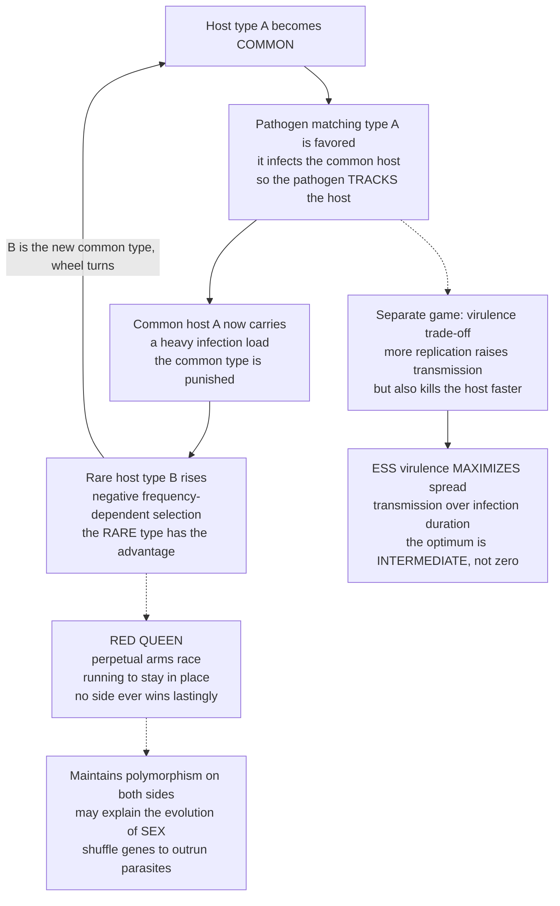

# 🦠 Host-Pathogen Coevolution and the Evolution of Virulence

> [!abstract] TL;DR
> A host and its pathogen play a **coevolutionary game**: each imposes selection on the other, so neither optimizes against a fixed opponent — both chase a moving target. Under **matching-allele** (or **gene-for-gene**) genetics, a pathogen thrives against the *currently common* host genotype, which hands **rare host types an advantage** — pure **negative frequency-dependent selection**. The result is the **Red Queen** (Van Valen): a perpetual arms race where a host defense spreads, a pathogen counter spreads, and around it goes — "it takes all the running you can do, to keep in the same place." Coupled host and pathogen frequencies **cycle forever** (Red Queen oscillations, a genetic rock-paper-scissors), maintaining polymorphism on both sides. This same parasite-driven cycling is a leading explanation for the very existence of **sex** (Hamilton–Jaenike): recombination shuffles genes into rare combinations that fast-evolving parasites have not yet cracked, paying the two-fold cost of sex. A *separate* game governs how **harmful** a pathogen should be: the old "parasites evolve toward benignity" story is wrong; the **transmission-virulence trade-off** makes the ESS virulence an **intermediate** optimum that maximizes spread. This framing drives urgent applications — imperfect vaccines can select *nastier* pathogens (Marek's disease), and **antibiotic resistance** is host-pathogen coevolution unfolding in real time.

---

## Intuition

**Analogy:** In Lewis Carroll's *Through the Looking-Glass*, the Red Queen grabs Alice's hand and they run flat out — yet the scenery never moves. "Now, *here*, you see, it takes all the running you can do, to keep in the same place." Host and pathogen are locked in exactly this race. Every time the host evolves a new lock, the pathogen evolves a new key; every time the pathogen finds a key, the host changes the lock. Both sprint at full speed and **neither ever pulls ahead** — the arms race is perpetual, and standing still means falling behind. Absolute fitness climbs on both sides while *relative* fitness stays pinned.

Technically, this is a **frequency-dependent coevolutionary game**: a pathogen does best against whatever host type is *common right now*, so it tracks the host; and because the common host is the one being hunted, being **rare is an advantage**. This endless chase may even explain why **sex** exists — reshuffling genes every generation keeps hosts one step ahead of parasites that would otherwise lock onto a stable clone.

---

## How It Works

### Coevolution is a game with a moving opponent

Ordinary natural selection optimizes a trait against a *fixed* environment. **Coevolution** is different: the "environment" for the host is *the pathogen*, and the environment for the pathogen is *the host* — and both are **evolving simultaneously**. Each side's optimal strategy depends on the other's current state, so there is no fixed fitness landscape to climb; the landscape deforms as your opponent adapts. This is **reciprocal selection**, and it is precisely the structure of a `[[Fitness_Payoffs_and_Population_Games|population game]]` where a strategy's payoff depends on the frequencies of others — except here the "others" are a *second* coevolving species. Hosts evolve **resistance** (better locks, immune recognition); pathogens evolve **infectivity** (better keys, immune evasion, counter-defenses). The same template covers predator-prey speed races, plant-herbivore chemical warfare, and mimicry.

### Matching-allele and gene-for-gene genetics

Two genetic models turn "reciprocal selection" into concrete, cycling dynamics:

1. **Matching-allele (MA).** A pathogen infects a host only if their genotypes **match** (self-recognition inverted: the parasite must key onto the host's specific type). A pathogen of type *j* therefore prospers when host type *j* is common — so pathogens **track the common host type**. That immediately makes **rare host genotypes advantageous**: whatever host type is scarce is *not* the one parasites are adapted to. This is textbook **negative frequency-dependent selection**, the engine of the whole system.
2. **Gene-for-gene (GFG).** Classic in plant-pathogen systems (Flor's flax-rust work). Host **resistance (R)** genes recognize pathogen **avirulence (Avr)** gene products; a matching R-Avr pair triggers defense. Pathogens escape by losing or altering Avr; hosts respond by stacking new R genes. GFG tends toward escalating "arms-race" dynamics (new alleles sweep and accumulate), whereas MA tends toward "trench-warfare" **cycling** of a fixed allele set — but both produce reciprocal, frequency-dependent coevolution.

### The Red Queen: perpetual cycling, no lasting victory

Feed matching-allele genetics into coupled evolutionary dynamics and you get the **Red Queen** (Van Valen, 1973). Host type A rises → the A-matching pathogen is favored and rises → common host A now suffers heavy infection and falls → a formerly rare host type B rises → the B-matching pathogen rises → and the wheel turns. **No side achieves lasting victory.** The frequencies of host and pathogen genotypes trace **out-of-phase oscillations**, with the pathogen lagging a quarter-cycle behind the host it chases. This is a coevolutionary sibling of the cyclic dominance in `[[Cyclic_Dynamics_and_Rock_Paper_Scissors]]`: like rock-paper-scissors, there is no "best" genotype, only perpetual motion that **maintains polymorphism** on both sides. Continual adaptation buys only *constant relative fitness* — the coevolutionary treadmill.

### The Red Queen and the evolution of sex

Sex is expensive. An asexual (cloning) female passes on **100%** of her genes; a sexual female passes on only **50%** and must find a mate — Maynard Smith's **two-fold cost of sex**. So why is sex nearly universal? The **Red Queen hypothesis for sex** (Hamilton; Jaenike; Bell) says: **parasites.** A clone is a fixed target; once parasites adapt to the common clone, they devastate it. **Sexual recombination shuffles genes every generation**, generating *rare* genotype combinations that fast-evolving parasites have not yet cracked. Parasite-driven negative frequency-dependent selection thus **favors recombination over cloning**, and the benefit can outweigh the two-fold cost when parasites are virulent and coevolve fast. The evidence is striking: in the New Zealand snail *Potamopyrgus antipodarum*, **sexual forms dominate exactly where trematode parasites are prevalent**, while clones dominate parasite-free habitats; *Daphnia* show the same pattern. Recombination is covered mechanistically in `[[Meiosis_and_Genetic_Variation]]` and `[[Linkage_Mapping_and_Recombination]]`.

### The evolution of virulence: an intermediate ESS

A *separate* game asks how **harmful** a pathogen should be. The old "conventional wisdom" — parasites evolve toward **benignity** to preserve their host — is **wrong**. The modern **trade-off theory** notes that virulence (host damage) is *coupled* to transmission: more within-host replication means more transmission **but also faster host death**, which cuts the infectious period short. Natural selection maximizes the pathogen's total spread, captured by its basic reproduction number

$$R_0(\alpha) = \frac{\beta(\alpha)}{\mu + \gamma + \alpha}$$

where `α` is virulence (disease-induced host death rate), `β(α)` is a *saturating, increasing* transmission function, `μ` is background mortality, and `γ` is recovery. Because more virulence buys transmission with diminishing returns while steadily shortening infection duration, `R_0` is maximized at an **intermediate** virulence `α*` — **not zero.** That `α*` is the **ESS virulence** (uninvadable by mutants that are either more or less virulent). Pathogens stay harmful because harm and transmission are two ends of the same lever. When virulence is treated as a *continuous* evolving trait, this is exactly an `[[Adaptive_Dynamics_and_Evolutionary_Branching|adaptive-dynamics]]` problem: find the singular strategy where the selection gradient on `α` vanishes.



---

## Key Concepts

**Secondary (intuition level)**
- **Arms race.** Host and pathogen keep inventing better locks and keys; neither ever wins for good.
- **Rare is safe.** Whatever host type is common gets hunted, so being unusual is an advantage — parasites have not adapted to you.
- **Why sex.** Mixing genes each generation makes children that parasites have not figured out yet — a possible reason sex beats cloning despite its cost.
- **Nasty for a reason.** A germ that replicates hard spreads well but kills fast; the best strategy is usually *middling* harm, not none.

**Undergraduate (formal level)**
- **Reciprocal, frequency-dependent selection.** Each species' fitness landscape is set by the *frequencies* of the other's genotypes; the two landscapes deform each other.
- **Matching-allele vs gene-for-gene.** MA gives rare-type advantage and **cycling** (trench warfare); GFG gives recognition-based defense and tends to **escalation** (arms race).
- **Red Queen oscillations.** Coupled genotype frequencies trace out-of-phase cycles; the pathogen lags the host by roughly a quarter period. Diversity is *maintained*, not eroded.
- **Transmission-virulence trade-off.** `R_0(α) = β(α)/(μ + γ + α)`; the ESS virulence `α*` maximizes `R_0` and is generically interior.
- **Two-fold cost of sex.** An asexual lineage doubles per capita, so any benefit of sex (like Red Queen escape) must overcome a 2× disadvantage.

**Graduate (research level)**
- **Coupled replicator / bimatrix dynamics.** MA coevolution is an *asymmetric* (two-population) game; its interior equilibrium is typically a **center** with closed orbits — a conserved quantity yields neutral cycling, mirroring zero-sum RPS. Adding costs of resistance or virulence turns the center into an inward or outward spiral.
- **Trench warfare vs arms race regimes.** Whether polymorphism is *maintained* (balancing selection, stable cycles) or *replaced* (recurrent selective sweeps) depends on the cost structure of resistance and infectivity, mutation supply, and generation-time asymmetry between host and pathogen.
- **Superinfection and multilevel selection.** Within-host competition among coinfecting strains selects for **higher** virulence than the between-host `R_0`-maximizing optimum — a tragedy-of-the-commons that connects to microbial public-goods games (planned sibling `Microbial_Games_and_Public_Goods`).
- **Virulence management.** Interventions that decouple transmission from virulence change the ESS. **Imperfect (leaky) vaccines** that block symptoms/mortality but not transmission remove the cost of killing the host and can select for **higher** virulence (Gandon, Read; Marek's disease in poultry). "Evolution-proof" strategies aim to block transmission, not just disease.
- **Eco-evolutionary feedback.** Virulence and host density coevolve with epidemic dynamics; the SIR environment itself is an evolving state variable (planned sibling `Eco_Evolutionary_Dynamics`).

---

## Python Demo

Two coupled simulations. **Simulation 1** runs **matching-allele host-pathogen coevolution**: `n` host genotypes and `n` matching pathogen genotypes evolve by coupled replicator dynamics. A pathogen's fitness rises with the frequency of its *matching* host (it tracks the common host); a host's fitness *falls* with the frequency of its matching pathogen (the common type is punished, so rare types win). The output is **perpetual Red Queen cycling** — host and pathogen frequencies chase each other and never settle, and a phase plane shows the closed-loop chase. **Simulation 2** models the **transmission-virulence trade-off** and locates the **ESS virulence** that maximizes `R_0`, confirming it is *intermediate*, not zero. Pure `numpy` (hand-written RK4) plus `matplotlib`.

```python
# Host-pathogen coevolution (Red Queen) + the transmission-virulence trade-off.
# 1) Matching-allele replicator dynamics: rare-host advantage -> endless cycling.
# 2) R0(virulence) trade-off -> an INTERMEDIATE ESS virulence.
import numpy as np
import matplotlib.pyplot as plt

# ============================================================================
# SIMULATION 1: MATCHING-ALLELE COEVOLUTION (RED QUEEN CYCLING)
# ============================================================================
# n host genotypes h[i] and n pathogen genotypes p[j].
# Matching-allele: pathogen j infects host i iff i == j  (Q = identity).
#   Host fitness    f_h[i] = -v * (Q @ p)[i]  = -v * p[i]
#       -> a host is HURT by the pathogen that MATCHES it. Common host, common
#          matching pathogen, so the common host is punished (rare-type wins).
#   Pathogen fitness f_p[j] = b * (Q.T @ h)[j] = b *  h[j]
#       -> a pathogen GAINS by matching a common host (it TRACKS the host).
# Coupled replicator dynamics on two simplexes -> perpetual Red Queen cycles.

n = 4
Q = np.eye(n)          # matching-allele infection matrix
v = 1.0                # virulence / cost of being infected (host side)
b = 1.0                # transmission benefit (pathogen side)

def coev_rhs(h, p):
    f_h = -v * (Q @ p)                 # host fitnesses (lower = infected)
    f_p =  b * (Q.T @ h)               # pathogen fitnesses (higher = matched)
    dh = h * (f_h - h @ f_h)           # replicator equation, host population
    dp = p * (f_p - p @ f_p)           # replicator equation, pathogen population
    return dh, dp

def rk4_coev(h0, p0, dt=0.02, steps=30000):
    h = np.array(h0, float); h /= h.sum()
    p = np.array(p0, float); p /= p.sum()
    H = np.empty((steps + 1, n)); P = np.empty((steps + 1, n))
    H[0], P[0] = h, p
    for k in range(steps):
        h1, p1 = coev_rhs(h, p)
        h2, p2 = coev_rhs(h + 0.5 * dt * h1, p + 0.5 * dt * p1)
        h3, p3 = coev_rhs(h + 0.5 * dt * h2, p + 0.5 * dt * p2)
        h4, p4 = coev_rhs(h + dt * h3,       p + dt * p3)
        h = h + (dt / 6.0) * (h1 + 2 * h2 + 2 * h3 + h4)
        p = p + (dt / 6.0) * (p1 + 2 * p2 + 2 * p3 + p4)
        h = np.clip(h, 1e-12, None); h /= h.sum()   # project onto simplex
        p = np.clip(p, 1e-12, None); p /= p.sum()
        H[k + 1], P[k + 1] = h, p
    return H, P

# Start slightly off the uniform interior equilibrium to excite the cycle.
h0 = np.array([0.40, 0.30, 0.20, 0.10])
p0 = np.array([0.10, 0.20, 0.30, 0.40])
H, P = rk4_coev(h0, p0)
t = np.arange(H.shape[0]) * 0.02

# ============================================================================
# SIMULATION 2: TRANSMISSION-VIRULENCE TRADE-OFF -> ESS VIRULENCE
# ============================================================================
# R0(a) = beta(a) / (mu + gamma + a),  beta(a) = bmax * a / (a + khalf)
#   transmission rises with virulence but SATURATES; the host dies faster as
#   virulence a grows. R0 is maximized at an INTERMEDIATE virulence a*.
mu, gamma, bmax, khalf = 0.5, 1.0, 4.0, 1.0
a = np.linspace(0.001, 12.0, 4000)
beta = bmax * a / (a + khalf)
R0 = beta / (mu + gamma + a)
a_star = a[np.argmax(R0)]                 # ESS virulence (numerical argmax)
R0_star = R0.max()

# ============================================================================
# VISUALIZE
# ============================================================================
fig = plt.figure(figsize=(13, 10))
colors = ["#c0392b", "#2980b9", "#27ae60", "#8e44ad"]

# (A) Host genotype frequencies oscillate forever.
axA = fig.add_subplot(2, 2, 1)
for i in range(n):
    axA.plot(t, H[:, i], color=colors[i], lw=1.4, label=f"host type {i+1}")
axA.set_title("Host genotypes: RED QUEEN cycling, never settling")
axA.set_xlabel("time"); axA.set_ylabel("frequency")
axA.legend(fontsize=7, loc="upper right")

# (B) Pathogen genotype frequencies chase the host, out of phase.
axB = fig.add_subplot(2, 2, 2)
for j in range(n):
    axB.plot(t, P[:, j], color=colors[j], lw=1.4, ls="--",
             label=f"pathogen type {j+1}")
axB.set_title("Pathogens TRACK the common host, lagging out of phase")
axB.set_xlabel("time"); axB.set_ylabel("frequency")
axB.legend(fontsize=7, loc="upper right")

# (C) Phase plane: host type 1 vs its matching pathogen -> closed-loop chase.
axC = fig.add_subplot(2, 2, 3)
axC.plot(H[:, 0], P[:, 0], color="#16a085", lw=0.8)
axC.plot(H[0, 0], P[0, 0], "ko", ms=6)
axC.set_title("Phase plane: host 1 vs pathogen 1 (the Red Queen chase)")
axC.set_xlabel("host type 1 frequency")
axC.set_ylabel("pathogen type 1 frequency")

# (D) Transmission-virulence trade-off: R0 peaks at INTERMEDIATE virulence.
axD = fig.add_subplot(2, 2, 4)
axD.plot(a, R0, color="#d35400", lw=2.0, label="R0 versus virulence")
axD.axvline(a_star, color="black", ls=":", lw=1.4)
axD.plot(a_star, R0_star, "k*", ms=14)
axD.annotate(f"ESS virulence a* = {a_star:.2f}\n(intermediate, not zero)",
             xy=(a_star, R0_star), xytext=(a_star + 1.5, R0_star * 0.8),
             arrowprops=dict(arrowstyle="->"))
axD.set_title("Virulence trade-off: R0 maximized at INTERMEDIATE virulence")
axD.set_xlabel("virulence a (host death rate)")
axD.set_ylabel("basic reproduction number R0")
axD.legend(fontsize=8)

fig.suptitle("Host-pathogen coevolution: Red Queen cycles + the evolution of virulence",
             fontsize=14)
fig.tight_layout(rect=[0, 0, 1, 0.96])
plt.savefig("host_pathogen_coevolution.png", dpi=120)

# ---- Numerical confirmation ----
host_var = H[t > t.max() * 0.5].var(axis=0).sum()
print("Host frequency variance in the second half of the run:",
      round(host_var, 4), "-> stays large => perpetual cycling, no settling")
print("ESS virulence a* =", round(a_star, 3),
      " with R0* =", round(R0_star, 3), " -> intermediate optimum, not zero")
plt.show()
```

**What the output shows.** Panels A and B: host and pathogen genotype frequencies **oscillate indefinitely**, with pathogens tracking the common host a quarter-cycle behind — the Red Queen never lets either side rest, and all four genotypes persist (polymorphism maintained). Panel C: plotting host type 1 against its matching pathogen traces a **closed loop** — the literal chase, a coevolutionary center just like zero-sum rock-paper-scissors. Panel D: `R_0` as a function of virulence **peaks at an intermediate value** `α*`; too little virulence starves transmission, too much kills the host before it can transmit — the ESS is a game-theoretic compromise, *not* benignity. The printed variance confirms the cycling never damps.

---

## Real-World Applications

> **Example — the New Zealand mud snail (*Potamopyrgus antipodarum*):** the cleanest field test of the Red Queen theory of sex. These snails have both sexual and asexual (clonal) lineages living side by side, parasitized by castrating trematode worms. Curtis Lively found that **sexual snails predominate exactly where and when parasite pressure is high**, while clones win in parasite-free lakes — and that parasites preferentially infect the locally *common* clone, the rare-type advantage the theory predicts. Fast-evolving parasites make recombination pay for itself.

- **Antibiotic and antiviral resistance.** Resistance is host(-humanity)-pathogen coevolution in real time: we deploy a drug (a "defense"), pathogens evolve a counter, we escalate, they escalate. It is a live-fire coevolutionary game with life-and-death stakes. **Evolutionary/adaptive therapy** proposes *managing* rather than maximally killing a pathogen (or tumor) population, keeping drug-sensitive competitors around to suppress resistant mutants — deliberately playing the coevolutionary game rather than trying to "win" it outright. This connects to `[[Vaccines_and_Antibiotics]]` and the planned sibling `Cancer_and_Evolutionary_Medicine`, where somatic tumor evolution is treated the same way.
- **Imperfect ("leaky") vaccines and Marek's disease.** A vaccine that prevents *symptoms and death* but not *transmission* removes the pathogen's cost of harming its host — so it can select for **higher** virulence. Marek's disease virus in poultry has grown markedly more virulent over decades of leaky-vaccine use; unvaccinated birds now die where the ancestral strain merely sickened them. The lesson: **block transmission, not just disease**, or you may breed a nastier pathogen. See `[[Infectious_Disease_Vaccines_and_Immunity]]` and `[[Public_Health_and_Epidemiology]]`.
- **Plant-pathogen gene-for-gene systems.** Crop breeding is applied coevolution. Deploying a single major resistance (R) gene across millions of hectares selects hard for matching virulent pathogen races ("boom and bust" cycles). Gene *pyramiding* (stacking multiple R genes) and spatial *mixtures* slow the pathogen's counter-adaptation — the same logic as combination antibiotic therapy.
- **The immune system as a within-host arms race.** Adaptive immunity (`[[The_Adaptive_Immune_System]]`) and antigenically variable pathogens (influenza drift, HIV escape, malaria *var* genes) coevolve *inside* a single host and across the population, driving the annual reformulation of the flu vaccine — Red Queen dynamics on a yearly clock. Viral evolution and immune evasion sit in `[[Viruses]]`.
- **Beyond disease.** The coevolutionary-game framework extends to **predator-prey** speed races (cheetah vs gazelle), **plant-herbivore** chemical warfare (toxins vs detoxification), **Batesian and Müllerian mimicry** (signaling coevolution, the planned sibling `Animal_Conflict_and_Signaling`), and **mutualisms** that can slide into conflict. Coevolutionary games are everywhere in ecology (`[[Community_Ecology]]`, `[[Population_Ecology]]`).

---

## Common Pitfalls

- **"Parasites evolve to become harmless."** The single biggest myth. Benignity is *not* the endpoint; the transmission-virulence trade-off makes the ESS virulence **intermediate**. A pathogen that stops harming its host may transmit too little to persist. Harm and spread are coupled.
- **"Somebody eventually wins the arms race."** The Red Queen's whole point is that **no side wins lastingly** — absolute fitness improves on both sides while *relative* fitness stays flat. Expecting a permanent victor misreads the dynamics as a race with a finish line rather than a treadmill.
- **"Cycling means the model is broken."** Perpetual oscillation of genotype frequencies is the **correct** outcome of matching-allele coevolution, not a numerical artifact. A system that "settles" has usually lost the frequency-dependence (e.g., you added a cost that damps the center into a spiral) — which may be right, but is a different model.
- **"Vaccines always reduce virulence."** Only vaccines that block **transmission** reliably do. **Leaky** vaccines that block only symptoms can *raise* virulence by removing the host-death cost. Conflating "prevents disease" with "prevents spread" leads to dangerous policy conclusions.
- **"The within-host optimum equals the between-host optimum."** Under **coinfection/superinfection**, within-host competition selects for higher virulence than the population-level `R_0`-maximizing value — a tragedy of the commons. Assuming a single, tidy optimum ignores multilevel selection.
- **"Sex is obviously beneficial."** It carries a **two-fold cost**; any explanation (Red Queen, mutation clearance, etc.) must *beat 2×*. Treating sex as a free good skips the actual puzzle.
- **"More resistance is always better for the host."** Resistance is usually **costly** (metabolic, developmental); when parasites are rare, resistant hosts lose to susceptible ones. That cost is exactly what keeps susceptible alleles in the population and sustains the cycle.

---

## Related Concepts

- [[Fitness_Payoffs_and_Population_Games]] — coevolution is a population game where fitness is frequency-dependent; here the "others" are a second coevolving species, giving reciprocal selection.
- [[Cyclic_Dynamics_and_Rock_Paper_Scissors]] — matching-allele Red Queen cycling is a coevolutionary rock-paper-scissors: no best genotype, a center with closed orbits, perpetual motion.
- [[Adaptive_Dynamics_and_Evolutionary_Branching]] — treating virulence as a continuous evolving trait makes the ESS virulence a singular strategy where the selection gradient vanishes.
- [[Replicator_Dynamics]] — the coupled two-population replicator equations that generate the Red Queen oscillations in the demo.
- [[Evolutionarily_Stable_Strategies]] — the ESS virulence is the uninvadable point of the transmission-virulence trade-off; matching-allele coevolution has *no* static ESS, only cycles.
- [[Asexual_and_Sexual_Reproduction]] — the two-fold cost of sex is the puzzle the Red Queen hypothesis for sex tries to solve.
- [[Meiosis_and_Genetic_Variation]] — recombination is the mechanism that shuffles genes into the rare combinations parasites have not adapted to.
- [[Linkage_Mapping_and_Recombination]] — the genetics of recombination underlying parasite-driven selection for sex.
- [[The_Adaptive_Immune_System]] — the within-host arms race: antigen recognition versus pathogen immune evasion, Red Queen dynamics on an immunological timescale.
- [[Viruses]] — antigenic drift and immune escape (influenza, HIV) are host-pathogen coevolution in action.
- [[Vaccines_and_Antibiotics]] — antibiotic resistance and vaccine design are applied coevolution; interventions reshape the pathogen's fitness landscape.
- [[Infectious_Disease_Vaccines_and_Immunity]] — leaky vaccines, transmission blocking, and the epidemiology behind virulence management.
- [[Public_Health_and_Epidemiology]] — the SIR/`R_0` framework in which the ESS virulence is defined and measured.
- [[Population_Genetics]] — balancing selection and rare-allele advantage are the population-genetic reading of Red Queen polymorphism.
- [[Natural_Selection_Genetic_Drift_and_Bottlenecks]] — the selective and stochastic forces that either sustain or collapse coevolutionary polymorphism.
- [[Natural_Selection_and_Adaptation]] — the substrate: differential reproduction of host and pathogen genotypes drives the whole game.
- [[Community_Ecology]] — coevolution as a coexistence and diversity-maintaining force among interacting species.
- [[Germ_Theory_and_Modern_Medicine]] — the historical shift to seeing disease as living, *evolving* agents, which makes coevolutionary thinking possible.

> Sibling notes planned for this Evolutionary Game Theory vault — `Eco_Evolutionary_Dynamics` (feedback between epidemics and evolving virulence), `Cancer_and_Evolutionary_Medicine` (somatic evolution, adaptive therapy, drug resistance as coevolution), `Microbial_Games_and_Public_Goods` (superinfection, within-host competition, virulence as a commons), and `Animal_Conflict_and_Signaling` (mimicry and predator-prey signaling coevolution) — will each link back to this note as the vault's anchor for host-pathogen coevolution.

---

## Review Questions

**Tier 1 — Conceptual**
1. In plain words, why does the Red Queen say that "running as fast as you can just keeps you in the same place"? What does *absolute* fitness do versus *relative* fitness in a host-pathogen arms race?
2. Under matching-allele genetics, why is a **rare** host genotype at an advantage and a **common** one at a disadvantage? Trace one full turn of the cycle.

**Tier 2 — Applied**
3. The old view said pathogens evolve toward harmlessness. Using `R_0(α) = β(α)/(μ + γ + α)` with a saturating `β`, explain why the ESS virulence is **intermediate** rather than zero, and describe what happens to `R_0` at both extremes of virulence.
4. A new vaccine prevents severe disease and death but does **not** block transmission. Predict how this changes the pathogen's virulence ESS and explain the mechanism. Contrast with a vaccine that blocks transmission. What real system illustrates the danger?

**Tier 3 — Analytical / Open-ended**
5. Explain how parasite-driven negative frequency-dependent selection can favor **sexual reproduction** despite its two-fold cost. What quantitative conditions (parasite virulence, coevolution speed, specificity) make the benefit large enough to overcome 2×, and what field evidence supports it?
6. Under **coinfection**, within-host competition among strains selects for *higher* virulence than the between-host `R_0` optimum. Frame this as a tragedy of the commons, relate it to multilevel selection, and discuss one clinical intervention that could shift the balance back toward lower virulence.

---

## Sources

- Van Valen, L. (1973). "A New Evolutionary Law." *Evolutionary Theory* 1, 1-30. — the original Red Queen hypothesis and the Law of Constant Extinction.
- Hamilton, W. D., Axelrod, R., & Tanese, R. (1990). "Sexual reproduction as an adaptation to resist parasites (a review)." *PNAS* 87, 3566-3573. — the Red Queen theory for the evolution of sex.
- Anderson, R. M., & May, R. M. (1982). "Coevolution of hosts and parasites." *Parasitology* 85, 411-426. — the transmission-virulence trade-off and evolution of intermediate virulence.
- Lively, C. M. (2010). "A Review of Red Queen Models for the Persistence of Obligate Sexual Reproduction." *Journal of Heredity* 101, S13-S20. — matching-allele models and the *Potamopyrgus* snail evidence.
- Read, A. F., et al. (2015). "Imperfect vaccination can enhance the transmission of highly virulent pathogens." *PLoS Biology* 13, e1002198. — leaky vaccines, virulence management, and Marek's disease.
- Nowak, M. A. (2006). *Evolutionary Dynamics: Exploring the Equations of Life*. Harvard University Press. — coupled coevolutionary dynamics and the game-theoretic treatment of virulence.

---

#evolutionary-game-theory #coevolution #red-queen #virulence #host-pathogen
