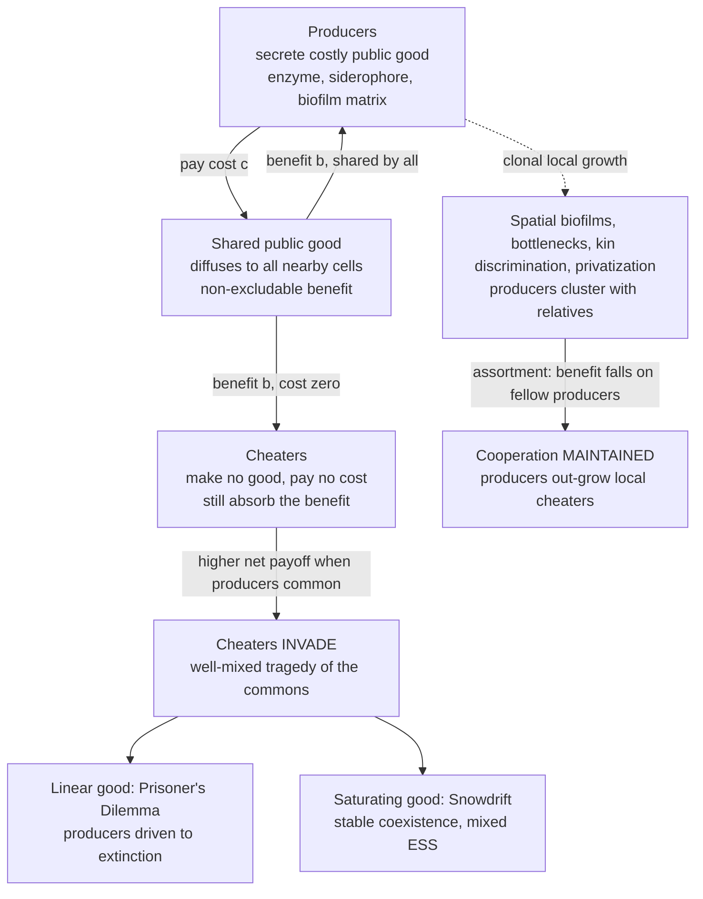

# 🦠 Microbial Games and Public Goods

> [!abstract] TL;DR
> Bacteria have no brains, yet they play the **full repertoire of evolutionary games** — they cooperate, cheat, communicate, and wage chemical war. The central drama is the **public good**: many microbes secrete costly molecules (digestive **enzymes**, iron-scavenging **siderophores**, biofilm matrix, antibiotic-degrading enzymes, virulence factors) that diffuse away and benefit *every* nearby cell. **Producers** pay the cost; the benefit is **shared** — so **cheaters** who make nothing but soak up the benefit can **invade**, a microbial **tragedy of the commons**. Whether cheaters win outright depends on the *shape* of the benefit: a **linear** good gives a Prisoner's-Dilemma collapse, while a **nonlinear/saturating** good (yeast invertase) gives a **snowdrift** game with **stable coexistence** of producers and cheaters. Cooperation is rescued by **assortment** — spatial structure in biofilms, population bottlenecks, kin discrimination, and privatization — the very "five rules" logic seen in animals. Microbes even play **rock-paper-scissors** (the `E. coli` colicin system) and coordinate via **quorum sensing**. Crucially, microbes are evolutionary game theory's **premier experimental testbed**: billions of cells, generations overnight, engineered strains, direct fitness readout — turning ESS predictions, cheater invasion, and spatial rescue from math into repeatable experiments, with payoffs in infection medicine, antibiotic resistance, and synthetic biology.

---

## Intuition

**Analogy:** Imagine a village where anyone can pay to build and stock a **communal well**. The water is free for all to drink — but digging costs sweat and money. A few public-spirited villagers ("producers") pay to keep the well full; everyone drinks from it. Now a clever "cheater" moves in who *never* pays but drinks just the same. He does better than the producers — same water, no cost — so his family grows fastest, and soon the village is full of free-riders and the well runs dry. That is the **tragedy of the commons**, and it is exactly what happens in a flask of bacteria — except the "well" is a cloud of secreted molecules, the "villagers" are cells, and evolution runs the whole experiment overnight, billions of times over.

The revelation of recent decades — **sociomicrobiology** — is that microbes are *not* solitary specks. They form **biofilms**, secrete **shared molecules**, **talk** to each other through chemical signals, and **cheat** on one another, all without a single neuron. A bacterium that secretes a digestive enzyme is paying to feed its neighbors; a mutant that stops secreting keeps the food and the cost savings. The cell "computes" none of this — natural selection does the arithmetic. And because you can grow a billion generations of them in a week, microbes let us take the abstract math of `[[The_Prisoners_Dilemma_and_Cooperation|cooperation]]`, `[[The_Hawk_Dove_Game|conflict]]`, and `[[Cyclic_Dynamics_and_Rock_Paper_Scissors|cyclic dominance]]` and *test it in a Petri dish*.

---

## How It Works

### Core mechanics — the microbial public-goods dilemma

1. **A secreted good is a public good.** Many microbial products are released *outside* the cell and diffuse to whoever is nearby: invertase (yeast digesting sucrose into shared glucose), **siderophores** (molecules that scavenge scarce iron and return it to any cell with the right receptor), the exopolysaccharide **biofilm matrix**, secreted proteases, and **beta-lactamase** (an enzyme that degrades penicillin, protecting even non-producing neighbors). The defining property: **the producer pays the cost, but the benefit is non-excludable and shared.**
2. **Producers pay, cheaters free-ride.** A **producer** cell diverts resources to make and export the good, so its per-cell growth is discounted by a cost `c`. A **cheater** (a natural loss-of-function mutant or an engineered non-producer) makes nothing, pays nothing, yet absorbs the same diffusing benefit. Head-to-head in a **well-mixed** culture, the cheater grows faster — so cheaters **increase in frequency**.
3. **Tragedy of the commons.** As cheaters rise, total public-good production falls, and *everyone's* growth suffers — but selection is blind to the collective: it rewards the locally fitter type. In the simplest (linear-benefit) case, producers are driven toward **extinction**, and the population crashes to a poorly-growing, cheater-dominated state. This is the microbial reading of the `[[The_Prisoners_Dilemma_and_Cooperation|Prisoner's Dilemma]]`: defection dominates, cooperation is unstable.

### The snowdrift twist — coexistence, not collapse

The tragedy is not inevitable. **The shape of the benefit function determines the game.**

- If a producer's *marginal* contribution to its own fitness is always less than the cost `c` regardless of frequency, the good behaves as a **Prisoner's Dilemma** and producers vanish.
- But when the benefit is **nonlinear and saturating** — as with **yeast invertase**, where growth rate is a concave (diminishing-returns) function of local glucose, and producers preferentially **capture a small private share** of what they make — the incentive becomes **frequency-dependent**. When producers are **rare**, the good is scarce and the private capture makes producing *worth it*; when producers are **common**, the good is abundant, the marginal gain from more production is tiny, and cheating pays. Cheaters do **better when producers are common, worse when rare** — the signature of the `[[The_Hawk_Dove_Game|Hawk-Dove / Snowdrift]]` game. The result is a **stable interior mix** (a mixed ESS): producers and cheaters **coexist** indefinitely. Gore, Youk & van Oudenaarden (2009) demonstrated exactly this snowdrift structure experimentally in budding yeast.

### Maintaining cooperation — assortment and the "five rules"

Even for the harsh linear (PD-type) good, cooperation survives whenever producers **preferentially interact with other producers** — i.e., whenever there is positive **assortment**. Every rescue mechanism is a way of generating it, and they mirror the same logic used for animals in `[[Kin_Selection_and_Inclusive_Fitness]]`:

- **Spatial structure (biofilms).** In a structured colony, a producer's secreted good mostly reaches its **immediate neighbors**, who — through clonal growth — are usually its **clonemates**. Producers help copies of themselves; benefit falls on relatives. This is the microbial version of `[[Cyclic_Dynamics_and_Rock_Paper_Scissors|spatial network games]]` (the vault's spatial-games note is planned separately).
- **Population bottlenecks / founder effects.** Repeatedly seeding new colonies from a **few cells** raises within-group **relatedness**: groups founded by a producer stay producer-rich, groups founded by cheaters die out (higher-level selection). This is a clean experimental knob for **group / multilevel selection**.
- **Kin discrimination.** Some microbes recognize and preferentially aid genetically similar cells, directly assorting benefit toward relatives.
- **Privatization.** Keeping the good **partly private** (a producer captures some of what it makes before it diffuses) links cost to benefit and blunts cheating — exactly the invertase mechanism above.
- **Pleiotropy / metabolic constraint.** Tying the cooperative gene to an **essential** function means losing cooperation also breaks something the cheater needs, so cheats are purged.

### Quorum sensing — communication as a game

Microbes also **coordinate**: they release and detect small signaling molecules (**autoinducers**) to estimate their local **density**, and switch on expensive collective behaviors — bioluminescence, virulence-factor secretion, biofilm formation — **only when numerous enough** for the behavior to pay off. This **quorum sensing** is a public-goods-like coordination problem (and is itself open to **signal cheats** who exploit the signal without contributing), a game of microbial communication that parallels honest-signaling theory in animals (an EGT signaling note is planned separately).

### Payoff structure and diagram



---

## Key Concepts

**Secondary (intuition level)**
- **The communal well.** Some cells pay to make a shared resource; freeloaders drink without paying and multiply fastest — until the resource collapses.
- **Microbes are social.** Bacteria cooperate, compete, communicate, and cheat — a whole society in a drop of water, run without any brain.
- **Structure saves cooperation.** If helpers stick together (in a biofilm, or after being seeded from a few founders), their help lands on other helpers, and cooperation survives.

**Undergraduate (formal level)**
- **Public good.** A secreted product whose benefit is **non-excludable** (any nearby cell gets it) and whose cost is **private** (only the producer pays). This mismatch is what makes cheating pay.
- **Cheater invasion.** In a well-mixed population, cheaters have a per-capita fitness advantage `c` and rise in frequency by `[[Fitness_Payoffs_and_Population_Games|replicator dynamics]]` — the tragedy of the commons.
- **Linear vs nonlinear benefit.** Linear benefit ⇒ **Prisoner's Dilemma** (producers → extinction). Concave/saturating benefit with partial privatization ⇒ **Snowdrift** ⇒ negative frequency dependence ⇒ **stable coexistence**.
- **Assortment.** Positive correlation between a cell's strategy and its neighbors' strategies. Cooperation is favored when assortment exceeds the cost-to-benefit ratio (Hamilton's rule read spatially).

**Graduate (research level)**
- **Frequency-dependent payoffs.** Writing producer/cheater fitness as functions of producer frequency `p`, the sign of `f_P(p) − f_C(p)` and its `p`-dependence classify the game: constant negative ⇒ PD; sign-changing ⇒ Snowdrift with interior ESS `p*` where `f_P(p*) = f_C(p*)`.
- **Michaelis-Menten benefit.** For invertase, growth `∝ [glucose]^s` with `s < 1` (a concave, saturating uptake) plus a private-capture fraction `ε` produces exactly the snowdrift structure; the interior equilibrium is set by `ε`, `s`, and cost `c` (Gore et al. 2009).
- **Multilevel selection via bottlenecks.** Serial bottlenecking maps onto a Price-equation partition: between-group selection (producer-rich groups grow/seed more) opposes within-group selection (cheaters win locally). Relatedness `r` from founder number tunes the balance — a directly manipulable multilevel-selection experiment.
- **Spatial rescue.** On a lattice, local dispersal creates producer clusters whose interiors reap `b − c` while cheaters are confined to cluster edges; cooperation persists for benefit-to-cost ratios where the well-mixed game predicts extinction — the same mechanism that yields spatial coexistence in the colicin `[[Cyclic_Dynamics_and_Rock_Paper_Scissors|rock-paper-scissors]]` system.

---

## Python Demo

This simulation reproduces the classic microbial **tragedy of the commons and its rescue** in three scenes. **Panel A** runs the **well-mixed linear public-goods game**: cheaters have a constant fitness edge and drive producers to **extinction** from every starting point (the Prisoner's-Dilemma collapse). **Panel B** runs the **well-mixed snowdrift** version — a concave, saturating benefit with a small private-capture share (the yeast-invertase mechanism) — where producers and cheaters converge to **stable coexistence** at an interior mixed ESS from both above and below. **Panels C and D** add **spatial structure**: the *same* harsh linear good played on a 2-D lattice with local dispersal lets producers form **clusters** and **survive**, while the well-mixed control of the identical game crashes. Pure `numpy` for the dynamics, `matplotlib` for the picture.

```python
# Microbial public-goods games: the tragedy of the commons and its spatial rescue.
# A) well-mixed LINEAR good  -> cheaters invade, producers go extinct (Prisoner's Dilemma)
# B) well-mixed SNOWDRIFT good (concave benefit + private capture) -> stable coexistence
# C/D) SPATIAL linear good on a lattice -> assortment rescues cooperation
import numpy as np
import matplotlib.pyplot as plt

rng = np.random.default_rng(7)

# ------------------------------------------------------------------ #
# A) Well-mixed LINEAR public good: replicator dynamics on producer   #
#    frequency p.  Benefit b*p is shared by all; producers pay cost c. #
#    f_P - f_C = -c  (constant)  ->  dp/dt < 0  ->  producers vanish.  #
# ------------------------------------------------------------------ #
def replicator_linear(p0, b=5.0, c=1.0, dt=0.05, steps=400):
    p = float(p0)
    traj = [p]
    for _ in range(steps):
        # every cell gets benefit b*p; producers alone pay c
        f_prod = b * p - c
        f_chea = b * p
        p = p + dt * p * (1 - p) * (f_prod - f_chea)   # = dt*p*(1-p)*(-c)
        p = min(max(p, 0.0), 1.0)
        traj.append(p)
    return np.array(traj)

# ------------------------------------------------------------------ #
# B) Well-mixed SNOWDRIFT (yeast invertase style).                    #
#    Producers release a good; each producer PRIVATELY captures a      #
#    fraction eps, the rest (1-eps) is pooled and shared by everyone.  #
#    Growth is a CONCAVE function of captured resource: F(g)=g**s, s<1 #
#    Producers pay a metabolic cost -> growth scaled by (1-cost).      #
#    This makes f_P - f_C change sign with p  ->  interior stable ESS. #
# ------------------------------------------------------------------ #
def replicator_snowdrift(p0, eps=0.10, s=0.15, cost=0.10, dt=0.05, steps=400):
    p = float(p0)
    traj = [p]
    for _ in range(steps):
        pooled = (1 - eps) * p                 # shared resource per cell
        g_chea = pooled                        # cheater only gets the pool
        g_prod = eps + pooled                  # producer also keeps private eps
        f_chea = g_chea ** s
        f_prod = (g_prod ** s) * (1 - cost)    # producer discounted by cost
        p = p + dt * p * (1 - p) * (f_prod - f_chea)
        p = min(max(p, 0.0), 1.0)
        traj.append(p)
    return np.array(traj)

# ------------------------------------------------------------------ #
# C/D) SPATIAL linear public-goods game on an L x L torus.            #
#      Each cell plays a group game with its Moore neighborhood        #
#      (itself + 8 neighbors): benefit = (b/9)*(#producers in nbhd),   #
#      producers pay cost c.  Since b/9 < c a lone producer loses      #
#      (a genuine dilemma), but clustered producers reap b - c.        #
#      Update = imitate the highest-payoff cell in the neighborhood.   #
# ------------------------------------------------------------------ #
OFFSETS = [(di, dj) for di in (-1, 0, 1) for dj in (-1, 0, 1)]

def neighborhood_producer_count(prod):
    total = np.zeros_like(prod, dtype=float)
    for di, dj in OFFSETS:
        total += np.roll(np.roll(prod, -di, axis=0), -dj, axis=1)
    return total

def spatial_payoff(prod, b, c):
    npro = neighborhood_producer_count(prod)          # producers incl. self
    benefit = (b / 9.0) * npro                        # shared local good
    cost = c * prod                                   # only producers pay
    return benefit - cost

def spatial_step(prod, b, c, mut=0.001):
    payoff = spatial_payoff(prod, b, c)
    best_pay = np.full_like(payoff, -np.inf)
    best_str = prod.copy()
    for di, dj in OFFSETS:                             # imitate best neighbor
        sp = np.roll(np.roll(payoff, -di, axis=0), -dj, axis=1)
        ss = np.roll(np.roll(prod,   -di, axis=0), -dj, axis=1)
        take = sp > best_pay
        best_pay = np.where(take, sp, best_pay)
        best_str = np.where(take, ss, best_str)
    flip = rng.random(prod.shape) < mut               # rare mutation
    return np.where(flip, 1 - best_str, best_str)

def run_spatial(L=80, gens=120, b=8.0, c=1.0, p0=0.5):
    prod = (rng.random((L, L)) < p0).astype(int)
    frac = [prod.mean()]
    for _ in range(gens):
        prod = spatial_step(prod, b, c)
        frac.append(prod.mean())
    return np.array(frac), prod

# ------------------------------- run everything ------------------------------- #
lin  = [replicator_linear(p0)    for p0 in (0.9, 0.6, 0.3)]
snow = [replicator_snowdrift(p0) for p0 in (0.95, 0.6, 0.2, 0.05)]
spat_frac, final_grid = run_spatial()
wellmixed_ctrl = replicator_linear(0.5, b=8.0, c=1.0, dt=0.05, steps=len(spat_frac) - 1)

# ------------------------------- plot ---------------------------------------- #
fig, ax = plt.subplots(2, 2, figsize=(13, 10))

# A) well-mixed linear -> extinction
for tr in lin:
    ax[0, 0].plot(tr, lw=2)
ax[0, 0].axhline(0, color="gray", ls="--", lw=1)
ax[0, 0].set_title("A) Well-mixed LINEAR good: cheaters invade -> producers EXTINCT")
ax[0, 0].set_xlabel("time"); ax[0, 0].set_ylabel("producer frequency"); ax[0, 0].set_ylim(-0.05, 1.05)

# B) well-mixed snowdrift -> coexistence
for tr in snow:
    ax[0, 1].plot(tr, lw=2)
ax[0, 1].axhline(snow[0][-1], color="black", ls=":", lw=1.5, label="interior mixed ESS")
ax[0, 1].set_title("B) Well-mixed SNOWDRIFT good: STABLE COEXISTENCE")
ax[0, 1].set_xlabel("time"); ax[0, 1].set_ylabel("producer frequency")
ax[0, 1].set_ylim(-0.05, 1.05); ax[0, 1].legend(loc="center right", fontsize=8)

# C) spatial vs well-mixed control of the SAME linear game
ax[1, 0].plot(spat_frac, lw=2.2, color="#1b7837", label="SPATIAL (biofilm-like)")
ax[1, 0].plot(wellmixed_ctrl, lw=2.2, color="#b2182b", ls="--", label="well-mixed control")
ax[1, 0].set_title("C) SAME harsh good: spatial structure RESCUES cooperation")
ax[1, 0].set_xlabel("generation"); ax[1, 0].set_ylabel("producer frequency")
ax[1, 0].set_ylim(-0.05, 1.05); ax[1, 0].legend(loc="center right", fontsize=8)

# D) final spatial grid: producer clusters
ax[1, 1].imshow(final_grid, cmap="Greens", interpolation="nearest")
ax[1, 1].set_title("D) Final lattice: producer CLUSTERS (dark) survive among cheaters")
ax[1, 1].set_xticks([]); ax[1, 1].set_yticks([])

fig.suptitle("Microbial public goods: the tragedy of the commons and its rescue", fontsize=14)
fig.tight_layout(rect=[0, 0, 1, 0.96])
plt.savefig("microbial_public_goods.png", dpi=120)

# ------------------------------- numeric summary ----------------------------- #
print("A) well-mixed linear   -> final producer freq:", round(lin[0][-1], 4),
      " (producers driven extinct)")
print("B) well-mixed snowdrift -> interior ESS approached from above/below:",
      round(snow[0][-1], 3), "vs", round(snow[-1][-1], 3))
print("C) spatial linear      -> final producer freq:", round(spat_frac[-1], 3),
      " (cooperation persists via clustering)")
print("   well-mixed control  -> final producer freq:", round(wellmixed_ctrl[-1], 4),
      " (same game, collapses)")
plt.show()
```

**What the output shows.** Panel A: for every starting frequency the producer line slides monotonically to **zero** — the linear public good is a Prisoner's Dilemma and cheaters win outright. Panel B: with a **saturating** benefit and a private-capture share, trajectories starting high *fall* and trajectories starting low *rise*, both settling on the **same interior frequency** — a stable mixed ESS where producers and cheaters **coexist** (the yeast-invertase result). Panels C-D: the *identical* harsh linear good, played with **local dispersal on a lattice**, lets producers coalesce into **clusters** whose interiors out-grow the cheater fringe, so cooperation **survives at a positive frequency** — while the well-mixed control of the same game (dashed red) collapses. Assortment, not altruistic intent, is what saves the commons.

---

## Real-World Applications

> **Example — Yeast invertase (the snowdrift proof):** Budding yeast secrete **invertase** to digest sucrose into glucose and fructose in the surrounding medium — a public good, since any neighboring cell can absorb the sugars. A producer captures only a small **private fraction** (~1%) before the rest diffuses away, and growth is a **concave** function of glucose. Gore, Youk & van Oudenaarden (2009) showed this makes the producer-cheater interaction a **snowdrift game**, not a Prisoner's Dilemma: mixing producers and non-producers, the population converged to a **stable intermediate ratio** predicted by the payoff structure — evolutionary game theory verified in a flask.

- **Siderophores and iron piracy (`Pseudomonas aeruginosa`).** Under iron limitation, bacteria secrete **pyoverdine** siderophores that scavenge iron and return it to any cell with the receptor. Non-producing **cheaters** exploit the shared iron and spread in well-mixed culture, but are held in check by **spatial structure** and **kin discrimination** — a canonical experimental public-goods system.
- **Colicin rock-paper-scissors (`E. coli`).** A toxin (**colicin**) producer, a resistant strain, and a sensitive fast-grower form an intransitive loop: producer kills sensitive, sensitive out-grows resistant, resistant beats producer. Kerr et al. (2002) showed the three **coexist only with spatial structure** on a plate and **collapse to one winner** in a well-mixed flask — the definitive test of spatial `[[Cyclic_Dynamics_and_Rock_Paper_Scissors|cyclic dynamics]]`.
- **Quorum sensing and virulence.** `Vibrio fischeri` bioluminescence and `P. aeruginosa` virulence-factor secretion switch on only above a signal **threshold density** — cooperative behaviors gated by communication, and themselves vulnerable to **signal cheats**.
- **Antibiotic resistance as a social good.** Secreted **beta-lactamase** degrades penicillin-class drugs in the shared medium, protecting even non-producing neighbors — so resistance can be a **public good** and sensitive "cheaters" persist, complicating dosing and stewardship (see `[[Vaccines_and_Antibiotics]]`).
- **Biofilms in chronic infection.** Cooperative matrix production builds the biofilms behind chronic lung, wound, and implant infections; **anti-virulence** strategies aim to disrupt the cooperation rather than kill cells directly, weakening the selective pressure that drives resistance.

---

## Common Pitfalls

- **"Any secreted molecule is 'cooperation.'"** Only when the product is **costly to make** *and* **beneficial to others** is it a social good subject to cheating. A metabolic by-product that happens to help neighbors is not cooperation, and a private product is not a public good. Establish cost and shareability before invoking game theory.
- **"Public goods always cause a Prisoner's-Dilemma collapse."** The **benefit shape** decides the game. Linear/accelerating returns give a PD (producers extinct); **saturating** returns with partial privatization give a **snowdrift** with **stable coexistence**. Assuming PD when the biology is snowdrift predicts extinction that never happens.
- **"Well-mixed intuition transfers to structured populations."** A good that dies out in a shaken flask can **persist and even dominate** in a biofilm or after bottlenecking, because spatial clustering and founder effects create **assortment**. Report the population structure alongside the result — it can invert the prediction.
- **"Cheaters are defective mutants that will disappear."** Cheating is often an **adaptive, reversible strategy**, and cheaters can rise to substantial frequency and stay there (snowdrift) or oscillate. Treating them as mere error underestimates their evolutionary role — and their clinical importance in virulence and resistance.
- **"Quorum sensing is altruistic coordination, immune to conflict."** Signaling is itself a public good open to **signal cheats** and manipulation; the "collective decision" is a strategic equilibrium, not a guaranteed cooperative outcome.
- **"Relatedness in microbes means literal kin recognition."** In microbes, high relatedness usually arises **passively** from clonal growth, spatial structure, and bottlenecks — not from a cognitive recognition system. The `[[Kin_Selection_and_Inclusive_Fitness|inclusive-fitness]]` math still applies, but the mechanism is population structure, not family reunion.

---

## Related Concepts

- [[The_Prisoners_Dilemma_and_Cooperation]] — the core social dilemma; the linear microbial public good is a live, evolving Prisoner's Dilemma with real cells as the players.
- [[The_Hawk_Dove_Game]] — the Snowdrift/Chicken payoff structure that a nonlinear public good produces, giving stable producer-cheater coexistence rather than collapse.
- [[Cyclic_Dynamics_and_Rock_Paper_Scissors]] — the colicin three-strain system is microbes literally playing rock-paper-scissors, coexisting only with spatial structure.
- [[Kin_Selection_and_Inclusive_Fitness]] — assortment (clustering, bottlenecks, kin discrimination) is Hamilton's rule realized in microbes; benefit falling on clonemates is what rescues cooperation.
- [[Fitness_Payoffs_and_Population_Games]] — frequency-dependent payoffs and replicator dynamics are the machinery behind cheater invasion and the interior mixed ESS.
- [[Bacteria_and_Archaea]] — the organisms themselves: biofilms, secretion systems, and the microbial biology underlying every game here.
- [[Vaccines_and_Antibiotics]] — antibiotic resistance as a shared, secreted public good (beta-lactamase) and the clinical stakes of microbial cooperation.
- [[Enzymes_and_Catalysis]] — the secreted digestive enzymes (invertase, proteases) that *are* the public goods, and why their benefit saturates.
- [[Population_Genetics]] — allele-frequency change, relatedness, and selection coefficients that formalize producer-vs-cheater dynamics.
- [[Community_Ecology]] — coexistence, competition, and diversity maintenance, the ecological frame for microbial social interactions.
- [[Population_Ecology]] — density-dependent growth and the population-level tragedy of the commons when producers decline.
- [[Natural_Selection_and_Adaptation]] — the blind optimizer that turns per-cell fitness differences into the evolution of cooperation and cheating.
- [[Cancer_and_the_Cell_Cycle]] — tumors as cheater cells defecting on the multicellular social contract; the same public-goods logic underlies evolutionary medicine.

> Sibling notes planned for this Evolutionary Game Theory vault — **Spatial_and_Network_Games** (lattice assortment and spiral waves), **Group_and_Multilevel_Selection** (bottlenecks and Price-equation partitions), **Host_Pathogen_and_Coevolution** (virulence as a social trait), **Cancer_and_Evolutionary_Medicine** (cheater cells), **Animal_Conflict_and_Signaling** (honest signalling vs quorum-sensing cheats), and **Evolutionary_Game_Theory_Overview** — will each link back here as the vault's experimental testbed for EGT.

---

## Review Questions

**Tier 1 — Conceptual**
1. In plain words, why does a cell that *stops* secreting a costly shared enzyme often out-grow its secreting neighbors — and why is this called a "tragedy of the commons"?
2. Bacteria have no nervous system, yet we say they "cooperate," "cheat," and "communicate." What does each of those words actually mean at the level of a cell and its genes, with no cognition involved?

**Tier 2 — Applied**
3. Two microbial public goods have the same cost `c`. Good X gives a benefit that rises **linearly** with the fraction of producers; good Y gives a **saturating** benefit and lets producers keep a small private share. Predict the long-run producer frequency for each in a well-mixed culture, and name the game each corresponds to.
4. You run the *same* producer/cheater strains two ways: shaken in a flask, and spread on an agar plate. Producers vanish in the flask but persist on the plate. Explain the mechanism, and state the quantity that has changed between the two conditions.

**Tier 3 — Analytical / Open-ended**
5. Design a serial-transfer experiment using **population bottlenecks** to *favor* producers over cheaters. Explain, in terms of within-group vs between-group selection and relatedness, why the number of founding cells per group is the critical knob.
6. Antibiotic-degrading beta-lactamase is a secreted public good. Discuss how framing resistance as a **social trait** (with producer and cheater cells) changes the way you would think about dosing, combination therapy, and "anti-virulence" drugs compared with the classical "kill every cell" model.

---

## Sources

- Gore, J., Youk, H., & van Oudenaarden, A. (2009). "Snowdrift game dynamics and facultative cheating in yeast." *Nature* 459, 253-256. — the invertase public good shown experimentally to be a snowdrift game with stable coexistence.
- West, S. A., Griffin, A. S., Gardner, A., & Diggle, S. P. (2006). "Social evolution theory for microorganisms." *Nature Reviews Microbiology* 4, 597-607. — the foundational review of sociomicrobiology: cooperation, cheating, and public goods in microbes.
- Kerr, B., Riley, M. A., Feldman, M. W., & Bohannan, B. J. M. (2002). "Local dispersal promotes biodiversity in a real-life game of rock-paper-scissors." *Nature* 418, 171-174. — the `E. coli` colicin three-strain spatial coexistence experiment.
- Rainey, P. B., & Rainey, K. (2003). "Evolution of cooperation and conflict in experimental bacterial populations." *Nature* 425, 72-74. — cooperator/cheat dynamics and the collapse of cooperation in `Pseudomonas` mats.
- Nowak, M. A. (2006). *Evolutionary Dynamics: Exploring the Equations of Life*. Harvard University Press. — replicator dynamics, the five rules for cooperation, and spatial games underlying microbial social evolution.

---

#evolutionary-game-theory #microbial-games #public-goods #cheaters #quorum-sensing
